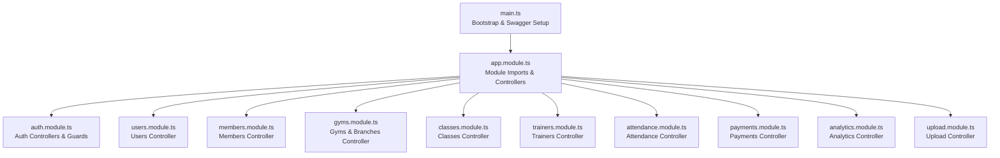
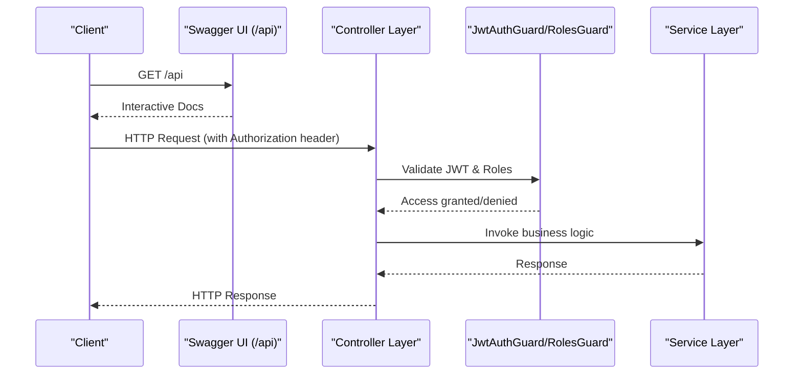
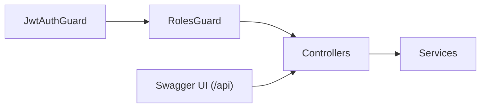

# API Reference

<cite>
**Referenced Files in This Document**
- [src/main.ts](file://src/main.ts)
- [src/app.module.ts](file://src/app.module.ts)
- [src/auth/auth.controller.ts](file://src/auth/auth.controller.ts)
- [src/auth/guards/jwt-auth.guard.ts](file://src/auth/guards/jwt-auth.guard.ts)
- [src/auth/guards/roles.guard.ts](file://src/auth/guards/roles.guard.ts)
- [src/auth/decorators/roles.decorator.ts](file://src/auth/decorators/roles.decorator.ts)
- [src/common/enums/role.enum.ts](file://src/common/enums/role.enum.ts)
- [src/common/enums/permissions.enum.ts](file://src/common/enums/permissions.enum.ts)
- [src/users/users.controller.ts](file://src/users/users.controller.ts)
- [src/members/members.controller.ts](file://src/members/members.controller.ts)
- [src/gyms/gyms.controller.ts](file://src/gyms/gyms.controller.ts)
- [src/classes/classes.controller.ts](file://src/classes/classes.controller.ts)
- [src/trainers/trainers.controller.ts](file://src/trainers/trainers.controller.ts)
- [src/attendance/attendance.controller.ts](file://src/attendance/attendance.controller.ts)
- [src/payments/payments.controller.ts](file://src/payments/payments.controller.ts)
- [src/analytics/analytics.controller.ts](file://src/analytics/analytics.controller.ts)
- [src/upload/upload.controller.ts](file://src/upload/upload.controller.ts)
</cite>

## Table of Contents
1. [Introduction](#introduction)
2. [Project Structure](#project-structure)
3. [Core Components](#core-components)
4. [Architecture Overview](#architecture-overview)
5. [Detailed Component Analysis](#detailed-component-analysis)
6. [Dependency Analysis](#dependency-analysis)
7. [Performance Considerations](#performance-considerations)
8. [Troubleshooting Guide](#troubleshooting-guide)
9. [Conclusion](#conclusion)
10. [Appendices](#appendices)

## Introduction
This document provides comprehensive API documentation for the gym management system. It covers all public REST endpoints across user management, member operations, gym administration, staff management, training programs, nutrition plans, subscriptions, payments, attendance tracking, analytics, and file upload modules. It explains authentication using JWT tokens, role-based access controls, branch-level permissions, request/response schemas, validation rules, error handling, rate limiting, pagination, filtering, API versioning, backward compatibility, deprecation policies, and OpenAPI/Swagger integration.

## Project Structure
The backend is a NestJS application with modular controllers and services. Swagger/OpenAPI is enabled to auto-generate interactive documentation. CORS is configured for development origins, and global validation pipes enforce DTO constraints.

**Diagram sources**
- [src/main.ts:1-70](file://src/main.ts#L1-L70)
- [src/app.module.ts:66-137](file://src/app.module.ts#L66-L137)

**Section sources**
- [src/main.ts:1-70](file://src/main.ts#L1-L70)
- [src/app.module.ts:1-138](file://src/app.module.ts#L1-L138)

## Core Components
- Authentication and Authorization
  - JWT bearer authentication configured globally and per-controller via Swagger.
  - Guards: JwtAuthGuard (JWT validation), RolesGuard (role enforcement).
  - Decorators: Roles(...) to define required roles per endpoint.
  - Enums: Role (SUPERADMIN, ADMIN, TRAINER, MEMBER) and Permissions mapping.

- Validation and Filters
  - Global ValidationPipe enforces DTO whitelisting, transformation, and non-whitelisted field rejection.
  - Query filters supported across endpoints (e.g., members, gyms, payments).

- OpenAPI/Swagger
  - Interactive docs served under /api with persistent auth support.
  - Tags organized per module (auth, users, gyms, branches, members, etc.).

**Section sources**
- [src/auth/auth.controller.ts:22-155](file://src/auth/auth.controller.ts#L22-L155)
- [src/auth/guards/jwt-auth.guard.ts:1-6](file://src/auth/guards/jwt-auth.guard.ts#L1-L6)
- [src/auth/guards/roles.guard.ts:1-42](file://src/auth/guards/roles.guard.ts#L1-L42)
- [src/auth/decorators/roles.decorator.ts:1-8](file://src/auth/decorators/roles.decorator.ts#L1-L8)
- [src/common/enums/role.enum.ts:1-7](file://src/common/enums/role.enum.ts#L1-L7)
- [src/common/enums/permissions.enum.ts:1-84](file://src/common/enums/permissions.enum.ts#L1-L84)
- [src/main.ts:28-65](file://src/main.ts#L28-L65)

## Architecture Overview
The API follows a layered architecture with controllers exposing endpoints, guards enforcing auth/roles, and services implementing business logic. Swagger integrates at bootstrap to document all endpoints.

**Diagram sources**
- [src/main.ts:28-65](file://src/main.ts#L28-L65)
- [src/auth/guards/jwt-auth.guard.ts:1-6](file://src/auth/guards/jwt-auth.guard.ts#L1-L6)
- [src/auth/guards/roles.guard.ts:1-42](file://src/auth/guards/roles.guard.ts#L1-L42)

## Detailed Component Analysis

### Authentication and Authorization
- Endpoint: POST /auth/login
  - Description: Authenticate user with email/password; returns JWT access token.
  - Auth: No prior auth required.
  - Response: LoginResponseDto with userid and access_token.
  - Errors: 401 Unauthorized for invalid credentials.

- Endpoint: POST /auth/otp/mobile/request
  - Description: Send mobile OTP via Twilio Verify to eligible member/trainer.
  - Auth: None.
  - Response: Success message and phoneNumber.

- Endpoint: POST /auth/otp/mobile/verify
  - Description: Verify OTP and return JWT token for eligible accounts.
  - Auth: None.
  - Response: LoginResponseDto.

- Endpoint: POST /auth/logout
  - Description: Logout user; client should discard token.
  - Auth: JWT required.
  - Response: Success message.

- Guards and Decorators
  - JwtAuthGuard validates JWT.
  - RolesGuard checks required roles set via @Roles(...).
  - Roles decorator sets metadata for RolesGuard.

- Role and Permission Model
  - Roles: SUPERADMIN, ADMIN, TRAINER, MEMBER.
  - Permissions mapped per role; ADMIN gets broad operational permissions.

**Section sources**
- [src/auth/auth.controller.ts:22-155](file://src/auth/auth.controller.ts#L22-L155)
- [src/auth/guards/jwt-auth.guard.ts:1-6](file://src/auth/guards/jwt-auth.guard.ts#L1-L6)
- [src/auth/guards/roles.guard.ts:1-42](file://src/auth/guards/roles.guard.ts#L1-L42)
- [src/auth/decorators/roles.decorator.ts:1-8](file://src/auth/decorators/roles.decorator.ts#L1-L8)
- [src/common/enums/role.enum.ts:1-7](file://src/common/enums/role.enum.ts#L1-L7)
- [src/common/enums/permissions.enum.ts:50-84](file://src/common/enums/permissions.enum.ts#L50-L84)

### Users Management
- Endpoint: POST /users
  - Description: Create a new user; requires ADMIN or SUPERADMIN.
  - Auth: JWT + RolesGuard.
  - Response: Created user DTO.
  - Errors: 409 Duplicate email.

- Endpoint: GET /users
  - Description: List all users; requires ADMIN or SUPERADMIN.
  - Auth: JWT + RolesGuard.
  - Response: Array of users.

- Endpoint: POST /users/change-password
  - Description: Change current user’s password; requires current password verification.
  - Auth: JWT.
  - Errors: 400 Invalid current password.

- Endpoint: GET /users/profile
  - Description: Get current user profile.
  - Auth: JWT.

- Endpoint: GET /users/:id
  - Description: Get user by ID.
  - Auth: JWT.

- Endpoint: PATCH /users/:id
  - Description: Update user; self-update or ADMIN/SUPERADMIN.
  - Auth: JWT.

- Endpoint: DELETE /users/:id
  - Description: Delete user; ADMIN or SUPERADMIN; irreversible.
  - Auth: JWT.

**Section sources**
- [src/users/users.controller.ts:28-344](file://src/users/users.controller.ts#L28-L344)

### Members Management
- Endpoint: POST /members
  - Description: Create member with branch, plan, optional classes; auto-creates user account.
  - Auth: JWT.
  - Errors: 400 Validation, 401 Unauthorized, 404 Branch/Plan not found, 409 Duplicate email.

- Endpoint: GET /members
  - Description: List members with optional filters: branchId, status, search.
  - Auth: JWT.

- Endpoint: GET /members/:id
  - Description: Get member by numeric ID.
  - Auth: JWT.

- Endpoint: PATCH /members/:id
  - Description: Update member; self-update or ADMIN/SUPERADMIN.
  - Auth: JWT.

- Endpoint: PATCH /members/admin/:id
  - Description: Admin-only update (status, branch, plan); requires ADMIN or SUPERADMIN.
  - Auth: JWT + RolesGuard.

- Endpoint: DELETE /members/:id
  - Description: Delete member and related data; ADMIN or SUPERADMIN.
  - Auth: JWT.

- Endpoint: GET /members/:memberId/dashboard
  - Description: Member dashboard data (subscriptions, attendance, goals).
  - Auth: JWT.

- Endpoint: GET /branches/:branchId/members
  - Description: List members for a branch with subscription/plan/class details; branch-level access.
  - Auth: JWT.
  - Errors: 400 Invalid UUID, 401 Unauthorized, 403 Forbidden, 404 Branch not found.

**Section sources**
- [src/members/members.controller.ts:34-728](file://src/members/members.controller.ts#L34-L728)

### Gym and Branch Administration
- Endpoint: POST /gyms
  - Description: Create gym; requires ADMIN or SUPERADMIN.
  - Auth: JWT + RolesGuard.

- Endpoint: GET /gyms
  - Description: List gyms with optional filters: location, search.
  - Auth: JWT.

- Endpoint: GET /gyms/:id
  - Description: Get gym with branches.
  - Auth: JWT.

- Endpoint: PATCH /gyms/:id
  - Description: Update gym; ADMIN or SUPERADMIN.
  - Auth: JWT + RolesGuard.

- Endpoint: DELETE /gyms/:id
  - Description: Delete gym and all branches; ADMIN or SUPERADMIN.
  - Auth: JWT + RolesGuard.

- Endpoint: POST /gyms/:gymId/branches
  - Description: Create branch for gym.
  - Auth: JWT + RolesGuard.

- Endpoint: GET /gyms/:gymId/branches
  - Description: List branches for gym.
  - Auth: JWT.

- Endpoint: GET /gyms/:gymId/members
  - Description: List members across all branches of a gym; branch-level access.
  - Auth: JWT.

- Endpoint: GET /gyms/:gymId/trainers
  - Description: List trainers for gym.
  - Auth: JWT.

- Endpoint: GET /branches
  - Description: List all branches across gyms; ADMIN or SUPERADMIN.
  - Auth: JWT + RolesGuard.

- Endpoint: GET /branches/:id
  - Description: Get branch details.
  - Auth: JWT.

- Endpoint: PATCH /branches/:id
  - Description: Update branch; ADMIN or SUPERADMIN.
  - Auth: JWT + RolesGuard.

- Endpoint: DELETE /branches/:id
  - Description: Delete branch; ADMIN or SUPERADMIN.
  - Auth: JWT + RolesGuard.

- Endpoint: GET /branches/:branchId/trainers
  - Description: List trainers for a branch.
  - Auth: JWT.

**Section sources**
- [src/gyms/gyms.controller.ts:30-517](file://src/gyms/gyms.controller.ts#L30-L517)

### Classes Management
- Endpoint: POST /classes
  - Description: Create class with scheduling/recurrence.
  - Auth: JWT.

- Endpoint: GET /classes
  - Description: List all classes.
  - Auth: JWT.

- Endpoint: GET /classes/:id
  - Description: Get class by UUID.
  - Auth: JWT.

- Endpoint: PATCH /classes/:id
  - Description: Update class; admin/branch manager.
  - Auth: JWT.

- Endpoint: DELETE /classes/:id
  - Description: Delete class; super admin only.
  - Auth: JWT.

- Endpoint: GET /branches/:branchId/classes
  - Description: List classes for a branch.
  - Auth: JWT.

- Endpoint: GET /gyms/:gymId/classes
  - Description: List classes across all branches of a gym.
  - Auth: JWT.

- Endpoint: GET /trainers/:trainerId/classes
  - Description: List classes for a trainer.
  - Auth: JWT.

**Section sources**
- [src/classes/classes.controller.ts:29-363](file://src/classes/classes.controller.ts#L29-L363)

### Trainers Management
- Endpoint: POST /trainers
  - Description: Create trainer.
  - Auth: JWT.

- Endpoint: GET /trainers
  - Description: List trainers with optional filters: branchId, specialization.
  - Auth: JWT.

- Endpoint: GET /trainers/:id
  - Description: Get trainer by ID.
  - Auth: JWT.

- Endpoint: PATCH /trainers/:id
  - Description: Update trainer; self-update or admin.
  - Auth: JWT.

- Endpoint: DELETE /trainers/:id
  - Description: Delete trainer; super admin only.
  - Auth: JWT.

- Endpoint: GET /branches/:branchId/trainers
  - Description: List trainers for a branch.
  - Auth: JWT.

**Section sources**
- [src/trainers/trainers.controller.ts:28-324](file://src/trainers/trainers.controller.ts#L28-L324)

### Attendance Tracking
- Endpoint: POST /attendance
  - Description: Mark attendance (gym visit, class, trainer arrival).
  - Auth: JWT.

- Endpoint: PATCH /attendance/:id/checkout
  - Description: Check out; calculate duration.
  - Auth: JWT.

- Endpoint: GET /attendance
  - Description: List all attendance records.
  - Auth: JWT.

- Endpoint: GET /attendance/:id
  - Description: Get attendance record by ID.
  - Auth: JWT.

- Endpoint: GET /members/:memberId/attendance
  - Description: Get member’s attendance records.
  - Auth: JWT.

- Endpoint: GET /trainers/:trainerId/attendance
  - Description: Get trainer’s attendance records.
  - Auth: JWT.

- Endpoint: GET /branches/:branchId/attendance
  - Description: Get branch attendance records.
  - Auth: JWT.

**Section sources**
- [src/attendance/attendance.controller.ts:23-360](file://src/attendance/attendance.controller.ts#L23-L360)

### Payments and Invoices
- Endpoint: POST /payments
  - Description: Record payment for an invoice; validates amount vs invoice total.
  - Auth: JWT.

- Endpoint: GET /payments
  - Description: List payments with optional filters.
  - Auth: JWT.

- Endpoint: GET /payments/summary
  - Description: Aggregated payment report by method/status.
  - Auth: JWT.

- Endpoint: GET /payments/:id
  - Description: Get payment by ID.
  - Auth: JWT.

- Endpoint: PATCH /payments/:id
  - Description: Verify or reject payment; admin only.
  - Auth: JWT + RolesGuard.

- Endpoint: POST /payments/:id/refund
  - Description: Issue refund; admin only.
  - Auth: JWT + RolesGuard.

- Endpoint: GET /invoices/:invoiceId/payments
  - Description: List payments for an invoice.
  - Auth: JWT.

- Endpoint: GET /invoices/:invoiceId/payment-summary
  - Description: Invoice payment summary.
  - Auth: JWT.

- Endpoint: GET /members/:memberId/payments
  - Description: Member payment history.
  - Auth: JWT.

**Section sources**
- [src/payments/payments.controller.ts:30-673](file://src/payments/payments.controller.ts#L30-L673)

### Analytics and Dashboards
- Endpoint: GET /analytics/gym/:gymId/dashboard
  - Description: Gym dashboard analytics.
  - Auth: JWT.

- Endpoint: GET /analytics/branch/:branchId/dashboard
  - Description: Branch dashboard analytics.
  - Auth: JWT.

- Endpoint: GET /analytics/gym/:gymId/members
  - Description: Gym member analytics.
  - Auth: JWT.

- Endpoint: GET /analytics/branch/:branchId/members
  - Description: Branch member analytics.
  - Auth: JWT.

- Endpoint: GET /analytics/gym/:gymId/attendance
  - Description: Gym attendance analytics.
  - Auth: JWT.

- Endpoint: GET /analytics/branch/:branchId/attendance
  - Description: Branch attendance analytics.
  - Auth: JWT.

- Endpoint: GET /analytics/gym/:gymId/payments/recent
  - Description: 10 most recent payments for gym.
  - Auth: JWT.

- Endpoint: GET /analytics/branch/:branchId/payments/recent
  - Description: 10 most recent payments for branch.
  - Auth: JWT.

- Endpoint: GET /analytics/trainer/:trainerId/dashboard
  - Description: Trainer dashboard analytics.
  - Auth: JWT.

**Section sources**
- [src/analytics/analytics.controller.ts:12-596](file://src/analytics/analytics.controller.ts#L12-L596)

### File Upload and Storage
- Endpoint: POST /upload/avatar
  - Description: Upload avatar; stored in role-based folder.
  - Auth: JWT + RolesGuard.

- Endpoint: POST /upload/document
  - Description: Upload document; role-based access rules apply.
  - Auth: JWT + RolesGuard.

- Endpoint: POST /upload/media
  - Description: Upload media; ADMIN/SUPERADMIN/TRAINER only.
  - Auth: JWT + RolesGuard.

- Endpoint: POST /upload/progress
  - Description: Upload progress photo; user-specific or trainer-assigned.
  - Auth: JWT + RolesGuard.

- Endpoint: POST /upload/presign
  - Description: Generate presigned upload URL; per-user role folder.
  - Auth: JWT + RolesGuard.

- Endpoint: GET /upload/:key
  - Description: Download file via presigned URL; access validation.
  - Auth: JWT + RolesGuard.

- Endpoint: DELETE /upload/:key
  - Description: Delete file; ADMIN/SUPERADMIN only.
  - Auth: JWT + RolesGuard.

- Endpoint: GET /upload/health/check
  - Description: Health check; public.

**Section sources**
- [src/upload/upload.controller.ts:24-167](file://src/upload/upload.controller.ts#L24-L167)

## Dependency Analysis
- Authentication pipeline
  - JwtAuthGuard authenticates JWT; RolesGuard enforces role metadata set by @Roles decorator.
- Module composition
  - AppModule imports all feature modules and exposes controllers; Swagger aggregates tags per module.

**Diagram sources**
- [src/auth/guards/jwt-auth.guard.ts:1-6](file://src/auth/guards/jwt-auth.guard.ts#L1-L6)
- [src/auth/guards/roles.guard.ts:1-42](file://src/auth/guards/roles.guard.ts#L1-L42)
- [src/main.ts:28-65](file://src/main.ts#L28-L65)

**Section sources**
- [src/auth/guards/jwt-auth.guard.ts:1-6](file://src/auth/guards/jwt-auth.guard.ts#L1-L6)
- [src/auth/guards/roles.guard.ts:1-42](file://src/auth/guards/roles.guard.ts#L1-L42)
- [src/app.module.ts:66-137](file://src/app.module.ts#L66-L137)

## Performance Considerations
- Pagination and Filtering
  - Use query filters (e.g., branchId, status, search) to limit result sets.
  - Prefer branch-level endpoints to avoid cross-branch scans.
- Caching
  - Consider caching static analytics dashboards for gyms/branches.
- Batch Operations
  - Combine related requests client-side to reduce round trips.
- Validation
  - DTO validation reduces downstream errors and improves throughput.

## Troubleshooting Guide
- Authentication Errors
  - 401 Unauthorized: Missing or invalid JWT token.
  - 403 Forbidden: Insufficient roles or branch-level access violation.
- Validation Errors
  - 400 Bad Request: DTO validation failures (e.g., invalid UUID, enum mismatch).
- Resource Not Found
  - 404 Not Found: Entity not found (e.g., member, trainer, branch, gym).
- Conflict Errors
  - 409 Conflict: Duplicate resource (e.g., user/email, member/email).

Common scenarios and resolutions:
- Member creation fails with validation errors: Review CreateMemberDto fields and constraints.
- Branch access denied: Ensure user belongs to the requested branch or has elevated role.
- Payment exceeds invoice total: Adjust CreatePaymentDto amount to match invoice total.

**Section sources**
- [src/members/members.controller.ts:124-177](file://src/members/members.controller.ts#L124-L177)
- [src/gyms/gyms.controller.ts:271-286](file://src/gyms/gyms.controller.ts#L271-L286)
- [src/payments/payments.controller.ts:48-93](file://src/payments/payments.controller.ts#L48-L93)
- [src/upload/upload.controller.ts:138-144](file://src/upload/upload.controller.ts#L138-L144)

## Conclusion
The gym management system exposes a comprehensive REST API with robust authentication and authorization, extensive analytics, and modular controllers covering all major business domains. Swagger integration provides interactive documentation, while guards and DTO validation ensure secure and predictable behavior.

## Appendices

### Authentication and Authorization
- JWT Bearer Token
  - Include Authorization header: Bearer YOUR_JWT_TOKEN
- Roles
  - SUPERADMIN: Full access
  - ADMIN: Operational access within scope
  - TRAINER: Assigned member and template access
  - MEMBER: Self-service access

**Section sources**
- [src/main.ts:32-42](file://src/main.ts#L32-L42)
- [src/common/enums/role.enum.ts:1-7](file://src/common/enums/role.enum.ts#L1-L7)
- [src/common/enums/permissions.enum.ts:50-84](file://src/common/enums/permissions.enum.ts#L50-L84)

### Rate Limiting and Throttling
- Not explicitly configured in the provided code. Consider adding throttler interceptors at the application or controller level as needed.

### Pagination and Filtering
- Supported via query parameters on list endpoints (e.g., GET /members, GET /payments, GET /gyms).
- Filtering examples:
  - GET /members?branchId={uuid}&status={active|inactive}&search={term}
  - GET /payments?method={cash|card|online|bank_transfer}&status={completed|pending|failed}&startDate=&endDate=

### API Versioning and Backward Compatibility
- Version: 1.0 (as per Swagger config).
- Backward compatibility: No explicit deprecation policy observed; maintain stable endpoints and return 404 for removed endpoints.

**Section sources**
- [src/main.ts:28-59](file://src/main.ts#L28-L59)

### OpenAPI/Swagger Integration
- Endpoint: /api
  - Interactive documentation with persisted authorization.
  - Tags: auth, users, gyms, branches, members, membership-plans, subscriptions, classes, trainers, assignments, attendance, audit-logs, analytics, roles, invoices, payments.

**Section sources**
- [src/main.ts:28-65](file://src/main.ts#L28-L65)

### Practical Usage Examples

- cURL Examples
  - Authenticate:
    - curl -X POST https://your-host/api/auth/login -H "Content-Type: application/json" -d '{"email":"member@example.com","password":"SecurePassword123!"}'
  - Get member dashboard:
    - curl -X GET https://your-host/api/members/123/dashboard -H "Authorization: Bearer YOUR_JWT_TOKEN"
  - Upload avatar:
    - curl -X POST https://your-host/api/upload/avatar -H "Authorization: Bearer YOUR_JWT_TOKEN" -F "file=@/path/to/avatar.jpg"

- JavaScript (Fetch) Examples
  - Authenticate:
    - fetch("https://your-host/api/auth/login", { method: "POST", headers: {"Content-Type":"application/json"}, body: JSON.stringify({email:"member@example.com",password:"SecurePassword123!"}) })
  - Get branch members:
    - fetch("https://your-host/api/branches/branch-uuid/members", { headers: {"Authorization":"Bearer YOUR_JWT_TOKEN"} })