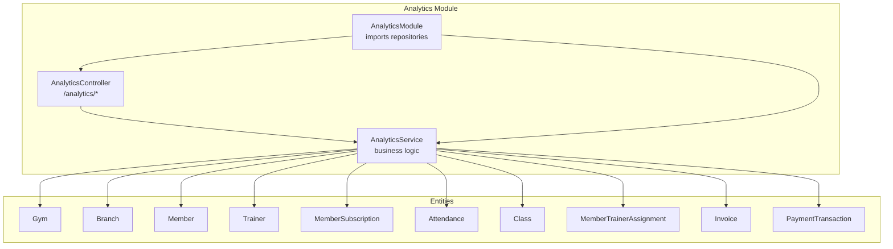
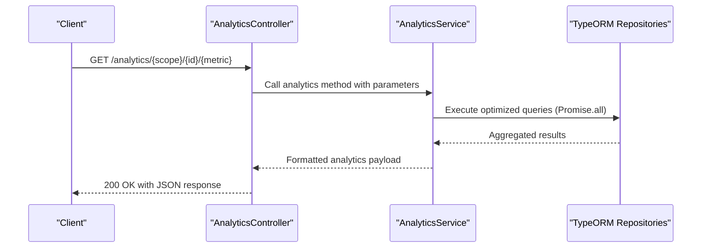
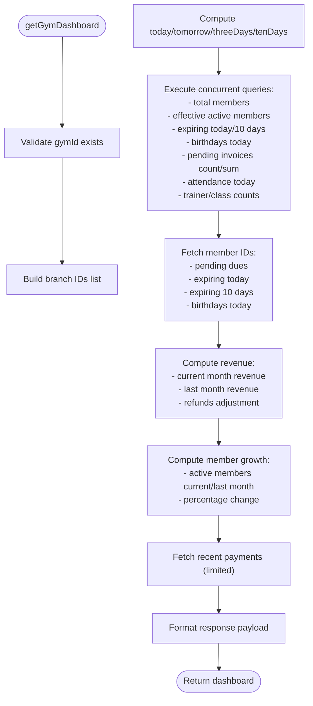
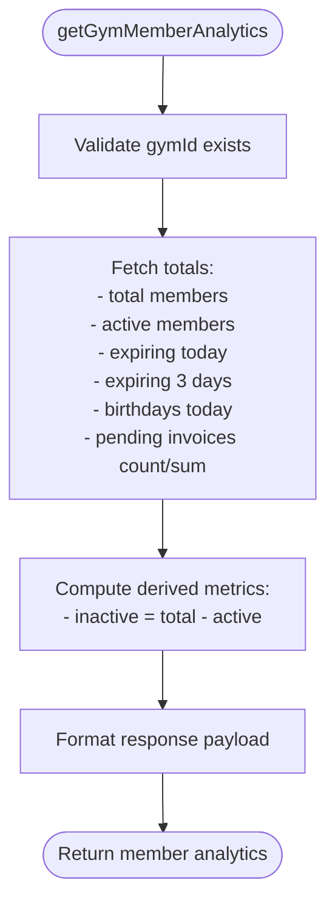
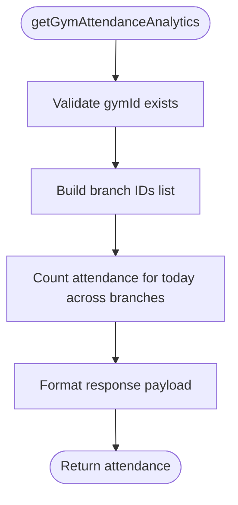
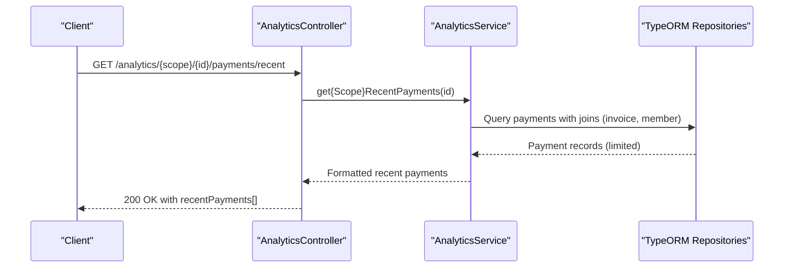
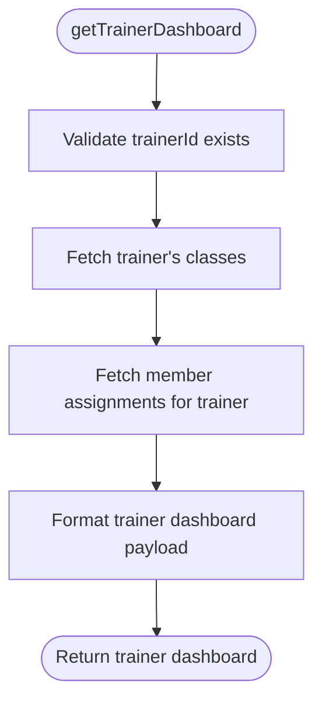

# Analytics & Reporting API

<cite>
**Referenced Files in This Document**
- [analytics.controller.ts](file://src/analytics/analytics.controller.ts)
- [analytics.service.ts](file://src/analytics/analytics.service.ts)
- [analytics.module.ts](file://src/analytics/analytics.module.ts)
</cite>

## Table of Contents
1. [Introduction](#introduction)
2. [Project Structure](#project-structure)
3. [Core Components](#core-components)
4. [Architecture Overview](#architecture-overview)
5. [Detailed Component Analysis](#detailed-component-analysis)
6. [API Reference](#api-reference)
7. [Performance Considerations](#performance-considerations)
8. [Troubleshooting Guide](#troubleshooting-guide)
9. [Conclusion](#conclusion)

## Introduction
This document provides comprehensive API documentation for the Analytics & Reporting module. It covers dashboard metrics, business intelligence, report generation, and data export capabilities. The endpoints under the `/analytics` base URL deliver real-time insights for gyms, branches, and trainers, including KPI metrics, membership trends, revenue reporting, and recent payment summaries. The documentation includes HTTP methods, URL patterns, request/response schemas, filtering options, aggregation functions, and practical examples with curl commands and JavaScript implementations.

## Project Structure
The Analytics module follows a clean NestJS architecture with a dedicated controller, service, and module. The service encapsulates all data access and computation logic, while the controller exposes REST endpoints secured with JWT authentication.



**Diagram sources**
- [analytics.controller.ts:12-14](file://src/analytics/analytics.controller.ts#L12-L14)
- [analytics.service.ts:21-44](file://src/analytics/analytics.service.ts#L21-L44)
- [analytics.module.ts:16-34](file://src/analytics/analytics.module.ts#L16-L34)

**Section sources**
- [analytics.controller.ts:12-14](file://src/analytics/analytics.controller.ts#L12-L14)
- [analytics.service.ts:21-44](file://src/analytics/analytics.service.ts#L21-L44)
- [analytics.module.ts:16-34](file://src/analytics/analytics.module.ts#L16-L34)

## Core Components
- AnalyticsController: Exposes REST endpoints for dashboards, member analytics, attendance, and recent payments for gyms, branches, and trainers. All endpoints are protected by JWT authentication.
- AnalyticsService: Implements business logic for computing analytics, aggregations, and data retrieval. Includes optimized queries, concurrent execution, and performance tuning via configurable limits.
- AnalyticsModule: Registers TypeORM repositories and wires the controller and service.

Key capabilities:
- Dashboard KPIs: Today's payments (online/cash), attendance, admissions, renewals, dues paid, member totals, active/inactive/expiring/birthday counts, revenue (current vs last month), and recent payments.
- Membership analytics: Total, active, inactive, expiring today/three days, birthdays today, and pending dues.
- Attendance analytics: Today's attendance per gym or branch.
- Recent payments: Top N recent transactions with member and invoice details.
- Trainer dashboard: Trainer info, assigned classes, stats, and assigned members.

**Section sources**
- [analytics.controller.ts:17-594](file://src/analytics/analytics.controller.ts#L17-L594)
- [analytics.service.ts:101-137](file://src/analytics/analytics.service.ts#L101-L137)
- [analytics.module.ts:16-34](file://src/analytics/analytics.module.ts#L16-L34)

## Architecture Overview
The Analytics API follows a layered architecture:
- Controller layer validates inputs and delegates to the service.
- Service layer performs optimized database queries using TypeORM and concurrent promises.
- Entities represent domain data with relationships for analytics computations.



**Diagram sources**
- [analytics.controller.ts:17-594](file://src/analytics/analytics.controller.ts#L17-L594)
- [analytics.service.ts:101-226](file://src/analytics/analytics.service.ts#L101-L226)

## Detailed Component Analysis

### Dashboard Analytics
- Gym dashboard: Returns KPIs for a gym, including today's metrics, member statistics, resource counts, revenue trend, member growth, and recent payments. Includes configurable limits for performance.
- Branch dashboard: Similar to gym dashboard scoped to a single branch.



**Diagram sources**
- [analytics.service.ts:101-226](file://src/analytics/analytics.service.ts#L101-L226)
- [analytics.service.ts:298-404](file://src/analytics/analytics.service.ts#L298-L404)

**Section sources**
- [analytics.controller.ts:17-136](file://src/analytics/analytics.controller.ts#L17-L136)
- [analytics.controller.ts:138-254](file://src/analytics/analytics.controller.ts#L138-L254)
- [analytics.service.ts:101-137](file://src/analytics/analytics.service.ts#L101-L137)

### Member Analytics
- Gym member analytics: Provides totals, active, inactive, expiring today/three days, birthdays today, pending dues count, and total pending amount.
- Branch member analytics: Same metrics scoped to a branch.



**Diagram sources**
- [analytics.service.ts:676-783](file://src/analytics/analytics.service.ts#L676-L783)

**Section sources**
- [analytics.controller.ts:256-299](file://src/analytics/analytics.controller.ts#L256-L299)
- [analytics.controller.ts:301-348](file://src/analytics/analytics.controller.ts#L301-L348)
- [analytics.service.ts:676-783](file://src/analytics/analytics.service.ts#L676-L783)

### Attendance Analytics
- Gym attendance analytics: Returns today's attendance across all branches of a gym.
- Branch attendance analytics: Returns today's attendance for a specific branch.



**Diagram sources**
- [analytics.service.ts:1282-1314](file://src/analytics/analytics.service.ts#L1282-L1314)

**Section sources**
- [analytics.controller.ts:350-383](file://src/analytics/analytics.controller.ts#L350-L383)
- [analytics.controller.ts:385-422](file://src/analytics/analytics.controller.ts#L385-L422)
- [analytics.service.ts:1282-1344](file://src/analytics/analytics.service.ts#L1282-L1344)

### Recent Payments
- Gym recent payments: Returns top N recent payment transactions for a gym with member and invoice details.
- Branch recent payments: Returns top N recent payment transactions for a branch.



**Diagram sources**
- [analytics.controller.ts:424-477](file://src/analytics/analytics.controller.ts#L424-L477)
- [analytics.controller.ts:479-536](file://src/analytics/analytics.controller.ts#L479-L536)
- [analytics.service.ts:1350-1411](file://src/analytics/analytics.service.ts#L1350-L1411)

**Section sources**
- [analytics.controller.ts:424-477](file://src/analytics/analytics.controller.ts#L424-L477)
- [analytics.controller.ts:479-536](file://src/analytics/analytics.controller.ts#L479-L536)
- [analytics.service.ts:1350-1411](file://src/analytics/analytics.service.ts#L1350-L1411)

### Trainer Dashboard
- Trainer dashboard: Returns trainer profile, assigned classes, stats (total classes, total members), and assigned members.



**Diagram sources**
- [analytics.service.ts:1416-1456](file://src/analytics/analytics.service.ts#L1416-L1456)

**Section sources**
- [analytics.controller.ts:538-594](file://src/analytics/analytics.controller.ts#L538-L594)
- [analytics.service.ts:1416-1456](file://src/analytics/analytics.service.ts#L1416-L1456)

## API Reference

### Authentication
- All endpoints require a valid JWT Bearer token.
- Header: Authorization: Bearer <token>

### Endpoints

#### Gym Dashboards
- Method: GET
- Path: /analytics/gym/{gymId}/dashboard
- Description: Retrieve gym dashboard analytics including today's metrics, member statistics, resources, revenue trend, member growth, and recent payments.
- Path Parameters:
  - gymId (string): Gym identifier
- Response Schema (selected fields):
  - gym: { id, name, branchId, branchName }
  - today: { payments: { online, cash }, attendance, admissions, renewals, duesPaid }
  - members: { total, active: { current_active, lastMonth_active, change: { percent, type } }, inactive, expiring: { today, next10Days, member_id[] }, birthdays: { today, member_id[] }, dues: { count, totalAmount, members_id[] } }
  - resources: { trainers: { count, trainers_id[] }, classes: { count, classes_id[] } }
  - revenue: { current, lastMonth, change: { percent, type } }
  - memberGrowth: { current, lastMonth, change: { percent, type } }
  - recentPayments: array of payment records
- Example curl:
  ```bash
  curl -H "Authorization: Bearer $TOKEN" https://yourdomain.com/analytics/gym/gym-123/dashboard
  ```
- Example JavaScript fetch:
  ```javascript
  const response = await fetch("https://yourdomain.com/analytics/gym/gym-123/dashboard", {
    headers: { "Authorization": `Bearer ${token}` }
  });
  const data = await response.json();
  ```

#### Branch Dashboards
- Method: GET
- Path: /analytics/branch/{branchId}/dashboard
- Description: Retrieve branch dashboard analytics including today's metrics, member statistics, resources, revenue trend, member growth, and recent payments.
- Path Parameters:
  - branchId (string): Branch identifier
- Response Schema: Similar to gym dashboard, scoped to branch.
- Example curl:
  ```bash
  curl -H "Authorization: Bearer $TOKEN" https://yourdomain.com/analytics/branch/branch-456/dashboard
  ```

#### Gym Member Analytics
- Method: GET
- Path: /analytics/gym/{gymId}/members
- Description: Retrieve member analytics for a gym.
- Path Parameters:
  - gymId (string): Gym identifier
- Response Schema:
  - gymId, gymName
  - members: { total, active, inactive, expiringToday, amount_due_members, total_amount_due, expiring3days, birthday_today }
- Example curl:
  ```bash
  curl -H "Authorization: Bearer $TOKEN" https://yourdomain.com/analytics/gym/gym-123/members
  ```

#### Branch Member Analytics
- Method: GET
- Path: /analytics/branch/{branchId}/members
- Description: Retrieve member analytics for a branch.
- Path Parameters:
  - branchId (string): Branch identifier
- Response Schema:
  - gymId, gymName, branchId, branchName
  - members: { total, active, inactive, expiringToday, expiring3days, birthday_today, amount_due_members }
- Example curl:
  ```bash
  curl -H "Authorization: Bearer $TOKEN" https://yourdomain.com/analytics/branch/branch-456/members
  ```

#### Gym Attendance Analytics
- Method: GET
- Path: /analytics/gym/{gymId}/attendance
- Description: Retrieve today's attendance for a gym.
- Path Parameters:
  - gymId (string): Gym identifier
- Response Schema:
  - gymId, gymName, branchId, branchName
  - attendance: { today }
- Example curl:
  ```bash
  curl -H "Authorization: Bearer $TOKEN" https://yourdomain.com/analytics/gym/gym-123/attendance
  ```

#### Branch Attendance Analytics
- Method: GET
- Path: /analytics/branch/{branchId}/attendance
- Description: Retrieve today's attendance for a branch.
- Path Parameters:
  - branchId (string): Branch identifier
- Response Schema:
  - gymId, gymName, branchId, branchName
  - attendance: { today }
- Example curl:
  ```bash
  curl -H "Authorization: Bearer $TOKEN" https://yourdomain.com/analytics/branch/branch-456/attendance
  ```

#### Gym Recent Payments
- Method: GET
- Path: /analytics/gym/{gymId}/payments/recent
- Description: Retrieve up to 10 most recent payment transactions for a gym.
- Path Parameters:
  - gymId (string): Gym identifier
- Response Schema:
  - gymId, gymName, branchId, branchName
  - recentPayments: array of { transactionId, amount, method, status, referenceNumber, notes, createdAt, member: { id, fullName }, invoice: { invoiceId, totalAmount } }
- Example curl:
  ```bash
  curl -H "Authorization: Bearer $TOKEN" https://yourdomain.com/analytics/gym/gym-123/payments/recent
  ```

#### Branch Recent Payments
- Method: GET
- Path: /analytics/branch/{branchId}/payments/recent
- Description: Retrieve up to 10 most recent payment transactions for a branch.
- Path Parameters:
  - branchId (string): Branch identifier
- Response Schema:
  - gymId, gymName, branchId, branchName
  - recentPayments: array of { transactionId, amount, method, status, referenceNumber, notes, createdAt, member: { id, fullName }, invoice: { invoiceId, totalAmount } }
- Example curl:
  ```bash
  curl -H "Authorization: Bearer $TOKEN" https://yourdomain.com/analytics/branch/branch-456/payments/recent
  ```

#### Trainer Dashboard
- Method: GET
- Path: /analytics/trainer/{trainerId}/dashboard
- Description: Retrieve trainer dashboard including profile, classes, stats, and assigned members.
- Path Parameters:
  - trainerId (string): Trainer identifier
- Response Schema:
  - trainer: { id, fullName, email, phone, specialization, avatarUrl }
  - classes: array of { class_id, name, description, timings, recurrence_type, days_of_week[] }
  - stats: { totalClasses, totalMembers }
  - assignedMembers: array of { id, fullName, email, phone }
- Example curl:
  ```bash
  curl -H "Authorization: Bearer $TOKEN" https://yourdomain.com/analytics/trainer/1/dashboard
  ```

### Filtering and Aggregation Functions
- Time-based filters:
  - Today: start of day to start of next day
  - This month: first day of current month to first day of next month
  - Last month: first day of last month to first day of current month
- Aggregations:
  - COUNT(DISTINCT member.id) for active members
  - SUM(invoice.total_amount) for pending dues
  - Conditional counting for expiring members and birthdays
- Concurrency:
  - Promise.all used to execute multiple queries in parallel for performance

### Data Export Capabilities
- The current endpoints return JSON responses suitable for client-side consumption and visualization.
- No built-in CSV/Excel export endpoints are present in the codebase. To implement export, clients can:
  - Fetch analytics data via existing endpoints
  - Transform and export to desired format in the frontend or a downstream service

### Real-time Analytics
- Real-time indicators:
  - Today's metrics (payments, attendance, admissions, renewals, dues paid)
  - Pending dues and expiring memberships
- Performance optimization:
  - Configurable limits for dashboard details (maxTrainers, maxClasses, maxRecentPayments)
  - Efficient SQL queries with BETWEEN and EXTRACT conditions
  - Concurrent query execution to minimize latency

**Section sources**
- [analytics.controller.ts:17-594](file://src/analytics/analytics.controller.ts#L17-L594)
- [analytics.service.ts:101-137](file://src/analytics/analytics.service.ts#L101-L137)
- [analytics.service.ts:406-587](file://src/analytics/analytics.service.ts#L406-L587)
- [analytics.service.ts:94-100](file://src/analytics/analytics.service.ts#L94-L100)

## Performance Considerations
- Concurrency: Multiple analytics metrics are computed concurrently using Promise.all to reduce total response time.
- Query optimization:
  - Use of BETWEEN for date ranges
  - EXTRACT for efficient birthday filtering
  - Aggregation queries with COUNT and SUM
- Configurable limits:
  - Dashboard details can be limited via options to control payload size and computation cost.
- Indexing recommendations (general guidance):
  - Add indexes on member.branchBranchId, subscription.endDate, invoice.status, payment.created_at, and attendance.date for optimal query performance.

[No sources needed since this section provides general guidance]

## Troubleshooting Guide
Common error responses:
- Gym not found:
  - Status: 404 Not Found
  - Example response: { statusCode: 404, message: "Gym with ID gym-999 not found", error: "Not Found" }
- Branch not found:
  - Status: 404 Not Found
  - Example response: { statusCode: 404, message: "Branch with ID branch-999 not found", error: "Not Found" }
- Trainer not found:
  - Status: 404 Not Found
  - Example response: { statusCode: 404, message: "Trainer with ID 999 not found", error: "Not Found" }

Validation and permission errors:
- Unauthorized or invalid token: Typically results in 401 Unauthorized at the gateway level before reaching the controller.
- Insufficient permissions: Access is controlled by the JWT guard; ensure the token belongs to a user with appropriate roles.

**Section sources**
- [analytics.controller.ts:123-133](file://src/analytics/analytics.controller.ts#L123-L133)
- [analytics.controller.ts:241-251](file://src/analytics/analytics.controller.ts#L241-L251)
- [analytics.controller.ts:581-591](file://src/analytics/analytics.controller.ts#L581-L591)

## Conclusion
The Analytics & Reporting API provides comprehensive, real-time insights for gyms, branches, and trainers. Its modular design, optimized queries, and concurrency ensure responsive performance. Clients can retrieve KPI dashboards, membership trends, revenue analytics, and recent payments, enabling informed business decisions. While built-in export endpoints are not present, the JSON responses are easily consumable for client-side visualization and external export implementations.