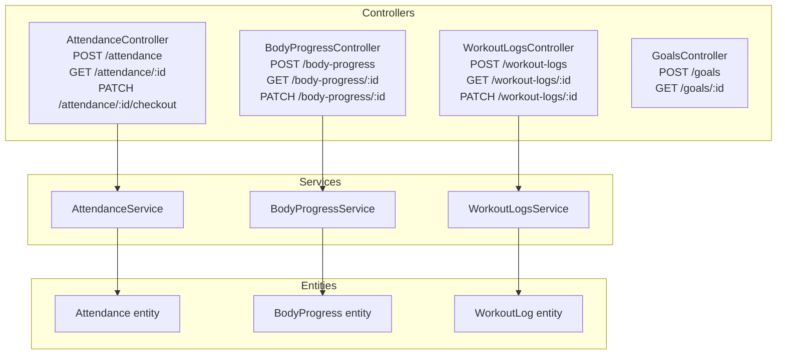
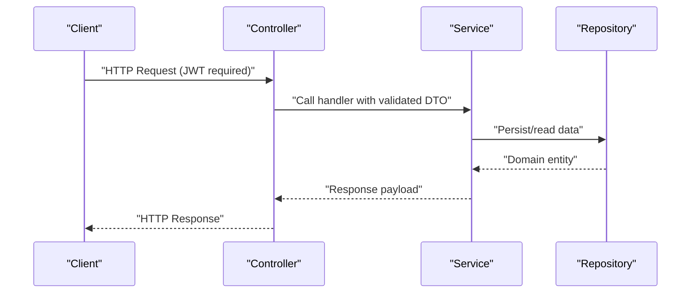
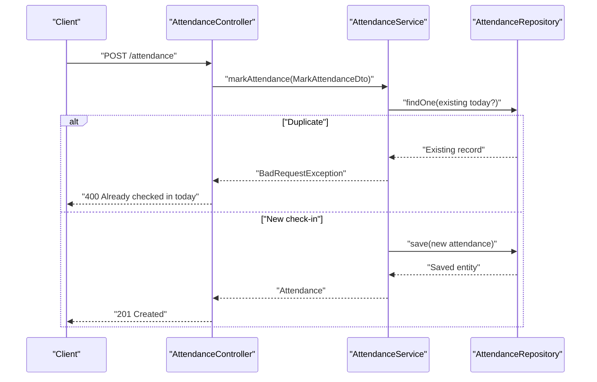
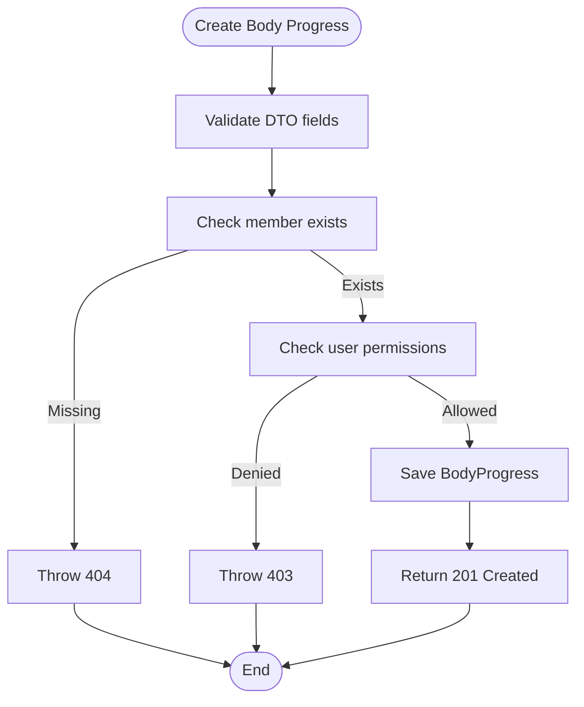
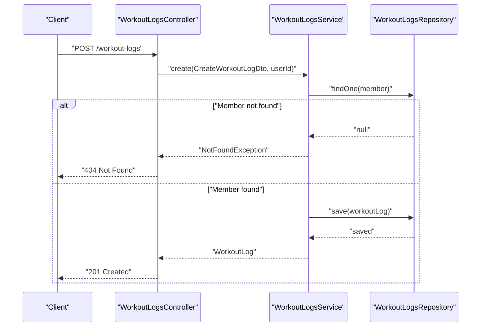
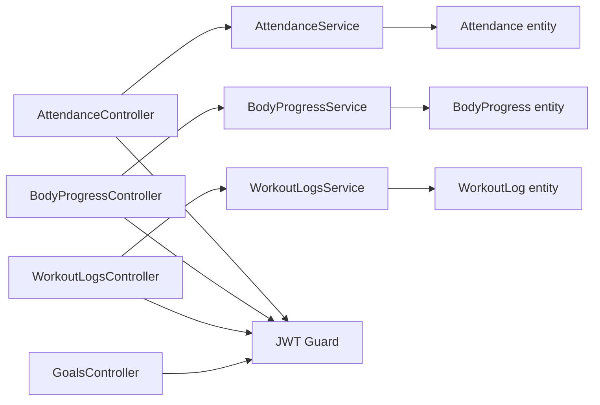

# Attendance & Progress API

<cite>
**Referenced Files in This Document**
- [src/attendance/attendance.controller.ts](file://src/attendance/attendance.controller.ts)
- [src/attendance/attendance.service.ts](file://src/attendance/attendance.service.ts)
- [src/attendance/dto/mark-attendance.dto.ts](file://src/attendance/dto/mark-attendance.dto.ts)
- [src/body-progress/body-progress.controller.ts](file://src/body-progress/body-progress.controller.ts)
- [src/body-progress/body-progress.service.ts](file://src/body-progress/body-progress.service.ts)
- [src/body-progress/dto/create-body-progress.dto.ts](file://src/body-progress/dto/create-body-progress.dto.ts)
- [src/workout-logs/workout-logs.controller.ts](file://src/workout-logs/workout-logs.controller.ts)
- [src/workout-logs/workout-logs.service.ts](file://src/workout-logs/workout-logs.service.ts)
- [src/workout-logs/dto/create-workout-log.dto.ts](file://src/workout-logs/dto/create-workout-log.dto.ts)
- [src/goals/goals.controller.ts](file://src/goals/goals.controller.ts)
- [src/goals/dto/create-goal.dto.ts](file://src/goals/dto/create-goal.dto.ts)
- [src/entities/attendance.entity.ts](file://src/entities/attendance.entity.ts)
- [src/entities/body_progress.entity.ts](file://src/entities/body_progress.entity.ts)
- [src/entities/workout_logs.entity.ts](file://src/entities/workout_logs.entity.ts)
- [src/auth/guards/jwt-auth.guard.ts](file://src/auth/guards/jwt-auth.guard.ts)
</cite>

## Table of Contents
1. [Introduction](#introduction)
2. [Project Structure](#project-structure)
3. [Core Components](#core-components)
4. [Architecture Overview](#architecture-overview)
5. [Detailed Component Analysis](#detailed-component-analysis)
6. [Dependency Analysis](#dependency-analysis)
7. [Performance Considerations](#performance-considerations)
8. [Troubleshooting Guide](#troubleshooting-guide)
9. [Conclusion](#conclusion)
10. [Appendices](#appendices)

## Introduction
This document describes the Attendance & Progress APIs for a gym management system. It covers endpoints for:
- Attendance logging (check-in/check-out)
- Goal setting and tracking
- Body measurements and progress monitoring
- Workout activity logging

It includes HTTP method, URL pattern, request/response schemas, validation rules, health metrics management, workflows, examples, and error handling.

## Project Structure
The relevant modules are organized by feature:
- Attendance: controller, service, DTOs, and entity
- Body Progress: controller, service, DTOs, and entity
- Workout Logs: controller, service, DTOs, and entity
- Goals: controller and DTOs
- Authentication: JWT guard used across protected endpoints

**Diagram sources**
- [src/attendance/attendance.controller.ts:24-221](file://src/attendance/attendance.controller.ts#L24-L221)
- [src/body-progress/body-progress.controller.ts:30-800](file://src/body-progress/body-progress.controller.ts#L30-L800)
- [src/workout-logs/workout-logs.controller.ts:30-800](file://src/workout-logs/workout-logs.controller.ts#L30-L800)
- [src/goals/goals.controller.ts:31-282](file://src/goals/goals.controller.ts#L31-L282)
- [src/attendance/attendance.service.ts:17-395](file://src/attendance/attendance.service.ts#L17-L395)
- [src/body-progress/body-progress.service.ts:15-290](file://src/body-progress/body-progress.service.ts#L15-L290)
- [src/workout-logs/workout-logs.service.ts:15-283](file://src/workout-logs/workout-logs.service.ts#L15-L283)
- [src/entities/attendance.entity.ts:12-44](file://src/entities/attendance.entity.ts#L12-L44)
- [src/entities/body_progress.entity.ts:12-47](file://src/entities/body_progress.entity.ts#L12-L47)
- [src/entities/workout_logs.entity.ts:12-50](file://src/entities/workout_logs.entity.ts#L12-L50)

**Section sources**
- [src/attendance/attendance.controller.ts:24-221](file://src/attendance/attendance.controller.ts#L24-L221)
- [src/body-progress/body-progress.controller.ts:30-800](file://src/body-progress/body-progress.controller.ts#L30-L800)
- [src/workout-logs/workout-logs.controller.ts:30-800](file://src/workout-logs/workout-logs.controller.ts#L30-L800)
- [src/goals/goals.controller.ts:31-282](file://src/goals/goals.controller.ts#L31-L282)

## Core Components
- AttendanceController: Handles attendance check-in, check-out, and retrieval by ID or filters.
- BodyProgressController: Manages body measurements and progress records with pagination, filtering, and user-scoped queries.
- WorkoutLogsController: Records workout sessions with exercise details, metrics, and feedback.
- GoalsController: Creates, retrieves, updates, and deletes goals with milestone support.
- Services: Implement business logic, validations, and persistence.
- DTOs: Define request schemas and validation rules.
- Entities: Represent persisted data models.

**Section sources**
- [src/attendance/attendance.controller.ts:24-221](file://src/attendance/attendance.controller.ts#L24-L221)
- [src/body-progress/body-progress.controller.ts:30-800](file://src/body-progress/body-progress.controller.ts#L30-L800)
- [src/workout-logs/workout-logs.controller.ts:30-800](file://src/workout-logs/workout-logs.controller.ts#L30-L800)
- [src/goals/goals.controller.ts:31-282](file://src/goals/goals.controller.ts#L31-L282)
- [src/attendance/attendance.service.ts:17-395](file://src/attendance/attendance.service.ts#L17-L395)
- [src/body-progress/body-progress.service.ts:15-290](file://src/body-progress/body-progress.service.ts#L15-L290)
- [src/workout-logs/workout-logs.service.ts:15-283](file://src/workout-logs/workout-logs.service.ts#L15-L283)
- [src/attendance/dto/mark-attendance.dto.ts:10-35](file://src/attendance/dto/mark-attendance.dto.ts#L10-L35)
- [src/body-progress/dto/create-body-progress.dto.ts:4-74](file://src/body-progress/dto/create-body-progress.dto.ts#L4-L74)
- [src/workout-logs/dto/create-workout-log.dto.ts:10-80](file://src/workout-logs/dto/create-workout-log.dto.ts#L10-L80)
- [src/goals/dto/create-goal.dto.ts:4-81](file://src/goals/dto/create-goal.dto.ts#L4-L81)

## Architecture Overview
The API follows a layered architecture:
- Controllers expose REST endpoints and apply JWT authentication.
- Services encapsulate domain logic and enforce permissions.
- DTOs validate incoming requests.
- TypeORM entities define persistence models.

**Diagram sources**
- [src/attendance/attendance.controller.ts:24-221](file://src/attendance/attendance.controller.ts#L24-L221)
- [src/attendance/attendance.service.ts:17-395](file://src/attendance/attendance.service.ts#L17-L395)
- [src/body-progress/body-progress.controller.ts:30-800](file://src/body-progress/body-progress.controller.ts#L30-L800)
- [src/body-progress/body-progress.service.ts:15-290](file://src/body-progress/body-progress.service.ts#L15-L290)
- [src/workout-logs/workout-logs.controller.ts:30-800](file://src/workout-logs/workout-logs.controller.ts#L30-L800)
- [src/workout-logs/workout-logs.service.ts:15-283](file://src/workout-logs/workout-logs.service.ts#L15-L283)

## Detailed Component Analysis

### Attendance Logging
- Base URL: /attendance
- Authentication: JWT required
- Methods:
  - POST /attendance: Mark attendance (check-in)
  - PATCH /attendance/{id}/checkout: Record check-out
  - GET /attendance: List all records
  - GET /attendance/{id}: Retrieve a record
  - GET /members/{memberId}/attendance: Member’s attendance
  - GET /trainers/{trainerId}/attendance: Trainer’s attendance
  - GET /branches/{branchId}/attendance: Branch attendance

Validation rules (request schema):
- MarkAttendanceDto:
  - memberId: integer, optional (mutually exclusive with trainerId)
  - trainerId: integer, optional (mutually exclusive with memberId)
  - branchId: UUID (required)
  - notes: string, optional

Timestamp validation:
- Check-in occurs at request time; daily uniqueness enforced by date+branch+entity.

Example request (curl):
- POST /attendance
  - Header: Authorization: Bearer <token>
  - Body: { "memberId": 1001, "branchId": "<branch-uuid>", "notes": "Morning workout" }

Example response:
- 201 Created with attendance record including id, checkInTime, date, and related entities.

Error responses:
- 400 Bad Request: Already checked in today
- 401 Unauthorized: Missing/invalid token
- 403 Forbidden: Insufficient permissions
- 404 Not Found: Branch/member/trainer not found
- 409 Conflict: Duplicate attendance
- 500 Internal Server Error

**Diagram sources**
- [src/attendance/attendance.controller.ts:28-105](file://src/attendance/attendance.controller.ts#L28-L105)
- [src/attendance/attendance.service.ts:32-99](file://src/attendance/attendance.service.ts#L32-L99)
- [src/attendance/dto/mark-attendance.dto.ts:10-35](file://src/attendance/dto/mark-attendance.dto.ts#L10-L35)

**Section sources**
- [src/attendance/attendance.controller.ts:24-221](file://src/attendance/attendance.controller.ts#L24-L221)
- [src/attendance/attendance.service.ts:17-395](file://src/attendance/attendance.service.ts#L17-L395)
- [src/attendance/dto/mark-attendance.dto.ts:10-35](file://src/attendance/dto/mark-attendance.dto.ts#L10-L35)
- [src/entities/attendance.entity.ts:12-44](file://src/entities/attendance.entity.ts#L12-L44)

### Body Measurements and Progress Monitoring
- Base URL: /body-progress
- Authentication: JWT required
- Methods:
  - POST /body-progress: Create progress record
  - GET /body-progress: List with pagination and filters
  - GET /body-progress/{id}: Retrieve record
  - PATCH /body-progress/{id}: Update record
  - DELETE /body-progress/{id}: Delete record
  - GET /body-progress/member/{memberId}: Member’s progress
  - GET /body-progress/user/my-body-progress: Records created by current user

Request schema (create):
- CreateBodyProgressDto:
  - memberId: number (required)
  - trainerId: number, optional
  - weight: number, optional
  - body_fat: number, optional
  - bmi: number, optional
  - measurements: JSON object, optional
  - progress_photos: JSON object, optional
  - date: ISO date string (required)

Validation rules:
- Required fields: memberId, date
- Optional fields: weight, body_fat, bmi, measurements, progress_photos, trainerId
- Permissions:
  - ADMIN/TRAINER can create/update/delete for any member
  - MEMBER can only act on self if allowed by member flag

Example request (curl):
- POST /body-progress
  - Header: Authorization: Bearer <token>
  - Body: { "memberId": 123, "weight": 75.5, "measurements": { "chest": 100, "waist": 85 }, "date": "2024-01-15" }

Example response:
- 201 Created with full record including member info and timestamps.

Error responses:
- 400 Bad Request: Invalid data
- 403 Forbidden: Permission denied
- 404 Not Found: Member not found
- 409 Conflict: Duplicate record for same date
- 500 Internal Server Error

**Diagram sources**
- [src/body-progress/body-progress.controller.ts:34-145](file://src/body-progress/body-progress.controller.ts#L34-L145)
- [src/body-progress/body-progress.service.ts:28-103](file://src/body-progress/body-progress.service.ts#L28-L103)
- [src/body-progress/dto/create-body-progress.dto.ts:4-74](file://src/body-progress/dto/create-body-progress.dto.ts#L4-L74)

**Section sources**
- [src/body-progress/body-progress.controller.ts:30-800](file://src/body-progress/body-progress.controller.ts#L30-L800)
- [src/body-progress/body-progress.service.ts:15-290](file://src/body-progress/body-progress.service.ts#L15-L290)
- [src/body-progress/dto/create-body-progress.dto.ts:4-74](file://src/body-progress/dto/create-body-progress.dto.ts#L4-L74)
- [src/entities/body_progress.entity.ts:12-47](file://src/entities/body_progress.entity.ts#L12-L47)

### Workout Activity Tracking
- Base URL: /workout-logs
- Authentication: JWT required
- Methods:
  - POST /workout-logs: Create workout log
  - GET /workout-logs: List with filters and analytics
  - GET /workout-logs/{id}: Retrieve log
  - PATCH /workout-logs/{id}: Update log
  - DELETE /workout-logs/{id}: Delete log

Request schema (create):
- CreateWorkoutLogDto:
  - memberId: number (required)
  - trainerId: number, optional
  - exercise_name: string (required)
  - sets: integer, optional
  - reps: integer, optional
  - weight: number, optional
  - duration: integer (minutes), optional
  - notes: string, optional
  - date: ISO date string (required)

Validation rules:
- Required fields: memberId, exercise_name, date
- Optional numeric fields with defaults applied by service

Permissions:
- ADMIN/TRAINER can operate freely
- MEMBER can only create/update/delete for self if allowed

Example request (curl):
- POST /workout-logs
  - Header: Authorization: Bearer <token>
  - Body: { "memberId": 123, "exercise_name": "Bench Press", "sets": 3, "reps": 12, "weight": 80, "date": "2024-01-15" }

Example response:
- 201 Created with full log including member/trainer metadata.

Error responses:
- 400 Bad Request: Invalid data
- 403 Forbidden: Permission denied
- 404 Not Found: Member not found
- 500 Internal Server Error

**Diagram sources**
- [src/workout-logs/workout-logs.controller.ts:34-291](file://src/workout-logs/workout-logs.controller.ts#L34-L291)
- [src/workout-logs/workout-logs.service.ts:28-104](file://src/workout-logs/workout-logs.service.ts#L28-L104)
- [src/workout-logs/dto/create-workout-log.dto.ts:10-80](file://src/workout-logs/dto/create-workout-log.dto.ts#L10-L80)

**Section sources**
- [src/workout-logs/workout-logs.controller.ts:30-800](file://src/workout-logs/workout-logs.controller.ts#L30-L800)
- [src/workout-logs/workout-logs.service.ts:15-283](file://src/workout-logs/workout-logs.service.ts#L15-L283)
- [src/workout-logs/dto/create-workout-log.dto.ts:10-80](file://src/workout-logs/dto/create-workout-log.dto.ts#L10-L80)
- [src/entities/workout_logs.entity.ts:12-50](file://src/entities/workout_logs.entity.ts#L12-L50)

### Goal Setting and Milestone Tracking
- Base URL: /goals
- Authentication: JWT required
- Methods:
  - POST /goals: Create a goal
  - GET /goals: List goals with filters
  - GET /goals/{id}: Retrieve goal
  - PATCH /goals/{id}: Update goal
  - DELETE /goals/{id}: Delete goal
  - GET /goals/member/{memberId}: Goals for a member
  - GET /goals/user/my-goals: Goals assigned by current user

Request schema (create):
- CreateGoalDto:
  - memberId: number (required)
  - trainerId: number, optional
  - goal_type: string (required)
  - target_value: number, optional
  - target_timeline: string (ISO date), optional
  - milestone: JSON object, optional
  - status: string, optional
  - completion_percent: number (0–100), optional
  - is_managed_by_member: boolean, optional

Validation rules:
- Required: memberId, goal_type
- Optional: target_value, target_timeline, milestone, status, completion_percent, is_managed_by_member

Permissions:
- Typically restricted to trainers/administrators; members may create self-managed goals depending on configuration.

Example request (curl):
- POST /goals
  - Header: Authorization: Bearer <token>
  - Body: { "memberId": 123, "goal_type": "Weight Loss", "target_value": 10, "milestone": { "month1": "Lose 2 kg" }, "status": "active" }

Example response:
- 201 Created with goal object including computed fields.

Error responses:
- 400 Bad Request: Invalid data
- 401 Unauthorized: Missing/invalid token
- 403 Forbidden: Insufficient permissions
- 404 Not Found: Member not found
- 500 Internal Server Error

**Section sources**
- [src/goals/goals.controller.ts:31-282](file://src/goals/goals.controller.ts#L31-L282)
- [src/goals/dto/create-goal.dto.ts:4-81](file://src/goals/dto/create-goal.dto.ts#L4-L81)

### Health Metrics Management
- Attendance:
  - Tracks check-in/check-out times, session durations, and daily counts.
  - Daily uniqueness prevents duplicate check-ins.
- Body Progress:
  - Stores weight, body fat%, BMI, measurements, and photos.
  - Supports chronological retrieval and summary statistics.
- Workout Logs:
  - Captures exercise details, sets/reps/weight, duration, heart rate, and feedback.
  - Provides analytics (totals, averages, popular types).
- Goals:
  - Tracks milestones and completion percent; supports status transitions.

**Section sources**
- [src/attendance/attendance.service.ts:32-115](file://src/attendance/attendance.service.ts#L32-L115)
- [src/body-progress/body-progress.controller.ts:147-271](file://src/body-progress/body-progress.controller.ts#L147-L271)
- [src/workout-logs/workout-logs.controller.ts:293-502](file://src/workout-logs/workout-logs.controller.ts#L293-L502)
- [src/goals/goals.controller.ts:154-213](file://src/goals/goals.controller.ts#L154-L213)

## Dependency Analysis
- Controllers depend on Services for business logic.
- Services depend on repositories and entities for persistence.
- DTOs validate inputs; Swagger decorators describe schemas and examples.
- JWT guard enforces authentication across protected endpoints.

**Diagram sources**
- [src/attendance/attendance.controller.ts:24-221](file://src/attendance/attendance.controller.ts#L24-L221)
- [src/body-progress/body-progress.controller.ts:30-800](file://src/body-progress/body-progress.controller.ts#L30-L800)
- [src/workout-logs/workout-logs.controller.ts:30-800](file://src/workout-logs/workout-logs.controller.ts#L30-L800)
- [src/goals/goals.controller.ts:31-282](file://src/goals/goals.controller.ts#L31-L282)
- [src/attendance/attendance.service.ts:17-395](file://src/attendance/attendance.service.ts#L17-L395)
- [src/body-progress/body-progress.service.ts:15-290](file://src/body-progress/body-progress.service.ts#L15-L290)
- [src/workout-logs/workout-logs.service.ts:15-283](file://src/workout-logs/workout-logs.service.ts#L15-L283)
- [src/entities/attendance.entity.ts:12-44](file://src/entities/attendance.entity.ts#L12-L44)
- [src/entities/body_progress.entity.ts:12-47](file://src/entities/body_progress.entity.ts#L12-L47)
- [src/entities/workout_logs.entity.ts:12-50](file://src/entities/workout_logs.entity.ts#L12-L50)
- [src/auth/guards/jwt-auth.guard.ts:1-6](file://src/auth/guards/jwt-auth.guard.ts#L1-L6)

**Section sources**
- [src/attendance/attendance.controller.ts:24-221](file://src/attendance/attendance.controller.ts#L24-L221)
- [src/body-progress/body-progress.controller.ts:30-800](file://src/body-progress/body-progress.controller.ts#L30-L800)
- [src/workout-logs/workout-logs.controller.ts:30-800](file://src/workout-logs/workout-logs.controller.ts#L30-L800)
- [src/goals/goals.controller.ts:31-282](file://src/goals/goals.controller.ts#L31-L282)
- [src/auth/guards/jwt-auth.guard.ts:1-6](file://src/auth/guards/jwt-auth.guard.ts#L1-L6)

## Performance Considerations
- Pagination and filtering reduce payload sizes for large datasets (e.g., body-progress, workout-logs).
- Prefer indexed fields in queries (memberId, branchId, dates).
- Batch operations should be avoided for write-heavy endpoints; use single-record updates where permitted.
- Caching of frequently accessed member/profile data can improve response times.

[No sources needed since this section provides general guidance]

## Troubleshooting Guide
Common issues and resolutions:
- Duplicate attendance entries:
  - Cause: Same member already checked in today at the same branch.
  - Resolution: Wait until next day or use checkout endpoint.
  - Error: 400 Bad Request
- Invalid measurements:
  - Cause: Missing required fields or invalid types.
  - Resolution: Ensure memberId and date are present; validate numeric fields.
  - Error: 400 Bad Request
- Permission restrictions:
  - Cause: Non-admin/non-trainer attempting to create records for others.
  - Resolution: Authenticate as admin/trainer or ensure member allows self-management.
  - Error: 403 Forbidden
- Entity not found:
  - Cause: Referenced member/trainer/branch not found.
  - Resolution: Verify IDs and existence.
  - Error: 404 Not Found
- Authentication failures:
  - Cause: Missing/expired JWT token.
  - Resolution: Obtain a valid token via auth flow.
  - Error: 401 Unauthorized

**Section sources**
- [src/attendance/attendance.service.ts:32-99](file://src/attendance/attendance.service.ts#L32-L99)
- [src/body-progress/body-progress.service.ts:28-103](file://src/body-progress/body-progress.service.ts#L28-L103)
- [src/workout-logs/workout-logs.service.ts:28-104](file://src/workout-logs/workout-logs.service.ts#L28-L104)
- [src/auth/guards/jwt-auth.guard.ts:1-6](file://src/auth/guards/jwt-auth.guard.ts#L1-L6)

## Conclusion
The Attendance & Progress APIs provide robust endpoints for gym operations:
- Attendance: daily check-in/out with uniqueness constraints and permission checks.
- Body Progress: comprehensive measurement tracking with user-scoped controls.
- Workout Logs: detailed exercise logging with analytics and feedback.
- Goals: milestone-driven progress with status tracking.

Adhering to the documented schemas, validation rules, and authentication requirements ensures reliable integrations and accurate reporting.

[No sources needed since this section summarizes without analyzing specific files]

## Appendices

### Endpoint Reference Summary
- Attendance
  - POST /attendance
  - PATCH /attendance/{id}/checkout
  - GET /attendance
  - GET /attendance/{id}
  - GET /members/{memberId}/attendance
  - GET /trainers/{trainerId}/attendance
  - GET /branches/{branchId}/attendance
- Body Progress
  - POST /body-progress
  - GET /body-progress
  - GET /body-progress/{id}
  - PATCH /body-progress/{id}
  - DELETE /body-progress/{id}
  - GET /body-progress/member/{memberId}
  - GET /body-progress/user/my-body-progress
- Workout Logs
  - POST /workout-logs
  - GET /workout-logs
  - GET /workout-logs/{id}
  - PATCH /workout-logs/{id}
  - DELETE /workout-logs/{id}
- Goals
  - POST /goals
  - GET /goals
  - GET /goals/{id}
  - PATCH /goals/{id}
  - DELETE /goals/{id}
  - GET /goals/member/{memberId}
  - GET /goals/user/my-goals

**Section sources**
- [src/attendance/attendance.controller.ts:24-221](file://src/attendance/attendance.controller.ts#L24-L221)
- [src/body-progress/body-progress.controller.ts:30-800](file://src/body-progress/body-progress.controller.ts#L30-L800)
- [src/workout-logs/workout-logs.controller.ts:30-800](file://src/workout-logs/workout-logs.controller.ts#L30-L800)
- [src/goals/goals.controller.ts:31-282](file://src/goals/goals.controller.ts#L31-L282)