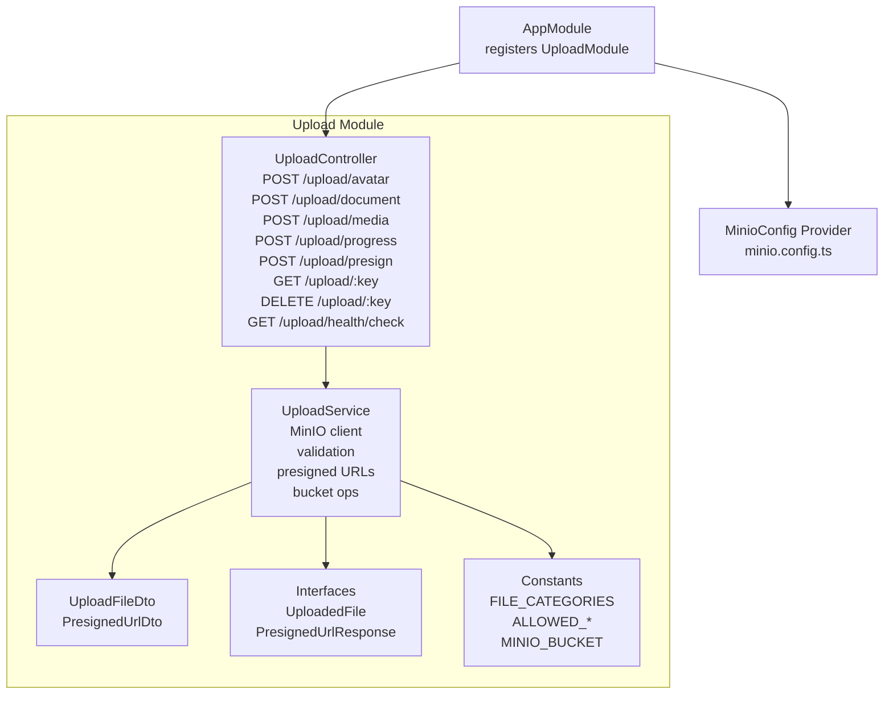
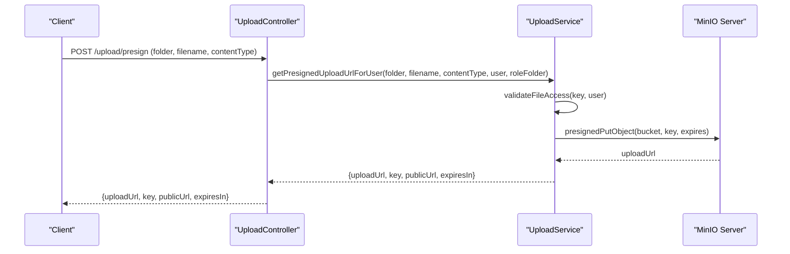
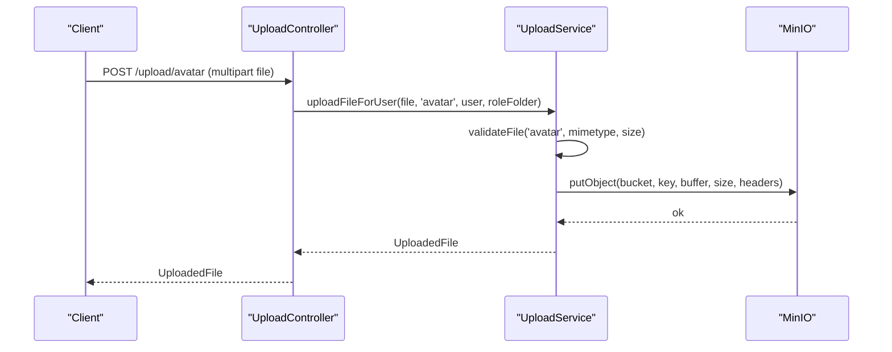
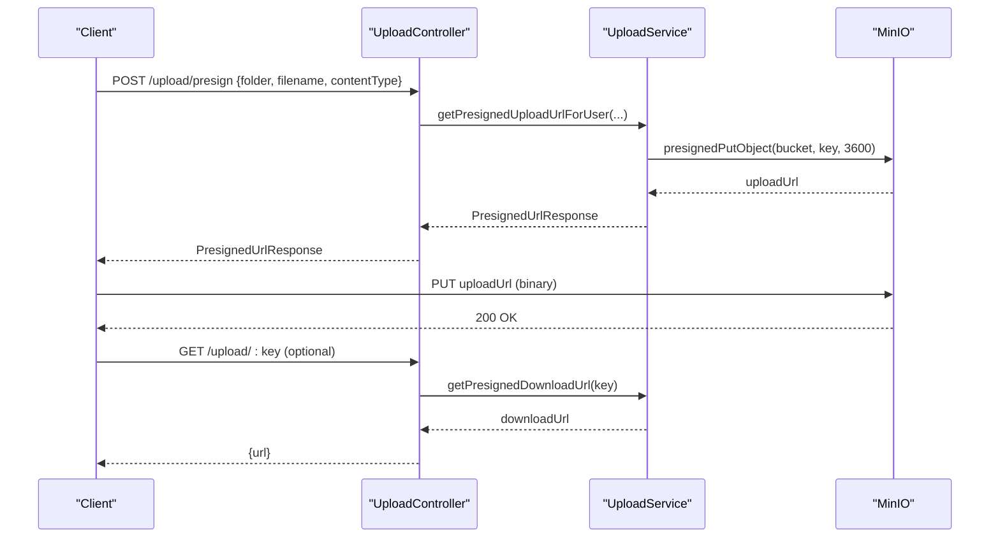
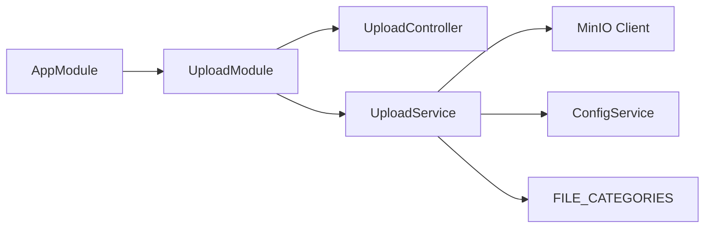

# File Upload & Storage API

<cite>
**Referenced Files in This Document**
- [upload.controller.ts](file://src/upload/upload.controller.ts)
- [upload.service.ts](file://src/upload/upload.service.ts)
- [upload.constants.ts](file://src/upload/constants/upload.constants.ts)
- [upload-file.dto.ts](file://src/upload/dto/upload-file.dto.ts)
- [presigned-url.dto.ts](file://src/upload/dto/presigned-url.dto.ts)
- [upload.interface.ts](file://src/upload/interfaces/upload.interface.ts)
- [minio.config.ts](file://src/config/minio.config.ts)
- [upload.module.ts](file://src/upload/upload.module.ts)
- [app.module.ts](file://src/app.module.ts)
</cite>

## Table of Contents
1. [Introduction](#introduction)
2. [Project Structure](#project-structure)
3. [Core Components](#core-components)
4. [Architecture Overview](#architecture-overview)
5. [Detailed Component Analysis](#detailed-component-analysis)
6. [Dependency Analysis](#dependency-analysis)
7. [Performance Considerations](#performance-considerations)
8. [Troubleshooting Guide](#troubleshooting-guide)
9. [Conclusion](#conclusion)
10. [Appendices](#appendices)

## Introduction
This document describes the File Upload & Storage API, focusing on direct uploads, presigned URL generation, file validation, and MinIO-backed cloud storage integration. It covers HTTP endpoints under the base path /upload, request/response schemas, validation rules, storage policies, access control, file naming conventions, and cleanup procedures. Practical examples include curl commands and JavaScript implementations for typical workflows such as avatar/document/media/progress uploads, presigned URL generation for direct client-side uploads, and file deletion.

## Project Structure
The upload feature is encapsulated in a dedicated NestJS module with a controller, service, DTOs, constants, and interfaces. Configuration is centralized via a NestJS ConfigModule provider that supplies MinIO connection details and upload limits.

**Diagram sources**
- [upload.controller.ts:24-167](file://src/upload/upload.controller.ts#L24-L167)
- [upload.service.ts:11-345](file://src/upload/upload.service.ts#L11-L345)
- [upload.constants.ts:1-34](file://src/upload/constants/upload.constants.ts#L1-L34)
- [upload-file.dto.ts:1-19](file://src/upload/dto/upload-file.dto.ts#L1-L19)
- [presigned-url.dto.ts:1-14](file://src/upload/dto/presigned-url.dto.ts#L1-L14)
- [upload.interface.ts:1-21](file://src/upload/interfaces/upload.interface.ts#L1-L21)
- [minio.config.ts:20-37](file://src/config/minio.config.ts#L20-L37)
- [app.module.ts:66-138](file://src/app.module.ts#L66-L138)

**Section sources**
- [upload.module.ts:1-13](file://src/upload/upload.module.ts#L1-L13)
- [app.module.ts:66-138](file://src/app.module.ts#L66-L138)

## Core Components
- UploadController: Exposes endpoints for direct uploads, presigned URL generation, download URL retrieval, and file deletion. Uses guards for JWT authentication and role-based access control.
- UploadService: Implements MinIO integration, file validation, key generation, presigned URL creation, access checks, and health checks.
- Constants: Define allowed MIME types per category, max sizes, and bucket name.
- DTOs: Enforce request payload validation for upload categories and presigned URL requests.
- Interfaces: Define response schemas for uploaded files and presigned URL responses.

**Section sources**
- [upload.controller.ts:24-167](file://src/upload/upload.controller.ts#L24-L167)
- [upload.service.ts:11-345](file://src/upload/upload.service.ts#L11-L345)
- [upload.constants.ts:1-34](file://src/upload/constants/upload.constants.ts#L1-L34)
- [upload-file.dto.ts:1-19](file://src/upload/dto/upload-file.dto.ts#L1-L19)
- [presigned-url.dto.ts:1-14](file://src/upload/dto/presigned-url.dto.ts#L1-L14)
- [upload.interface.ts:1-21](file://src/upload/interfaces/upload.interface.ts#L1-L21)

## Architecture Overview
The API integrates with MinIO for object storage. Validation occurs before upload or presigned URL generation. Access control ensures users can only operate on files within their role-scoped paths, except for admins who have global access.

**Diagram sources**
- [upload.controller.ts:113-127](file://src/upload/upload.controller.ts#L113-L127)
- [upload.service.ts:239-273](file://src/upload/upload.service.ts#L239-L273)

## Detailed Component Analysis

### Endpoints Overview
- Base Path: /upload
- Authentication: JWT required
- Authorization:
  - Avatar, document, media, progress: Any authenticated user for their own folders; special roles permitted per endpoint.
  - Admin/SuperAdmin can delete files.
  - Download requires ownership or access rights.

Endpoints:
- POST /upload/avatar
- POST /upload/document
- POST /upload/media
- POST /upload/progress
- POST /upload/presign
- GET /upload/:key
- DELETE /upload/:key
- GET /upload/health/check

**Section sources**
- [upload.controller.ts:24-167](file://src/upload/upload.controller.ts#L24-L167)

### Direct Upload Endpoints
- POST /upload/avatar
  - Purpose: Upload avatar image for the authenticated user.
  - Folder: avatars/{role}/{userId}/
  - Validation: Image types, size limit per category.
  - Response: UploadedFile with url, key, size, mimetype, originalName.

- POST /upload/document
  - Purpose: Upload document.
  - Permissions:
    - MEMBER: Own documents only (documents/member/{userId}/)
    - ADMIN/SUPERADMIN/TRAINER: General documents folder
  - Validation: Document/image types, size limit per category.
  - Response: UploadedFile.

- POST /upload/media
  - Purpose: Upload media (images/videos) for templates.
  - Roles: SUPERADMIN, ADMIN, TRAINER only.
  - Folder: templates/{role}/
  - Validation: Image/video types, size limit per category.
  - Response: UploadedFile.

- POST /upload/progress
  - Purpose: Upload progress photo.
  - Folder: progress/{userId}/
  - Validation: Image types, size limit per category.
  - Response: UploadedFile.

Request Schema (multipart/form-data):
- file: binary stream (required)

Response Schema (application/json):
- url: public URL of the uploaded object
- key: internal storage key
- size: bytes
- mimetype: detected MIME type
- originalName: original filename

**Section sources**
- [upload.controller.ts:33-106](file://src/upload/upload.controller.ts#L33-L106)
- [upload.service.ts:102-184](file://src/upload/upload.service.ts#L102-L184)
- [upload.interface.ts:1-7](file://src/upload/interfaces/upload.interface.ts#L1-L7)

### Presigned URL Generation
- POST /upload/presign
  - Purpose: Generate a short-lived upload URL for direct client upload.
  - Request DTO: folder (enum), filename (string), contentType (string)
  - Behavior:
    - Validates folder against categories.
    - Generates user-scoped key: {category}/{userId}/{uuid}.ext
    - Returns uploadUrl (presigned PUT), key, publicUrl, expiresIn (seconds)
  - Client flow:
    - Use uploadUrl to PUT file directly to MinIO.
    - On success, retrieve publicUrl from the response.

- GET /upload/:key
  - Purpose: Generate a short-lived download URL.
  - Access Control: Validates ownership/access; admins can access all.
  - Response: { url }

- DELETE /upload/:key
  - Purpose: Delete file.
  - Roles: SUPERADMIN, ADMIN only.

Request/Response Schemas:
- PresignedUrlDto:
  - folder: enum [avatar, document, media, progress]
  - filename: string
  - contentType: string

- PresignedUrlResponse:
  - uploadUrl: string
  - key: string
  - publicUrl: string
  - expiresIn: number

**Section sources**
- [upload.controller.ts:113-158](file://src/upload/upload.controller.ts#L113-L158)
- [upload.service.ts:202-273](file://src/upload/upload.service.ts#L202-L273)
- [presigned-url.dto.ts:1-14](file://src/upload/dto/presigned-url.dto.ts#L1-L14)
- [upload.interface.ts:9-14](file://src/upload/interfaces/upload.interface.ts#L9-L14)

### File Validation and Categories
Validation rules are enforced per category:
- avatar: images up to 5MB
- document: PDF/images up to 10MB
- media: images/videos up to 50MB
- progress: images up to 10MB

Allowed MIME types:
- Images: jpeg, png, webp, gif
- Documents: pdf, jpeg, png
- Videos: mp4, webm

Validation occurs in two places:
- Direct upload: validateFile(category, mimetype, size)
- Presigned URL: validateFileAccess(key, user) for download; category validation for upload keys

**Section sources**
- [upload.constants.ts:1-34](file://src/upload/constants/upload.constants.ts#L1-L34)
- [upload.service.ts:59-79](file://src/upload/upload.service.ts#L59-L79)
- [upload.service.ts:279-309](file://src/upload/upload.service.ts#L279-L309)

### Storage Policies and Access Control
- Bucket: gym-media (default)
- Naming Conventions:
  - avatars/{role}/{userId}/{uuid}.ext
  - documents/{userId}/{uuid}.ext (member-specific)
  - documents/{uuid}.ext (general for admin/trainer)
  - templates/{role}/{uuid}.ext
  - progress/{userId}/{uuid}.ext
- Access Control:
  - Admin/SuperAdmin: full access to all files
  - Trainer: access to templates folder
  - Member: access only to their own files
- Cleanup:
  - DELETE /upload/:key removes the object from MinIO

**Section sources**
- [upload.constants.ts:32-34](file://src/upload/constants/upload.constants.ts#L32-L34)
- [upload.service.ts:279-309](file://src/upload/upload.service.ts#L279-L309)
- [upload.controller.ts:150-158](file://src/upload/upload.controller.ts#L150-L158)

### Cloud Storage Integration (MinIO)
- Connection:
  - Endpoint, SSL flag, accessKey, secretKey, bucket, publicUrl loaded from configuration
  - Defaults provided if environment variables are missing
- Bucket Management:
  - Ensures bucket exists during operations; creates if missing
- Presigned URLs:
  - Upload: presignedPutObject with 1-hour expiry
  - Download: presignedGetObject with 1-hour expiry
- Health Check:
  - GET /upload/health/check verifies bucket existence

**Section sources**
- [upload.service.ts:21-38](file://src/upload/upload.service.ts#L21-L38)
- [upload.service.ts:43-54](file://src/upload/upload.service.ts#L43-L54)
- [upload.service.ts:202-233](file://src/upload/upload.service.ts#L202-L233)
- [upload.service.ts:314-326](file://src/upload/upload.service.ts#L314-L326)
- [upload.service.ts:331-344](file://src/upload/upload.service.ts#L331-L344)
- [minio.config.ts:20-37](file://src/config/minio.config.ts#L20-L37)

### API Workflows

#### Direct Upload Workflow (Avatar)

**Diagram sources**
- [upload.controller.ts:33-45](file://src/upload/upload.controller.ts#L33-L45)
- [upload.service.ts:143-184](file://src/upload/upload.service.ts#L143-L184)

#### Presigned Upload Workflow (Client-Side)

**Diagram sources**
- [upload.controller.ts:113-145](file://src/upload/upload.controller.ts#L113-L145)
- [upload.service.ts:239-273](file://src/upload/upload.service.ts#L239-L273)
- [upload.service.ts:314-326](file://src/upload/upload.service.ts#L314-L326)

#### Batch Operations
- The current implementation supports single-file uploads and presigned uploads. There is no built-in endpoint for batch file operations. To process multiple files efficiently, clients should:
  - Use POST /upload/presign to obtain upload URLs for each file
  - Upload files in parallel to MinIO using the returned URLs
  - Record returned keys and handle errors per file

[No sources needed since this section provides conceptual guidance]

### Practical Examples

#### curl: Upload Avatar
- Prerequisite: Obtain a valid JWT bearer token
- Command:
  - curl -X POST -H "Authorization: Bearer YOUR_JWT" -F "file=@/path/to/avatar.jpg" https://your-api/upload/avatar
- Expected Response:
  - JSON with url, key, size, mimetype, originalName

**Section sources**
- [upload.controller.ts:33-45](file://src/upload/upload.controller.ts#L33-L45)
- [upload.interface.ts:1-7](file://src/upload/interfaces/upload.interface.ts#L1-L7)

#### curl: Generate Presigned Upload URL
- Command:
  - curl -X POST -H "Authorization: Bearer YOUR_JWT" -H "Content-Type: application/json" -d '{"folder":"avatar","filename":"avatar.jpg","contentType":"image/jpeg"}' https://your-api/upload/presign
- Expected Response:
  - JSON with uploadUrl, key, publicUrl, expiresIn

**Section sources**
- [upload.controller.ts:113-127](file://src/upload/upload.controller.ts#L113-L127)
- [presigned-url.dto.ts:1-14](file://src/upload/dto/presigned-url.dto.ts#L1-L14)
- [upload.interface.ts:9-14](file://src/upload/interfaces/upload.interface.ts#L9-L14)

#### curl: Download File via Presigned URL
- Step 1: Generate download URL
  - curl -X GET -H "Authorization: Bearer YOUR_JWT" https://your-api/upload/KEY
- Step 2: Use returned url to fetch the file
  - curl -OJ "https://your-minio/publicUrl?X-Amz-Algorithm=..."

**Section sources**
- [upload.controller.ts:133-145](file://src/upload/upload.controller.ts#L133-L145)
- [upload.service.ts:314-326](file://src/upload/upload.service.ts#L314-L326)

#### JavaScript (Browser): Direct Upload Using Presigned URL
- Steps:
  - Call POST /upload/presign to get uploadUrl
  - Use fetch/XMLHttpRequest to PUT the file to uploadUrl
  - On success, store the returned key
- Notes:
  - Ensure Content-Type matches contentType used in presign request
  - Handle 400/403/413 errors from server or MinIO

**Section sources**
- [upload.controller.ts:113-127](file://src/upload/upload.controller.ts#L113-L127)
- [upload.service.ts:239-273](file://src/upload/upload.service.ts#L239-L273)

#### JavaScript (Node.js): Upload Buffer to Presigned URL
- Steps:
  - Call POST /upload/presign
  - Send PUT request to uploadUrl with file buffer and appropriate headers
- Notes:
  - Match Content-Type with contentType from presign

**Section sources**
- [upload.controller.ts:113-127](file://src/upload/upload.controller.ts#L113-L127)
- [upload.service.ts:239-273](file://src/upload/upload.service.ts#L239-L273)

### Error Responses
Common HTTP status codes and causes:
- 400 Bad Request
  - No file provided
  - Invalid category or folder
  - Unsupported content type
  - File too large
  - Upload/URL generation failure
- 401 Unauthorized
  - Missing/invalid JWT
- 403 Forbidden
  - Access denied to requested file/key
- 404 Not Found
  - Nonexistent key
- 503 Service Unavailable
  - Storage service unavailable (bucket creation failure)

**Section sources**
- [upload.controller.ts:39-41](file://src/upload/upload.controller.ts#L39-L41)
- [upload.controller.ts:140-142](file://src/upload/upload.controller.ts#L140-L142)
- [upload.service.ts:50-53](file://src/upload/upload.service.ts#L50-L53)
- [upload.service.ts:133-136](file://src/upload/upload.service.ts#L133-L136)
- [upload.service.ts:229-232](file://src/upload/upload.service.ts#L229-L232)
- [upload.service.ts:270-272](file://src/upload/upload.service.ts#L270-L272)
- [upload.service.ts:319-325](file://src/upload/upload.service.ts#L319-L325)

## Dependency Analysis
- UploadController depends on UploadService and guards for auth/roles.
- UploadService depends on:
  - MinIO client for object operations
  - ConfigService for MinIO and upload limits
  - FILE_CATEGORIES for validation rules
- UploadModule registers ConfigModule and exports UploadService for use across the app.

**Diagram sources**
- [app.module.ts:66-138](file://src/app.module.ts#L66-L138)
- [upload.module.ts:1-13](file://src/upload/upload.module.ts#L1-L13)
- [upload.controller.ts:24-167](file://src/upload/upload.controller.ts#L24-L167)
- [upload.service.ts:11-38](file://src/upload/upload.service.ts#L11-L38)
- [upload.constants.ts:6-28](file://src/upload/constants/upload.constants.ts#L6-L28)

**Section sources**
- [app.module.ts:66-138](file://src/app.module.ts#L66-L138)
- [upload.module.ts:1-13](file://src/upload/upload.module.ts#L1-L13)
- [upload.controller.ts:24-167](file://src/upload/upload.controller.ts#L24-L167)
- [upload.service.ts:11-38](file://src/upload/upload.service.ts#L11-L38)

## Performance Considerations
- Prefer presigned URLs for large files to avoid buffering the entire file in the API server.
- Use appropriate content types to prevent unnecessary conversions or rejections.
- MinIO endpoint and SSL settings impact latency; tune endpoint and useSsl accordingly.
- Keep file sizes within configured limits to reduce upload failures and storage costs.

[No sources needed since this section provides general guidance]

## Troubleshooting Guide
- MinIO connectivity issues:
  - Use GET /upload/health/check to verify bucket existence and service status.
  - Check endpoint, accessKey, secretKey, bucket, and publicUrl in configuration.
- File rejected:
  - Verify category and MIME type compatibility.
  - Confirm file size does not exceed category-specific limits.
- Access denied:
  - Ensure user belongs to the correct role and attempts to access their own files or allowed paths.
- CORS and presigned URLs:
  - Ensure client respects uploadUrl and sets matching Content-Type.

**Section sources**
- [upload.service.ts:331-344](file://src/upload/upload.service.ts#L331-L344)
- [minio.config.ts:20-37](file://src/config/minio.config.ts#L20-L37)
- [upload.service.ts:279-309](file://src/upload/upload.service.ts#L279-L309)

## Conclusion
The File Upload & Storage API provides secure, scalable file handling via MinIO with robust validation, role-aware access control, and presigned URL support for efficient client-side uploads. By adhering to the documented schemas, limits, and access rules, applications can reliably manage avatar, document, media, and progress photos while maintaining strong security boundaries.

## Appendices

### Request/Response Schemas

- UploadFileDto
  - category: enum ["avatar","document","media","progress"]

- PresignedUrlDto
  - folder: enum ["avatar","document","media","progress"]
  - filename: string
  - contentType: string

- UploadedFile
  - url: string
  - key: string
  - size: number
  - mimetype: string
  - originalName: string

- PresignedUrlResponse
  - uploadUrl: string
  - key: string
  - publicUrl: string
  - expiresIn: number

**Section sources**
- [upload-file.dto.ts:1-19](file://src/upload/dto/upload-file.dto.ts#L1-L19)
- [presigned-url.dto.ts:1-14](file://src/upload/dto/presigned-url.dto.ts#L1-L14)
- [upload.interface.ts:1-21](file://src/upload/interfaces/upload.interface.ts#L1-L21)

### Configuration Reference
- MinIO configuration keys:
  - minio.endpoint
  - minio.accessKey
  - minio.secretKey
  - minio.bucket
  - minio.publicUrl
  - minio.useSsl
- Upload limits:
  - minio.upload.avatarMaxSize
  - minio.upload.documentMaxSize
  - minio.upload.mediaMaxSize

**Section sources**
- [minio.config.ts:20-37](file://src/config/minio.config.ts#L20-L37)