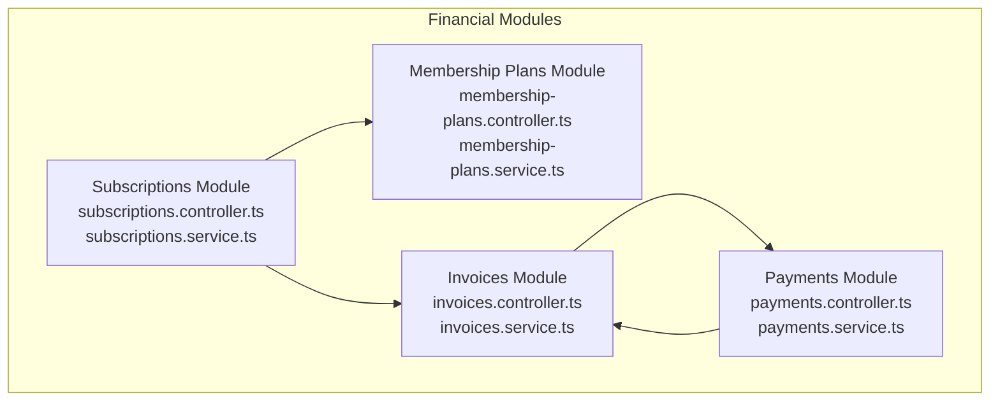
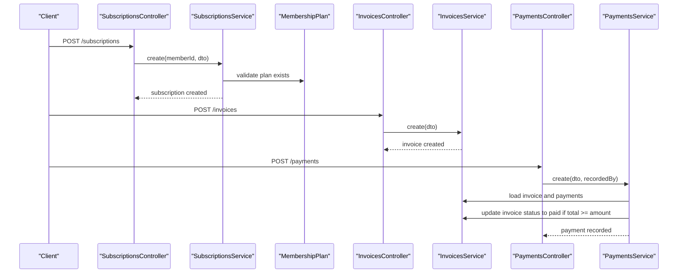
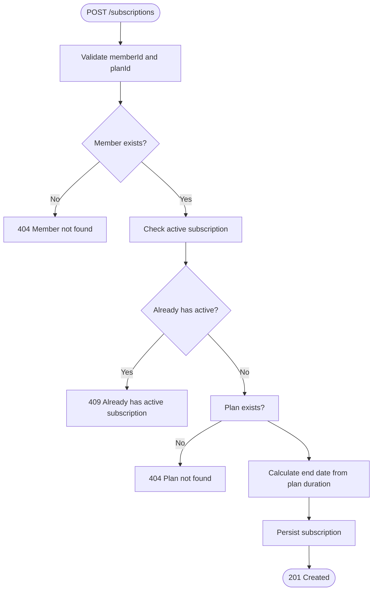
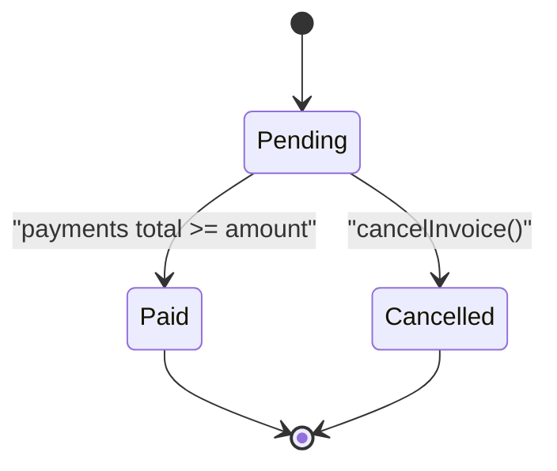
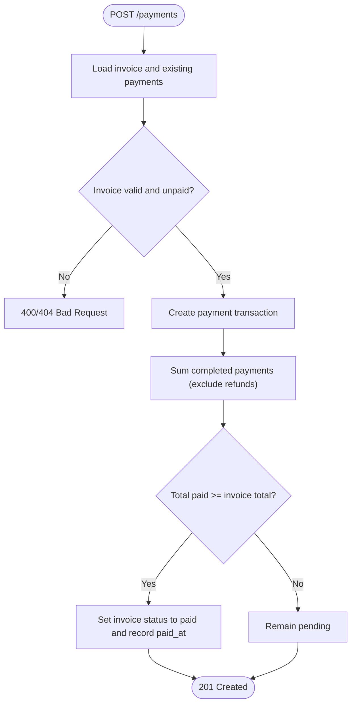
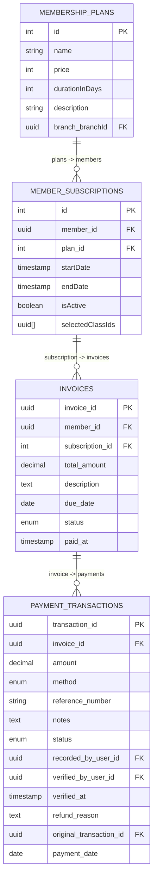
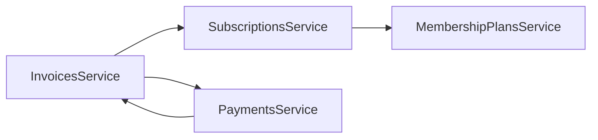

# Financial Operations API

<cite>
**Referenced Files in This Document**
- [src/subscriptions/subscriptions.controller.ts](file://src/subscriptions/subscriptions.controller.ts)
- [src/subscriptions/subscriptions.service.ts](file://src/subscriptions/subscriptions.service.ts)
- [src/subscriptions/dto/create-subscription.dto.ts](file://src/subscriptions/dto/create-subscription.dto.ts)
- [src/membership-plans/membership-plans.controller.ts](file://src/membership-plans/membership-plans.controller.ts)
- [src/membership-plans/membership-plans.service.ts](file://src/membership-plans/membership-plans.service.ts)
- [src/membership-plans/dto/create-membership-plan.dto.ts](file://src/membership-plans/dto/create-membership-plan.dto.ts)
- [src/payments/payments.controller.ts](file://src/payments/payments.controller.ts)
- [src/payments/payments.service.ts](file://src/payments/payments.service.ts)
- [src/payments/dto/create-payment.dto.ts](file://src/payments/dto/create-payment.dto.ts)
- [src/invoices/invoices.controller.ts](file://src/invoices/invoices.controller.ts)
- [src/invoices/invoices.service.ts](file://src/invoices/invoices.service.ts)
- [src/invoices/dto/create-invoice.dto.ts](file://src/invoices/dto/create-invoice.dto.ts)
- [src/entities/member_subscriptions.entity.ts](file://src/entities/member_subscriptions.entity.ts)
- [src/entities/membership_plans.entity.ts](file://src/entities/membership_plans.entity.ts)
- [src/entities/payment_transactions.entity.ts](file://src/entities/payment_transactions.entity.ts)
- [src/entities/invoices.entity.ts](file://src/entities/invoices.entity.ts)
</cite>

## Table of Contents
1. [Introduction](#introduction)
2. [Project Structure](#project-structure)
3. [Core Components](#core-components)
4. [Architecture Overview](#architecture-overview)
5. [Detailed Component Analysis](#detailed-component-analysis)
6. [Dependency Analysis](#dependency-analysis)
7. [Performance Considerations](#performance-considerations)
8. [Troubleshooting Guide](#troubleshooting-guide)
9. [Conclusion](#conclusion)
10. [Appendices](#appendices)

## Introduction
This document describes the Financial Operations API covering subscription management, membership billing, payment processing, and invoice generation. It provides HTTP endpoints, request/response schemas, validation rules, and financial transaction workflows. Practical examples include subscription creation with billing cycles, membership plan configuration, payment recording and verification, and automated invoice generation. It also documents subscription lifecycle management, payment reconciliation, refund processing, and financial reporting capabilities, along with error responses for common failure scenarios.

## Project Structure
The financial domain is organized into four primary modules:
- Subscriptions: manage membership subscriptions and lifecycle
- Membership Plans: define pricing tiers and plan metadata
- Invoices: create and manage invoices linked to subscriptions and members
- Payments: record payments, reconcile amounts, handle refunds, and generate reports

**Diagram sources**
- [src/subscriptions/subscriptions.controller.ts:28-800](file://src/subscriptions/subscriptions.controller.ts#L28-L800)
- [src/membership-plans/membership-plans.controller.ts:29-345](file://src/membership-plans/membership-plans.controller.ts#L29-L345)
- [src/invoices/invoices.controller.ts:26-429](file://src/invoices/invoices.controller.ts#L26-L429)
- [src/payments/payments.controller.ts:31-673](file://src/payments/payments.controller.ts#L31-L673)

**Section sources**
- [src/subscriptions/subscriptions.controller.ts:28-800](file://src/subscriptions/subscriptions.controller.ts#L28-L800)
- [src/membership-plans/membership-plans.controller.ts:29-345](file://src/membership-plans/membership-plans.controller.ts#L29-L345)
- [src/invoices/invoices.controller.ts:26-429](file://src/invoices/invoices.controller.ts#L26-L429)
- [src/payments/payments.controller.ts:31-673](file://src/payments/payments.controller.ts#L31-L673)

## Core Components
- Subscriptions: Create, list, retrieve, update, and delete subscriptions; enforce uniqueness of active subscriptions; calculate end dates based on plan duration.
- Membership Plans: Create, list, retrieve, update, and delete membership plans; support branch-scoped plans and price filters.
- Invoices: Create invoices linked to members and optionally subscriptions; list, retrieve, update, and cancel invoices; track payment status.
- Payments: Record payments against invoices; verify/reject pending payments; issue refunds; summarize payment activity.

**Section sources**
- [src/subscriptions/subscriptions.service.ts:16-152](file://src/subscriptions/subscriptions.service.ts#L16-L152)
- [src/membership-plans/membership-plans.service.ts:11-138](file://src/membership-plans/membership-plans.service.ts#L11-L138)
- [src/invoices/invoices.service.ts:11-119](file://src/invoices/invoices.service.ts#L11-L119)
- [src/payments/payments.service.ts:17-200](file://src/payments/payments.service.ts#L17-L200)

## Architecture Overview
The system integrates subscriptions, plans, invoices, and payments with strict validation and state transitions. Payments drive invoice state changes and trigger renewal workflows upon successful payment.

**Diagram sources**
- [src/subscriptions/subscriptions.controller.ts:31-166](file://src/subscriptions/subscriptions.controller.ts#L31-L166)
- [src/subscriptions/subscriptions.service.ts:26-67](file://src/subscriptions/subscriptions.service.ts#L26-L67)
- [src/invoices/invoices.controller.ts:30-99](file://src/invoices/invoices.controller.ts#L30-L99)
- [src/invoices/invoices.service.ts:21-54](file://src/invoices/invoices.service.ts#L21-L54)
- [src/payments/payments.controller.ts:35-133](file://src/payments/payments.controller.ts#L35-L133)
- [src/payments/payments.service.ts:26-79](file://src/payments/payments.service.ts#L26-L79)

## Detailed Component Analysis

### Subscriptions API
- Base path: /subscriptions
- Authentication: JWT required
- Roles: Requires authenticated user; administrative actions may require elevated permissions

Endpoints
- POST /subscriptions
  - Description: Create a new membership subscription for a member with a plan and start date. Enforces uniqueness of active subscriptions.
  - Request: CreateSubscriptionDto
  - Responses:
    - 201: Subscription created
    - 400: Validation or business rule error
    - 403: Forbidden
    - 404: Member or plan not found
    - 409: Member already has an active subscription

- GET /subscriptions
  - Description: List subscriptions with filtering, pagination, and analytics.
  - Query params: page, limit, memberId, status, planType, startDateFrom, startDateTo, expiredOnly, dueForRenewal, sortBy, sortOrder
  - Responses: 200 with data, pagination, and analytics

- GET /subscriptions/:id
  - Description: Retrieve detailed subscription including member, plan, billing history, access permissions, and payment method.
  - Path param: id (integer)
  - Responses: 200 with detailed subscription object; 400/403/404

- PATCH /subscriptions/:id
  - Description: Update subscription details (plan, billing info, auto-renewal, status). Recalculates end date if start date changes.
  - Path param: id (integer)
  - Responses: 200 on success; 400/403/404

- DELETE /subscriptions/:id
  - Description: Permanently remove a subscription (typically admin-only). Revokes access and enforces constraints.
  - Path param: id (integer)
  - Responses: 200 on success; 400/403/404/409

Validation rules (CreateSubscriptionDto)
- planId: integer, required
- selectedClassId: string (UUID), optional
- startDate: date-time string, required

Example request (new member monthly)
{
  "memberId": 123,
  "planId": 1,
  "startDate": "2024-01-15T00:00:00.000Z",
  "autoRenew": true,
  "paymentMethodId": "pm_1234567890",
  "billingAddress": {
    "street": "123 Main St",
    "city": "New York",
    "state": "NY",
    "zipCode": "10001",
    "country": "US"
  }
}

Example response (subscription created)
{
  "id": 12345,
  "memberId": 123,
  "planId": 1,
  "planName": "Premium Monthly",
  "planType": "monthly",
  "price": 89.99,
  "currency": "USD",
  "billingCycle": "monthly",
  "startDate": "2024-01-15T00:00:00.000Z",
  "endDate": "2024-02-15T00:00:00.000Z",
  "nextBillingDate": "2024-02-15T00:00:00.000Z",
  "status": "active",
  "benefits": ["gym_access","group_classes","personal_trainer_2_sessions","nutrition_consultation"],
  "autoRenew": true,
  "paymentMethod": { "type":"credit_card","lastFour":"4242","brand":"visa" },
  "createdAt": "2024-01-15T10:30:00.000Z"
}

Workflow: Subscription creation

**Diagram sources**
- [src/subscriptions/subscriptions.controller.ts:31-166](file://src/subscriptions/subscriptions.controller.ts#L31-L166)
- [src/subscriptions/subscriptions.service.ts:26-67](file://src/subscriptions/subscriptions.service.ts#L26-L67)

**Section sources**
- [src/subscriptions/subscriptions.controller.ts:31-800](file://src/subscriptions/subscriptions.controller.ts#L31-L800)
- [src/subscriptions/subscriptions.service.ts:26-152](file://src/subscriptions/subscriptions.service.ts#L26-L152)
- [src/subscriptions/dto/create-subscription.dto.ts:10-33](file://src/subscriptions/dto/create-subscription.dto.ts#L10-L33)

### Membership Plans API
- Base path: /membership-plans
- Authentication: JWT required
- Roles: Administrative access required for create/update/delete

Endpoints
- POST /membership-plans
  - Description: Create a new membership plan with pricing, duration, and optional branch association.
  - Request: CreateMembershipPlanDto
  - Responses: 201 on success; 400/401/409

- GET /membership-plans
  - Description: List plans with optional filters by branch and price range.
  - Query params: branchId, minPrice, maxPrice
  - Responses: 200 with array of plans

- GET /membership-plans/:id
  - Description: Retrieve plan details.
  - Path param: id (integer)
  - Responses: 200; 404

- PATCH /membership-plans/:id
  - Description: Update plan details (name, price, duration, description, branch).
  - Path param: id (integer)
  - Responses: 200; 404

- DELETE /membership-plans/:id
  - Description: Delete a plan (branch-scoped plans supported).
  - Path param: id (integer)
  - Responses: 200; 404

Validation rules (CreateMembershipPlanDto)
- name: string, required
- price: integer ≥ 0, required
- durationInDays: integer ≥ 1, required
- description: string, optional
- branchId: UUID, optional

Example request (monthly premium plan)
{
  "name": "Monthly Premium",
  "description": "Access to all gym facilities for one month",
  "durationInDays": 30,
  "price": 7999,
  "currency": "USD",
  "features": ["All Equipment","Group Classes","Personal Trainer 1 session/month"],
  "isActive": true,
  "branchId": "branch_123"
}

Example response (plan created)
{
  "id": 1,
  "name": "Monthly Premium",
  "description": "Access to all gym facilities for one month",
  "durationInDays": 30,
  "price": 7999,
  "currency": "USD",
  "features": ["All Equipment","Group Classes","Personal Trainer 1 session/month"],
  "isActive": true,
  "branchId": "branch_123",
  "createdAt": "2024-01-01T00:00:00Z"
}

**Section sources**
- [src/membership-plans/membership-plans.controller.ts:33-303](file://src/membership-plans/membership-plans.controller.ts#L33-L303)
- [src/membership-plans/membership-plans.service.ts:21-138](file://src/membership-plans/membership-plans.service.ts#L21-L138)
- [src/membership-plans/dto/create-membership-plan.dto.ts:11-45](file://src/membership-plans/dto/create-membership-plan.dto.ts#L11-L45)

### Invoices API
- Base path: /invoices
- Authentication: JWT required
- Roles: Finance/admin access for sensitive operations

Endpoints
- POST /invoices
  - Description: Create an invoice for a member, optionally linked to a subscription.
  - Request: CreateInvoiceDto
  - Responses: 201; 400/401/404

- GET /invoices
  - Description: List invoices (admin/finance).
  - Responses: 200 with array of invoices

- GET /invoices/:id
  - Description: Retrieve invoice with member, subscription, and payment history.
  - Path param: id (UUID)
  - Responses: 200; 404

- PATCH /invoices/:id
  - Description: Update invoice amount, description, due date.
  - Path param: id (UUID)
  - Responses: 200; 404

- POST /invoices/:id/cancel
  - Description: Cancel an invoice (prevents further payments).
  - Path param: id (UUID)
  - Responses: 200; 404/409

Validation rules (CreateInvoiceDto)
- memberId: integer, required
- subscriptionId: integer, optional
- totalAmount: number, required
- description: string, optional
- dueDate: date string, optional

Example request (monthly membership fee)
{
  "memberId": 123,
  "subscriptionId": 1,
  "totalAmount": 99.99,
  "description": "Monthly membership fee - December 2024",
  "dueDate": "2024-12-31"
}

Example response (invoice created)
{
  "invoice_id": "123e4567-e89b-12d3-a456-426614174000",
  "member": { "id":123,"firstName":"John","lastName":"Doe","email":"john.doe@example.com" },
  "subscription": { "id":1,"planName":"Premium Membership" },
  "total_amount": 99.99,
  "description": "Monthly membership fee - December 2024",
  "due_date": "2024-12-31",
  "status": "pending",
  "payments": [],
  "created_at": "2024-12-01T00:00:00Z"
}

Invoice lifecycle

**Diagram sources**
- [src/invoices/invoices.controller.ts:285-354](file://src/invoices/invoices.controller.ts#L285-L354)
- [src/invoices/invoices.service.ts:107-117](file://src/invoices/invoices.service.ts#L107-L117)

**Section sources**
- [src/invoices/invoices.controller.ts:30-355](file://src/invoices/invoices.controller.ts#L30-L355)
- [src/invoices/invoices.service.ts:21-119](file://src/invoices/invoices.service.ts#L21-L119)
- [src/invoices/dto/create-invoice.dto.ts:11-40](file://src/invoices/dto/create-invoice.dto.ts#L11-L40)

### Payments API
- Base path: /payments
- Authentication: JWT required
- Roles: Finance/admin for verification/refunds; general staff for recording payments

Endpoints
- POST /payments
  - Description: Record a payment against an invoice. Validates amount and method; marks invoice as paid when total meets threshold.
  - Request: CreatePaymentDto
  - Responses: 201; 400/401/403/404

- GET /payments
  - Description: List payments with optional filters (admin/finance).
  - Responses: 200 with array of transactions

- GET /payments/summary
  - Description: Aggregated payment report by method and status.
  - Responses: 200 with totals and breakdowns

- GET /payments/:id
  - Description: Retrieve payment details with invoice and member.
  - Path param: id (UUID)
  - Responses: 200; 404

- PATCH /payments/:id
  - Description: Verify or reject a pending payment; records verifier.
  - Path param: id (UUID)
  - Responses: 200; 400/401/403/404

- POST /payments/:id/refund
  - Description: Issue a refund for a completed payment; records reason and method.
  - Path param: id (UUID)
  - Responses: 201; 400/401/403/404

Validation rules (CreatePaymentDto)
- invoiceId: UUID, required
- amount: number, required
- method: enum ["cash","card","online","bank_transfer"], required
- referenceNumber: string, optional
- notes: string, optional
- payment_date: date-time string, optional
- status: enum ["pending","completed"], default "completed", optional

Example request (credit card payment)
{
  "invoiceId": "123e4567-e89b-12d3-a456-426614174000",
  "amount": 99.99,
  "method": "card",
  "referenceNumber": "TXN123456789",
  "notes": "Paid via Visa ending in 1234"
}

Example response (payment recorded)
{
  "transaction_id": "123e4567-e89b-12d3-a456-426614174000",
  "invoice": { "invoice_id":"456e7890-e89b-12d3-a456-426614174001","member":{"id":123,"firstName":"John","lastName":"Doe","email":"john.doe@example.com"},"total_amount":99.99 },
  "amount": 99.99,
  "method": "card",
  "reference_number": "TXN123456789",
  "notes": "Paid via Visa ending in 1234",
  "status": "completed",
  "created_at": "2024-12-01T10:30:00Z"
}

Payment reconciliation workflow

**Diagram sources**
- [src/payments/payments.controller.ts:35-133](file://src/payments/payments.controller.ts#L35-L133)
- [src/payments/payments.service.ts:26-79](file://src/payments/payments.service.ts#L26-L79)

**Section sources**
- [src/payments/payments.controller.ts:35-451](file://src/payments/payments.controller.ts#L35-L451)
- [src/payments/payments.service.ts:26-200](file://src/payments/payments.service.ts#L26-L200)
- [src/payments/dto/create-payment.dto.ts:12-69](file://src/payments/dto/create-payment.dto.ts#L12-L69)

### Data Models

**Diagram sources**
- [src/entities/membership_plans.entity.ts:11-34](file://src/entities/membership_plans.entity.ts#L11-L34)
- [src/entities/member_subscriptions.entity.ts:14-71](file://src/entities/member_subscriptions.entity.ts#L14-L71)
- [src/entities/invoices.entity.ts:13-49](file://src/entities/invoices.entity.ts#L13-L49)
- [src/entities/payment_transactions.entity.ts:12-74](file://src/entities/payment_transactions.entity.ts#L12-L74)

## Dependency Analysis
- Subscriptions depend on MembershipPlans for plan metadata and on Members for membership context.
- Invoices depend on Members and optionally MemberSubscriptions; they aggregate PaymentTransactions.
- Payments depend on Invoices and update their status; they may trigger renewal workflows.

**Diagram sources**
- [src/subscriptions/subscriptions.service.ts:16-24](file://src/subscriptions/subscriptions.service.ts#L16-L24)
- [src/invoices/invoices.service.ts:12-19](file://src/invoices/invoices.service.ts#L12-L19)
- [src/payments/payments.service.ts:16-24](file://src/payments/payments.service.ts#L16-L24)

**Section sources**
- [src/subscriptions/subscriptions.service.ts:16-24](file://src/subscriptions/subscriptions.service.ts#L16-L24)
- [src/invoices/invoices.service.ts:12-19](file://src/invoices/invoices.service.ts#L12-L19)
- [src/payments/payments.service.ts:16-24](file://src/payments/payments.service.ts#L16-L24)

## Performance Considerations
- Pagination and filtering: Use query parameters (page, limit, filters) to avoid large result sets.
- Indexing: Ensure database indexes on frequently queried columns (invoice_id, member_id, subscription_id, created_at).
- Aggregation: Prefer server-side aggregation for payment summaries to minimize client-side computation.
- Asynchronous workflows: Consider offloading heavy reconciliation or reporting to background jobs.

## Troubleshooting Guide
Common error responses
- 400 Bad Request
  - Payment amount exceeds invoice total
  - Invalid payment method
  - Invalid status transition (e.g., refund of a refund)
  - Invalid invoice ID or payment ID
- 401 Unauthorized
  - Missing or invalid JWT token
- 403 Forbidden
  - Insufficient permissions to access or modify resources
- 404 Not Found
  - Member, plan, subscription, invoice, or payment not found
- 409 Conflict
  - Member already has an active subscription
  - Invoice cannot be cancelled if already paid

Practical examples
- curl: Create a subscription
curl -X POST https://your-api.com/subscriptions \
  -H "Authorization: Bearer YOUR_JWT" \
  -H "Content-Type: application/json" \
  -d '{"memberId":123,"planId":1,"startDate":"2024-01-15T00:00:00.000Z","autoRenew":true}'

- curl: Record a payment
curl -X POST https://your-api.com/payments \
  -H "Authorization: Bearer YOUR_JWT" \
  -H "Content-Type: application/json" \
  -d '{"invoiceId":"123e4567-e89b-12d3-a456-426614174000","amount":99.99,"method":"card"}'

- curl: Get payment summary
curl -H "Authorization: Bearer YOUR_JWT" https://your-api.com/payments/summary

JavaScript (fetch) examples
- Create subscription
const createSubscription = async (dto) => {
  const res = await fetch('/subscriptions', {
    method: 'POST',
    headers: { 'Authorization': 'Bearer ' + token, 'Content-Type': 'application/json' },
    body: JSON.stringify(dto)
  });
  return res.json();
};

- Record payment
const recordPayment = async (dto) => {
  const res = await fetch('/payments', {
    method: 'POST',
    headers: { 'Authorization': 'Bearer ' + token, 'Content-Type': 'application/json' },
    body: JSON.stringify(dto)
  });
  return res.json();
};

- Get invoice payment summary
const getInvoiceSummary = async (invoiceId) => {
  const res = await fetch(`/invoices/${invoiceId}/payment-summary`, {
    headers: { 'Authorization': 'Bearer ' + token }
  });
  return res.json();
};

**Section sources**
- [src/payments/payments.controller.ts:48-94](file://src/payments/payments.controller.ts#L48-L94)
- [src/invoices/invoices.controller.ts:44-72](file://src/invoices/invoices.controller.ts#L44-L72)
- [src/subscriptions/subscriptions.controller.ts:112-129](file://src/subscriptions/subscriptions.controller.ts#L112-L129)

## Conclusion
The Financial Operations API provides a cohesive set of endpoints for managing memberships, billing, payments, and invoicing. Strong validation, clear state transitions, and robust error handling enable reliable financial workflows. Integrating subscriptions with plans, invoices, and payments ensures accurate billing and reconciliation, while supporting administrative controls for verification and refunds.

## Appendices

### Endpoint Reference Summary
- Subscriptions
  - POST /subscriptions
  - GET /subscriptions
  - GET /subscriptions/:id
  - PATCH /subscriptions/:id
  - DELETE /subscriptions/:id

- Membership Plans
  - POST /membership-plans
  - GET /membership-plans
  - GET /membership-plans/:id
  - PATCH /membership-plans/:id
  - DELETE /membership-plans/:id

- Invoices
  - POST /invoices
  - GET /invoices
  - GET /invoices/:id
  - PATCH /invoices/:id
  - POST /invoices/:id/cancel

- Payments
  - POST /payments
  - GET /payments
  - GET /payments/summary
  - GET /payments/:id
  - PATCH /payments/:id
  - POST /payments/:id/refund