# Gym Administration API

<cite>
**Referenced Files in This Document**
- [gyms.controller.ts](file://src/gyms/gyms.controller.ts)
- [gyms.service.ts](file://src/gyms/gyms.service.ts)
- [gyms.module.ts](file://src/gyms/gyms.module.ts)
- [gym.entity.ts](file://src/entities/gym.entity.ts)
- [branch.entity.ts](file://src/entities/branch.entity.ts)
- [create-gym.dto.ts](file://src/gyms/dto/create-gym.dto.ts)
- [update-gym.dto.ts](file://src/gyms/dto/update-gym.dto.ts)
- [create-branch.dto.ts](file://src/gyms/dto/create-branch.dto.ts)
- [update-branch.dto.ts](file://src/gyms/dto/update-branch.dto.ts)
- [gym-member-response.dto.ts](file://src/gyms/dto/gym-member-response.dto.ts)
- [jwt-auth.guard.ts](file://src/auth/guards/jwt-auth.guard.ts)
- [roles.guard.ts](file://src/auth/guards/roles.guard.ts)
- [branch-access.guard.ts](file://src/auth/guards/branch-access.guard.ts)
- [role.enum.ts](file://src/common/enums/role.enum.ts)
- [permissions.enum.ts](file://src/common/enums/permissions.enum.ts)
</cite>

## Table of Contents
1. [Introduction](#introduction)
2. [Project Structure](#project-structure)
3. [Core Components](#core-components)
4. [Architecture Overview](#architecture-overview)
5. [Detailed Component Analysis](#detailed-component-analysis)
6. [API Reference](#api-reference)
7. [Multi-Tenant Architecture](#multi-tenant-architecture)
8. [Branch Access Controls](#branch-access-controls)
9. [Gym Hierarchy Management](#gym-hierarchy-management)
10. [Administrative Workflows](#administrative-workflows)
11. [Practical Examples](#practical-examples)
12. [Error Handling](#error-handling)
13. [Performance Considerations](#performance-considerations)
14. [Troubleshooting Guide](#troubleshooting-guide)
15. [Conclusion](#conclusion)

## Introduction

The Gym Administration API provides comprehensive management capabilities for multi-location fitness center operations. This system supports gym creation with automatic branch establishment, branch management with location details, and complete gym configuration management. The API implements a robust multi-tenant architecture with strict access controls, enabling administrators to manage multiple gyms and their respective branches efficiently.

The system follows NestJS best practices with clean separation of concerns, comprehensive validation, and Swagger documentation. It supports both gym-level and branch-level operations while maintaining data integrity and enforcing proper authorization controls.

## Project Structure

The gym administration module is organized following NestJS modular architecture patterns:

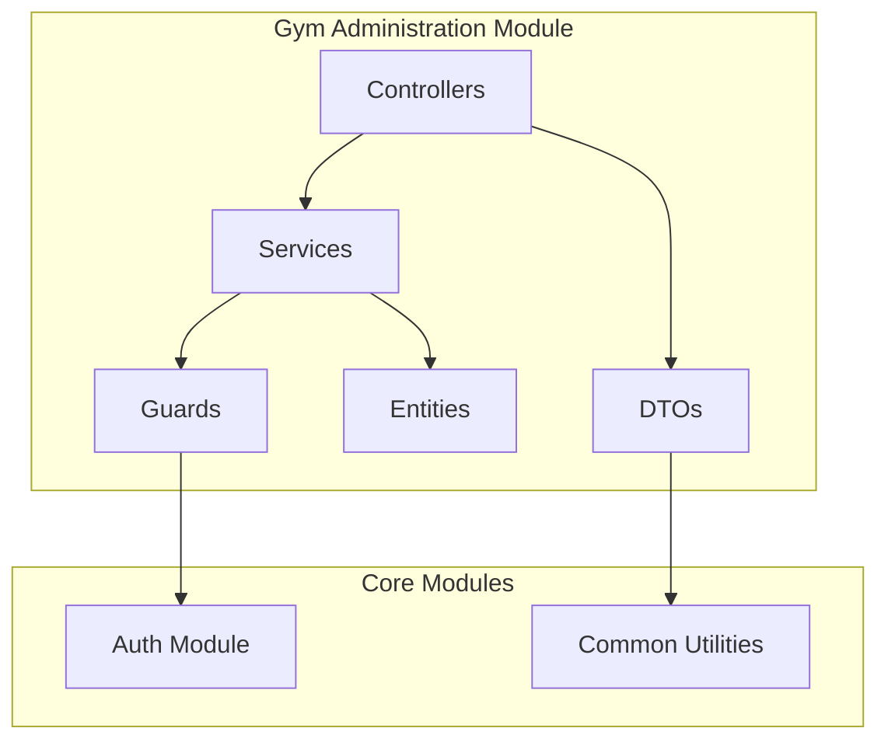

**Diagram sources**
- [gyms.module.ts:11-17](file://src/gyms/gyms.module.ts#L11-L17)
- [gyms.controller.ts:30-33](file://src/gyms/gyms.controller.ts#L30-L33)
- [gyms.service.ts:14-27](file://src/gyms/gyms.service.ts#L14-L27)

**Section sources**
- [gyms.module.ts:1-18](file://src/gyms/gyms.module.ts#L1-L18)
- [gyms.controller.ts:1-816](file://src/gyms/gyms.controller.ts#L1-L816)
- [gyms.service.ts:1-472](file://src/gyms/gyms.service.ts#L1-L472)

## Core Components

### Entity Relationships

The system implements a hierarchical relationship structure with clear parent-child associations:

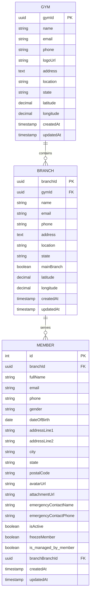

**Diagram sources**
- [gym.entity.ts:12-56](file://src/entities/gym.entity.ts#L12-L56)
- [branch.entity.ts:18-79](file://src/entities/branch.entity.ts#L18-L79)

### Service Layer Architecture

The service layer provides comprehensive business logic with proper error handling and data transformation:

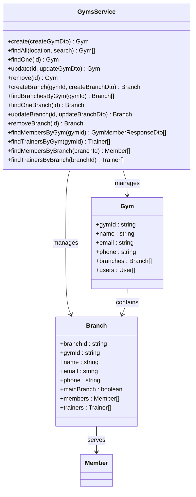

**Diagram sources**
- [gyms.service.ts:14-472](file://src/gyms/gyms.service.ts#L14-L472)
- [gym.entity.ts:12-56](file://src/entities/gym.entity.ts#L12-L56)
- [branch.entity.ts:18-79](file://src/entities/branch.entity.ts#L18-L79)

**Section sources**
- [gym.entity.ts:1-56](file://src/entities/gym.entity.ts#L1-L56)
- [branch.entity.ts:1-79](file://src/entities/branch.entity.ts#L1-L79)
- [gyms.service.ts:14-472](file://src/gyms/gyms.service.ts#L14-L472)

## Architecture Overview

The Gym Administration API follows a layered architecture pattern with clear separation between presentation, business logic, and data access layers:

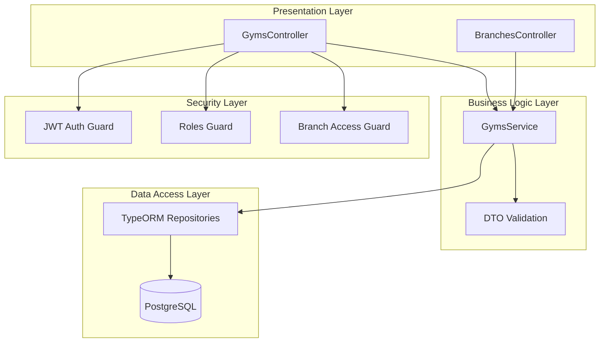

**Diagram sources**
- [gyms.controller.ts:30-517](file://src/gyms/gyms.controller.ts#L30-L517)
- [gyms.service.ts:14-27](file://src/gyms/gyms.service.ts#L14-L27)
- [branch-access.guard.ts:14-73](file://src/auth/guards/branch-access.guard.ts#L14-L73)

The architecture ensures:
- **Separation of Concerns**: Clear boundaries between controllers, services, and repositories
- **Security Enforcement**: Multi-layered authentication and authorization checks
- **Data Integrity**: Strong typing through TypeScript and database constraints
- **Extensibility**: Modular design supporting future enhancements

## Detailed Component Analysis

### Authentication and Authorization

The system implements a comprehensive security model with multiple guard layers:

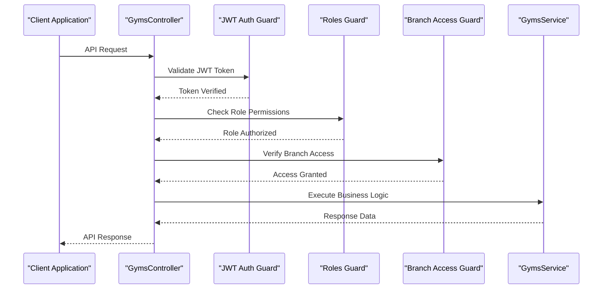

**Diagram sources**
- [jwt-auth.guard.ts:1-6](file://src/auth/guards/jwt-auth.guard.ts#L1-L6)
- [roles.guard.ts:12-41](file://src/auth/guards/roles.guard.ts#L12-L41)
- [branch-access.guard.ts:24-71](file://src/auth/guards/branch-access.guard.ts#L24-L71)

### Request/Response Schema Validation

The API uses comprehensive DTO validation with detailed field specifications:

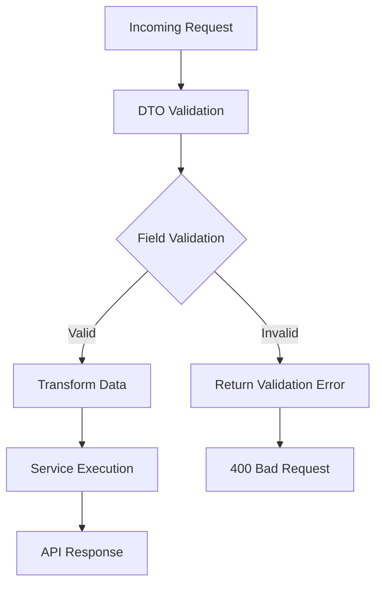

**Diagram sources**
- [create-gym.dto.ts:4-86](file://src/gyms/dto/create-gym.dto.ts#L4-L86)
- [create-branch.dto.ts:4-62](file://src/gyms/dto/create-branch.dto.ts#L4-L62)

**Section sources**
- [jwt-auth.guard.ts:1-6](file://src/auth/guards/jwt-auth.guard.ts#L1-L6)
- [roles.guard.ts:12-41](file://src/auth/guards/roles.guard.ts#L12-L41)
- [branch-access.guard.ts:14-73](file://src/auth/guards/branch-access.guard.ts#L14-L73)
- [create-gym.dto.ts:1-86](file://src/gyms/dto/create-gym.dto.ts#L1-L86)
- [create-branch.dto.ts:1-62](file://src/gyms/dto/create-branch.dto.ts#L1-L62)

## API Reference

### Gym Management Endpoints

#### Create Gym
**Endpoint**: `POST /gyms`
**Description**: Creates a new gym with basic information and establishes a default main branch

**Request Body**:
- `name` (string, required): Gym name
- `email` (string, optional): Gym email address
- `phone` (string, optional): Gym phone number
- `logoUrl` (string, optional): Gym logo URL
- `address` (string, optional): Gym address
- `location` (string, optional): Gym location/city
- `state` (string, optional): Gym state
- `latitude` (number, optional): Gym latitude coordinate
- `longitude` (number, optional): Gym longitude coordinate

**Response**: Complete Gym object with associated branches

**Section sources**
- [gyms.controller.ts:37-79](file://src/gyms/gyms.controller.ts#L37-L79)
- [create-gym.dto.ts:4-86](file://src/gyms/dto/create-gym.dto.ts#L4-L86)

#### Get All Gyms
**Endpoint**: `GET /gyms`
**Description**: Retrieve all gyms with optional filtering

**Query Parameters**:
- `location` (string, optional): Filter gyms by location/city
- `search` (string, optional): Search gyms by name

**Response**: Array of Gym objects with branch information

**Section sources**
- [gyms.controller.ts:81-117](file://src/gyms/gyms.controller.ts#L81-L117)

#### Get Gym by ID
**Endpoint**: `GET /gyms/{id}`
**Description**: Retrieve detailed information about a specific gym including all branches

**Path Parameters**:
- `id` (string, required): Gym ID (UUID format)

**Response**: Complete Gym object with all associated branches

**Section sources**
- [gyms.controller.ts:119-144](file://src/gyms/gyms.controller.ts#L119-L144)

#### Update Gym
**Endpoint**: `PATCH /gyms/{id}`
**Description**: Updates gym information such as name, address, contact details, or description

**Path Parameters**:
- `id` (string, required): Gym ID

**Request Body**: Partial UpdateGymDto with fields to modify

**Response**: Updated Gym object

**Section sources**
- [gyms.controller.ts:146-206](file://src/gyms/gyms.controller.ts#L146-L206)
- [update-gym.dto.ts:1-5](file://src/gyms/dto/update-gym.dto.ts#L1-L5)

#### Delete Gym
**Endpoint**: `DELETE /gyms/{id}`
**Description**: Permanently deletes a gym and all its branches

**Path Parameters**:
- `id` (string, required): Gym ID

**Response**: Deletion confirmation message

**Section sources**
- [gyms.controller.ts:208-250](file://src/gyms/gyms.controller.ts#L208-L250)

### Branch Management Endpoints

#### Create Branch
**Endpoint**: `POST /gyms/{gymId}/branches`
**Description**: Creates a new branch for an existing gym with location details

**Path Parameters**:
- `gymId` (string, required): Gym ID (UUID format)

**Request Body**:
- `name` (string, required): Branch name
- `email` (string, optional): Branch email address
- `phone` (string, optional): Branch phone number
- `address` (string, optional): Branch address
- `location` (string, optional): Branch location/city
- `state` (string, optional): Branch state
- `mainBranch` (boolean, optional): Whether this is the main branch
- `latitude` (number, optional): Branch latitude coordinate
- `longitude` (number, optional): Branch longitude coordinate

**Response**: Gym object with updated branch list

**Section sources**
- [gyms.controller.ts:254-326](file://src/gyms/gyms.controller.ts#L254-L326)
- [create-branch.dto.ts:4-62](file://src/gyms/dto/create-branch.dto.ts#L4-L62)

#### Get All Branches for Gym
**Endpoint**: `GET /gyms/{gymId}/branches`
**Description**: Retrieves all branches for a specific gym

**Path Parameters**:
- `gymId` (string, required): Gym ID

**Response**: Array of Branch objects

**Section sources**
- [gyms.controller.ts:328-337](file://src/gyms/gyms.controller.ts#L328-L337)

#### Get Gym Members
**Endpoint**: `GET /gyms/{gymId}/members`
**Description**: Retrieves all members from all branches of a specific gym

**Path Parameters**:
- `gymId` (string, required): Gym ID (UUID format)

**Query Parameters**:
- `isActive` (boolean, optional): Filter by membership active status
- `branchId` (string, optional): Filter by specific branch ID (UUID)

**Response**: Array of GymMemberResponseDto with comprehensive member details

**Section sources**
- [gyms.controller.ts:339-505](file://src/gyms/gyms.controller.ts#L339-L505)
- [gym-member-response.dto.ts:98-168](file://src/gyms/dto/gym-member-response.dto.ts#L98-L168)

#### Get Gym Trainers
**Endpoint**: `GET /gyms/{gymId}/trainers`
**Description**: Retrieves all trainers for a specific gym

**Path Parameters**:
- `gymId` (string, required): Gym ID

**Response**: Array of trainer objects with branch information

**Section sources**
- [gyms.controller.ts:507-516](file://src/gyms/gyms.controller.ts#L507-L516)

### Branch-Specific Endpoints

#### Get All Branches
**Endpoint**: `GET /branches`
**Description**: Retrieves all gym branches across all gyms (requires admin privileges)

**Response**: Array of Branch objects with gym information

**Section sources**
- [gyms.controller.ts:519-561](file://src/gyms/gyms.controller.ts#L519-L561)

#### Get Branch by ID
**Endpoint**: `GET /branches/{id}`
**Description**: Retrieves detailed information about a specific gym branch

**Path Parameters**:
- `id` (string, required): Branch ID

**Response**: Complete Branch object with gym details

**Section sources**
- [gyms.controller.ts:563-630](file://src/gyms/gyms.controller.ts#L563-L630)

#### Update Branch
**Endpoint**: `PATCH /branches/{id}`
**Description**: Updates branch information such as contact details, opening hours, or facilities

**Path Parameters**:
- `id` (string, required): Branch ID

**Request Body**: Partial UpdateBranchDto with fields to modify

**Response**: Updated Branch object

**Section sources**
- [gyms.controller.ts:632-715](file://src/gyms/gyms.controller.ts#L632-L715)
- [update-branch.dto.ts:1-5](file://src/gyms/dto/update-branch.dto.ts#L1-L5)

#### Delete Branch
**Endpoint**: `DELETE /branches/{id}`
**Description**: Permanently deletes a gym branch

**Path Parameters**:
- `id` (string, required): Branch ID

**Response**: Deletion confirmation message

**Section sources**
- [gyms.controller.ts:717-759](file://src/gyms/gyms.controller.ts#L717-L759)

#### Get Branch Trainers
**Endpoint**: `GET /branches/{branchId}/trainers`
**Description**: Retrieves all trainers assigned to a specific gym branch

**Path Parameters**:
- `branchId` (string, required): Branch ID

**Response**: Array of trainer objects with branch details

**Section sources**
- [gyms.controller.ts:761-800](file://src/gyms/gyms.controller.ts#L761-L800)

## Multi-Tenant Architecture

The system implements a sophisticated multi-tenant architecture designed for managing multiple gym chains and their locations:

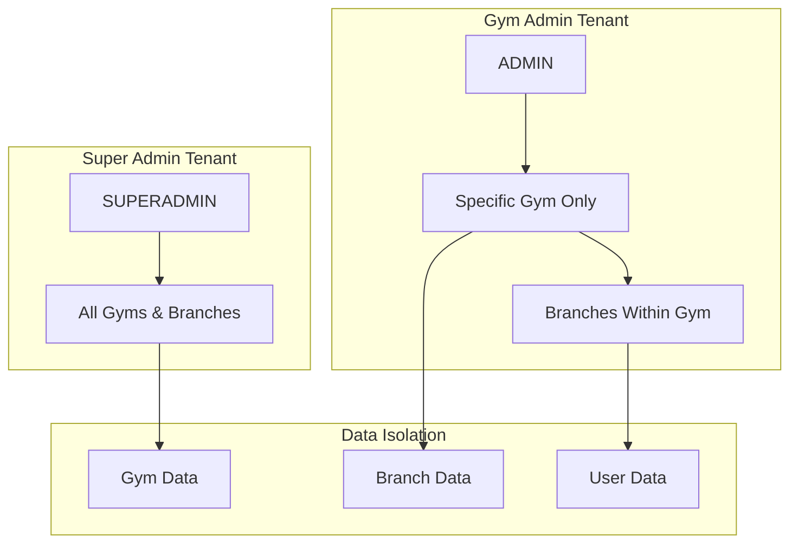

**Diagram sources**
- [branch-access.guard.ts:44-68](file://src/auth/guards/branch-access.guard.ts#L44-L68)
- [permissions.enum.ts:50-84](file://src/common/enums/permissions.enum.ts#L50-L84)

### Tenant Isolation Mechanisms

The multi-tenant architecture enforces strict data isolation through:

1. **Role-Based Access Control**: Different permission levels for SUPERADMIN vs ADMIN users
2. **Context-Aware Filtering**: Automatic filtering based on user's gym association
3. **Hierarchical Data Access**: Ensures users can only access their designated gym/branch data
4. **Permission Matrix**: Comprehensive permission mapping for all operations

**Section sources**
- [branch-access.guard.ts:14-73](file://src/auth/guards/branch-access.guard.ts#L14-L73)
- [permissions.enum.ts:1-84](file://src/common/enums/permissions.enum.ts#L1-L84)
- [role.enum.ts:1-7](file://src/common/enums/role.enum.ts#L1-L7)

## Branch Access Controls

The branch access control system provides granular permissions management:

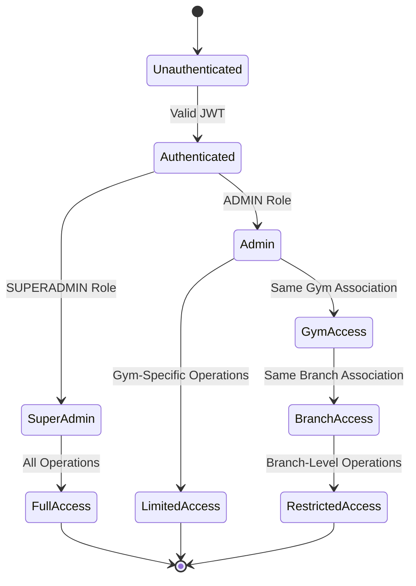

**Diagram sources**
- [branch-access.guard.ts:24-71](file://src/auth/guards/branch-access.guard.ts#L24-L71)
- [roles.guard.ts:16-40](file://src/auth/guards/roles.guard.ts#L16-L40)

### Access Control Implementation

The system implements three-tier access control:

1. **Authentication Level**: JWT token verification
2. **Authorization Level**: Role-based permissions
3. **Tenant Level**: Context-aware data access

**Section sources**
- [branch-access.guard.ts:14-73](file://src/auth/guards/branch-access.guard.ts#L14-L73)
- [roles.guard.ts:12-41](file://src/auth/guards/roles.guard.ts#L12-L41)

## Gym Hierarchy Management

The gym hierarchy management system maintains organizational structure through parent-child relationships:

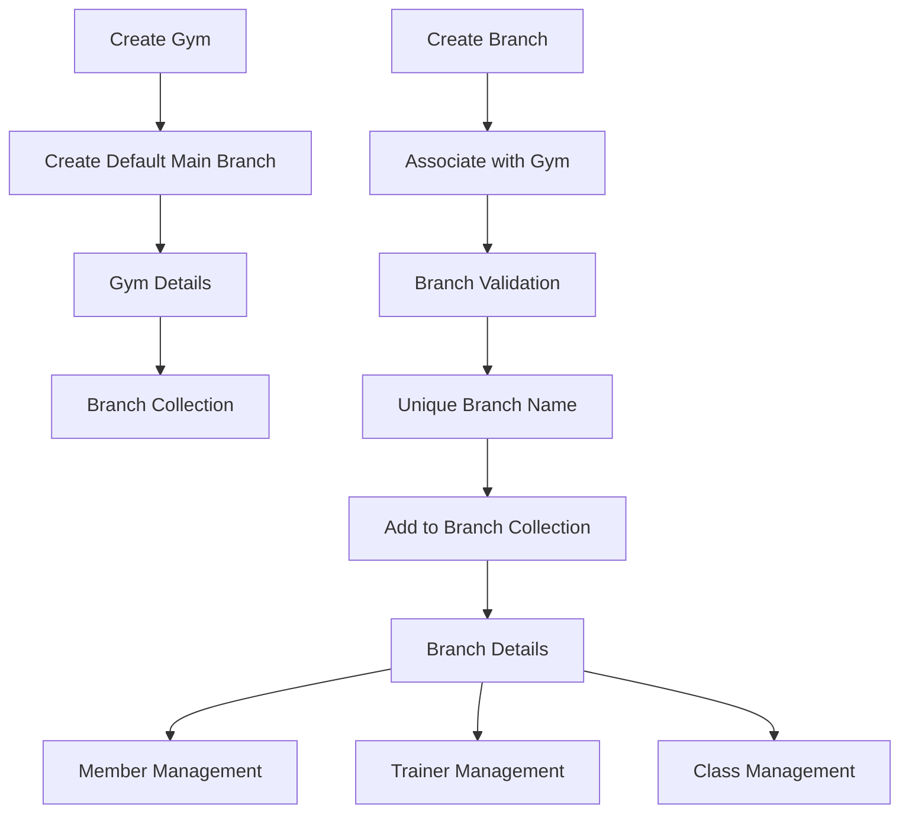

**Diagram sources**
- [gyms.service.ts:31-69](file://src/gyms/gyms.service.ts#L31-L69)
- [gyms.service.ts:122-174](file://src/gyms/gyms.service.ts#L122-L174)

### Hierarchical Data Relationships

The system maintains clear hierarchical relationships:

1. **Gym Level**: Top-level organization with unique constraints
2. **Branch Level**: Child entities with foreign key relationships
3. **Member Level**: Individual users within branch context
4. **Trainer Level**: Professional staff within branch context

**Section sources**
- [gym.entity.ts:44-48](file://src/entities/gym.entity.ts#L44-L48)
- [branch.entity.ts:23-24](file://src/entities/branch.entity.ts#L23-L24)

## Administrative Workflows

### Gym Creation Workflow

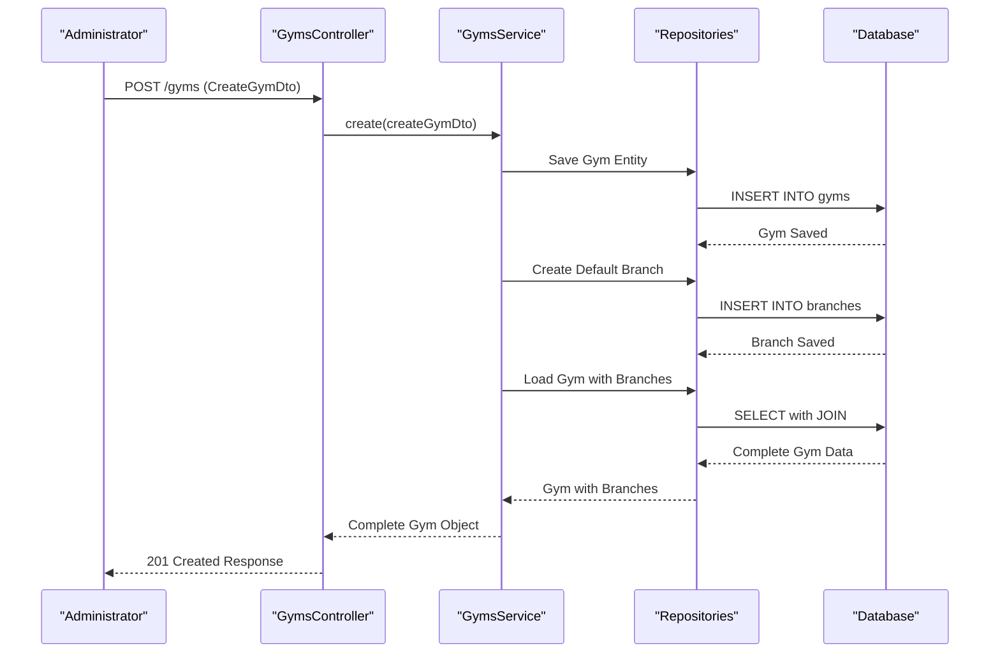

**Diagram sources**
- [gyms.controller.ts:37-79](file://src/gyms/gyms.controller.ts#L37-L79)
- [gyms.service.ts:31-69](file://src/gyms/gyms.service.ts#L31-L69)

### Branch Establishment Workflow

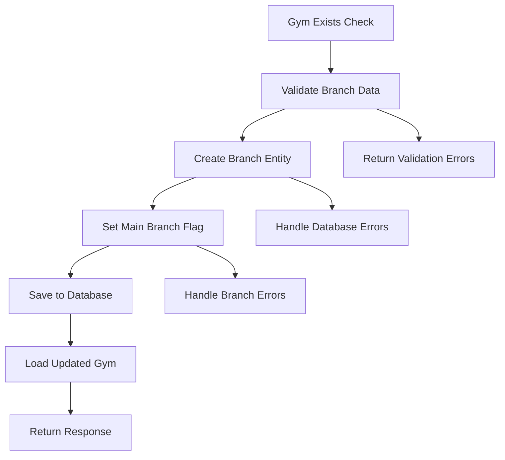

**Diagram sources**
- [gyms.service.ts:122-174](file://src/gyms/gyms.service.ts#L122-L174)

### Member Management Workflow

The member management workflow integrates with the gym hierarchy:

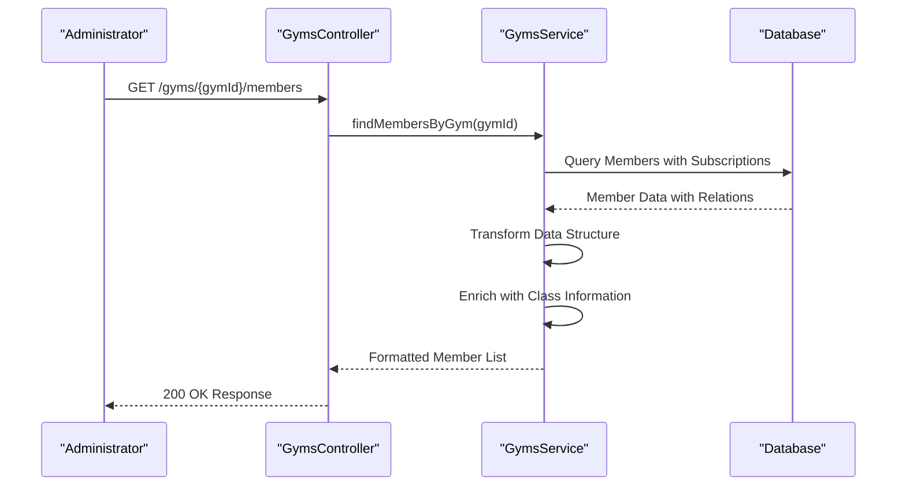

**Diagram sources**
- [gyms.controller.ts:339-505](file://src/gyms/gyms.controller.ts#L339-L505)
- [gyms.service.ts:257-357](file://src/gyms/gyms.service.ts#L257-L357)

**Section sources**
- [gyms.controller.ts:37-505](file://src/gyms/gyms.controller.ts#L37-L505)
- [gyms.service.ts:31-357](file://src/gyms/gyms.service.ts#L31-L357)

## Practical Examples

### Curl Commands

#### Create a New Gym
```bash
curl -X POST "https://api.example.com/gyms" \
  -H "Content-Type: application/json" \
  -H "Authorization: Bearer YOUR_JWT_TOKEN" \
  -d '{
    "name": "Fitness World Elite",
    "address": "123 Main Street, Downtown",
    "phone": "+1234567890",
    "email": "contact@fitnessworld.com",
    "description": "Premium fitness center with state-of-the-art equipment"
  }'
```

#### Create a Branch for Existing Gym
```bash
curl -X POST "https://api.example.com/gyms/123e4567-e89b-12d3-a456-426614174000/branches" \
  -H "Content-Type: application/json" \
  -H "Authorization: Bearer YOUR_JWT_TOKEN" \
  -d '{
    "name": "Fitness World Elite - Downtown Branch",
    "address": "789 Downtown Ave, Business District",
    "phone": "+1234567892",
    "email": "downtown@fitnessworld.com",
    "managerName": "Jane Smith",
    "openingHours": {
      "monday": "06:00-22:00",
      "tuesday": "06:00-22:00",
      "wednesday": "06:00-22:00",
      "thursday": "06:00-22:00",
      "friday": "06:00-22:00",
      "saturday": "07:00-20:00",
      "sunday": "07:00-20:00"
    },
    "facilities": [
      "Cardio Equipment",
      "Free Weights",
      "Group Classes",
      "Personal Training"
    ],
    "coordinates": {
      "latitude": 34.0522,
      "longitude": -118.2437
    }
  }'
```

#### Update Gym Configuration
```bash
curl -X PATCH "https://api.example.com/gyms/123e4567-e89b-12d3-a456-426614174000" \
  -H "Content-Type: application/json" \
  -H "Authorization: Bearer YOUR_JWT_TOKEN" \
  -d '{
    "phone": "+1234567891",
    "email": "newcontact@fitnessworld.com"
  }'
```

### JavaScript Implementation

#### Gym Management Client
```javascript
class GymApiClient {
  constructor(baseUrl, authToken) {
    this.baseUrl = baseUrl;
    this.authToken = authToken;
    this.headers = {
      'Content-Type': 'application/json',
      'Authorization': `Bearer ${authToken}`
    };
  }

  async createGym(gymData) {
    const response = await fetch(`${this.baseUrl}/gyms`, {
      method: 'POST',
      headers: this.headers,
      body: JSON.stringify(gymData)
    });
    
    if (!response.ok) {
      throw new Error(`HTTP error! status: ${response.status}`);
    }
    
    return response.json();
  }

  async getGymMembers(gymId, filters = {}) {
    const queryString = new URLSearchParams(filters).toString();
    const response = await fetch(
      `${this.baseUrl}/gyms/${gymId}/members?${queryString}`,
      { headers: this.headers }
    );
    
    if (!response.ok) {
      throw new Error(`HTTP error! status: ${response.status}`);
    }
    
    return response.json();
  }

  async updateBranch(branchId, branchData) {
    const response = await fetch(`${this.baseUrl}/branches/${branchId}`, {
      method: 'PATCH',
      headers: this.headers,
      body: JSON.stringify(branchData)
    });
    
    if (!response.ok) {
      throw new Error(`HTTP error! status: ${response.status}`);
    }
    
    return response.json();
  }
}

// Usage example
const apiClient = new GymApiClient('https://api.example.com', 'YOUR_JWT_TOKEN');

// Create new gym
const newGym = await apiClient.createGym({
  name: 'New Fitness Center',
  address: '456 Oak Street',
  phone: '+1987654321'
});

// Get gym members
const members = await apiClient.getGymMembers(newGym.gymId, {
  isActive: true,
  branchId: 'branch-uuid-here'
});
```

**Section sources**
- [gyms.controller.ts:37-505](file://src/gyms/gyms.controller.ts#L37-L505)

## Error Handling

The API implements comprehensive error handling with specific error codes and messages:

### Common Error Responses

| Error Code | Scenario | Response |
|------------|----------|----------|
| 400 | Invalid input data/validation errors | Validation error details |
| 401 | Unauthorized/invalid JWT token | Authentication failure |
| 403 | Permission denied | Access control violation |
| 404 | Resource not found | Entity not found |
| 409 | Conflict (duplicate entries) | Duplicate resource detected |
| 500 | Internal server error | System error |

### Validation Error Scenarios

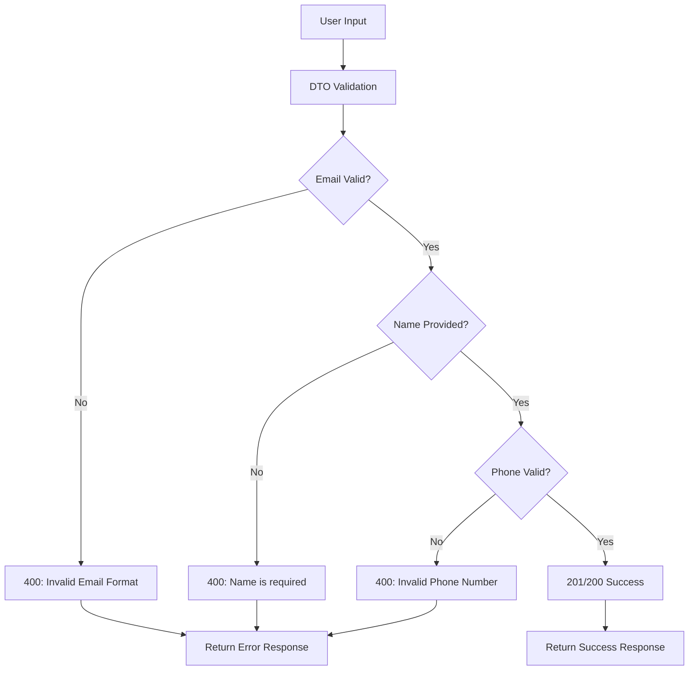

**Diagram sources**
- [create-gym.dto.ts:4-86](file://src/gyms/dto/create-gym.dto.ts#L4-L86)
- [create-branch.dto.ts:4-62](file://src/gyms/dto/create-branch.dto.ts#L4-L62)

### Access Control Errors

The system handles various access control scenarios:

1. **Unauthorized Access**: Missing or invalid JWT tokens
2. **Permission Denied**: Insufficient role-based permissions
3. **Tenant Violation**: Attempt to access unauthorized gym/branch data
4. **Resource Not Found**: Non-existent gym or branch identifiers

**Section sources**
- [gyms.controller.ts:45-286](file://src/gyms/gyms.controller.ts#L45-L286)
- [branch-access.guard.ts:44-68](file://src/auth/guards/branch-access.guard.ts#L44-L68)

## Performance Considerations

### Database Optimization

The system implements several performance optimization strategies:

1. **Lazy Loading**: Eager loading of related entities only when needed
2. **Query Optimization**: Efficient joins and filtering for large datasets
3. **Indexing Strategy**: Proper indexing on frequently queried fields
4. **Connection Pooling**: Optimized database connection management

### Caching Strategies

Recommended caching approaches:
- **Entity Caching**: Frequently accessed gym and branch data
- **Query Result Caching**: Expensive aggregate queries
- **Session Caching**: User authentication and authorization data

### Scalability Considerations

1. **Horizontal Scaling**: Stateless design supports load balancing
2. **Database Sharding**: Potential for future multi-tenant database partitioning
3. **API Rate Limiting**: Built-in protection against abuse
4. **Monitoring**: Comprehensive logging and metrics collection

## Troubleshooting Guide

### Common Issues and Solutions

#### Authentication Problems
**Issue**: Receiving 401 Unauthorized errors
**Solution**: 
1. Verify JWT token validity and expiration
2. Check token format (Bearer token required)
3. Ensure token has not been revoked

#### Permission Denied Errors
**Issue**: Receiving 403 Forbidden responses
**Solution**:
1. Verify user role assignment
2. Check gym association for ADMIN users
3. Ensure proper tenant isolation

#### Data Validation Errors
**Issue**: Receiving 400 Bad Request with validation errors
**Solution**:
1. Review DTO validation rules
2. Check required fields and data types
3. Verify unique constraints (email, name)

#### Performance Issues
**Issue**: Slow API responses for large datasets
**Solution**:
1. Implement pagination for list endpoints
2. Add appropriate query filters
3. Consider database indexing improvements

### Debugging Tools

1. **Swagger Documentation**: Interactive API testing interface
2. **Logging**: Comprehensive request/response logging
3. **Metrics**: Performance monitoring and alerting
4. **Database Queries**: SQL query logging for optimization

**Section sources**
- [branch-access.guard.ts:14-73](file://src/auth/guards/branch-access.guard.ts#L14-L73)
- [roles.guard.ts:12-41](file://src/auth/guards/roles.guard.ts#L12-L41)

## Conclusion

The Gym Administration API provides a comprehensive solution for managing multi-location fitness center operations. Its robust architecture supports scalability, security, and maintainability while offering extensive functionality for gym and branch management.

Key strengths of the system include:

- **Multi-Tenant Architecture**: Secure isolation between different gym chains
- **Comprehensive Validation**: Strict input validation with detailed error reporting
- **Flexible Permissions**: Granular access control based on roles and contexts
- **Hierarchical Data Model**: Logical organization of gyms, branches, and users
- **Extensible Design**: Modular architecture supporting future enhancements

The API is well-suited for enterprise-level fitness management systems requiring robust security, scalability, and comprehensive administrative capabilities. Its implementation demonstrates best practices in modern web application development with NestJS and TypeScript.