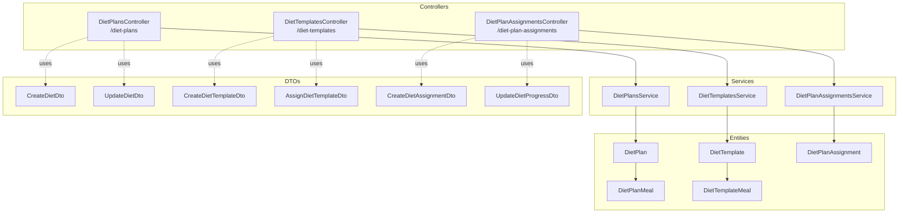
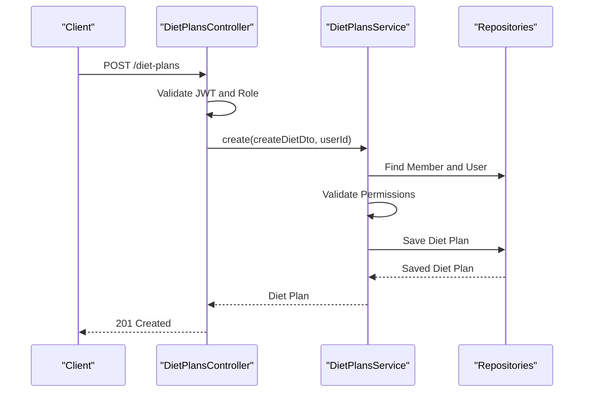
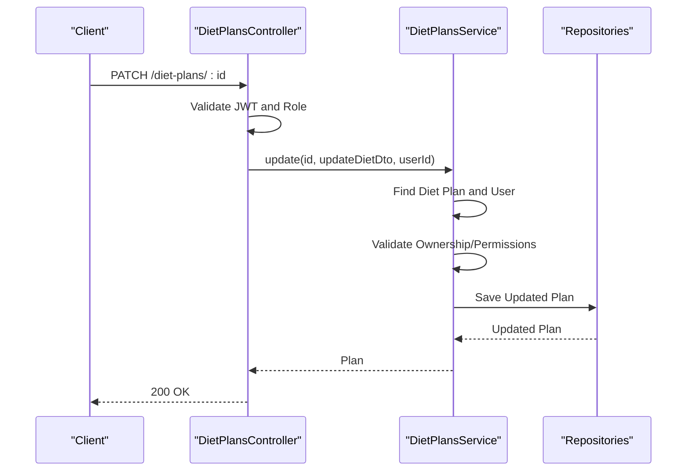
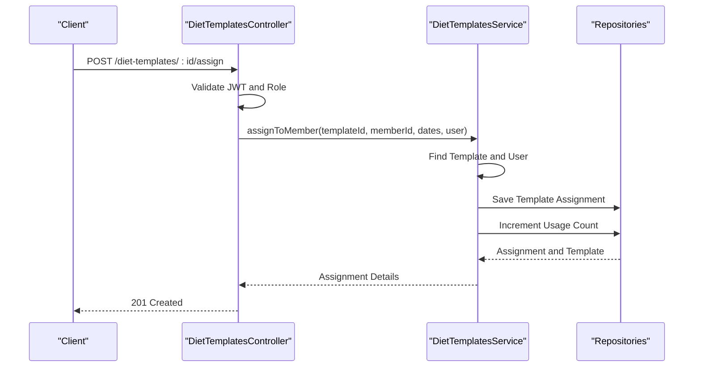
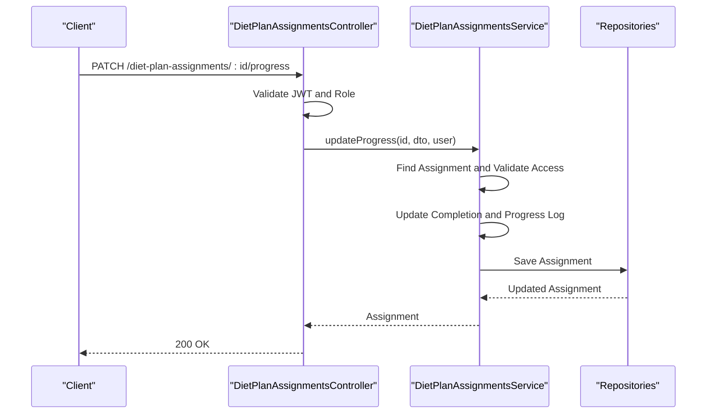
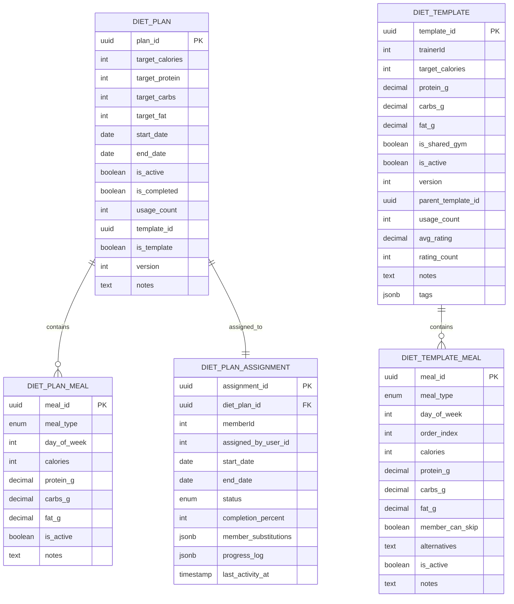
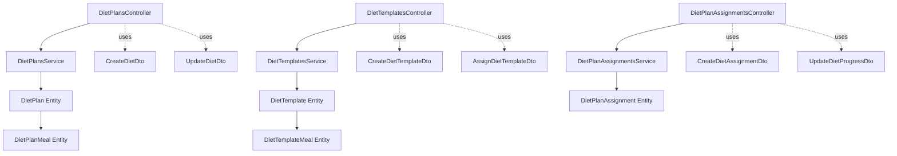

# Nutrition Programs API

<cite>
**Referenced Files in This Document**
- [diet-plans.controller.ts](file://src/diet-plans/diet-plans.controller.ts)
- [diet-templates.controller.ts](file://src/diet-plans/diet-templates.controller.ts)
- [diet-assignments.controller.ts](file://src/diet-plans/diet-assignments.controller.ts)
- [diet-plans.service.ts](file://src/diet-plans/diet-plans.service.ts)
- [diet-templates.service.ts](file://src/diet-plans/diet-templates.service.ts)
- [diet-assignments.service.ts](file://src/diet-plans/diet-assignments.service.ts)
- [create-diet-plan.dto.ts](file://src/diet-plans/dto/create-diet-plan.dto.ts)
- [create-diet-template.dto.ts](file://src/diet-plans/dto/create-diet-template.dto.ts)
- [create-diet.dto.ts](file://src/diet-plans/dto/create-diet.dto.ts)
- [diet-assignment.dto.ts](file://src/diet-plans/dto/diet-assignment.dto.ts)
- [update-diet.dto.ts](file://src/diet-plans/dto/update-diet.dto.ts)
- [diet_plans.entity.ts](file://src/entities/diet_plans.entity.ts)
- [diet_templates.entity.ts](file://src/entities/diet_templates.entity.ts)
- [diet_plan_assignments.entity.ts](file://src/entities/diet_plan_assignments.entity.ts)
- [diet_template_meals.entity.ts](file://src/entities/diet_template_meals.entity.ts)
- [diet_plan_meals.entity.ts](file://src/entities/diet_plan_meals.entity.ts)
</cite>

## Table of Contents
1. [Introduction](#introduction)
2. [Project Structure](#project-structure)
3. [Core Components](#core-components)
4. [Architecture Overview](#architecture-overview)
5. [Detailed Component Analysis](#detailed-component-analysis)
6. [Dependency Analysis](#dependency-analysis)
7. [Performance Considerations](#performance-considerations)
8. [Troubleshooting Guide](#troubleshooting-guide)
9. [Conclusion](#conclusion)

## Introduction
This document provides comprehensive API documentation for the nutrition program endpoints, covering diet plan creation, template management, meal planning, and nutritional tracking. It details HTTP methods, URL patterns, request/response schemas with validation rules, and nutritional data management. Practical examples include diet plan creation with macronutrient targets and meal schedules, template sharing and customization, meal library integration with nutritional values, and assignment distribution to members. The documentation also covers plan-template relationships, nutritional calculations, dietary restrictions handling, and trainer-member collaboration workflows, along with error responses for invalid nutritional combinations, allergen conflicts, and permission restrictions.

## Project Structure
The nutrition program module is organized under the `src/diet-plans` directory with dedicated controllers, services, DTOs, and entity definitions. The controllers expose REST endpoints grouped by Swagger tags for diet plans, diet templates, and diet plan assignments. Services encapsulate business logic and data access, while DTOs define request/response schemas with validation rules enforced by class-validator decorators.

**Diagram sources**
- [diet-plans.controller.ts:30-235](file://src/diet-plans/diet-plans.controller.ts#L30-L235)
- [diet-templates.controller.ts:38-517](file://src/diet-plans/diet-templates.controller.ts#L38-L517)
- [diet-assignments.controller.ts:27-107](file://src/diet-plans/diet-assignments.controller.ts#L27-L107)
- [diet-plans.service.ts:14-180](file://src/diet-plans/diet-plans.service.ts#L14-L180)
- [diet-templates.service.ts:22-359](file://src/diet-plans/diet-templates.service.ts#L22-L359)
- [diet-assignments.service.ts:19-258](file://src/diet-plans/diet-assignments.service.ts#L19-L258)
- [diet_plans.entity.ts:15-95](file://src/entities/diet_plans.entity.ts#L15-L95)
- [diet_templates.entity.ts:14-88](file://src/entities/diet_templates.entity.ts#L14-L88)
- [diet_plan_meals.entity.ts:11-71](file://src/entities/diet_plan_meals.entity.ts#L11-L71)
- [diet_template_meals.entity.ts:11-75](file://src/entities/diet_template_meals.entity.ts#L11-L75)
- [diet_plan_assignments.entity.ts:20-83](file://src/entities/diet_plan_assignments.entity.ts#L20-L83)

**Section sources**
- [diet-plans.controller.ts:30-235](file://src/diet-plans/diet-plans.controller.ts#L30-L235)
- [diet-templates.controller.ts:38-517](file://src/diet-plans/diet-templates.controller.ts#L38-L517)
- [diet-assignments.controller.ts:27-107](file://src/diet-plans/diet-assignments.controller.ts#L27-L107)

## Core Components
This section outlines the primary components involved in nutrition program management:

- Diet Plans Controller: Handles creation, retrieval, updates, deletion, and member-specific queries for diet plans. It enforces JWT authentication and role-based access control for trainers and admins.
- Diet Templates Controller: Manages template lifecycle including creation, copying, sharing, rating, assignment, updating, and deletion. It supports pagination and filtering for template discovery.
- Diet Plan Assignments Controller: Controls assignment creation, progress tracking, substitutions, linking to chart assignments, cancellation, and deletion. It ensures proper access validation across roles.
- Services: Encapsulate business logic for data persistence, access control, and operational workflows for diet plans, templates, and assignments.
- DTOs: Define structured request/response schemas with validation rules ensuring data integrity and consistent API behavior.
- Entities: Represent domain models for diet plans, templates, meals, and assignments with relationships and attributes supporting nutritional tracking and collaboration.

**Section sources**
- [diet-plans.controller.ts:30-235](file://src/diet-plans/diet-plans.controller.ts#L30-L235)
- [diet-templates.controller.ts:38-517](file://src/diet-plans/diet-templates.controller.ts#L38-L517)
- [diet-assignments.controller.ts:27-107](file://src/diet-plans/diet-assignments.controller.ts#L27-L107)
- [diet-plans.service.ts:14-180](file://src/diet-plans/diet-plans.service.ts#L14-L180)
- [diet-templates.service.ts:22-359](file://src/diet-plans/diet-templates.service.ts#L22-L359)
- [diet-assignments.service.ts:19-258](file://src/diet-plans/diet-assignments.service.ts#L19-L258)

## Architecture Overview
The system follows a layered architecture with clear separation of concerns:
- Controllers handle HTTP requests and responses, apply guards, and delegate to services.
- Services manage business logic, enforce authorization rules, and coordinate with repositories.
- DTOs validate incoming data and shape outgoing responses.
- Entities model the domain and maintain relationships between diet plans, templates, meals, and assignments.

**Diagram sources**
- [diet-plans.controller.ts:35-116](file://src/diet-plans/diet-plans.controller.ts#L35-L116)
- [diet-plans.service.ts:25-63](file://src/diet-plans/diet-plans.service.ts#L25-L63)

**Section sources**
- [diet-plans.controller.ts:30-235](file://src/diet-plans/diet-plans.controller.ts#L30-L235)
- [diet-plans.service.ts:14-180](file://src/diet-plans/diet-plans.service.ts#L14-L180)

## Detailed Component Analysis

### Diet Plans API
Endpoints for managing personalized diet plans:
- POST /diet-plans: Creates a new diet plan for a member with macronutrient targets and meals.
- GET /diet-plans: Retrieves all diet plans with optional filters by status, goal type, and member.
- GET /diet-plans/:id: Fetches a specific diet plan by ID.
- PATCH /diet-plans/:id: Updates a diet plan with validation for ownership and role.
- DELETE /diet-plans/:id: Removes a diet plan with validation for ownership and role.
- GET /diet-plans/member/:memberId: Lists diet plans for a specific member.
- GET /diet-plans/user/my-diet-plans: Retrieves diet plans assigned by the current user.

Request/Response Schemas:
- CreateDietDto: Includes member identification, optional macro targets, and an array of meals with nutritional values.
- UpdateDietDto: Extends CreateDietDto with partial updates.

Validation Rules:
- Member existence is verified before plan creation.
- Role-based permissions restrict creation and modification to admins and trainers.
- Meal arrays are validated for structure and numeric constraints.

Practical Examples:
- Creating a weight loss plan with breakfast and lunch entries, specifying caloric and macronutrient targets.
- Retrieving a member's plan history and filtering by goal type.

Error Responses:
- 400: Invalid diet plan data or member ID.
- 401: Unauthorized due to missing or invalid JWT token.
- 403: Forbidden when insufficient permissions to create or modify plans.
- 404: Member or diet plan not found.

**Diagram sources**
- [diet-plans.controller.ts:176-191](file://src/diet-plans/diet-plans.controller.ts#L176-L191)
- [diet-plans.service.ts:82-105](file://src/diet-plans/diet-plans.service.ts#L82-L105)

**Section sources**
- [diet-plans.controller.ts:35-233](file://src/diet-plans/diet-plans.controller.ts#L35-L233)
- [diet-plans.service.ts:25-178](file://src/diet-plans/diet-plans.service.ts#L25-L178)
- [create-diet.dto.ts:3-27](file://src/diet-plans/dto/create-diet.dto.ts#L3-L27)
- [update-diet.dto.ts:1-5](file://src/diet-plans/dto/update-diet.dto.ts#L1-L5)

### Diet Templates API
Endpoints for managing reusable diet templates:
- POST /diet-templates: Creates a new diet template with meals; restricted to trainers and admins.
- GET /diet-templates: Lists templates with pagination and filtering by visibility and goal type.
- GET /diet-templates/trainer/my-templates: Retrieves templates created by the authenticated trainer.
- GET /diet-templates/:id: Fetches a specific template by UUID.
- POST /diet-templates/:id/copy: Copies an existing template; creates a new version owned by the requester.
- POST /diet-templates/:id/share: Shares a template with a specific trainer (admin only).
- POST /diet-templates/:id/accept: Accepts a shared template (trainer only).
- POST /diet-templates/:id/rate: Rates a template contributing to average rating.
- POST /diet-templates/:id/assign: Assigns a template to a member for a specified period.
- PATCH /diet-templates/:id: Updates a template; trainers can only update their own templates.
- POST /diet-templates/:id/substitute: Records meal substitutions (placeholder).
- DELETE /diet-templates/:id: Deletes a template; trainers can only delete their own templates.

Request/Response Schemas:
- CreateDietTemplateDto: Includes template metadata, goal type, target macros, visibility, notes, tags, and meals.
- AssignDietTemplateDto: Specifies member assignment with optional start/end dates and assignment ID.
- CopyDietTemplateDto: Allows renaming copied templates.
- RateDietTemplateDto: Validates rating values within a defined range.

Validation Rules:
- Access control ensures only authorized users can perform actions.
- Visibility and sharing logic govern template discoverability and acceptance.
- Template usage count increments upon assignment.

Practical Examples:
- Creating a muscle gain template with high protein meals and assigning it to a member for 60 days.
- Copying a template to customize for a specific client while preserving version history.

Error Responses:
- 400: Bad request for invalid input data.
- 403: Forbidden for insufficient permissions.
- 404: Template or trainer not found.

**Diagram sources**
- [diet-templates.controller.ts:370-432](file://src/diet-plans/diet-templates.controller.ts#L370-L432)
- [diet-templates.service.ts:289-314](file://src/diet-plans/diet-templates.service.ts#L289-L314)

**Section sources**
- [diet-templates.controller.ts:45-515](file://src/diet-plans/diet-templates.controller.ts#L45-L515)
- [diet-templates.service.ts:35-359](file://src/diet-plans/diet-templates.service.ts#L35-L359)
- [create-diet-template.dto.ts:90-145](file://src/diet-plans/dto/create-diet-template.dto.ts#L90-L145)
- [create-diet-template.dto.ts:241-261](file://src/diet-plans/dto/create-diet-template.dto.ts#L241-L261)

### Diet Plan Assignments API
Endpoints for managing member assignments to diet plans:
- POST /diet-plan-assignments: Assigns a diet plan to a member; restricted to trainers and admins.
- GET /diet-plan-assignments: Lists assignments with filtering by member and status.
- GET /diet-plan-assignments/member/:memberId: Retrieves assignments for a specific member.
- GET /diet-plan-assignments/:id: Fetches a specific assignment by UUID.
- PATCH /diet-plan-assignments/:id/progress: Updates assignment progress and completion status.
- POST /diet-plan-assignments/:id/substitute: Records meal substitutions.
- POST /diet-plan-assignments/:id/link-chart: Links assignment to a workout chart assignment.
- POST /diet-plan-assignments/:id/cancel: Cancels an assignment.
- DELETE /diet-plan-assignments/:id: Removes an assignment.

Request/Response Schemas:
- CreateDietAssignmentDto: Requires diet plan ID, member ID, and start date with optional end date.
- UpdateDietProgressDto: Supports completion percentage and notes.
- DietSubstitutionDto: Captures original and substituted meals with reasons.
- FilterDietAssignmentsDto: Provides pagination and filtering options.

Validation Rules:
- Access control validates user roles and relationships.
- Progress updates trigger status transitions when completion reaches thresholds.
- Substitution logging maintains audit trails.

Practical Examples:
- Assigning a pre-defined template to a member and tracking weekly progress.
- Recording substitutions when a member cannot consume a planned meal.

Error Responses:
- 400: Bad request for invalid assignment data.
- 403: Forbidden for unauthorized access.
- 404: Assignment or member not found.

**Diagram sources**
- [diet-assignments.controller.ts:62-70](file://src/diet-plans/diet-assignments.controller.ts#L62-L70)
- [diet-assignments.service.ts:158-182](file://src/diet-plans/diet-assignments.service.ts#L158-L182)

**Section sources**
- [diet-assignments.controller.ts:34-105](file://src/diet-plans/diet-assignments.controller.ts#L34-L105)
- [diet-assignments.service.ts:30-258](file://src/diet-plans/diet-assignments.service.ts#L30-L258)
- [diet-assignment.dto.ts:15-97](file://src/diet-plans/dto/diet-assignment.dto.ts#L15-L97)

### Data Models and Relationships
The following diagram illustrates the core entities and their relationships:

**Diagram sources**
- [diet_plans.entity.ts:15-95](file://src/entities/diet_plans.entity.ts#L15-L95)
- [diet_templates.entity.ts:14-88](file://src/entities/diet_templates.entity.ts#L14-L88)
- [diet_plan_meals.entity.ts:11-71](file://src/entities/diet_plan_meals.entity.ts#L11-L71)
- [diet_template_meals.entity.ts:11-75](file://src/entities/diet_template_meals.entity.ts#L11-L75)
- [diet_plan_assignments.entity.ts:20-83](file://src/entities/diet_plan_assignments.entity.ts#L20-L83)

**Section sources**
- [diet_plans.entity.ts:15-95](file://src/entities/diet_plans.entity.ts#L15-L95)
- [diet_templates.entity.ts:14-88](file://src/entities/diet_templates.entity.ts#L14-L88)
- [diet_plan_meals.entity.ts:11-71](file://src/entities/diet_plan_meals.entity.ts#L11-L71)
- [diet_template_meals.entity.ts:11-75](file://src/entities/diet_template_meals.entity.ts#L11-L75)
- [diet_plan_assignments.entity.ts:20-83](file://src/entities/diet_plan_assignments.entity.ts#L20-L83)

## Dependency Analysis
The controllers depend on services for business logic, while services rely on repositories backed by TypeORM entities. DTOs validate inputs and outputs, ensuring consistent schemas across endpoints. Guards enforce authentication and role-based access control.

**Diagram sources**
- [diet-plans.controller.ts:30-235](file://src/diet-plans/diet-plans.controller.ts#L30-L235)
- [diet-templates.controller.ts:38-517](file://src/diet-plans/diet-templates.controller.ts#L38-L517)
- [diet-assignments.controller.ts:27-107](file://src/diet-plans/diet-assignments.controller.ts#L27-L107)
- [diet-plans.service.ts:14-180](file://src/diet-plans/diet-plans.service.ts#L14-L180)
- [diet-templates.service.ts:22-359](file://src/diet-plans/diet-templates.service.ts#L22-L359)
- [diet-assignments.service.ts:19-258](file://src/diet-plans/diet-assignments.service.ts#L19-L258)
- [diet_plans.entity.ts:15-95](file://src/entities/diet_plans.entity.ts#L15-L95)
- [diet_templates.entity.ts:14-88](file://src/entities/diet_templates.entity.ts#L14-L88)
- [diet_plan_assignments.entity.ts:20-83](file://src/entities/diet_plan_assignments.entity.ts#L20-L83)
- [diet_plan_meals.entity.ts:11-71](file://src/entities/diet_plan_meals.entity.ts#L11-L71)
- [diet_template_meals.entity.ts:11-75](file://src/entities/diet_template_meals.entity.ts#L11-L75)

**Section sources**
- [diet-plans.controller.ts:30-235](file://src/diet-plans/diet-plans.controller.ts#L30-L235)
- [diet-templates.controller.ts:38-517](file://src/diet-plans/diet-templates.controller.ts#L38-L517)
- [diet-assignments.controller.ts:27-107](file://src/diet-plans/diet-assignments.controller.ts#L27-L107)

## Performance Considerations
- Pagination: Template listing supports pagination via page and limit parameters to control response sizes.
- Filtering: Controllers apply filters for status, goal type, and member to reduce unnecessary data transfer.
- Relationship Loading: Services load related entities selectively to avoid N+1 query issues.
- Validation: DTOs enforce constraints early to prevent invalid operations and reduce server load.

## Troubleshooting Guide
Common errors and resolutions:
- Authentication failures (401): Ensure a valid JWT bearer token is included in the Authorization header.
- Permission errors (403): Verify the user role is ADMIN or TRAINER for protected endpoints; confirm ownership for update/delete operations.
- Resource not found (404): Confirm resource IDs exist and are correctly formatted (UUID for templates/plans, integer for members).
- Validation errors (400): Review DTO constraints for required fields, numeric ranges, and enumerations.

**Section sources**
- [diet-plans.controller.ts:43-63](file://src/diet-plans/diet-plans.controller.ts#L43-L63)
- [diet-templates.controller.ts:70-78](file://src/diet-plans/diet-templates.controller.ts#L70-L78)
- [diet-assignments.controller.ts:34-39](file://src/diet-plans/diet-assignments.controller.ts#L34-L39)

## Conclusion
The nutrition programs API provides a robust foundation for diet plan creation, template management, and assignment tracking. With clear role-based access control, comprehensive validation, and structured data models, it supports efficient trainer-member collaboration and scalable nutritional program delivery. The documented endpoints, schemas, and workflows enable developers to integrate and extend the system effectively while maintaining data integrity and user permissions.