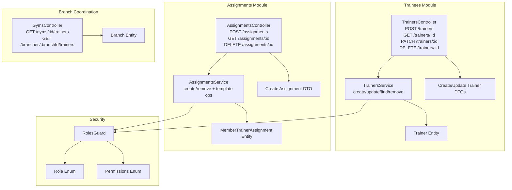
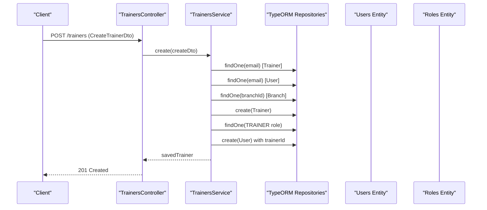
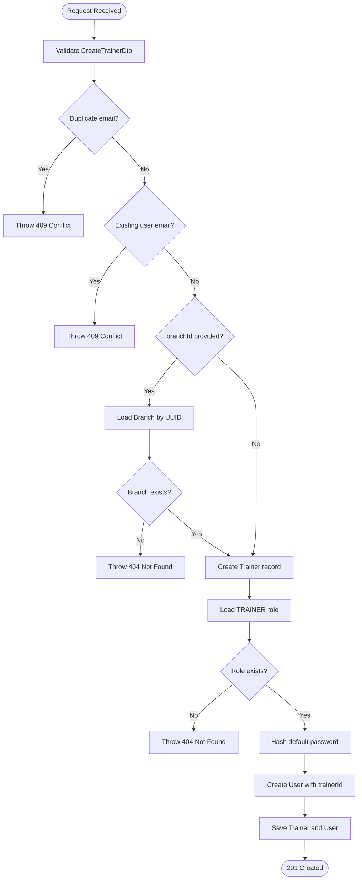
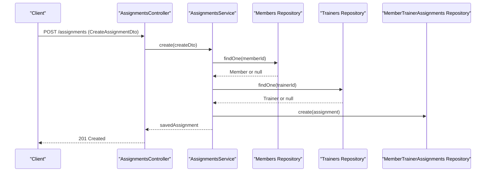
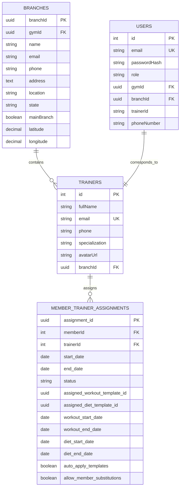
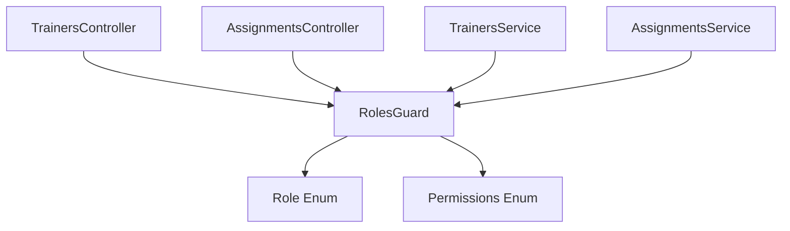

# Staff Management API

<cite>
**Referenced Files in This Document**
- [trainers.controller.ts](file://src/trainers/trainers.controller.ts)
- [trainers.service.ts](file://src/trainers/trainers.service.ts)
- [create-trainer.dto.ts](file://src/trainers/dto/create-trainer.dto.ts)
- [update-trainer.dto.ts](file://src/trainers/dto/update-trainer.dto.ts)
- [assignments.controller.ts](file://src/assignments/assignments.controller.ts)
- [assignments.service.ts](file://src/assignments/assignments.service.ts)
- [create-assignment.dto.ts](file://src/assignments/dto/create-assignment.dto.ts)
- [member_trainer_assignments.entity.ts](file://src/entities/member_trainer_assignments.entity.ts)
- [trainers.entity.ts](file://src/entities/trainers.entity.ts)
- [branch.entity.ts](file://src/entities/branch.entity.ts)
- [roles.guard.ts](file://src/auth/guards/roles.guard.ts)
- [role.enum.ts](file://src/common/enums/role.enum.ts)
- [permissions.enum.ts](file://src/common/enums/permissions.enum.ts)
- [gyms.controller.ts](file://src/gyms/gyms.controller.ts)
</cite>

## Table of Contents
1. [Introduction](#introduction)
2. [Project Structure](#project-structure)
3. [Core Components](#core-components)
4. [Architecture Overview](#architecture-overview)
5. [Detailed Component Analysis](#detailed-component-analysis)
6. [Dependency Analysis](#dependency-analysis)
7. [Performance Considerations](#performance-considerations)
8. [Troubleshooting Guide](#troubleshooting-guide)
9. [Conclusion](#conclusion)

## Introduction
This document provides comprehensive API documentation for staff management endpoints focused on trainer registration, profile management, assignment coordination, and branch-level staff operations. It covers HTTP methods, URL patterns, request/response schemas with validation rules, role-based access controls, and practical examples for common workflows such as trainer creation, profile updates, assignment management, and staff scheduling integration.

## Project Structure
The staff management functionality spans three primary modules:
- Trainers module: Handles trainer registration, profile updates, and branch-level retrieval
- Assignments module: Manages member-trainer assignments and template associations
- Branch/Gym coordination: Provides branch-level trainer listings and gym-wide staff visibility

**Diagram sources**
- [trainers.controller.ts:29-276](file://src/trainers/trainers.controller.ts#L29-L276)
- [trainers.service.ts:18-208](file://src/trainers/trainers.service.ts#L18-L208)
- [create-trainer.dto.ts:4-44](file://src/trainers/dto/create-trainer.dto.ts#L4-L44)
- [update-trainer.dto.ts:1-5](file://src/trainers/dto/update-trainer.dto.ts#L1-L5)
- [assignments.controller.ts:24-310](file://src/assignments/assignments.controller.ts#L24-L310)
- [assignments.service.ts:27-258](file://src/assignments/assignments.service.ts#L27-L258)
- [create-assignment.dto.ts:10-43](file://src/assignments/dto/create-assignment.dto.ts#L10-L43)
- [member_trainer_assignments.entity.ts:14-66](file://src/entities/member_trainer_assignments.entity.ts#L14-L66)
- [trainers.entity.ts:4-27](file://src/entities/trainers.entity.ts#L4-L27)
- [branch.entity.ts:18-79](file://src/entities/branch.entity.ts#L18-L79)
- [roles.guard.ts:13-42](file://src/auth/guards/roles.guard.ts#L13-L42)
- [role.enum.ts:1-7](file://src/common/enums/role.enum.ts#L1-L7)
- [permissions.enum.ts:50-84](file://src/common/enums/permissions.enum.ts#L50-L84)
- [gyms.controller.ts:507-516](file://src/gyms/gyms.controller.ts#L507-L516)

**Section sources**
- [trainers.controller.ts:29-276](file://src/trainers/trainers.controller.ts#L29-L276)
- [assignments.controller.ts:24-310](file://src/assignments/assignments.controller.ts#L24-L310)
- [gyms.controller.ts:507-516](file://src/gyms/gyms.controller.ts#L507-L516)

## Core Components
This section documents the primary endpoints for staff management with HTTP methods, URL patterns, request/response schemas, validation rules, and access control.

### Trainer Registration and Profile Management
- Base URL: `/trainers`
- Authentication: JWT Bearer required
- Authorization: Admins and Trainers (self-update)

Endpoints:
- POST /trainers
  - Purpose: Create a new trainer profile
  - Request body: CreateTrainerDto
  - Responses:
    - 201: Trainer created successfully
    - 400: Validation errors
    - 401: Unauthorized
    - 409: Email conflict
  - Example request payload:
    - fullName: string
    - email: string (unique)
    - phone: string (optional)
    - specialization: string (optional)
    - avatarUrl: string (optional)
    - branchId: string (optional, UUID)

- GET /trainers
  - Purpose: List all trainers with optional filters
  - Query params:
    - branchId: string (UUID)
    - specialization: string
  - Responses:
    - 200: Array of trainers
    - 401: Unauthorized

- GET /trainers/:id
  - Purpose: Retrieve a specific trainer by numeric ID
  - Path param: id (integer)
  - Responses:
    - 200: Trainer object
    - 401: Unauthorized
    - 403: Permission denied
    - 404: Not found

- PATCH /trainers/:id
  - Purpose: Update trainer profile (admin or self)
  - Path param: id (integer)
  - Request body: UpdateTrainerDto (partial fields)
  - Responses:
    - 200: Updated trainer
    - 400: Validation errors
    - 401: Unauthorized
    - 403: Permission denied
    - 404: Not found
    - 409: Email conflict

- DELETE /trainers/:id
  - Purpose: Remove a trainer (super admin only)
  - Path param: id (integer)
  - Responses:
    - 200: Deletion successful
    - 401: Unauthorized
    - 403: Permission denied
    - 404: Not found
    - 409: Cannot delete due to active relationships

- GET /branches/:branchId/trainers
  - Purpose: List all trainers for a specific branch
  - Path param: branchId (UUID)
  - Responses:
    - 200: Array of trainers
    - 401: Unauthorized
    - 403: Permission denied
    - 404: Branch not found

Validation rules (CreateTrainerDto):
- fullName: required, string
- email: required, valid email, unique
- phone: optional, string
- specialization: optional, string
- avatarUrl: optional, string
- branchId: optional, string (UUID)

Validation rules (UpdateTrainerDto):
- Inherits partial validation from CreateTrainerDto

**Section sources**
- [trainers.controller.ts:33-275](file://src/trainers/trainers.controller.ts#L33-L275)
- [create-trainer.dto.ts:4-44](file://src/trainers/dto/create-trainer.dto.ts#L4-L44)
- [update-trainer.dto.ts:1-5](file://src/trainers/dto/update-trainer.dto.ts#L1-L5)

### Assignment Management for Member Training Sessions
- Base URL: `/assignments`
- Authentication: JWT Bearer required
- Authorization: Admins and Branch Managers (creation/deletion)

Endpoints:
- POST /assignments
  - Purpose: Assign a member to a trainer
  - Request body: CreateAssignmentDto
  - Responses:
    - 201: Assignment created
    - 400: Invalid request (duplicate or capacity issues)
    - 401: Unauthorized
    - 403: Permission denied
    - 404: Member/trainer not found
    - 409: Assignment conflict

- GET /assignments
  - Purpose: List all assignments
  - Responses:
    - 200: Array of assignments
    - 401: Unauthorized
    - 403: Permission denied

- GET /assignments/:id
  - Purpose: Retrieve assignment by UUID
  - Path param: id (UUID)
  - Responses:
    - 200: Assignment object
    - 401: Unauthorized
    - 403: Permission denied
    - 404: Not found

- DELETE /assignments/:id
  - Purpose: Remove an assignment
  - Path param: id (UUID)
  - Responses:
    - 200: Deletion successful
    - 401: Unauthorized
    - 403: Permission denied
    - 404: Not found
    - 409: Cannot delete due to active sessions

Additional assignment endpoints:
- GET /members/:memberId/assignments
  - Purpose: View all assignments for a specific member
- GET /trainers/:trainerId/members
  - Purpose: View all members assigned to a specific trainer

Validation rules (CreateAssignmentDto):
- memberId: required, integer
- trainerId: required, integer
- startDate: required, ISO date string
- endDate: optional, ISO date string
- status: optional, enum ['active', 'ended']

**Section sources**
- [assignments.controller.ts:28-310](file://src/assignments/assignments.controller.ts#L28-L310)
- [create-assignment.dto.ts:10-43](file://src/assignments/dto/create-assignment.dto.ts#L10-L43)

### Branch-Level Staff Coordination
- GET /gyms/:gymId/trainers
  - Purpose: List all trainers for a gym across branches
- GET /branches/:branchId/trainers
  - Purpose: List trainers for a specific branch

These endpoints enable branch managers and admins to coordinate staff resources across locations.

**Section sources**
- [gyms.controller.ts:507-516](file://src/gyms/gyms.controller.ts#L507-L516)

## Architecture Overview
The staff management system integrates controllers, services, DTOs, and entities with robust validation and role-based access control.

**Diagram sources**
- [trainers.controller.ts:33-65](file://src/trainers/trainers.controller.ts#L33-L65)
- [trainers.service.ts:30-101](file://src/trainers/trainers.service.ts#L30-L101)

**Section sources**
- [trainers.controller.ts:33-65](file://src/trainers/trainers.controller.ts#L33-L65)
- [trainers.service.ts:30-101](file://src/trainers/trainers.service.ts#L30-L101)

## Detailed Component Analysis

### Trainer Registration Workflow
This workflow covers trainer creation, automatic user account generation, and branch assignment.

**Diagram sources**
- [trainers.service.ts:30-101](file://src/trainers/trainers.service.ts#L30-L101)

**Section sources**
- [trainers.service.ts:30-101](file://src/trainers/trainers.service.ts#L30-L101)

### Assignment Creation and Template Management
Assignment management supports member-trainer pairings and template assignments for workouts and diets.

**Diagram sources**
- [assignments.controller.ts:28-102](file://src/assignments/assignments.controller.ts#L28-L102)
- [assignments.service.ts:41-74](file://src/assignments/assignments.service.ts#L41-L74)

**Section sources**
- [assignments.controller.ts:28-102](file://src/assignments/assignments.controller.ts#L28-L102)
- [assignments.service.ts:41-74](file://src/assignments/assignments.service.ts#L41-L74)

### Data Models and Relationships
The following entities define the core data model for staff management:

**Diagram sources**
- [trainers.entity.ts:4-27](file://src/entities/trainers.entity.ts#L4-L27)
- [branch.entity.ts:18-79](file://src/entities/branch.entity.ts#L18-L79)
- [member_trainer_assignments.entity.ts:14-66](file://src/entities/member_trainer_assignments.entity.ts#L14-L66)

**Section sources**
- [trainers.entity.ts:4-27](file://src/entities/trainers.entity.ts#L4-L27)
- [branch.entity.ts:18-79](file://src/entities/branch.entity.ts#L18-L79)
- [member_trainer_assignments.entity.ts:14-66](file://src/entities/member_trainer_assignments.entity.ts#L14-L66)

## Dependency Analysis
The system enforces role-based access control through guards and enums, ensuring appropriate authorization for staff operations.

**Diagram sources**
- [roles.guard.ts:13-42](file://src/auth/guards/roles.guard.ts#L13-L42)
- [role.enum.ts:1-7](file://src/common/enums/role.enum.ts#L1-L7)
- [permissions.enum.ts:50-84](file://src/common/enums/permissions.enum.ts#L50-L84)
- [trainers.controller.ts:31-32](file://src/trainers/trainers.controller.ts#L31-L32)
- [assignments.controller.ts:26-27](file://src/assignments/assignments.controller.ts#L26-L27)

**Section sources**
- [roles.guard.ts:13-42](file://src/auth/guards/roles.guard.ts#L13-L42)
- [role.enum.ts:1-7](file://src/common/enums/role.enum.ts#L1-L7)
- [permissions.enum.ts:50-84](file://src/common/enums/permissions.enum.ts#L50-L84)

## Performance Considerations
- Use pagination and filtering (branchId, specialization) for trainer listings to reduce payload sizes.
- Leverage lazy loading and selective field queries for assignment details to minimize database overhead.
- Cache frequently accessed branch and role data where appropriate.
- Monitor assignment template usage increments to prevent excessive writes.

## Troubleshooting Guide
Common error scenarios and resolutions:

- Invalid trainer email during creation:
  - Symptom: 409 Conflict indicating duplicate email
  - Resolution: Ensure unique email addresses for trainers and users

- Trainer not found by ID:
  - Symptom: 404 Not Found when retrieving or updating a trainer
  - Resolution: Verify trainer ID exists and is active

- Permission denied for trainer deletion:
  - Symptom: 403 Forbidden when attempting to delete a trainer
  - Resolution: Only super admins can delete trainers; ensure proper role assignment

- Assignment conflicts:
  - Symptom: 409 Conflict when creating assignments
  - Resolution: Check for existing assignments or capacity constraints before creation

- Branch not found:
  - Symptom: 404 Not Found when accessing branch-specific endpoints
  - Resolution: Validate branch UUID and access permissions

**Section sources**
- [trainers.service.ts:30-101](file://src/trainers/trainers.service.ts#L30-L101)
- [assignments.service.ts:41-74](file://src/assignments/assignments.service.ts#L41-L74)

## Conclusion
The staff management API provides a comprehensive set of endpoints for trainer registration, profile management, assignment coordination, and branch-level staff operations. With strict validation, role-based access control, and clear error responses, the system supports efficient staff coordination across gym locations while maintaining data integrity and security.