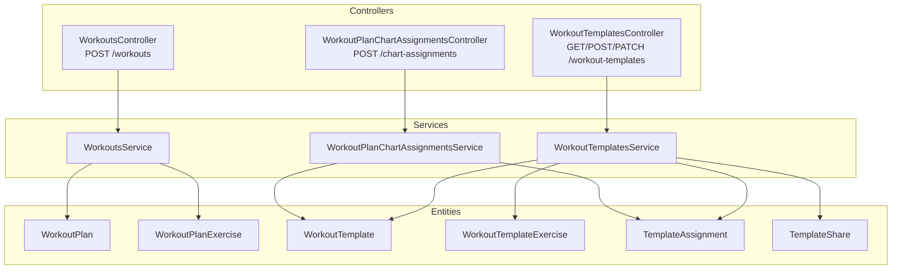
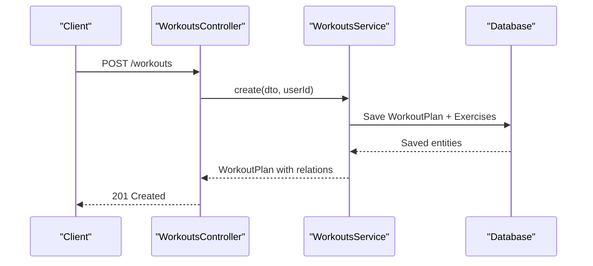
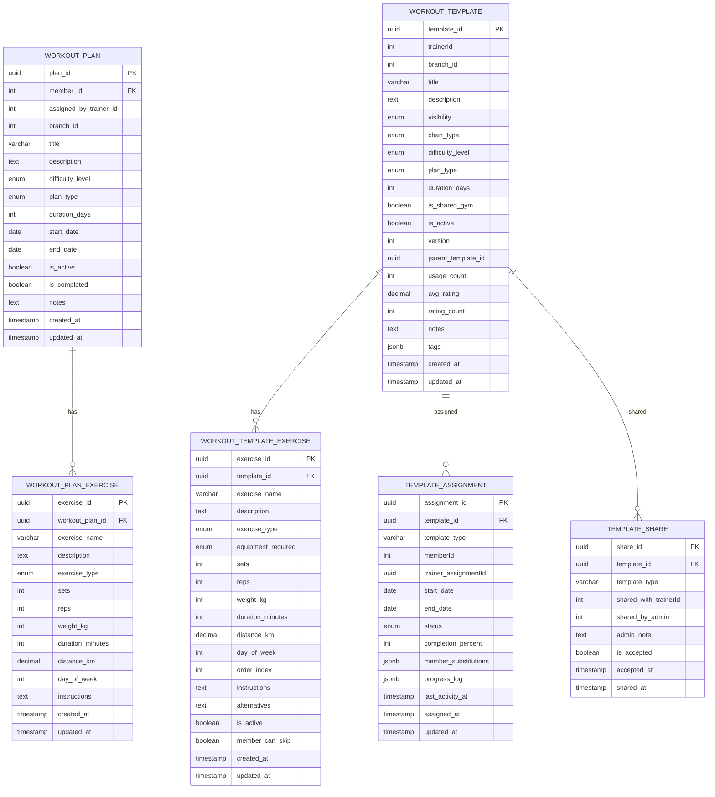
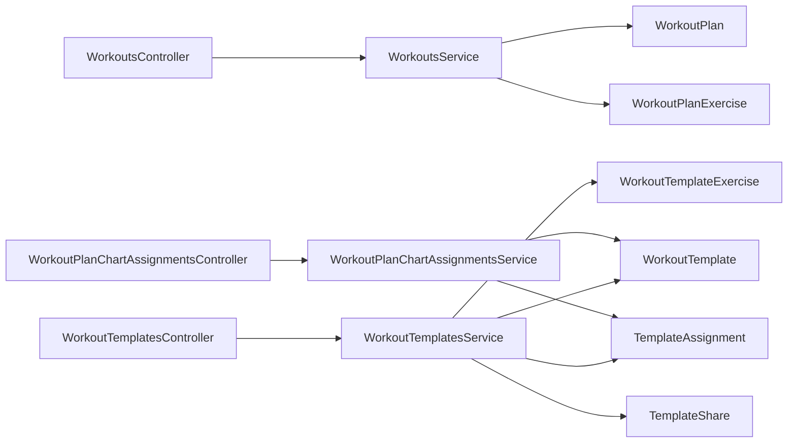

# Training Programs API

<cite>
**Referenced Files in This Document**
- [workouts.controller.ts](file://src/workouts/workouts.controller.ts)
- [workout-templates.controller.ts](file://src/workouts/workout-templates.controller.ts)
- [workout-plan-chart-assignments.controller.ts](file://src/workouts/workout-plan-chart-assignments.controller.ts)
- [workouts.service.ts](file://src/workouts/workouts.service.ts)
- [workout-templates.service.ts](file://src/workouts/workout-templates.service.ts)
- [workout-plan-chart-assignments.service.ts](file://src/workouts/workout-plan-chart-assignments.service.ts)
- [create-workout-plan.dto.ts](file://src/workouts/dto/create-workout-plan.dto.ts)
- [create-workout-template.dto.ts](file://src/workouts/dto/create-workout-template.dto.ts)
- [create-chart-assignment.dto.ts](file://src/workouts/dto/create-chart-assignment.dto.ts)
- [update-chart-assignment.dto.ts](file://src/workouts/dto/update-chart-assignment.dto.ts)
- [create-exercise.dto.ts](file://src/exercise-library/dto/create-exercise.dto.ts)
- [workout_plans.entity.ts](file://src/entities/workout_plans.entity.ts)
- [workout_templates.entity.ts](file://src/entities/workout_templates.entity.ts)
- [workout_template_exercises.entity.ts](file://src/entities/workout_template_exercises.entity.ts)
- [template_assignments.entity.ts](file://src/entities/template_assignments.entity.ts)
- [template_shares.entity.ts](file://src/entities/template_shares.entity.ts)
</cite>

## Table of Contents
1. [Introduction](#introduction)
2. [Project Structure](#project-structure)
3. [Core Components](#core-components)
4. [Architecture Overview](#architecture-overview)
5. [Detailed Component Analysis](#detailed-component-analysis)
6. [Dependency Analysis](#dependency-analysis)
7. [Performance Considerations](#performance-considerations)
8. [Troubleshooting Guide](#troubleshooting-guide)
9. [Conclusion](#conclusion)
10. [Appendices](#appendices)

## Introduction
This document describes the Training Programs API that enables creation and management of workout plans and templates, integration with an exercise library, and assignment workflows for distributing training programs to members. It covers HTTP endpoints, request/response schemas, validation rules, and complex data relationships across plans, templates, assignments, and exercise metadata.

## Project Structure
The Training Programs API is organized around three primary areas:
- Workout Plans: Member-specific training programs with exercises and scheduling
- Workout Templates: Reusable program blueprints with sharing and assignment capabilities
- Chart Assignments: Distribution of templates to members with progress tracking and substitutions

**Diagram sources**
- [workouts.controller.ts:30-460](file://src/workouts/workouts.controller.ts#L30-L460)
- [workout-templates.controller.ts:39-525](file://src/workouts/workout-templates.controller.ts#L39-L525)
- [workout-plan-chart-assignments.controller.ts:25-109](file://src/workouts/workout-plan-chart-assignments.controller.ts#L25-L109)
- [workouts.service.ts:16-280](file://src/workouts/workouts.service.ts#L16-L280)
- [workout-templates.service.ts:23-375](file://src/workouts/workout-templates.service.ts#L23-L375)
- [workout-plan-chart-assignments.service.ts:12-218](file://src/workouts/workout-plan-chart-assignments.service.ts#L12-L218)
- [workout_plans.entity.ts:15-72](file://src/entities/workout_plans.entity.ts#L15-L72)
- [workout_templates.entity.ts:41-125](file://src/entities/workout_templates.entity.ts#L41-L125)
- [workout_template_exercises.entity.ts:23-90](file://src/entities/workout_template_exercises.entity.ts#L23-L90)
- [template_assignments.entity.ts:12-74](file://src/entities/template_assignments.entity.ts#L12-L74)
- [template_shares.entity.ts:11-42](file://src/entities/template_shares.entity.ts#L11-L42)

**Section sources**
- [workouts.controller.ts:29-460](file://src/workouts/workouts.controller.ts#L29-L460)
- [workout-templates.controller.ts:39-525](file://src/workouts/workout-templates.controller.ts#L39-L525)
- [workout-plan-chart-assignments.controller.ts:25-109](file://src/workouts/workout-plan-chart-assignments.controller.ts#L25-L109)

## Core Components
- WorkoutsController: Creates and lists workout plans for members
- WorkoutTemplatesController: Manages templates (create, copy, share, assign, rate, update, delete)
- WorkoutPlanChartAssignmentsController: Handles assignment of templates to members and tracks progress
- Services: Encapsulate business logic and persistence operations
- DTOs: Define request/response schemas and validation rules
- Entities: Model the domain (plans, templates, exercises, assignments, shares)

**Section sources**
- [workouts.controller.ts:29-460](file://src/workouts/workouts.controller.ts#L29-L460)
- [workout-templates.controller.ts:39-525](file://src/workouts/workout-templates.controller.ts#L39-L525)
- [workout-plan-chart-assignments.controller.ts:25-109](file://src/workouts/workout-plan-chart-assignments.controller.ts#L25-L109)
- [create-workout-plan.dto.ts:77-144](file://src/workouts/dto/create-workout-plan.dto.ts#L77-L144)
- [create-workout-template.dto.ts:99-322](file://src/workouts/dto/create-workout-template.dto.ts#L99-L322)
- [create-chart-assignment.dto.ts:4-27](file://src/workouts/dto/create-chart-assignment.dto.ts#L4-L27)

## Architecture Overview
The API follows a layered architecture:
- Controllers expose REST endpoints with Swagger metadata
- Services orchestrate domain operations and enforce authorization
- DTOs validate and document request/response schemas
- Entities define the persistent model and relationships

**Diagram sources**
- [workouts.controller.ts:34-460](file://src/workouts/workouts.controller.ts#L34-L460)
- [workouts.service.ts:31-125](file://src/workouts/workouts.service.ts#L31-L125)

**Section sources**
- [workouts.controller.ts:29-460](file://src/workouts/workouts.controller.ts#L29-L460)
- [workouts.service.ts:16-125](file://src/workouts/workouts.service.ts#L16-L125)

## Detailed Component Analysis

### Workout Plans API
Endpoints for creating and listing member-specific workout plans.

- Base Path: `/workouts`
- Authentication: JWT Bearer required
- Authorization: ADMIN or TRAINER only

Endpoints:
- POST /workouts
  - Description: Create a workout plan for a member
  - Request Body: CreateWorkoutPlanDto
  - Responses:
    - 201: Workout plan created with exercises and metadata
    - 400: Validation failure or invalid data
    - 403: Permission denied
    - 404: Member not found

- GET /workouts
  - Description: List workout plans with filtering and analytics
  - Query Parameters:
    - page, limit
    - memberId, planType, difficulty, status, isTemplate, creatorId
    - durationMin, durationMax, sessionsPerWeek
    - sortBy, sortOrder
  - Responses:
    - 200: Paginated list with analytics
    - 400: Invalid query parameters
    - 403: Permission denied

- GET /workouts/{id}
  - Description: Retrieve a workout plan by ID
  - Path Parameter: id (workout_{number})
  - Responses:
    - 200: Detailed plan with exercises and progress
    - 404: Not found

Request Schema (CreateWorkoutPlanDto):
- memberId: number (required)
- title: string (required)
- description: string (optional)
- difficulty_level: enum(beginner, intermediate, advanced)
- plan_type: enum(strength, cardio, flexibility, endurance, general)
- duration_days: number (min 1)
- start_date: date string
- end_date: date string
- trainerId: number (optional)
- branchId: string (optional)
- notes: string (optional)
- exercises: array of CreateWorkoutPlanExerciseDto (required and non-empty)

Exercise Schema (CreateWorkoutPlanExerciseDto):
- exercise_name: string (required)
- description: string (optional)
- exercise_type: enum(sets_reps, time, distance)
- sets: integer (min 1, optional)
- reps: integer (min 1, optional)
- weight_kg: number (min 0, optional)
- duration_minutes: integer (min 1, optional)
- distance_km: number (min 0, optional)
- day_of_week: integer (min 1)
- instructions: string (optional)

Response Schema (Workout Plan):
- Identifiers: plan_id (UUID), member id, assigned_by_trainer id (optional)
- Metadata: title, description, difficulty_level, plan_type, duration_days, is_active, is_completed
- Timeline: start_date, end_date, created_at, updated_at
- Notes: notes
- Exercises: array of exercise definitions with type-specific fields
- Nested relations: member, assigned_by_trainer, exercises

Example: Creating a 12-week strength program with multiple exercises and weekly progression is supported via the exercises array and plan metadata.

**Section sources**
- [workouts.controller.ts:34-460](file://src/workouts/workouts.controller.ts#L34-L460)
- [workouts.controller.ts:462-695](file://src/workouts/workouts.controller.ts#L462-L695)
- [workouts.controller.ts:697-711](file://src/workouts/workouts.controller.ts#L697-L711)
- [create-workout-plan.dto.ts:77-144](file://src/workouts/dto/create-workout-plan.dto.ts#L77-L144)
- [create-workout-plan.dto.ts:14-75](file://src/workouts/dto/create-workout-plan.dto.ts#L14-L75)
- [workout_plans.entity.ts:15-72](file://src/entities/workout_plans.entity.ts#L15-L72)
- [workouts.service.ts:31-125](file://src/workouts/workouts.service.ts#L31-L125)

### Workout Templates API
Endpoints for managing reusable training program templates, sharing, copying, assigning, rating, and updating.

- Base Path: `/workout-templates`
- Authentication: JWT Bearer required
- Authorization: RolesGuard requires TRAINERS or ADMIN

Endpoints:
- POST /workout-templates
  - Description: Create a template (trainer/admin)
  - Request Body: CreateWorkoutTemplateDto
  - Responses: 201 on success, 400 on validation, 403 on permission

- GET /workout-templates
  - Description: List templates with optional filters
  - Query Parameters:
    - page, limit
    - visibility (PRIVATE, GYM_PUBLIC)
    - chart_type (STRENGTH, CARDIO, HIIT, FLEXIBILITY, COMPOUND)
    - difficulty_level (BEGINNER, INTERMEDIATE, ADVANCED)
    - plan_type (strength, cardio, flexibility, endurance, general)
    - tags (array)
    - trainerId (admin-only)
    - shared_only (boolean)
  - Responses: 200 with items, total, pagination

- GET /workout-templates/trainer/my-templates
  - Description: Get templates created by the authenticated trainer
  - Responses: 200 or 403 if not a trainer

- GET /workout-templates/{id}
  - Description: Get template by UUID with exercises and trainer info
  - Responses: 200 or 404

- POST /workout-templates/{id}/copy
  - Description: Copy a template (trainer/admin)
  - Request Body: CopyWorkoutTemplateDto
  - Responses: 201 or 404

- POST /workout-templates/{id}/share
  - Description: Share template with a trainer (admin)
  - Request Body: { trainerId: number, adminNote?: string }
  - Responses: 201 or 404

- POST /workout-templates/{id}/accept
  - Description: Accept a shared template (trainer)
  - Request Body: { shareId: string }
  - Responses: 200 or 404

- POST /workout-templates/{id}/rate
  - Description: Rate a template (1-5)
  - Request Body: { rating: number }
  - Responses: 200 or 404

- POST /workout-templates/{id}/assign
  - Description: Assign template to a member (trainer/admin)
  - Request Body: AssignWorkoutTemplateDto
  - Responses: 201 or 404

- PATCH /workout-templates/{id}
  - Description: Update template (trainer/admin own only)
  - Request Body: UpdateWorkoutTemplateDto
  - Responses: 200 or 403/404

- DELETE /workout-templates/{id}
  - Description: Delete template (trainer/admin own only)
  - Responses: 200 or 403/404

Request Schemas:
- CreateWorkoutTemplateDto:
  - title, description (optional)
  - visibility (PRIVATE, GYM_PUBLIC)
  - chart_type, difficulty_level, plan_type
  - duration_days (min 1)
  - is_shared_gym (boolean)
  - notes, tags (optional)
  - exercises: array of CreateWorkoutTemplateExerciseDto

- CreateWorkoutTemplateExerciseDto:
  - exercise_name, description (optional)
  - exercise_type (sets_reps, time, distance)
  - equipment_required (enum), sets, reps, weight_kg
  - duration_minutes, distance_km
  - day_of_week (min 1), order_index (optional)
  - instructions, alternatives (optional)
  - member_can_skip (boolean)

- UpdateWorkoutTemplateDto:
  - Fields mirror create DTO except exercises are excluded from updates

- CopyWorkoutTemplateDto:
  - new_title (required), new_description (optional)

- RateWorkoutTemplateDto:
  - rating (integer 1-5)

- AssignWorkoutTemplateDto:
  - memberId (required), assignmentId (optional UUID)
  - start_date, end_date (optional date strings)
  - skipped_exercises (optional array)

Response Schemas:
- Template: template_id (UUID), trainerId, title, description, visibility, chart_type, difficulty_level, plan_type, duration_days, is_shared_gym, is_active, version, parent_template_id, usage_count, avg_rating, rating_count, notes, tags, exercises[], created_at, updated_at
- Assignment: assignment_id (UUID), template_id, template_type, memberId, trainer_assignmentId, start_date, end_date, status, completion_percent, member_substitutions, progress_log, last_activity_at, assigned_at, updated_at
- Share: share_id (UUID), template_id, template_type, shared_with_trainerId, shared_by_admin, admin_note, is_accepted, accepted_at, shared_at

Validation Rules:
- Enum restrictions enforced for plan_type, difficulty_level, chart_type, visibility
- Numeric constraints (min values) for counts and durations
- UUID validation for assignmentId
- Role-based access controls for create/update/delete/share/assign

**Section sources**
- [workout-templates.controller.ts:46-81](file://src/workouts/workout-templates.controller.ts#L46-L81)
- [workout-templates.controller.ts:83-188](file://src/workouts/workout-templates.controller.ts#L83-L188)
- [workout-templates.controller.ts:190-209](file://src/workouts/workout-templates.controller.ts#L190-L209)
- [workout-templates.controller.ts:211-232](file://src/workouts/workout-templates.controller.ts#L211-L232)
- [workout-templates.controller.ts:234-260](file://src/workouts/workout-templates.controller.ts#L234-L260)
- [workout-templates.controller.ts:262-305](file://src/workouts/workout-templates.controller.ts#L262-L305)
- [workout-templates.controller.ts:307-336](file://src/workouts/workout-templates.controller.ts#L307-L336)
- [workout-templates.controller.ts:338-377](file://src/workouts/workout-templates.controller.ts#L338-L377)
- [workout-templates.controller.ts:379-441](file://src/workouts/workout-templates.controller.ts#L379-L441)
- [workout-templates.controller.ts:443-473](file://src/workouts/workout-templates.controller.ts#L443-L473)
- [workout-templates.controller.ts:498-524](file://src/workouts/workout-templates.controller.ts#L498-L524)
- [create-workout-template.dto.ts:99-151](file://src/workouts/dto/create-workout-template.dto.ts#L99-L151)
- [create-workout-template.dto.ts:247-271](file://src/workouts/dto/create-workout-template.dto.ts#L247-L271)
- [create-workout-template.dto.ts:211-221](file://src/workouts/dto/create-workout-template.dto.ts#L211-L221)
- [create-workout-template.dto.ts:223-228](file://src/workouts/dto/create-workout-template.dto.ts#L223-L228)
- [workout_templates.entity.ts:41-125](file://src/entities/workout_templates.entity.ts#L41-L125)
- [workout_template_exercises.entity.ts:23-90](file://src/entities/workout_template_exercises.entity.ts#L23-L90)
- [template_assignments.entity.ts:12-74](file://src/entities/template_assignments.entity.ts#L12-L74)
- [template_shares.entity.ts:11-42](file://src/entities/template_shares.entity.ts#L11-L42)
- [workout-templates.service.ts:36-67](file://src/workouts/workout-templates.service.ts#L36-L67)
- [workout-templates.service.ts:69-132](file://src/workouts/workout-templates.service.ts#L69-L132)
- [workout-templates.service.ts:134-164](file://src/workouts/workout-templates.service.ts#L134-L164)
- [workout-templates.service.ts:195-250](file://src/workouts/workout-templates.service.ts#L195-L250)
- [workout-templates.service.ts:252-303](file://src/workouts/workout-templates.service.ts#L252-L303)
- [workout-templates.service.ts:305-331](file://src/workouts/workout-templates.service.ts#L305-L331)
- [workout-templates.service.ts:333-344](file://src/workouts/workout-templates.service.ts#L333-L344)
- [workout-templates.service.ts:346-358](file://src/workouts/workout-templates.service.ts#L346-L358)

### Exercise Library Integration
The exercise library supports standardized exercise definitions with metadata that can be referenced by templates and plans.

Key DTO:
- CreateExerciseDto:
  - exercise_name (required)
  - body_part (enum: upper_body, lower_body, core, cardio, full_body)
  - exercise_type (enum: strength, cardio, flexibility, endurance, general)
  - difficulty_level (enum: beginner, intermediate, advanced)
  - description, instructions, benefits, precautions (optional)
  - video_url, image_url (optional)

Usage:
- Templates and plans can reference exercises by name and type
- Exercise metadata supports consistent instruction, difficulty, and equipment requirements across programs

**Section sources**
- [create-exercise.dto.ts:4-63](file://src/exercise-library/dto/create-exercise.dto.ts#L4-L63)

### Assignment Workflows (Chart Assignments)
Distribution of templates to members with progress tracking and substitutions.

- Base Path: `/chart-assignments`
- Authentication: JWT Bearer required
- Authorization: ADMIN, TRAINER, or MEMBER depending on endpoint

Endpoints:
- POST /chart-assignments
  - Description: Assign a workout chart (template) to a member
  - Request Body: CreateChartAssignmentDto
  - Responses: 201 or 400/404

- GET /chart-assignments
  - Description: List assignments with optional filters
  - Query Parameters: memberId (optional), chartId (optional), status (optional)
  - Responses: 200

- GET /chart-assignments/member/{memberId}
  - Description: Get active assignments for a member
  - Responses: 200

- GET /chart-assignments/{id}
  - Description: Get a specific assignment
  - Responses: 200 or 404

- PATCH /chart-assignments/{id}
  - Description: Update assignment (status, end_date, completion_percent)
  - Request Body: UpdateChartAssignmentDto
  - Responses: 200

- POST /chart-assignments/{id}/substitutions
  - Description: Add an exercise substitution
  - Request Body: { original_exercise, substituted_exercise, reason? }
  - Responses: 200

- POST /chart-assignments/{id}/exercise-completion
  - Description: Record exercise completion
  - Request Body: { exerciseName, completedSets, completedReps[] }
  - Responses: 200

- PATCH /chart-assignments/{id}/cancel
  - Description: Cancel an assignment
  - Responses: 200

- DELETE /chart-assignments/{id}
  - Description: Delete an assignment (admin)
  - Responses: 200

Request Schemas:
- CreateChartAssignmentDto:
  - chart_id (UUID), memberId (min 1), start_date, end_date (optional), notes (optional)

- UpdateChartAssignmentDto:
  - status (enum), end_date, completion_percent (0-100)

Response Schema:
- Assignment: assignment_id (UUID), chart_id, template_type, memberId, trainer_assignmentId, start_date, end_date, status, completion_percent, member_substitutions, progress_log, last_activity_at, assigned_at, updated_at

Validation Rules:
- Duplicate active assignment prevention
- Status transitions and completion percent bounds
- Date parsing and optional fields

**Section sources**
- [workout-plan-chart-assignments.controller.ts:32-37](file://src/workouts/workout-plan-chart-assignments.controller.ts#L32-L37)
- [workout-plan-chart-assignments.controller.ts:39-50](file://src/workouts/workout-plan-chart-assignments.controller.ts#L39-L50)
- [workout-plan-chart-assignments.controller.ts:52-56](file://src/workouts/workout-plan-chart-assignments.controller.ts#L52-L56)
- [workout-plan-chart-assignments.controller.ts:58-62](file://src/workouts/workout-plan-chart-assignments.controller.ts#L58-L62)
- [workout-plan-chart-assignments.controller.ts:64-69](file://src/workouts/workout-plan-chart-assignments.controller.ts#L64-L69)
- [workout-plan-chart-assignments.controller.ts:71-79](file://src/workouts/workout-plan-chart-assignments.controller.ts#L71-L79)
- [workout-plan-chart-assignments.controller.ts:81-94](file://src/workouts/workout-plan-chart-assignments.controller.ts#L81-L94)
- [workout-plan-chart-assignments.controller.ts:96-101](file://src/workouts/workout-plan-chart-assignments.controller.ts#L96-L101)
- [workout-plan-chart-assignments.controller.ts:103-108](file://src/workouts/workout-plan-chart-assignments.controller.ts#L103-L108)
- [create-chart-assignment.dto.ts:4-27](file://src/workouts/dto/create-chart-assignment.dto.ts#L4-L27)
- [update-chart-assignment.dto.ts:5-22](file://src/workouts/dto/update-chart-assignment.dto.ts#L5-L22)
- [workout-plan-chart-assignments.service.ts:26-92](file://src/workouts/workout-plan-chart-assignments.service.ts#L26-L92)
- [workout-plan-chart-assignments.service.ts:94-116](file://src/workouts/workout-plan-chart-assignments.service.ts#L94-L116)
- [workout-plan-chart-assignments.service.ts:118-127](file://src/workouts/workout-plan-chart-assignments.service.ts#L118-L127)
- [workout-plan-chart-assignments.service.ts:129-143](file://src/workouts/workout-plan-chart-assignments.service.ts#L129-L143)
- [workout-plan-chart-assignments.service.ts:145-165](file://src/workouts/workout-plan-chart-assignments.service.ts#L145-L165)
- [workout-plan-chart-assignments.service.ts:167-194](file://src/workouts/workout-plan-chart-assignments.service.ts#L167-L194)
- [workout-plan-chart-assignments.service.ts:196-200](file://src/workouts/workout-plan-chart-assignments.service.ts#L196-L200)
- [workout-plan-chart-assignments.service.ts:202-206](file://src/workouts/workout-plan-chart-assignments.service.ts#L202-L206)
- [workout-plan-chart-assignments.service.ts:208-217](file://src/workouts/workout-plan-chart-assignments.service.ts#L208-L217)

### Practical Examples

#### Example 1: Create a 12-week strength program
- Endpoint: POST /workouts
- Purpose: Create a comprehensive plan for a member with multiple exercises and weekly progression
- Steps:
  - Prepare CreateWorkoutPlanDto with memberId, title, plan_type, difficulty_level, duration_days, start_date, end_date
  - Populate exercises array with CreateWorkoutPlanExerciseDto entries (sets/reps/time/distance)
  - Submit request with JWT Bearer token
- Expected Response: 201 with full workout plan including exercises and metadata

**Section sources**
- [workouts.controller.ts:34-460](file://src/workouts/workouts.controller.ts#L34-L460)
- [create-workout-plan.dto.ts:77-144](file://src/workouts/dto/create-workout-plan.dto.ts#L77-L144)

#### Example 2: Create and share a template
- Endpoint: POST /workout-templates
- Purpose: Create a template with exercises
- Steps:
  - Prepare CreateWorkoutTemplateDto with title, chart_type, difficulty_level, plan_type, duration_days, exercises[]
  - Submit request with JWT Bearer token (TRAINER or ADMIN)
- Share template:
  - POST /workout-templates/{id}/share with { trainerId, adminNote? }
- Accept template:
  - POST /workout-templates/{id}/accept with { shareId }

**Section sources**
- [workout-templates.controller.ts:46-81](file://src/workouts/workout-templates.controller.ts#L46-L81)
- [workout-templates.controller.ts:262-305](file://src/workouts/workout-templates.controller.ts#L262-L305)
- [workout-templates.controller.ts:307-336](file://src/workouts/workout-templates.controller.ts#L307-L336)
- [create-workout-template.dto.ts:99-151](file://src/workouts/dto/create-workout-template.dto.ts#L99-L151)

#### Example 3: Assign template to a member
- Endpoint: POST /workout-templates/{id}/assign
- Purpose: Distribute a template to a member for a specific period
- Steps:
  - Prepare AssignWorkoutTemplateDto with memberId, optional start_date/end_date
  - Submit request with JWT Bearer token (TRAINER or ADMIN)
- Track progress:
  - Use POST /chart-assignments with chart_id (template_id), memberId, start_date
  - Add substitutions and completion events via chart-assignments endpoints

**Section sources**
- [workout-templates.controller.ts:379-441](file://src/workouts/workout-templates.controller.ts#L379-L441)
- [workout-plan-chart-assignments.controller.ts:32-37](file://src/workouts/workout-plan-chart-assignments.controller.ts#L32-L37)
- [workout-plan-chart-assignments.controller.ts:71-79](file://src/workouts/workout-plan-chart-assignments.controller.ts#L71-L79)
- [workout-plan-chart-assignments.controller.ts:81-94](file://src/workouts/workout-plan-chart-assignments.controller.ts#L81-L94)

#### Example 4: Exercise library integration
- Endpoint: POST /exercise-library (conceptual)
- Purpose: Standardize exercise definitions with metadata
- Steps:
  - Prepare CreateExerciseDto with exercise_name, body_part, exercise_type, difficulty_level
  - Optionally include description, instructions, benefits, precautions, media URLs
- Usage:
  - Reference exercises by name/type in templates/plans

**Section sources**
- [create-exercise.dto.ts:4-63](file://src/exercise-library/dto/create-exercise.dto.ts#L4-L63)

### API Definitions

#### WorkoutsController Endpoints
- POST /workouts
  - Auth: JWT Bearer
  - Roles: ADMIN, TRAINER
  - Request: CreateWorkoutPlanDto
  - Responses: 201, 400, 403, 404

- GET /workouts
  - Auth: JWT Bearer
  - Query: Filtering and pagination parameters
  - Responses: 200, 400, 403

- GET /workouts/{id}
  - Auth: JWT Bearer
  - Path: id (workout_{number})
  - Responses: 200, 404

**Section sources**
- [workouts.controller.ts:34-460](file://src/workouts/workouts.controller.ts#L34-L460)
- [workouts.controller.ts:462-695](file://src/workouts/workouts.controller.ts#L462-L695)
- [workouts.controller.ts:697-711](file://src/workouts/workouts.controller.ts#L697-L711)

#### WorkoutTemplatesController Endpoints
- POST /workout-templates
  - Auth: JWT Bearer
  - Roles: TRAINERS, ADMIN
  - Request: CreateWorkoutTemplateDto
  - Responses: 201, 400, 403

- GET /workout-templates
  - Auth: JWT Bearer
  - Query: Filters and pagination
  - Responses: 200

- GET /workout-templates/trainer/my-templates
  - Auth: JWT Bearer
  - Roles: TRAINERS
  - Responses: 200, 403

- GET /workout-templates/{id}
  - Auth: JWT Bearer
  - Responses: 200, 404

- POST /workout-templates/{id}/copy
  - Auth: JWT Bearer
  - Roles: TRAINERS, ADMIN
  - Request: CopyWorkoutTemplateDto
  - Responses: 201, 404

- POST /workout-templates/{id}/share
  - Auth: JWT Bearer
  - Roles: ADMIN
  - Request: { trainerId, adminNote? }
  - Responses: 201, 404

- POST /workout-templates/{id}/accept
  - Auth: JWT Bearer
  - Roles: TRAINERS
  - Request: { shareId }
  - Responses: 200, 404

- POST /workout-templates/{id}/rate
  - Auth: JWT Bearer
  - Request: { rating }
  - Responses: 200, 404

- POST /workout-templates/{id}/assign
  - Auth: JWT Bearer
  - Roles: TRAINERS, ADMIN
  - Request: AssignWorkoutTemplateDto
  - Responses: 201, 404

- PATCH /workout-templates/{id}
  - Auth: JWT Bearer
  - Roles: TRAINERS, ADMIN
  - Request: UpdateWorkoutTemplateDto
  - Responses: 200, 403, 404

- DELETE /workout-templates/{id}
  - Auth: JWT Bearer
  - Roles: TRAINERS, ADMIN
  - Responses: 200, 403, 404

**Section sources**
- [workout-templates.controller.ts:46-81](file://src/workouts/workout-templates.controller.ts#L46-L81)
- [workout-templates.controller.ts:83-188](file://src/workouts/workout-templates.controller.ts#L83-L188)
- [workout-templates.controller.ts:190-209](file://src/workouts/workout-templates.controller.ts#L190-L209)
- [workout-templates.controller.ts:211-232](file://src/workouts/workout-templates.controller.ts#L211-L232)
- [workout-templates.controller.ts:234-260](file://src/workouts/workout-templates.controller.ts#L234-L260)
- [workout-templates.controller.ts:262-305](file://src/workouts/workout-templates.controller.ts#L262-L305)
- [workout-templates.controller.ts:307-336](file://src/workouts/workout-templates.controller.ts#L307-L336)
- [workout-templates.controller.ts:338-377](file://src/workouts/workout-templates.controller.ts#L338-L377)
- [workout-templates.controller.ts:379-441](file://src/workouts/workout-templates.controller.ts#L379-L441)
- [workout-templates.controller.ts:443-473](file://src/workouts/workout-templates.controller.ts#L443-L473)
- [workout-templates.controller.ts:498-524](file://src/workouts/workout-templates.controller.ts#L498-L524)

#### WorkoutPlanChartAssignmentsController Endpoints
- POST /chart-assignments
  - Auth: JWT Bearer
  - Roles: ADMIN, TRAINER
  - Request: CreateChartAssignmentDto
  - Responses: 201, 400, 404

- GET /chart-assignments
  - Auth: JWT Bearer
  - Query: memberId, chartId, status
  - Responses: 200

- GET /chart-assignments/member/{memberId}
  - Auth: JWT Bearer
  - Responses: 200

- GET /chart-assignments/{id}
  - Auth: JWT Bearer
  - Responses: 200, 404

- PATCH /chart-assignments/{id}
  - Auth: JWT Bearer
  - Roles: ADMIN, TRAINER
  - Request: UpdateChartAssignmentDto
  - Responses: 200

- POST /chart-assignments/{id}/substitutions
  - Auth: JWT Bearer
  - Roles: ADMIN, TRAINER, MEMBER
  - Request: { original_exercise, substituted_exercise, reason? }
  - Responses: 200

- POST /chart-assignments/{id}/exercise-completion
  - Auth: JWT Bearer
  - Roles: ADMIN, TRAINER, MEMBER
  - Request: { exerciseName, completedSets, completedReps[] }
  - Responses: 200

- PATCH /chart-assignments/{id}/cancel
  - Auth: JWT Bearer
  - Roles: ADMIN, TRAINER
  - Responses: 200

- DELETE /chart-assignments/{id}
  - Auth: JWT Bearer
  - Roles: ADMIN
  - Responses: 200

**Section sources**
- [workout-plan-chart-assignments.controller.ts:32-37](file://src/workouts/workout-plan-chart-assignments.controller.ts#L32-L37)
- [workout-plan-chart-assignments.controller.ts:39-50](file://src/workouts/workout-plan-chart-assignments.controller.ts#L39-L50)
- [workout-plan-chart-assignments.controller.ts:52-56](file://src/workouts/workout-plan-chart-assignments.controller.ts#L52-L56)
- [workout-plan-chart-assignments.controller.ts:58-62](file://src/workouts/workout-plan-chart-assignments.controller.ts#L58-L62)
- [workout-plan-chart-assignments.controller.ts:64-69](file://src/workouts/workout-plan-chart-assignments.controller.ts#L64-L69)
- [workout-plan-chart-assignments.controller.ts:71-79](file://src/workouts/workout-plan-chart-assignments.controller.ts#L71-L79)
- [workout-plan-chart-assignments.controller.ts:81-94](file://src/workouts/workout-plan-chart-assignments.controller.ts#L81-L94)
- [workout-plan-chart-assignments.controller.ts:96-101](file://src/workouts/workout-plan-chart-assignments.controller.ts#L96-L101)
- [workout-plan-chart-assignments.controller.ts:103-108](file://src/workouts/workout-plan-chart-assignments.controller.ts#L103-L108)

### Data Models

**Diagram sources**
- [workout_plans.entity.ts:15-72](file://src/entities/workout_plans.entity.ts#L15-L72)
- [workout_template_exercises.entity.ts:23-90](file://src/entities/workout_template_exercises.entity.ts#L23-L90)
- [workout_templates.entity.ts:41-125](file://src/entities/workout_templates.entity.ts#L41-L125)
- [template_assignments.entity.ts:12-74](file://src/entities/template_assignments.entity.ts#L12-L74)
- [template_shares.entity.ts:11-42](file://src/entities/template_shares.entity.ts#L11-L42)

## Dependency Analysis
- Controllers depend on Services for business logic
- Services depend on repositories for persistence
- DTOs validate and document request/response contracts
- Entities define relationships and constraints
- Authorization guards enforce role-based access

**Diagram sources**
- [workouts.controller.ts:30-460](file://src/workouts/workouts.controller.ts#L30-L460)
- [workout-templates.controller.ts:39-525](file://src/workouts/workout-templates.controller.ts#L39-L525)
- [workout-plan-chart-assignments.controller.ts:25-109](file://src/workouts/workout-plan-chart-assignments.controller.ts#L25-L109)
- [workouts.service.ts:16-280](file://src/workouts/workouts.service.ts#L16-L280)
- [workout-templates.service.ts:23-375](file://src/workouts/workout-templates.service.ts#L23-L375)
- [workout-plan-chart-assignments.service.ts:12-218](file://src/workouts/workout-plan-chart-assignments.service.ts#L12-L218)

**Section sources**
- [workouts.controller.ts:29-460](file://src/workouts/workouts.controller.ts#L29-L460)
- [workout-templates.controller.ts:39-525](file://src/workouts/workout-templates.controller.ts#L39-L525)
- [workout-plan-chart-assignments.controller.ts:25-109](file://src/workouts/workout-plan-chart-assignments.controller.ts#L25-L109)

## Performance Considerations
- Pagination: Use page and limit query parameters to control payload sizes
- Filtering: Apply filters early in queries to reduce result sets
- Relations: Lazy loading via relations where appropriate; eager load only when needed
- Validation: DTO validation prevents unnecessary database round trips
- Indexes: Consider indexing frequently queried fields (memberId, status, trainerId)

## Troubleshooting Guide
Common error responses and causes:
- 400 Bad Request
  - Validation failures in DTOs (missing required fields, invalid enums, out-of-range numbers)
  - Duplicate active assignment in chart-assignments
- 401 Unauthorized
  - Missing or invalid JWT Bearer token
- 403 Forbidden
  - Insufficient roles (non-admin/non-trainer attempting admin-only operations)
  - Attempting to modify templates owned by others
- 404 Not Found
  - Member, trainer, template, or assignment not found
  - Access denied for templates not owned or shared with trainer

Recommendations:
- Verify JWT token presence and validity
- Confirm user role matches endpoint requirements
- Ensure referenced IDs exist before assignment
- Review DTO constraints before sending requests

**Section sources**
- [workouts.controller.ts:294-307](file://src/workouts/workouts.controller.ts#L294-L307)
- [workouts.controller.ts:685-692](file://src/workouts/workouts.controller.ts#L685-L692)
- [workout-templates.controller.ts:71-79](file://src/workouts/workout-templates.controller.ts#L71-L79)
- [workout-templates.controller.ts:250-254](file://src/workouts/workout-templates.controller.ts#L250-L254)
- [workout-templates.controller.ts:460-462](file://src/workouts/workout-templates.controller.ts#L460-L462)
- [workout-plan-chart-assignments.controller.ts:52-53](file://src/workouts/workout-plan-chart-assignments.controller.ts#L52-L53)
- [workout-plan-chart-assignments.service.ts:51-53](file://src/workouts/workout-plan-chart-assignments.service.ts#L51-L53)

## Conclusion
The Training Programs API provides a robust foundation for creating, sharing, and assigning workout plans and templates, integrating with an exercise library, and tracking member progress. Clear separation of concerns across controllers, services, DTOs, and entities ensures maintainability and extensibility while enforcing role-based access and data validation.

## Appendices

### Curl Examples

- Create a workout plan
  - curl -X POST https://your-api/workouts \
    -H "Authorization: Bearer YOUR_JWT" \
    -H "Content-Type: application/json" \
    -d '{ "memberId": 123, "title": "Beginner Strength", "plan_type": "strength", "difficulty_level": "beginner", "duration_days": 30, "start_date": "2024-01-01", "end_date": "2024-01-30", "exercises": [...] }'

- Create a template
  - curl -X POST https://your-api/workout-templates \
    -H "Authorization: Bearer YOUR_JWT" \
    -H "Content-Type: application/json" \
    -d '{ "title": "Sample Template", "chart_type": "STRENGTH", "difficulty_level": "BEGINNER", "plan_type": "strength", "duration_days": 30, "exercises": [...] }'

- Share a template
  - curl -X POST https://your-api/workout-templates/{id}/share \
    -H "Authorization: Bearer YOUR_JWT" \
    -H "Content-Type: application/json" \
    -d '{ "trainerId": 456, "adminNote": "Review for client" }'

- Assign a template to a member
  - curl -X POST https://your-api/workout-templates/{id}/assign \
    -H "Authorization: Bearer YOUR_JWT" \
    -H "Content-Type: application/json" \
    -d '{ "memberId": 123, "start_date": "2024-01-01", "end_date": "2024-01-30" }'

- Assign a chart to a member
  - curl -X POST https://your-api/chart-assignments \
    -H "Authorization: Bearer YOUR_JWT" \
    -H "Content-Type: application/json" \
    -d '{ "chart_id": "TEMPLATE_UUID", "memberId": 123, "start_date": "2024-01-01", "end_date": "2024-01-30" }'

- Add an exercise substitution
  - curl -X POST https://your-api/chart-assignments/{id}/substitutions \
    -H "Authorization: Bearer YOUR_JWT" \
    -H "Content-Type: application/json" \
    -d '{ "original_exercise": "Bench Press", "substituted_exercise": "Incline Dumbbell Press", "reason": "Equipment unavailable" }'

### JavaScript Implementation (fetch)
- Create a workout plan
  - fetch("https://your-api/workouts", {
      method: "POST",
      headers: {
        "Authorization": "Bearer YOUR_JWT",
        "Content-Type": "application/json"
      },
      body: JSON.stringify({ memberId: 123, title: "Beginner Strength", plan_type: "strength", difficulty_level: "beginner", duration_days: 30, start_date: "2024-01-01", end_date: "2024-01-30", exercises: [...] })
    })

- Assign a chart
  - fetch("https://your-api/chart-assignments", {
      method: "POST",
      headers: {
        "Authorization": "Bearer YOUR_JWT",
        "Content-Type": "application/json"
      },
      body: JSON.stringify({ chart_id: "TEMPLATE_UUID", memberId: 123, start_date: "2024-01-01", end_date: "2024-01-30" })
    })

- Record exercise completion
  - fetch("https://your-api/chart-assignments/{id}/exercise-completion", {
      method: "POST",
      headers: {
        "Authorization": "Bearer YOUR_JWT",
        "Content-Type": "application/json"
      },
      body: JSON.stringify({ exerciseName: "Squats", completedSets: 3, completedReps: [8, 8, 7] })
    })