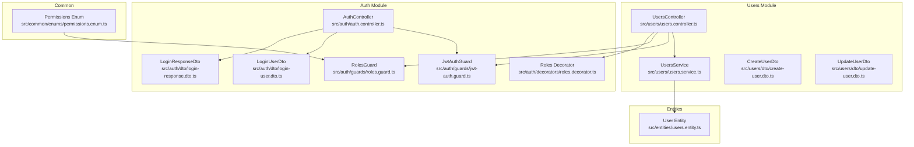
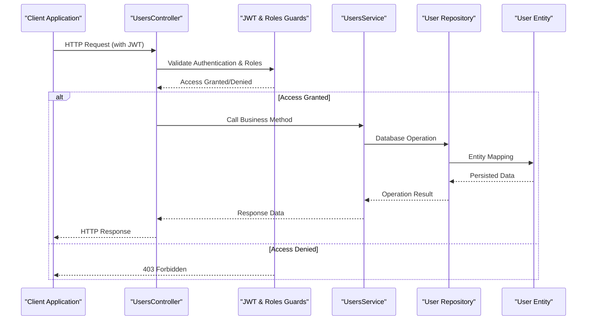
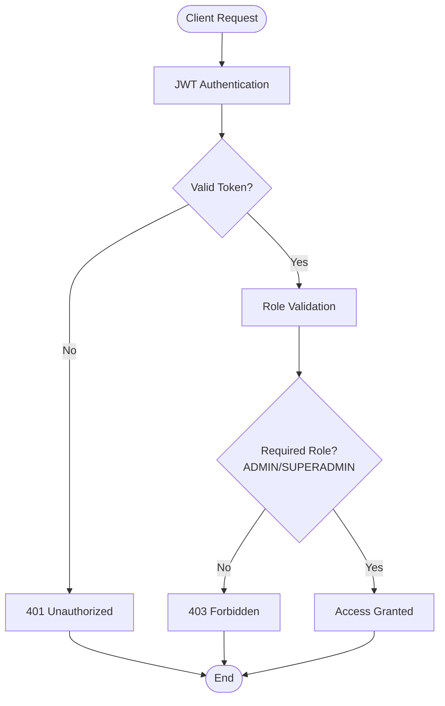
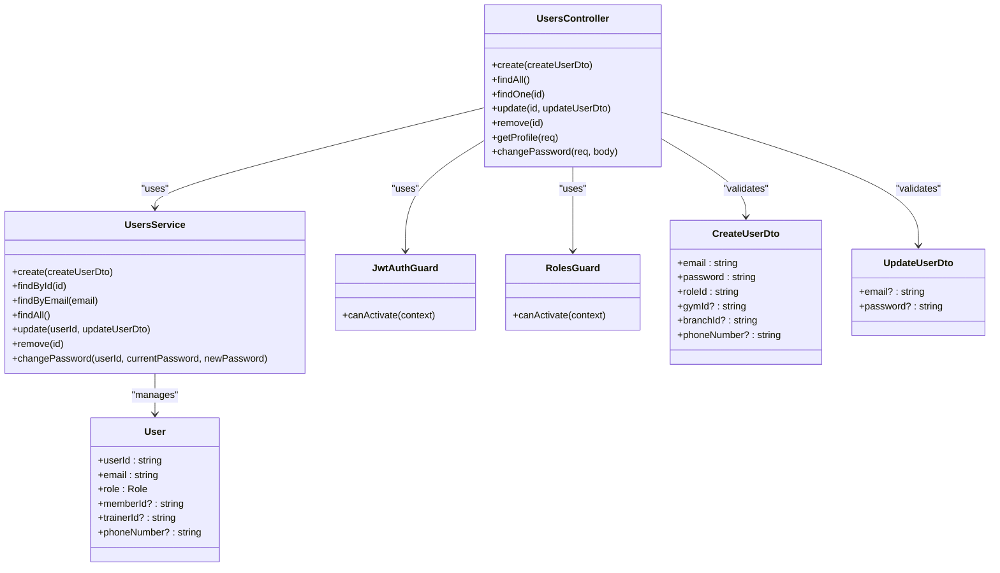

# User Management API

<cite>
**Referenced Files in This Document**
- [users.controller.ts](file://src/users/users.controller.ts)
- [users.service.ts](file://src/users/users.service.ts)
- [create-user.dto.ts](file://src/users/dto/create-user.dto.ts)
- [update-user.dto.ts](file://src/users/dto/update-user.dto.ts)
- [jwt-auth.guard.ts](file://src/auth/guards/jwt-auth.guard.ts)
- [roles.guard.ts](file://src/auth/guards/roles.guard.ts)
- [roles.decorator.ts](file://src/auth/decorators/roles.decorator.ts)
- [permissions.enum.ts](file://src/common/enums/permissions.enum.ts)
- [auth.controller.ts](file://src/auth/auth.controller.ts)
- [login-user.dto.ts](file://src/auth/dto/login-user.dto.ts)
- [login-response.dto.ts](file://src/auth/dto/login-response.dto.ts)
- [users.entity.ts](file://src/entities/users.entity.ts)
</cite>

## Table of Contents
1. [Introduction](#introduction)
2. [Project Structure](#project-structure)
3. [Core Components](#core-components)
4. [Architecture Overview](#architecture-overview)
5. [Detailed Component Analysis](#detailed-component-analysis)
6. [Dependency Analysis](#dependency-analysis)
7. [Performance Considerations](#performance-considerations)
8. [Troubleshooting Guide](#troubleshooting-guide)
9. [Conclusion](#conclusion)

## Introduction
This document provides comprehensive API documentation for user management endpoints in a NestJS-based fitness management application. It covers user creation, retrieval, updates, deletion, password changes, and profile management. The documentation includes HTTP methods, URL patterns, request/response schemas with validation rules, role-based access restrictions, JWT authentication requirements, admin-only operations, user self-service capabilities, and practical examples with curl commands and JavaScript fetch implementations.

## Project Structure
The user management functionality is implemented within the users module, with supporting authentication and authorization infrastructure in the auth module and shared permission definitions in the common module.



**Diagram sources**
- [users.controller.ts:29-344](file://src/users/users.controller.ts#L29-L344)
- [users.service.ts:12-168](file://src/users/users.service.ts#L12-L168)
- [jwt-auth.guard.ts:1-6](file://src/auth/guards/jwt-auth.guard.ts#L1-L6)
- [roles.guard.ts:12-42](file://src/auth/guards/roles.guard.ts#L12-L42)
- [roles.decorator.ts:5-8](file://src/auth/decorators/roles.decorator.ts#L5-L8)
- [auth.controller.ts:22-155](file://src/auth/auth.controller.ts#L22-L155)
- [permissions.enum.ts:43-84](file://src/common/enums/permissions.enum.ts#L43-L84)
- [users.entity.ts:14-52](file://src/entities/users.entity.ts#L14-L52)

**Section sources**
- [users.controller.ts:29-344](file://src/users/users.controller.ts#L29-L344)
- [users.service.ts:12-168](file://src/users/users.service.ts#L12-L168)
- [auth.controller.ts:22-155](file://src/auth/auth.controller.ts#L22-L155)

## Core Components
The user management API consists of several key components working together to provide secure and validated user operations:

### Authentication and Authorization
- **JWT Authentication**: All user endpoints require a valid JWT bearer token
- **Role-Based Access Control**: Admin and Superadmin privileges required for most operations
- **Self-Service Capabilities**: Users can manage their own profiles and passwords

### Data Validation
- **Create User**: Comprehensive validation for email format, password requirements, and UUID format
- **Update User**: Optional field updates with email validation
- **Password Changes**: Current password verification required

### Service Layer
- **User Repository Operations**: CRUD operations with proper error handling
- **Password Hashing**: Secure password storage using bcrypt
- **Profile Enrichment**: Automatic inclusion of role, gym, and branch information

**Section sources**
- [users.controller.ts:33-344](file://src/users/users.controller.ts#L33-L344)
- [users.service.ts:19-168](file://src/users/users.service.ts#L19-L168)
- [create-user.dto.ts:11-58](file://src/users/dto/create-user.dto.ts#L11-L58)
- [update-user.dto.ts:4-23](file://src/users/dto/update-user.dto.ts#L4-L23)

## Architecture Overview
The user management system follows a layered architecture with clear separation of concerns:



**Diagram sources**
- [users.controller.ts:33-344](file://src/users/users.controller.ts#L33-L344)
- [jwt-auth.guard.ts:1-6](file://src/auth/guards/jwt-auth.guard.ts#L1-L6)
- [roles.guard.ts:16-40](file://src/auth/guards/roles.guard.ts#L16-L40)
- [users.service.ts:19-168](file://src/users/users.service.ts#L19-L168)

## Detailed Component Analysis

### Authentication Flow
The authentication system uses JWT tokens with role-based access control:



**Diagram sources**
- [jwt-auth.guard.ts:1-6](file://src/auth/guards/jwt-auth.guard.ts#L1-L6)
- [roles.guard.ts:16-40](file://src/auth/guards/roles.guard.ts#L16-L40)
- [permissions.enum.ts:43-48](file://src/common/enums/permissions.enum.ts#L43-L48)

### User Creation Endpoint
**Endpoint**: `POST /users`
**Authentication**: JWT + ADMIN/SUPERADMIN roles required
**Description**: Creates a new user account with provided details

#### Request Schema
| Field | Type | Required | Validation | Description |
|-------|------|----------|------------|-------------|
| email | string | Yes | Email format, Unique | User's email address |
| password | string | Yes | Strong password | User's password |
| roleId | string | Yes | UUID format | Role identifier |
| gymId | string | No | UUID format | Gym association |
| branchId | string | No | UUID format | Branch association |
| phoneNumber | string | No | E.164 format | Mobile number |

#### Response Schema
| Field | Type | Description |
|-------|------|-------------|
| userId | string | Generated user identifier |
| email | string | User's email address |
| role | object | Role information |
| gym | object | Gym association (optional) |
| branch | object | Branch association (optional) |
| phoneNumber | string | Mobile number (optional) |
| createdAt | string | Creation timestamp |
| updatedAt | string | Last update timestamp |

#### Examples
**Success Response (201)**:
```json
{
  "userId": "usr_1234567890abcdef",
  "email": "admin@gym.com",
  "firstName": "John",
  "lastName": "Admin",
  "role": { "id": "role_admin_123", "name": "ADMIN" },
  "isActive": true,
  "createdAt": "2024-01-01T00:00:00Z"
}
```

**Error Responses**:
- **409 Conflict**: Duplicate email exists
- **400 Bad Request**: Invalid input data
- **403 Forbidden**: Insufficient privileges

**Section sources**
- [users.controller.ts:36-78](file://src/users/users.controller.ts#L36-L78)
- [users.service.ts:19-42](file://src/users/users.service.ts#L19-L42)
- [create-user.dto.ts:11-58](file://src/users/dto/create-user.dto.ts#L11-L58)

### User Retrieval Endpoints
**GET /users**: Retrieve all users (ADMIN/SUPERADMIN only)
**GET /users/:id**: Retrieve specific user by ID (ADMIN/SUPERADMIN only)
**GET /users/profile**: Retrieve current user's profile (authenticated users)

#### GET /users
**Authentication**: JWT + ADMIN/SUPERADMIN
**Response**: Array of user objects with pagination support

#### GET /users/:id
**Authentication**: JWT + ADMIN/SUPERADMIN
**Path Parameter**: `id` - User identifier
**Response**: Single user object with role and association details

#### GET /users/profile
**Authentication**: JWT
**Response**: Current user's profile information

**Section sources**
- [users.controller.ts:83-190](file://src/users/users.controller.ts#L83-L190)
- [users.service.ts:44-92](file://src/users/users.service.ts#L44-L92)

### User Update Endpoint
**PATCH /users/:id**
**Authentication**: JWT + ADMIN/SUPERADMIN or self-update
**Description**: Updates user information with partial updates

#### Request Schema
| Field | Type | Validation | Description |
|-------|------|------------|-------------|
| email | string | Email format | Updated email address |
| password | string | String format | New password |
| Other fields | - | - | Additional profile fields |

#### Update Logic
- **Admin Access**: Full user modification capabilities
- **Self-Service**: Limited to personal profile updates
- **Partial Updates**: Only provided fields are modified

**Section sources**
- [users.controller.ts:242-298](file://src/users/users.controller.ts#L242-L298)
- [users.service.ts:131-134](file://src/users/users.service.ts#L131-L134)
- [update-user.dto.ts:4-23](file://src/users/dto/update-user.dto.ts#L4-L23)

### User Deletion Endpoint
**DELETE /users/:id**
**Authentication**: JWT + ADMIN/SUPERADMIN
**Description**: Permanently deletes a user account

#### Security Considerations
- **Irreversible Action**: Account deletion cannot be undone
- **Cascade Effects**: Associated member/trainer records remain intact
- **Audit Trail**: System maintains logs for compliance

**Section sources**
- [users.controller.ts:302-342](file://src/users/users.controller.ts#L302-L342)
- [users.service.ts:136-138](file://src/users/users.service.ts#L136-L138)

### Password Management
**POST /users/change-password**
**Authentication**: JWT required
**Description**: Changes user's current password

#### Request Schema
| Field | Type | Required | Description |
|-------|------|----------|-------------|
| currentPassword | string | Yes | User's existing password |
| newPassword | string | Yes | New desired password |

#### Validation Rules
- **Current Password Verification**: Required before changes
- **Password Strength**: Enforced by service layer
- **Security**: Hashed storage only

**Section sources**
- [users.controller.ts:115-160](file://src/users/users.controller.ts#L115-L160)
- [users.service.ts:140-166](file://src/users/users.service.ts#L140-L166)

## Dependency Analysis
The user management system has well-defined dependencies and relationships:



**Diagram sources**
- [users.controller.ts:30-344](file://src/users/users.controller.ts#L30-L344)
- [users.service.ts:13-168](file://src/users/users.service.ts#L13-L168)
- [jwt-auth.guard.ts:5-5](file://src/auth/guards/jwt-auth.guard.ts#L5-L5)
- [roles.guard.ts:13-42](file://src/auth/guards/roles.guard.ts#L13-L42)
- [create-user.dto.ts:11-58](file://src/users/dto/create-user.dto.ts#L11-L58)
- [update-user.dto.ts:4-23](file://src/users/dto/update-user.dto.ts#L4-L23)
- [users.entity.ts:15-52](file://src/entities/users.entity.ts#L15-L52)

### Role-Based Access Matrix
| Endpoint | Required Role | Self-Service Allowed |
|----------|---------------|---------------------|
| POST /users | ADMIN, SUPERADMIN | No |
| GET /users | ADMIN, SUPERADMIN | No |
| GET /users/:id | ADMIN, SUPERADMIN | No |
| PATCH /users/:id | ADMIN, SUPERADMIN | Yes (limited) |
| DELETE /users/:id | ADMIN, SUPERADMIN | No |
| GET /users/profile | Authenticated User | Yes |
| POST /users/change-password | Authenticated User | Yes |

**Section sources**
- [users.controller.ts:33-344](file://src/users/users.controller.ts#L33-L344)
- [roles.guard.ts:16-40](file://src/auth/guards/roles.guard.ts#L16-L40)
- [permissions.enum.ts:43-84](file://src/common/enums/permissions.enum.ts#L43-L84)

## Performance Considerations
- **Database Indexes**: Email uniqueness constraint ensures efficient lookups
- **Lazy Loading**: Associations are loaded only when requested
- **Password Hashing**: Bcrypt cost factor optimized for security/performance balance
- **Response Filtering**: Password hashes are automatically excluded from responses
- **Caching Opportunities**: Frequent user lookups could benefit from caching layer

## Troubleshooting Guide

### Common Error Scenarios

#### Authentication Issues
- **401 Unauthorized**: Invalid or missing JWT token
- **403 Forbidden**: Insufficient role privileges
- **401 Invalid Credentials**: Login failures

#### Data Validation Errors
- **400 Bad Request**: Invalid input data format
- **409 Conflict**: Duplicate email address
- **404 Not Found**: User ID not found

#### Password Issues
- **400 Invalid Current Password**: Password change failures
- **422 Unprocessable Entity**: Password validation errors

### Debugging Steps
1. **Verify JWT Token**: Ensure token is present and unexpired
2. **Check Role Assignment**: Confirm user has required permissions
3. **Validate Input Data**: Test against DTO validation rules
4. **Review Database Constraints**: Check for unique constraint violations

**Section sources**
- [users.service.ts:20-24](file://src/users/users.service.ts#L20-L24)
- [roles.guard.ts:27-37](file://src/auth/guards/roles.guard.ts#L27-L37)
- [users.controller.ts:134-146](file://src/users/users.controller.ts#L134-L146)

## Conclusion
The user management API provides a comprehensive, secure, and well-structured solution for user operations in the fitness management system. Key strengths include:

- **Robust Security**: JWT authentication with role-based access control
- **Data Integrity**: Comprehensive validation and error handling
- **Flexible Operations**: Support for both admin and self-service capabilities
- **Clear Documentation**: Swagger integration with detailed examples
- **Extensible Design**: Modular architecture supporting future enhancements

The API supports essential user lifecycle operations while maintaining security best practices and providing clear error responses for troubleshooting. The implementation demonstrates good separation of concerns with clear boundaries between controllers, services, and data validation layers.