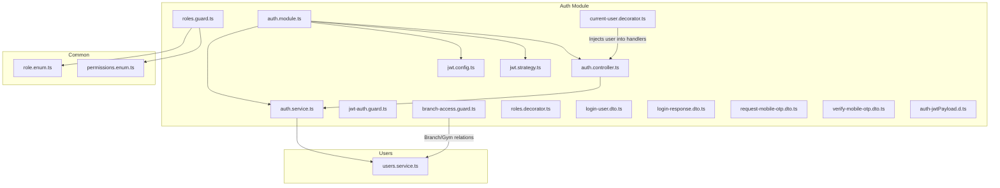
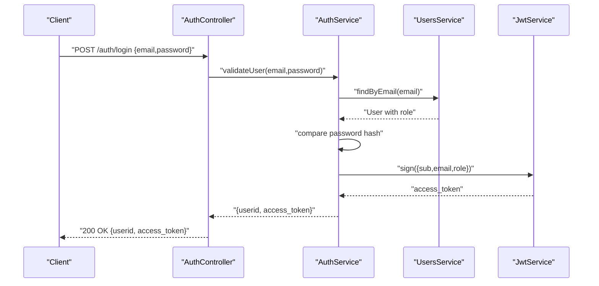
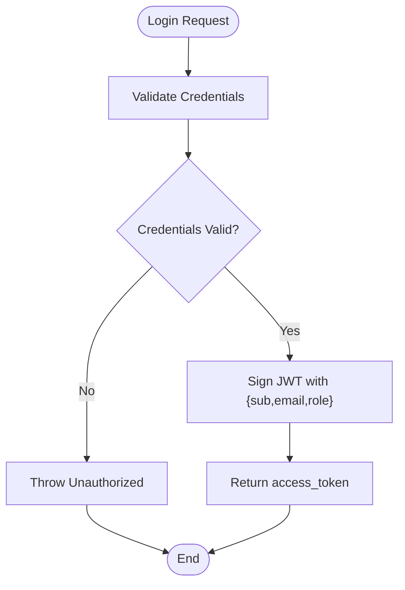
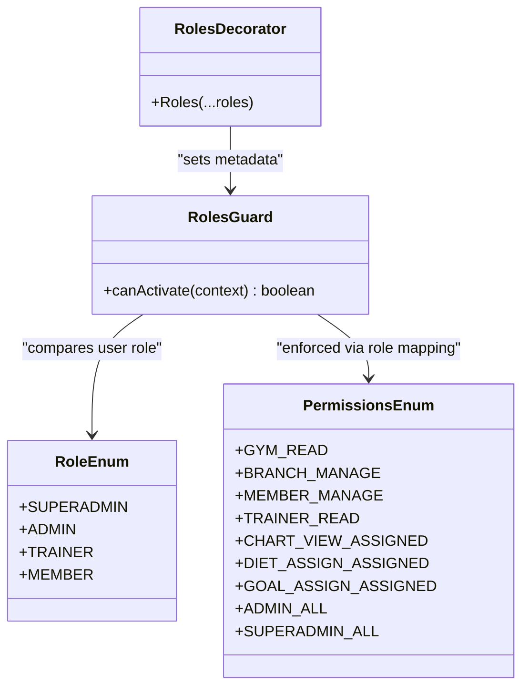
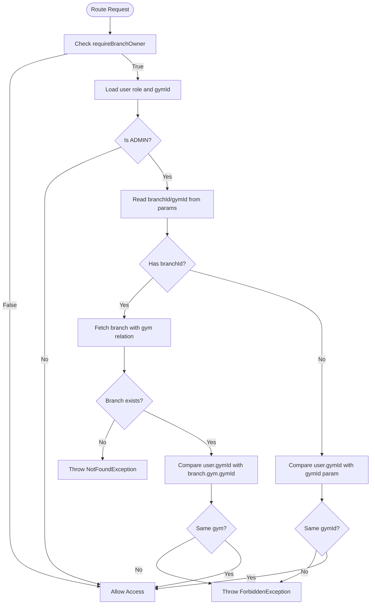
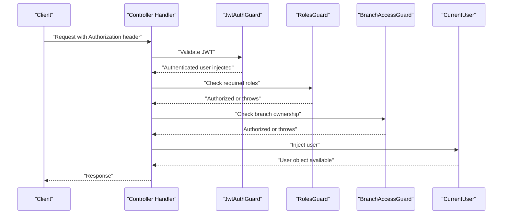
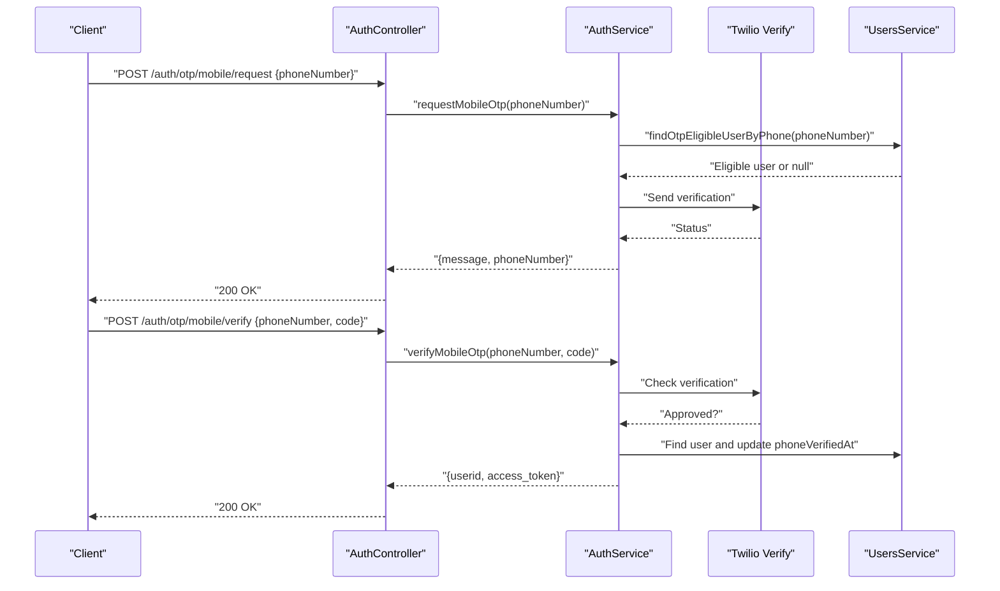
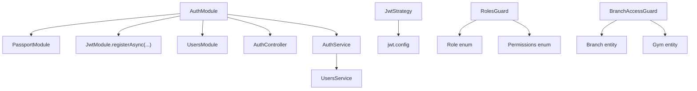

# Authentication & Authorization

<cite>
**Referenced Files in This Document**
- [auth.module.ts](file://src/auth/auth.module.ts)
- [auth.service.ts](file://src/auth/auth.service.ts)
- [auth.controller.ts](file://src/auth/auth.controller.ts)
- [jwt.config.ts](file://src/auth/config/jwt.config.ts)
- [jwt.strategy.ts](file://src/auth/strategies/jwt.strategy.ts)
- [jwt-auth.guard.ts](file://src/auth/guards/jwt-auth.guard.ts)
- [roles.guard.ts](file://src/auth/guards/roles.guard.ts)
- [branch-access.guard.ts](file://src/auth/guards/branch-access.guard.ts)
- [roles.decorator.ts](file://src/auth/decorators/roles.decorator.ts)
- [current-user.decorator.ts](file://src/auth/decorators/current-user.decorator.ts)
- [auth-jwtPayload.d.ts](file://src/auth/types/auth-jwtPayload.d.ts)
- [login-user.dto.ts](file://src/auth/dto/login-user.dto.ts)
- [login-response.dto.ts](file://src/auth/dto/login-response.dto.ts)
- [request-mobile-otp.dto.ts](file://src/auth/dto/request-mobile-otp.dto.ts)
- [verify-mobile-otp.dto.ts](file://src/auth/verify-mobile-otp.dto.ts)
- [role.enum.ts](file://src/common/enums/role.enum.ts)
- [permissions.enum.ts](file://src/common/enums/permissions.enum.ts)
- [users.service.ts](file://src/users/users.service.ts)
</cite>

## Table of Contents
1. [Introduction](#introduction)
2. [Project Structure](#project-structure)
3. [Core Components](#core-components)
4. [Architecture Overview](#architecture-overview)
5. [Detailed Component Analysis](#detailed-component-analysis)
6. [Dependency Analysis](#dependency-analysis)
7. [Performance Considerations](#performance-considerations)
8. [Troubleshooting Guide](#troubleshooting-guide)
9. [Conclusion](#conclusion)
10. [Appendices](#appendices)

## Introduction
This document explains the authentication and authorization architecture for the gym management system. It covers JWT-based authentication, role-based access control (RBAC), and multi-tenancy via branch-level access control. It also documents the login flow, token validation, session management, and logout behavior. Practical examples of guards, decorators, and permission checks are included, along with best practices and troubleshooting guidance.

## Project Structure
The authentication subsystem is organized around NestJS modules, controllers, services, guards, strategies, decorators, and DTOs. The Auth module integrates Passport and JWT, while guards enforce authentication and authorization policies. Enums define roles and permissions, and services encapsulate user and token logic.

**Diagram sources**
- [auth.module.ts:11-24](file://src/auth/auth.module.ts#L11-L24)
- [auth.controller.ts:24-25](file://src/auth/auth.controller.ts#L24-L25)
- [auth.service.ts:18-29](file://src/auth/auth.service.ts#L18-L29)
- [jwt.config.ts:4-12](file://src/auth/config/jwt.config.ts#L4-L12)
- [jwt.strategy.ts:9-25](file://src/auth/strategies/jwt.strategy.ts#L9-L25)
- [jwt-auth.guard.ts:4-5](file://src/auth/guards/jwt-auth.guard.ts#L4-L5)
- [roles.guard.ts:12-41](file://src/auth/guards/roles.guard.ts#L12-L41)
- [branch-access.guard.ts:14-72](file://src/auth/guards/branch-access.guard.ts#L14-L72)
- [roles.decorator.ts:5-7](file://src/auth/decorators/roles.decorator.ts#L5-L7)
- [current-user.decorator.ts:4-9](file://src/auth/decorators/current-user.decorator.ts#L4-L9)
- [login-user.dto.ts:4-17](file://src/auth/dto/login-user.dto.ts#L4-L17)
- [login-response.dto.ts:3-15](file://src/auth/dto/login-response.dto.ts#L3-L15)
- [request-mobile-otp.dto.ts:4-12](file://src/auth/dto/request-mobile-otp.dto.ts#L4-L12)
- [verify-mobile-otp.dto.ts:4-20](file://src/auth/dto/verify-mobile-otp.dto.ts#L4-L20)
- [auth-jwtPayload.d.ts:1-5](file://src/auth/types/auth-jwtPayload.d.ts#L1-L5)
- [role.enum.ts:1-7](file://src/common/enums/role.enum.ts#L1-L7)
- [permissions.enum.ts:50-83](file://src/common/enums/permissions.enum.ts#L50-L83)
- [users.service.ts:12-17](file://src/users/users.service.ts#L12-L17)

**Section sources**
- [auth.module.ts:11-24](file://src/auth/auth.module.ts#L11-L24)
- [auth.controller.ts:24-25](file://src/auth/auth.controller.ts#L24-L25)
- [auth.service.ts:18-29](file://src/auth/auth.service.ts#L18-L29)

## Core Components
- Auth controller: Exposes login, OTP request/verify, and logout endpoints. It validates inputs via DTOs and delegates to AuthService.
- Auth service: Implements credential validation, JWT signing, and Twilio-based OTP request/verification. It interacts with UsersService for user lookup and updates.
- JWT configuration: Centralizes secret and expiration settings loaded from environment variables.
- JWT strategy: Validates JWT tokens extracted from the Authorization header and returns a user object for downstream use.
- Guards:
  - JwtAuthGuard: Enforces JWT authentication using Passport.
  - RolesGuard: Enforces role-based access using metadata set by the Roles decorator.
  - BranchAccessGuard: Enforces branch-level access control for admins and superadmins.
- Decorators:
  - Roles: Sets role metadata for route protection.
  - CurrentUser: Injects the authenticated user into route handlers.
- DTOs and Types: Define request/response shapes and JWT payload structure.
- Enums: Define roles and permissions, plus role-to-permissions mapping.

**Section sources**
- [auth.controller.ts:27-88](file://src/auth/auth.controller.ts#L27-L88)
- [auth.service.ts:31-51](file://src/auth/auth.service.ts#L31-L51)
- [jwt.config.ts:6-10](file://src/auth/config/jwt.config.ts#L6-L10)
- [jwt.strategy.ts:22-24](file://src/auth/strategies/jwt.strategy.ts#L22-L24)
- [roles.guard.ts:16-40](file://src/auth/guards/roles.guard.ts#L16-L40)
- [branch-access.guard.ts:24-71](file://src/auth/guards/branch-access.guard.ts#L24-L71)
- [roles.decorator.ts:6-7](file://src/auth/decorators/roles.decorator.ts#L6-L7)
- [current-user.decorator.ts:4-9](file://src/auth/decorators/current-user.decorator.ts#L4-L9)
- [login-user.dto.ts:4-17](file://src/auth/dto/login-user.dto.ts#L4-L17)
- [login-response.dto.ts:3-15](file://src/auth/dto/login-response.dto.ts#L3-L15)
- [auth-jwtPayload.d.ts:1-5](file://src/auth/types/auth-jwtPayload.d.ts#L1-L5)
- [role.enum.ts:1-7](file://src/common/enums/role.enum.ts#L1-L7)
- [permissions.enum.ts:50-83](file://src/common/enums/permissions.enum.ts#L50-L83)

## Architecture Overview
The system uses bearer token authentication with JWT. On login, the backend validates credentials and returns a signed JWT. Subsequent requests include the JWT in the Authorization header. Passport strategy extracts and verifies the token, returning a lightweight user object. Guards apply authentication and authorization policies, and decorators expose user context to controllers.

**Diagram sources**
- [auth.controller.ts:75-87](file://src/auth/auth.controller.ts#L75-L87)
- [auth.service.ts:31-42](file://src/auth/auth.service.ts#L31-L42)
- [users.service.ts:94-96](file://src/users/users.service.ts#L94-L96)
- [auth.service.ts:44-50](file://src/auth/auth.service.ts#L44-L50)

## Detailed Component Analysis

### JWT-Based Authentication Flow
- Token issuance: On successful credential validation, the service signs a JWT containing subject (user ID), email, and role.
- Token validation: The strategy extracts the token from the Authorization header and verifies it against the configured secret. It returns a minimal user object for downstream use.
- Session management: The system uses stateless JWTs. Logout is client-side by discarding the token; no server-side revocation is implemented.

**Diagram sources**
- [auth.service.ts:31-51](file://src/auth/auth.service.ts#L31-L51)
- [jwt.strategy.ts:22-24](file://src/auth/strategies/jwt.strategy.ts#L22-L24)
- [auth.controller.ts:75-87](file://src/auth/auth.controller.ts#L75-L87)

**Section sources**
- [auth.service.ts:31-51](file://src/auth/auth.service.ts#L31-L51)
- [jwt.strategy.ts:22-24](file://src/auth/strategies/jwt.strategy.ts#L22-L24)
- [auth.controller.ts:75-87](file://src/auth/auth.controller.ts#L75-L87)

### Role-Based Access Control (RBAC)
- Roles: SUPERADMIN, ADMIN, TRAINER, MEMBER.
- Permissions: Fine-grained permissions for gyms, branches, members, trainers, charts/workouts, diets, and goals. A role-to-permissions mapping defines allowed actions per role.
- Guard enforcement: RolesGuard reads required roles from route metadata and compares against the authenticated user’s role.

**Diagram sources**
- [roles.guard.ts:12-41](file://src/auth/guards/roles.guard.ts#L12-L41)
- [roles.decorator.ts:5-7](file://src/auth/decorators/roles.decorator.ts#L5-L7)
- [role.enum.ts:1-7](file://src/common/enums/role.enum.ts#L1-L7)
- [permissions.enum.ts:50-83](file://src/common/enums/permissions.enum.ts#L50-L83)

**Section sources**
- [roles.guard.ts:16-40](file://src/auth/guards/roles.guard.ts#L16-L40)
- [roles.decorator.ts:6-7](file://src/auth/decorators/roles.decorator.ts#L6-L7)
- [role.enum.ts:1-7](file://src/common/enums/role.enum.ts#L1-L7)
- [permissions.enum.ts:50-83](file://src/common/enums/permissions.enum.ts#L50-L83)

### Branch-Level Access Control and Multi-Tenancy
- Superadmin: Full access across gyms and branches.
- Admin: Limited to their own gym/branch; the guard enforces this by comparing user’s gymId with the target resource’s gym association.
- BranchAccessGuard:
  - Reads a handler-level flag requiring branch ownership.
  - For admins, ensures branchId or gymId in route params matches the user’s gym association.
  - Throws NotFoundException for missing resources and ForbiddenException for unauthorized access.

**Diagram sources**
- [branch-access.guard.ts:24-71](file://src/auth/guards/branch-access.guard.ts#L24-L71)

**Section sources**
- [branch-access.guard.ts:24-71](file://src/auth/guards/branch-access.guard.ts#L24-L71)

### Authentication Decorators and Guards
- JwtAuthGuard: Enables JWT authentication globally or per-route.
- RolesGuard: Enforces role-based restrictions using Roles decorator metadata.
- BranchAccessGuard: Enforces branch-level access control using a handler-level flag.
- CurrentUser decorator: Injects the authenticated user into route handlers for easy access.

**Diagram sources**
- [jwt-auth.guard.ts:4-5](file://src/auth/guards/jwt-auth.guard.ts#L4-L5)
- [roles.guard.ts:16-40](file://src/auth/guards/roles.guard.ts#L16-L40)
- [branch-access.guard.ts:24-71](file://src/auth/guards/branch-access.guard.ts#L24-L71)
- [current-user.decorator.ts:4-9](file://src/auth/decorators/current-user.decorator.ts#L4-L9)

**Section sources**
- [jwt-auth.guard.ts:4-5](file://src/auth/guards/jwt-auth.guard.ts#L4-L5)
- [roles.guard.ts:16-40](file://src/auth/guards/roles.guard.ts#L16-L40)
- [branch-access.guard.ts:24-71](file://src/auth/guards/branch-access.guard.ts#L24-L71)
- [current-user.decorator.ts:4-9](file://src/auth/decorators/current-user.decorator.ts#L4-L9)

### Permission Checking Mechanisms
- Role-to-permissions mapping defines allowed actions per role.
- Controllers can combine Roles decorator and service-level checks for fine-grained control.
- Example patterns:
  - Apply @Roles(...) on routes to restrict access.
  - Use CurrentUser to access user context and enforce additional business rules in services.

**Section sources**
- [permissions.enum.ts:50-83](file://src/common/enums/permissions.enum.ts#L50-L83)
- [roles.decorator.ts:6-7](file://src/auth/decorators/roles.decorator.ts#L6-L7)
- [current-user.decorator.ts:4-9](file://src/auth/decorators/current-user.decorator.ts#L4-L9)

### Mobile OTP Authentication (Twilio)
- Request OTP: Validates eligibility (member/trainer with phone) and sends an SMS via Twilio Verify.
- Verify OTP: Confirms the code and marks phone as verified if needed, then issues a JWT.
- Error handling: Maps Twilio errors to appropriate HTTP statuses.

**Diagram sources**
- [auth.controller.ts:107-127](file://src/auth/auth.controller.ts#L107-L127)
- [auth.service.ts:53-118](file://src/auth/auth.service.ts#L53-L118)
- [users.service.ts:105-125](file://src/users/users.service.ts#L105-L125)

**Section sources**
- [auth.controller.ts:107-127](file://src/auth/auth.controller.ts#L107-L127)
- [auth.service.ts:53-118](file://src/auth/auth.service.ts#L53-L118)
- [users.service.ts:105-125](file://src/users/users.service.ts#L105-L125)

### Logout Procedures
- Logout is implemented as a no-op endpoint acknowledging logout. Since JWTs are stateless, logout is performed client-side by discarding the token. No server-side token blacklisting is implemented.

**Section sources**
- [auth.controller.ts:149-153](file://src/auth/auth.controller.ts#L149-L153)

## Dependency Analysis
- Auth module composes Passport, JWT, and the Users module. It exports AuthService for use across the application.
- Guards depend on Reflect metadata and TypeORM repositories for branch/gym checks.
- Strategy depends on JWT configuration for secret and expiration.
- Services depend on UsersService for user operations.

**Diagram sources**
- [auth.module.ts:12-20](file://src/auth/auth.module.ts#L12-L20)
- [jwt.strategy.ts:11-19](file://src/auth/strategies/jwt.strategy.ts#L11-L19)
- [jwt.config.ts:6-10](file://src/auth/config/jwt.config.ts#L6-L10)
- [roles.guard.ts:8-10](file://src/auth/guards/roles.guard.ts#L8-L10)
- [branch-access.guard.ts:18-22](file://src/auth/guards/branch-access.guard.ts#L18-L22)

**Section sources**
- [auth.module.ts:12-20](file://src/auth/auth.module.ts#L12-L20)
- [jwt.strategy.ts:11-19](file://src/auth/strategies/jwt.strategy.ts#L11-L19)
- [jwt.config.ts:6-10](file://src/auth/config/jwt.config.ts#L6-L10)
- [roles.guard.ts:8-10](file://src/auth/guards/roles.guard.ts#L8-L10)
- [branch-access.guard.ts:18-22](file://src/auth/guards/branch-access.guard.ts#L18-L22)

## Performance Considerations
- Stateless JWTs eliminate server-side session storage overhead.
- Keep JWT expiration short to reduce risk and enable frequent re-authentication.
- Use HTTPS in production to protect tokens in transit.
- Cache user roles and permissions at the edge if needed, but rely on server-side validation for security-sensitive endpoints.

## Troubleshooting Guide
- Invalid credentials during login:
  - Ensure email exists and password matches the stored hash.
  - Confirm UsersService returns a user with a password hash.
- Unauthorized access:
  - Verify the Authorization header contains a valid JWT.
  - Confirm the token is unexpired and signed with the correct secret.
- Role-based access denied:
  - Check that the user’s role matches the required roles set by the Roles decorator.
  - Review the role-to-permissions mapping for the intended action.
- Branch access denied:
  - For admins, ensure the requested branchId or gymId belongs to the user’s gym.
  - Confirm branch/gym relations are properly loaded.
- OTP issues:
  - Verify Twilio credentials and Verify Service SID are configured.
  - Confirm the phone number is eligible (member/trainer with verified phone).
  - Check Twilio error responses and handle mapped exceptions.

**Section sources**
- [auth.service.ts:31-42](file://src/auth/auth.service.ts#L31-L42)
- [jwt.strategy.ts:22-24](file://src/auth/strategies/jwt.strategy.ts#L22-L24)
- [roles.guard.ts:27-37](file://src/auth/guards/roles.guard.ts#L27-L37)
- [branch-access.guard.ts:55-66](file://src/auth/guards/branch-access.guard.ts#L55-L66)
- [auth.service.ts:120-162](file://src/auth/auth.service.ts#L120-L162)

## Conclusion
The system implements a robust, stateless JWT-based authentication and authorization framework with clear role and permission boundaries. Guards and decorators provide flexible, declarative access control, while branch-level guards enforce multi-tenancy constraints. OTP support via Twilio enhances authentication options for eligible users. Adhering to best practices around token lifecycle and secure transport ensures a resilient security posture.

## Appendices

### Role Hierarchy and Permissions
- SUPERADMIN: Full access across all domains.
- ADMIN: Manages gyms, branches, members, trainers, and has administrative capabilities.
- TRAINER: Assigned access to charts, diets, and goals within their scope.
- MEMBER: Self-access limited to personal data and related views.

**Section sources**
- [permissions.enum.ts:50-83](file://src/common/enums/permissions.enum.ts#L50-L83)
- [role.enum.ts:1-7](file://src/common/enums/role.enum.ts#L1-7)

### Implementation Examples (by reference)
- Applying a role guard to a route:
  - Use the Roles decorator to specify required roles.
  - Ensure RolesGuard is registered globally or per-route.
  - Reference: [roles.decorator.ts:6-7](file://src/auth/decorators/roles.decorator.ts#L6-L7), [roles.guard.ts:16-40](file://src/auth/guards/roles.guard.ts#L16-L40)
- Enforcing branch-level access:
  - Add a handler-level flag to require branch ownership.
  - Use BranchAccessGuard to validate access.
  - Reference: [branch-access.guard.ts:24-71](file://src/auth/guards/branch-access.guard.ts#L24-L71)
- Injecting the current user:
  - Use CurrentUser decorator in route handlers.
  - Reference: [current-user.decorator.ts:4-9](file://src/auth/decorators/current-user.decorator.ts#L4-L9)
- Custom guard implementation pattern:
  - Implement CanActivate, read metadata, and compare user context.
  - Reference: [roles.guard.ts:12-41](file://src/auth/guards/roles.guard.ts#L12-L41)