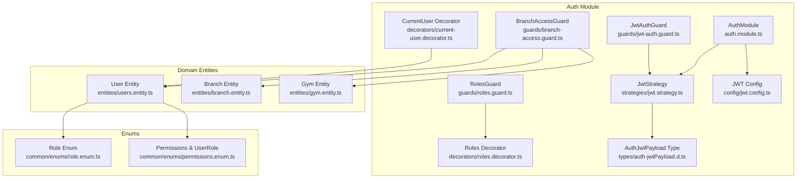
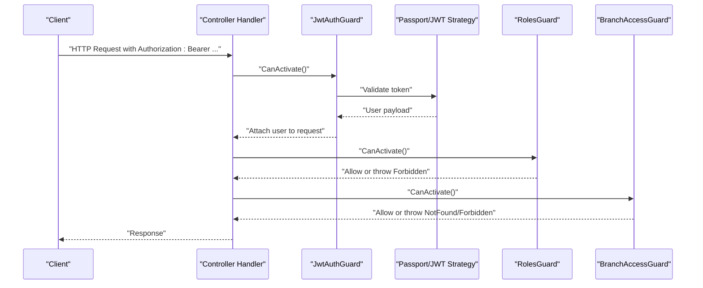
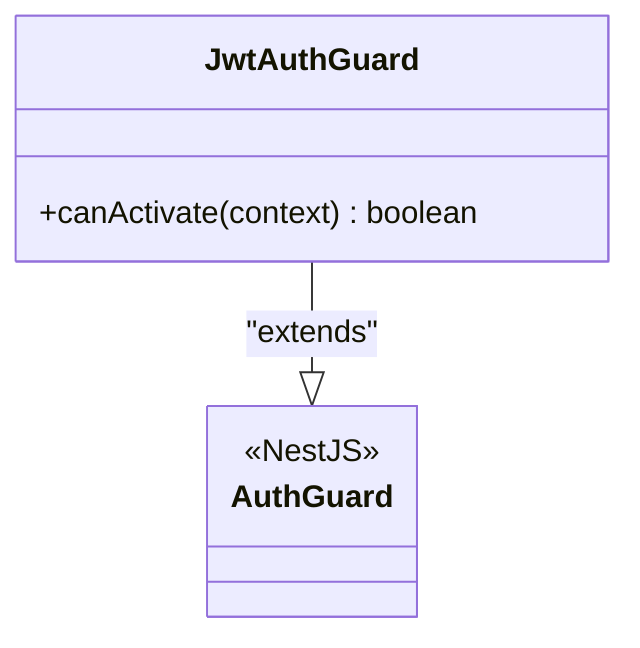
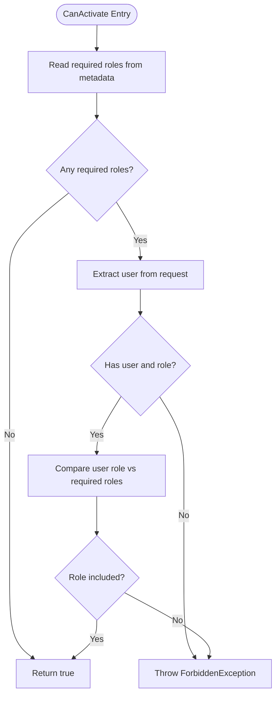
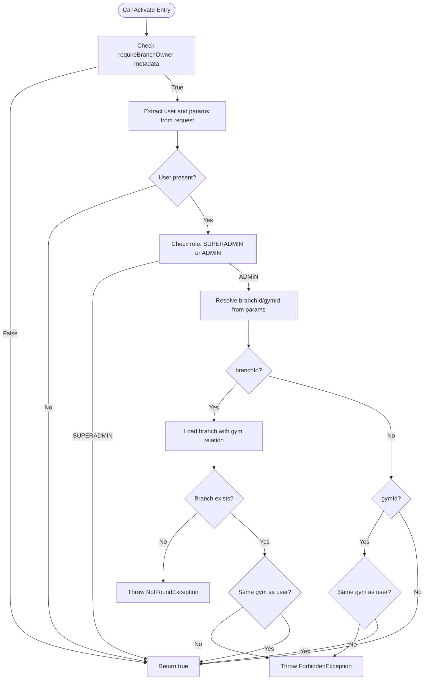
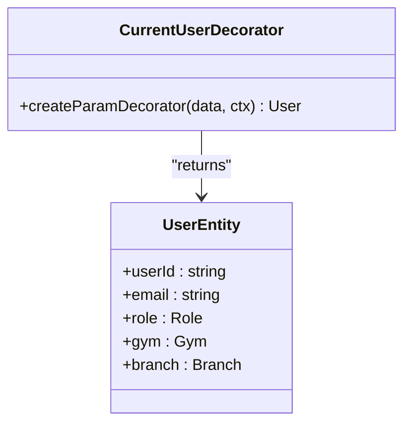
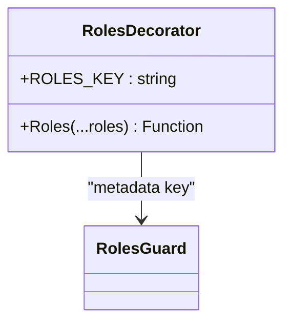
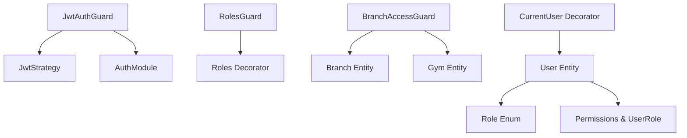

# Authentication Guards

<cite>
**Referenced Files in This Document**
- [jwt-auth.guard.ts](file://src/auth/guards/jwt-auth.guard.ts)
- [roles.guard.ts](file://src/auth/guards/roles.guard.ts)
- [branch-access.guard.ts](file://src/auth/guards/branch-access.guard.ts)
- [current-user.decorator.ts](file://src/auth/decorators/current-user.decorator.ts)
- [roles.decorator.ts](file://src/auth/decorators/roles.decorator.ts)
- [jwt.strategy.ts](file://src/auth/strategies/jwt.strategy.ts)
- [jwt.config.ts](file://src/auth/config/jwt.config.ts)
- [auth-jwtPayload.d.ts](file://src/auth/types/auth-jwtPayload.d.ts)
- [auth.module.ts](file://src/auth/auth.module.ts)
- [role.enum.ts](file://src/common/enums/role.enum.ts)
- [permissions.enum.ts](file://src/common/enums/permissions.enum.ts)
- [users.entity.ts](file://src/entities/users.entity.ts)
- [branch.entity.ts](file://src/entities/branch.entity.ts)
- [gym.entity.ts](file://src/entities/gym.entity.ts)
- [members.controller.ts](file://src/members/members.controller.ts)
- [classes.controller.ts](file://src/classes/classes.controller.ts)
- [trainers.controller.ts](file://src/trainers/trainers.controller.ts)
</cite>

## Table of Contents
1. [Introduction](#introduction)
2. [Project Structure](#project-structure)
3. [Core Components](#core-components)
4. [Architecture Overview](#architecture-overview)
5. [Detailed Component Analysis](#detailed-component-analysis)
6. [Dependency Analysis](#dependency-analysis)
7. [Performance Considerations](#performance-considerations)
8. [Troubleshooting Guide](#troubleshooting-guide)
9. [Conclusion](#conclusion)

## Introduction
This document explains the authentication and authorization guards used in the gym management system. It covers:
- JWT authentication guard for validating bearer tokens and attaching user context
- Roles guard for enforcing role-based access control
- Branch access guard for multi-tenancy and tenant isolation
- Current user decorator for convenient access to the authenticated user in controllers

It also documents guard execution order, composition patterns, error responses, and provides guidance for extending and customizing guards.

## Project Structure
The authentication subsystem is organized under the auth module with dedicated guards, strategies, decorators, and configuration. Supporting entities and enums define the multi-tenant model and roles.

**Diagram sources**
- [jwt-auth.guard.ts:1-6](file://src/auth/guards/jwt-auth.guard.ts#L1-L6)
- [roles.guard.ts:1-42](file://src/auth/guards/roles.guard.ts#L1-L42)
- [branch-access.guard.ts:1-73](file://src/auth/guards/branch-access.guard.ts#L1-L73)
- [current-user.decorator.ts:1-10](file://src/auth/decorators/current-user.decorator.ts#L1-L10)
- [roles.decorator.ts:1-8](file://src/auth/decorators/roles.decorator.ts#L1-L8)
- [jwt.strategy.ts:1-26](file://src/auth/strategies/jwt.strategy.ts#L1-L26)
- [jwt.config.ts:1-13](file://src/auth/config/jwt.config.ts#L1-L13)
- [auth-jwtPayload.d.ts:1-6](file://src/auth/types/auth-jwtPayload.d.ts#L1-L6)
- [auth.module.ts:1-25](file://src/auth/auth.module.ts#L1-L25)
- [users.entity.ts:1-52](file://src/entities/users.entity.ts#L1-L52)
- [branch.entity.ts:1-79](file://src/entities/branch.entity.ts#L1-L79)
- [gym.entity.ts:1-56](file://src/entities/gym.entity.ts#L1-L56)
- [role.enum.ts:1-7](file://src/common/enums/role.enum.ts#L1-L7)
- [permissions.enum.ts:1-84](file://src/common/enums/permissions.enum.ts#L1-L84)

**Section sources**
- [auth.module.ts:1-25](file://src/auth/auth.module.ts#L1-L25)
- [jwt.config.ts:1-13](file://src/auth/config/jwt.config.ts#L1-L13)
- [jwt.strategy.ts:1-26](file://src/auth/strategies/jwt.strategy.ts#L1-L26)

## Core Components
- JwtAuthGuard: Thin wrapper around NestJS Passport AuthGuard('jwt'), enabling JWT validation per route.
- RolesGuard: Enforces role-based access using Reflector and metadata set by the Roles decorator.
- BranchAccessGuard: Enforces multi-tenancy by checking user's gym/branch association against route parameters.
- CurrentUser decorator: Provides convenient injection of the authenticated user into controller handlers.
- Roles decorator: Sets metadata for required roles on handlers/controllers.

These components integrate with Passport JWT strategy and TypeORM repositories to enforce authorization policies consistently across the application.

**Section sources**
- [jwt-auth.guard.ts:1-6](file://src/auth/guards/jwt-auth.guard.ts#L1-L6)
- [roles.guard.ts:1-42](file://src/auth/guards/roles.guard.ts#L1-L42)
- [branch-access.guard.ts:1-73](file://src/auth/guards/branch-access.guard.ts#L1-L73)
- [current-user.decorator.ts:1-10](file://src/auth/decorators/current-user.decorator.ts#L1-L10)
- [roles.decorator.ts:1-8](file://src/auth/decorators/roles.decorator.ts#L1-L8)

## Architecture Overview
The authentication pipeline starts with the JWT strategy validating the bearer token and returning a user payload. Guards then evaluate authorization policies in a defined order.

**Diagram sources**
- [jwt-auth.guard.ts:1-6](file://src/auth/guards/jwt-auth.guard.ts#L1-L6)
- [jwt.strategy.ts:1-26](file://src/auth/strategies/jwt.strategy.ts#L1-L26)
- [roles.guard.ts:1-42](file://src/auth/guards/roles.guard.ts#L1-L42)
- [branch-access.guard.ts:1-73](file://src/auth/guards/branch-access.guard.ts#L1-L73)

## Detailed Component Analysis

### JWT Authentication Guard
- Purpose: Validates incoming requests using the configured JWT strategy and attaches user information to the request object.
- Implementation pattern: Extends AuthGuard('jwt') with no additional logic, delegating to Passport.
- Typical usage: Applied at controller or method level via @UseGuards(JwtAuthGuard).

**Diagram sources**
- [jwt-auth.guard.ts:1-6](file://src/auth/guards/jwt-auth.guard.ts#L1-L6)

**Section sources**
- [jwt-auth.guard.ts:1-6](file://src/auth/guards/jwt-auth.guard.ts#L1-L6)
- [jwt.strategy.ts:1-26](file://src/auth/strategies/jwt.strategy.ts#L1-L26)

### Roles Guard
- Purpose: Enforces role-based access control by checking required roles against the authenticated user's role.
- Behavior:
  - Reads required roles from metadata using Reflector and the Roles decorator.
  - Allows access if no roles are required.
  - Throws Forbidden if user is not authenticated or lacks required roles.
- Data model: Uses Role enum and UserRole enum for role comparison.

**Diagram sources**
- [roles.guard.ts:16-40](file://src/auth/guards/roles.guard.ts#L16-L40)
- [roles.decorator.ts:5-7](file://src/auth/decorators/roles.decorator.ts#L5-L7)
- [role.enum.ts:1-7](file://src/common/enums/role.enum.ts#L1-L7)
- [permissions.enum.ts:43-48](file://src/common/enums/permissions.enum.ts#L43-L48)

**Section sources**
- [roles.guard.ts:1-42](file://src/auth/guards/roles.guard.ts#L1-L42)
- [roles.decorator.ts:1-8](file://src/auth/decorators/roles.decorator.ts#L1-L8)
- [role.enum.ts:1-7](file://src/common/enums/role.enum.ts#L1-L7)
- [permissions.enum.ts:1-84](file://src/common/enums/permissions.enum.ts#L1-L84)

### Branch Access Guard
- Purpose: Enforces multi-tenancy by ensuring admins can only access data within their assigned gym/branch.
- Behavior:
  - Checks a metadata flag indicating whether branch ownership is required.
  - For non-superadmin admins, validates that requested branchId/gymId matches the user's gym association.
  - Throws NotFoundException for missing branches and ForbiddenException for unauthorized access.
- Data model: Uses Branch and Gym entities to resolve associations.

**Diagram sources**
- [branch-access.guard.ts:24-71](file://src/auth/guards/branch-access.guard.ts#L24-L71)
- [branch.entity.ts:18-79](file://src/entities/branch.entity.ts#L18-L79)
- [gym.entity.ts:12-56](file://src/entities/gym.entity.ts#L12-L56)

**Section sources**
- [branch-access.guard.ts:1-73](file://src/auth/guards/branch-access.guard.ts#L1-L73)
- [branch.entity.ts:1-79](file://src/entities/branch.entity.ts#L1-L79)
- [gym.entity.ts:1-56](file://src/entities/gym.entity.ts#L1-L56)

### Current User Decorator
- Purpose: Simplifies access to the authenticated user in controller methods.
- Behavior: Extracts request.user and returns the User entity for injection into handler parameters.

**Diagram sources**
- [current-user.decorator.ts:4-9](file://src/auth/decorators/current-user.decorator.ts#L4-L9)
- [users.entity.ts:14-52](file://src/entities/users.entity.ts#L14-L52)

**Section sources**
- [current-user.decorator.ts:1-10](file://src/auth/decorators/current-user.decorator.ts#L1-L10)
- [users.entity.ts:1-52](file://src/entities/users.entity.ts#L1-L52)

### Roles Decorator
- Purpose: Sets metadata for required roles so the RolesGuard can enforce access control.
- Usage: Apply @Roles(...) on controllers or methods to declare required roles.

**Diagram sources**
- [roles.decorator.ts:5-7](file://src/auth/decorators/roles.decorator.ts#L5-L7)
- [roles.guard.ts:17-19](file://src/auth/guards/roles.guard.ts#L17-L19)

**Section sources**
- [roles.decorator.ts:1-8](file://src/auth/decorators/roles.decorator.ts#L1-L8)
- [roles.guard.ts:1-42](file://src/auth/guards/roles.guard.ts#L1-L42)

## Dependency Analysis
- JwtAuthGuard depends on the Passport 'jwt' strategy registered in AuthModule.
- RolesGuard depends on Reflector and Roles decorator metadata.
- BranchAccessGuard depends on Branch and Gym repositories and user context.
- CurrentUser decorator depends on request.user populated by JwtAuthGuard.
- Enums and entities define the role and multi-tenancy model.

**Diagram sources**
- [jwt-auth.guard.ts:1-6](file://src/auth/guards/jwt-auth.guard.ts#L1-L6)
- [jwt.strategy.ts:1-26](file://src/auth/strategies/jwt.strategy.ts#L1-L26)
- [auth.module.ts:1-25](file://src/auth/auth.module.ts#L1-L25)
- [roles.guard.ts:1-42](file://src/auth/guards/roles.guard.ts#L1-L42)
- [roles.decorator.ts:1-8](file://src/auth/decorators/roles.decorator.ts#L1-L8)
- [branch-access.guard.ts:1-73](file://src/auth/guards/branch-access.guard.ts#L1-L73)
- [branch.entity.ts:1-79](file://src/entities/branch.entity.ts#L1-L79)
- [gym.entity.ts:1-56](file://src/entities/gym.entity.ts#L1-L56)
- [users.entity.ts:1-52](file://src/entities/users.entity.ts#L1-L52)
- [role.enum.ts:1-7](file://src/common/enums/role.enum.ts#L1-L7)
- [permissions.enum.ts:1-84](file://src/common/enums/permissions.enum.ts#L1-L84)

**Section sources**
- [auth.module.ts:1-25](file://src/auth/auth.module.ts#L1-L25)
- [jwt.strategy.ts:1-26](file://src/auth/strategies/jwt.strategy.ts#L1-L26)
- [users.entity.ts:1-52](file://src/entities/users.entity.ts#L1-L52)

## Performance Considerations
- Token validation cost: JWT strategy performs signature verification and expiration checks; keep token TTL reasonable.
- RolesGuard overhead: Minimal reflection and array inclusion checks; ensure minimal required roles metadata.
- BranchAccessGuard overhead: Single repository lookup per guarded route; cache branch/gym associations at the service layer when appropriate.
- Decorator usage: CurrentUser is lightweight; avoid excessive nested guards on hot paths.
- Guard ordering: Place fast guards first (e.g., JwtAuthGuard) to fail early.

[No sources needed since this section provides general guidance]

## Troubleshooting Guide
Common issues and resolutions:
- Unauthorized (401) responses:
  - Verify Authorization header format and token validity.
  - Confirm JWT secret and expiration settings align with client.
- Forbidden (403) responses:
  - Ensure the Roles decorator declares correct roles.
  - Confirm user role matches expected values (case-sensitive).
- Not Found (404) or Forbidden (403) with branch access:
  - Validate branchId/gymId parameters match user's gym association.
  - Confirm branch exists and belongs to the expected gym.
- User not attached:
  - Ensure JwtAuthGuard is applied before other guards that rely on request.user.

**Section sources**
- [roles.guard.ts:27-37](file://src/auth/guards/roles.guard.ts#L27-L37)
- [branch-access.guard.ts:36-67](file://src/auth/guards/branch-access.guard.ts#L36-L67)

## Conclusion
The authentication and authorization subsystem leverages NestJS guards and Passport JWT to provide layered protection:
- JwtAuthGuard ensures valid sessions.
- RolesGuard enforces role-based policies.
- BranchAccessGuard maintains multi-tenancy boundaries.
- CurrentUser simplifies controller access to the authenticated user.

By composing these guards strategically and leveraging metadata and decorators, the system achieves predictable, maintainable, and secure access control across endpoints.