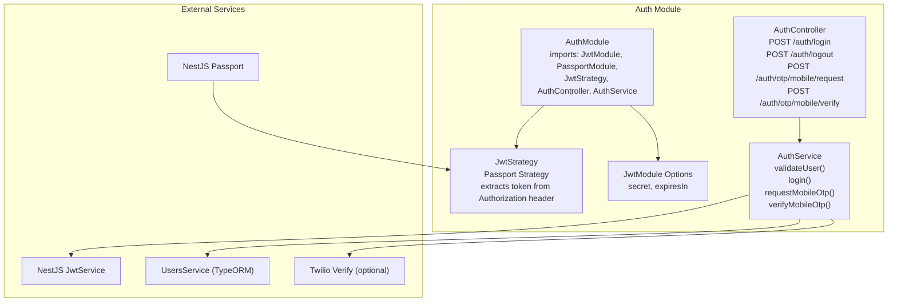
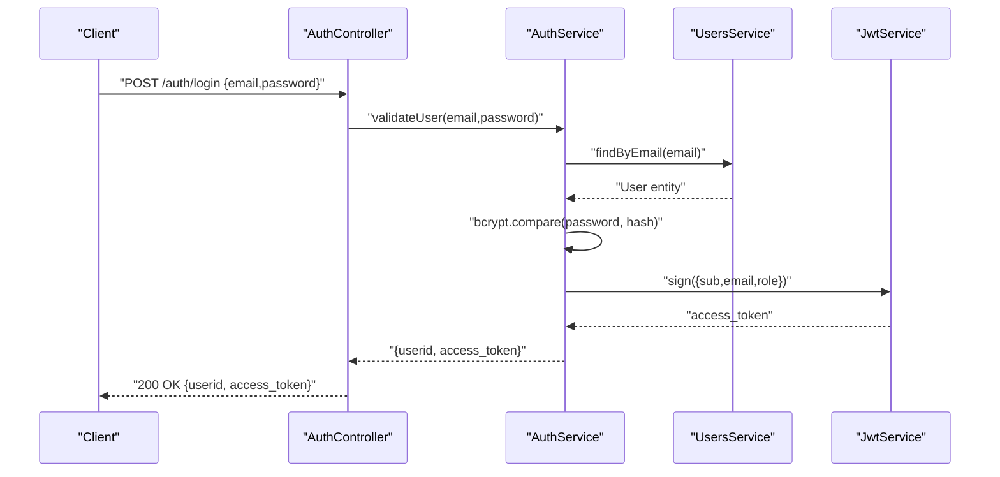
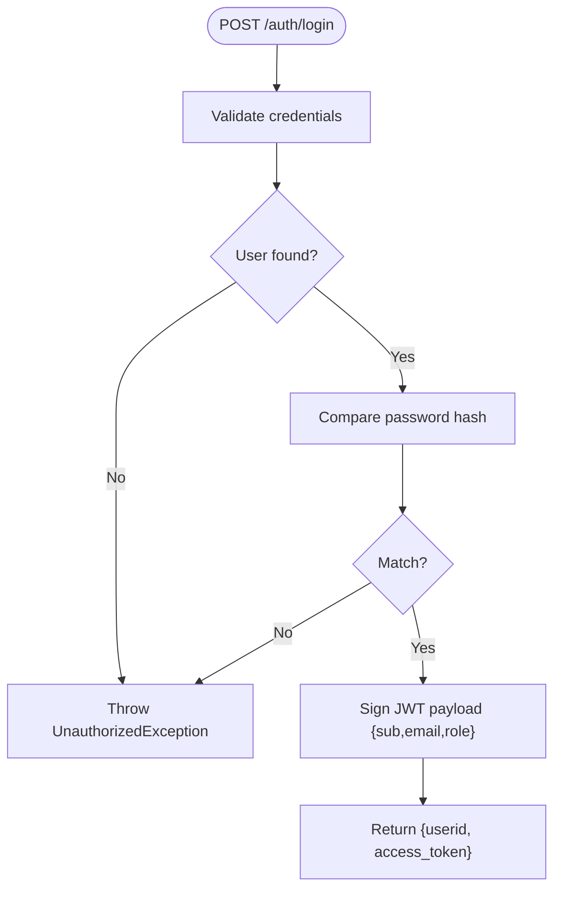
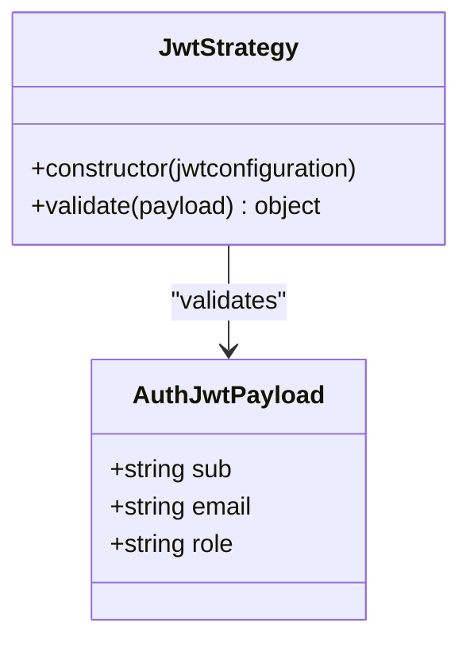
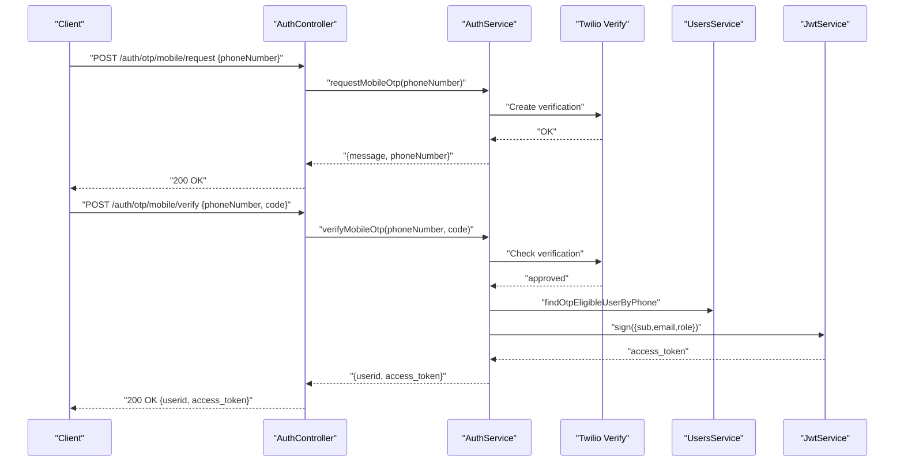
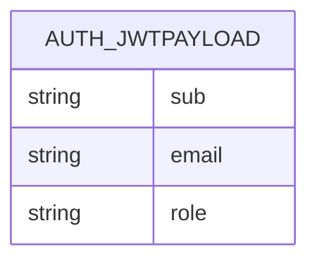
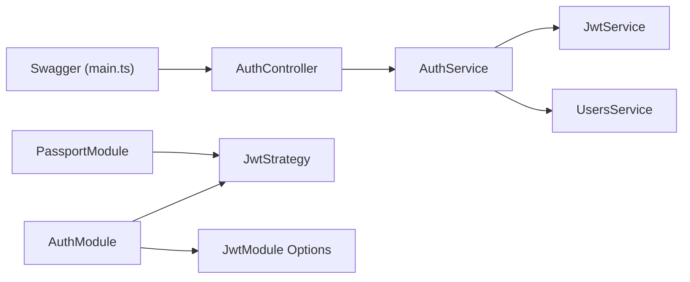

# JWT Authentication

<cite>
**Referenced Files in This Document**
- [src/auth/auth.module.ts](file://src/auth/auth.module.ts)
- [src/auth/config/jwt.config.ts](file://src/auth/config/jwt.config.ts)
- [src/auth/strategies/jwt.strategy.ts](file://src/auth/strategies/jwt.strategy.ts)
- [src/auth/auth.controller.ts](file://src/auth/auth.controller.ts)
- [src/auth/auth.service.ts](file://src/auth/auth.service.ts)
- [src/auth/guards/jwt-auth.guard.ts](file://src/auth/guards/jwt-auth.guard.ts)
- [src/auth/decorators/current-user.decorator.ts](file://src/auth/decorators/current-user.decorator.ts)
- [src/auth/dto/login-user.dto.ts](file://src/auth/dto/login-user.dto.ts)
- [src/auth/dto/login-response.dto.ts](file://src/auth/dto/login-response.dto.ts)
- [src/auth/types/auth-jwtPayload.d.ts](file://src/auth/types/auth-jwtPayload.d.ts)
- [src/users/users.service.ts](file://src/users/users.service.ts)
- [src/main.ts](file://src/main.ts)
</cite>

## Table of Contents
1. [Introduction](#introduction)
2. [Project Structure](#project-structure)
3. [Core Components](#core-components)
4. [Architecture Overview](#architecture-overview)
5. [Detailed Component Analysis](#detailed-component-analysis)
6. [Dependency Analysis](#dependency-analysis)
7. [Performance Considerations](#performance-considerations)
8. [Troubleshooting Guide](#troubleshooting-guide)
9. [Conclusion](#conclusion)
10. [Appendices](#appendices)

## Introduction
This document explains the JWT authentication implementation in the gym management system. It covers the complete flow from user login to token validation and renewal, JWT configuration, payload structure, and security considerations. It also provides practical examples for login endpoints, logout procedures, and guidance for implementing custom JWT strategies and handling token expiration scenarios.

## Project Structure
The authentication subsystem is organized around a dedicated module that integrates Passport, the NestJS JWT module, and custom strategies. Controllers expose authentication endpoints, services handle validation and token generation, and guards enforce protected routes.

**Diagram sources**
- [src/auth/auth.module.ts:11-21](file://src/auth/auth.module.ts#L11-L21)
- [src/auth/auth.controller.ts:27-88](file://src/auth/auth.controller.ts#L27-L88)
- [src/auth/auth.service.ts:31-51](file://src/auth/auth.service.ts#L31-L51)
- [src/auth/strategies/jwt.strategy.ts:10-25](file://src/auth/strategies/jwt.strategy.ts#L10-L25)
- [src/auth/config/jwt.config.ts:4-12](file://src/auth/config/jwt.config.ts#L4-L12)

**Section sources**
- [src/auth/auth.module.ts:1-25](file://src/auth/auth.module.ts#L1-L25)
- [src/auth/auth.controller.ts:22-155](file://src/auth/auth.controller.ts#L22-L155)
- [src/auth/auth.service.ts:14-164](file://src/auth/auth.service.ts#L14-L164)
- [src/auth/strategies/jwt.strategy.ts:1-26](file://src/auth/strategies/jwt.strategy.ts#L1-L26)
- [src/auth/config/jwt.config.ts:1-13](file://src/auth/config/jwt.config.ts#L1-L13)

## Core Components
- AuthModule: Registers the JWT module asynchronously via configuration, imports Passport, and exposes the authentication controller and service.
- JwtStrategy: A Passport strategy that extracts the JWT from the Authorization header and validates it using the configured secret.
- JwtAuthGuard: A reusable guard that enforces JWT-based authentication for protected routes.
- AuthService: Implements user validation, JWT payload creation, token signing, and optional mobile OTP flows.
- AuthController: Exposes login, logout, and OTP endpoints with Swagger metadata and DTO-driven request/response contracts.
- DTOs and Payload Types: Define request/response shapes and the JWT payload structure used by the strategy.

**Section sources**
- [src/auth/auth.module.ts:11-21](file://src/auth/auth.module.ts#L11-L21)
- [src/auth/strategies/jwt.strategy.ts:10-25](file://src/auth/strategies/jwt.strategy.ts#L10-L25)
- [src/auth/guards/jwt-auth.guard.ts:1-6](file://src/auth/guards/jwt-auth.guard.ts#L1-L6)
- [src/auth/auth.service.ts:31-51](file://src/auth/auth.service.ts#L31-L51)
- [src/auth/auth.controller.ts:27-88](file://src/auth/auth.controller.ts#L27-L88)
- [src/auth/dto/login-user.dto.ts:1-18](file://src/auth/dto/login-user.dto.ts#L1-L18)
- [src/auth/dto/login-response.dto.ts:1-16](file://src/auth/dto/login-response.dto.ts#L1-L16)
- [src/auth/types/auth-jwtPayload.d.ts:1-6](file://src/auth/types/auth-jwtPayload.d.ts#L1-L6)

## Architecture Overview
The authentication architecture combines Passport strategies with NestJS’s JWT module. Requests are validated against the JwtAuthGuard, which delegates to JwtStrategy. On successful validation, the request gains access to the authenticated user object. Tokens are generated by AuthService using JwtService and returned to clients upon login.

**Diagram sources**
- [src/auth/auth.controller.ts:75-88](file://src/auth/auth.controller.ts#L75-L88)
- [src/auth/auth.service.ts:31-51](file://src/auth/auth.service.ts#L31-L51)
- [src/users/users.service.ts:94-96](file://src/users/users.service.ts#L94-L96)

## Detailed Component Analysis

### JWT Configuration
- Secret key: Loaded from environment variable and registered with the JWT module.
- Expiration: Controlled via signOptions.expiresIn from environment variable.
- Signing algorithm: Uses the default HS256 algorithm with a shared secret.

Environment variables:
- JWT_SECRET: Secret key for signing tokens.
- JWT_EXPIRES_IN: Token lifetime (e.g., "1h", "7d").

**Section sources**
- [src/auth/config/jwt.config.ts:4-12](file://src/auth/config/jwt.config.ts#L4-L12)
- [src/auth/auth.module.ts:15](file://src/auth/auth.module.ts#L15)

### Login Flow (Email/Password)
- Endpoint: POST /auth/login
- Request DTO: LoginUserDto (email, password)
- Response DTO: LoginResponseDto (userid, access_token)
- Steps:
  1. Controller calls AuthService.validateUser(email, password).
  2. AuthService finds the user by email and verifies the password hash.
  3. AuthService creates a payload with sub (userId), email, and role.
  4. JwtService signs the payload and returns the access_token.
  5. Controller returns LoginResponseDto.

**Diagram sources**
- [src/auth/auth.controller.ts:75-88](file://src/auth/auth.controller.ts#L75-L88)
- [src/auth/auth.service.ts:31-51](file://src/auth/auth.service.ts#L31-L51)
- [src/auth/dto/login-user.dto.ts:4-17](file://src/auth/dto/login-user.dto.ts#L4-L17)
- [src/auth/dto/login-response.dto.ts:3-15](file://src/auth/dto/login-response.dto.ts#L3-L15)

**Section sources**
- [src/auth/auth.controller.ts:27-88](file://src/auth/auth.controller.ts#L27-L88)
- [src/auth/auth.service.ts:31-51](file://src/auth/auth.service.ts#L31-L51)
- [src/auth/dto/login-user.dto.ts:1-18](file://src/auth/dto/login-user.dto.ts#L1-L18)
- [src/auth/dto/login-response.dto.ts:1-16](file://src/auth/dto/login-response.dto.ts#L1-L16)

### JWT Strategy Implementation
- Extraction: fromAuthHeaderAsBearerToken() reads Authorization: Bearer <token>.
- Validation: Validates signature and checks expiration (ignoreExpiration: false).
- Payload mapping: Returns {userId, email, role} to populate request.user.

**Diagram sources**
- [src/auth/strategies/jwt.strategy.ts:10-25](file://src/auth/strategies/jwt.strategy.ts#L10-L25)
- [src/auth/types/auth-jwtPayload.d.ts:1-6](file://src/auth/types/auth-jwtPayload.d.ts#L1-L6)

**Section sources**
- [src/auth/strategies/jwt.strategy.ts:10-25](file://src/auth/strategies/jwt.strategy.ts#L10-L25)
- [src/auth/types/auth-jwtPayload.d.ts:1-6](file://src/auth/types/auth-jwtPayload.d.ts#L1-L6)

### Protected Routes and Guards
- JwtAuthGuard: Extends AuthGuard('jwt'), enabling route protection.
- CurrentUser decorator: Provides access to the authenticated user object attached to the request by the strategy.

Usage examples:
- Apply @UseGuards(JwtAuthGuard) to protect endpoints.
- Inject @CurrentUser() user: User in controller methods to access the authenticated user.

**Section sources**
- [src/auth/guards/jwt-auth.guard.ts:1-6](file://src/auth/guards/jwt-auth.guard.ts#L1-L6)
- [src/auth/decorators/current-user.decorator.ts:1-10](file://src/auth/decorators/current-user.decorator.ts#L1-L10)

### Logout Procedure
- Endpoint: POST /auth/logout
- Behavior: No server-side token invalidation is performed. The recommended pattern is client-side token discard. The endpoint acknowledges logout and instructs the client to discard the token.

**Section sources**
- [src/auth/auth.controller.ts:129-153](file://src/auth/auth.controller.ts#L129-L153)

### Mobile OTP Flow (Alternative Authentication)
- Request OTP: POST /auth/otp/mobile/request with phoneNumber.
- Verify OTP: POST /auth/otp/mobile/verify with phoneNumber and code.
- On success, returns LoginResponseDto with a JWT token.

**Diagram sources**
- [src/auth/auth.controller.ts:90-127](file://src/auth/auth.controller.ts#L90-L127)
- [src/auth/auth.service.ts:53-118](file://src/auth/auth.service.ts#L53-L118)
- [src/users/users.service.ts:105-125](file://src/users/users.service.ts#L105-L125)

**Section sources**
- [src/auth/auth.controller.ts:90-127](file://src/auth/auth.controller.ts#L90-L127)
- [src/auth/auth.service.ts:53-118](file://src/auth/auth.service.ts#L53-L118)
- [src/users/users.service.ts:105-125](file://src/users/users.service.ts#L105-L125)

### JWT Payload Structure and Claims
- sub: Unique user identifier (userId).
- email: User’s email address.
- role: User’s role name.
- iat: Issued-at timestamp.
- exp: Expiration timestamp (configured via JWT_EXPIRES_IN).

**Diagram sources**
- [src/auth/types/auth-jwtPayload.d.ts:1-6](file://src/auth/types/auth-jwtPayload.d.ts#L1-L6)

**Section sources**
- [src/auth/types/auth-jwtPayload.d.ts:1-6](file://src/auth/types/auth-jwtPayload.d.ts#L1-L6)
- [src/auth/config/jwt.config.ts:7-10](file://src/auth/config/jwt.config.ts#L7-L10)

### Security Considerations
- Secret management: Store JWT_SECRET in environment variables and rotate periodically.
- Token expiration: Configure JWT_EXPIRES_IN to a short duration for reduced risk.
- Transport security: Use HTTPS to prevent token interception.
- Client-side storage: Avoid storing tokens in insecure locations; prefer secure, httpOnly cookies or secure storage mechanisms when applicable.
- Logout behavior: Since tokens are stateless, rely on client-side token discard; consider blacklisting for stricter control.
- OTP flow: Ensure Twilio credentials and Verify Service SID are properly configured and secured.

**Section sources**
- [src/auth/config/jwt.config.ts:7-10](file://src/auth/config/jwt.config.ts#L7-L10)
- [src/auth/auth.controller.ts:149-153](file://src/auth/auth.controller.ts#L149-L153)
- [src/auth/auth.service.ts:120-140](file://src/auth/auth.service.ts#L120-L140)

### Practical Examples
- Login endpoint:
  - Method: POST
  - Path: /auth/login
  - Headers: Content-Type: application/json
  - Body: LoginUserDto (email, password)
  - Response: LoginResponseDto (userid, access_token)
- Logout endpoint:
  - Method: POST
  - Path: /auth/logout
  - Behavior: Returns acknowledgment; client should discard token
- Using JWT in protected endpoints:
  - Add @UseGuards(JwtAuthGuard) to routes
  - Access user via @CurrentUser() decorator

**Section sources**
- [src/auth/auth.controller.ts:27-88](file://src/auth/auth.controller.ts#L27-L88)
- [src/auth/auth.controller.ts:129-153](file://src/auth/auth.controller.ts#L129-L153)
- [src/auth/guards/jwt-auth.guard.ts:1-6](file://src/auth/guards/jwt-auth.guard.ts#L1-L6)
- [src/auth/decorators/current-user.decorator.ts:1-10](file://src/auth/decorators/current-user.decorator.ts#L1-L10)

### Implementing Custom JWT Strategies
- Extend PassportStrategy(Strategy) with ExtractJwt.fromAuthHeaderAsBearerToken().
- Configure secretOrKey from environment variables or injected configuration.
- Implement validate(payload) to return a user object for request.user.

**Section sources**
- [src/auth/strategies/jwt.strategy.ts:10-25](file://src/auth/strategies/jwt.strategy.ts#L10-L25)
- [src/auth/config/jwt.config.ts:4-12](file://src/auth/config/jwt.config.ts#L4-L12)

### Handling Token Expiration Scenarios
- Symptom: 401 Unauthorized on protected routes.
- Resolution: Require the client to re-authenticate and obtain a new token. There is no server-side refresh endpoint in the current implementation.

**Section sources**
- [src/auth/strategies/jwt.strategy.ts:17](file://src/auth/strategies/jwt.strategy.ts#L17)

## Dependency Analysis

**Diagram sources**
- [src/auth/auth.controller.ts:25](file://src/auth/auth.controller.ts#L25)
- [src/auth/auth.service.ts:18-29](file://src/auth/auth.service.ts#L18-L29)
- [src/auth/auth.module.ts:14-16](file://src/auth/auth.module.ts#L14-L16)
- [src/auth/strategies/jwt.strategy.ts:10-20](file://src/auth/strategies/jwt.strategy.ts#L10-L20)
- [src/auth/config/jwt.config.ts:4-12](file://src/auth/config/jwt.config.ts#L4-L12)
- [src/main.ts:28-65](file://src/main.ts#L28-L65)

**Section sources**
- [src/auth/auth.controller.ts:25](file://src/auth/auth.controller.ts#L25)
- [src/auth/auth.service.ts:18-29](file://src/auth/auth.service.ts#L18-L29)
- [src/auth/auth.module.ts:14-16](file://src/auth/auth.module.ts#L14-L16)
- [src/auth/strategies/jwt.strategy.ts:10-20](file://src/auth/strategies/jwt.strategy.ts#L10-L20)
- [src/auth/config/jwt.config.ts:4-12](file://src/auth/config/jwt.config.ts#L4-L12)
- [src/main.ts:28-65](file://src/main.ts#L28-L65)

## Performance Considerations
- Keep JWT_EXPIRES_IN short to minimize exposure windows.
- Avoid heavy computations in validate(); keep user lookup efficient.
- Use database indexing on email and userId for fast user retrieval.
- Consider rate limiting for login endpoints to mitigate brute-force attacks.

## Troubleshooting Guide
Common issues and resolutions:
- 401 Unauthorized on login:
  - Verify credentials and ensure the user has a password hash.
  - Confirm JWT_SECRET is set and correct.
- 401 Unauthorized on protected routes:
  - Ensure the Authorization header includes a valid Bearer token.
  - Check that JWT_EXPIRES_IN is not misconfigured causing premature expiration.
- OTP failures:
  - Verify Twilio credentials and Verify Service SID are set.
  - Confirm the phone number is eligible and normalized.

**Section sources**
- [src/auth/auth.service.ts:31-42](file://src/auth/auth.service.ts#L31-L42)
- [src/auth/strategies/jwt.strategy.ts:17](file://src/auth/strategies/jwt.strategy.ts#L17)
- [src/auth/auth.service.ts:120-140](file://src/auth/auth.service.ts#L120-L140)

## Conclusion
The gym management system implements a robust, standards-compliant JWT authentication flow using NestJS and Passport. It supports traditional email/password login and an optional mobile OTP flow, with clear separation of concerns across controllers, services, strategies, and guards. By following the security recommendations and leveraging the provided guards and decorators, developers can consistently protect endpoints and manage authentication state.

## Appendices

### Environment Variables Reference
- JWT_SECRET: Secret key for signing JWTs.
- JWT_EXPIRES_IN: Token lifetime (e.g., "1h", "7d").
- TWILIO_ACCOUNT_SID: Twilio account identifier (required for OTP).
- TWILIO_AUTH_TOKEN: Twilio authentication token (required for OTP).
- TWILIO_VERIFY_SERVICE_SID: Twilio Verify Service SID (required for OTP).

**Section sources**
- [src/auth/config/jwt.config.ts:7-10](file://src/auth/config/jwt.config.ts#L7-L10)
- [src/auth/auth.service.ts:22-28](file://src/auth/auth.service.ts#L22-L28)
- [src/auth/auth.service.ts:130-139](file://src/auth/auth.service.ts#L130-L139)