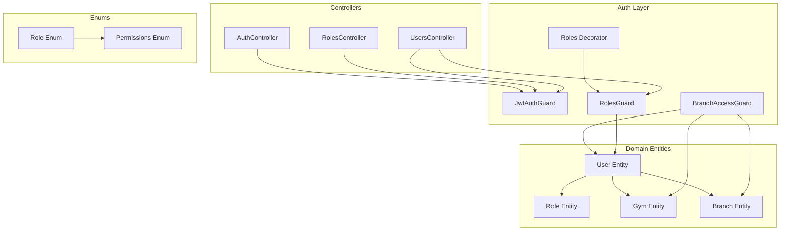
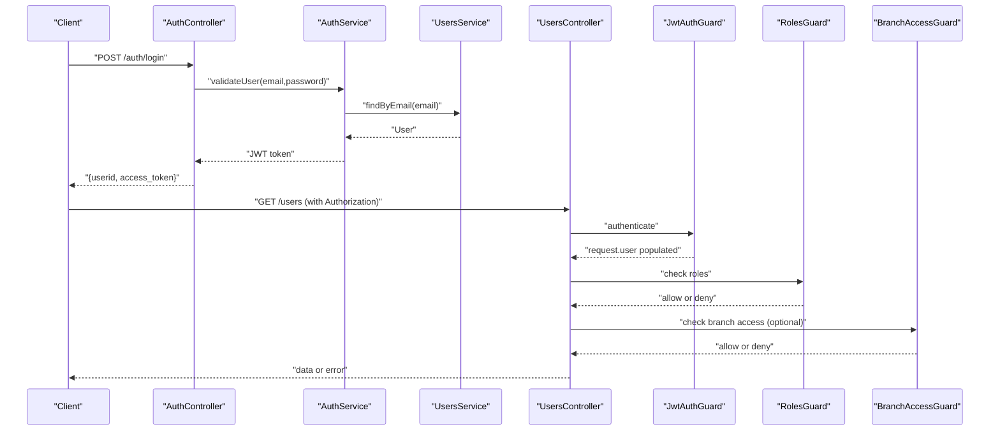
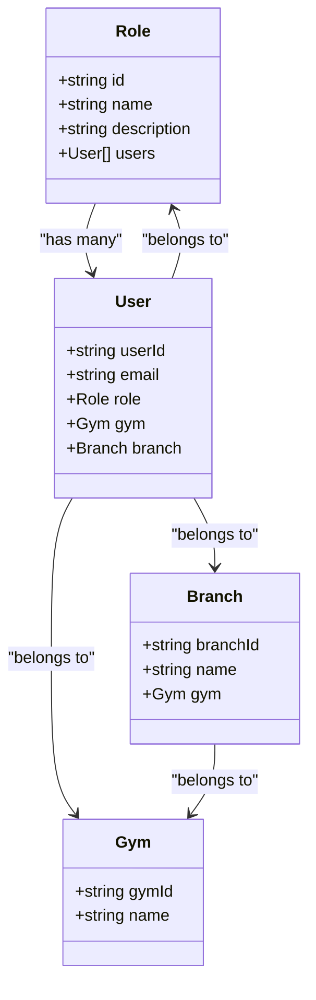
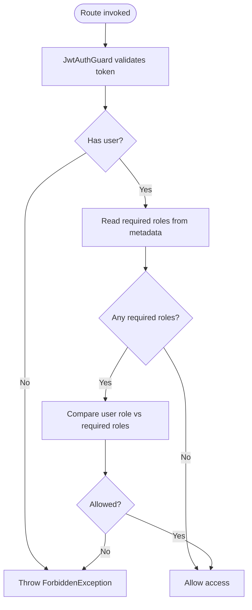
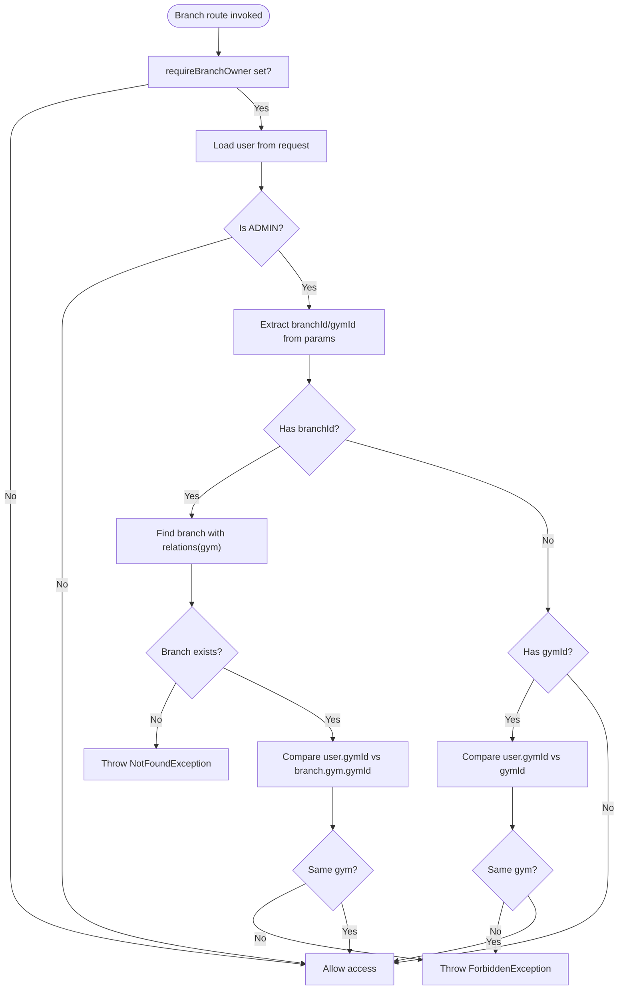
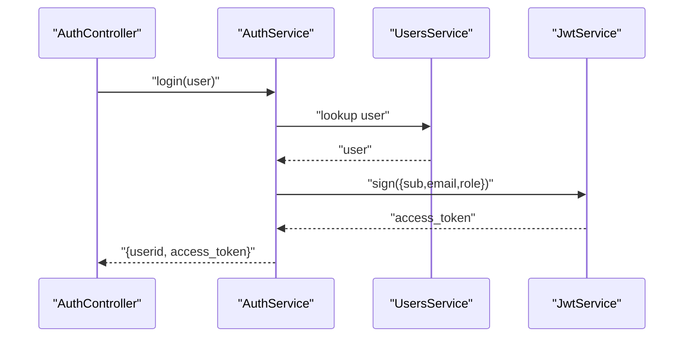
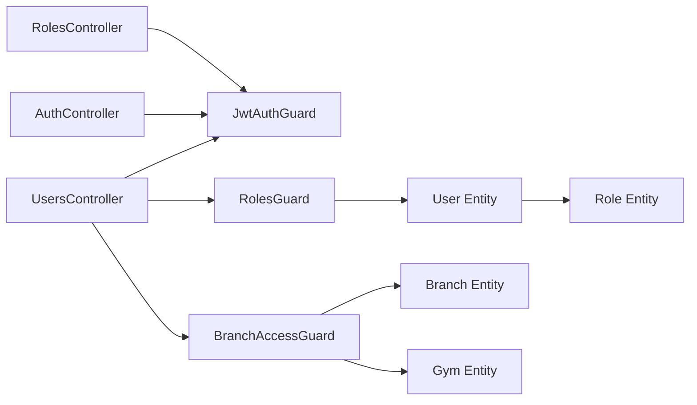

# Role-Based Access Control (RBAC)

<cite>
**Referenced Files in This Document**
- [role.enum.ts](file://src/common/enums/role.enum.ts)
- [permissions.enum.ts](file://src/common/enums/permissions.enum.ts)
- [roles.decorator.ts](file://src/auth/decorators/roles.decorator.ts)
- [roles.guard.ts](file://src/auth/guards/roles.guard.ts)
- [branch-access.guard.ts](file://src/auth/guards/branch-access.guard.ts)
- [jwt-auth.guard.ts](file://src/auth/guards/jwt-auth.guard.ts)
- [auth-jwtPayload.d.ts](file://src/auth/types/auth-jwtPayload.d.ts)
- [users.entity.ts](file://src/entities/users.entity.ts)
- [roles.entity.ts](file://src/entities/roles.entity.ts)
- [users.controller.ts](file://src/users/users.controller.ts)
- [users.service.ts](file://src/users/users.service.ts)
- [roles.controller.ts](file://src/roles/roles.controller.ts)
- [roles.service.ts](file://src/roles/roles.service.ts)
- [auth.controller.ts](file://src/auth/auth.controller.ts)
- [auth.service.ts](file://src/auth/auth.service.ts)
</cite>

## Table of Contents
1. [Introduction](#introduction)
2. [Project Structure](#project-structure)
3. [Core Components](#core-components)
4. [Architecture Overview](#architecture-overview)
5. [Detailed Component Analysis](#detailed-component-analysis)
6. [Dependency Analysis](#dependency-analysis)
7. [Performance Considerations](#performance-considerations)
8. [Troubleshooting Guide](#troubleshooting-guide)
9. [Conclusion](#conclusion)

## Introduction
This document explains the Role-Based Access Control (RBAC) implementation in the gym management system. It covers the role hierarchy (superadmin, admin, trainer, member), permission definitions and inheritance, route protection via guards and decorators, branch-level access control, and multi-tenancy considerations for gym chains. Practical examples demonstrate how to protect routes, check permissions dynamically, and implement custom guards and decorators.

## Project Structure
RBAC spans several modules:
- Enumerations define roles and permissions centrally.
- Guards enforce authentication, role-based access, and branch-level access.
- Decorators annotate controllers/methods with required roles.
- Entities model users, roles, and organizational relationships (gym/branch).
- Services integrate guards with controllers and handle user/role operations.

**Diagram sources**
- [jwt-auth.guard.ts:1-6](file://src/auth/guards/jwt-auth.guard.ts#L1-L6)
- [roles.decorator.ts:1-8](file://src/auth/decorators/roles.decorator.ts#L1-L8)
- [roles.guard.ts:1-42](file://src/auth/guards/roles.guard.ts#L1-L42)
- [branch-access.guard.ts:1-73](file://src/auth/guards/branch-access.guard.ts#L1-L73)
- [users.entity.ts:1-52](file://src/entities/users.entity.ts#L1-L52)
- [roles.entity.ts:1-18](file://src/entities/roles.entity.ts#L1-L18)
- [users.controller.ts:1-344](file://src/users/users.controller.ts#L1-L344)
- [roles.controller.ts:1-229](file://src/roles/roles.controller.ts#L1-L229)
- [auth.controller.ts:1-155](file://src/auth/auth.controller.ts#L1-L155)
- [role.enum.ts:1-7](file://src/common/enums/role.enum.ts#L1-L7)
- [permissions.enum.ts:1-84](file://src/common/enums/permissions.enum.ts#L1-L84)

**Section sources**
- [role.enum.ts:1-7](file://src/common/enums/role.enum.ts#L1-L7)
- [permissions.enum.ts:1-84](file://src/common/enums/permissions.enum.ts#L1-L84)
- [roles.decorator.ts:1-8](file://src/auth/decorators/roles.decorator.ts#L1-L8)
- [roles.guard.ts:1-42](file://src/auth/guards/roles.guard.ts#L1-L42)
- [branch-access.guard.ts:1-73](file://src/auth/guards/branch-access.guard.ts#L1-L73)
- [jwt-auth.guard.ts:1-6](file://src/auth/guards/jwt-auth.guard.ts#L1-L6)
- [users.entity.ts:1-52](file://src/entities/users.entity.ts#L1-L52)
- [roles.entity.ts:1-18](file://src/entities/roles.entity.ts#L1-L18)
- [users.controller.ts:1-344](file://src/users/users.controller.ts#L1-L344)
- [roles.controller.ts:1-229](file://src/roles/roles.controller.ts#L1-L229)
- [auth.controller.ts:1-155](file://src/auth/auth.controller.ts#L1-L155)

## Core Components
- Roles and permissions:
  - Roles: SUPERADMIN, ADMIN, TRAINER, MEMBER.
  - Permissions: granular capabilities grouped by domain (gym, branch, member, trainer, chart/workout, diet, goal) plus administrative umbrella permissions.
  - Role-to-permissions mapping defines inheritance and capability sets per role.
- Decorators and guards:
  - Roles decorator annotates protected endpoints with required roles.
  - RolesGuard enforces role checks against the authenticated user’s role.
  - JwtAuthGuard ensures requests are authenticated.
  - BranchAccessGuard enforces branch/gym-level access for admins and superadmins.
- Entities and relationships:
  - User entity links to Role, Gym, and Branch.
  - Role entity stores role metadata and user associations.

**Section sources**
- [role.enum.ts:1-7](file://src/common/enums/role.enum.ts#L1-L7)
- [permissions.enum.ts:1-84](file://src/common/enums/permissions.enum.ts#L1-L84)
- [roles.decorator.ts:1-8](file://src/auth/decorators/roles.decorator.ts#L1-L8)
- [roles.guard.ts:1-42](file://src/auth/guards/roles.guard.ts#L1-L42)
- [branch-access.guard.ts:1-73](file://src/auth/guards/branch-access.guard.ts#L1-L73)
- [jwt-auth.guard.ts:1-6](file://src/auth/guards/jwt-auth.guard.ts#L1-L6)
- [users.entity.ts:1-52](file://src/entities/users.entity.ts#L1-L52)
- [roles.entity.ts:1-18](file://src/entities/roles.entity.ts#L1-L18)

## Architecture Overview
The RBAC pipeline combines authentication, role enforcement, and branch-level access checks:

**Diagram sources**
- [auth.controller.ts:1-155](file://src/auth/auth.controller.ts#L1-L155)
- [auth.service.ts:1-164](file://src/auth/auth.service.ts#L1-L164)
- [users.controller.ts:1-344](file://src/users/users.controller.ts#L1-L344)
- [jwt-auth.guard.ts:1-6](file://src/auth/guards/jwt-auth.guard.ts#L1-L6)
- [roles.guard.ts:1-42](file://src/auth/guards/roles.guard.ts#L1-L42)
- [branch-access.guard.ts:1-73](file://src/auth/guards/branch-access.guard.ts#L1-L73)

## Detailed Component Analysis

### Role Hierarchy and Permission Model
- Roles:
  - SUPERADMIN: highest privilege, inherits all permissions.
  - ADMIN: gym-level operator with manage/read permissions across branches, members, trainers, and creation/view rights for charts/diets/goals; also carries admin:all umbrella.
  - TRAINER: can create charts/diets/goals, view/assign to assigned members, and read members.
  - MEMBER: minimal self-access; most member-specific controls enforced at service level.
- Permissions:
  - Gym: create, read, update, delete.
  - Branch: manage, read.
  - Member: manage, read.
  - Trainer: manage, read.
  - Chart/Workout: create, view_all, view_assigned, assign_any, assign_assigned.
  - Diet: create, view_all, assign_any, assign_assigned.
  - Goal: create, view_all, assign_assigned.
  - Admin/Superadmin: admin:all, superadmin:all.

**Diagram sources**
- [roles.entity.ts:1-18](file://src/entities/roles.entity.ts#L1-L18)
- [users.entity.ts:1-52](file://src/entities/users.entity.ts#L1-L52)

**Section sources**
- [permissions.enum.ts:1-84](file://src/common/enums/permissions.enum.ts#L1-L84)
- [role.enum.ts:1-7](file://src/common/enums/role.enum.ts#L1-L7)
- [roles.entity.ts:1-18](file://src/entities/roles.entity.ts#L1-L18)
- [users.entity.ts:1-52](file://src/entities/users.entity.ts#L1-L52)

### Role Decorators and Guards
- Roles decorator:
  - Stores required roles on the route handler metadata for reflection.
- RolesGuard:
  - Reads required roles from metadata.
  - Ensures the authenticated user’s role matches one of the required roles.
  - Throws forbidden errors when unauthenticated or unauthorized.
- JwtAuthGuard:
  - Standard NestJS JWT guard ensuring bearer token presence and validity.

**Diagram sources**
- [roles.decorator.ts:1-8](file://src/auth/decorators/roles.decorator.ts#L1-L8)
- [roles.guard.ts:1-42](file://src/auth/guards/roles.guard.ts#L1-L42)
- [jwt-auth.guard.ts:1-6](file://src/auth/guards/jwt-auth.guard.ts#L1-L6)

**Section sources**
- [roles.decorator.ts:1-8](file://src/auth/decorators/roles.decorator.ts#L1-L8)
- [roles.guard.ts:1-42](file://src/auth/guards/roles.guard.ts#L1-L42)
- [jwt-auth.guard.ts:1-6](file://src/auth/guards/jwt-auth.guard.ts#L1-L6)

### Branch-Level Access Control and Multi-Tenancy
- BranchAccessGuard:
  - Supports requireBranchOwner flag via metadata.
  - Superadmin bypasses branch checks.
  - Admins are restricted to their own gym/branch based on gymId linkage.
  - Validates branch ownership by resolving branch and gym relationships and comparing user.gymId.
  - Throws not found or forbidden errors when access is denied.

**Diagram sources**
- [branch-access.guard.ts:1-73](file://src/auth/guards/branch-access.guard.ts#L1-L73)

**Section sources**
- [branch-access.guard.ts:1-73](file://src/auth/guards/branch-access.guard.ts#L1-L73)

### Route Protection Examples
- Protecting a user creation endpoint:
  - Apply JwtAuthGuard and RolesGuard globally or per-route.
  - Annotate with Roles(SUPERADMIN, ADMIN) to restrict creation to authorized roles.
  - Example path: [users.controller.ts:33-78](file://src/users/users.controller.ts#L33-L78)
- Self-service password change:
  - JwtAuthGuard only; no role decorator because it targets the current user.
  - Example path: [users.controller.ts:113-160](file://src/users/users.controller.ts#L113-L160)
- Role administration:
  - RolesController endpoints are protected by JwtAuthGuard; role-specific restrictions can be added via RolesGuard if desired.
  - Example path: [roles.controller.ts:18-41](file://src/roles/roles.controller.ts#L18-L41)

**Section sources**
- [users.controller.ts:33-78](file://src/users/users.controller.ts#L33-L78)
- [users.controller.ts:113-160](file://src/users/users.controller.ts#L113-L160)
- [roles.controller.ts:18-41](file://src/roles/roles.controller.ts#L18-L41)

### JWT Payload and User Identity
- Auth service constructs JWT payload containing sub, email, and role.
- Auth controller login returns userid and access_token.
- Users controller reads req.user to support self-service operations.

**Diagram sources**
- [auth.controller.ts:75-88](file://src/auth/auth.controller.ts#L75-L88)
- [auth.service.ts:44-51](file://src/auth/auth.service.ts#L44-L51)
- [auth-jwtPayload.d.ts:1-6](file://src/auth/types/auth-jwtPayload.d.ts#L1-L6)

**Section sources**
- [auth.service.ts:44-51](file://src/auth/auth.service.ts#L44-L51)
- [auth.controller.ts:75-88](file://src/auth/auth.controller.ts#L75-L88)
- [auth-jwtPayload.d.ts:1-6](file://src/auth/types/auth-jwtPayload.d.ts#L1-L6)

### Dynamic Access Control and Service-Level Checks
- Trainer assignment and member access:
  - Trainers can view/assign only assigned charts/diets/goals and read assigned members.
  - Service-level logic should enforce “assigned” boundaries for TRAINER role.
- Member self-access:
  - MEMBER role has limited permissions; service-level logic handles member-only resources.

**Section sources**
- [permissions.enum.ts:72-83](file://src/common/enums/permissions.enum.ts#L72-L83)

### Implementing Custom Role Guards and Permission Decorators
- Custom role guard:
  - Extend RolesGuard pattern to check additional context (e.g., gymId, branchId).
  - Use ReflectMetadata to pass flags like requireBranchOwner.
  - Reference: [roles.guard.ts:1-42](file://src/auth/guards/roles.guard.ts#L1-L42), [branch-access.guard.ts:1-73](file://src/auth/guards/branch-access.guard.ts#L1-L73)
- Permission decorator:
  - Define a decorator similar to Roles decorator to annotate handlers with permission strings.
  - Implement a PermissionGuard that reads permissions from metadata and checks against user permissions.
  - Reference: [roles.decorator.ts:1-8](file://src/auth/decorators/roles.decorator.ts#L1-L8)

**Section sources**
- [roles.guard.ts:1-42](file://src/auth/guards/roles.guard.ts#L1-L42)
- [branch-access.guard.ts:1-73](file://src/auth/guards/branch-access.guard.ts#L1-L73)
- [roles.decorator.ts:1-8](file://src/auth/decorators/roles.decorator.ts#L1-L8)

## Dependency Analysis
- Controllers depend on guards and services:
  - UsersController applies JwtAuthGuard and RolesGuard; optionally BranchAccessGuard for branch-scoped endpoints.
  - RolesController applies JwtAuthGuard; can add RolesGuard for administrative endpoints.
  - AuthController applies JwtAuthGuard for protected endpoints; login does not require RolesGuard.
- Guards depend on:
  - RolesGuard depends on Reflector and user role metadata.
  - BranchAccessGuard depends on TypeORM repositories for Branch and Gym entities.
- Entities form the backbone of multi-tenancy:
  - User links to Role, Gym, and Branch; branch-level access relies on these relationships.

**Diagram sources**
- [users.controller.ts:1-344](file://src/users/users.controller.ts#L1-L344)
- [roles.controller.ts:1-229](file://src/roles/roles.controller.ts#L1-L229)
- [auth.controller.ts:1-155](file://src/auth/auth.controller.ts#L1-L155)
- [roles.guard.ts:1-42](file://src/auth/guards/roles.guard.ts#L1-L42)
- [branch-access.guard.ts:1-73](file://src/auth/guards/branch-access.guard.ts#L1-L73)
- [users.entity.ts:1-52](file://src/entities/users.entity.ts#L1-L52)
- [roles.entity.ts:1-18](file://src/entities/roles.entity.ts#L1-L18)

**Section sources**
- [users.controller.ts:1-344](file://src/users/users.controller.ts#L1-L344)
- [roles.controller.ts:1-229](file://src/roles/roles.controller.ts#L1-L229)
- [auth.controller.ts:1-155](file://src/auth/auth.controller.ts#L1-L155)
- [roles.guard.ts:1-42](file://src/auth/guards/roles.guard.ts#L1-L42)
- [branch-access.guard.ts:1-73](file://src/auth/guards/branch-access.guard.ts#L1-L73)
- [users.entity.ts:1-52](file://src/entities/users.entity.ts#L1-L52)
- [roles.entity.ts:1-18](file://src/entities/roles.entity.ts#L1-L18)

## Performance Considerations
- Guard overhead:
  - RolesGuard and BranchAccessGuard perform lightweight checks; keep metadata minimal and avoid heavy computations inside guards.
- Database queries:
  - BranchAccessGuard performs branch/gym lookups; cache gymId in user claims if appropriate to reduce DB hits.
- Token size:
  - Keep JWT payload small; only include essential fields (userId, email, role).
- Caching:
  - Consider caching role definitions and gym/branch relationships at the application level for frequent access.

## Troubleshooting Guide
- Access denied due to roles:
  - Ensure the Roles decorator lists the correct roles and that the user’s role matches.
  - Confirm JwtAuthGuard runs before RolesGuard.
  - Reference: [roles.guard.ts:1-42](file://src/auth/guards/roles.guard.ts#L1-L42), [roles.decorator.ts:1-8](file://src/auth/decorators/roles.decorator.ts#L1-L8)
- Branch access forbidden:
  - Verify the user’s gymId matches the target branch/gym.
  - Ensure branchId/gymId are present in route params.
  - Reference: [branch-access.guard.ts:1-73](file://src/auth/guards/branch-access.guard.ts#L1-L73)
- Unauthenticated requests:
  - Confirm Authorization header is present and valid.
  - Reference: [jwt-auth.guard.ts:1-6](file://src/auth/guards/jwt-auth.guard.ts#L1-L6)
- User not found during OTP:
  - Ensure the phone number is normalized and the user is eligible (member/trainer with proper IDs).
  - Reference: [users.service.ts:105-125](file://src/users/users.service.ts#L105-L125)

**Section sources**
- [roles.guard.ts:1-42](file://src/auth/guards/roles.guard.ts#L1-L42)
- [roles.decorator.ts:1-8](file://src/auth/decorators/roles.decorator.ts#L1-L8)
- [branch-access.guard.ts:1-73](file://src/auth/guards/branch-access.guard.ts#L1-L73)
- [jwt-auth.guard.ts:1-6](file://src/auth/guards/jwt-auth.guard.ts#L1-L6)
- [users.service.ts:105-125](file://src/users/users.service.ts#L105-L125)

## Conclusion
The system implements a clear RBAC foundation with roles, permissions, decorators, and guards. Authentication is enforced via JWT, role-based access is controlled by RolesGuard, and branch-level access is enforced by BranchAccessGuard. The permission matrix supports gym chains through gym/branch relationships in the User entity. Extending the system with custom guards and permission decorators is straightforward and aligns with the existing patterns.