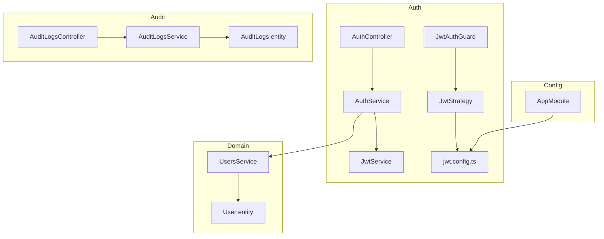
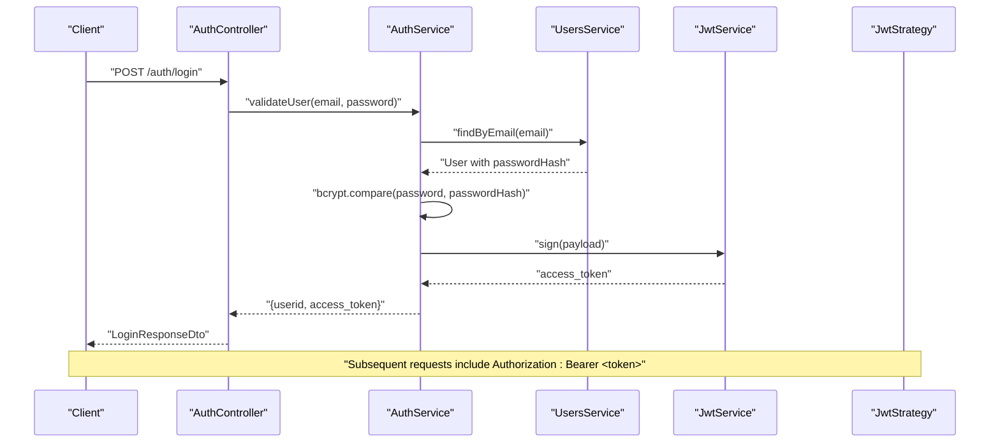
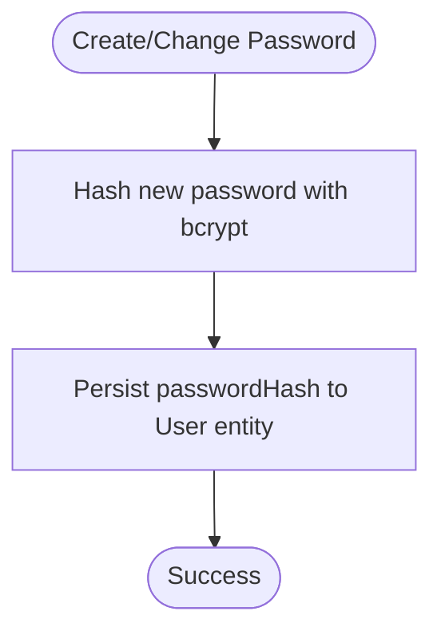
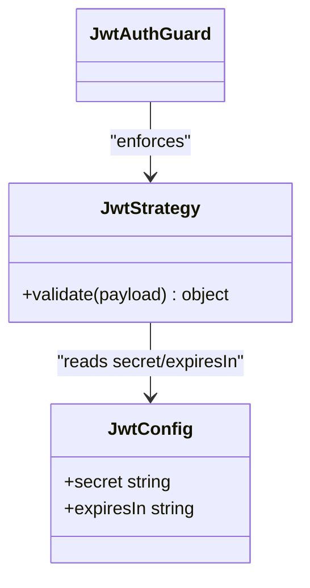
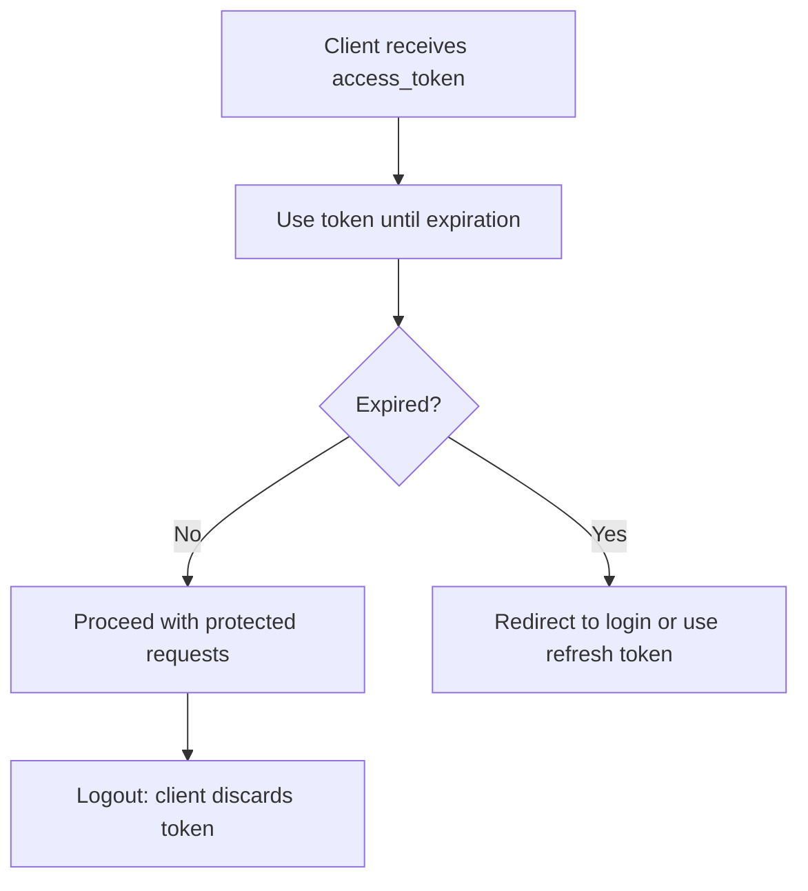
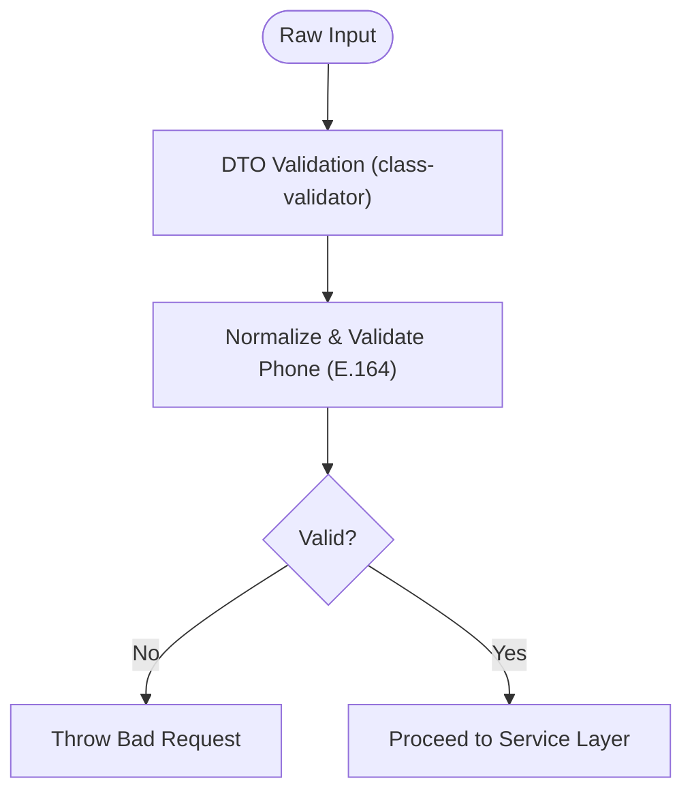
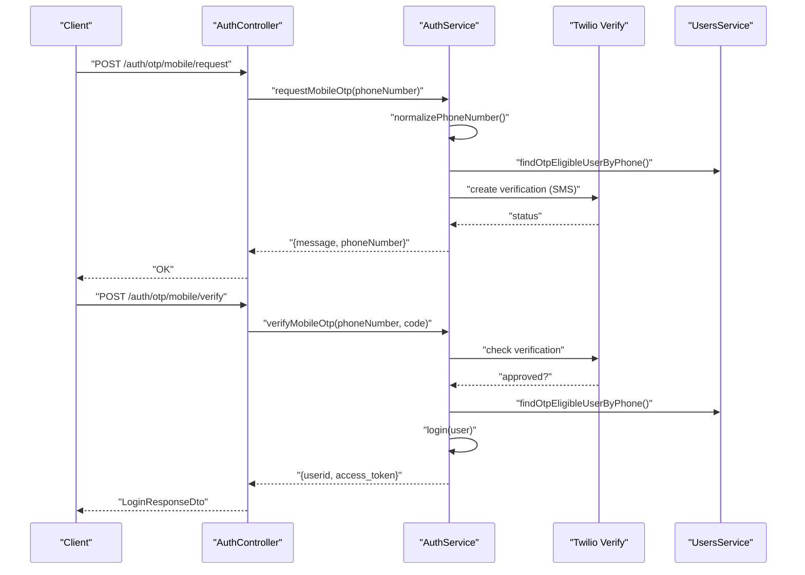
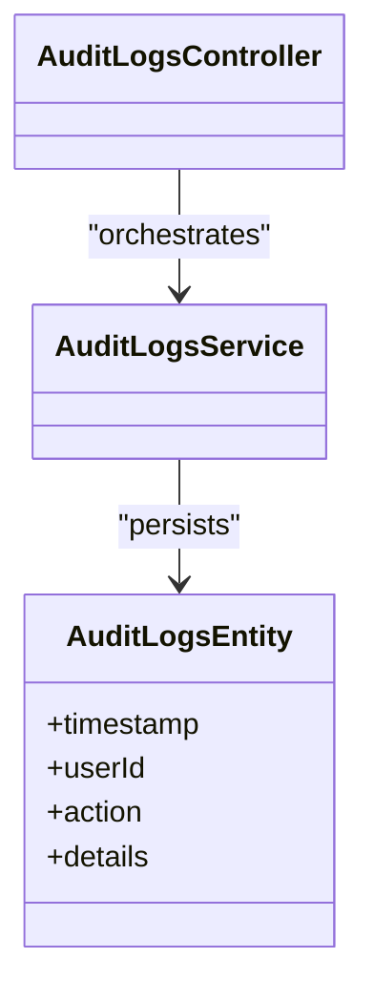
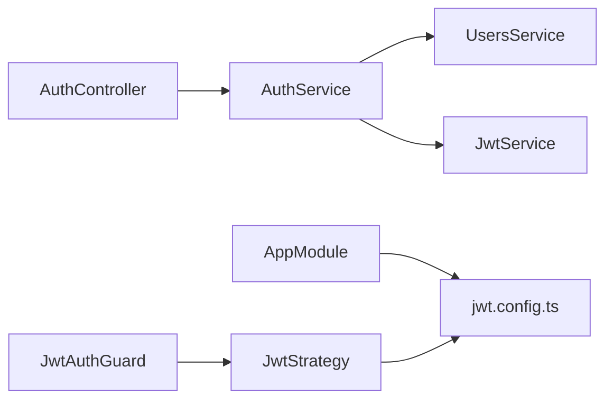

# Security Best Practices

<cite>
**Referenced Files in This Document**
- [src/auth/auth.service.ts](file://src/auth/auth.service.ts)
- [src/auth/auth.controller.ts](file://src/auth/auth.controller.ts)
- [src/auth/config/jwt.config.ts](file://src/auth/config/jwt.config.ts)
- [src/auth/strategies/jwt.strategy.ts](file://src/auth/strategies/jwt.strategy.ts)
- [src/auth/guards/jwt-auth.guard.ts](file://src/auth/guards/jwt-auth.guard.ts)
- [src/auth/dto/login-user.dto.ts](file://src/auth/dto/login-user.dto.ts)
- [src/auth/dto/login-response.dto.ts](file://src/auth/dto/login-response.dto.ts)
- [src/auth/dto/request-mobile-otp.dto.ts](file://src/auth/dto/request-mobile-otp.dto.ts)
- [src/auth/dto/verify-mobile-otp.dto.ts](file://src/auth/dto/verify-mobile-otp.dto.ts)
- [src/users/users.service.ts](file://src/users/users.service.ts)
- [src/common/utils/phone.util.ts](file://src/common/utils/phone.util.ts)
- [src/app.module.ts](file://src/app.module.ts)
- [src/audit-logs/audit-logs.controller.ts](file://src/audit-logs/audit-logs.controller.ts)
- [src/audit-logs/audit-logs.service.ts](file://src/audit-logs/audit-logs.service.ts)
- [src/audit-logs/entities/audit_logs.entity.ts](file://src/audit-logs/entities/audit_logs.entity.ts)
- [src/audit-logs/dto/create-audit-log.dto.ts](file://src/audit-logs/dto/create-audit-log.dto.ts)
- [src/entities/users.entity.ts](file://src/entities/users.entity.ts)
- [src/entities/audit_logs.entity.ts](file://src/entities/audit_logs.entity.ts)
- [src/main.ts](file://src/main.ts)
</cite>

## Table of Contents
1. [Introduction](#introduction)
2. [Project Structure](#project-structure)
3. [Core Components](#core-components)
4. [Architecture Overview](#architecture-overview)
5. [Detailed Component Analysis](#detailed-component-analysis)
6. [Dependency Analysis](#dependency-analysis)
7. [Performance Considerations](#performance-considerations)
8. [Troubleshooting Guide](#troubleshooting-guide)
9. [Conclusion](#conclusion)
10. [Appendices](#appendices)

## Introduction
This document provides comprehensive security best practices for the gym management system. It focuses on secure password handling, hashing algorithms, and credential storage; token security measures including JWT signing, encryption, and secure transmission; session management, token expiration handling, and logout procedures; input validation, sanitization, and protection against XSS, CSRF, and SQL injection; practical examples of secure coding practices, environment variable management, and security configuration; security monitoring, logging, and audit trail implementation; guidelines for secure deployment, network security, and data protection; and strategies to prevent common security vulnerabilities.

## Project Structure
The security-critical parts of the system are organized around authentication, authorization, and audit logging:
- Authentication module handles user login, OTP-based login, and JWT lifecycle.
- Authorization module enforces JWT-based access control via guards and strategies.
- Audit logs capture security-relevant events for monitoring and compliance.
- Environment configuration centralizes secrets and JWT settings.

**Diagram sources**
- [src/auth/auth.controller.ts:1-155](file://src/auth/auth.controller.ts#L1-L155)
- [src/auth/auth.service.ts:1-164](file://src/auth/auth.service.ts#L1-L164)
- [src/auth/config/jwt.config.ts:1-13](file://src/auth/config/jwt.config.ts#L1-L13)
- [src/auth/strategies/jwt.strategy.ts:1-26](file://src/auth/strategies/jwt.strategy.ts#L1-L26)
- [src/auth/guards/jwt-auth.guard.ts:1-6](file://src/auth/guards/jwt-auth.guard.ts#L1-L6)
- [src/users/users.service.ts:1-168](file://src/users/users.service.ts#L1-L168)
- [src/audit-logs/audit-logs.controller.ts](file://src/audit-logs/audit-logs.controller.ts)
- [src/audit-logs/audit-logs.service.ts](file://src/audit-logs/audit-logs.service.ts)
- [src/audit-logs/entities/audit_logs.entity.ts](file://src/audit-logs/entities/audit_logs.entity.ts)
- [src/app.module.ts:1-138](file://src/app.module.ts#L1-L138)

**Section sources**
- [src/app.module.ts:66-72](file://src/app.module.ts#L66-L72)
- [src/auth/auth.controller.ts:1-155](file://src/auth/auth.controller.ts#L1-L155)
- [src/auth/auth.service.ts:1-164](file://src/auth/auth.service.ts#L1-L164)
- [src/auth/config/jwt.config.ts:1-13](file://src/auth/config/jwt.config.ts#L1-L13)
- [src/auth/strategies/jwt.strategy.ts:1-26](file://src/auth/strategies/jwt.strategy.ts#L1-L26)
- [src/auth/guards/jwt-auth.guard.ts:1-6](file://src/auth/guards/jwt-auth.guard.ts#L1-L6)
- [src/users/users.service.ts:1-168](file://src/users/users.service.ts#L1-L168)
- [src/audit-logs/audit-logs.controller.ts](file://src/audit-logs/audit-logs.controller.ts)
- [src/audit-logs/audit-logs.service.ts](file://src/audit-logs/audit-logs.service.ts)
- [src/audit-logs/entities/audit_logs.entity.ts](file://src/audit-logs/entities/audit_logs.entity.ts)

## Core Components
- Secure password handling and storage:
  - Passwords are hashed using bcrypt during user creation and password changes.
  - Plain-text passwords are never stored; only password hashes are persisted.
  - Validation compares provided passwords against stored hashes.

- Token security:
  - JWT secret and expiration are configured via environment variables.
  - Strategy extracts tokens from Authorization headers and enforces expiration.
  - Logout is client-side by discarding the token; server-side revocation is not implemented.

- Input validation and sanitization:
  - DTOs enforce field presence and types using class-validator.
  - Phone numbers are normalized and validated to E.164 format.

- Audit logging:
  - Dedicated audit log module captures security-relevant events for monitoring and compliance.

**Section sources**
- [src/users/users.service.ts:26-41](file://src/users/users.service.ts#L26-L41)
- [src/users/users.service.ts:140-166](file://src/users/users.service.ts#L140-L166)
- [src/auth/config/jwt.config.ts:4-12](file://src/auth/config/jwt.config.ts#L4-L12)
- [src/auth/strategies/jwt.strategy.ts:15-19](file://src/auth/strategies/jwt.strategy.ts#L15-L19)
- [src/auth/auth.controller.ts:129-153](file://src/auth/auth.controller.ts#L129-L153)
- [src/auth/dto/login-user.dto.ts:1-18](file://src/auth/dto/login-user.dto.ts#L1-L18)
- [src/auth/dto/request-mobile-otp.dto.ts:1-13](file://src/auth/dto/request-mobile-otp.dto.ts#L1-L13)
- [src/auth/dto/verify-mobile-otp.dto.ts:1-21](file://src/auth/dto/verify-mobile-otp.dto.ts#L1-L21)
- [src/common/utils/phone.util.ts:3-28](file://src/common/utils/phone.util.ts#L3-L28)
- [src/audit-logs/audit-logs.controller.ts](file://src/audit-logs/audit-logs.controller.ts)
- [src/audit-logs/audit-logs.service.ts](file://src/audit-logs/audit-logs.service.ts)
- [src/audit-logs/entities/audit_logs.entity.ts](file://src/audit-logs/entities/audit_logs.entity.ts)

## Architecture Overview
The authentication and authorization flow integrates DTO validation, service logic, JWT configuration, and strategy-based guard enforcement. Audit logging is decoupled to support monitoring and compliance.

**Diagram sources**
- [src/auth/auth.controller.ts:75-88](file://src/auth/auth.controller.ts#L75-L88)
- [src/auth/auth.service.ts:31-51](file://src/auth/auth.service.ts#L31-L51)
- [src/users/users.service.ts:94-96](file://src/users/users.service.ts#L94-L96)
- [src/auth/config/jwt.config.ts:6-10](file://src/auth/config/jwt.config.ts#L6-L10)
- [src/auth/strategies/jwt.strategy.ts:22-24](file://src/auth/strategies/jwt.strategy.ts#L22-L24)

## Detailed Component Analysis

### Secure Password Handling and Credential Storage
- Hashing algorithm: bcrypt is used consistently for password hashing during creation and updates.
- Storage: Only password hashes are stored; plain-text passwords are excluded from responses and persistence.
- Validation: Password comparison uses bcrypt to verify credentials without exposing stored values.

**Diagram sources**
- [src/users/users.service.ts:26-41](file://src/users/users.service.ts#L26-L41)
- [src/users/users.service.ts:162-166](file://src/users/users.service.ts#L162-L166)

**Section sources**
- [src/users/users.service.ts:26-41](file://src/users/users.service.ts#L26-L41)
- [src/users/users.service.ts:140-166](file://src/users/users.service.ts#L140-L166)

### JWT Signing, Encryption, and Secure Transmission
- Secret and expiration: JWT secret and expiration are loaded from environment variables via configuration.
- Strategy: Token extraction from Authorization header, expiration enforcement, and secret validation.
- Guard: Global guard ensures protected routes require a valid JWT.

**Diagram sources**
- [src/auth/strategies/jwt.strategy.ts:10-25](file://src/auth/strategies/jwt.strategy.ts#L10-L25)
- [src/auth/guards/jwt-auth.guard.ts:1-6](file://src/auth/guards/jwt-auth.guard.ts#L1-L6)
- [src/auth/config/jwt.config.ts:4-12](file://src/auth/config/jwt.config.ts#L4-L12)

**Section sources**
- [src/auth/config/jwt.config.ts:4-12](file://src/auth/config/jwt.config.ts#L4-L12)
- [src/auth/strategies/jwt.strategy.ts:15-19](file://src/auth/strategies/jwt.strategy.ts#L15-L19)
- [src/auth/guards/jwt-auth.guard.ts:1-6](file://src/auth/guards/jwt-auth.guard.ts#L1-L6)

### Session Management, Token Expiration, and Logout
- Token expiration: Enforced by strategy; clients must refresh or re-authenticate after expiry.
- Logout: Client-side token discarding; server does not maintain token state.
- Recommendations:
  - Implement short-lived access tokens with refresh tokens stored securely (HTTP-only, SameSite cookies).
  - Add server-side token blacklisting or rotation for privileged sessions.
  - Enforce logout by clearing browser storage and optionally invoking a revoke endpoint.

**Diagram sources**
- [src/auth/strategies/jwt.strategy.ts:17-18](file://src/auth/strategies/jwt.strategy.ts#L17-L18)
- [src/auth/auth.controller.ts:129-153](file://src/auth/auth.controller.ts#L129-L153)

**Section sources**
- [src/auth/strategies/jwt.strategy.ts:17-18](file://src/auth/strategies/jwt.strategy.ts#L17-L18)
- [src/auth/auth.controller.ts:129-153](file://src/auth/auth.controller.ts#L129-L153)

### Input Validation, Sanitization, and Attack Protection
- DTO validation: Email and string validations ensure structured inputs.
- Phone normalization: Validates and normalizes phone numbers to E.164 format; rejects invalid formats.
- Protection strategies:
  - XSS: Avoid inline scripts, escape output, use Content-Security-Policy headers.
  - CSRF: Use anti-CSRF tokens for state-changing forms; SameSite cookies for API tokens.
  - SQL injection: Use ORM with parameterized queries; avoid dynamic SQL concatenation.

**Diagram sources**
- [src/auth/dto/login-user.dto.ts:4-16](file://src/auth/dto/login-user.dto.ts#L4-L16)
- [src/auth/dto/request-mobile-otp.dto.ts:4-11](file://src/auth/dto/request-mobile-otp.dto.ts#L4-L11)
- [src/auth/dto/verify-mobile-otp.dto.ts:4-19](file://src/auth/dto/verify-mobile-otp.dto.ts#L4-L19)
- [src/common/utils/phone.util.ts:3-28](file://src/common/utils/phone.util.ts#L3-L28)

**Section sources**
- [src/auth/dto/login-user.dto.ts:1-18](file://src/auth/dto/login-user.dto.ts#L1-L18)
- [src/auth/dto/request-mobile-otp.dto.ts:1-13](file://src/auth/dto/request-mobile-otp.dto.ts#L1-L13)
- [src/auth/dto/verify-mobile-otp.dto.ts:1-21](file://src/auth/dto/verify-mobile-otp.dto.ts#L1-L21)
- [src/common/utils/phone.util.ts:3-28](file://src/common/utils/phone.util.ts#L3-L28)

### OTP-Based Authentication and Secure Transmission
- OTP request and verification integrate with Twilio Verify.
- Phone number normalization ensures consistent E.164 formatting before provider calls.
- Error handling maps provider errors to appropriate HTTP statuses.

**Diagram sources**
- [src/auth/auth.controller.ts:107-127](file://src/auth/auth.controller.ts#L107-L127)
- [src/auth/auth.service.ts:53-118](file://src/auth/auth.service.ts#L53-L118)
- [src/users/users.service.ts:105-125](file://src/users/users.service.ts#L105-L125)
- [src/common/utils/phone.util.ts:3-28](file://src/common/utils/phone.util.ts#L3-L28)

**Section sources**
- [src/auth/auth.controller.ts:90-127](file://src/auth/auth.controller.ts#L90-L127)
- [src/auth/auth.service.ts:53-118](file://src/auth/auth.service.ts#L53-L118)
- [src/users/users.service.ts:105-125](file://src/users/users.service.ts#L105-L125)
- [src/common/utils/phone.util.ts:3-28](file://src/common/utils/phone.util.ts#L3-L28)

### Audit Logging and Monitoring
- Audit logs capture security-relevant events for monitoring and compliance.
- Entities and services define structure and persistence for audit records.
- Controllers expose endpoints to manage audit logs.

**Diagram sources**
- [src/audit-logs/audit-logs.controller.ts](file://src/audit-logs/audit-logs.controller.ts)
- [src/audit-logs/audit-logs.service.ts](file://src/audit-logs/audit-logs.service.ts)
- [src/audit-logs/entities/audit_logs.entity.ts](file://src/audit-logs/entities/audit_logs.entity.ts)

**Section sources**
- [src/audit-logs/audit-logs.controller.ts](file://src/audit-logs/audit-logs.controller.ts)
- [src/audit-logs/audit-logs.service.ts](file://src/audit-logs/audit-logs.service.ts)
- [src/audit-logs/entities/audit_logs.entity.ts](file://src/audit-logs/entities/audit_logs.entity.ts)

## Dependency Analysis
- AppModule loads configuration and registers modules, ensuring JWT configuration is available globally.
- AuthController depends on AuthService for business logic.
- AuthService depends on UsersService for identity lookup and JwtService for token generation.
- JwtStrategy reads configuration and enforces token validation.
- Guards rely on JwtStrategy to protect routes.

**Diagram sources**
- [src/app.module.ts:66-72](file://src/app.module.ts#L66-L72)
- [src/auth/auth.controller.ts:25-25](file://src/auth/auth.controller.ts#L25-L25)
- [src/auth/auth.service.ts:18-29](file://src/auth/auth.service.ts#L18-L29)
- [src/auth/config/jwt.config.ts:4-12](file://src/auth/config/jwt.config.ts#L4-L12)
- [src/auth/strategies/jwt.strategy.ts:10-20](file://src/auth/strategies/jwt.strategy.ts#L10-L20)
- [src/auth/guards/jwt-auth.guard.ts:1-6](file://src/auth/guards/jwt-auth.guard.ts#L1-L6)

**Section sources**
- [src/app.module.ts:66-72](file://src/app.module.ts#L66-L72)
- [src/auth/auth.controller.ts:25-25](file://src/auth/auth.controller.ts#L25-L25)
- [src/auth/auth.service.ts:18-29](file://src/auth/auth.service.ts#L18-L29)
- [src/auth/config/jwt.config.ts:4-12](file://src/auth/config/jwt.config.ts#L4-L12)
- [src/auth/strategies/jwt.strategy.ts:10-20](file://src/auth/strategies/jwt.strategy.ts#L10-L20)
- [src/auth/guards/jwt-auth.guard.ts:1-6](file://src/auth/guards/jwt-auth.guard.ts#L1-L6)

## Performance Considerations
- Hashing cost: bcrypt rounds should balance security and latency; monitor login duration and adjust accordingly.
- Token lifetime: Shorter expirations reduce risk but increase re-auth frequency; consider sliding expiration for UX.
- Database queries: Indexes on email and phone fields improve lookup performance for authentication and OTP flows.
- Logging overhead: Batch or rate-limit audit log writes to minimize impact on request latency.

## Troubleshooting Guide
- Unauthorized credentials: Validation throws unauthorized exceptions when user not found or password mismatch occurs.
- OTP provider errors: Mapped to bad request or service unavailable depending on provider status codes.
- Phone number validation: Throws bad request for missing or invalid phone numbers; ensure E.164 formatting.

**Section sources**
- [src/auth/auth.service.ts:31-42](file://src/auth/auth.service.ts#L31-L42)
- [src/auth/auth.service.ts:142-162](file://src/auth/auth.service.ts#L142-L162)
- [src/common/utils/phone.util.ts:6-13](file://src/common/utils/phone.util.ts#L6-L13)
- [src/common/utils/phone.util.ts:27-28](file://src/common/utils/phone.util.ts#L27-L28)

## Conclusion
The system implements robust password hashing with bcrypt, structured DTO validation, and JWT-based authorization with enforced expiration. OTP-based authentication adds an extra layer for eligible users. To further strengthen security, implement refresh token management, server-side token revocation, enhanced CORS and CSP policies, CSRF protections, and comprehensive audit logging with retention and alerting.

## Appendices

### Practical Secure Coding Examples
- Password hashing and validation:
  - Creation and change flows use bcrypt hashing and comparison.
  - Reference: [src/users/users.service.ts:26-41](file://src/users/users.service.ts#L26-L41), [src/users/users.service.ts:140-166](file://src/users/users.service.ts#L140-L166)

- JWT configuration and strategy:
  - Load secret and expiration from environment variables.
  - Validate tokens from Authorization headers with expiration checks.
  - Reference: [src/auth/config/jwt.config.ts:4-12](file://src/auth/config/jwt.config.ts#L4-L12), [src/auth/strategies/jwt.strategy.ts:15-19](file://src/auth/strategies/jwt.strategy.ts#L15-L19)

- Input validation and phone normalization:
  - DTOs enforce presence and types; phone numbers are normalized to E.164.
  - Reference: [src/auth/dto/login-user.dto.ts:4-16](file://src/auth/dto/login-user.dto.ts#L4-L16), [src/common/utils/phone.util.ts:3-28](file://src/common/utils/phone.util.ts#L3-L28)

- Logout procedure:
  - Client-side token discarding; optional server-side revocation for privileged sessions.
  - Reference: [src/auth/auth.controller.ts:129-153](file://src/auth/auth.controller.ts#L129-L153)

### Environment Variable Management and Security Configuration
- Centralized configuration loading with environment file support.
- JWT secret and expiration controlled via environment variables.
- Reference: [src/app.module.ts:68-72](file://src/app.module.ts#L68-L72), [src/auth/config/jwt.config.ts:6-10](file://src/auth/config/jwt.config.ts#L6-L10)

### Security Monitoring, Logging, and Audit Trail Implementation
- Audit logs module for capturing security-relevant events.
- Entities and services define persistence and retrieval.
- Reference: [src/audit-logs/audit-logs.controller.ts](file://src/audit-logs/audit-logs.controller.ts), [src/audit-logs/audit-logs.service.ts](file://src/audit-logs/audit-logs.service.ts), [src/audit-logs/entities/audit_logs.entity.ts](file://src/audit-logs/entities/audit_logs.entity.ts)

### Secure Deployment, Network Security, and Data Protection
- Transport security: Enforce HTTPS/TLS termination at the edge/load balancer.
- Secrets management: Store JWT secret and third-party keys in secure vaults; restrict environment file access.
- Network security: Restrict inbound ports, enable WAF, and apply rate limiting.
- Data protection: Encrypt sensitive fields at rest; apply database row-level security and audit trails.
- Reference: [src/main.ts](file://src/main.ts), [src/app.module.ts:68-72](file://src/app.module.ts#L68-L72)