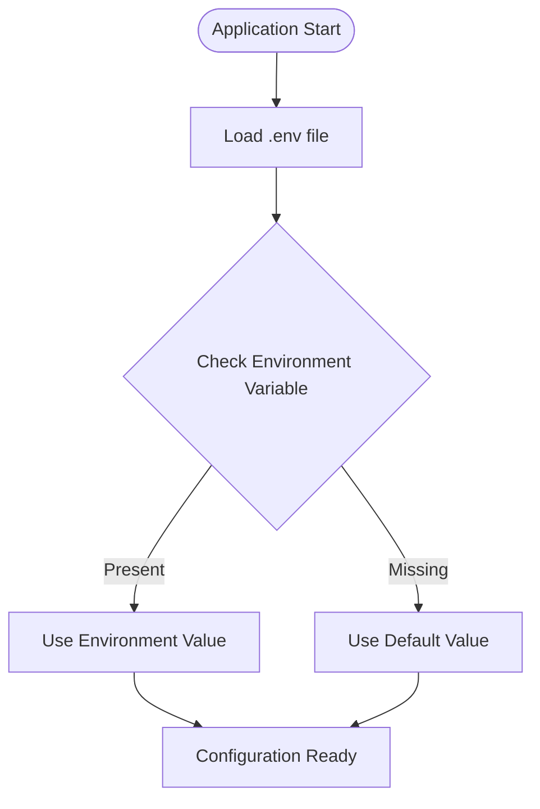
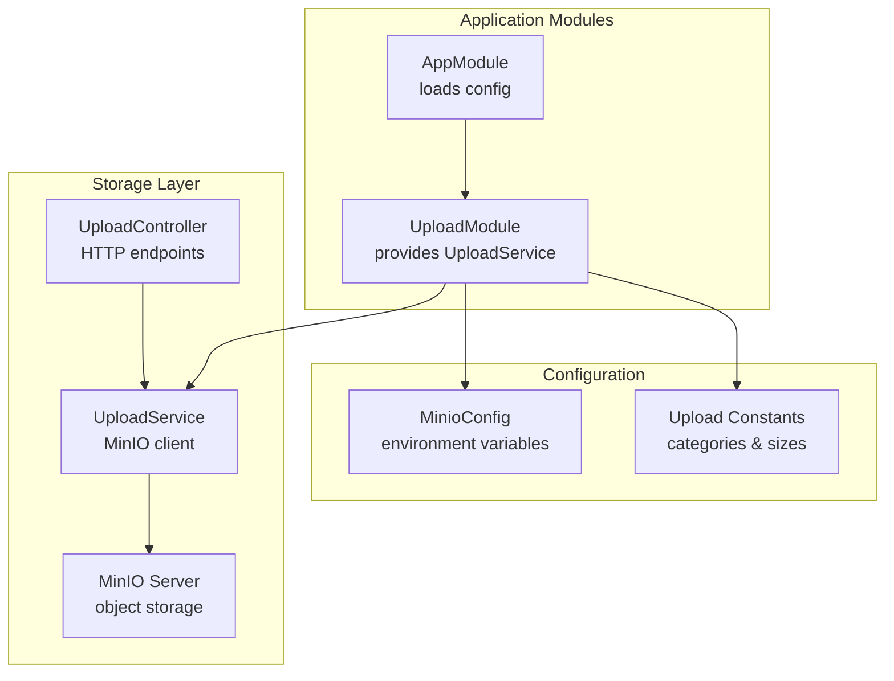
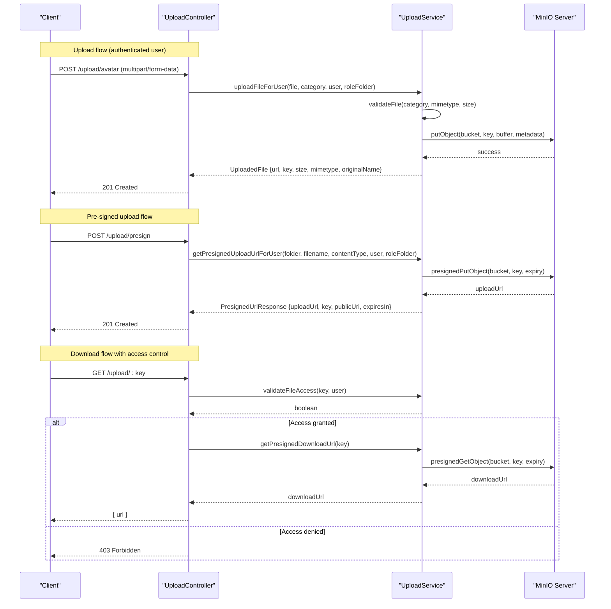
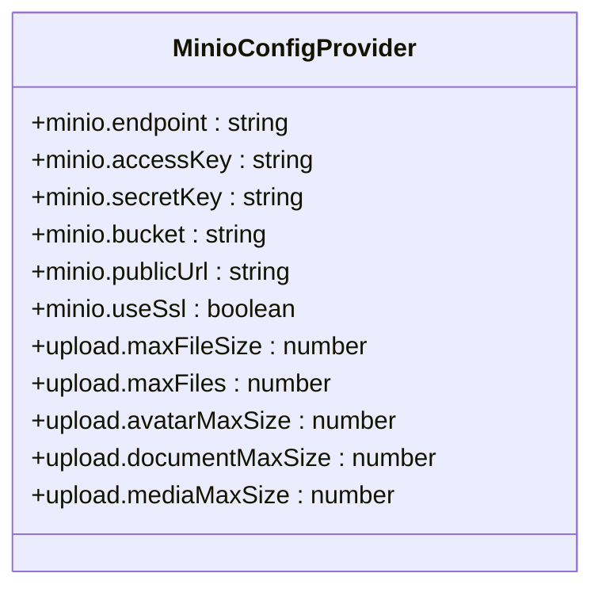
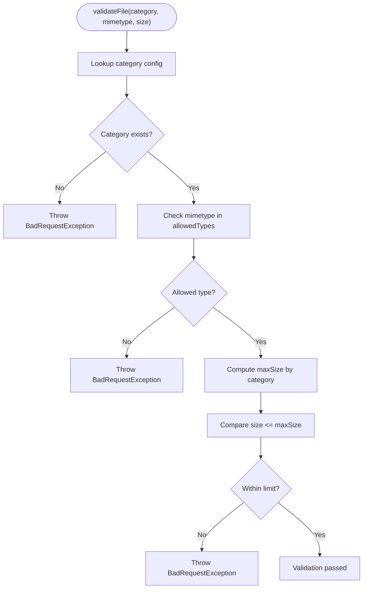
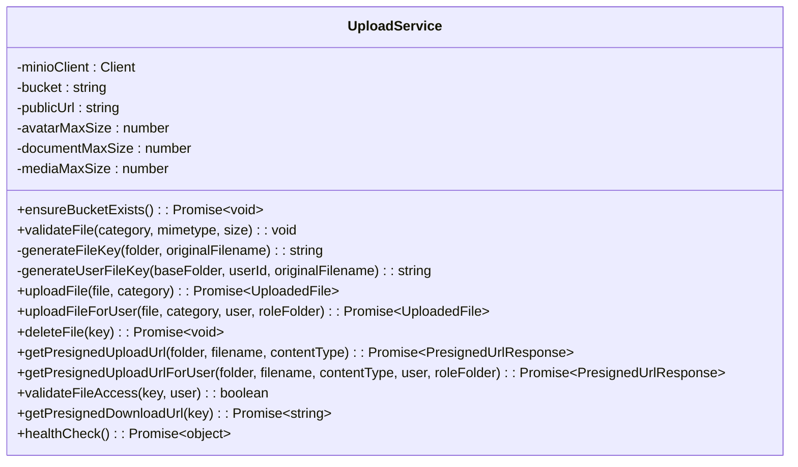
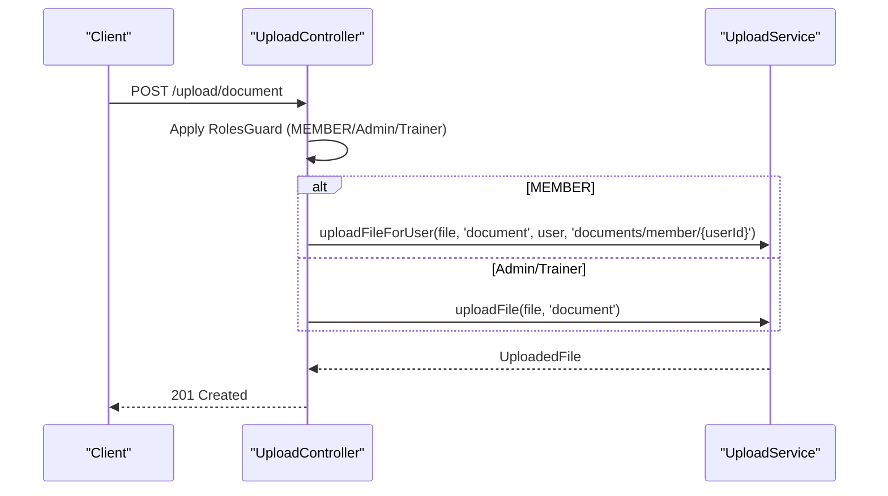
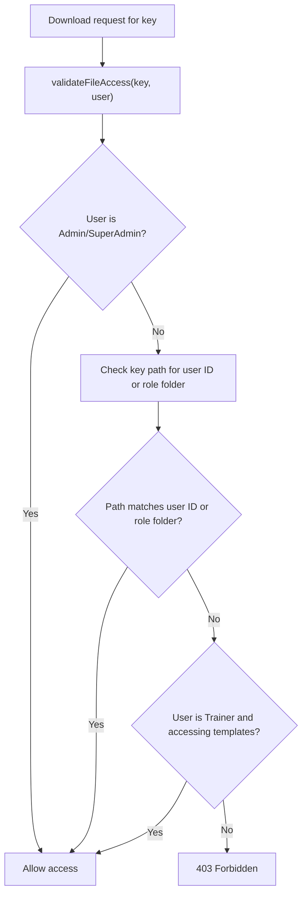
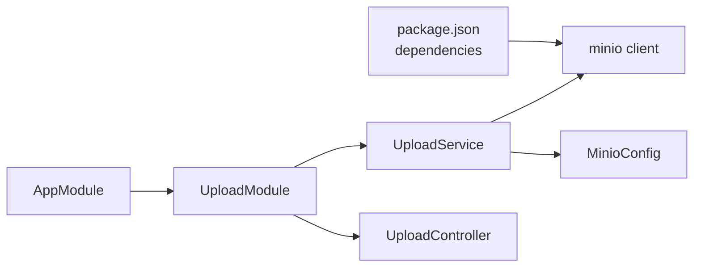

# Cloud Storage Configuration

<cite>
**Referenced Files in This Document**
- [minio.config.ts](file://src/config/minio.config.ts)
- [upload.constants.ts](file://src/upload/constants/upload.constants.ts)
- [upload.interface.ts](file://src/upload/interfaces/upload.interface.ts)
- [upload-file.dto.ts](file://src/upload/dto/upload-file.dto.ts)
- [presigned-url.dto.ts](file://src/upload/dto/presigned-url.dto.ts)
- [upload.service.ts](file://src/upload/upload.service.ts)
- [upload.controller.ts](file://src/upload/upload.controller.ts)
- [upload.module.ts](file://src/upload/upload.module.ts)
- [app.module.ts](file://src/app.module.ts)
- [package.json](file://package.json)
</cite>

## Update Summary
**Changes Made**
- Enhanced MinIO configuration documentation with comprehensive environment variable setup
- Added detailed coverage of MINIO environment variables: MINIO_ENDPOINT, MINIO_ACCESS_KEY, MINIO_SECRET_KEY, MINIO_BUCKET, MINIO_PUBLIC_URL, and MINIO_USE_SSL
- Updated configuration examples with environment variable usage patterns
- Expanded troubleshooting guide with environment variable validation steps

## Table of Contents
1. [Introduction](#introduction)
2. [Environment Variable Configuration](#environment-variable-configuration)
3. [Project Structure](#project-structure)
4. [Core Components](#core-components)
5. [Architecture Overview](#architecture-overview)
6. [Detailed Component Analysis](#detailed-component-analysis)
7. [Dependency Analysis](#dependency-analysis)
8. [Performance Considerations](#performance-considerations)
9. [Troubleshooting Guide](#troubleshooting-guide)
10. [Conclusion](#conclusion)

## Introduction
This document provides comprehensive cloud storage configuration guidance for the gym management system's object storage implementation. The system uses MinIO as the object storage backend and exposes secure file upload, download, and management capabilities via dedicated APIs. It covers MinIO server setup, bucket configuration, access control policies, file upload options, validation rules, integration patterns, security configurations, and operational best practices.

## Environment Variable Configuration

The MinIO configuration is fully managed through environment variables for flexible deployment across different environments. All configuration values are loaded from environment variables with sensible defaults for local development.

### Required Environment Variables

| Variable | Description | Default Value | Required |
|----------|-------------|---------------|----------|
| `MINIO_ENDPOINT` | MinIO server endpoint (host:port) | `localhost:9000` | Yes |
| `MINIO_ACCESS_KEY` | MinIO access key for authentication | `minioadmin` | Yes |
| `MINIO_SECRET_KEY` | MinIO secret key for authentication | `minioadmin` | Yes |
| `MINIO_BUCKET` | Default bucket name for storage | `gym-media` | Yes |
| `MINIO_PUBLIC_URL` | Public URL for accessing files | `http://localhost:9000` | Yes |
| `MINIO_USE_SSL` | Enable SSL/TLS connection (true/false) | `false` | No |

### Configuration Loading Process

The application loads MinIO configuration through NestJS ConfigModule with the following priority order:
1. Environment variables (highest priority)
2. Hardcoded defaults in configuration file
3. Development-specific overrides



**Diagram sources**
- [app.module.ts:70-74](file://src/app.module.ts#L70-L74)
- [minio.config.ts:20-39](file://src/config/minio.config.ts#L20-L39)

### Environment Variable Examples

**Development (.env file):**
```bash
MINIO_ENDPOINT=localhost:9000
MINIO_ACCESS_KEY=minioadmin
MINIO_SECRET_KEY=minioadmin
MINIO_BUCKET=gym-media
MINIO_PUBLIC_URL=http://localhost:9000
MINIO_USE_SSL=false
```

**Production (.env.production):**
```bash
MINIO_ENDPOINT=minio.example.com:443
MINIO_ACCESS_KEY=your-production-access-key
MINIO_SECRET_KEY=your-production-secret-key
MINIO_BUCKET=gym-production-media
MINIO_PUBLIC_URL=https://cdn.example.com
MINIO_USE_SSL=true
```

**Section sources**
- [minio.config.ts:20-39](file://src/config/minio.config.ts#L20-L39)
- [app.module.ts:70-74](file://src/app.module.ts#L70-L74)

## Project Structure
The storage subsystem is organized around a dedicated upload module that encapsulates MinIO client initialization, file validation, upload/download workflows, and access control enforcement. Configuration is centralized through NestJS ConfigModule and environment variables.



**Diagram sources**
- [app.module.ts:68-133](file://src/app.module.ts#L68-L133)
- [upload.module.ts:1-13](file://src/upload/upload.module.ts#L1-L13)
- [minio.config.ts:20-39](file://src/config/minio.config.ts#L20-L39)
- [upload.constants.ts:1-43](file://src/upload/constants/upload.constants.ts#L1-L43)
- [upload.service.ts:24-66](file://src/upload/upload.service.ts#L24-L66)
- [upload.controller.ts:24-27](file://src/upload/upload.controller.ts#L24-L27)

**Section sources**
- [app.module.ts:68-133](file://src/app.module.ts#L68-L133)
- [upload.module.ts:1-13](file://src/upload/upload.module.ts#L1-L13)
- [minio.config.ts:20-39](file://src/config/minio.config.ts#L20-L39)
- [upload.constants.ts:1-43](file://src/upload/constants/upload.constants.ts#L1-L43)

## Core Components
- MinIO configuration provider defines endpoint, credentials, bucket, public URL, and SSL toggle.
- Upload configuration defines per-category size limits and general constraints.
- File categories enumerate allowed MIME types, maximum sizes, and storage folders.
- Interfaces define response structures for uploads and pre-signed URLs.
- DTOs validate incoming requests for upload and pre-signed URL generation.
- UploadService orchestrates bucket creation, file validation, uploads, deletions, and pre-signed URL generation.
- UploadController exposes REST endpoints for authenticated and role-scoped operations.

**Section sources**
- [minio.config.ts:3-39](file://src/config/minio.config.ts#L3-L39)
- [upload.constants.ts:15-43](file://src/upload/constants/upload.constants.ts#L15-L43)
- [upload.interface.ts:1-21](file://src/upload/interfaces/upload.interface.ts#L1-L21)
- [upload-file.dto.ts:1-19](file://src/upload/dto/upload-file.dto.ts#L1-L19)
- [presigned-url.dto.ts:1-14](file://src/upload/dto/presigned-url.dto.ts#L1-L14)
- [upload.service.ts:24-399](file://src/upload/upload.service.ts#L24-L399)
- [upload.controller.ts:24-185](file://src/upload/upload.controller.ts#L24-L185)

## Architecture Overview
The system integrates MinIO as the object storage backend with strict access control and pre-signed URL workflows for secure uploads and downloads.



**Diagram sources**
- [upload.controller.ts:29-106](file://src/upload/upload.controller.ts#L29-L106)
- [upload.controller.ts:113-145](file://src/upload/upload.controller.ts#L113-L145)
- [upload.service.ts:181-222](file://src/upload/upload.service.ts#L181-L222)
- [upload.service.ts:281-319](file://src/upload/upload.service.ts#L281-L319)
- [upload.service.ts:363-379](file://src/upload/upload.service.ts#L363-L379)

## Detailed Component Analysis

### MinIO Configuration Provider
- Centralized configuration via NestJS ConfigModule with environment variable overrides.
- Defines MinIO endpoint, access keys, bucket name, public URL, and SSL flag.
- Provides upload-specific limits for avatars, documents, and media.



**Diagram sources**
- [minio.config.ts:3-39](file://src/config/minio.config.ts#L3-L39)

**Section sources**
- [minio.config.ts:3-39](file://src/config/minio.config.ts#L3-L39)
- [app.module.ts:68-72](file://src/app.module.ts#L68-L72)

### File Categories and Validation
- Enumerated categories: avatar, document, media, progress.
- Each category specifies allowed MIME types, maximum size, and target folder.
- Validation enforces category existence, MIME type allowance, and size limits.



**Diagram sources**
- [upload.service.ts:87-113](file://src/upload/upload.service.ts#L87-L113)
- [upload.constants.ts:15-37](file://src/upload/constants/upload.constants.ts#L15-L37)

**Section sources**
- [upload.constants.ts:15-37](file://src/upload/constants/upload.constants.ts#L15-L37)
- [upload.service.ts:87-113](file://src/upload/upload.service.ts#L87-L113)

### Upload Service Implementation
- Initializes MinIO client from configuration and sets bucket/public URL.
- Ensures bucket exists during operations.
- Generates unique keys with UUIDs and optional user/role scoping.
- Supports direct uploads, user-scoped uploads, deletions, and pre-signed URL generation for upload/download.
- Enforces access control for downloads based on user roles and ownership.



**Diagram sources**
- [upload.service.ts:24-399](file://src/upload/upload.service.ts#L24-L399)

**Section sources**
- [upload.service.ts:24-399](file://src/upload/upload.service.ts#L24-L399)

### Upload Controller Endpoints
- Avatar upload: authenticated users upload personal avatars to role-scoped folders.
- Document upload: role-based access controls apply; members upload to personal folders; admins/trainers upload globally.
- Media upload: superadmin/admin/trainer can upload workout templates and media to role-scoped folders.
- Progress photos: authenticated users upload to personal progress folders.
- Pre-signed upload: generates short-lived upload URLs for browser-side uploads.
- Pre-signed download: validates access and returns signed download URLs.
- Delete file: admin/superadmin only.
- Health check: public endpoint for storage health verification.



**Diagram sources**
- [upload.controller.ts:58-79](file://src/upload/upload.controller.ts#L58-L79)

**Section sources**
- [upload.controller.ts:29-185](file://src/upload/upload.controller.ts#L29-L185)

### Security and Access Control
- Pre-signed URLs: generated with 1-hour expiry for both uploads and downloads.
- Access control: users can only access files in their own folders or designated shared folders (e.g., templates for trainers).
- Admin/SuperAdmin bypass access to all files.
- Role-based folder scoping ensures isolation between user data.



**Diagram sources**
- [upload.service.ts:325-358](file://src/upload/upload.service.ts#L325-L358)

**Section sources**
- [upload.service.ts:281-319](file://src/upload/upload.service.ts#L281-L319)
- [upload.service.ts:325-358](file://src/upload/upload.service.ts#L325-L358)

## Dependency Analysis
- UploadModule depends on ConfigModule for configuration injection.
- UploadService depends on MinIO client library and configuration values.
- UploadController depends on UploadService and authentication/authorization guards.
- AppModule loads the MinIO configuration provider and registers UploadModule.



**Diagram sources**
- [package.json:38](file://package.json#L38)
- [app.module.ts:68-133](file://src/app.module.ts#L68-L133)
- [upload.module.ts:1-13](file://src/upload/upload.module.ts#L1-L13)
- [upload.service.ts:24-66](file://src/upload/upload.service.ts#L24-L66)

**Section sources**
- [package.json:22-48](file://package.json#L22-L48)
- [app.module.ts:68-133](file://src/app.module.ts#L68-L133)
- [upload.module.ts:1-13](file://src/upload/upload.module.ts#L1-L13)
- [upload.service.ts:24-66](file://src/upload/upload.service.ts#L24-L66)

## Performance Considerations
- Pre-signed uploads reduce server bandwidth by allowing direct browser-to-storage transfers.
- UUID-based keys prevent hot-spotting and enable efficient cache invalidation.
- Role-based folder scoping improves organization and simplifies lifecycle management.
- Health checks support monitoring and automated failover detection.
- Consider enabling compression and CDN caching for frequently accessed assets (see CDN section).

## Troubleshooting Guide
Common issues and resolutions:

### Environment Variable Issues
- **MinIO endpoint not connecting**
  - Verify `MINIO_ENDPOINT` format: `hostname:port` or `ip:port`
  - Check network connectivity to MinIO server
  - Ensure SSL setting matches server configuration (`MINIO_USE_SSL=true` for HTTPS)

- **Authentication failures**
  - Confirm `MINIO_ACCESS_KEY` and `MINIO_SECRET_KEY` are correct
  - Verify keys have sufficient permissions for bucket operations
  - Check if server requires SSL authentication

- **Bucket creation failures**
  - Ensure bucket name in `MINIO_BUCKET` is valid and available
  - Verify access keys have bucket creation permissions
  - Check if bucket already exists and needs manual cleanup

- **Public URL access issues**
  - Verify `MINIO_PUBLIC_URL` points to correct CDN or MinIO gateway
  - Ensure URL matches actual MinIO server configuration
  - Check for trailing slash and protocol consistency

### Upload Failures
- Confirm file MIME type is allowed for the chosen category.
- Ensure file size does not exceed category-specific limits.
- Validate multipart form data structure and presence of file field.

### Access Denied Errors
- Verify user role and ownership of requested file key.
- Confirm pre-signed URL was generated for the correct user and role folder.
- Review trainer access to templates folder.

### Pre-signed URL Expiration
- Regenerate URLs if expired; default expiry is 1 hour.
- Ensure client-side time synchronization.

### Health Check Failures
- Use the public health endpoint to diagnose storage availability.
- Check MinIO server logs and cluster status.

**Section sources**
- [upload.service.ts:71-82](file://src/upload/upload.service.ts#L71-L82)
- [upload.service.ts:87-113](file://src/upload/upload.service.ts#L87-L113)
- [upload.service.ts:325-358](file://src/upload/upload.service.ts#L325-L358)
- [upload.controller.ts:180-185](file://src/upload/upload.controller.ts#L180-L185)

## Conclusion
The gym management system implements a robust, role-aware object storage solution built on MinIO. Configuration is centralized via environment variables with comprehensive support for different deployment scenarios. File validation is enforced per category, and access control ensures data isolation. Pre-signed URLs streamline uploads and downloads while maintaining security. The modular design supports easy maintenance, monitoring, and future enhancements such as CDN integration and multi-provider storage backends.

The enhanced environment variable configuration provides flexibility for development, staging, and production deployments while maintaining security best practices through configurable SSL settings and credential management.