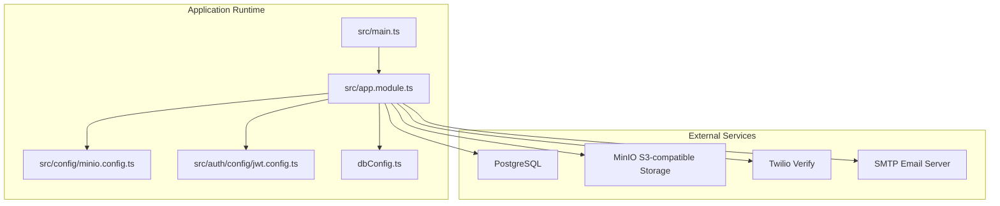
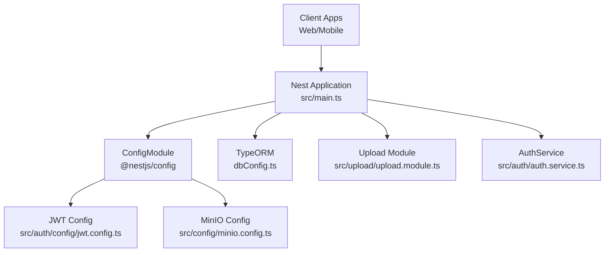
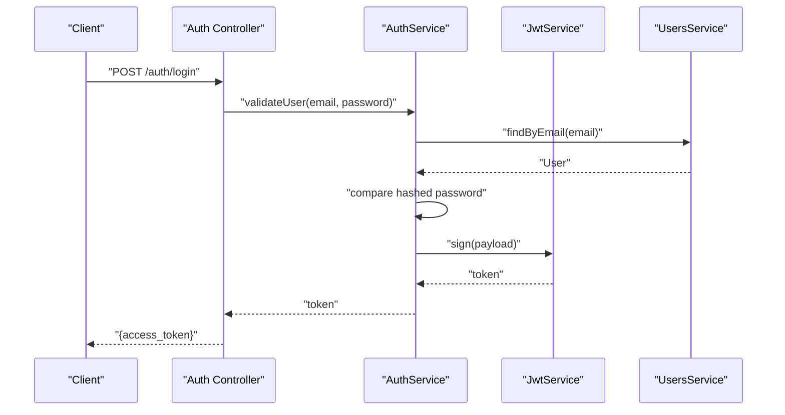
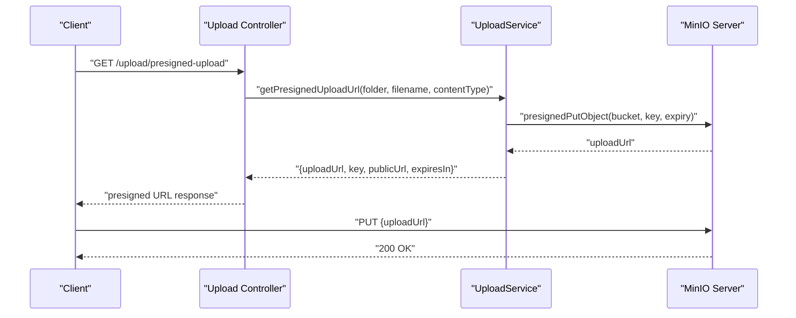
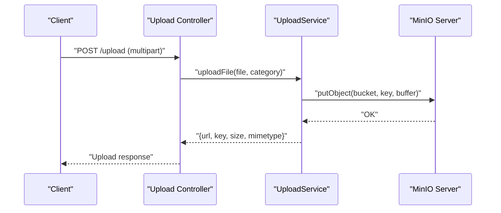
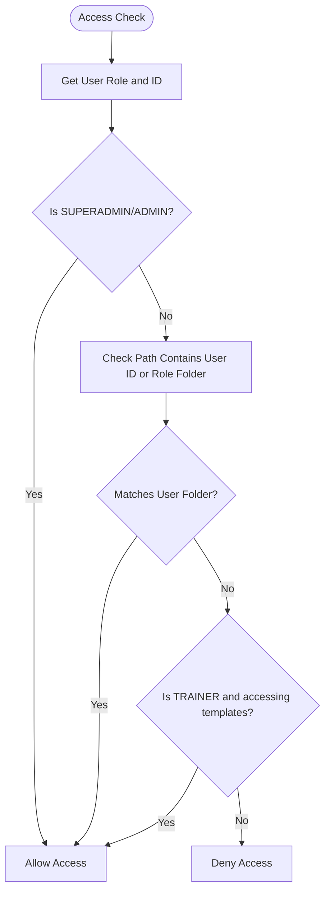
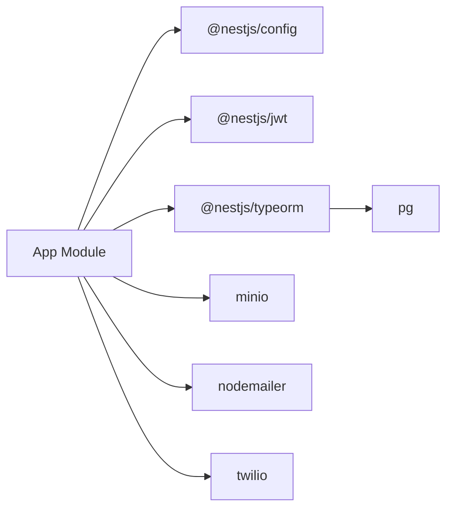

# Configuration & Deployment

<cite>
**Referenced Files in This Document**
- [package.json](file://package.json)
- [init.sh](file://init.sh)
- [dbConfig.ts](file://dbConfig.ts)
- [src/app.module.ts](file://src/app.module.ts)
- [src/main.ts](file://src/main.ts)
- [src/auth/config/jwt.config.ts](file://src/auth/config/jwt.config.ts)
- [src/auth/auth.service.ts](file://src/auth/auth.service.ts)
- [src/config/minio.config.ts](file://src/config/minio.config.ts)
- [src/upload/upload.module.ts](file://src/upload/upload.module.ts)
- [src/upload/upload.service.ts](file://src/upload/upload.service.ts)
- [node_modules/bcrypt/Dockerfile](file://node_modules/bcrypt/Dockerfile)
</cite>

## Table of Contents
1. [Introduction](#introduction)
2. [Project Structure](#project-structure)
3. [Core Components](#core-components)
4. [Architecture Overview](#architecture-overview)
5. [Detailed Component Analysis](#detailed-component-analysis)
6. [Dependency Analysis](#dependency-analysis)
7. [Performance Considerations](#performance-considerations)
8. [Troubleshooting Guide](#troubleshooting-guide)
9. [Conclusion](#conclusion)
10. [Appendices](#appendices)

## Introduction
This document provides comprehensive configuration and deployment guidance for the gym management system. It covers environment configuration (database, JWT, MinIO, email/SMS), development versus production differences, secrets handling, deployment procedures (including Docker and cloud), CI/CD considerations, database migrations and backups, performance tuning, monitoring/logging, health checks, scaling, and troubleshooting.

## Project Structure
The backend is a NestJS application configured with:
- TypeORM for PostgreSQL persistence
- @nestjs/config for environment-driven configuration
- JWT authentication with Passport
- MinIO for object storage
- Twilio for SMS OTP verification
- Nodemailer for SMTP-based email sending
- Swagger for API documentation
- Global validation pipe for DTO sanitization and coercion

**Diagram sources**
- [src/main.ts:1-70](file://src/main.ts#L1-L70)
- [src/app.module.ts:1-138](file://src/app.module.ts#L1-L138)
- [src/config/minio.config.ts:1-37](file://src/config/minio.config.ts#L1-L37)
- [src/auth/config/jwt.config.ts:1-13](file://src/auth/config/jwt.config.ts#L1-L13)
- [dbConfig.ts:1-12](file://dbConfig.ts#L1-L12)

**Section sources**
- [src/app.module.ts:66-74](file://src/app.module.ts#L66-L74)
- [src/main.ts:67](file://src/main.ts#L67)
- [package.json:22-46](file://package.json#L22-L46)

## Core Components
- Environment configuration and secrets
  - Database: DATABASE_URL or POSTGRES_URL fallback; NODE_ENV controls schema synchronization behavior
  - JWT: secret and expiration loaded via @nestjs/config
  - CORS: configurable origins via environment
  - Twilio: account SID, auth token, and verify service SID
  - SMTP: host, port, user, pass, sender address
  - MinIO: endpoint, access/secret keys, bucket, public URL, SSL toggle, upload limits
- Modules and configuration loading
  - ConfigModule.forRoot loads minio config and .env
  - TypeOrmModule.forRoot loads PostgreSQL connection options
  - Upload module integrates MinIO configuration and exposes upload service
- Authentication and security
  - JWT strategy and guards
  - Twilio client initialization guarded by environment variables
  - Global ValidationPipe enabled

**Section sources**
- [dbConfig.ts:3-11](file://dbConfig.ts#L3-L11)
- [src/auth/config/jwt.config.ts:4-12](file://src/auth/config/jwt.config.ts#L4-L12)
- [src/main.ts:8-19](file://src/main.ts#L8-L19)
- [src/auth/auth.service.ts:16-29](file://src/auth/auth.service.ts#L16-L29)
- [src/config/minio.config.ts:20-36](file://src/config/minio.config.ts#L20-L36)
- [src/app.module.ts:68-74](file://src/app.module.ts#L68-L74)

## Architecture Overview
The runtime architecture ties together configuration-driven modules, external services, and middleware.

**Diagram sources**
- [src/main.ts:6-68](file://src/main.ts#L6-L68)
- [src/app.module.ts:66-133](file://src/app.module.ts#L66-L133)
- [src/auth/config/jwt.config.ts:4-12](file://src/auth/config/jwt.config.ts#L4-L12)
- [src/config/minio.config.ts:20-36](file://src/config/minio.config.ts#L20-L36)
- [dbConfig.ts:3-11](file://dbConfig.ts#L3-L11)
- [src/upload/upload.module.ts:6-12](file://src/upload/upload.module.ts#L6-L12)
- [src/auth/auth.service.ts:16-29](file://src/auth/auth.service.ts#L16-L29)

## Detailed Component Analysis

### Database Configuration
- Connection URL resolution order: DATABASE_URL, POSTGRES_URL, fallback to localhost
- NODE_ENV determines schema synchronization behavior
- Entities discovered automatically under the project tree

Operational guidance:
- Prefer DATABASE_URL for platform compatibility
- In production, ensure strong TLS and network policies
- Use separate databases per environment (dev/stage/prod)

**Section sources**
- [dbConfig.ts:3-11](file://dbConfig.ts#L3-L11)

### JWT Configuration
- Secret and expiration loaded from environment
- Guarded by @nestjs/config registration

Operational guidance:
- Generate a cryptographically secure secret (minimum 32 characters)
- Rotate secrets with coordinated rollout and cache invalidation
- Keep expiration aligned with client session needs

**Section sources**
- [src/auth/config/jwt.config.ts:4-12](file://src/auth/config/jwt.config.ts#L4-L12)

### CORS and API Exposure
- Origins configurable via environment; defaults to localhost domains
- Swagger UI exposed at /api
- Port configurable via environment

**Section sources**
- [src/main.ts:8-19](file://src/main.ts#L8-L19)
- [src/main.ts:28-65](file://src/main.ts#L28-L65)

### MinIO Storage Configuration
- Endpoint, access/secret keys, bucket, public URL, SSL toggle
- Upload limits per category (avatars, documents, media)
- Upload service validates types and sizes, ensures bucket existence, and supports presigned URLs

Security and access:
- Bucket-level access control recommended
- Use role-scoped folders for user uploads
- Enforce presigned URL expirations

**Section sources**
- [src/config/minio.config.ts:20-36](file://src/config/minio.config.ts#L20-L36)
- [src/upload/upload.service.ts:21-38](file://src/upload/upload.service.ts#L21-L38)
- [src/upload/upload.service.ts:59-79](file://src/upload/upload.service.ts#L59-L79)
- [src/upload/upload.service.ts:102-137](file://src/upload/upload.service.ts#L102-L137)
- [src/upload/upload.service.ts:143-184](file://src/upload/upload.service.ts#L143-L184)
- [src/upload/upload.service.ts:202-233](file://src/upload/upload.service.ts#L202-L233)
- [src/upload/upload.service.ts:239-273](file://src/upload/upload.service.ts#L239-L273)
- [src/upload/upload.service.ts:314-326](file://src/upload/upload.service.ts#L314-L326)

### Email and SMS Integration
- SMTP: host, port, user, pass, sender address
- Twilio: account SID, auth token, verify service SID
- Twilio client initialized conditionally when credentials are present

Operational guidance:
- Use dedicated sender addresses and DKIM alignment
- Enable 2FA/TOTP for SMTP credentials
- Provision Twilio service and verify phone numbers for OTP

**Section sources**
- [init.sh:162-186](file://init.sh#L162-L186)
- [src/auth/auth.service.ts:16-29](file://src/auth/auth.service.ts#L16-L29)

### Authentication Flow (JWT)

**Diagram sources**
- [src/auth/auth.service.ts:31-42](file://src/auth/auth.service.ts#L31-L42)

### Upload Workflow (Direct Browser Upload)

**Diagram sources**
- [src/upload/upload.service.ts:202-233](file://src/upload/upload.service.ts#L202-L233)

### Upload Workflow (Server-Side Upload)

**Diagram sources**
- [src/upload/upload.service.ts:102-137](file://src/upload/upload.service.ts#L102-L137)

### Upload Access Control Logic

**Diagram sources**
- [src/upload/upload.service.ts:279-309](file://src/upload/upload.service.ts#L279-L309)

## Dependency Analysis
Key runtime dependencies and their roles:
- @nestjs/config: centralizes environment-driven configuration
- @nestjs/jwt: JWT signing and parsing
- @nestjs/typeorm: ORM and database connectivity
- minio: S3-compatible object storage
- nodemailer: SMTP email transport
- twilio: SMS verification
- bcrypt: password hashing

**Diagram sources**
- [package.json:22-46](file://package.json#L22-L46)
- [src/app.module.ts:66-133](file://src/app.module.ts#L66-L133)

**Section sources**
- [package.json:22-46](file://package.json#L22-L46)

## Performance Considerations
- Database
  - Use connection pooling and appropriate pool sizes in production
  - Index frequently queried columns (foreign keys, timestamps)
  - Monitor slow queries and enable query logging during tuning
- JWT
  - Keep tokens short-lived; refresh tokens via secure storage if needed
  - Offload token verification to shared cache/session store if horizontally scaling
- MinIO
  - Tune multipart upload thresholds and concurrency
  - Use CDN in front of MinIO for static assets
- CORS and Validation Pipe
  - Keep CORS origins minimal and precise
  - ValidationPipe transforms and whitelists reduce downstream errors

[No sources needed since this section provides general guidance]

## Troubleshooting Guide
Common deployment and configuration issues:

- Missing JWT_SECRET
  - Symptom: Startup fails or authentication endpoints unusable
  - Resolution: Provide a secure secret via environment variable or .env; ensure minimum length

- Database connection failures
  - Symptom: Application fails to connect to PostgreSQL
  - Resolution: Verify DATABASE_URL/POSTGRES_URL; confirm network reachability and TLS settings

- MinIO connectivity issues
  - Symptom: Uploads fail or health checks report errors
  - Resolution: Confirm endpoint, access/secret keys, bucket existence, and SSL setting

- CORS blocked requests
  - Symptom: Frontend receives CORS errors
  - Resolution: Set CORS_ORIGINS to include frontend origins

- Twilio/SMS not working
  - Symptom: OTP send failures
  - Resolution: Provide TWILIO_ACCOUNT_SID, TWILIO_AUTH_TOKEN, TWILIO_VERIFY_SERVICE_SID

- SMTP email delivery issues
  - Symptom: Reminder emails not sent
  - Resolution: Configure SMTP_HOST, SMTP_PORT, SMTP_USER, SMTP_PASS, SMTP_FROM

**Section sources**
- [init.sh:121-146](file://init.sh#L121-L146)
- [init.sh:151-196](file://init.sh#L151-L196)
- [dbConfig.ts:3-11](file://dbConfig.ts#L3-L11)
- [src/config/minio.config.ts:20-36](file://src/config/minio.config.ts#L20-L36)
- [src/main.ts:8-19](file://src/main.ts#L8-L19)
- [src/auth/auth.service.ts:16-29](file://src/auth/auth.service.ts#L16-L29)

## Conclusion
This guide consolidates environment configuration, deployment procedures, and operational best practices for the gym management system. By adhering to the outlined environment variable management, secrets handling, and deployment strategies—alongside the provided troubleshooting and performance guidance—you can reliably operate the system across development, staging, and production environments.

[No sources needed since this section summarizes without analyzing specific files]

## Appendices

### Environment Variables Reference
- Database
  - DATABASE_URL or POSTGRES_URL
  - NODE_ENV (affects schema sync behavior)
- JWT
  - JWT_SECRET
  - JWT_EXPIRES_IN
- Server
  - PORT
  - NODE_ENV
  - CORS_ORIGINS
- Twilio
  - TWILIO_ACCOUNT_SID
  - TWILIO_AUTH_TOKEN
  - TWILIO_VERIFY_SERVICE_SID
- SMTP
  - SMTP_HOST
  - SMTP_PORT
  - SMTP_USER
  - SMTP_PASS
  - SMTP_FROM
- MinIO
  - MINIO_ENDPOINT
  - MINIO_ACCESS_KEY
  - MINIO_SECRET_KEY
  - MINIO_BUCKET
  - MINIO_PUBLIC_URL
  - MINIO_USE_SSL
  - MAX_FILE_SIZE

**Section sources**
- [init.sh:162-186](file://init.sh#L162-L186)
- [dbConfig.ts:3-11](file://dbConfig.ts#L3-L11)
- [src/auth/config/jwt.config.ts:7-10](file://src/auth/config/jwt.config.ts#L7-L10)
- [src/config/minio.config.ts:22-27](file://src/config/minio.config.ts#L22-L27)
- [src/config/minio.config.ts:30-35](file://src/config/minio.config.ts#L30-L35)

### Development vs Production Differences
- Development
  - Auto-schema sync enabled by default
  - Local MinIO and PostgreSQL
  - Lenient CORS for local clients
- Production
  - Disable auto-schema sync; manage migrations separately
  - Use managed PostgreSQL and MinIO-compatible storage
  - Restrict CORS to trusted origins
  - Enforce HTTPS and strict TLS

**Section sources**
- [dbConfig.ts:9](file://dbConfig.ts#L9)
- [src/main.ts:8-19](file://src/main.ts#L8-L19)

### Secrets Handling
- Store secrets in environment variables or a secrets manager
- Never commit secrets to version control
- Rotate secrets regularly and coordinate application restarts

**Section sources**
- [init.sh:121-146](file://init.sh#L121-L146)

### Deployment Procedures

#### Local Development Setup
- Install prerequisites and dependencies
- Initialize database (auto-schema sync in development)
- Generate and set JWT_SECRET
- Build and start the development server
- Access Swagger at /api and health endpoint at /health

**Section sources**
- [init.sh:50-77](file://init.sh#L50-L77)
- [init.sh:99-119](file://init.sh#L99-L119)
- [init.sh:148-196](file://init.sh#L148-L196)
- [init.sh:198-205](file://init.sh#L198-L205)
- [init.sh:220-273](file://init.sh#L220-L273)

#### Containerization (Docker)
- Build the NestJS application
- Package runtime dependencies and compiled code
- Define environment variables for database, JWT, MinIO, Twilio, and SMTP
- Expose the configured port
- Health check endpoint: /health

Note: The repository includes a Dockerfile artifact for bcrypt prebuilds; adapt it to build the NestJS app image.

**Section sources**
- [node_modules/bcrypt/Dockerfile:18-58](file://node_modules/bcrypt/Dockerfile#L18-L58)
- [package.json:8-21](file://package.json#L8-L21)
- [src/main.ts:67](file://src/main.ts#L67)

#### Cloud Deployment Options
- Platform-as-a-Service (PaaS): Deploy container images to platforms supporting environment variables and persistent volumes for logs
- Kubernetes: Use deployments, services, configmaps/secrets for environment variables, and PVCs for logs
- Managed Databases: Use managed PostgreSQL; use managed S3-compatible storage for MinIO-compatible buckets
- CDN and Load Balancers: Place a CDN in front of MinIO for static assets; use load balancers for horizontal scaling

[No sources needed since this section provides general guidance]

#### CI/CD Pipeline Setup
- Build stage: compile TypeScript and run tests
- Security scan: lint, security checks, and dependency audits
- Test stage: run unit and E2E tests
- Release stage: build container image and push to registry
- Deploy stage: apply configuration via environment variables and deploy to target environment

**Section sources**
- [package.json:8-21](file://package.json#L8-L21)

### Database Migration Strategies
- Use TypeORM migrations for schema changes in production
- Maintain a migration checklist per release
- Back up before applying migrations in production

[No sources needed since this section provides general guidance]

### Backup Procedures and Disaster Recovery
- Database: schedule regular logical backups; test restore procedures
- Object Storage: maintain versioning and lifecycle policies; replicate across regions if applicable
- Secrets: maintain encrypted backups of configuration and rotate on breach

[No sources needed since this section provides general guidance]

### Configuration Examples

#### Single-Instance
- Run one application instance
- Use local MinIO and PostgreSQL for development
- Configure CORS for local origins

**Section sources**
- [src/main.ts:8-19](file://src/main.ts#L8-L19)
- [dbConfig.ts:3-11](file://dbConfig.ts#L3-L11)
- [src/config/minio.config.ts:20-36](file://src/config/minio.config.ts#L20-L36)

#### Load-Balanced
- Horizontal scale application instances behind a load balancer
- Use a shared database and MinIO-compatible storage
- Configure health checks against /health

**Section sources**
- [src/main.ts:67](file://src/main.ts#L67)

#### Multi-Region
- Deploy primary and standby regions
- Replicate database and storage across regions
- Route traffic with DNS failover or similar mechanisms

[No sources needed since this section provides general guidance]

### Monitoring, Logging, and Health Checks
- Health endpoint: /health
- Logging: capture application logs and structured events
- Metrics: track response latency, error rates, and resource utilization
- Alerting: configure alerts for health check failures and critical errors

**Section sources**
- [init.sh:249-257](file://init.sh#L249-L257)

### Scaling Considerations and Capacity Planning
- CPU/RAM: provision based on concurrent users and workload profiles
- Database: scale vertically or horizontally; optimize queries and indexing
- Storage: monitor object counts and bandwidth; plan replication and retention
- CDN: offload static asset delivery from application servers

[No sources needed since this section provides general guidance]