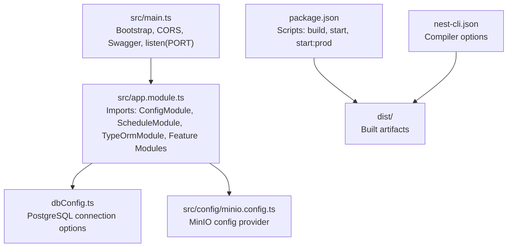
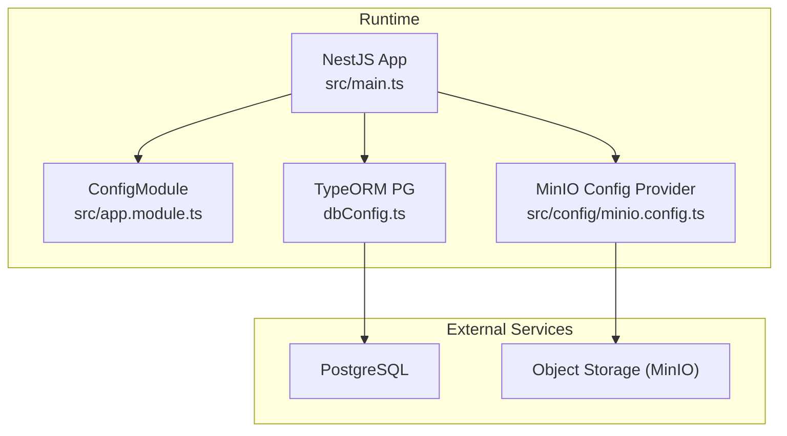
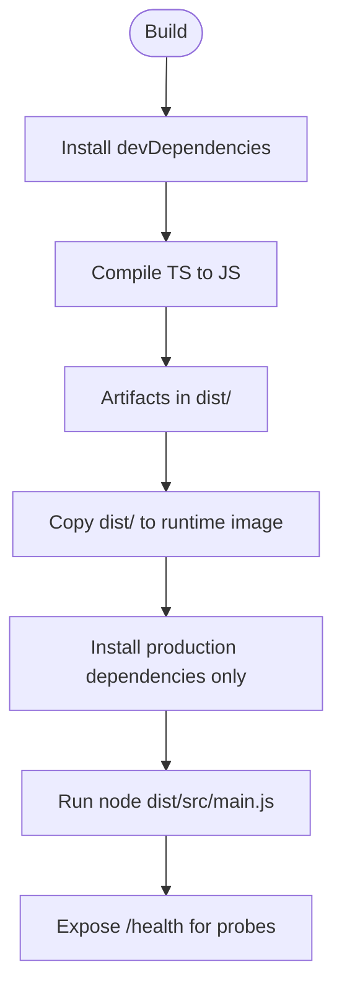
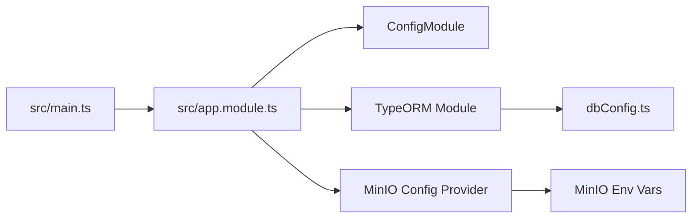

# Deployment Procedures

<cite>
**Referenced Files in This Document**
- [package.json](file://package.json)
- [src/main.ts](file://src/main.ts)
- [src/app.module.ts](file://src/app.module.ts)
- [dbConfig.ts](file://dbConfig.ts)
- [src/config/minio.config.ts](file://src/config/minio.config.ts)
- [init.sh](file://init.sh)
- [nest-cli.json](file://nest-cli.json)
</cite>

## Table of Contents
1. [Introduction](#introduction)
2. [Project Structure](#project-structure)
3. [Core Components](#core-components)
4. [Architecture Overview](#architecture-overview)
5. [Detailed Component Analysis](#detailed-component-analysis)
6. [Dependency Analysis](#dependency-analysis)
7. [Performance Considerations](#performance-considerations)
8. [Troubleshooting Guide](#troubleshooting-guide)
9. [Conclusion](#conclusion)
10. [Appendices](#appendices)

## Introduction
This document provides comprehensive deployment procedures for the Gym Management System backend. It covers containerization with Docker, cloud platform deployments (AWS, Azure, Google Cloud, Heroku), CI/CD pipeline setup, environment configuration and secrets management, configuration drift prevention, rollback and blue-green strategies, zero-downtime techniques, load balancing and auto-scaling, infrastructure provisioning, and monitoring with health checks.

## Project Structure
The backend is a NestJS application with modular feature domains, centralized configuration, and externalized persistence and object storage. Key deployment-relevant elements:
- Application entry and runtime configuration
- Centralized configuration module and environment-driven settings
- Database configuration with environment variables
- Object storage configuration via a dedicated configuration provider
- Build and CLI configuration for production bundling

**Diagram sources**
- [src/main.ts:6-68](file://src/main.ts#L6-L68)
- [src/app.module.ts:66-133](file://src/app.module.ts#L66-L133)
- [dbConfig.ts:3-11](file://dbConfig.ts#L3-L11)
- [src/config/minio.config.ts:20-36](file://src/config/minio.config.ts#L20-L36)
- [package.json:8-21](file://package.json#L8-L21)
- [nest-cli.json:5-8](file://nest-cli.json#L5-L8)

**Section sources**
- [src/main.ts:6-68](file://src/main.ts#L6-L68)
- [src/app.module.ts:66-133](file://src/app.module.ts#L66-L133)
- [dbConfig.ts:3-11](file://dbConfig.ts#L3-L11)
- [src/config/minio.config.ts:20-36](file://src/config/minio.config.ts#L20-L36)
- [package.json:8-21](file://package.json#L8-L21)
- [nest-cli.json:5-8](file://nest-cli.json#L5-L8)

## Core Components
- Application bootstrap and runtime configuration
  - CORS origins from environment variables
  - Global validation pipe
  - OpenAPI/Swagger documentation
  - Port selection from environment variable
- Centralized configuration
  - ConfigModule loads environment variables and registers MinIO configuration
  - MinIO configuration supports endpoint, credentials, bucket, SSL, and upload limits
- Database connectivity
  - TypeORM PostgreSQL configuration with URL from environment variables
  - Synchronize behavior controlled by NODE_ENV
- Feature modules
  - Modular imports enable clean separation of concerns and facilitate testing and deployment isolation

**Section sources**
- [src/main.ts:6-68](file://src/main.ts#L6-L68)
- [src/app.module.ts:66-133](file://src/app.module.ts#L66-L133)
- [dbConfig.ts:3-11](file://dbConfig.ts#L3-L11)
- [src/config/minio.config.ts:20-36](file://src/config/minio.config.ts#L20-L36)

## Architecture Overview
The runtime architecture centers on a single binary serving HTTP requests, connecting to PostgreSQL for persistence and MinIO for object storage. Configuration is environment-driven, enabling seamless deployment across platforms.

**Diagram sources**
- [src/main.ts:6-68](file://src/main.ts#L6-L68)
- [src/app.module.ts:66-133](file://src/app.module.ts#L66-L133)
- [dbConfig.ts:3-11](file://dbConfig.ts#L3-L11)
- [src/config/minio.config.ts:20-36](file://src/config/minio.config.ts#L20-L36)

## Detailed Component Analysis

### Containerization with Docker
- Build artifacts
  - Production build via Nest CLI and TypeScript compiler
  - Distribution artifact placed under dist/ for execution
- Runtime execution
  - Production start uses the compiled main entry
  - Port configurable via environment variable
- Multi-stage build strategy
  - Stage 1: Install dependencies and build
  - Stage 2: Copy minimal runtime artifacts and install only production dependencies
  - Final stage: Non-root user, working directory, and health check endpoint
- Environment injection
  - Pass secrets and configuration via environment variables at container runtime
- Health checks
  - Use the existing /health endpoint for liveness/readiness probes

**Diagram sources**
- [package.json:8-21](file://package.json#L8-L21)
- [src/main.ts:67-68](file://src/main.ts#L67-L68)

**Section sources**
- [package.json:8-21](file://package.json#L8-L21)
- [src/main.ts:67-68](file://src/main.ts#L67-L68)

### Cloud Platform Deployment Strategies
- AWS
  - ECS with Fargate: Define task definition with environment variables for database URL, JWT secret, MinIO, and port. Use service autoscaling based on CPU or ALB target group metrics.
  - EKS: Deploy Helm chart or Kustomize manifests; configure ConfigMap for environment and Secret for sensitive values; expose ALB ingress.
  - RDS: Use managed PostgreSQL; connect via DATABASE_URL; enable automated backups and read replicas.
  - S3/MinIO: Store media; configure CORS and IAM policies; mount via environment variables.
- Azure
  - Container Instances or AKS: Use Azure Container Registry; manage environment via Azure Key Vault; integrate with Application Gateway for HTTPS and WAF.
  - Azure Database for PostgreSQL: Configure firewall rules and connection strings; enable geo-redundancy.
  - Blob Storage/MinIO: Use Azure Storage or self-managed MinIO; secure with SAS tokens or IAM.
- Google Cloud
  - GKE: Deploy via Terraform/Helm; use Secret Manager for secrets; configure Network Load Balancer or Cloud Run for serverless.
  - Cloud SQL: Managed PostgreSQL; configure private IP and authorized networks; enable point-in-time recovery.
  - Cloud Storage/MinIO: Use Cloud Storage or self-managed MinIO; apply IAM policies.
- Heroku
  - Container stack: Build Docker image and push to Heroku Container Registry; set config vars for environment; scale dynos horizontally.
  - One-click PostgreSQL add-on: Use DATABASE_URL; configure maintenance windows.

[No sources needed since this section provides platform-agnostic guidance]

### CI/CD Pipeline Setup
- GitHub Actions
  - Jobs: lint, test, build, scan, publish, deploy
  - Secrets: store JWT_SECRET, DATABASE_URL, MinIO credentials, cloud provider credentials
  - Matrix builds: test across Node versions
  - Deployment: use cloud provider actions or custom scripts to deploy images
- GitLab CI
  - Stages: prepare, test, build, release, deploy
  - Auto DevOps: leverage built-in stages; override with custom scripts
  - Variables: masked variables for secrets; protected variables for production
- Jenkins
  - Declarative pipeline with stages for build, test, publish, deploy
  - Credentials binding for secrets
  - Kubernetes deployment plugin for rolling updates

[No sources needed since this section provides general CI/CD guidance]

### Environment-Specific Configuration and Secrets Management
- Environment variables
  - Database: DATABASE_URL or POSTGRES_URL
  - JWT: JWT_SECRET, JWT_EXPIRES_IN
  - Server: PORT, NODE_ENV, CORS_ORIGINS
  - Twilio: TWILIO_ACCOUNT_SID, TWILIO_AUTH_TOKEN, TWILIO_VERIFY_SERVICE_SID
  - SMTP: SMTP_HOST, SMTP_PORT, SMTP_USER, SMTP_PASS, SMTP_FROM
  - MinIO: MINIO_ENDPOINT, MINIO_ACCESS_KEY, MINIO_SECRET_KEY, MINIO_BUCKET, MINIO_PUBLIC_URL, MINIO_USE_SSL, MAX_FILE_SIZE
- Secrets handling
  - Store secrets in platform-specific secret managers (Azure Key Vault, AWS Secrets Manager, GCP Secret Manager, HashiCorp Vault)
  - Inject at runtime via environment variables or mounted secret volumes
- Configuration drift prevention
  - Version-controlled configuration templates
  - Infrastructure-as-Code (Terraform) for environment provisioning
  - Parameter stores for dynamic configuration updates

**Section sources**
- [dbConfig.ts:3-11](file://dbConfig.ts#L3-L11)
- [src/main.ts:8-19](file://src/main.ts#L8-L19)
- [src/config/minio.config.ts:20-36](file://src/config/minio.config.ts#L20-L36)
- [init.sh:162-186](file://init.sh#L162-L186)

### Deployment Rollback, Blue-Green, and Zero-Downtime
- Rollback
  - Maintain immutable container images with semantic version tags
  - Use platform-native rollback to previous revision or tag
- Blue-Green
  - Run two identical environments behind a load balancer
  - Switch traffic after health checks pass on the new version
- Zero-downtime
  - Rolling updates with pod disruption budgets
  - Readiness probes delay traffic until /health responds
  - Horizontal scaling to maintain capacity during updates

[No sources needed since this section provides general deployment strategies]

### Load Balancing, Auto-Scaling, and Infrastructure Provisioning
- Load balancing
  - Application Load Balancer (ALB) or Network Load Balancer (NLB) for TCP/HTTP
  - Sticky sessions optional; stateless design favors session affinity disabled
- Auto-scaling
  - Target tracking: CPU utilization, request count, latency
  - Step scaling: thresholds for queue depth or error rates
- Infrastructure provisioning
  - Terraform modules for compute, networking, databases, and storage
  - CloudFormation (AWS), ARM Templates (Azure), Deployment Manager (GCP)

[No sources needed since this section provides general guidance]

### Monitoring and Health Checks
- Health endpoint
  - Use the existing /health endpoint for liveness and readiness probes
- Observability
  - Logs: structured JSON; centralize with CloudWatch, Azure Monitor, GCP Logging
  - Metrics: application metrics via Prometheus exporter; platform metrics (CPU, memory, network)
  - Tracing: OpenTelemetry with Jaeger or Zipkin
- Alerting
  - Threshold-based alerts for error rates, latency, and resource saturation
  - Notification channels: email, Slack, PagerDuty

**Section sources**
- [init.sh:249-257](file://init.sh#L249-L257)

## Dependency Analysis
The application depends on configuration-driven services for database and object storage. Understanding these dependencies is essential for deployment.

**Diagram sources**
- [src/main.ts:6-68](file://src/main.ts#L6-L68)
- [src/app.module.ts:66-133](file://src/app.module.ts#L66-L133)
- [dbConfig.ts:3-11](file://dbConfig.ts#L3-L11)
- [src/config/minio.config.ts:20-36](file://src/config/minio.config.ts#L20-L36)

**Section sources**
- [src/main.ts:6-68](file://src/main.ts#L6-L68)
- [src/app.module.ts:66-133](file://src/app.module.ts#L66-L133)
- [dbConfig.ts:3-11](file://dbConfig.ts#L3-L11)
- [src/config/minio.config.ts:20-36](file://src/config/minio.config.ts#L20-L36)

## Performance Considerations
- Optimize database connections with connection pooling
- Enable compression (gzip) for API responses
- Use CDN for static assets and MinIO-hosted media
- Tune JVM/GC settings if applicable (for containerized Node runtime)
- Monitor and scale based on request latency and error rates

[No sources needed since this section provides general guidance]

## Troubleshooting Guide
- Startup failures
  - Verify JWT_SECRET length and presence
  - Confirm DATABASE_URL connectivity and credentials
  - Check MinIO endpoint reachability and bucket permissions
- Health check failures
  - Ensure /health endpoint is reachable and returns 200
  - Review readiness probe configuration
- CORS errors
  - Validate CORS_ORIGINS format and trailing commas
- Database synchronization
  - Development mode auto-sync enabled; disable in production
- Logging
  - Inspect application logs and platform logs for stack traces

**Section sources**
- [init.sh:121-146](file://init.sh#L121-L146)
- [dbConfig.ts:9](file://dbConfig.ts#L9)
- [src/config/minio.config.ts:20-36](file://src/config/minio.config.ts#L20-L36)
- [init.sh:249-257](file://init.sh#L249-L257)

## Conclusion
Deploying the Gym Management System requires environment-driven configuration, robust secrets management, and platform-optimized orchestration. By leveraging Docker multi-stage builds, CI/CD automation, and proven deployment strategies (rollbacks, blue-green, zero-downtime), teams can achieve reliable, scalable, and observable operations across AWS, Azure, Google Cloud, and Heroku.

## Appendices
- Development environment initialization script demonstrates environment setup, dependency installation, database preparation, and server startup with health checks.

**Section sources**
- [init.sh:50-77](file://init.sh#L50-L77)
- [init.sh:79-97](file://init.sh#L79-L97)
- [init.sh:99-119](file://init.sh#L99-L119)
- [init.sh:148-196](file://init.sh#L148-L196)
- [init.sh:198-218](file://init.sh#L198-L218)
- [init.sh:220-273](file://init.sh#L220-L273)
- [init.sh:275-295](file://init.sh#L275-L295)