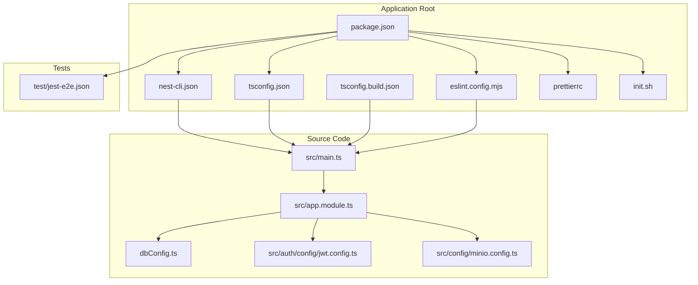
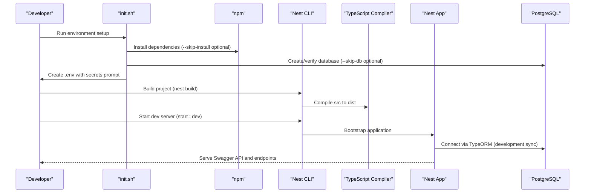
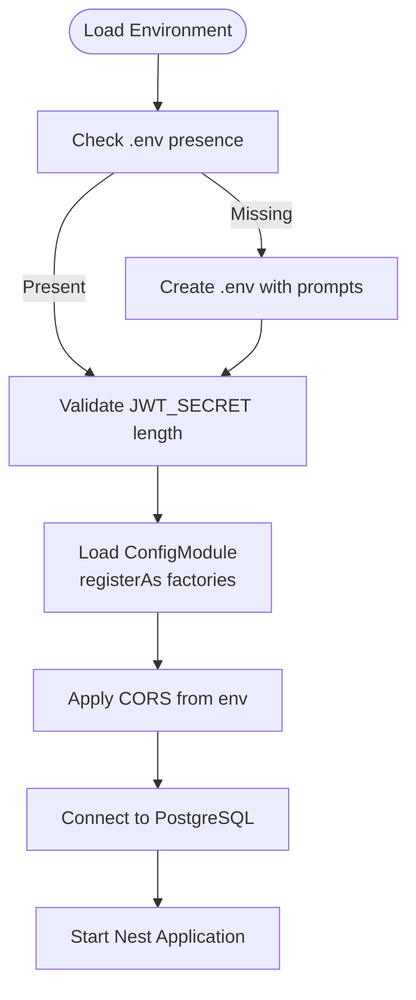
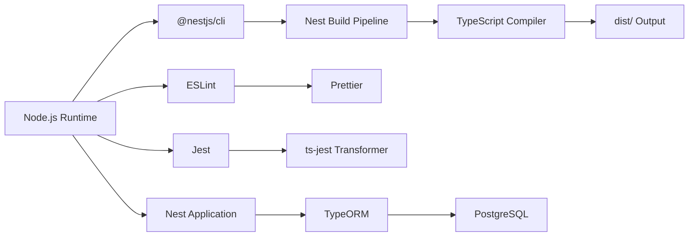

# Environment Setup & Configuration

<cite>
**Referenced Files in This Document**
- [package.json](file://package.json)
- [nest-cli.json](file://nest-cli.json)
- [tsconfig.json](file://tsconfig.json)
- [tsconfig.build.json](file://tsconfig.build.json)
- [eslint.config.mjs](file://eslint.config.mjs)
- [.prettierrc](file://.prettierrc)
- [init.sh](file://init.sh)
- [dbConfig.ts](file://dbConfig.ts)
- [src/auth/config/jwt.config.ts](file://src/auth/config/jwt.config.ts)
- [src/config/minio.config.ts](file://src/config/minio.config.ts)
- [src/main.ts](file://src/main.ts)
- [src/app.module.ts](file://src/app.module.ts)
- [test/jest-e2e.json](file://test/jest-e2e.json)
</cite>

## Table of Contents
1. [Introduction](#introduction)
2. [Project Structure](#project-structure)
3. [Core Components](#core-components)
4. [Architecture Overview](#architecture-overview)
5. [Detailed Component Analysis](#detailed-component-analysis)
6. [Dependency Analysis](#dependency-analysis)
7. [Performance Considerations](#performance-considerations)
8. [Troubleshooting Guide](#troubleshooting-guide)
9. [Conclusion](#conclusion)
10. [Appendices](#appendices)

## Introduction
This document provides a comprehensive guide to setting up and configuring the development environment for the NestJS Gym Management System. It covers prerequisites, Node.js and NestJS CLI requirements, dependency management, TypeScript configuration, build optimization, code quality tools (ESLint and Prettier), environment variables and configuration patterns, secrets management, development workflow, IDE recommendations, debugging configuration, OS-specific installation steps, and troubleshooting for common environment setup issues.

## Project Structure
The project follows a standard NestJS monorepo-like layout with a clear separation of concerns:
- Application entry point and configuration live under src/.
- Feature modules are organized by domain (e.g., auth, users, gyms, members).
- Shared configuration is centralized in configuration files and environment variables.
- Build and linting configurations are defined in top-level configuration files.

**Diagram sources**
- [package.json:1-95](file://package.json#L1-L95)
- [nest-cli.json:1-10](file://nest-cli.json#L1-L10)
- [tsconfig.json:1-21](file://tsconfig.json#L1-L21)
- [tsconfig.build.json:1-5](file://tsconfig.build.json#L1-L5)
- [eslint.config.mjs:1-34](file://eslint.config.mjs#L1-L34)
- [.prettierrc:1-4](file://.prettierrc#L1-L4)
- [init.sh:1-347](file://init.sh#L1-L347)
- [src/main.ts:1-70](file://src/main.ts#L1-L70)
- [src/app.module.ts:1-138](file://src/app.module.ts#L1-L138)
- [dbConfig.ts:1-12](file://dbConfig.ts#L1-L12)
- [src/auth/config/jwt.config.ts:1-13](file://src/auth/config/jwt.config.ts#L1-L13)
- [src/config/minio.config.ts:1-37](file://src/config/minio.config.ts#L1-L37)
- [test/jest-e2e.json:1-10](file://test/jest-e2e.json#L1-L10)

**Section sources**
- [package.json:1-95](file://package.json#L1-L95)
- [nest-cli.json:1-10](file://nest-cli.json#L1-L10)
- [tsconfig.json:1-21](file://tsconfig.json#L1-L21)
- [tsconfig.build.json:1-5](file://tsconfig.build.json#L1-L5)
- [eslint.config.mjs:1-34](file://eslint.config.mjs#L1-L34)
- [.prettierrc:1-4](file://.prettierrc#L1-L4)
- [init.sh:1-347](file://init.sh#L1-L347)
- [src/main.ts:1-70](file://src/main.ts#L1-L70)
- [src/app.module.ts:1-138](file://src/app.module.ts#L1-L138)
- [dbConfig.ts:1-12](file://dbConfig.ts#L1-L12)
- [src/auth/config/jwt.config.ts:1-13](file://src/auth/config/jwt.config.ts#L1-L13)
- [src/config/minio.config.ts:1-37](file://src/config/minio.config.ts#L1-L37)
- [test/jest-e2e.json:1-10](file://test/jest-e2e.json#L1-L10)

## Core Components
This section outlines the essential environment components and their configuration:

- Node.js and npm: Required for installing dependencies and running scripts. The project uses modern Node.js LTS versions compatible with the NestJS ecosystem.
- NestJS CLI: Installed as a dev dependency to manage compilation, scaffolding, and plugin generation.
- TypeScript: Configured for ES2023 target with decorators, metadata emission, and strict null checks. Incremental builds and source maps are enabled for performance and debugging.
- Build pipeline: Nest build compiles TypeScript sources to dist with deleteOutDir enabled to keep the output clean.
- Code quality: ESLint with TypeScript ESLint and Prettier recommended rules enforces consistent formatting and safe practices.
- Testing: Jest configured for unit and E2E testing with ts-jest transformer and coverage reporting.
- Database: PostgreSQL connection managed via TypeORM with development auto-sync enabled.
- Secrets and configuration: JWT secret, CORS origins, SMTP/Twilio settings, and MinIO configuration loaded from environment variables.

**Section sources**
- [package.json:8-21](file://package.json#L8-L21)
- [package.json:48-76](file://package.json#L48-L76)
- [nest-cli.json:5-8](file://nest-cli.json#L5-L8)
- [tsconfig.json:2-19](file://tsconfig.json#L2-L19)
- [tsconfig.build.json:1-5](file://tsconfig.build.json#L1-L5)
- [eslint.config.mjs:7-34](file://eslint.config.mjs#L7-L34)
- [.prettierrc:1-4](file://.prettierrc#L1-L4)
- [dbConfig.ts:3-11](file://dbConfig.ts#L3-L11)
- [src/main.ts:67-68](file://src/main.ts#L67-L68)
- [src/app.module.ts:68-72](file://src/app.module.ts#L68-L72)

## Architecture Overview
The environment setup orchestrates the following runtime and build-time flows:

**Diagram sources**
- [init.sh:50-119](file://init.sh#L50-L119)
- [init.sh:148-196](file://init.sh#L148-L196)
- [package.json:9-14](file://package.json#L9-L14)
- [nest-cli.json:1-9](file://nest-cli.json#L1-L9)
- [tsconfig.json:1-21](file://tsconfig.json#L1-L21)
- [src/main.ts:6-68](file://src/main.ts#L6-L68)
- [dbConfig.ts:3-11](file://dbConfig.ts#L3-L11)

## Detailed Component Analysis

### Node.js and NestJS CLI Setup
- Install Node.js LTS and npm. Confirm versions before proceeding.
- The project installs NestJS CLI as a dev dependency. Use the CLI via npm scripts for building and watching.
- Scripts include build, start, start:dev, start:debug, start:prod, lint, test, test:watch, test:cov, test:debug, and test:e2e.

**Section sources**
- [package.json:8-21](file://package.json#L8-L21)
- [package.json:52](file://package.json#L52)

### Dependency Management
- Production dependencies include NestJS core modules, TypeORM, PostgreSQL driver, JWT, Passport, Swagger, scheduling, and supporting libraries.
- Development dependencies include NestJS CLI, schematics, Jest, TypeScript, ESLint, Prettier, SWC, and related tooling.
- Jest configuration defines module resolution, ts-jest transformer, coverage collection, and test environment.

**Section sources**
- [package.json:22-47](file://package.json#L22-L47)
- [package.json:48-76](file://package.json#L48-L76)
- [package.json:77-93](file://package.json#L77-L93)

### TypeScript Configuration
- Target: ES2023 for modern JavaScript features.
- Decorators and metadata emission are enabled for NestJS and TypeORM.
- Strictness: strictNullChecks enabled; noImplicitAny disabled; strictBindCallApply disabled.
- Source maps and incremental builds improve DX and build performance.
- OutDir set to dist; deleteOutDir enabled via Nest CLI to keep output clean.

**Section sources**
- [tsconfig.json:2-19](file://tsconfig.json#L2-L19)
- [tsconfig.build.json:1-5](file://tsconfig.build.json#L1-L5)
- [nest-cli.json:5-8](file://nest-cli.json#L5-L8)

### Build Optimization
- Nest build compiles TypeScript to dist with deleteOutDir enabled.
- SWC loaders present in devDependencies indicate potential for faster transpilation; ensure compatibility with current toolchain.
- Incremental builds and source maps balance speed and debugging.

**Section sources**
- [package.json:9](file://package.json#L9)
- [nest-cli.json:5-8](file://nest-cli.json#L5-L8)
- [tsconfig.json:10](file://tsconfig.json#L10)
- [tsconfig.json:12](file://tsconfig.json#L12)

### ESLint and Prettier Configuration
- ESLint uses TypeScript ESLint recommended type-checked configs and Prettier recommended rules.
- Global environments include Node and Jest.
- Parser options enable project service with tsconfigRootDir for accurate type checking.
- Rules include disabling explicit any, warning on floating promises, and unsafe arguments.

**Section sources**
- [eslint.config.mjs:1-34](file://eslint.config.mjs#L1-L34)
- [.prettierrc:1-4](file://.prettierrc#L1-L4)

### Environment Variables and Configuration Patterns
- Database: DATABASE_URL or POSTGRES_URL; development mode enables schema synchronization.
- JWT: Secret and expiration loaded from environment variables.
- CORS: Origins configurable via comma-separated environment variable; defaults to localhost domains.
- SMTP: Host, port, user, pass, and sender address for email notifications.
- Twilio: Account SID, auth token, and verify service SID for OTP.
- MinIO: Endpoint, access/secret keys, bucket, public URL, SSL toggle, and upload limits.
- ConfigModule.forRoot loads environment files and registers configuration factories.

**Diagram sources**
- [init.sh:148-196](file://init.sh#L148-L196)
- [init.sh:121-146](file://init.sh#L121-L146)
- [src/app.module.ts:68-72](file://src/app.module.ts#L68-L72)
- [src/main.ts:8-19](file://src/main.ts#L8-L19)
- [dbConfig.ts:3-11](file://dbConfig.ts#L3-L11)
- [src/auth/config/jwt.config.ts:4-12](file://src/auth/config/jwt.config.ts#L4-L12)
- [src/config/minio.config.ts:20-36](file://src/config/minio.config.ts#L20-L36)

**Section sources**
- [dbConfig.ts:3-11](file://dbConfig.ts#L3-L11)
- [src/auth/config/jwt.config.ts:4-12](file://src/auth/config/jwt.config.ts#L4-L12)
- [src/config/minio.config.ts:20-36](file://src/config/minio.config.ts#L20-L36)
- [src/main.ts:8-19](file://src/main.ts#L8-L19)
- [src/app.module.ts:68-72](file://src/app.module.ts#L68-L72)

### Secrets Management
- JWT_SECRET must be set and at least 32 characters long. The setup script validates this and provides generation guidance.
- Store secrets in .env during development; avoid committing secrets to version control.
- For production, externalize secrets via environment variables or secret managers.

**Section sources**
- [init.sh:121-146](file://init.sh#L121-L146)
- [src/auth/config/jwt.config.ts:7](file://src/auth/config/jwt.config.ts#L7)

### Development Workflow and IDE Recommendations
- Recommended IDE: VS Code with extensions for TypeScript, ESLint, Prettier, and Jest.
- Debugging: Use start:debug script for Nest development with watch mode. For Jest debugging, use test:debug to enable inspector and single-threaded execution.
- Formatting: Run npm run format to apply Prettier across source files.
- Linting: Run npm run lint to fix issues automatically where possible.

**Section sources**
- [package.json:10-20](file://package.json#L10-L20)
- [eslint.config.mjs:28-32](file://eslint.config.mjs#L28-L32)
- [.prettierrc:1-4](file://.prettierrc#L1-L4)

### Testing Configuration
- Unit tests: Jest with ts-jest transformer and coverage collection.
- E2E tests: Separate Jest configuration targeting .e2e-spec.ts files.
- Test scripts support watch mode and coverage reporting.

**Section sources**
- [package.json:77-93](file://package.json#L77-L93)
- [test/jest-e2e.json:1-10](file://test/jest-e2e.json#L1-L10)

## Dependency Analysis
This section maps the primary environment dependencies and their roles:

**Diagram sources**
- [package.json:22-47](file://package.json#L22-L47)
- [package.json:48-76](file://package.json#L48-L76)
- [tsconfig.json:1-21](file://tsconfig.json#L1-L21)
- [nest-cli.json:1-9](file://nest-cli.json#L1-L9)
- [src/main.ts:6-68](file://src/main.ts#L6-L68)
- [dbConfig.ts:3-11](file://dbConfig.ts#L3-L11)

**Section sources**
- [package.json:22-47](file://package.json#L22-L47)
- [package.json:48-76](file://package.json#L48-L76)
- [tsconfig.json:1-21](file://tsconfig.json#L1-L21)
- [nest-cli.json:1-9](file://nest-cli.json#L1-L9)
- [src/main.ts:6-68](file://src/main.ts#L6-L68)
- [dbConfig.ts:3-11](file://dbConfig.ts#L3-L11)

## Performance Considerations
- Enable incremental builds in TypeScript to reduce rebuild times during development.
- Keep source maps enabled for debugging but disable in production builds if not needed.
- Use Nest build with deleteOutDir to prevent stale artifacts accumulation.
- Prefer SWC-based transpilation if performance becomes a bottleneck; verify compatibility with current toolchain.

[No sources needed since this section provides general guidance]

## Troubleshooting Guide
Common environment setup issues and resolutions:

- Node.js or npm not found:
  - Ensure Node.js LTS is installed and available in PATH.
  - Reinstall if versions are outdated or missing.

- PostgreSQL client not found:
  - Install PostgreSQL client (psql) and ensure it is in PATH.
  - The setup script checks for psql and exits if missing.

- Database creation errors:
  - Verify PostgreSQL is running locally.
  - Ensure user privileges allow database creation or adjust user permissions.

- JWT_SECRET not set or too short:
  - Generate a secure secret (minimum 32 characters) and export it or add to .env.
  - The setup script validates JWT_SECRET length and provides generation guidance.

- Port conflicts:
  - Change PORT environment variable if 3000 is in use.
  - The application listens on the configured port.

- CORS issues:
  - Set CORS_ORIGINS to include frontend URLs.
  - Defaults to localhost domains if unspecified.

- MinIO configuration:
  - Ensure MINIO_* environment variables match your MinIO deployment.
  - Adjust MAX_FILE_SIZE and bucket policies accordingly.

- ESLint/Prettier errors:
  - Run npm run lint to auto-fix issues where possible.
  - Apply formatting with npm run format.

- Jest test failures:
  - Review test output and fix failing assertions.
  - Use test:debug for interactive debugging.

**Section sources**
- [init.sh:50-77](file://init.sh#L50-L77)
- [init.sh:99-119](file://init.sh#L99-L119)
- [init.sh:121-146](file://init.sh#L121-L146)
- [src/main.ts:8-19](file://src/main.ts#L8-L19)
- [src/config/minio.config.ts:20-36](file://src/config/minio.config.ts#L20-L36)
- [eslint.config.mjs:28-32](file://eslint.config.mjs#L28-L32)
- [package.json:15-20](file://package.json#L15-L20)

## Conclusion
The Gym Management System’s environment is configured for a modern NestJS development workflow with robust TypeScript tooling, ESLint/Prettier enforcement, and flexible configuration via environment variables. The init.sh script streamlines setup, ensuring dependencies, database, and environment are ready quickly. Following the guidelines in this document will help you establish a reliable development environment across operating systems and troubleshoot common issues efficiently.

[No sources needed since this section summarizes without analyzing specific files]

## Appendices

### Step-by-Step Installation Guides

- Linux/macOS:
  - Install Node.js LTS and npm.
  - Install PostgreSQL client (psql).
  - Clone repository and navigate to project directory.
  - Export JWT_SECRET securely (minimum 32 characters).
  - Run the initialization script with optional flags to skip install or database setup.
  - Start the development server using the provided script.

- Windows:
  - Install Node.js LTS and npm.
  - Install PostgreSQL client (psql) and add to PATH.
  - Clone repository and navigate to project directory.
  - Export JWT_SECRET securely.
  - Run the initialization script with optional flags.
  - Start the development server using the provided script.

Notes:
- The init.sh script supports --skip-install and --skip-db flags for advanced scenarios.
- Ensure the database user and host match your local PostgreSQL configuration.

**Section sources**
- [init.sh:10-14](file://init.sh#L10-L14)
- [init.sh:297-315](file://init.sh#L297-L315)
- [init.sh:318-347](file://init.sh#L318-L347)