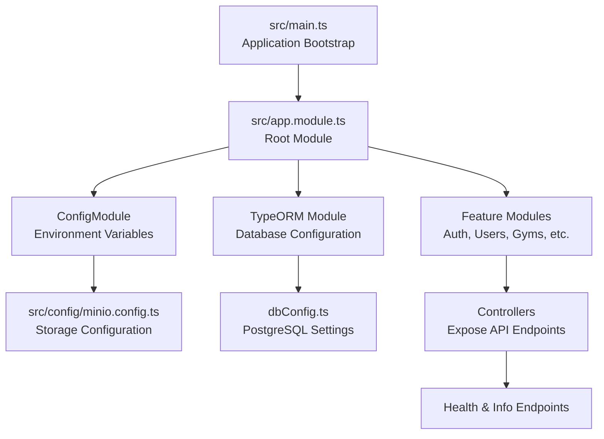
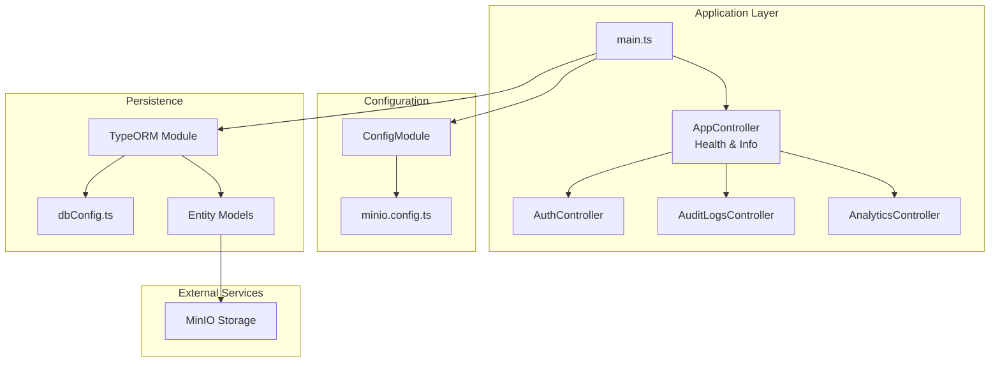
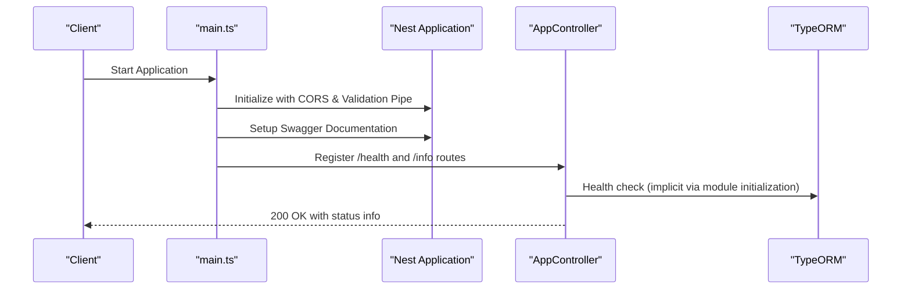
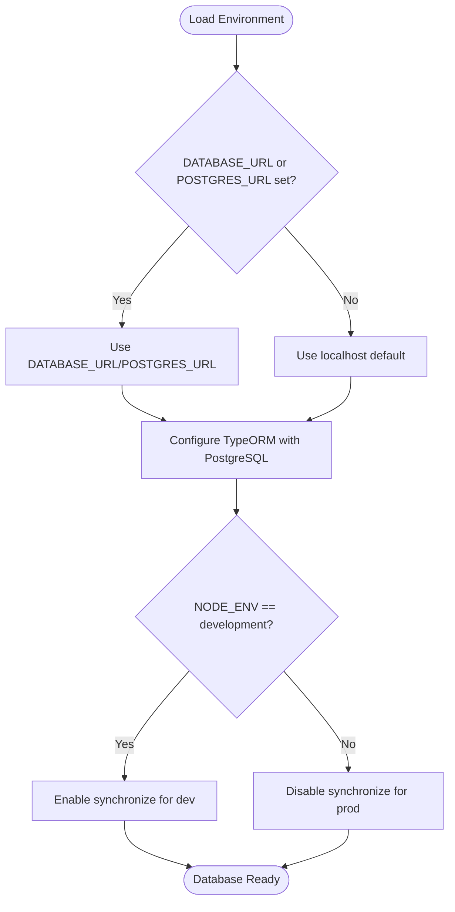
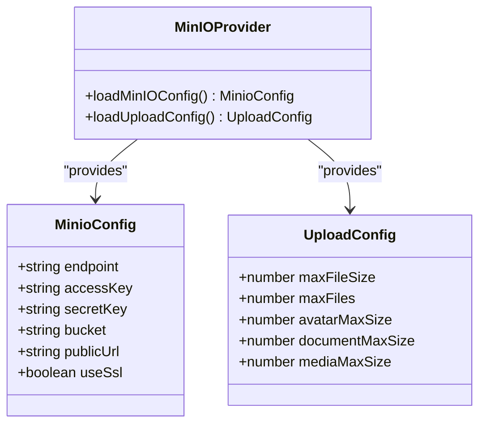
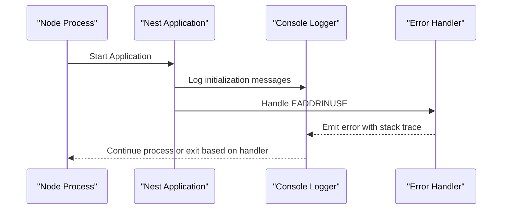
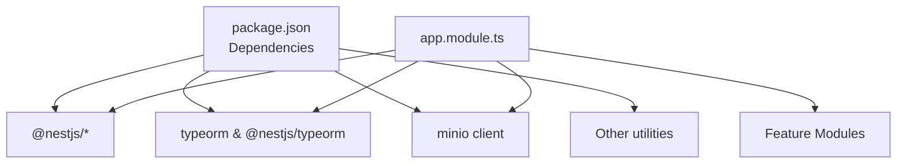

# Monitoring & Maintenance

<cite>
**Referenced Files in This Document**
- [main.ts](file://src/main.ts)
- [package.json](file://package.json)
- [dbConfig.ts](file://dbConfig.ts)
- [app.module.ts](file://src/app.module.ts)
- [minio.config.ts](file://src/config/minio.config.ts)
- [server.log](file://logs/server.log)
- [auth.controller.ts](file://src/auth/auth.controller.ts)
- [audit-logs.controller.ts](file://src/audit-logs/audit-logs.controller.ts)
- [analytics.controller.ts](file://src/analytics/analytics.controller.ts)
- [app.controller.ts](file://src/app.controller.ts)
- [reset-database.ts](file://scripts/reset-database.ts)
- [get-superadmin.ts](file://scripts/get-superadmin.ts)
</cite>

## Table of Contents
1. [Introduction](#introduction)
2. [Project Structure](#project-structure)
3. [Core Components](#core-components)
4. [Architecture Overview](#architecture-overview)
5. [Detailed Component Analysis](#detailed-component-analysis)
6. [Dependency Analysis](#dependency-analysis)
7. [Performance Considerations](#performance-considerations)
8. [Troubleshooting Guide](#troubleshooting-guide)
9. [Maintenance Procedures](#maintenance-procedures)
10. [Capacity Planning Guidelines](#capacity-planning-guidelines)
11. [Incident Response Procedures](#incident-response-procedures)
12. [System Updates and Patch Management](#system-updates-and-patch-management)
13. [Conclusion](#conclusion)

## Introduction
This document provides comprehensive monitoring and maintenance guidance for the Gym Management System backend. It covers application performance monitoring, logging configuration, alerting mechanisms, database monitoring, connection pool monitoring, storage utilization tracking, system health checks, uptime monitoring, failure detection strategies, maintenance procedures, capacity planning, performance bottleneck identification, incident response, and system update processes. The content is derived from the existing codebase and focuses on practical operational procedures.

## Project Structure
The backend follows a modular NestJS architecture with feature-based modules, centralized configuration, and shared utilities. Key areas relevant to monitoring and maintenance include:
- Application bootstrap and middleware configuration
- Database configuration and TypeORM integration
- Configuration management for external services (MinIO)
- Logging output and error handling
- Health and informational endpoints

**Diagram sources**
- [main.ts:1-70](file://src/main.ts#L1-L70)
- [app.module.ts:66-138](file://src/app.module.ts#L66-L138)
- [dbConfig.ts:1-12](file://dbConfig.ts#L1-L12)
- [minio.config.ts:1-37](file://src/config/minio.config.ts#L1-L37)

**Section sources**
- [main.ts:1-70](file://src/main.ts#L1-L70)
- [app.module.ts:66-138](file://src/app.module.ts#L66-L138)
- [dbConfig.ts:1-12](file://dbConfig.ts#L1-L12)
- [minio.config.ts:1-37](file://src/config/minio.config.ts#L1-L37)

## Core Components
- Application Bootstrap: Initializes CORS, global validation pipe, Swagger documentation, and starts the server on the configured port.
- Configuration Management: Centralized environment variable loading via ConfigModule and service-specific configuration (e.g., MinIO).
- Database Layer: TypeORM integration with PostgreSQL configuration supporting development and production environments.
- Feature Modules: Modular controllers exposing endpoints for health, info, authentication, analytics, audit logs, and more.
- Logging: Console-based logging output visible in server.log with structured timestamps and severity indicators.

**Section sources**
- [main.ts:6-68](file://src/main.ts#L6-L68)
- [app.module.ts:66-138](file://src/app.module.ts#L66-L138)
- [dbConfig.ts:3-11](file://dbConfig.ts#L3-L11)
- [minio.config.ts:20-36](file://src/config/minio.config.ts#L20-L36)
- [server.log:11-356](file://logs/server.log#L11-L356)

## Architecture Overview
The system architecture integrates NestJS with external services and databases. The application exposes REST endpoints, manages database connections through TypeORM, and integrates with MinIO for object storage. Health and informational endpoints support operational monitoring.

**Diagram sources**
- [main.ts:1-70](file://src/main.ts#L1-L70)
- [app.module.ts:66-138](file://src/app.module.ts#L66-L138)
- [dbConfig.ts:1-12](file://dbConfig.ts#L1-L12)
- [minio.config.ts:1-37](file://src/config/minio.config.ts#L1-L37)
- [app.controller.ts:1-200](file://src/app.controller.ts#L1-L200)

## Detailed Component Analysis

### Application Bootstrap and Health Endpoints
- CORS configuration supports dynamic origins and credentials.
- Global validation pipe enforces request sanitization and transformation.
- Swagger documentation is generated with bearer authentication support.
- Health and info endpoints are mapped during bootstrap.

**Diagram sources**
- [main.ts:6-68](file://src/main.ts#L6-L68)
- [app.controller.ts:1-200](file://src/app.controller.ts#L1-L200)

**Section sources**
- [main.ts:6-68](file://src/main.ts#L6-L68)
- [app.controller.ts:1-200](file://src/app.controller.ts#L1-L200)

### Database Configuration and Monitoring
- PostgreSQL connection is configured via environment variables or defaults.
- TypeORM module is initialized with entity discovery and synchronization settings per environment.
- Connection pool monitoring is not explicitly configured; consider adding pool statistics and timeouts.

**Diagram sources**
- [dbConfig.ts:3-11](file://dbConfig.ts#L3-L11)
- [app.module.ts:74](file://src/app.module.ts#L74)

**Section sources**
- [dbConfig.ts:3-11](file://dbConfig.ts#L3-L11)
- [app.module.ts:74](file://src/app.module.ts#L74)

### Storage Configuration (MinIO)
- MinIO configuration is loaded via ConfigModule and exposed as a configuration object.
- Upload limits and sizes are configurable via environment variables.
- Public URL and SSL toggles support flexible deployment scenarios.

**Diagram sources**
- [minio.config.ts:3-18](file://src/config/minio.config.ts#L3-L18)
- [minio.config.ts:20-36](file://src/config/minio.config.ts#L20-L36)

**Section sources**
- [minio.config.ts:20-36](file://src/config/minio.config.ts#L20-L36)

### Logging and Error Handling
- Console logging captures application lifecycle events, route mappings, and startup errors.
- A recent startup error indicates port binding conflicts, demonstrating runtime error visibility.
- Structured log entries include timestamps, severity, and module information.

**Diagram sources**
- [server.log:11-356](file://logs/server.log#L11-L356)

**Section sources**
- [server.log:11-356](file://logs/server.log#L11-L356)

## Dependency Analysis
The application depends on NestJS core modules, TypeORM for persistence, and external services like MinIO. Dependencies are declared in package.json and loaded via the root module.

**Diagram sources**
- [package.json:22-46](file://package.json#L22-L46)
- [app.module.ts:66-138](file://src/app.module.ts#L66-L138)

**Section sources**
- [package.json:22-46](file://package.json#L22-L46)
- [app.module.ts:66-138](file://src/app.module.ts#L66-L138)

## Performance Considerations
- Connection Pool Tuning: Configure TypeORM connection pool settings (max connections, idle timeouts) to match workload patterns.
- Query Optimization: Monitor slow queries and implement indexing strategies for frequently accessed entities.
- Caching Strategy: Introduce caching for read-heavy endpoints (e.g., analytics, member dashboards).
- Resource Limits: Set memory and CPU limits in container orchestration platforms.
- Database Indexes: Add composite indexes for common filter and join patterns.

[No sources needed since this section provides general guidance]

## Troubleshooting Guide
Common issues and resolutions:
- Port Binding Conflicts: The logs show an "address already in use" error on port 3000. Verify the port is free or adjust the PORT environment variable.
- Duplicate DTO Warnings: The logs indicate duplicate DTO definitions. Rename DTO classes uniquely or apply schema customization to avoid future breaking changes.
- CORS Misconfiguration: Ensure CORS origins match frontend deployment domains and credentials are enabled when required.

**Section sources**
- [server.log:357-377](file://logs/server.log#L357-L377)
- [server.log:81-83](file://logs/server.log#L81-L83)
- [server.log:454-456](file://logs/server.log#L454-L456)
- [main.ts:8-19](file://src/main.ts#L8-L19)

## Maintenance Procedures

### Log Rotation
- Implement log rotation using external tools (e.g., logrotate) to manage server.log growth.
- Configure retention policies (e.g., keep 7 days of logs, compress older logs).

### Database Cleanup
- Scheduled cleanup jobs can remove old audit logs, notification histories, and temporary records.
- Use NestJS scheduling module to run periodic cleanup tasks.

### Backup Verification
- Regularly verify database backups by restoring to a staging environment.
- Automate verification scripts and monitor completion status.

### Security Updates
- Pin dependency versions and monitor security advisories.
- Apply patches promptly and test in staging before production deployment.

**Section sources**
- [app.module.ts:73](file://src/app.module.ts#L73)
- [reset-database.ts:1-200](file://scripts/reset-database.ts#L1-L200)
- [get-superadmin.ts:1-200](file://scripts/get-superadmin.ts#L1-L200)

## Capacity Planning Guidelines
- Monitor CPU and memory usage trends to predict scaling needs.
- Track database query latency and connection counts to identify bottlenecks.
- Evaluate storage growth patterns for MinIO buckets and plan retention policies.
- Scale horizontally by adding application instances behind a load balancer.

[No sources needed since this section provides general guidance]

## Incident Response Procedures
- Immediate Actions: Check application logs for errors, verify database connectivity, and confirm external service availability.
- Escalation Criteria: Define thresholds for error rates, response times, and downtime to trigger escalation.
- Post-Incident Review: Document root causes, remediation steps, and preventive measures.

**Section sources**
- [server.log:11-356](file://logs/server.log#L11-L356)

## System Updates and Patch Management
- Version Upgrade Workflow:
  - Test upgrades in a staging environment.
  - Freeze writes during migration windows.
  - Perform rolling restarts to minimize downtime.
- Patch Management:
  - Apply security patches immediately.
  - Validate compatibility with database migrations and configuration changes.

**Section sources**
- [package.json:8-21](file://package.json#L8-L21)

## Conclusion
The Gym Management System provides a solid foundation for monitoring and maintenance through its modular architecture, centralized configuration, and built-in health endpoints. To enhance operational reliability, integrate dedicated monitoring tools, establish robust alerting policies, implement connection pool tuning, and formalize maintenance and incident response procedures. These steps will improve system stability, performance, and maintainability over time.