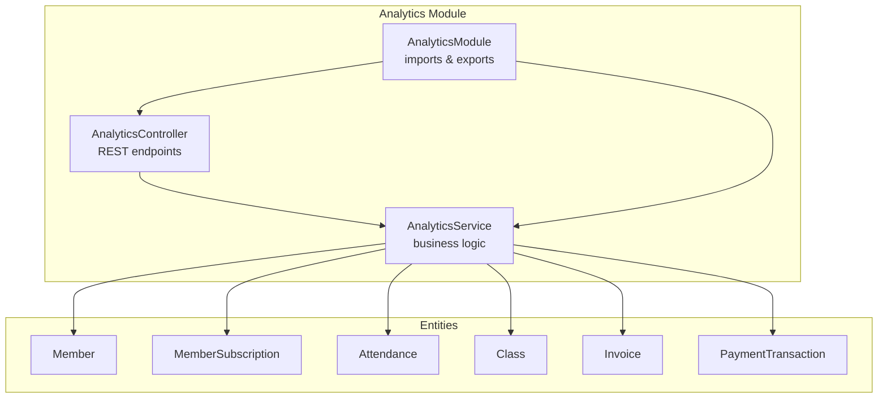
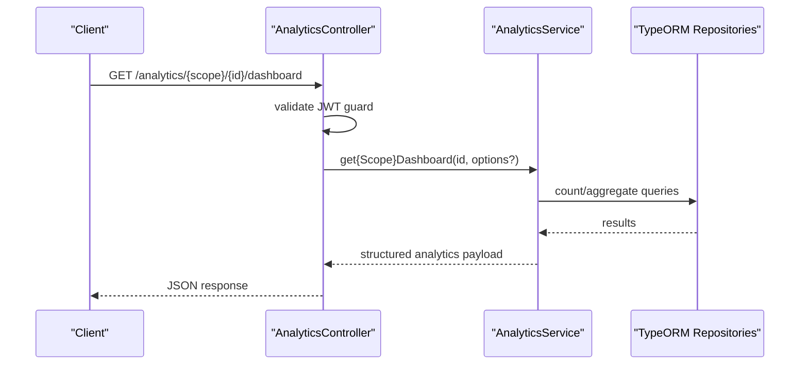
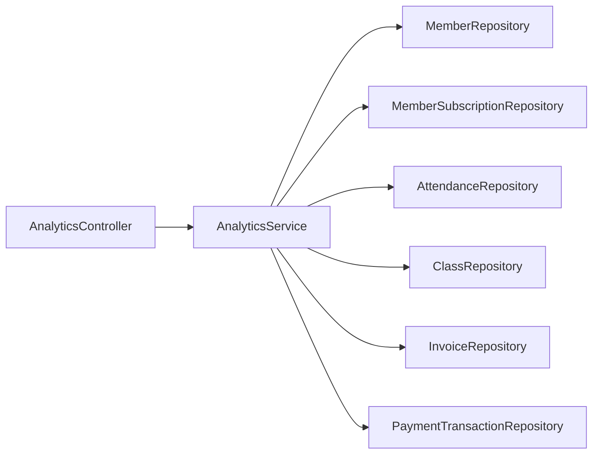
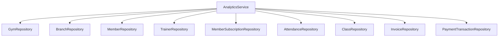

# Analytics & Dashboard

<cite>
**Referenced Files in This Document**
- [analytics.controller.ts](file://src/analytics/analytics.controller.ts)
- [analytics.service.ts](file://src/analytics/analytics.service.ts)
- [analytics.module.ts](file://src/analytics/analytics.module.ts)
- [members.entity.ts](file://src/entities/members.entity.ts)
- [member_subscriptions.entity.ts](file://src/entities/member_subscriptions.entity.ts)
- [invoices.entity.ts](file://src/entities/invoices.entity.ts)
- [payment_transactions.entity.ts](file://src/entities/payment_transactions.entity.ts)
- [attendance.entity.ts](file://src/entities/attendance.entity.ts)
- [classes.entity.ts](file://src/entities/classes.entity.ts)
</cite>

## Table of Contents
1. [Introduction](#introduction)
2. [Project Structure](#project-structure)
3. [Core Components](#core-components)
4. [Architecture Overview](#architecture-overview)
5. [Detailed Component Analysis](#detailed-component-analysis)
6. [Dependency Analysis](#dependency-analysis)
7. [Performance Considerations](#performance-considerations)
8. [Troubleshooting Guide](#troubleshooting-guide)
9. [Conclusion](#conclusion)
10. [Appendices](#appendices)

## Introduction
This document describes the analytics and dashboard module that powers business intelligence, reporting systems, and data visualization across the gym management platform. It explains how analytics data is aggregated, how key performance indicators are calculated, and how reports are generated. It also documents dashboard widgets, real-time metrics display, customizable reporting features, integrations with business modules, and practical examples for membership, training program effectiveness, revenue, and operational efficiency reporting. Finally, it covers performance monitoring, trend analysis, and predictive analytics integration.

## Project Structure
The analytics module is organized around a dedicated controller and service with supporting entities. The module integrates with core business entities to compute KPIs and present dashboards.



**Diagram sources**
- [analytics.controller.ts:12-14](file://src/analytics/analytics.controller.ts#L12-L14)
- [analytics.service.ts:21-44](file://src/analytics/analytics.service.ts#L21-L44)
- [analytics.module.ts:16-35](file://src/analytics/analytics.module.ts#L16-L35)
- [members.entity.ts:22-124](file://src/entities/members.entity.ts#L22-L124)
- [member_subscriptions.entity.ts:14-71](file://src/entities/member_subscriptions.entity.ts#L14-L71)
- [attendance.entity.ts:12-44](file://src/entities/attendance.entity.ts#L12-L44)
- [classes.entity.ts:5-40](file://src/entities/classes.entity.ts#L5-L40)
- [invoices.entity.ts:13-49](file://src/entities/invoices.entity.ts#L13-L49)
- [payment_transactions.entity.ts:12-74](file://src/entities/payment_transactions.entity.ts#L12-L74)

**Section sources**
- [analytics.controller.ts:12-14](file://src/analytics/analytics.controller.ts#L12-L14)
- [analytics.service.ts:21-44](file://src/analytics/analytics.service.ts#L21-L44)
- [analytics.module.ts:16-35](file://src/analytics/analytics.module.ts#L16-L35)

## Core Components
- AnalyticsController: Exposes REST endpoints for gym, branch, and trainer dashboards, membership analytics, attendance analytics, recent payments, and trainer-specific dashboards. All endpoints require JWT authentication.
- AnalyticsService: Implements analytics computations using TypeORM repositories and query builders. It aggregates counts, trends, revenue, and recent activity with optimized queries and concurrency.
- Entities: The service leverages core entities (Member, MemberSubscription, Attendance, Class, Invoice, PaymentTransaction) to calculate KPIs and build reports.

Key capabilities:
- Real-time dashboards for gyms, branches, and trainers
- Membership analytics (totals, active/inactive, expirations, birthdays, pending dues)
- Attendance analytics (daily counts)
- Revenue analytics (month-over-month comparisons, refunds-adjusted)
- Recent payment transactions
- Trainer resource and assignment analytics

**Section sources**
- [analytics.controller.ts:17-596](file://src/analytics/analytics.controller.ts#L17-L596)
- [analytics.service.ts:101-647](file://src/analytics/analytics.service.ts#L101-L647)
- [analytics.module.ts:16-35](file://src/analytics/analytics.module.ts#L16-L35)

## Architecture Overview
The analytics module follows a clean architecture pattern:
- Controller handles HTTP requests and Swagger metadata.
- Service encapsulates business logic and performs efficient database queries.
- Entities define the schema and relationships used for aggregations.



**Diagram sources**
- [analytics.controller.ts:17-136](file://src/analytics/analytics.controller.ts#L17-L136)
- [analytics.service.ts:101-647](file://src/analytics/analytics.service.ts#L101-L647)

## Detailed Component Analysis

### AnalyticsController
Responsibilities:
- Provides endpoints for gym and branch dashboards, membership analytics, attendance analytics, recent payments, and trainer dashboards.
- Enforces JWT authentication via a guard.
- Returns structured responses with examples and schemas for Swagger.

Endpoints overview:
- GET /analytics/gym/{gymId}/dashboard
- GET /analytics/branch/{branchId}/dashboard
- GET /analytics/gym/{gymId}/members
- GET /analytics/branch/{branchId}/members
- GET /analytics/gym/{gymId}/attendance
- GET /analytics/branch/{branchId}/attendance
- GET /analytics/gym/{gymId}/payments/recent
- GET /analytics/branch/{branchId}/payments/recent
- GET /analytics/trainer/{trainerId}/dashboard

Error handling:
- Throws “Not Found” when gym, branch, or trainer identifiers are invalid.

**Section sources**
- [analytics.controller.ts:17-596](file://src/analytics/analytics.controller.ts#L17-L596)

### AnalyticsService
Responsibilities:
- Computes real-time and historical KPIs using concurrent queries.
- Applies filters for effective active memberships and date ranges.
- Formats recent payments and aggregates revenue with refunds adjustment.

Core methods:
- getGymDashboard: Computes totals, active members (month-over-month), revenue, recent payments, and resource counts.
- getBranchDashboard: Similar to gym dashboard scoped to a single branch.
- getGymMemberAnalytics / getBranchMemberAnalytics: Membership counts, expirations, birthdays, pending dues.
- getGymAttendanceAnalytics / getBranchAttendanceAnalytics: Daily attendance counts.
- getGymRecentPayments / getBranchRecentPayments: Top N recent payments.
- getTrainerDashboard: Trainer profile, classes, stats, and assigned members.

Optimization techniques:
- Parallel queries for independent metrics.
- Efficient date range filtering and EXTRACT-based birthday queries.
- Limits for recent payments and resource lists to control payload size.

KPI calculations:
- Active members: Count of distinct members who attended in the current/previous month.
- Revenue: Sum of completed payments minus refunds, grouped by month.
- Percentage change: Rounded to two decimals with increase/decrease/nochange classification.

**Section sources**
- [analytics.service.ts:101-647](file://src/analytics/analytics.service.ts#L101-L647)
- [analytics.service.ts:789-1204](file://src/analytics/analytics.service.ts#L789-L1204)
- [analytics.service.ts:1209-1277](file://src/analytics/analytics.service.ts#L1209-L1277)
- [analytics.service.ts:1282-1345](file://src/analytics/analytics.service.ts#L1282-L1345)
- [analytics.service.ts:1350-1411](file://src/analytics/analytics.service.ts#L1350-L1411)
- [analytics.service.ts:1416-1456](file://src/analytics/analytics.service.ts#L1416-L1456)

### Entities and Relationships
The analytics module relies on the following entities and relationships:

```mermaid
erDiagram
MEMBER {
int id PK
string email UK
string fullName
date dateOfBirth
boolean isActive
string branchBranchId FK
}
MEMBER_SUBSCRIPTION {
int id PK
int member_id FK
int membership_plan_id FK
timestamp startDate
timestamp endDate
boolean isActive
}
ATTENDANCE {
uuid id PK
int member_id FK
uuid branch_id FK
date date
}
CLASS {
uuid class_id PK
uuid branch_id FK
uuid trainer_id FK
string name
enum timings
enum recurrence_type
int[] days_of_week
}
INVOICE {
uuid invoice_id PK
int member_id FK
uuid member_subscription_id FK
decimal total_amount
enum status
date due_date
}
PAYMENT_TRANSACTION {
uuid transaction_id PK
uuid invoice_id FK
decimal amount
enum method
enum status
}
MEMBER ||--o{ ATTENDANCE : "attended"
MEMBER ||--o{ INVOICE : "generated"
INVOICE ||--o{ PAYMENT_TRANSACTION : "paid_by"
MEMBER ||--o{ MEMBER_SUBSCRIPTION : "has"
CLASS ||--o{ ATTENDANCE : "scheduled_for"
```

**Diagram sources**
- [members.entity.ts:22-124](file://src/entities/members.entity.ts#L22-L124)
- [member_subscriptions.entity.ts:14-71](file://src/entities/member_subscriptions.entity.ts#L14-L71)
- [attendance.entity.ts:12-44](file://src/entities/attendance.entity.ts#L12-L44)
- [classes.entity.ts:5-40](file://src/entities/classes.entity.ts#L5-L40)
- [invoices.entity.ts:13-49](file://src/entities/invoices.entity.ts#L13-L49)
- [payment_transactions.entity.ts:12-74](file://src/entities/payment_transactions.entity.ts#L12-L74)

## Architecture Overview
The analytics module integrates tightly with business entities to deliver real-time insights. The controller delegates to the service, which orchestrates concurrent queries against repositories to compute KPIs efficiently.



**Diagram sources**
- [analytics.controller.ts:17-596](file://src/analytics/analytics.controller.ts#L17-L596)
- [analytics.service.ts:21-44](file://src/analytics/analytics.service.ts#L21-L44)

## Detailed Component Analysis

### Dashboard Widgets and Real-Time Metrics
- Gym dashboard widgets:
  - Today’s payments (online vs cash)
  - Attendance count
  - Admissions and renewals
  - Dues paid by members
  - Membership totals and active change (percent and direction)
  - Revenue (current vs last month, percent change)
  - Recent payments (limited list)
  - Resource counts (trainers, classes)
- Branch dashboard mirrors gym metrics at branch level.
- Trainer dashboard:
  - Trainer profile and specialization
  - Classes assigned (with timings)
  - Stats: total classes and total members
  - Assigned members list

These widgets are computed via optimized queries and returned as structured JSON payloads.

**Section sources**
- [analytics.controller.ts:17-596](file://src/analytics/analytics.controller.ts#L17-L596)
- [analytics.service.ts:101-647](file://src/analytics/analytics.service.ts#L101-L647)
- [analytics.service.ts:789-1204](file://src/analytics/analytics.service.ts#L789-L1204)
- [analytics.service.ts:1416-1456](file://src/analytics/analytics.service.ts#L1416-L1456)

### Membership Reports
- Totals: total members, active members, inactive members
- Expirations: expiring today, expiring in next 3 days, expiring in next 10 days
- Birthdays: members celebrating today
- Pending dues: count and total amount, plus affected member IDs

Practical example use cases:
- Membership churn analysis by comparing active members month-over-month
- Renewal funnel tracking by counting renewals versus admissions
- Membership growth trend using active member counts

**Section sources**
- [analytics.service.ts:676-784](file://src/analytics/analytics.service.ts#L676-L784)
- [analytics.service.ts:1209-1277](file://src/analytics/analytics.service.ts#L1209-L1277)

### Training Program Effectiveness Metrics
- Class attendance rates: computed by counting distinct members who attended classes per period
- Trainer utilization: total classes and total assigned members
- Goal completion tracking: available via related modules (not implemented in analytics service)

Note: Class scheduling and recurrence fields enable trend analysis across daily/weekly/monthly sessions.

**Section sources**
- [analytics.service.ts:1416-1456](file://src/analytics/analytics.service.ts#L1416-L1456)
- [classes.entity.ts:22-39](file://src/entities/classes.entity.ts#L22-L39)

### Revenue Analytics
- Monthly revenue: sum of completed payments minus refunds for the current and previous month
- Percent change: rounded to two decimals with direction indicator
- Payment methods: online vs cash breakdown for today
- Recent payments: limited list with member and invoice details

Practical example use cases:
- Month-over-month revenue growth
- Payment method mix analysis
- Refund impact assessment

**Section sources**
- [analytics.service.ts:406-588](file://src/analytics/analytics.service.ts#L406-L588)
- [analytics.service.ts:1007-1105](file://src/analytics/analytics.service.ts#L1007-L1105)
- [payment_transactions.entity.ts:22-39](file://src/entities/payment_transactions.entity.ts#L22-L39)

### Operational Efficiency Reports
- Resource utilization: trainer and class counts per gym/branch
- Attendance trends: daily attendance counts
- Membership lifecycle: admissions, renewals, expirations, birthdays, pending dues

Practical example use cases:
- Branch efficiency comparisons using active member counts and revenue
- Trainer workload analysis via class and member counts
- Operational capacity planning using resource and attendance metrics

**Section sources**
- [analytics.service.ts:298-316](file://src/analytics/analytics.service.ts#L298-L316)
- [analytics.service.ts:807-837](file://src/analytics/analytics.service.ts#L807-L837)

### Report Generation Workflows
- Endpoint-driven generation: clients call analytics endpoints to receive pre-computed reports
- Parameterized options: dashboard methods accept options to limit payload size (e.g., maxTrainers, maxClasses, maxRecentPayments)
- Structured payloads: responses include nested objects for members, revenue, resources, and recent payments

Customizable reporting features:
- Branch-level vs gym-level aggregation
- Time-bound filters (today, current month, previous month)
- Limits on recent items to optimize performance

**Section sources**
- [analytics.controller.ts:101-136](file://src/analytics/analytics.controller.ts#L101-L136)
- [analytics.service.ts:101-136](file://src/analytics/analytics.service.ts#L101-L136)

### Data Export Capabilities
- The analytics module does not expose explicit export endpoints in the analyzed files.
- Clients can retrieve paginated recent payments and membership summaries via existing endpoints.
- For bulk exports, integrate client-side pagination or extend endpoints to support CSV/Excel formats.

[No sources needed since this section provides general guidance]

### Automated Reporting Schedules
- No scheduler or recurring job implementation was identified in the analyzed files.
- To implement automated reporting, integrate a scheduler (e.g., NestJS scheduler) to periodically call analytics endpoints and publish results to storage or email.

[No sources needed since this section provides general guidance]

### Executive Dashboard Features
- Executive-focused views can be built on top of existing endpoints:
  - High-level KPIs: total members, active members, revenue, recent payments
  - Trend indicators: percent change for revenue and active members
  - Drill-down capability: navigate from gym to branch to trainer views

**Section sources**
- [analytics.controller.ts:17-136](file://src/analytics/analytics.controller.ts#L17-L136)
- [analytics.service.ts:589-647](file://src/analytics/analytics.service.ts#L589-L647)

### Predictive Analytics Integration
- The current analytics service computes historical KPIs and month-over-month changes.
- Predictive features (e.g., forecasting revenue or churn) are not implemented in the analyzed files.
- To add predictive analytics, integrate ML models to consume historical series and generate forecasts.

[No sources needed since this section provides general guidance]

## Dependency Analysis
The analytics module depends on core business entities and TypeORM repositories. The service composes multiple repositories to compute KPIs efficiently.



**Diagram sources**
- [analytics.service.ts:21-44](file://src/analytics/analytics.service.ts#L21-L44)

**Section sources**
- [analytics.module.ts:16-35](file://src/analytics/analytics.module.ts#L16-L35)

## Performance Considerations
- Concurrency: The service uses Promise.all to execute independent queries concurrently, reducing total latency.
- Index-friendly filters: Uses date ranges, ENUM filters, and EXTRACT conditions to keep queries efficient.
- Payload limits: Options to cap recent items and resource lists prevent oversized responses.
- Effective active membership filter: Ensures accurate active member counts by combining subscription and attendance criteria.

Recommendations:
- Add database indexes on frequently filtered columns (e.g., created_at, status, date).
- Consider caching for static or slowly changing metrics (e.g., trainer/class counts).
- Monitor slow queries and add EXPLAIN plans for complex aggregations.

**Section sources**
- [analytics.service.ts:130-136](file://src/analytics/analytics.service.ts#L130-L136)
- [analytics.service.ts:150-226](file://src/analytics/analytics.service.ts#L150-L226)
- [analytics.service.ts:807-836](file://src/analytics/analytics.service.ts#L807-L836)

## Troubleshooting Guide
Common issues and resolutions:
- Not Found errors: Occur when gymId, branchId, or trainerId do not match existing entities. Verify identifiers and entity existence.
- Empty results: May indicate missing data for the selected scope (e.g., no subscriptions for a branch).
- Performance concerns: Reduce payload sizes using options (e.g., lower maxRecentPayments) or narrow date ranges.

Operational checks:
- Confirm JWT authentication is included in requests.
- Validate entity relationships and foreign keys.
- Review database query logs for slow or failing queries.

**Section sources**
- [analytics.controller.ts:114-116](file://src/analytics/analytics.controller.ts#L114-L116)
- [analytics.controller.ts:794-796](file://src/analytics/analytics.controller.ts#L794-L796)
- [analytics.controller.ts:1421-1423](file://src/analytics/analytics.controller.ts#L1421-L1423)

## Conclusion
The analytics and dashboard module provides a robust foundation for business intelligence, delivering real-time dashboards, membership insights, attendance metrics, revenue analytics, and trainer-centric views. Its modular design, concurrent query strategy, and structured payloads enable scalable reporting across gyms, branches, and trainers. Extending the module with export capabilities, automated scheduling, and predictive analytics would further enhance executive visibility and operational decision-making.

## Appendices

### Practical Examples

- Membership report (gym):
  - Endpoint: GET /analytics/gym/{gymId}/members
  - Includes totals, active/inactive, expiring counts, birthdays, and pending dues
  - Use case: Track membership health and renewal readiness

- Membership report (branch):
  - Endpoint: GET /analytics/branch/{branchId}/members
  - Includes totals, active/inactive, expiring counts, and pending dues
  - Use case: Compare branch performance and identify renewal opportunities

- Revenue analytics:
  - Use gym/branch dashboard revenue fields to compare current vs last month
  - Subtract refunds from completed payments for net revenue
  - Use case: Monitor financial performance and payment method trends

- Operational efficiency:
  - Use resource counts (trainers, classes) and attendance metrics
  - Compare active member counts across months to assess engagement
  - Use case: Plan staffing and class scheduling based on demand

- Training program effectiveness:
  - Use trainer dashboard to review assigned members and class counts
  - Combine with attendance records to compute class attendance rates
  - Use case: Evaluate trainer utilization and class popularity

[No sources needed since this section provides general guidance]