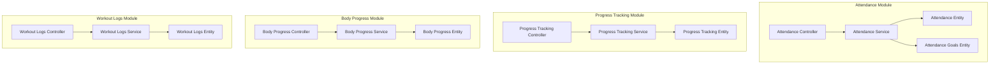
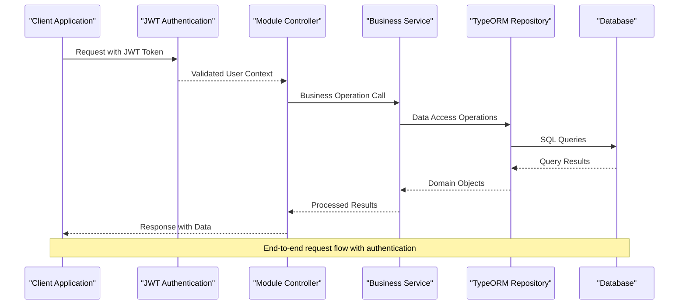
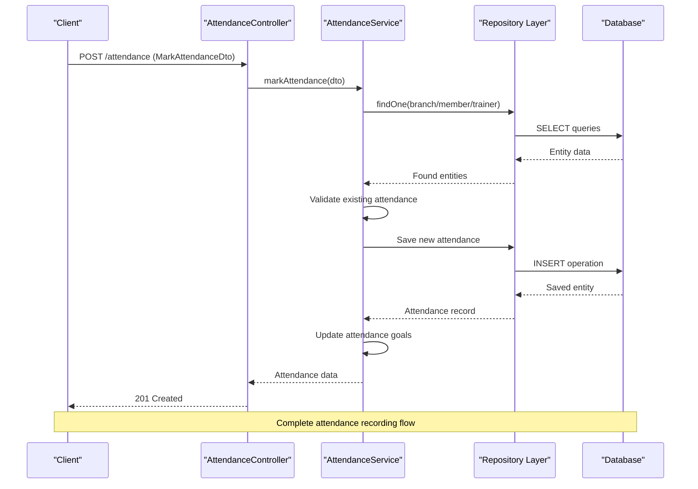
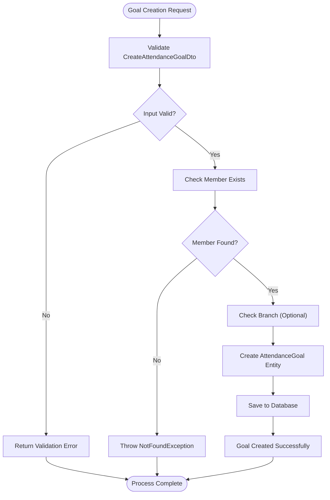
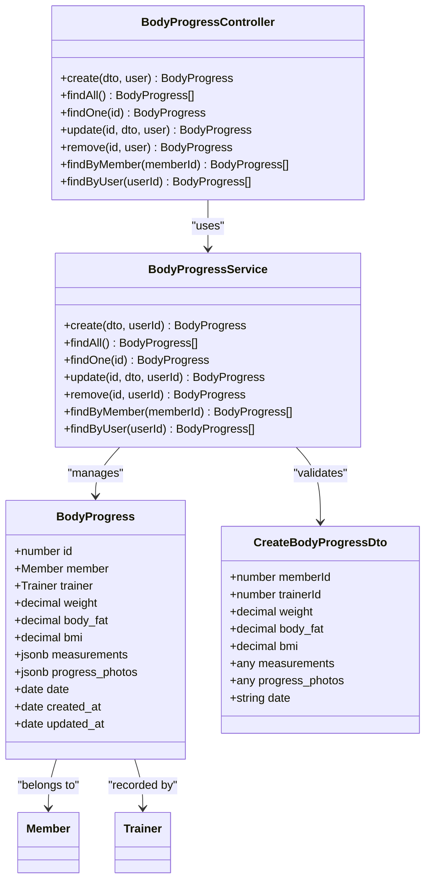
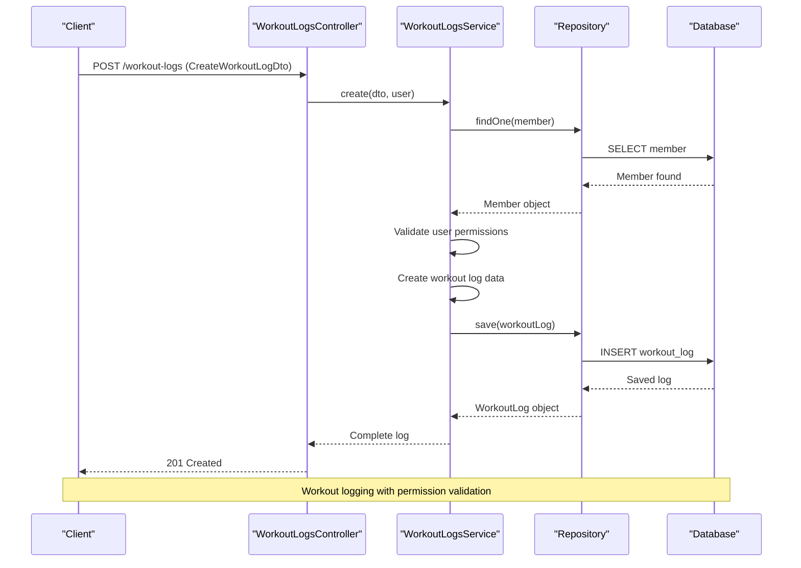
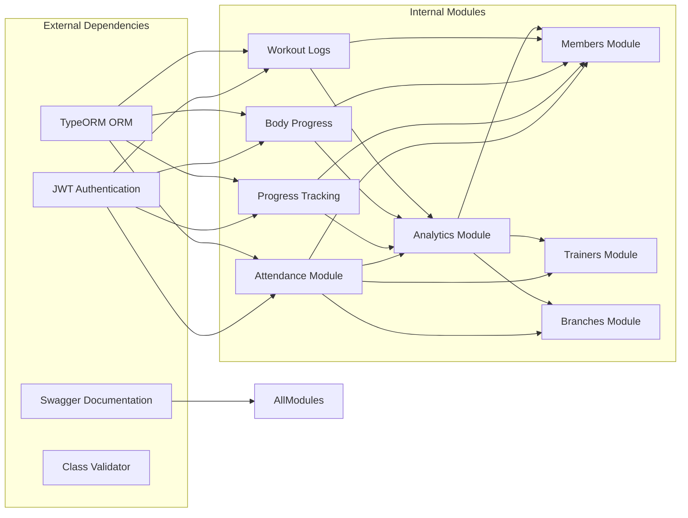

# Attendance & Progress Tracking

<cite>
**Referenced Files in This Document**
- [attendance.controller.ts](file://src/attendance/attendance.controller.ts)
- [attendance.service.ts](file://src/attendance/attendance.service.ts)
- [mark-attendance.dto.ts](file://src/attendance/dto/mark-attendance.dto.ts)
- [create-attendance-goal.dto.ts](file://src/attendance/dto/create-attendance-goal.dto.ts)
- [attendance.entity.ts](file://src/entities/attendance.entity.ts)
- [attendance_goals.entity.ts](file://src/entities/attendance_goals.entity.ts)
- [progress-tracking.controller.ts](file://src/progress-tracking/progress-tracking.controller.ts)
- [progress-tracking.service.ts](file://src/progress-tracking/progress-tracking.service.ts)
- [create-progress.dto.ts](file://src/progress-tracking/dto/create-progress.dto.ts)
- [progress_tracking.entity.ts](file://src/entities/progress_tracking.entity.ts)
- [body-progress.controller.ts](file://src/body-progress/body-progress.controller.ts)
- [body-progress.service.ts](file://src/body-progress/body-progress.service.ts)
- [create-body-progress.dto.ts](file://src/body-progress/dto/create-body-progress.dto.ts)
- [body_progress.entity.ts](file://src/entities/body_progress.entity.ts)
- [workout-logs.controller.ts](file://src/workout-logs/workout-logs.controller.ts)
- [workout-logs.service.ts](file://src/workout-logs/workout-logs.service.ts)
- [create-workout-log.dto.ts](file://src/workout-logs/dto/create-workout-log.dto.ts)
- [workout_logs.entity.ts](file://src/entities/workout_logs.entity.ts)
</cite>

## Table of Contents
1. [Introduction](#introduction)
2. [Project Structure](#project-structure)
3. [Core Components](#core-components)
4. [Architecture Overview](#architecture-overview)
5. [Detailed Component Analysis](#detailed-component-analysis)
6. [Dependency Analysis](#dependency-analysis)
7. [Performance Considerations](#performance-considerations)
8. [Troubleshooting Guide](#troubleshooting-guide)
9. [Conclusion](#conclusion)

## Introduction
This document provides comprehensive documentation for the attendance and progress tracking module within the gym management system. It covers four primary systems:
- Attendance monitoring: check-in/check-out, daily attendance tracking, and goal-based attendance tracking
- Goal setting and milestone tracking: configurable attendance goals with streak calculations
- Body measurement tracking: comprehensive body composition monitoring with photos and metrics
- Workout logging: detailed exercise tracking with performance metrics and analytics

The module integrates seamlessly with training programs, nutrition plans, and member dashboards to provide holistic fitness tracking and motivation systems.

## Project Structure
The attendance and progress tracking module follows a clean architecture pattern with separate concerns for each tracking domain:

**Diagram sources**
- [attendance.controller.ts:25-220](file://src/attendance/attendance.controller.ts#L25-L220)
- [progress-tracking.controller.ts:29-798](file://src/progress-tracking/progress-tracking.controller.ts#L29-L798)
- [body-progress.controller.ts:31-692](file://src/body-progress/body-progress.controller.ts#L31-L692)
- [workout-logs.controller.ts:31-787](file://src/workout-logs/workout-logs.controller.ts#L31-L787)

**Section sources**
- [attendance.controller.ts:1-360](file://src/attendance/attendance.controller.ts#L1-L360)
- [progress-tracking.controller.ts:1-800](file://src/progress-tracking/progress-tracking.controller.ts#L1-L800)
- [body-progress.controller.ts:1-800](file://src/body-progress/body-progress.controller.ts#L1-L800)
- [workout-logs.controller.ts:1-800](file://src/workout-logs/workout-logs.controller.ts#L1-L800)

## Core Components

### Attendance Monitoring System
The attendance system provides comprehensive tracking for members, trainers, and branch utilization with real-time check-in/check-out functionality and automated goal tracking.

Key features:
- Multi-entity attendance support (members, trainers, classes)
- Real-time session duration calculation
- Duplicate prevention and capacity management
- Automated goal progress updates
- Monthly attendance calendar visualization
- Streak calculation for daily goals

**Section sources**
- [attendance.controller.ts:28-151](file://src/attendance/attendance.controller.ts#L28-L151)
- [attendance.service.ts:32-99](file://src/attendance/attendance.service.ts#L32-L99)

### Goal Setting and Milestone Tracking
Configurable attendance goals with automated progress tracking and streak calculations.

Features:
- Daily, weekly, and monthly goal types
- Target count configuration with validation
- Automatic progress updates on attendance
- Streak tracking with current and longest streaks
- Branch-specific goal targeting
- Active/inactive goal management

**Section sources**
- [create-attendance-goal.dto.ts:11-55](file://src/attendance/dto/create-attendance-goal.dto.ts#L11-L55)
- [attendance_goals.entity.ts:12-54](file://src/entities/attendance_goals.entity.ts#L12-L54)
- [attendance.service.ts:179-212](file://src/attendance/attendance.service.ts#L179-L212)

### Body Measurement Tracking
Comprehensive body composition monitoring with detailed metrics and visual progress tracking.

Capabilities:
- Complete body measurements (chest, waist, arms, thighs)
- Body composition metrics (weight, BMI, body fat percentage, muscle mass)
- Progress photography integration
- Chronological tracking with summary statistics
- Trainer and member access controls
- Photo management and storage

**Section sources**
- [create-body-progress.dto.ts:4-73](file://src/body-progress/dto/create-body-progress.dto.ts#L4-L73)
- [body_progress.entity.ts:12-46](file://src/entities/body_progress.entity.ts#L12-L46)
- [body-progress.controller.ts:34-145](file://src/body-progress/body-progress.controller.ts#L34-L145)

### Workout Logging System
Detailed exercise tracking with comprehensive performance metrics and analytics.

Features:
- Exercise-specific workout logging
- Set, rep, and weight tracking
- Duration and performance metrics
- Intensity level categorization
- Member and trainer feedback systems
- Environmental and equipment tracking
- Comprehensive analytics dashboard

**Section sources**
- [create-workout-log.dto.ts:10-79](file://src/workout-logs/dto/create-workout-log.dto.ts#L10-L79)
- [workout_logs.entity.ts:12-49](file://src/entities/workout_logs.entity.ts#L12-L49)
- [workout-logs.controller.ts:34-291](file://src/workout-logs/workout-logs.controller.ts#L34-L291)

## Architecture Overview

**Diagram sources**
- [attendance.service.ts:17-30](file://src/attendance/attendance.service.ts#L17-L30)
- [progress-tracking.service.ts:15-26](file://src/progress-tracking/progress-tracking.service.ts#L15-L26)
- [body-progress.service.ts:15-26](file://src/body-progress/body-progress.service.ts#L15-L26)
- [workout-logs.service.ts:15-26](file://src/workout-logs/workout-logs.service.ts#L15-L26)

The system follows a layered architecture with clear separation between presentation, business logic, and data access layers. Each module maintains its own controller-service-repository pattern with comprehensive DTO validation and error handling.

**Section sources**
- [attendance.service.ts:17-395](file://src/attendance/attendance.service.ts#L17-L395)
- [progress-tracking.service.ts:15-299](file://src/progress-tracking/progress-tracking.service.ts#L15-L299)
- [body-progress.service.ts:15-290](file://src/body-progress/body-progress.service.ts#L15-L290)
- [workout-logs.service.ts:15-283](file://src/workout-logs/workout-logs.service.ts#L15-L283)

## Detailed Component Analysis

### Attendance Recording Process

**Diagram sources**
- [attendance.controller.ts:103-105](file://src/attendance/attendance.controller.ts#L103-L105)
- [attendance.service.ts:32-99](file://src/attendance/attendance.service.ts#L32-L99)

The attendance recording process ensures data integrity through comprehensive validation and prevents duplicate check-ins. The system automatically updates related goals and provides immediate feedback on successful operations.

**Section sources**
- [attendance.controller.ts:28-105](file://src/attendance/attendance.controller.ts#L28-L105)
- [attendance.service.ts:32-99](file://src/attendance/attendance.service.ts#L32-L99)
- [mark-attendance.dto.ts:10-34](file://src/attendance/dto/mark-attendance.dto.ts#L10-L34)

### Goal Creation and Milestone Tracking

**Diagram sources**
- [attendance.service.ts:179-212](file://src/attendance/attendance.service.ts#L179-L212)
- [create-attendance-goal.dto.ts:11-55](file://src/attendance/dto/create-attendance-goal.dto.ts#L11-L55)

The goal system provides flexible attendance tracking with automated progress updates. Goals support daily streak tracking, weekly and monthly targets, and branch-specific configurations.

**Section sources**
- [attendance_goals.entity.ts:12-54](file://src/entities/attendance_goals.entity.ts#L12-L54)
- [attendance.service.ts:275-342](file://src/attendance/attendance.service.ts#L275-L342)

### Body Composition Monitoring

**Diagram sources**
- [body_progress.entity.ts:12-46](file://src/entities/body_progress.entity.ts#L12-L46)
- [create-body-progress.dto.ts:4-73](file://src/body-progress/dto/create-body-progress.dto.ts#L4-L73)
- [body-progress.controller.ts:31-692](file://src/body-progress/body-progress.controller.ts#L31-L692)
- [body-progress.service.ts:15-290](file://src/body-progress/body-progress.service.ts#L15-L290)

The body progress system provides comprehensive tracking of physical changes over time with support for detailed measurements, progress photos, and statistical summaries.

**Section sources**
- [body-progress.controller.ts:34-145](file://src/body-progress/body-progress.controller.ts#L34-L145)
- [body-progress.service.ts:28-103](file://src/body-progress/body-progress.service.ts#L28-L103)

### Workout Completion Logging

**Diagram sources**
- [workout-logs.controller.ts:286-291](file://src/workout-logs/workout-logs.controller.ts#L286-L291)
- [workout-logs.service.ts:28-104](file://src/workout-logs/workout-logs.service.ts#L28-L104)

The workout logging system captures comprehensive exercise data with detailed performance metrics, providing valuable insights for training program optimization and member progress tracking.

**Section sources**
- [workout-logs.controller.ts:34-291](file://src/workout-logs/workout-logs.controller.ts#L34-L291)
- [workout-logs.service.ts:28-104](file://src/workout-logs/workout-logs.service.ts#L28-L104)

## Dependency Analysis

**Diagram sources**
- [attendance.controller.ts:1-30](file://src/attendance/attendance.controller.ts#L1-L30)
- [progress-tracking.controller.ts:1-30](file://src/progress-tracking/progress-tracking.controller.ts#L1-L30)
- [body-progress.controller.ts:1-30](file://src/body-progress/body-progress.controller.ts#L1-L30)
- [workout-logs.controller.ts:1-30](file://src/workout-logs/workout-logs.controller.ts#L1-L30)

The module demonstrates loose coupling through dependency injection and clear interface boundaries. Each module maintains independence while sharing common infrastructure through the TypeORM repositories and JWT authentication.

**Section sources**
- [attendance.service.ts:17-30](file://src/attendance/attendance.service.ts#L17-L30)
- [progress-tracking.service.ts:15-26](file://src/progress-tracking/progress-tracking.service.ts#L15-L26)
- [body-progress.service.ts:15-26](file://src/body-progress/body-progress.service.ts#L15-L26)
- [workout-logs.service.ts:15-26](file://src/workout-logs/workout-logs.service.ts#L15-L26)

## Performance Considerations

### Database Optimization
- **Index Strategy**: Proper indexing on frequently queried fields (member_id, date, branch_id) for optimal query performance
- **Pagination**: Built-in pagination support for large datasets in progress tracking and workout logs
- **Query Optimization**: Efficient joins and selective field retrieval to minimize database load
- **Connection Pooling**: Configured connection pooling for concurrent operations across multiple modules

### Caching Strategies
- **Entity Caching**: TypeORM's second-level cache for frequently accessed entities
- **Query Result Caching**: Strategic caching for analytics-heavy operations
- **Session Caching**: JWT token validation caching to reduce authentication overhead

### Scalability Features
- **Horizontal Scaling**: Stateless controllers enable easy horizontal scaling
- **Database Sharding**: Potential for sharding based on member or branch identifiers
- **Asynchronous Processing**: Background jobs for heavy analytics computations

## Troubleshooting Guide

### Common Issues and Solutions

**Attendance Recording Failures**
- Duplicate check-in attempts: System prevents multiple check-ins per day per entity
- Entity not found errors: Verify member/trainer/branch IDs exist in the system
- Permission denied: Ensure proper JWT authentication and role-based access

**Goal Tracking Issues**
- Goal not updating: Verify goal is active and within date range
- Streak calculation errors: Check daily attendance consistency
- Branch-specific goals: Ensure branch ID matches the attendance location

**Progress Tracking Problems**
- Permission validation failures: Member self-management must be enabled
- Photo upload issues: Verify storage service availability and permissions
- Data validation errors: Check DTO constraints and required fields

**Workout Logging Challenges**
- Exercise data inconsistencies: Validate exercise names against library
- Performance metric calculations: Ensure proper units and conversions
- Analytics discrepancies: Check data aggregation and time zone handling

**Section sources**
- [attendance.service.ts:46-48](file://src/attendance/attendance.service.ts#L46-L48)
- [progress-tracking.service.ts:51-68](file://src/progress-tracking/progress-tracking.service.ts#L51-L68)
- [body-progress.service.ts:51-68](file://src/body-progress/body-progress.service.ts#L51-L68)
- [workout-logs.service.ts:51-68](file://src/workout-logs/workout-logs.service.ts#L51-L68)

## Conclusion

The attendance and progress tracking module provides a comprehensive solution for modern gym management with robust attendance monitoring, configurable goal tracking, detailed body composition monitoring, and extensive workout logging capabilities. The modular architecture ensures maintainability and scalability while the integrated approach enables seamless connections between training programs, nutrition plans, and member dashboards.

Key strengths include:
- Real-time attendance tracking with automated goal updates
- Comprehensive progress visualization through multiple tracking modalities
- Flexible goal system supporting various fitness objectives
- Integrated analytics and reporting capabilities
- Strong security model with role-based access controls
- Extensible architecture supporting future enhancements

The system successfully addresses the core requirements for fitness tracking while providing the foundation for advanced features like goal-based motivation systems and progress celebration workflows through its comprehensive milestone tracking and achievement recognition capabilities.