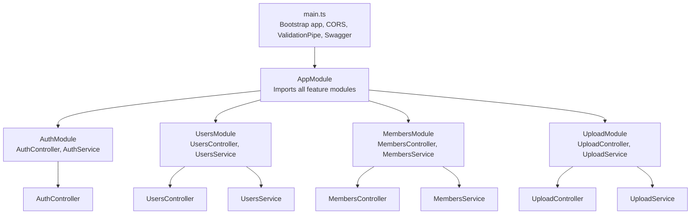
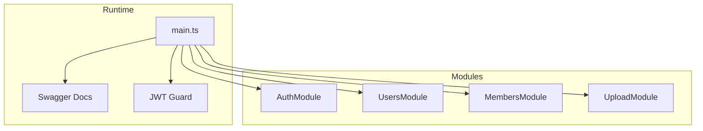
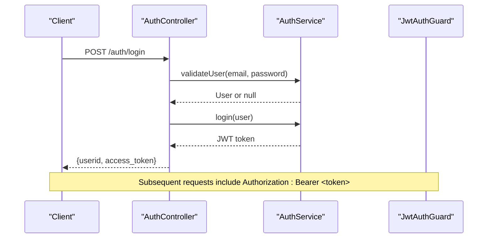
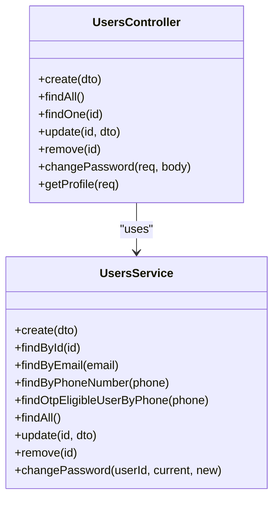
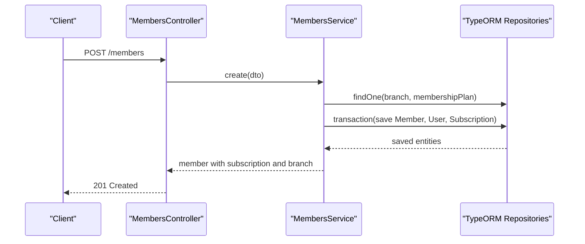
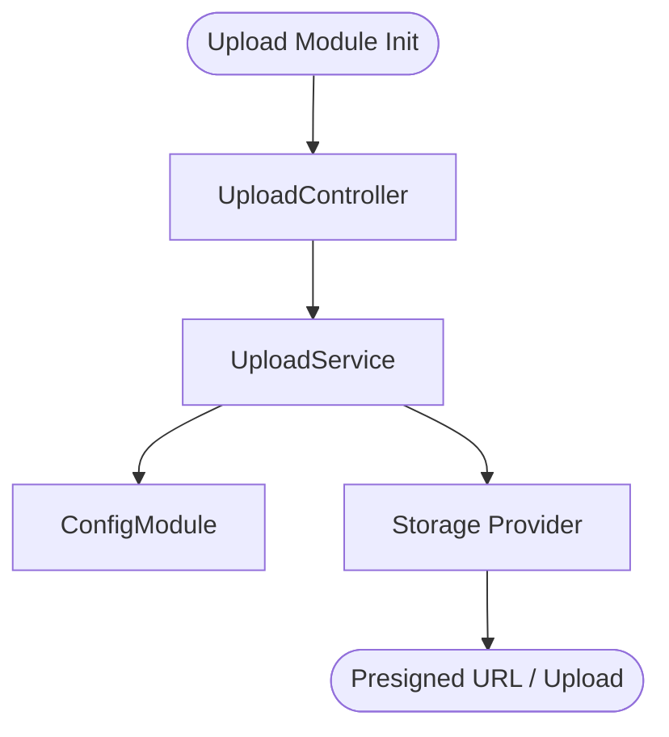
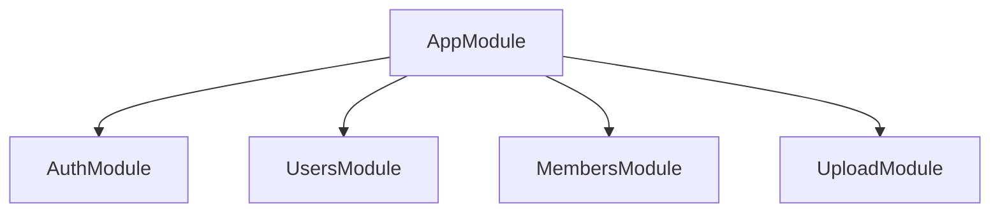

# Core Modules & Features

<cite>
**Referenced Files in This Document**
- [app.module.ts](file://src/app.module.ts)
- [main.ts](file://src/main.ts)
- [auth.controller.ts](file://src/auth/auth.controller.ts)
- [jwt-auth.guard.ts](file://src/auth/guards/jwt-auth.guard.ts)
- [role.enum.ts](file://src/common/enums/role.enum.ts)
- [users.module.ts](file://src/users/users.module.ts)
- [users.controller.ts](file://src/users/users.controller.ts)
- [users.service.ts](file://src/users/users.service.ts)
- [members.module.ts](file://src/members/members.module.ts)
- [members.controller.ts](file://src/members/members.controller.ts)
- [members.service.ts](file://src/members/members.service.ts)
- [create-member.dto.ts](file://src/members/dto/create-member.dto.ts)
- [members.entity.ts](file://src/entities/members.entity.ts)
- [upload.module.ts](file://src/upload/upload.module.ts)
</cite>

## Table of Contents
1. [Introduction](#introduction)
2. [Project Structure](#project-structure)
3. [Core Components](#core-components)
4. [Architecture Overview](#architecture-overview)
5. [Detailed Component Analysis](#detailed-component-analysis)
6. [Dependency Analysis](#dependency-analysis)
7. [Performance Considerations](#performance-considerations)
8. [Troubleshooting Guide](#troubleshooting-guide)
9. [Conclusion](#conclusion)
10. [Appendices](#appendices)

## Introduction
This document explains the modular architecture and core features of the gym management system. The application follows a clear modular pattern where each feature is implemented as an independent module using the controller-service-entity pattern. The system emphasizes robust DTO validation, standardized error handling, and consistent API endpoint design across all modules. It supports user management, member registration and profiles, gym and branch administration, staff management, training program creation and assignment, nutrition plan development, subscription billing and payment processing, attendance tracking, progress monitoring, analytics dashboards, and file upload capabilities.

## Project Structure
The application is organized around a central AppModule that aggregates feature modules. Each feature module encapsulates:
- A controller exposing REST endpoints
- A service implementing business logic
- Entities managed via TypeORM
- DTOs for request/response validation
- Guards and decorators for authorization

Key characteristics:
- Centralized CORS and global validation pipeline
- Swagger/OpenAPI documentation enabled for all endpoints
- Feature modules imported and registered in AppModule
- Shared guards and enums reused across modules

**Diagram sources**
- [main.ts:6–68:6-68](file://src/main.ts#L6-L68)
- [app.module.ts:66–137:66-137](file://src/app.module.ts#L66-L137)

**Section sources**
- [main.ts:6–68:6-68](file://src/main.ts#L6-L68)
- [app.module.ts:66–137:66-137](file://src/app.module.ts#L66-L137)

## Core Components
This section outlines the foundational building blocks used across modules.

- Authentication and Authorization
  - JWT guard enables bearer token authentication
  - Role-based access control via decorators and guards
  - Login, OTP request/verify, and logout endpoints

- DTO Validation Patterns
  - Strict field validation using class-validator decorators
  - Swagger metadata for API documentation and examples
  - Consistent error responses for validation failures

- Error Handling Strategies
  - Standardized HTTP status codes and error payloads
  - Conflict exceptions for duplicates, not-found exceptions for missing resources
  - Guard-based enforcement of permissions

- API Endpoint Design Principles
  - RESTful paths with consistent naming conventions
  - Comprehensive Swagger tagging and operation descriptions
  - Example payloads for successful and failure scenarios

**Section sources**
- [auth.controller.ts:27–88:27-88](file://src/auth/auth.controller.ts#L27-L88)
- [jwt-auth.guard.ts:1–6:1-6](file://src/auth/guards/jwt-auth.guard.ts#L1-L6)
- [role.enum.ts:1–7:1-7](file://src/common/enums/role.enum.ts#L1-L7)
- [users.controller.ts:36–78:36-78](file://src/users/users.controller.ts#L36-L78)
- [members.controller.ts:39–222:39-222](file://src/members/members.controller.ts#L39-L222)

## Architecture Overview
The system adheres to a layered architecture:
- Entry point: main.ts initializes the NestJS application, sets CORS, registers global validation pipe, and exposes Swagger documentation
- Module composition: AppModule aggregates all feature modules
- Feature modules: Each module defines its own controller-service-entity trio with explicit imports for TypeORM entities
- Cross-cutting concerns: Guards, DTOs, and enums are shared across modules

**Diagram sources**
- [main.ts:6–68:6-68](file://src/main.ts#L6-L68)
- [app.module.ts:66–137:66-137](file://src/app.module.ts#L66-L137)

**Section sources**
- [main.ts:6–68:6-68](file://src/main.ts#L6-L68)
- [app.module.ts:66–137:66-137](file://src/app.module.ts#L66-L137)

## Detailed Component Analysis

### Authentication and Authorization
- Purpose: Secure user login, role-based access control, and mobile OTP verification
- Key elements:
  - AuthController exposes login, OTP request/verify, and logout endpoints
  - JwtAuthGuard enforces JWT-based authentication
  - RolesGuard integrates with role-based decorators to restrict endpoints
  - Role enum defines supported roles across the system

**Diagram sources**
- [auth.controller.ts:27–88:27-88](file://src/auth/auth.controller.ts#L27-L88)
- [jwt-auth.guard.ts:1–6:1-6](file://src/auth/guards/jwt-auth.guard.ts#L1-L6)

**Section sources**
- [auth.controller.ts:27–88:27-88](file://src/auth/auth.controller.ts#L27-L88)
- [jwt-auth.guard.ts:1–6:1-6](file://src/auth/guards/jwt-auth.guard.ts#L1-L6)
- [role.enum.ts:1–7:1-7](file://src/common/enums/role.enum.ts#L1-L7)

### User Management
- Purpose: Manage user accounts, roles, and profile information
- Implementation highlights:
  - UsersModule exports UsersService for cross-module consumption
  - UsersController enforces role-based access for administrative actions
  - UsersService handles password hashing, duplicate checks, and profile assembly

**Diagram sources**
- [users.controller.ts:30–343:30-343](file://src/users/users.controller.ts#L30-L343)
- [users.service.ts:12–167:12-167](file://src/users/users.service.ts#L12-L167)

**Section sources**
- [users.module.ts:9–15:9-15](file://src/users/users.module.ts#L9-L15)
- [users.controller.ts:36–190:36-190](file://src/users/users.controller.ts#L36-L190)
- [users.service.ts:19–92:19-92](file://src/users/users.service.ts#L19-L92)

### Member Registration and Profiles
- Purpose: End-to-end member lifecycle management including registration, updates, and dashboard views
- Implementation highlights:
  - MembersModule orchestrates creation of members, users, and subscriptions in a single transaction
  - MembersService validates branch and plan existence, enforces uniqueness, and synchronizes user data
  - DTOs define strict validation rules and example payloads for API documentation

**Diagram sources**
- [members.controller.ts:39–222:39-222](file://src/members/members.controller.ts#L39-L222)
- [members.service.ts:48–234:48-234](file://src/members/members.service.ts#L48-L234)

**Section sources**
- [members.module.ts:18–35:18-35](file://src/members/members.module.ts#L18-L35)
- [members.controller.ts:39–222:39-222](file://src/members/members.controller.ts#L39-L222)
- [members.service.ts:48–234:48-234](file://src/members/members.service.ts#L48-L234)
- [create-member.dto.ts:17–215:17-215](file://src/members/dto/create-member.dto.ts#L17-L215)
- [members.entity.ts:22–123:22-123](file://src/entities/members.entity.ts#L22-L123)

### File Upload Capabilities
- Purpose: Provide presigned URLs and upload orchestration for file storage
- Implementation highlights:
  - UploadModule exposes UploadController and UploadService
  - Shared configuration module enables centralized configuration loading

**Diagram sources**
- [upload.module.ts:6–12:6-12](file://src/upload/upload.module.ts#L6-L12)

**Section sources**
- [upload.module.ts:6–12:6-12](file://src/upload/upload.module.ts#L6-L12)

### Additional Modules Overview
The system includes numerous feature modules that follow the same controller-service-entity pattern. Examples include:
- Gyms and Branches: Gym and branch administration
- Staff (Trainers): Trainer management
- Classes: Class scheduling and enrollment
- Assignments: Member-trainer assignments
- Attendance: Attendance tracking and goals
- Analytics: Dashboard metrics
- Roles: Role management
- Invoices and Payments: Billing and transactions
- Inquiries: Lead and inquiry management
- Diet Plans and Workouts: Nutrition and fitness program management
- Templates: Template sharing and assignments
- Progress Tracking: Body and goal progress monitoring
- Renewals and Reminders: Membership renewal and reminder systems

These modules are integrated into AppModule and rely on shared guards, DTOs, and entities for consistency.

[No sources needed since this section provides a high-level overview of additional modules without analyzing specific files]

## Dependency Analysis
This section maps module-level dependencies and coupling.

**Diagram sources**
- [app.module.ts:100–132:100-132](file://src/app.module.ts#L100-L132)

**Section sources**
- [app.module.ts:100–132:100-132](file://src/app.module.ts#L100-L132)

## Performance Considerations
- Transactional integrity: Member creation uses a single transaction to maintain referential integrity across Member, User, and Subscription entities
- Relation loading: Controllers and services selectively load relations to minimize payload sizes and improve response times
- Validation pipeline: Global ValidationPipe enforces DTO validation early, reducing downstream processing overhead
- Pagination and filtering: MembersController supports filtering and search to reduce result set sizes

[No sources needed since this section provides general guidance]

## Troubleshooting Guide
Common issues and resolutions:
- Validation errors: DTO validation failures return structured error payloads; review field constraints and example payloads
- Authentication failures: Ensure Authorization header includes a valid JWT token; verify token expiration and signing
- Authorization failures: Confirm user role and permissions; role-based decorators restrict access to administrative endpoints
- Resource not found: Verify IDs and UUIDs; endpoints return explicit not-found messages for missing resources
- Duplicate entries: Creation endpoints enforce uniqueness; handle conflict exceptions when attempting to create duplicates

**Section sources**
- [users.controller.ts:42–60:42-60](file://src/users/users.controller.ts#L42-L60)
- [members.controller.ts:124–177:124-177](file://src/members/members.controller.ts#L124-L177)
- [auth.controller.ts:50–63:50-63](file://src/auth/auth.controller.ts#L50-L63)

## Conclusion
The gym management system demonstrates a clean, modular architecture with consistent patterns across all features. The controller-service-entity model, combined with DTO validation, shared guards, and Swagger-driven documentation, ensures maintainability and scalability. The design supports straightforward integration of new features and provides a solid foundation for extending functionality such as advanced analytics, enhanced reporting, or additional integrations.

[No sources needed since this section summarizes without analyzing specific files]

## Appendices
- API Documentation: Accessible via Swagger at the configured route with tag-based navigation
- Security: JWT-based authentication with role-based authorization guards
- Extensibility: Add new modules by following the established pattern and registering them in AppModule

[No sources needed since this section provides general guidance]