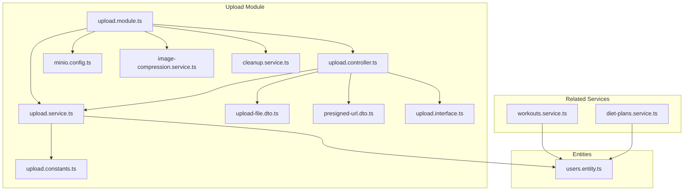
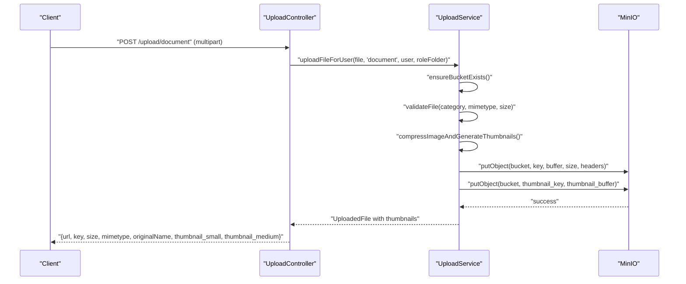
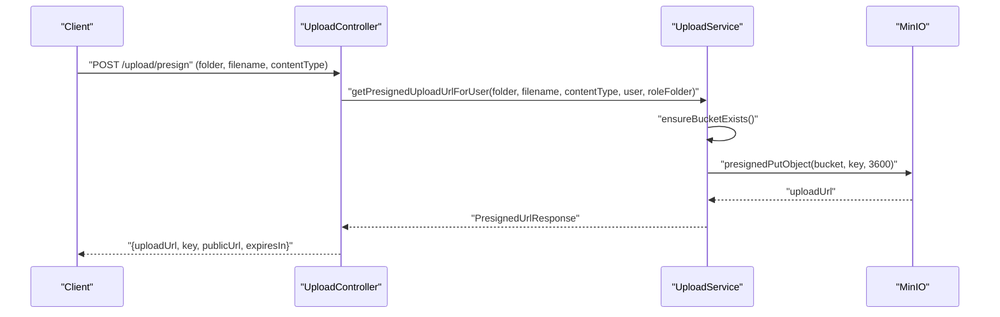
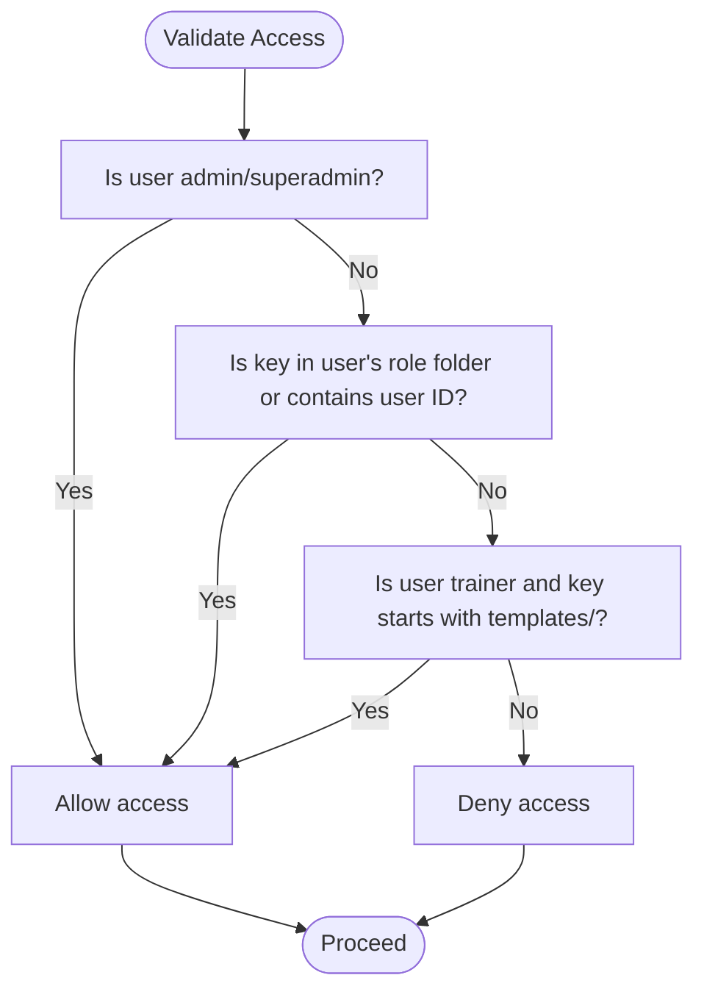
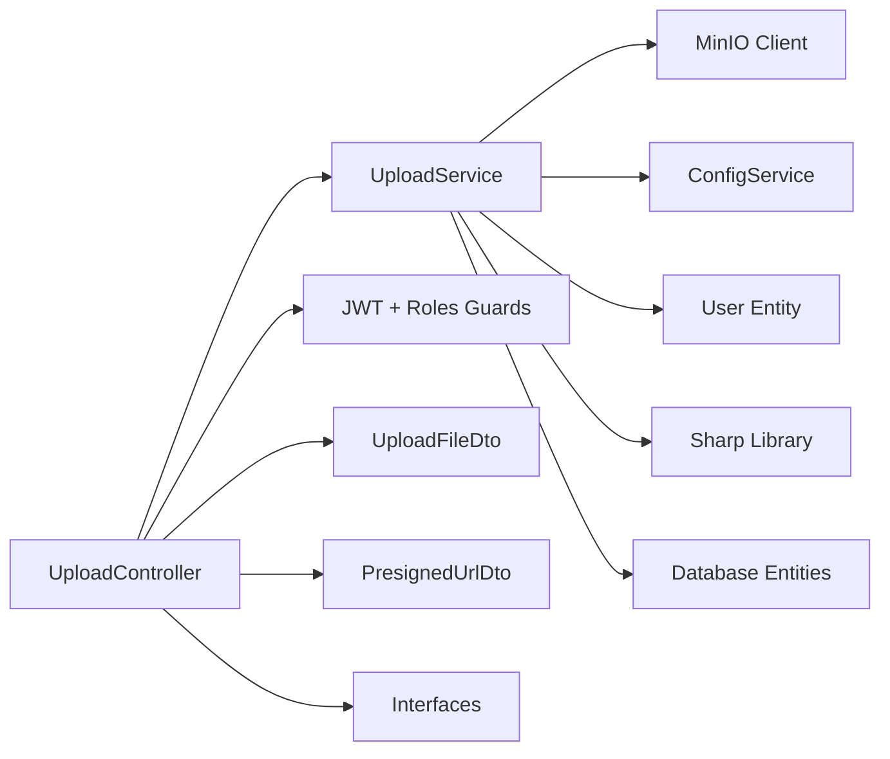

# File Management & Upload

<cite>
**Referenced Files in This Document**
- [upload.module.ts](file://src/upload/upload.module.ts)
- [upload.service.ts](file://src/upload/upload.service.ts)
- [upload.controller.ts](file://src/upload/upload.controller.ts)
- [minio.config.ts](file://src/config/minio.config.ts)
- [upload.constants.ts](file://src/upload/constants/upload.constants.ts)
- [upload-file.dto.ts](file://src/upload/dto/upload-file.dto.ts)
- [presigned-url.dto.ts](file://src/upload/dto/presigned-url.dto.ts)
- [upload.interface.ts](file://src/upload/interfaces/upload.interface.ts)
- [users.entity.ts](file://src/entities/users.entity.ts)
- [workouts.service.ts](file://src/workouts/workouts.service.ts)
- [diet-plans.service.ts](file://src/diet-plans/diet-plans.service.ts)
- [minio_plan_enhance.md](file://minio_plan_enhance.md)
</cite>

## Update Summary
**Changes Made**
- Updated to reflect completed MinIO enhancement plan implementation
- Added comprehensive environment variable configuration documentation
- Documented image compression with thumbnail generation functionality
- Added orphaned file cleanup procedures and manual trigger endpoints
- Enhanced upload module completion status to ✅ Completed with full MinIO integration

## Table of Contents
1. [Introduction](#introduction)
2. [Project Structure](#project-structure)
3. [Core Components](#core-components)
4. [Architecture Overview](#architecture-overview)
5. [Detailed Component Analysis](#detailed-component-analysis)
6. [Dependency Analysis](#dependency-analysis)
7. [Performance Considerations](#performance-considerations)
8. [Troubleshooting Guide](#troubleshooting-guide)
9. [Conclusion](#conclusion)
10. [Appendices](#appendices)

## Introduction
This document explains the file management and upload module that integrates with MinIO for cloud storage, supports multiple file categories, enforces validation and access control, and enables both server-side uploads and browser-direct uploads via presigned URLs. The module has been enhanced with comprehensive MinIO integration including environment variable configuration, image compression with thumbnail generation, and orphaned file cleanup functionality. It covers supported file types, size limits, security controls, file organization strategies, metadata handling, and integration points with user profiles, training programs, and diet plans. Practical examples demonstrate uploading member documents, training photos, nutrition images, and administrative files, along with cleanup procedures for orphaned files.

## Project Structure
The upload module is organized around a dedicated controller, service, configuration, constants, DTOs, and interfaces. It relies on NestJS ConfigModule for MinIO configuration and uses MinIO client for storage operations. The module has been enhanced with image compression services and cleanup utilities.



**Diagram sources**
- [upload.module.ts:1-13](file://src/upload/upload.module.ts#L1-L13)
- [upload.controller.ts:1-185](file://src/upload/upload.controller.ts#L1-L185)
- [upload.service.ts:1-399](file://src/upload/upload.service.ts#L1-L399)
- [minio.config.ts:1-40](file://src/config/minio.config.ts#L1-L40)
- [upload.constants.ts:1-43](file://src/upload/constants/upload.constants.ts#L1-L43)
- [upload-file.dto.ts:1-19](file://src/upload/dto/upload-file.dto.ts#L1-L19)
- [presigned-url.dto.ts:1-14](file://src/upload/dto/presigned-url.dto.ts#L1-L14)
- [upload.interface.ts:1-21](file://src/upload/interfaces/upload.interface.ts#L1-L21)
- [users.entity.ts:1-52](file://src/entities/users.entity.ts#L1-L52)
- [workouts.service.ts:1-200](file://src/workouts/workouts.service.ts#L1-L200)
- [diet-plans.service.ts:1-180](file://src/diet-plans/diet-plans.service.ts#L1-L180)

**Section sources**
- [upload.module.ts:1-13](file://src/upload/upload.module.ts#L1-L13)
- [upload.controller.ts:24-27](file://src/upload/upload.controller.ts#L24-L27)
- [upload.service.ts:11-38](file://src/upload/upload.service.ts#L11-L38)
- [minio.config.ts:20-36](file://src/config/minio.config.ts#L20-L36)

## Core Components
- UploadModule: Declares the upload module with imports, controller, provider, and exports. Now includes image compression and cleanup services.
- UploadController: Exposes endpoints for avatar, document, media, progress uploads, presigned URL generation, download, deletion, health checks, and orphaned file cleanup operations. Applies JWT and role guards.
- UploadService: Implements MinIO integration, bucket lifecycle, file validation, upload and delete operations, presigned URL generation, access control validation, and thumbnail generation for images.
- Configuration: Centralized MinIO and upload settings via ConfigModule with environment variable support.
- Constants: Defines allowed MIME types, categories, and bucket defaults.
- DTOs and Interfaces: Define request/response shapes for uploads and presigned URLs.
- ImageCompressionService: New service for generating thumbnails from uploaded images.
- CleanupService: New service for identifying and removing orphaned files from MinIO storage.

**Section sources**
- [upload.module.ts:6-12](file://src/upload/upload.module.ts#L6-L12)
- [upload.controller.ts:24-185](file://src/upload/upload.controller.ts#L24-L185)
- [upload.service.ts:11-399](file://src/upload/upload.service.ts#L11-L399)
- [minio.config.ts:20-36](file://src/config/minio.config.ts#L20-L36)
- [upload.constants.ts:6-43](file://src/upload/constants/upload.constants.ts#L6-L43)
- [upload-file.dto.ts:10-18](file://src/upload/dto/upload-file.dto.ts#L10-L18)
- [presigned-url.dto.ts:4-13](file://src/upload/dto/presigned-url.dto.ts#L4-L13)
- [upload.interface.ts:1-21](file://src/upload/interfaces/upload.interface.ts#L1-L21)

## Architecture Overview
The upload module orchestrates file operations through a controller that delegates to a service. The service connects to MinIO using configured credentials and ensures the bucket exists. It validates file types and sizes per category, generates unique keys, and supports both direct server uploads and browser-direct uploads via presigned URLs. The enhanced system now includes automatic image compression with thumbnail generation and comprehensive orphaned file cleanup capabilities. Access control restricts downloads and uploads based on user roles and ownership.



**Diagram sources**
- [upload.controller.ts:53-69](file://src/upload/upload.controller.ts#L53-L69)
- [upload.service.ts:143-222](file://src/upload/upload.service.ts#L143-L222)

**Section sources**
- [upload.controller.ts:24-89](file://src/upload/upload.controller.ts#L24-L89)
- [upload.service.ts:43-54](file://src/upload/upload.service.ts#L43-L54)
- [upload.service.ts:59-79](file://src/upload/upload.service.ts#L59-L79)
- [upload.service.ts:102-137](file://src/upload/upload.service.ts#L102-L137)

## Detailed Component Analysis

### MinIO Integration Setup
- Configuration loading: The service reads MinIO endpoint, SSL flag, access/secret keys, bucket, and public URL from environment variables via ConfigModule. Defaults are applied if environment variables are missing.
- Bucket management: On first use, the service ensures the bucket exists; otherwise, it throws a service unavailable error.
- Public URL construction: Files are served via a configurable public URL combined with bucket and key.

Security and reliability:
- SSL support is configurable via environment variable.
- Health check endpoint exposes bucket existence status.
- Environment variables provide centralized configuration management.

**Section sources**
- [upload.service.ts:21-66](file://src/upload/upload.service.ts#L21-L66)
- [upload.service.ts:43-54](file://src/upload/upload.service.ts#L43-L54)
- [minio.config.ts:20-36](file://src/config/minio.config.ts#L20-L36)
- [upload.service.ts:384-397](file://src/upload/upload.service.ts#L384-L397)

### Environment Variable Configuration
The system now supports comprehensive environment variable configuration for MinIO integration:

**Required Environment Variables:**
- `MINIO_ENDPOINT`: MinIO server endpoint (default: localhost:9000)
- `MINIO_ACCESS_KEY`: MinIO access key (default: minioadmin)
- `MINIO_SECRET_KEY`: MinIO secret key (default: minioadmin)
- `MINIO_BUCKET`: Storage bucket name (default: gym-media)
- `MINIO_PUBLIC_URL`: Public URL for file access (default: http://localhost:9000)
- `MINIO_USE_SSL`: Enable SSL connection (default: false)

**Upload Configuration Variables:**
- `MAX_FILE_SIZE`: Maximum file size in bytes (default: 10485760)
- `AVATAR_MAX_SIZE`: Avatar maximum size (default: 5MB)
- `DOCUMENT_MAX_SIZE`: Document maximum size (default: 10MB)
- `MEDIA_MAX_SIZE`: Media maximum size (default: 50MB)

**Section sources**
- [minio.config.ts:20-39](file://src/config/minio.config.ts#L20-L39)
- [minio_plan_enhance.md:28-35](file://minio_plan_enhance.md#L28-L35)

### File Categories, Types, and Size Limits
Supported categories and constraints:
- Avatar: Images up to 5 MB.
- Document: PDF and images up to 10 MB.
- Media: Images and videos up to 50 MB.
- Progress: Images up to 10 MB.

Allowed MIME types:
- Images: JPEG, PNG, WebP, GIF.
- Documents: PDF, JPEG, PNG.
- Videos: MP4, WebM.

Validation logic:
- Category lookup and allowed type enforcement.
- Size enforcement per category with fallback defaults.
- Throws bad request exceptions on invalid category, unsupported type, or oversized files.

**Section sources**
- [upload.constants.ts:1-43](file://src/upload/constants/upload.constants.ts#L1-L43)
- [upload.service.ts:87-113](file://src/upload/upload.service.ts#L87-L113)

### Enhanced File Upload Workflows
- General upload: Controller routes multipart uploads to service; service validates and stores under category-specific folders.
- User-scoped upload: Generates keys scoped by user ID and role to prevent cross-user access.
- Upload for user: Controller selects appropriate role-based folder depending on user role and requested category.
- **Enhanced**: Automatic image compression and thumbnail generation for supported image types.

Examples of upload endpoints:
- Avatar: Any authenticated user uploads to role-scoped avatars.
- Document: Member uploads own documents; admins/trainers upload general documents.
- Media: Admin/superadmin/trainer uploads to templates; trainer can upload for assigned members.
- Progress: Any user uploads personal progress photos; trainer can upload for assigned members.

**Section sources**
- [upload.controller.ts:33-45](file://src/upload/upload.controller.ts#L33-L45)
- [upload.controller.ts:58-79](file://src/upload/upload.controller.ts#L58-L79)
- [upload.controller.ts:87-104](file://src/upload/upload.controller.ts#L87-L104)
- [upload.controller.ts:111-126](file://src/upload/upload.controller.ts#L111-L126)
- [upload.service.ts:140-222](file://src/upload/upload.service.ts#L140-L222)

### Image Compression with Thumbnail Generation
**New Feature**: The system now automatically compresses images and generates thumbnails during upload:

**Supported Image Types**: JPEG, PNG, WebP, GIF
**Thumbnail Sizes**:
- Small: 150x150 pixels (cover fit)
- Medium: 400x400 pixels (cover fit)

**Thumbnail Key Convention**:
- Original: `avatars/usr_123/abc-def.jpg`
- Small: `avatars/usr_123/abc-def_small.jpg`
- Medium: `avatars/usr_123/abc-def_medium.jpg`

**Processing Workflow**:
1. Upload original file
2. Check if file is an image type
3. Generate small and medium thumbnails
4. Upload thumbnail variants to MinIO
5. Return UploadedFile response with thumbnail URLs

**Enhanced Response Format**:
```json
{
  "url": "http://localhost:9000/gym-media/avatars/usr_123/abc-def.jpg",
  "key": "avatars/usr_123/abc-def.jpg",
  "size": 204800,
  "mimetype": "image/jpeg",
  "originalName": "photo.jpg",
  "thumbnail_small": "http://localhost:9000/gym-media/avatars/usr_123/abc-def_small.jpg",
  "thumbnail_medium": "http://localhost:9000/gym-media/avatars/usr_123/abc-def_medium.jpg"
}
```

**Section sources**
- [minio_plan_enhance.md:41-120](file://minio_plan_enhance.md#L41-L120)
- [upload.interface.ts:1-7](file://src/upload/interfaces/upload.interface.ts#L1-L7)

### Presigned URL Generation
- Upload URLs: Generated for direct browser uploads with 1-hour expiry. Supports both general and user-scoped keys.
- Download URLs: Generated for authorized retrieval with 1-hour expiry.
- Access control: Controllers validate access before generating download URLs; service enforces role-based and ownership-based rules.



**Diagram sources**
- [upload.controller.ts:133-147](file://src/upload/upload.controller.ts#L133-L147)
- [upload.service.ts:281-319](file://src/upload/upload.service.ts#L281-L319)

**Section sources**
- [upload.controller.ts:133-165](file://src/upload/upload.controller.ts#L133-L165)
- [upload.service.ts:240-275](file://src/upload/upload.service.ts#L240-L275)
- [upload.service.ts:281-319](file://src/upload/upload.service.ts#L281-L319)
- [upload.service.ts:363-379](file://src/upload/upload.service.ts#L363-L379)

### Access Control Mechanisms
- Admin/Superadmin: Full access to all files.
- Trainer: Can access templates folder; can upload for assigned members.
- Member: Owns files in personal folders; cannot upload media.
- Ownership validation: Controllers call service to validate access before download; service checks role folder patterns and user ID presence in key.



**Diagram sources**
- [upload.service.ts:325-358](file://src/upload/upload.service.ts#L325-L358)
- [upload.controller.ts:153-165](file://src/upload/upload.controller.ts#L153-L165)

**Section sources**
- [upload.service.ts:325-358](file://src/upload/upload.service.ts#L325-L358)
- [upload.controller.ts:153-165](file://src/upload/upload.controller.ts#L153-L165)

### File Organization Strategies and Metadata Handling
- Organization: Keys follow structured paths:
  - Avatars: avatars/{role}/{userId}/{uuid}.ext
  - Documents: documents/{userId?}/{uuid}.ext
  - Templates/Media: templates/{role}/{userId?}/{uuid}.ext
  - Progress: progress/{userId}/{uuid}.ext
- Metadata: Returned in upload responses includes URL, key, size, MIME type, and original name. Enhanced responses include thumbnail URLs for image uploads. Public URL composition uses configured base URL and bucket.

**Section sources**
- [upload.service.ts:118-135](file://src/upload/upload.service.ts#L118-L135)
- [upload.service.ts:140-222](file://src/upload/upload.service.ts#L140-L222)
- [upload.service.ts:181-222](file://src/upload/upload.service.ts#L181-L222)
- [upload.interface.ts:1-7](file://src/upload/interfaces/upload.interface.ts#L1-L7)

### CDN Integration for Optimized Delivery
- Public URL: Constructed from configured public URL, bucket, and key, enabling CDN-backed delivery when the public URL points to a CDN endpoint.
- Presigned download URLs: Provide controlled access to files with short-lived links suitable for secure delivery.
- Thumbnail optimization: Compressed thumbnails enable efficient CDN caching and faster loading times.

**Section sources**
- [upload.service.ts:160](file://src/upload/upload.service.ts#L160)
- [upload.service.ts:264](file://src/upload/upload.service.ts#L264)
- [minio.config.ts:25-29](file://src/config/minio.config.ts#L25-L29)

### Orphaned File Cleanup System
**New Feature**: Comprehensive orphaned file cleanup functionality:

**Definition**: Orphaned files are files in MinIO bucket not referenced by any entity field in the database.

**Referenced Entity Fields**:
1. Member: `avatarUrl` (single URL)
2. Member: `attachmentUrl` (single URL)
3. Gym: `logoUrl` (single URL)
4. Trainer: `avatarUrl` (single URL)
5. ProgressTracking: `photo_url` (single URL)
6. BodyProgress: `progress_photos` (JSONB array of URLs)
7. ExerciseLibrary: `video_url` (single URL)
8. ExerciseLibrary: `image_url` (single URL)
9. MealLibrary: `image_url` (single URL)

**Two-Step Process**:
1. **Preview (Dry Run)**: `POST /upload/cleanup/preview` - Analyzes bucket and returns orphaned file statistics
2. **Execute Cleanup**: `POST /upload/cleanup/run` - Deletes identified orphaned files with batch processing

**Cleanup Logic**:
1. List all objects in MinIO bucket
2. Query all 9 file fields from 6 entities
3. Parse JSONB arrays (progress_photos)
4. Extract MinIO keys from URLs
5. Build set of all referenced keys
6. Compare: MinIO keys not in referenced set = orphaned
7. Filter out thumbnail keys if parent is referenced

**Section sources**
- [minio_plan_enhance.md:123-207](file://minio_plan_enhance.md#L123-L207)
- [upload.controller.ts:177-185](file://src/upload/upload.controller.ts#L177-L185)

### Integration with User Profiles, Training Programs, and Content Management
- User entity: Provides userId, role, and associations used for scoping and access control.
- Training programs: Workouts service manages exercise libraries and workout plans; media files can be associated with templates and plans by trainers.
- Diet plans: Diet plans service manages nutritional plans; media/images can be associated with diet content by admins/trainers.

Practical integration examples:
- Member documents: Stored under documents/{userId} for ownership and privacy.
- Training photos/media: Stored under templates/{role}/{userId} for trainer-managed content.
- Nutrition images: Stored under templates/{role}/{userId} for diet-related materials.
- Administrative files: Stored under general documents folder for admin/superadmin use.

**Section sources**
- [users.entity.ts:15-52](file://src/entities/users.entity.ts#L15-L52)
- [workouts.service.ts:1-200](file://src/workouts/workouts.service.ts#L1-L200)
- [diet-plans.service.ts:1-180](file://src/diet-plans/diet-plans.service.ts#L1-L180)
- [upload.controller.ts:58-79](file://src/upload/upload.controller.ts#L58-L79)
- [upload.controller.ts:87-104](file://src/upload/upload.controller.ts#L87-L104)

### File Versioning, Backup Strategies, and Cleanup Procedures
- Versioning: Not implemented in the current service; files overwrite existing objects with the same key.
- Backups: No explicit backup routine; rely on MinIO snapshot/backup capabilities external to this module.
- Cleanup:
  - Delete endpoint: Admin/superadmin can delete files by key.
  - **Enhanced**: Orphaned file cleanup system with preview and batch deletion capabilities.
  - Manual cleanup triggers: `/upload/cleanup/preview` and `/upload/cleanup/run` endpoints.

Operational notes:
- Deletion requires admin/superadmin roles.
- Access validation prevents unauthorized deletions.
- Cleanup system provides safety checks and dry-run previews.

**Section sources**
- [upload.controller.ts:167-185](file://src/upload/upload.controller.ts#L167-L185)
- [upload.service.ts:227-235](file://src/upload/upload.service.ts#L227-L235)
- [minio_plan_enhance.md:147-188](file://minio_plan_enhance.md#L147-L188)

## Dependency Analysis
The upload module depends on:
- ConfigModule for MinIO configuration.
- MinIO client for storage operations.
- NestJS guards and decorators for authentication and authorization.
- Entities for user role and ownership checks.
- **Enhanced**: Image compression library (sharp) for thumbnail generation.
- **Enhanced**: TypeORM entities for orphaned file cleanup validation.



**Diagram sources**
- [upload.controller.ts:14-27](file://src/upload/upload.controller.ts#L14-L27)
- [upload.service.ts:1-10](file://src/upload/upload.service.ts#L1-L10)
- [users.entity.ts:15-52](file://src/entities/users.entity.ts#L15-L52)
- [upload-file.dto.ts:10-18](file://src/upload/dto/upload-file.dto.ts#L10-L18)
- [presigned-url.dto.ts:4-13](file://src/upload/dto/presigned-url.dto.ts#L4-L13)
- [upload.interface.ts:1-21](file://src/upload/interfaces/upload.interface.ts#L1-L21)

**Section sources**
- [upload.controller.ts:14-27](file://src/upload/upload.controller.ts#L14-L27)
- [upload.service.ts:1-10](file://src/upload/upload.service.ts#L1-L10)
- [users.entity.ts:15-52](file://src/entities/users.entity.ts#L15-L52)

## Performance Considerations
- Upload size limits reduce memory pressure and storage costs.
- Presigned URLs shift bandwidth and CPU load from the server to the client and CDN.
- Unique UUID-based keys minimize collision risks and enable parallel uploads.
- **Enhanced**: Image compression reduces storage costs and improves CDN performance.
- **Enhanced**: Thumbnail generation provides optimized delivery for different screen sizes.
- Bucket existence checks occur on demand; cache or pre-create buckets in production environments.

## Troubleshooting Guide
Common issues and resolutions:
- Storage service unavailable: Health check indicates bucket existence failures; verify MinIO connectivity and credentials.
- Upload failed: Check allowed types and size limits; confirm category matches intended folder.
- Access denied: Ensure user role and ownership; verify key path includes user ID or role folder.
- Delete failed: Confirm caller has admin/superadmin role.
- **Enhanced**: Image compression errors: Verify sharp library installation and supported image formats.
- **Enhanced**: Cleanup operation failed: Check orphaned file preview results and ensure proper authorization.

**Section sources**
- [upload.service.ts:50-53](file://src/upload/upload.service.ts#L50-L53)
- [upload.service.ts:133-136](file://src/upload/upload.service.ts#L133-L136)
- [upload.service.ts:193-196](file://src/upload/upload.service.ts#L193-L196)
- [upload.controller.ts:167-185](file://src/upload/upload.controller.ts#L167-L185)
- [upload.service.ts:384-397](file://src/upload/upload.service.ts#L384-L397)

## Conclusion
The upload module provides a robust, role-aware file management system built on MinIO with comprehensive enhancements. It enforces strict validation, scoping, and access control while supporting flexible upload workflows and secure delivery via presigned URLs. The enhanced system now includes automatic image compression with thumbnail generation and sophisticated orphaned file cleanup capabilities. Integrations with user profiles, training programs, and diet plans enable contextual media handling. Administrators can manage storage health, enforce policies, and maintain data hygiene through targeted cleanup procedures and comprehensive monitoring.

## Appendices

### Supported File Types and Size Limits
- Avatar: Images up to 5 MB.
- Document: PDF and images up to 10 MB.
- Media: Images and videos up to 50 MB.
- Progress: Images up to 10 MB.

**Section sources**
- [upload.constants.ts:1-43](file://src/upload/constants/upload.constants.ts#L1-L43)
- [upload.service.ts:87-113](file://src/upload/upload.service.ts#L87-L113)

### Enhanced Upload Examples
- Member documents: POST to document endpoint; stored under documents/{userId}.
- Training photos/media: POST to media endpoint; stored under templates/{role}/{userId}.
- Nutrition images: POST to media endpoint; stored under templates/{role}/{userId}.
- Administrative files: POST to document endpoint; stored under documents.
- **Enhanced**: Image uploads automatically generate small and medium thumbnails.

**Section sources**
- [upload.controller.ts:58-79](file://src/upload/upload.controller.ts#L58-L79)
- [upload.controller.ts:87-104](file://src/upload/upload.controller.ts#L87-L104)
- [minio_plan_enhance.md:76-81](file://minio_plan_enhance.md#L76-L81)

### Orphaned File Cleanup Operations
- **Preview**: `POST /upload/cleanup/preview` - Analyze bucket for orphaned files
- **Execute**: `POST /upload/cleanup/run` - Delete identified orphaned files
- **Requirements**: Admin/Superadmin authorization
- **Safety**: Dry-run preview before actual deletion

**Section sources**
- [minio_plan_enhance.md:147-188](file://minio_plan_enhance.md#L147-L188)
- [upload.controller.ts:177-185](file://src/upload/upload.controller.ts#L177-L185)