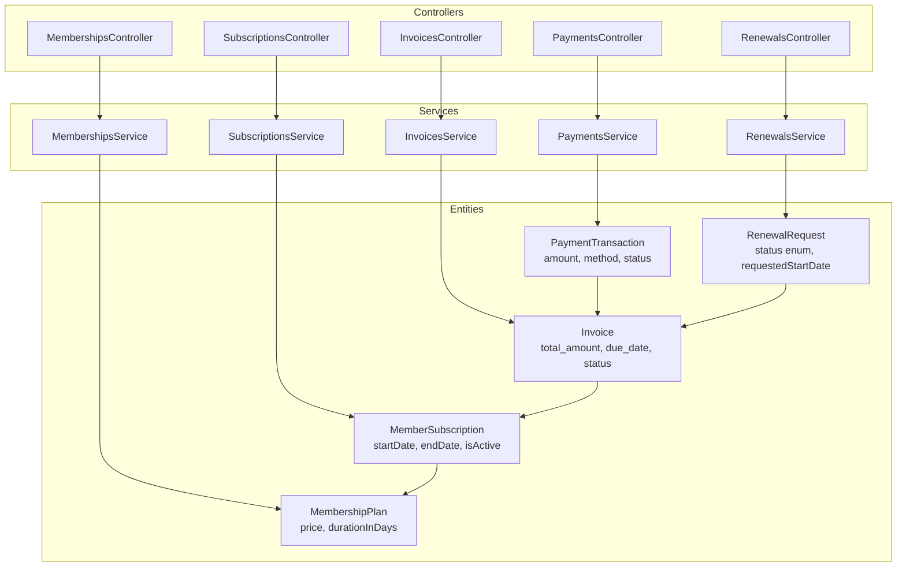
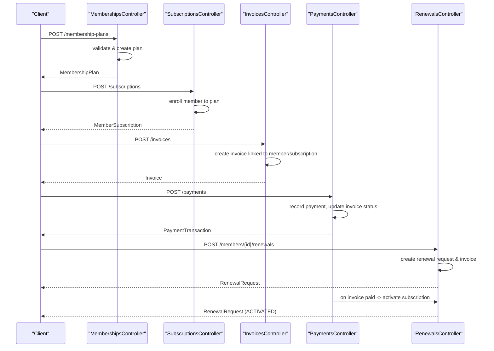
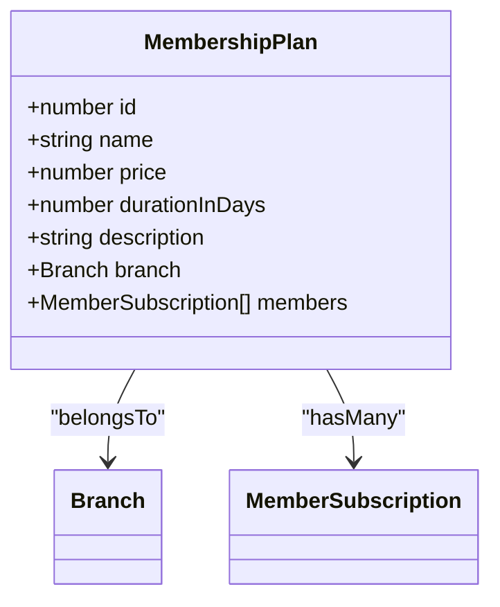
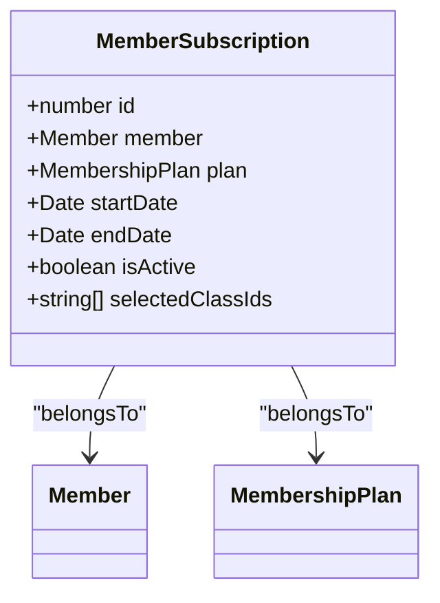
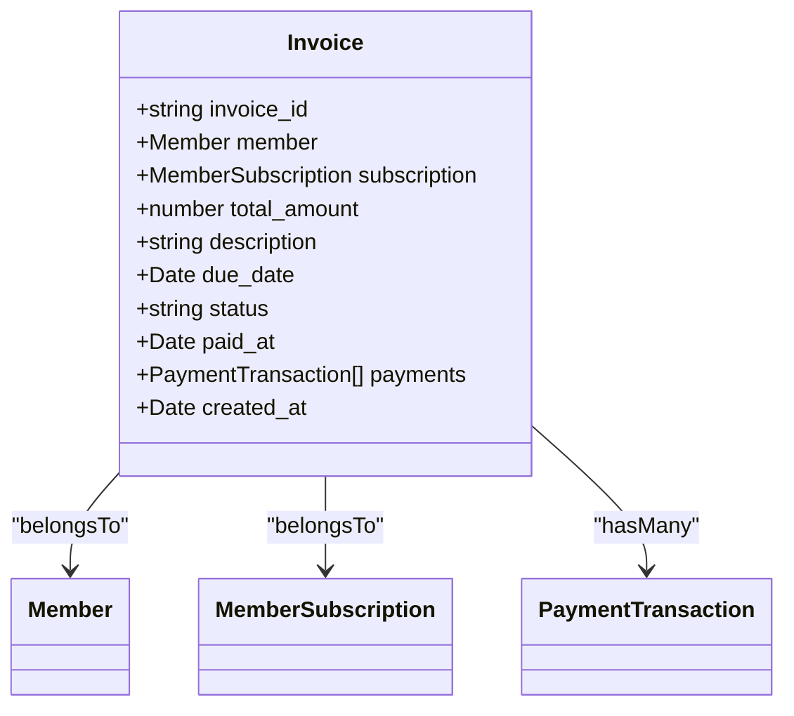
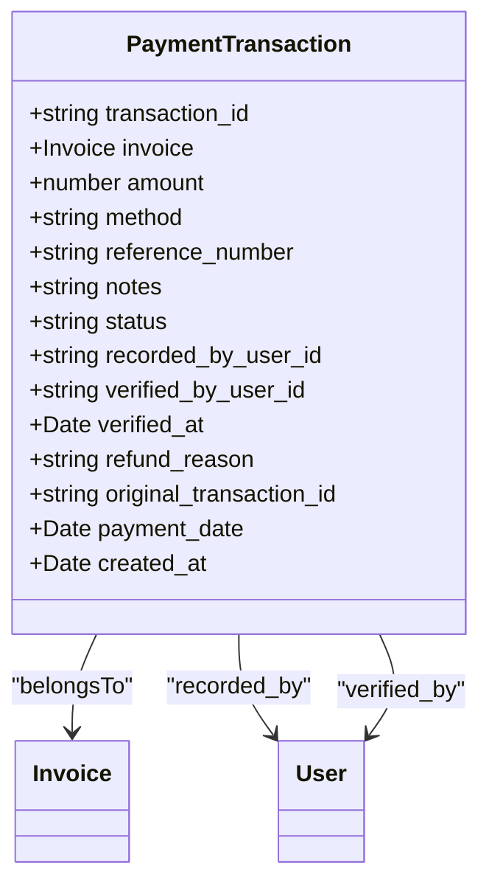
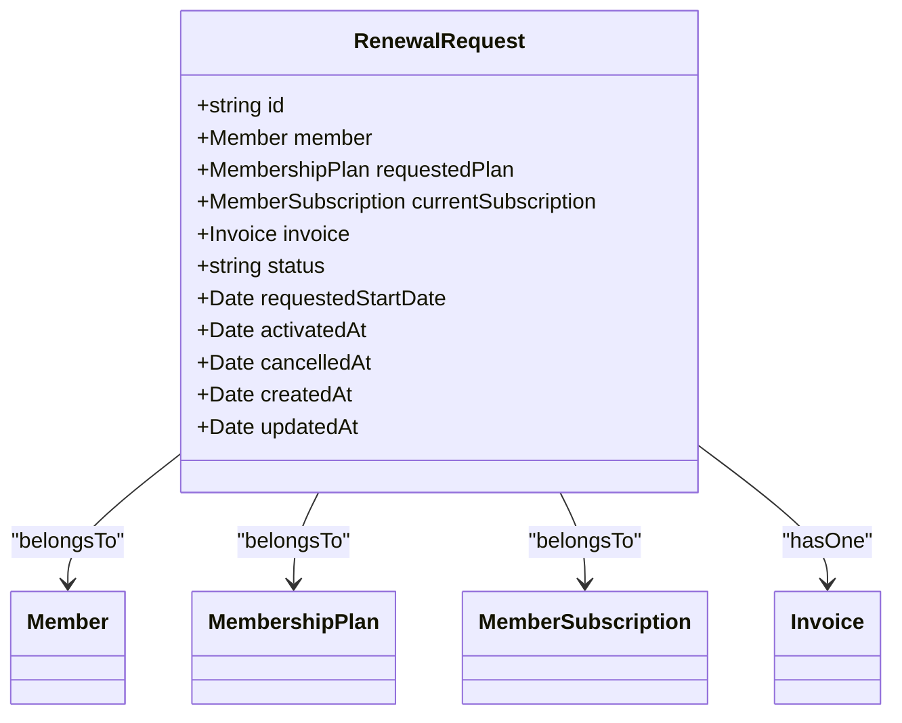
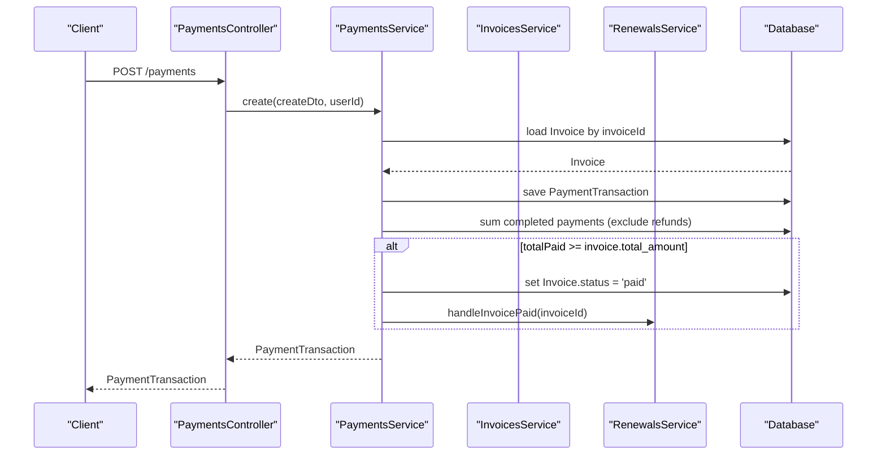
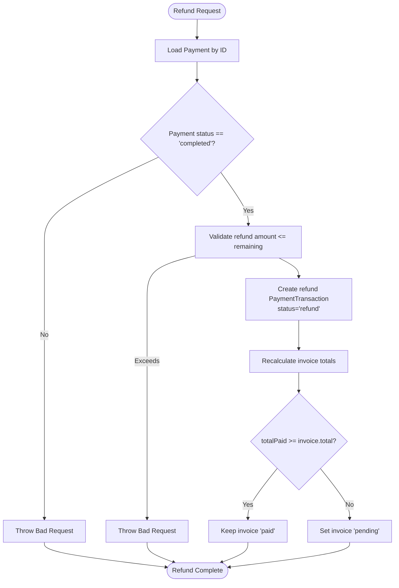
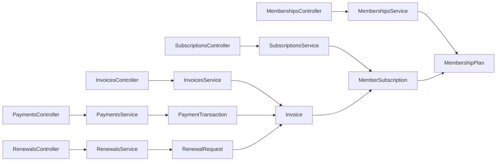

# Financial Operations

<cite>
**Referenced Files in This Document**
- [membership_plans.entity.ts](file://src/entities/membership_plans.entity.ts)
- [member_subscriptions.entity.ts](file://src/entities/member_subscriptions.entity.ts)
- [invoices.entity.ts](file://src/entities/invoices.entity.ts)
- [payment_transactions.entity.ts](file://src/entities/payment_transactions.entity.ts)
- [renewal_requests.entity.ts](file://src/entities/renewal_requests.entity.ts)
- [membership-plans.controller.ts](file://src/membership-plans/membership-plans.controller.ts)
- [membership-plans.service.ts](file://src/membership-plans/membership-plans.service.ts)
- [subscriptions.controller.ts](file://src/subscriptions/subscriptions.controller.ts)
- [subscriptions.service.ts](file://src/subscriptions/subscriptions.service.ts)
- [payments.controller.ts](file://src/payments/payments.controller.ts)
- [payments.service.ts](file://src/payments/payments.service.ts)
- [invoices.controller.ts](file://src/invoices/invoices.controller.ts)
- [invoices.service.ts](file://src/invoices/invoices.service.ts)
- [renewals.controller.ts](file://src/renewals/renewals.controller.ts)
- [renewals.service.ts](file://src/renewals/renewals.service.ts)
</cite>

## Table of Contents
1. [Introduction](#introduction)
2. [Project Structure](#project-structure)
3. [Core Components](#core-components)
4. [Architecture Overview](#architecture-overview)
5. [Detailed Component Analysis](#detailed-component-analysis)
6. [Dependency Analysis](#dependency-analysis)
7. [Performance Considerations](#performance-considerations)
8. [Troubleshooting Guide](#troubleshooting-guide)
9. [Conclusion](#conclusion)
10. [Appendices](#appendices)

## Introduction
This document explains the financial operations module responsible for membership plan management, subscription enrollment, invoicing, and payment processing. It covers how membership plans are created, how members enroll and renew subscriptions, how invoices are generated and tracked, and how payments are recorded, verified, refunded, and reconciled. It also documents integration points with member management, training programs, and notifications, along with workflows for tax calculations, discounts, and subscription modifications.

## Project Structure
The financial domain is organized around four primary modules:
- Membership Plans: define pricing, duration, and availability
- Subscriptions: manage enrollment, billing cycles, and active state
- Invoices: track amounts owed, due dates, and statuses
- Payments: record transactions, verify entries, process refunds, and reconcile

**Diagram sources**
- [membership_plans.entity.ts:11-33](file://src/entities/membership_plans.entity.ts#L11-L33)
- [member_subscriptions.entity.ts:14-70](file://src/entities/member_subscriptions.entity.ts#L14-L70)
- [invoices.entity.ts:13-48](file://src/entities/invoices.entity.ts#L13-L48)
- [payment_transactions.entity.ts:12-73](file://src/entities/payment_transactions.entity.ts#L12-L73)
- [renewal_requests.entity.ts:25-64](file://src/entities/renewal_requests.entity.ts#L25-L64)
- [membership-plans.controller.ts:28-304](file://src/membership-plans/membership-plans.controller.ts#L28-L304)
- [subscriptions.controller.ts:26-800](file://src/subscriptions/subscriptions.controller.ts#L26-L800)
- [invoices.controller.ts:25-429](file://src/invoices/invoices.controller.ts#L25-L429)
- [payments.controller.ts:30-673](file://src/payments/payments.controller.ts#L30-L673)
- [renewals.controller.ts:16-57](file://src/renewals/renewals.controller.ts#L16-L57)

**Section sources**
- [membership-plans.controller.ts:28-304](file://src/membership-plans/membership-plans.controller.ts#L28-L304)
- [subscriptions.controller.ts:26-800](file://src/subscriptions/subscriptions.controller.ts#L26-L800)
- [invoices.controller.ts:25-429](file://src/invoices/invoices.controller.ts#L25-L429)
- [payments.controller.ts:30-673](file://src/payments/payments.controller.ts#L30-L673)
- [renewals.controller.ts:16-57](file://src/renewals/renewals.controller.ts#L16-L57)

## Core Components
- Membership Plans: Define pricing, duration, and branch association; support filtering and lookup by branch/gym.
- Subscriptions: Enroll members to plans, compute end dates, enforce active state, and support updates.
- Invoices: Track totals, due dates, statuses, and link to subscriptions and payments.
- Payments: Record transactions, verify pending entries, process refunds, and reconcile invoices.
- Renewals: Manage renewal requests, invoice issuance, payment handling, and subscription activation.

Key responsibilities:
- Membership Plan Creation: Create, list, update, and delete plans with branch scoping.
- Subscription Enrollment: Enroll members to plans, calculate end dates, and maintain active state.
- Billing Cycles and Renewal Management: Generate renewal requests, invoice renewals, and activate subscriptions upon payment.
- Payment Processing: Record payments, verify entries, and handle partial/full refunds.
- Financial Reporting: Summarize payments by method/status and provide per-invoice payment summaries.
- Integration: Link with member management, training services, and notifications.

**Section sources**
- [membership-plans.service.ts:10-138](file://src/membership-plans/membership-plans.service.ts#L10-L138)
- [subscriptions.service.ts:15-152](file://src/subscriptions/subscriptions.service.ts#L15-L152)
- [invoices.service.ts:10-119](file://src/invoices/invoices.service.ts#L10-L119)
- [payments.service.ts:16-490](file://src/payments/payments.service.ts#L16-L490)
- [renewals.service.ts:16-179](file://src/renewals/renewals.service.ts#L16-L179)

## Architecture Overview
The financial operations module follows a layered architecture:
- Controllers expose REST endpoints with Swagger documentation and guard-based authentication.
- Services encapsulate business logic, validation, and orchestration.
- Entities define the persistence model and relationships.
- Utilities support shared logic (e.g., active state computation).

**Diagram sources**
- [membership-plans.controller.ts:33-83](file://src/membership-plans/membership-plans.controller.ts#L33-L83)
- [subscriptions.controller.ts:31-166](file://src/subscriptions/subscriptions.controller.ts#L31-L166)
- [invoices.controller.ts:30-99](file://src/invoices/invoices.controller.ts#L30-L99)
- [payments.controller.ts:35-133](file://src/payments/payments.controller.ts#L35-L133)
- [renewals.controller.ts:43-49](file://src/renewals/renewals.controller.ts#L43-L49)
- [payments.service.ts:26-79](file://src/payments/payments.service.ts#L26-L79)
- [renewals.service.ts:124-177](file://src/renewals/renewals.service.ts#L124-L177)

## Detailed Component Analysis

### Membership Plans
- Purpose: Define membership offerings with price, duration, and optional branch association.
- Key operations:
  - Create plan with branch validation
  - List plans with filters (branch, min/max price)
  - Retrieve plan details
  - Update plan (including branch)
  - Delete plan
  - Lookup plans by branch or gym

**Diagram sources**
- [membership_plans.entity.ts:11-33](file://src/entities/membership_plans.entity.ts#L11-L33)

**Section sources**
- [membership-plans.controller.ts:33-303](file://src/membership-plans/membership-plans.controller.ts#L33-L303)
- [membership-plans.service.ts:21-138](file://src/membership-plans/membership-plans.service.ts#L21-L138)

### Subscriptions
- Purpose: Enroll members to membership plans, compute end dates, and manage active state.
- Key operations:
  - Create subscription for a member and plan
  - List and query subscriptions with analytics
  - Retrieve subscription details
  - Update subscription (start/end dates, active state, selected classes)
  - Cancel and remove subscriptions

**Diagram sources**
- [member_subscriptions.entity.ts:14-70](file://src/entities/member_subscriptions.entity.ts#L14-L70)

**Section sources**
- [subscriptions.controller.ts:31-800](file://src/subscriptions/subscriptions.controller.ts#L31-L800)
- [subscriptions.service.ts:26-152](file://src/subscriptions/subscriptions.service.ts#L26-L152)

### Invoices
- Purpose: Track amounts owed, due dates, and statuses; link to subscriptions and payments.
- Key operations:
  - Create invoice for a member and optional subscription
  - List and query invoices
  - Retrieve invoice details
  - Update invoice (amount, description, due date)
  - Cancel invoice
  - Mark invoice as paid

**Diagram sources**
- [invoices.entity.ts:13-48](file://src/entities/invoices.entity.ts#L13-L48)

**Section sources**
- [invoices.controller.ts:30-429](file://src/invoices/invoices.controller.ts#L30-L429)
- [invoices.service.ts:21-119](file://src/invoices/invoices.service.ts#L21-L119)

### Payments
- Purpose: Record payment transactions, verify entries, process refunds, and reconcile invoices.
- Key operations:
  - Record payment against an invoice
  - Verify or reject pending payments
  - Issue refunds with validation
  - Query payments and summaries
  - Retrieve per-invoice payment summaries
  - Generate receipts

**Diagram sources**
- [payment_transactions.entity.ts:12-73](file://src/entities/payment_transactions.entity.ts#L12-L73)

**Section sources**
- [payments.controller.ts:35-673](file://src/payments/payments.controller.ts#L35-L673)
- [payments.service.ts:26-490](file://src/payments/payments.service.ts#L26-L490)

### Renewals
- Purpose: Manage renewal requests, invoice issuance, payment handling, and subscription activation.
- Key operations:
  - Create renewal request for a member
  - List and query renewal requests
  - Cancel renewal requests
  - Handle invoice paid events to activate subscriptions

**Diagram sources**
- [renewal_requests.entity.ts:25-64](file://src/entities/renewal_requests.entity.ts#L25-L64)

**Section sources**
- [renewals.controller.ts:23-57](file://src/renewals/renewals.controller.ts#L23-L57)
- [renewals.service.ts:32-179](file://src/renewals/renewals.service.ts#L32-L179)

### Payment Processing Workflow
End-to-end payment processing flow:

**Diagram sources**
- [payments.controller.ts:128-133](file://src/payments/payments.controller.ts#L128-L133)
- [payments.service.ts:26-79](file://src/payments/payments.service.ts#L26-L79)
- [renewals.service.ts:124-135](file://src/renewals/renewals.service.ts#L124-L135)

### Refund Procedures
Refund workflow:

**Diagram sources**
- [payments.service.ts:206-301](file://src/payments/payments.service.ts#L206-L301)

### Financial Reporting
- Payment summaries by method/status with optional date/branch filters.
- Per-invoice payment summaries including totals, remaining balances, and payment counts.
- Receipt generation with payment, invoice, and member details.

**Section sources**
- [payments.controller.ts:161-205](file://src/payments/payments.controller.ts#L161-L205)
- [payments.controller.ts:528-588](file://src/payments/payments.controller.ts#L528-L588)
- [payments.service.ts:345-424](file://src/payments/payments.service.ts#L345-L424)
- [payments.service.ts:303-343](file://src/payments/payments.service.ts#L303-L343)
- [payments.service.ts:426-488](file://src/payments/payments.service.ts#L426-L488)

### Integration with Member Management, Training Programs, and Notifications
- Member management: Invoices and subscriptions link to members; renewal requests reference member and current subscription.
- Training programs: Invoices can be created for services like personal training; subscriptions grant access benefits.
- Notifications: Renewal invoice creation and activation triggers reminder notifications.

**Section sources**
- [invoices.service.ts:21-54](file://src/invoices/invoices.service.ts#L21-L54)
- [renewals.service.ts:32-94](file://src/renewals/renewals.service.ts#L32-L94)
- [renewals.service.ts:174-176](file://src/renewals/renewals.service.ts#L174-L176)

### Practical Examples

- Setting up a membership plan
  - Use the memberships controller to create a plan with name, price, duration, and optional branch.
  - Example payload shape is documented in controller examples.

  **Section sources**
  - [membership-plans.controller.ts:78-80](file://src/membership-plans/membership-plans.controller.ts#L78-L80)

- Processing a member enrollment
  - Use the subscriptions controller to enroll a member to a plan; the service computes end date from plan duration and marks as active.

  **Section sources**
  - [subscriptions.controller.ts:164-166](file://src/subscriptions/subscriptions.controller.ts#L164-L166)
  - [subscriptions.service.ts:26-67](file://src/subscriptions/subscriptions.service.ts#L26-L67)

- Handling payment failures
  - Use the payments controller to verify a pending payment as failed; the service recalculates invoice status accordingly.

  **Section sources**
  - [payments.controller.ts:276-357](file://src/payments/payments.controller.ts#L276-L357)
  - [payments.service.ts:156-204](file://src/payments/payments.service.ts#L156-L204)

- Generating financial reports
  - Use the payments controller to fetch payment summaries and per-invoice payment summaries with optional filters.

  **Section sources**
  - [payments.controller.ts:161-205](file://src/payments/payments.controller.ts#L161-L205)
  - [payments.controller.ts:528-588](file://src/payments/payments.controller.ts#L528-L588)

- Tax calculations, discount management, and subscription modification workflows
  - Tax and discount logic are not present in the current codebase. To implement:
    - Extend invoice creation to accept tax rate/discount fields and compute totals.
    - Add discount codes and validation in invoice creation/update.
    - Modify subscription updates to support proration and plan changes with prorate calculations.

  [No sources needed since this section provides implementation guidance]

## Dependency Analysis
- Controllers depend on services for business logic.
- Services depend on repositories for persistence and on each other for cross-cutting operations (e.g., PaymentsService invokes RenewalsService).
- Entities define relationships: MemberSubscription belongs to Member and MembershipPlan; Invoice belongs to Member and optionally MemberSubscription; PaymentTransaction belongs to Invoice; RenewalRequest links Member, MembershipPlan, MemberSubscription, and Invoice.

**Diagram sources**
- [membership-plans.controller.ts:30-31](file://src/membership-plans/membership-plans.controller.ts#L30-L31)
- [subscriptions.controller.ts:29-30](file://src/subscriptions/subscriptions.controller.ts#L29-L30)
- [invoices.controller.ts:28-29](file://src/invoices/invoices.controller.ts#L28-L29)
- [payments.controller.ts:33-34](file://src/payments/payments.controller.ts#L33-L34)
- [renewals.controller.ts:21-22](file://src/renewals/renewals.controller.ts#L21-L22)

**Section sources**
- [membership-plans.service.ts:12-19](file://src/membership-plans/membership-plans.service.ts#L12-L19)
- [subscriptions.service.ts:17-24](file://src/subscriptions/subscriptions.service.ts#L17-L24)
- [invoices.service.ts:12-19](file://src/invoices/invoices.service.ts#L12-L19)
- [payments.service.ts:18-24](file://src/payments/payments.service.ts#L18-L24)
- [renewals.service.ts:18-30](file://src/renewals/renewals.service.ts#L18-L30)

## Performance Considerations
- Use pagination and filtering in subscription and payment queries to avoid large result sets.
- Index frequently queried fields (e.g., invoice_id, member_id, subscription_id, created_at).
- Batch operations for bulk payment summaries and reporting.
- Minimize N+1 queries by leveraging TypeORM relations and joins.

[No sources needed since this section provides general guidance]

## Troubleshooting Guide
Common issues and resolutions:
- Payment amount exceeds invoice total: Ensure payment amount does not exceed invoice total; adjust or split payments.
- Invalid payment method: Confirm method is one of supported values.
- Cannot verify non-pending payment: Only pending payments can be verified.
- Cannot refund non-completed payment: Only completed payments can be refunded.
- Invoice already paid or cancelled: Cannot add payment to paid or cancelled invoices.
- Active renewal request exists: Cancel or finalize existing renewal before creating a new one.

**Section sources**
- [payments.controller.ts:48-93](file://src/payments/payments.controller.ts#L48-L93)
- [payments.controller.ts:289-350](file://src/payments/payments.controller.ts#L289-L350)
- [payments.controller.ts:394-451](file://src/payments/payments.controller.ts#L394-L451)
- [payments.service.ts:37-43](file://src/payments/payments.service.ts#L37-L43)
- [payments.service.ts:171-175](file://src/payments/payments.service.ts#L171-L175)
- [payments.service.ts:221-225](file://src/payments/payments.service.ts#L221-L225)
- [renewals.service.ts:48-62](file://src/renewals/renewals.service.ts#L48-L62)

## Conclusion
The financial operations module provides a robust foundation for managing membership plans, subscriptions, invoicing, and payments. It supports essential workflows such as enrollment, renewal, payment recording, verification, and refunds, with clear integration points for member management and notifications. Extending the system to support taxes, discounts, and advanced subscription modifications requires adding fields and validation logic to invoices and subscriptions while preserving current workflows.

## Appendices

### API Endpoints Overview
- Membership Plans: Create, list, retrieve, update, delete; branch/gym lookups
- Subscriptions: Create, list, retrieve, update, cancel, remove
- Invoices: Create, list, retrieve, update, cancel
- Payments: Create, list, retrieve, verify, refund, summaries, receipts
- Renewals: Create, list, retrieve, cancel; per-member endpoints

**Section sources**
- [membership-plans.controller.ts:33-344](file://src/membership-plans/membership-plans.controller.ts#L33-L344)
- [subscriptions.controller.ts:31-800](file://src/subscriptions/subscriptions.controller.ts#L31-L800)
- [invoices.controller.ts:30-429](file://src/invoices/invoices.controller.ts#L30-L429)
- [payments.controller.ts:35-673](file://src/payments/payments.controller.ts#L35-L673)
- [renewals.controller.ts:23-57](file://src/renewals/renewals.controller.ts#L23-L57)