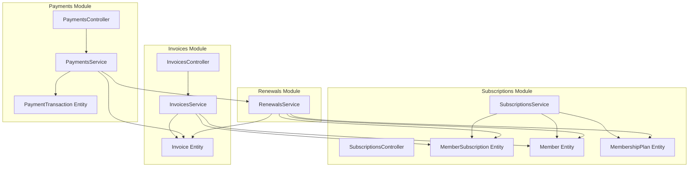
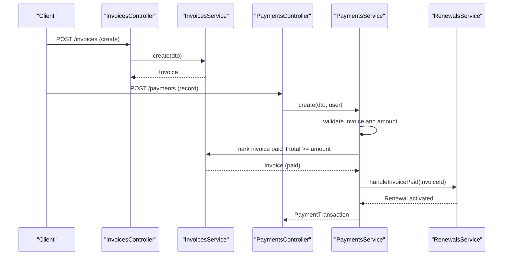
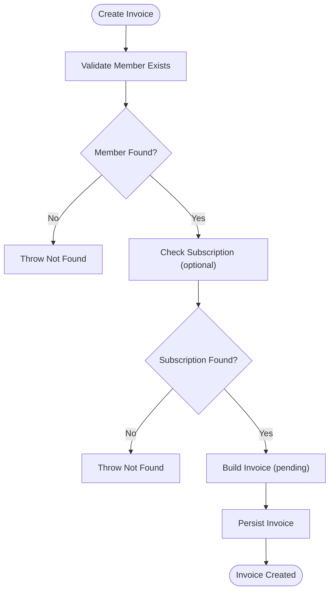
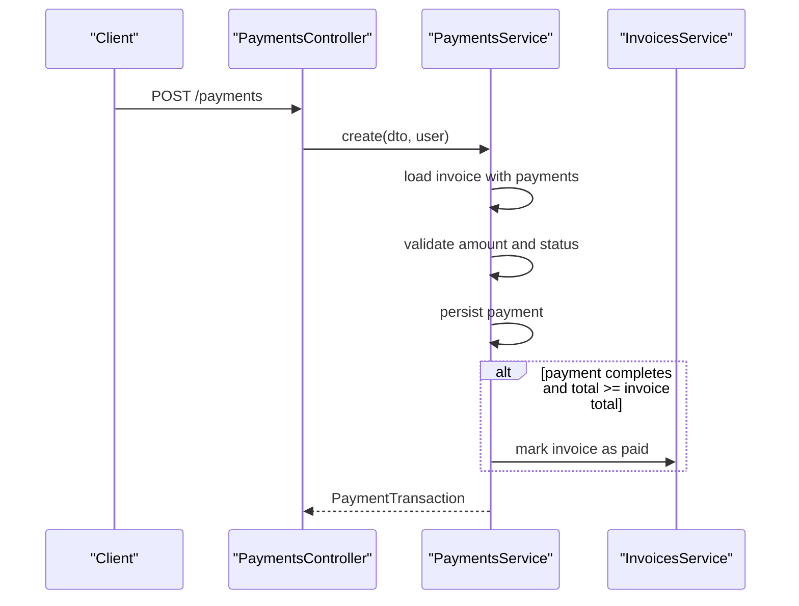
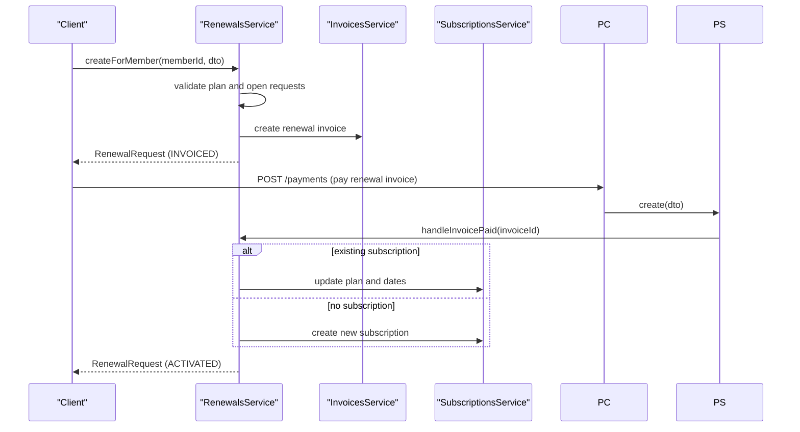
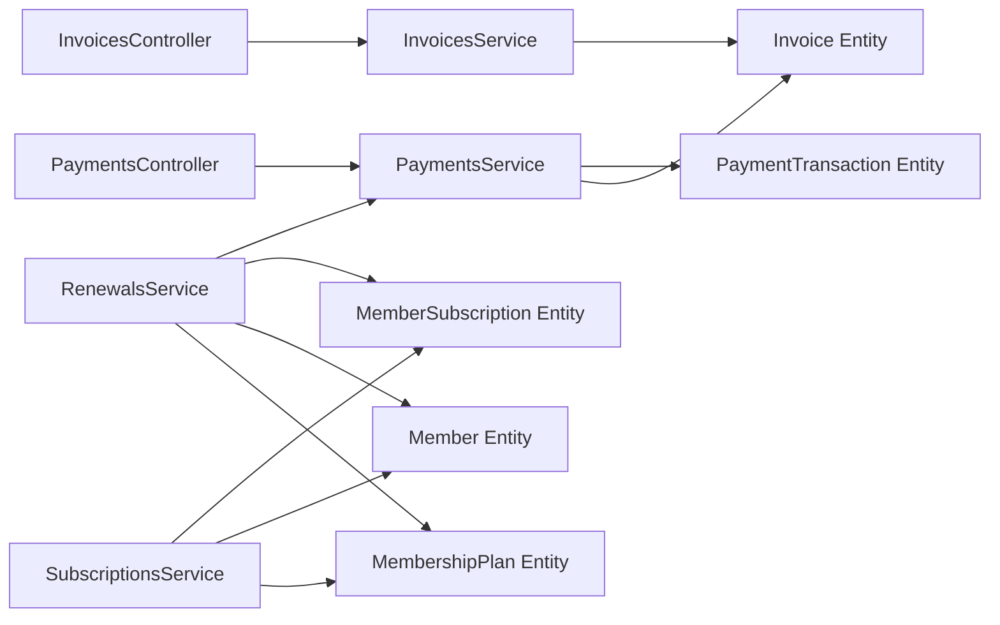

# Invoicing System

<cite>
**Referenced Files in This Document**
- [invoices.controller.ts](file://src/invoices/invoices.controller.ts)
- [invoices.service.ts](file://src/invoices/invoices.service.ts)
- [invoices.module.ts](file://src/invoices/invoices.module.ts)
- [create-invoice.dto.ts](file://src/invoices/dto/create-invoice.dto.ts)
- [update-invoice.dto.ts](file://src/invoices/dto/update-invoice.dto.ts)
- [invoices.entity.ts](file://src/entities/invoices.entity.ts)
- [payment_transactions.entity.ts](file://src/entities/payment_transactions.entity.ts)
- [member_subscriptions.entity.ts](file://src/entities/member_subscriptions.entity.ts)
- [members.entity.ts](file://src/entities/members.entity.ts)
- [membership_plans.entity.ts](file://src/entities/membership_plans.entity.ts)
- [payments.controller.ts](file://src/payments/payments.controller.ts)
- [payments.service.ts](file://src/payments/payments.service.ts)
- [subscriptions.controller.ts](file://src/subscriptions/subscriptions.controller.ts)
- [subscriptions.service.ts](file://src/subscriptions/subscriptions.service.ts)
- [renewals.service.ts](file://src/renewals/renewals.service.ts)
</cite>

## Table of Contents
1. [Introduction](#introduction)
2. [Project Structure](#project-structure)
3. [Core Components](#core-components)
4. [Architecture Overview](#architecture-overview)
5. [Detailed Component Analysis](#detailed-component-analysis)
6. [Dependency Analysis](#dependency-analysis)
7. [Performance Considerations](#performance-considerations)
8. [Troubleshooting Guide](#troubleshooting-guide)
9. [Conclusion](#conclusion)

## Introduction
This document describes the invoicing system for a gym management application. It covers invoice generation, management, and tracking, including:
- Manual invoice creation for services and memberships
- Automated invoice generation for renewals
- Invoice status management and payment tracking
- Overdue invoice handling and integration with payment processing
- Subscription management and financial reporting
- Practical examples for membership and service invoices
- Invoice numbering, tax/discount handling, history tracking, delivery, and archiving

## Project Structure
The invoicing system spans several modules:
- Invoices module: invoice CRUD, retrieval, and cancellation
- Payments module: payment recording, verification, refunds, and summaries
- Subscriptions module: membership plan assignment and lifecycle
- Renewals module: renewal request processing and invoice-to-subscription activation
- Entities: domain models for invoices, payments, subscriptions, members, and plans



**Diagram sources**
- [invoices.controller.ts:27-355](file://src/invoices/invoices.controller.ts#L27-L355)
- [invoices.service.ts:11-118](file://src/invoices/invoices.service.ts#L11-L118)
- [invoices.entity.ts:14-48](file://src/entities/invoices.entity.ts#L14-L48)
- [payments.controller.ts:32-451](file://src/payments/payments.controller.ts#L32-L451)
- [payments.service.ts:17-489](file://src/payments/payments.service.ts#L17-L489)
- [payment_transactions.entity.ts:13-73](file://src/entities/payment_transactions.entity.ts#L13-L73)
- [subscriptions.controller.ts:28-800](file://src/subscriptions/subscriptions.controller.ts#L28-L800)
- [subscriptions.service.ts:16-151](file://src/subscriptions/subscriptions.service.ts#L16-L151)
- [member_subscriptions.entity.ts:15-70](file://src/entities/member_subscriptions.entity.ts#L15-L70)
- [members.entity.ts:26-99](file://src/entities/members.entity.ts#L26-L99)
- [membership_plans.entity.ts:12-33](file://src/entities/membership_plans.entity.ts#L12-L33)
- [renewals.service.ts:17-178](file://src/renewals/renewals.service.ts#L17-L178)

**Section sources**
- [invoices.module.ts:12-18](file://src/invoices/invoices.module.ts#L12-L18)

## Core Components
- InvoicesController: Exposes endpoints to create, list, retrieve, update, and cancel invoices; also provides member-specific invoice queries.
- InvoicesService: Implements business logic for invoice creation, updates, cancellations, and lookup with validation and relations loading.
- PaymentsController: Records payments, verifies or rejects them, issues refunds, and provides payment summaries and receipts.
- PaymentsService: Manages payment lifecycle, validates amounts, marks invoices paid, triggers renewal activation, and computes summaries.
- SubscriptionsService: Creates and manages membership subscriptions, ensuring active state and plan durations.
- RenewalsService: Generates renewal invoices, tracks renewal requests, and activates subscriptions upon payment.
- Entities: Define the data model for invoices, payments, subscriptions, members, and plans with relationships and constraints.

**Section sources**
- [invoices.controller.ts:30-354](file://src/invoices/invoices.controller.ts#L30-L354)
- [invoices.service.ts:21-118](file://src/invoices/invoices.service.ts#L21-L118)
- [payments.controller.ts:35-451](file://src/payments/payments.controller.ts#L35-L451)
- [payments.service.ts:26-489](file://src/payments/payments.service.ts#L26-L489)
- [subscriptions.service.ts:26-151](file://src/subscriptions/subscriptions.service.ts#L26-L151)
- [renewals.service.ts:32-177](file://src/renewals/renewals.service.ts#L32-L177)
- [invoices.entity.ts:14-48](file://src/entities/invoices.entity.ts#L14-L48)
- [payment_transactions.entity.ts:13-73](file://src/entities/payment_transactions.entity.ts#L13-L73)
- [member_subscriptions.entity.ts:15-70](file://src/entities/member_subscriptions.entity.ts#L15-L70)
- [members.entity.ts:26-99](file://src/entities/members.entity.ts#L26-L99)
- [membership_plans.entity.ts:12-33](file://src/entities/membership_plans.entity.ts#L12-L33)

## Architecture Overview
The invoicing system integrates closely with payments and subscriptions:
- Invoices are created manually or automatically via renewals.
- Payments update invoice status and trigger renewal activation.
- Subscriptions manage membership lifecycle and plan associations.
- Reports and summaries support financial oversight.



**Diagram sources**
- [invoices.controller.ts:30-99](file://src/invoices/invoices.controller.ts#L30-L99)
- [invoices.service.ts:21-54](file://src/invoices/invoices.service.ts#L21-L54)
- [payments.controller.ts:128-133](file://src/payments/payments.controller.ts#L128-L133)
- [payments.service.ts:26-79](file://src/payments/payments.service.ts#L26-L79)
- [renewals.service.ts:124-177](file://src/renewals/renewals.service.ts#L124-L177)

## Detailed Component Analysis

### Invoice Management
- Creation: Validates member existence, optionally validates subscription, sets initial status to pending, and persists invoice.
- Retrieval: Supports fetching all invoices with relations, single invoice by UUID, and member-specific invoices.
- Updates: Allows modifying amount, description, and due date while preserving audit trail.
- Cancellation: Transitions invoice to cancelled state; prevents further payments.



**Diagram sources**
- [invoices.service.ts:21-54](file://src/invoices/invoices.service.ts#L21-L54)
- [create-invoice.dto.ts:11-39](file://src/invoices/dto/create-invoice.dto.ts#L11-L39)

**Section sources**
- [invoices.controller.ts:30-354](file://src/invoices/invoices.controller.ts#L30-L354)
- [invoices.service.ts:21-118](file://src/invoices/invoices.service.ts#L21-L118)
- [create-invoice.dto.ts:11-39](file://src/invoices/dto/create-invoice.dto.ts#L11-L39)
- [update-invoice.dto.ts:4-4](file://src/invoices/dto/update-invoice.dto.ts#L4-L4)
- [invoices.entity.ts:14-48](file://src/entities/invoices.entity.ts#L14-L48)

### Payment Processing and Status Management
- Recording payments: Validates invoice existence and state, ensures amount validity, and records payment with method and notes.
- Verification: Allows authorized users to approve or reject pending payments; recalculates totals and updates invoice status accordingly.
- Refunds: Supports full and partial refunds with validation and maintains audit trail via original transaction linkage.
- Summaries: Provides payment summaries by method/status and per-invoice payment summaries.



**Diagram sources**
- [payments.controller.ts:128-133](file://src/payments/payments.controller.ts#L128-L133)
- [payments.service.ts:26-79](file://src/payments/payments.service.ts#L26-L79)
- [invoices.service.ts:113-117](file://src/invoices/invoices.service.ts#L113-L117)

**Section sources**
- [payments.controller.ts:35-451](file://src/payments/payments.controller.ts#L35-L451)
- [payments.service.ts:26-489](file://src/payments/payments.service.ts#L26-L489)
- [payment_transactions.entity.ts:13-73](file://src/entities/payment_transactions.entity.ts#L13-L73)

### Automated Invoice Generation for Subscriptions and Renewals
- Renewal invoices: When a member requests renewal, a pending invoice is created linked to the requested plan and subscription, with a due date extended from creation.
- Activation: Upon payment, renewal status transitions to paid, then activated, and the subscription is updated or a new one created with adjusted dates.



**Diagram sources**
- [renewals.service.ts:32-94](file://src/renewals/renewals.service.ts#L32-L94)
- [renewals.service.ts:124-177](file://src/renewals/renewals.service.ts#L124-L177)
- [payments.controller.ts:128-133](file://src/payments/payments.controller.ts#L128-L133)
- [payments.service.ts:75-76](file://src/payments/payments.service.ts#L75-L76)
- [subscriptions.service.ts:156-151](file://src/subscriptions/subscriptions.service.ts#L156-L151)

**Section sources**
- [renewals.service.ts:32-177](file://src/renewals/renewals.service.ts#L32-L177)
- [subscriptions.service.ts:26-151](file://src/subscriptions/subscriptions.service.ts#L26-L151)

### Data Model Relationships
```mermaid
erDiagram
MEMBERS {
int id PK
string email UK
string fullName
boolean isActive
int? subscriptionId FK
}
MEMBERSHIP_PLANS {
int id PK
string name
int price
int durationInDays
}
MEMBER_SUBSCRIPTIONS {
int id PK
int memberId FK
int planId FK
timestamp startDate
timestamp endDate
boolean isActive
}
INVOICES {
uuid invoice_id PK
int memberId FK
int? subscriptionId FK
decimal total_amount
text? description
date? due_date
enum status
timestamp? paid_at
}
PAYMENT_TRANSACTIONS {
uuid transaction_id PK
uuid invoice_id FK
decimal amount
enum method
text? reference_number
text? notes
enum status
uuid? recorded_by_user_id FK
uuid? verified_by_user_id FK
timestamp? verified_at
text? refund_reason
uuid? original_transaction_id FK
date? payment_date
}
MEMBERS ||--o| MEMBER_SUBSCRIPTIONS : "has"
MEMBER_SUBSCRIPTIONS ||--o{ INVOICES : "generates"
MEMBERS ||--o{ INVOICES : "has"
INVOICES ||--o{ PAYMENT_TRANSACTIONS : "has"
```

**Diagram sources**
- [members.entity.ts:26-99](file://src/entities/members.entity.ts#L26-L99)
- [membership_plans.entity.ts:12-33](file://src/entities/membership_plans.entity.ts#L12-L33)
- [member_subscriptions.entity.ts:15-70](file://src/entities/member_subscriptions.entity.ts#L15-L70)
- [invoices.entity.ts:14-48](file://src/entities/invoices.entity.ts#L14-L48)
- [payment_transactions.entity.ts:13-73](file://src/entities/payment_transactions.entity.ts#L13-L73)

**Section sources**
- [members.entity.ts:26-123](file://src/entities/members.entity.ts#L26-L123)
- [membership_plans.entity.ts:12-33](file://src/entities/membership_plans.entity.ts#L12-L33)
- [member_subscriptions.entity.ts:15-70](file://src/entities/member_subscriptions.entity.ts#L15-L70)
- [invoices.entity.ts:14-48](file://src/entities/invoices.entity.ts#L14-L48)
- [payment_transactions.entity.ts:13-73](file://src/entities/payment_transactions.entity.ts#L13-L73)

### Practical Examples

#### Example 1: Generating a Membership Invoice
- Scenario: Create a monthly membership invoice for a member with an associated subscription.
- Steps:
  - Validate member exists.
  - Optionally validate subscription exists.
  - Create invoice with total amount, description, and due date.
  - Save invoice with status pending.

**Section sources**
- [invoices.controller.ts:76-95](file://src/invoices/invoices.controller.ts#L76-L95)
- [invoices.service.ts:21-54](file://src/invoices/invoices.service.ts#L21-L54)
- [create-invoice.dto.ts:11-39](file://src/invoices/dto/create-invoice.dto.ts#L11-L39)

#### Example 2: Creating a Service Invoice (e.g., Personal Training)
- Scenario: Create a one-time service invoice for a member without a subscription.
- Steps:
  - Validate member exists.
  - Create invoice with service description and due date.
  - Save invoice with status pending.

**Section sources**
- [invoices.controller.ts:86-95](file://src/invoices/invoices.controller.ts#L86-L95)
- [invoices.service.ts:21-54](file://src/invoices/invoices.service.ts#L21-L54)

#### Example 3: Managing Invoice Modifications
- Scenario: Adjust amount or due date after creation.
- Steps:
  - Load invoice by ID.
  - Apply updates to amount, description, or due date.
  - Persist changes.

**Section sources**
- [invoices.controller.ts:262-280](file://src/invoices/invoices.controller.ts#L262-L280)
- [invoices.service.ts:89-105](file://src/invoices/invoices.service.ts#L89-L105)

#### Example 4: Invoice Cancellation
- Scenario: Cancel an invoice that was created in error.
- Steps:
  - Load invoice by ID.
  - Set status to cancelled.
  - Persist changes.

**Section sources**
- [invoices.controller.ts:285-354](file://src/invoices/invoices.controller.ts#L285-L354)
- [invoices.service.ts:107-111](file://src/invoices/invoices.service.ts#L107-L111)

### Integration with Payment Processing, Subscription Management, and Financial Reporting
- Payment recording updates invoice status to paid when total paid meets or exceeds invoice amount and triggers renewal activation if applicable.
- Payment verification allows authorized users to approve or reject pending payments.
- Refunds maintain audit trails and adjust invoice status if necessary.
- Financial reporting endpoints provide payment summaries and per-invoice payment summaries.

**Section sources**
- [payments.controller.ts:35-451](file://src/payments/payments.controller.ts#L35-L451)
- [payments.service.ts:26-489](file://src/payments/payments.service.ts#L26-L489)
- [renewals.service.ts:124-177](file://src/renewals/renewals.service.ts#L124-L177)

### Invoice Numbering Systems
- Invoices use a UUID primary key for global uniqueness.
- No auto-incrementing numeric invoice numbers are present in the current schema.

**Section sources**
- [invoices.entity.ts:15-16](file://src/entities/invoices.entity.ts#L15-L16)

### Tax Calculations, Discount Applications, and Invoice History Tracking
- Tax and discount fields are not present in the current invoice entity.
- Invoice history is implicitly tracked via the created_at timestamp and relation to payment transactions.

**Section sources**
- [invoices.entity.ts:46-47](file://src/entities/invoices.entity.ts#L46-L47)
- [payment_transactions.entity.ts:13-73](file://src/entities/payment_transactions.entity.ts#L13-L73)

### Invoice Delivery Mechanisms, Customer Portal Access, and Archiving Procedures
- Delivery mechanisms (email/SMS) and customer portal access are not implemented in the current codebase.
- Archiving procedures are not implemented in the current codebase.

[No sources needed since this section provides general guidance]

## Dependency Analysis
- InvoicesService depends on Member, MemberSubscription, and Invoice repositories for validation and persistence.
- PaymentsService depends on Invoice and PaymentTransaction repositories and coordinates with RenewalsService.
- RenewalsService depends on Member, MembershipPlan, Invoice, and MemberSubscription repositories.
- Controllers orchestrate DTO validation and response formatting using Swagger decorators.



**Diagram sources**
- [invoices.controller.ts:27-355](file://src/invoices/invoices.controller.ts#L27-L355)
- [invoices.service.ts:11-19](file://src/invoices/invoices.service.ts#L11-L19)
- [payments.controller.ts:32-451](file://src/payments/payments.controller.ts#L32-L451)
- [payments.service.ts:17-24](file://src/payments/payments.service.ts#L17-L24)
- [renewals.service.ts:17-30](file://src/renewals/renewals.service.ts#L17-L30)
- [subscriptions.service.ts:16-24](file://src/subscriptions/subscriptions.service.ts#L16-L24)

**Section sources**
- [invoices.module.ts:12-18](file://src/invoices/invoices.module.ts#L12-L18)

## Performance Considerations
- Prefer fetching invoices with relations only when needed to minimize payload size.
- Use pagination and filtering for listing endpoints to avoid large result sets.
- Index frequently queried columns (e.g., invoice_id, member_id, subscription_id) at the database level.
- Batch operations for bulk payment summaries and reporting.

[No sources needed since this section provides general guidance]

## Troubleshooting Guide
- Invoice not found: Ensure the UUID is correct and the invoice belongs to the requesting user’s scope.
- Member not found: Verify the member ID exists before creating invoices.
- Subscription not found: Confirm the subscription ID exists when associating invoices.
- Cannot add payment to cancelled invoice: Cancelled invoices cannot accept payments.
- Invoice already paid: Prevent duplicate payments by checking status before recording.
- Invalid refund amount: Refund cannot exceed the original payment amount and must be less than remaining refundable balance.
- Payment verification errors: Only pending payments can be verified; ensure status transitions are valid.

**Section sources**
- [invoices.controller.ts:54-72](file://src/invoices/invoices.controller.ts#L54-L72)
- [payments.controller.ts:40-93](file://src/payments/payments.controller.ts#L40-L93)
- [payments.service.ts:37-43](file://src/payments/payments.service.ts#L37-L43)
- [payments.service.ts:221-225](file://src/payments/payments.service.ts#L221-L225)
- [payments.service.ts:231-235](file://src/payments/payments.service.ts#L231-L235)
- [payments.service.ts:171-175](file://src/payments/payments.service.ts#L171-L175)

## Conclusion
The invoicing system provides robust capabilities for manual and automated invoice generation, comprehensive payment processing, and renewal-driven subscription activation. While advanced features like invoice numbering, tax/discount fields, and delivery mechanisms are not yet implemented, the modular architecture supports incremental enhancements. The current design emphasizes strong entity relationships, clear status management, and comprehensive reporting endpoints to support financial oversight and operational efficiency.