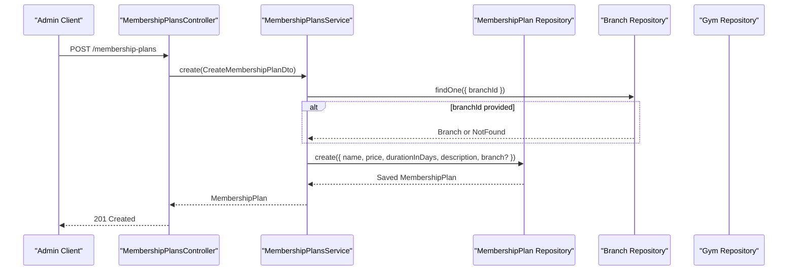
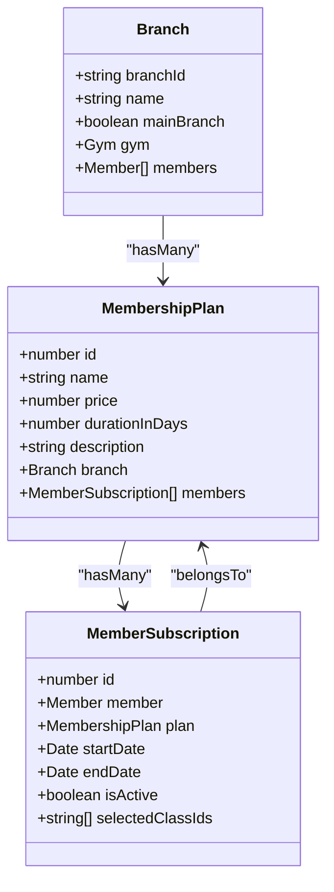
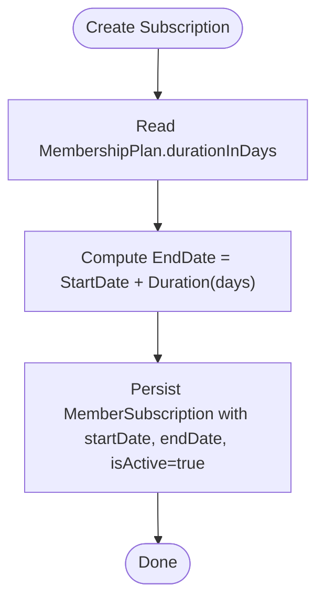
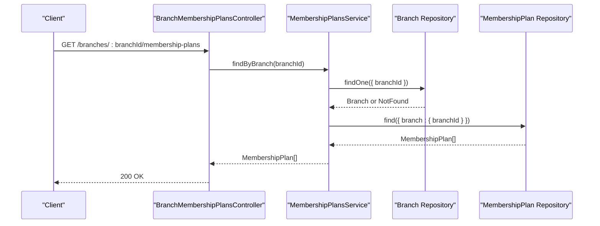
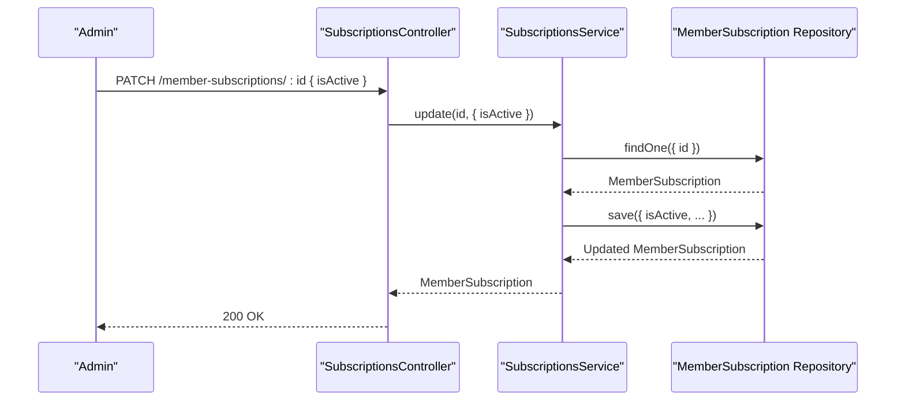
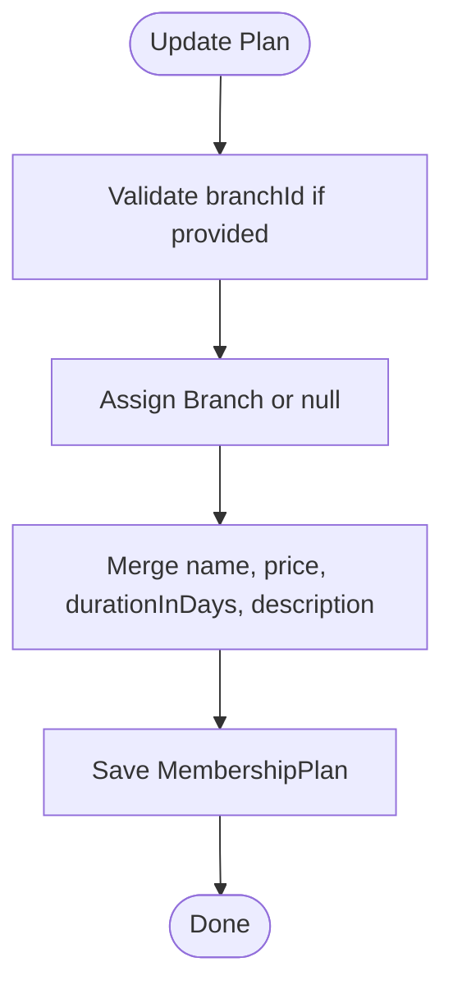
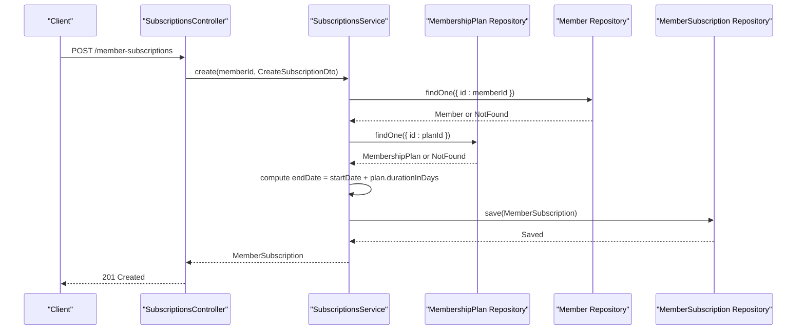
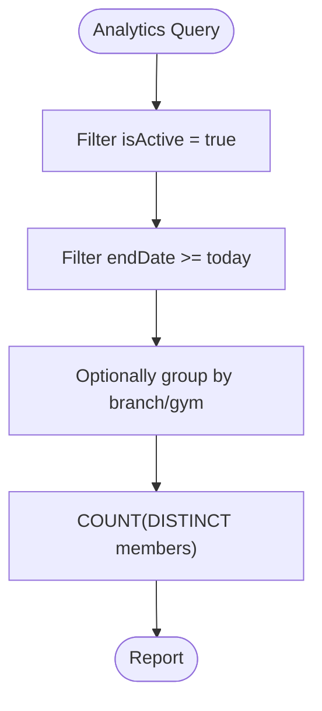
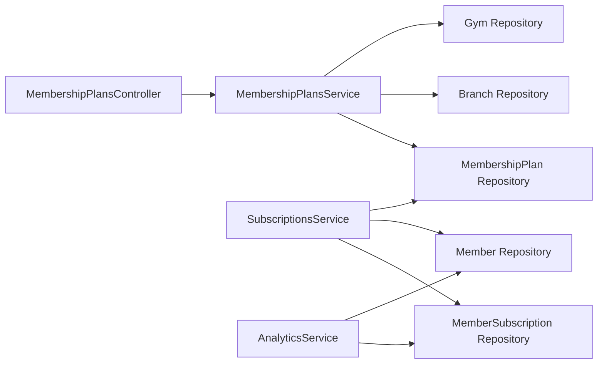

# Membership Plans

<cite>
**Referenced Files in This Document**
- [membership_plans.entity.ts](file://src/entities/membership_plans.entity.ts)
- [member_subscriptions.entity.ts](file://src/entities/member_subscriptions.entity.ts)
- [branch.entity.ts](file://src/entities/branch.entity.ts)
- [gym.entity.ts](file://src/entities/gym.entity.ts)
- [membership-plans.controller.ts](file://src/membership-plans/membership-plans.controller.ts)
- [membership-plans.service.ts](file://src/membership-plans/membership-plans.service.ts)
- [membership-plans.module.ts](file://src/membership-plans/membership-plans.module.ts)
- [create-membership-plan.dto.ts](file://src/membership-plans/dto/create-membership-plan.dto.ts)
- [update-membership-plan.dto.ts](file://src/membership-plans/dto/update-membership-plan.dto.ts)
- [subscriptions.service.ts](file://src/subscriptions/subscriptions.service.ts)
- [create-subscription.dto.ts](file://src/subscriptions/dto/create-subscription.dto.ts)
- [subscription.util.ts](file://src/common/utils/subscription.util.ts)
- [analytics.service.ts](file://src/analytics/analytics.service.ts)
</cite>

## Table of Contents
1. [Introduction](#introduction)
2. [Project Structure](#project-structure)
3. [Core Components](#core-components)
4. [Architecture Overview](#architecture-overview)
5. [Detailed Component Analysis](#detailed-component-analysis)
6. [Dependency Analysis](#dependency-analysis)
7. [Performance Considerations](#performance-considerations)
8. [Troubleshooting Guide](#troubleshooting-guide)
9. [Conclusion](#conclusion)

## Introduction
This document explains the membership plans subsystem used to define, manage, and enforce membership tiers, pricing, and validity periods. It covers the membership plan entity model, pricing calculations, duration settings, plan visibility via branch associations, and integration with subscription enrollment. Practical examples demonstrate creating basic, premium, and family-tier plans. It also documents plan activation/deactivation workflows, plan modifications, inheritance patterns through branch-scoped plans, and analytics tracking for plan effectiveness.

## Project Structure
The membership plans feature spans entities, DTOs, controller endpoints, and service logic, plus integrations with subscriptions and analytics.

```mermaid
graph TB
subgraph "Membership Plans Module"
C["MembershipPlansController<br/>GET/POST/PATCH/DELETE"]
S["MembershipPlansService<br/>CRUD + branch/gym lookup"]
M["MembershipPlansModule<br/>imports + exports"]
end
subgraph "Entities"
P["MembershipPlan<br/>name, price, duration, branch"]
SUB["MemberSubscription<br/>member → plan, dates, isActive"]
B["Branch<br/>branchId, gym → branches"]
G["Gym<br/>gymId, branches"]
end
subgraph "Subscriptions Module"
SC["SubscriptionsService<br/>create/update/cancel"]
CD["CreateSubscriptionDto"]
end
subgraph "Analytics"
AS["AnalyticsService<br/>effective active members"]
end
C --> S
S --> P
S --> B
S --> G
SC --> P
SC --> SUB
AS --> SUB
P < --> SUB
B --> P
G --> B
```

**Diagram sources**
- [membership-plans.controller.ts:28-304](file://src/membership-plans/membership-plans.controller.ts#L28-L304)
- [membership-plans.service.ts:10-137](file://src/membership-plans/membership-plans.service.ts#L10-L137)
- [membership-plans.module.ts:13-22](file://src/membership-plans/membership-plans.module.ts#L13-L22)
- [membership_plans.entity.ts:11-33](file://src/entities/membership_plans.entity.ts#L11-L33)
- [member_subscriptions.entity.ts:14-70](file://src/entities/member_subscriptions.entity.ts#L14-L70)
- [branch.entity.ts:18-78](file://src/entities/branch.entity.ts#L18-L78)
- [gym.entity.ts:12-55](file://src/entities/gym.entity.ts#L12-L55)
- [subscriptions.service.ts:15-151](file://src/subscriptions/subscriptions.service.ts#L15-L151)
- [create-subscription.dto.ts:10-32](file://src/subscriptions/dto/create-subscription.dto.ts#L10-L32)
- [analytics.service.ts:21-647](file://src/analytics/analytics.service.ts#L21-L647)

**Section sources**
- [membership-plans.controller.ts:28-304](file://src/membership-plans/membership-plans.controller.ts#L28-L304)
- [membership-plans.service.ts:10-137](file://src/membership-plans/membership-plans.service.ts#L10-L137)
- [membership-plans.module.ts:13-22](file://src/membership-plans/membership-plans.module.ts#L13-L22)

## Core Components
- MembershipPlan entity defines plan metadata and branch association.
- MemberSubscription links members to plans with start/end dates and activity state.
- MembershipPlansController exposes CRUD and branch/gym-scoped retrieval endpoints.
- MembershipPlansService handles persistence, validations, and branch/gym filters.
- SubscriptionsService enforces plan duration during subscription creation and manages activity state.
- AnalyticsService tracks effective active members per branch/gym for reporting.

**Section sources**
- [membership_plans.entity.ts:11-33](file://src/entities/membership_plans.entity.ts#L11-L33)
- [member_subscriptions.entity.ts:14-70](file://src/entities/member_subscriptions.entity.ts#L14-L70)
- [membership-plans.controller.ts:28-304](file://src/membership-plans/membership-plans.controller.ts#L28-L304)
- [membership-plans.service.ts:10-137](file://src/membership-plans/membership-plans.service.ts#L10-L137)
- [subscriptions.service.ts:15-151](file://src/subscriptions/subscriptions.service.ts#L15-L151)
- [analytics.service.ts:21-647](file://src/analytics/analytics.service.ts#L21-L647)

## Architecture Overview
The membership plans subsystem integrates with subscriptions to calculate validity and with analytics to report on active memberships.



**Diagram sources**
- [membership-plans.controller.ts:33-83](file://src/membership-plans/membership-plans.controller.ts#L33-L83)
- [membership-plans.service.ts:21-43](file://src/membership-plans/membership-plans.service.ts#L21-L43)

## Detailed Component Analysis

### Membership Plan Entity Model
The MembershipPlan entity captures:
- Identity and branding: id, name, description
- Pricing and duration: price stored in cents, durationInDays
- Scope: optional branch association enabling branch-specific plans
- Relationships: one-to-many with MemberSubscription for subscriber tracking



**Diagram sources**
- [membership_plans.entity.ts:11-33](file://src/entities/membership_plans.entity.ts#L11-L33)
- [member_subscriptions.entity.ts:14-70](file://src/entities/member_subscriptions.entity.ts#L14-L70)
- [branch.entity.ts:18-78](file://src/entities/branch.entity.ts#L18-L78)

**Section sources**
- [membership_plans.entity.ts:11-33](file://src/entities/membership_plans.entity.ts#L11-L33)

### Pricing Calculations and Duration Settings
- Price is stored in cents to avoid floating-point precision issues.
- Duration is defined in days.
- Subscription creation computes endDate by adding plan.durationInDays to the provided startDate.
- Effective activity is determined by the subscription’s isActive flag and endDate, normalized to end-of-day.



**Diagram sources**
- [subscriptions.service.ts:51-66](file://src/subscriptions/subscriptions.service.ts#L51-L66)
- [subscription.util.ts:3-15](file://src/common/utils/subscription.util.ts#L3-L15)

**Section sources**
- [subscriptions.service.ts:51-66](file://src/subscriptions/subscriptions.service.ts#L51-L66)
- [subscription.util.ts:3-15](file://src/common/utils/subscription.util.ts#L3-L15)

### Plan Visibility Controls and Branch-Specific Configurations
- MembershipPlan optionally belongs to a Branch, enabling branch-scoped plans.
- Controllers expose endpoints to fetch plans filtered by branchId or gymId.
- Service methods validate existence of branch/gym before returning plans.



**Diagram sources**
- [membership-plans.controller.ts:306-324](file://src/membership-plans/membership-plans.controller.ts#L306-L324)
- [membership-plans.service.ts:110-122](file://src/membership-plans/membership-plans.service.ts#L110-L122)

**Section sources**
- [membership-plans.controller.ts:306-324](file://src/membership-plans/membership-plans.controller.ts#L306-L324)
- [membership-plans.service.ts:110-122](file://src/membership-plans/membership-plans.service.ts#L110-L122)

### Plan Activation/Deactivation Workflows
- MemberSubscription includes an isActive flag and computed effective state based on end-of-day normalization.
- SubscriptionsService updates isActive and recalculates endDate when startDate changes.
- AnalyticsService filters effective active members using isActive and endDate thresholds.



**Diagram sources**
- [subscriptions.service.ts:112-134](file://src/subscriptions/subscriptions.service.ts#L112-L134)
- [subscription.util.ts:3-15](file://src/common/utils/subscription.util.ts#L3-L15)

**Section sources**
- [subscriptions.service.ts:112-134](file://src/subscriptions/subscriptions.service.ts#L112-L134)
- [subscription.util.ts:3-15](file://src/common/utils/subscription.util.ts#L3-L15)

### Plan Modifications and Inheritance Patterns
- Update endpoint allows changing name, price, durationInDays, description, and branchId.
- BranchId can be set to null to remove branch scoping.
- Inheritance pattern: branch-scoped plans override global defaults at query time; gym-level aggregation is supported via branch relations.



**Diagram sources**
- [membership-plans.service.ts:76-103](file://src/membership-plans/membership-plans.service.ts#L76-L103)
- [membership-plans.controller.ts:188-259](file://src/membership-plans/membership-plans.controller.ts#L188-L259)

**Section sources**
- [membership-plans.service.ts:76-103](file://src/membership-plans/membership-plans.service.ts#L76-L103)
- [membership-plans.controller.ts:188-259](file://src/membership-plans/membership-plans.controller.ts#L188-L259)

### Practical Examples: Basic, Premium, Family Plans
- Basic plan: low price, short duration (e.g., 30 days), minimal features.
- Premium plan: higher price, standard duration (e.g., 30 days), expanded access.
- Family plan: tiered pricing, longer duration (e.g., 90 days), shared access indicators.

These examples are configured via the create endpoint with name, price (in cents), durationInDays, description, and optional branchId.

**Section sources**
- [membership-plans.controller.ts:33-83](file://src/membership-plans/membership-plans.controller.ts#L33-L83)
- [create-membership-plan.dto.ts:11-44](file://src/membership-plans/dto/create-membership-plan.dto.ts#L11-L44)

### Integration with Subscription Enrollment
- SubscriptionsService validates member existence and active subscription conflicts.
- It reads the chosen plan and calculates endDate using plan.durationInDays.
- Selected class IDs can be recorded per subscription for access control.



**Diagram sources**
- [subscriptions.service.ts:26-66](file://src/subscriptions/subscriptions.service.ts#L26-L66)
- [create-subscription.dto.ts:10-32](file://src/subscriptions/dto/create-subscription.dto.ts#L10-L32)

**Section sources**
- [subscriptions.service.ts:26-66](file://src/subscriptions/subscriptions.service.ts#L26-L66)
- [create-subscription.dto.ts:10-32](file://src/subscriptions/dto/create-subscription.dto.ts#L10-L32)

### Discount Applications and Promotional Pricing
- The current membership plan model does not include explicit discount or promotional pricing fields.
- To support promotions, consider extending the plan entity with discount fields or introducing a separate promotional pricing entity linked to plans.

[No sources needed since this section provides general guidance]

### Plan Analytics Tracking
- AnalyticsService computes effective active members by applying isActive and endDate filters.
- It supports branch-level and gym-level dashboards, enabling visibility into plan performance and churn.



**Diagram sources**
- [analytics.service.ts:52-92](file://src/analytics/analytics.service.ts#L52-L92)
- [subscription.util.ts:3-15](file://src/common/utils/subscription.util.ts#L3-L15)

**Section sources**
- [analytics.service.ts:52-92](file://src/analytics/analytics.service.ts#L52-L92)
- [subscription.util.ts:3-15](file://src/common/utils/subscription.util.ts#L3-L15)

## Dependency Analysis
- MembershipPlansController depends on MembershipPlansService.
- MembershipPlansService depends on MembershipPlan, Branch, and Gym repositories.
- SubscriptionsService depends on MemberSubscription, Member, and MembershipPlan repositories.
- AnalyticsService depends on MemberSubscription and related entities for reporting.



**Diagram sources**
- [membership-plans.controller.ts:28-304](file://src/membership-plans/membership-plans.controller.ts#L28-L304)
- [membership-plans.service.ts:10-137](file://src/membership-plans/membership-plans.service.ts#L10-L137)
- [subscriptions.service.ts:15-151](file://src/subscriptions/subscriptions.service.ts#L15-L151)
- [analytics.service.ts:21-647](file://src/analytics/analytics.service.ts#L21-L647)

**Section sources**
- [membership-plans.controller.ts:28-304](file://src/membership-plans/membership-plans.controller.ts#L28-L304)
- [membership-plans.service.ts:10-137](file://src/membership-plans/membership-plans.service.ts#L10-L137)
- [subscriptions.service.ts:15-151](file://src/subscriptions/subscriptions.service.ts#L15-L151)
- [analytics.service.ts:21-647](file://src/analytics/analytics.service.ts#L21-L647)

## Performance Considerations
- Filtering plans by branchId and price range uses joins and where clauses; ensure proper indexing on branchId and price columns.
- Subscriptions queries leverage computed effective active state; consider indexing on isActive and endDate for analytics-heavy reports.
- Batch operations for analytics can use raw SQL queries and COUNT with grouping to minimize payload sizes.

[No sources needed since this section provides general guidance]

## Troubleshooting Guide
Common issues and resolutions:
- Plan not found: Ensure the planId exists before creating subscriptions.
- Branch not found: Verify branchId format and existence when creating/updating plans scoped to a branch.
- Member already has an active subscription: Prevent duplicate active subscriptions by checking existing Member.subscription.
- Invalid date or duration: Confirm startDate and plan.durationInDays produce a valid endDate.

**Section sources**
- [membership-plans.service.ts:76-103](file://src/membership-plans/membership-plans.service.ts#L76-L103)
- [subscriptions.service.ts:26-66](file://src/subscriptions/subscriptions.service.ts#L26-L66)

## Conclusion
The membership plans subsystem provides a robust foundation for defining pricing tiers, enforcing durations, and scoping plans by branch. Integration with subscriptions ensures accurate validity windows, while analytics offers insights into active memberships. Extending the model to support discounts and promotions would further enhance flexibility for marketing campaigns and dynamic pricing strategies.