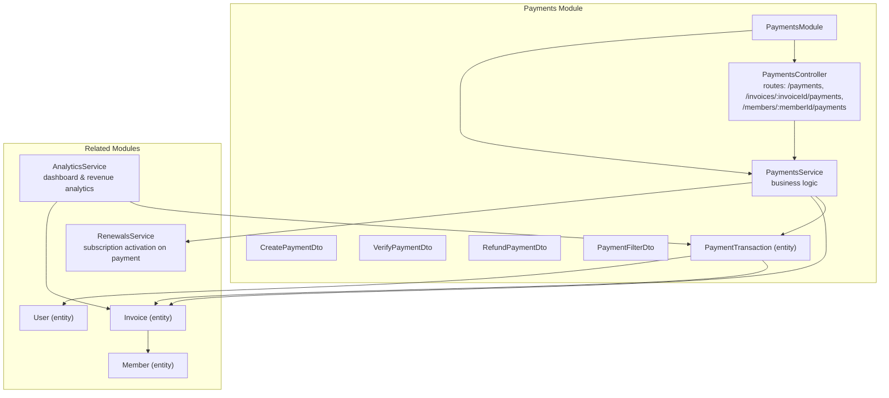
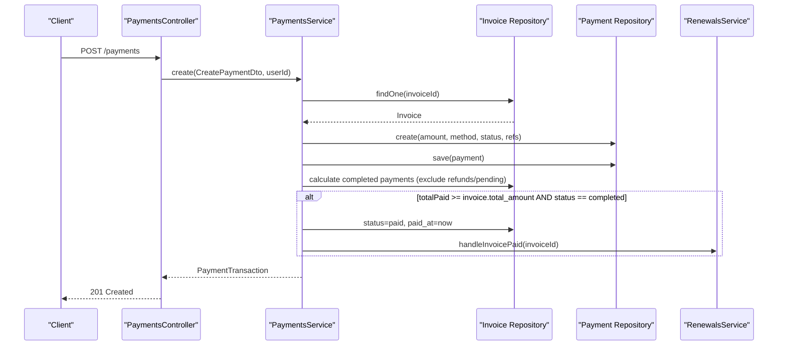
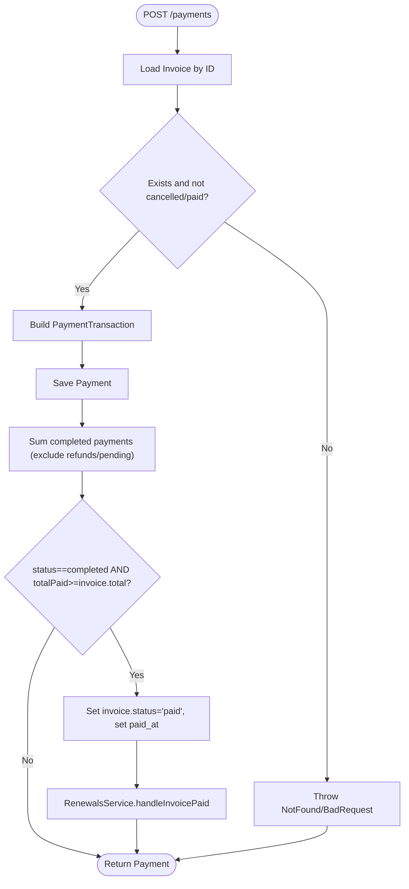
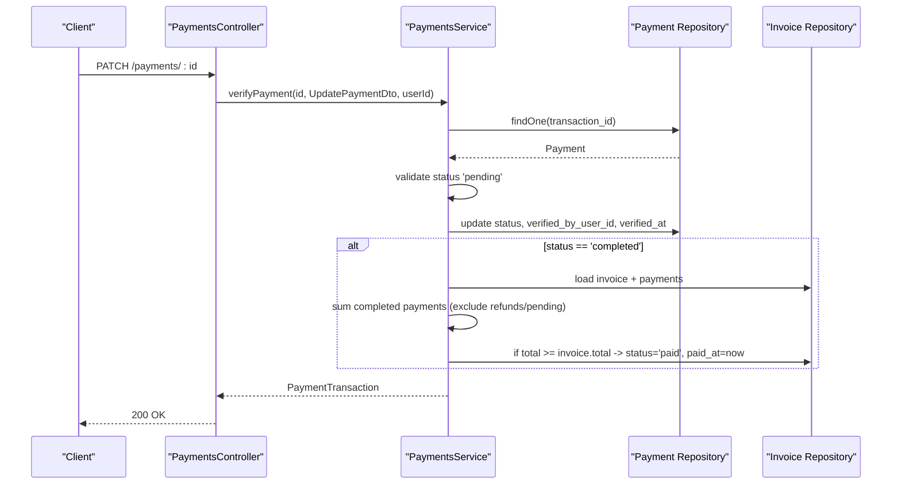
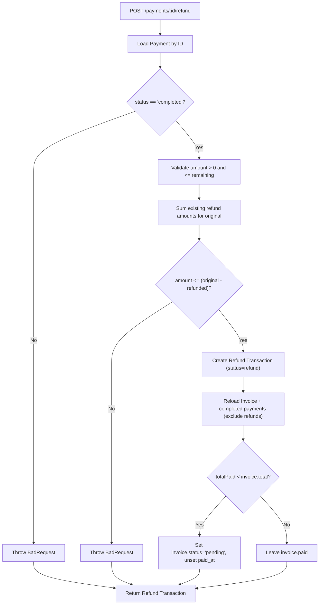
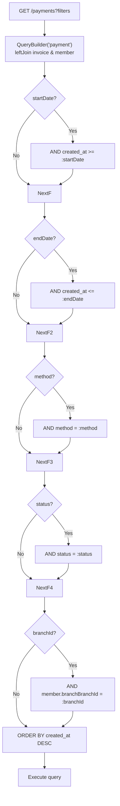
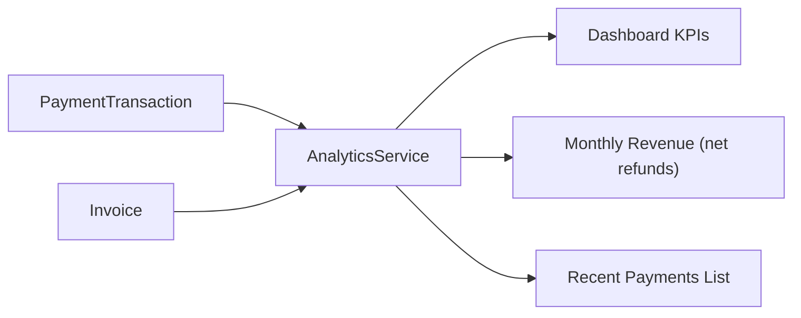
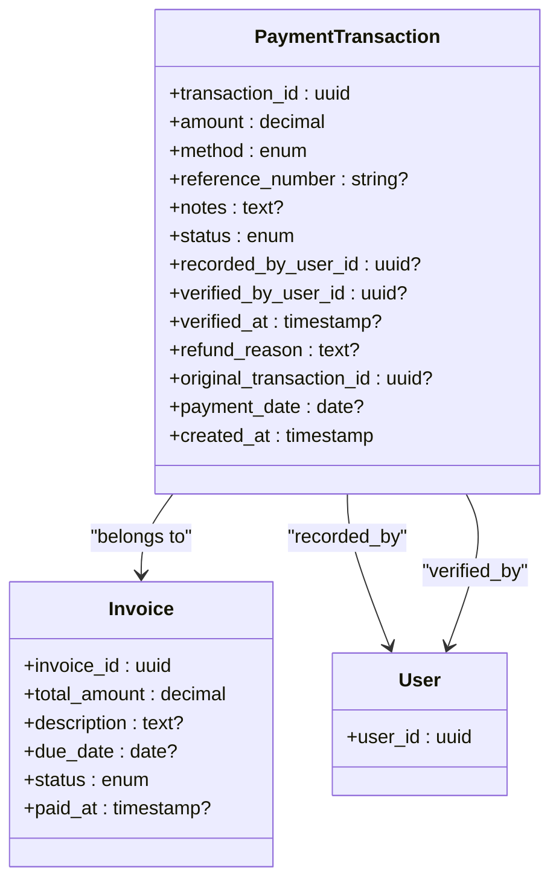
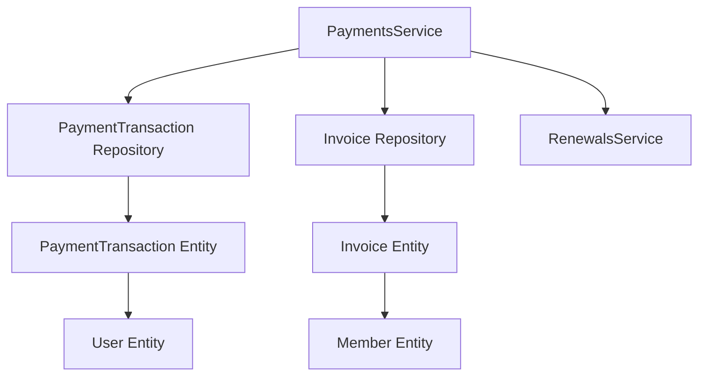

# Payment Processing

<cite>
**Referenced Files in This Document**
- [payments.controller.ts](file://src/payments/payments.controller.ts)
- [payments.service.ts](file://src/payments/payments.service.ts)
- [payments.module.ts](file://src/payments/payments.module.ts)
- [create-payment.dto.ts](file://src/payments/dto/create-payment.dto.ts)
- [verify-payment.dto.ts](file://src/payments/dto/verify-payment.dto.ts)
- [refund-payment.dto.ts](file://src/payments/dto/refund-payment.dto.ts)
- [payment-filter.dto.ts](file://src/payments/dto/payment-filter.dto.ts)
- [payment_transactions.entity.ts](file://src/entities/payment_transactions.entity.ts)
- [invoices.entity.ts](file://src/entities/invoices.entity.ts)
- [analytics.service.ts](file://src/analytics/analytics.service.ts)
- [renewals.service.ts](file://src/renewals/renewals.service.ts)
- [members.entity.ts](file://src/entities/members.entity.ts)
</cite>

## Table of Contents
1. [Introduction](#introduction)
2. [Project Structure](#project-structure)
3. [Core Components](#core-components)
4. [Architecture Overview](#architecture-overview)
5. [Detailed Component Analysis](#detailed-component-analysis)
6. [Dependency Analysis](#dependency-analysis)
7. [Performance Considerations](#performance-considerations)
8. [Troubleshooting Guide](#troubleshooting-guide)
9. [Conclusion](#conclusion)
10. [Appendices](#appendices)

## Introduction
This document explains the payment processing system in the gym management backend. It covers transaction handling, verification, and refund management; payment gateway integration considerations; transaction recording; payment status tracking; verification workflows; fraud detection mechanisms; failed payment handling; practical examples for member payments, partial payments, and refund requests; payment filtering and search capabilities; payment analytics; payment method diversity and currency handling; integration with accounting systems; retry logic; webhook processing; and reconciliation procedures.

## Project Structure
The payment subsystem is organized around a dedicated module with a controller, service, DTOs, and an entity representing payment transactions. Supporting entities include invoices and members. Analytics and renewal services integrate with payments for reporting and subscription lifecycle updates.

**Diagram sources**
- [payments.controller.ts:30-452](file://src/payments/payments.controller.ts#L30-L452)
- [payments.service.ts:16-490](file://src/payments/payments.service.ts#L16-L490)
- [payments.module.ts:14-27](file://src/payments/payments.module.ts#L14-L27)
- [payment_transactions.entity.ts:12-74](file://src/entities/payment_transactions.entity.ts#L12-L74)
- [invoices.entity.ts:13-49](file://src/entities/invoices.entity.ts#L13-L49)
- [analytics.service.ts:21-647](file://src/analytics/analytics.service.ts#L21-L647)
- [renewals.service.ts:16-179](file://src/renewals/renewals.service.ts#L16-L179)

**Section sources**
- [payments.controller.ts:30-452](file://src/payments/payments.controller.ts#L30-L452)
- [payments.service.ts:16-490](file://src/payments/payments.service.ts#L16-L490)
- [payments.module.ts:14-27](file://src/payments/payments.module.ts#L14-L27)

## Core Components
- PaymentsController: Exposes REST endpoints for recording payments, verifying/rejecting pending payments, issuing refunds, retrieving payment lists, summaries, and per-invoice/per-member histories.
- PaymentsService: Implements core business logic for payment creation, verification, refunding, filtering, summaries, and receipts generation. Integrates with invoices and renewals.
- PaymentTransaction entity: Stores payment metadata, amounts, methods, statuses, and audit fields.
- DTOs: Strongly-typed request/response contracts for create, verify, refund, and filter operations.
- AnalyticsService: Provides payment analytics, revenue calculations, and recent payment listings.
- RenewalsService: Handles subscription activation upon successful invoice payment.

Key responsibilities:
- Transaction recording with validation against invoice totals and statuses.
- Status transitions (pending → completed/failed) with audit trail.
- Refund management with amount caps and cascading invoice status adjustments.
- Filtering and aggregation for reporting and reconciliation.
- Integration with analytics and renewals for operational insights.

**Section sources**
- [payments.controller.ts:35-451](file://src/payments/payments.controller.ts#L35-L451)
- [payments.service.ts:26-301](file://src/payments/payments.service.ts#L26-L301)
- [payment_transactions.entity.ts:12-74](file://src/entities/payment_transactions.entity.ts#L12-L74)
- [create-payment.dto.ts:12-69](file://src/payments/dto/create-payment.dto.ts#L12-L69)
- [verify-payment.dto.ts:4-13](file://src/payments/dto/verify-payment.dto.ts#L4-L13)
- [refund-payment.dto.ts:4-29](file://src/payments/dto/refund-payment.dto.ts#L4-L29)
- [payment-filter.dto.ts:4-30](file://src/payments/dto/payment-filter.dto.ts#L4-L30)
- [analytics.service.ts:406-647](file://src/analytics/analytics.service.ts#L406-L647)
- [renewals.service.ts:124-177](file://src/renewals/renewals.service.ts#L124-L177)

## Architecture Overview
The payment system follows a layered architecture:
- Controllers expose endpoints with Swagger metadata and guard-based authentication.
- Services encapsulate domain logic and coordinate with repositories and related services.
- Entities define persistence models with relationships to invoices and users.
- Analytics and Renewals integrate with payments for reporting and lifecycle automation.

**Diagram sources**
- [payments.controller.ts:128-133](file://src/payments/payments.controller.ts#L128-L133)
- [payments.service.ts:26-79](file://src/payments/payments.service.ts#L26-L79)
- [invoices.entity.ts:13-49](file://src/entities/invoices.entity.ts#L13-L49)
- [payment_transactions.entity.ts:12-74](file://src/entities/payment_transactions.entity.ts#L12-L74)
- [renewals.service.ts:124-134](file://src/renewals/renewals.service.ts#L124-L134)

## Detailed Component Analysis

### Payment Recording Workflow
- Validates invoice existence and status (not cancelled/paid).
- Creates a payment transaction with amount, method, optional reference, notes, and optional payment_date/status.
- Updates invoice status to paid when total completed payments meet/exceed invoice total and there are no pending/original refunds.
- Triggers renewal activation if applicable.

**Diagram sources**
- [payments.controller.ts:128-133](file://src/payments/payments.controller.ts#L128-L133)
- [payments.service.ts:26-79](file://src/payments/payments.service.ts#L26-L79)
- [renewals.service.ts:124-134](file://src/renewals/renewals.service.ts#L124-L134)

**Section sources**
- [payments.controller.ts:35-133](file://src/payments/payments.controller.ts#L35-L133)
- [payments.service.ts:26-79](file://src/payments/payments.service.ts#L26-L79)

### Payment Verification Workflow
- Only pending payments can be verified.
- Verifies or rejects a payment; on completion, recalculates invoice totals and may mark invoice as paid.
- Records verifier user and timestamp.

**Diagram sources**
- [payments.controller.ts:351-357](file://src/payments/payments.controller.ts#L351-L357)
- [payments.service.ts:156-204](file://src/payments/payments.service.ts#L156-L204)

**Section sources**
- [payments.controller.ts:276-357](file://src/payments/payments.controller.ts#L276-L357)
- [payments.service.ts:156-204](file://src/payments/payments.service.ts#L156-L204)

### Refund Management
- Only completed payments can be refunded.
- Validates refund amount does not exceed remaining refundable balance (original amount minus prior refunds).
- Creates a refund transaction with status refund and links to the original transaction.
- Adjusts invoice status to pending if total paid falls below invoice total after refunds.

**Diagram sources**
- [payments.controller.ts:445-451](file://src/payments/payments.controller.ts#L445-L451)
- [payments.service.ts:206-301](file://src/payments/payments.service.ts#L206-L301)

**Section sources**
- [payments.controller.ts:359-451](file://src/payments/payments.controller.ts#L359-L451)
- [payments.service.ts:206-301](file://src/payments/payments.service.ts#L206-L301)

### Payment Filtering and Search
- Global filters support date range, method, status, and branchId.
- Endpoints:
  - GET /payments: paginated list with filters.
  - GET /payments/summary: aggregated totals and counts by method/status.
  - GET /invoices/:invoiceId/payments: all payments for an invoice.
  - GET /invoices/:invoiceId/payment-summary: totals, remaining balance, and method breakdown.
  - GET /members/:memberId/payments: all payments for a member.

**Diagram sources**
- [payments.controller.ts:157-159](file://src/payments/payments.controller.ts#L157-L159)
- [payments.service.ts:81-114](file://src/payments/payments.service.ts#L81-L114)
- [payment-filter.dto.ts:4-30](file://src/payments/dto/payment-filter.dto.ts#L4-L30)

**Section sources**
- [payments.controller.ts:135-205](file://src/payments/payments.controller.ts#L135-L205)
- [payments.service.ts:81-114](file://src/payments/payments.service.ts#L81-L114)
- [payment-filter.dto.ts:4-30](file://src/payments/dto/payment-filter.dto.ts#L4-L30)

### Payment Analytics
- Dashboard analytics include recent payments, daily payment counts by method, revenue (net of refunds), and month-over-month comparisons.
- Payment summaries per invoice include totals, remaining balances, and method breakdowns.

**Diagram sources**
- [analytics.service.ts:406-647](file://src/analytics/analytics.service.ts#L406-L647)
- [payment_transactions.entity.ts:12-74](file://src/entities/payment_transactions.entity.ts#L12-L74)
- [invoices.entity.ts:13-49](file://src/entities/invoices.entity.ts#L13-L49)

**Section sources**
- [analytics.service.ts:406-647](file://src/analytics/analytics.service.ts#L406-L647)
- [payments.service.ts:303-343](file://src/payments/payments.service.ts#L303-L343)

### Payment Methods, Currency, and Accounting Integration
- Supported payment methods: cash, card, online, bank_transfer.
- Amounts stored as decimals with fixed precision/scale for accurate accounting.
- Audit fields capture recorded_by and verified_by users, timestamps, and refund reasons.
- Integration with renewals ensures subscription activation aligns with invoice payment.

**Diagram sources**
- [payment_transactions.entity.ts:12-74](file://src/entities/payment_transactions.entity.ts#L12-L74)
- [invoices.entity.ts:13-49](file://src/entities/invoices.entity.ts#L13-L49)

**Section sources**
- [payment_transactions.entity.ts:22-69](file://src/entities/payment_transactions.entity.ts#L22-L69)
- [create-payment.dto.ts:25-33](file://src/payments/dto/create-payment.dto.ts#L25-L33)
- [refund-payment.dto.ts:10-17](file://src/payments/dto/refund-payment.dto.ts#L10-L17)

### Retry Logic, Webhook Processing, and Reconciliation
- Retry logic: Pending payments can be re-verified and transitioned to completed or failed. This supports manual retries after remediation.
- Webhook processing: Not implemented in the current codebase. To integrate external gateways, add a webhook endpoint to receive events, validate signatures, and reconcile payment states against PaymentTransaction records.
- Reconciliation: Use GET /payments/summary and per-invoice summaries to compare recorded totals with external statements. Filter by date ranges and methods to isolate discrepancies.

[No sources needed since this section provides general guidance]

## Dependency Analysis
PaymentsService depends on:
- PaymentTransaction repository for CRUD and aggregations.
- Invoice repository for totals and status updates.
- RenewalsService for subscription activation on invoice payment.
- TypeORM for query building and joins.

**Diagram sources**
- [payments.service.ts:16-24](file://src/payments/payments.service.ts#L16-L24)
- [payment_transactions.entity.ts:12-74](file://src/entities/payment_transactions.entity.ts#L12-L74)
- [invoices.entity.ts:13-49](file://src/entities/invoices.entity.ts#L13-L49)
- [members.entity.ts:22-124](file://src/entities/members.entity.ts#L22-L124)

**Section sources**
- [payments.service.ts:16-24](file://src/payments/payments.service.ts#L16-L24)

## Performance Considerations
- Prefer filtered queries with indexed fields (created_at, status, method, branchBranchId) to limit result sets.
- Use pagination and ordering by created_at DESC for large datasets.
- Aggregate summaries leverage SQL GROUP BY and SUM to minimize application-side computation.
- Avoid loading unnecessary relations; select only required fields for list endpoints.

[No sources needed since this section provides general guidance]

## Troubleshooting Guide
Common issues and resolutions:
- Payment amount exceeds invoice total or refund exceeds remaining balance: Validate DTO constraints and remaining refundable amounts before submission.
- Attempting to refund a non-completed payment: Only completed payments are eligible for refunds.
- Verifying non-pending payments: Only pending payments can be verified or rejected.
- Invoice not found errors: Confirm invoiceId correctness and existence.
- Unauthorized or forbidden responses: Ensure valid JWT and proper permissions.

Operational checks:
- Use GET /payments/:id to inspect transaction details and status.
- Use GET /invoices/:invoiceId/payment-summary to confirm totals and remaining balances.
- Use GET /payments/summary to validate daily or period totals.

**Section sources**
- [payments.controller.ts:40-93](file://src/payments/payments.controller.ts#L40-L93)
- [payments.controller.ts:313-350](file://src/payments/payments.controller.ts#L313-L350)
- [payments.controller.ts:394-451](file://src/payments/payments.controller.ts#L394-L451)
- [payments.service.ts:31-43](file://src/payments/payments.service.ts#L31-L43)
- [payments.service.ts:221-225](file://src/payments/payments.service.ts#L221-L225)
- [payments.service.ts:171-175](file://src/payments/payments.service.ts#L171-L175)

## Conclusion
The payment processing system provides robust transaction recording, verification, and refund management with strong validation, audit trails, and integrations for analytics and renewals. It supports diverse payment methods, precise currency handling, and scalable filtering/searching. Extending the system with webhook processing and automated reconciliation will further strengthen end-to-end payment lifecycle management.

## Appendices

### Practical Examples Index
- Record a member’s card payment for an invoice: [POST /payments:128-133](file://src/payments/payments.controller.ts#L128-L133)
- Verify a pending payment as completed or failed: [PATCH /payments/:id:351-357](file://src/payments/payments.controller.ts#L351-L357)
- Issue a full or partial refund: [POST /payments/:id/refund:445-451](file://src/payments/payments.controller.ts#L445-L451)
- Retrieve all payments with filters: [GET /payments:157-159](file://src/payments/payments.controller.ts#L157-L159)
- Get payment summary report: [GET /payments/summary:203-205](file://src/payments/payments.controller.ts#L203-L205)
- View invoice payment history: [GET /invoices/:invoiceId/payments:524-526](file://src/payments/payments.controller.ts#L524-L526)
- Get invoice payment summary: [GET /invoices/:invoiceId/payment-summary:586-588](file://src/payments/payments.controller.ts#L586-L588)
- Access member payment history: [GET /members/:memberId/payments:669-671](file://src/payments/payments.controller.ts#L669-L671)