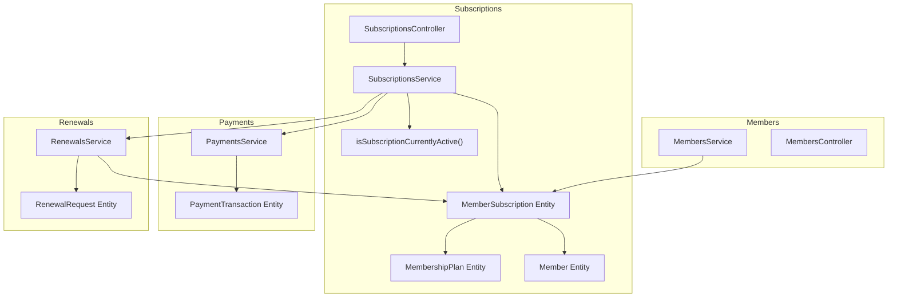
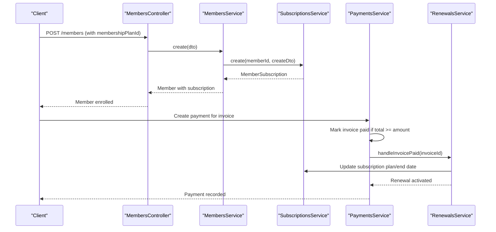
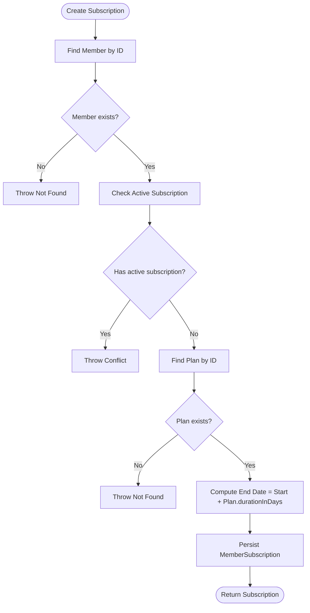
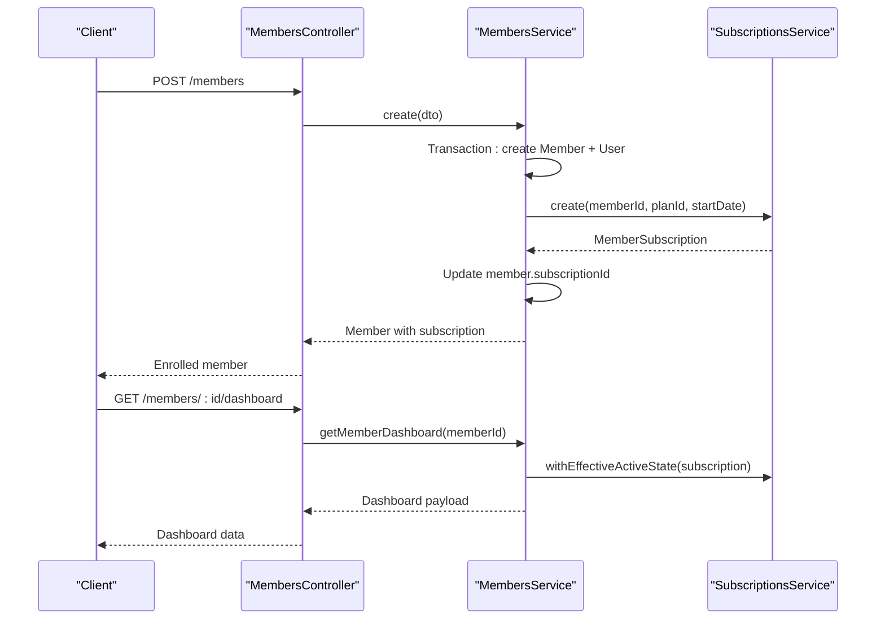
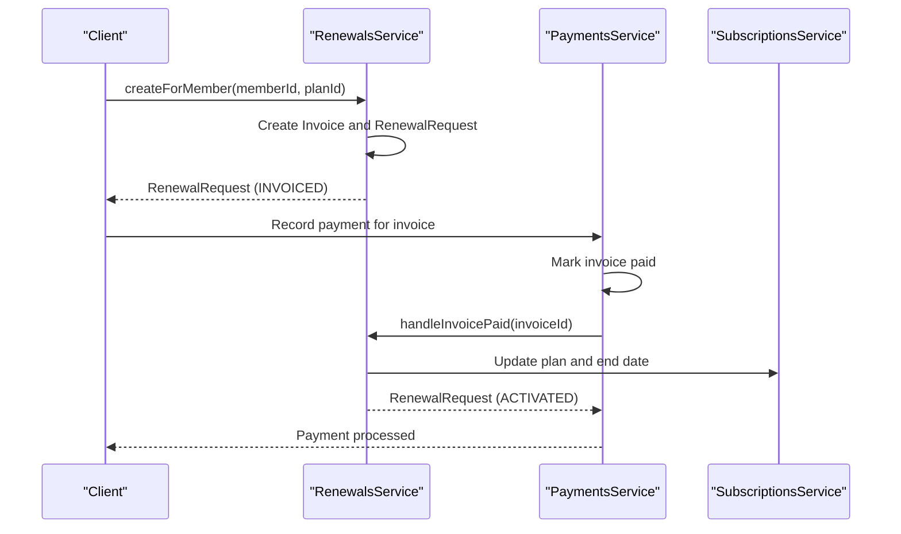
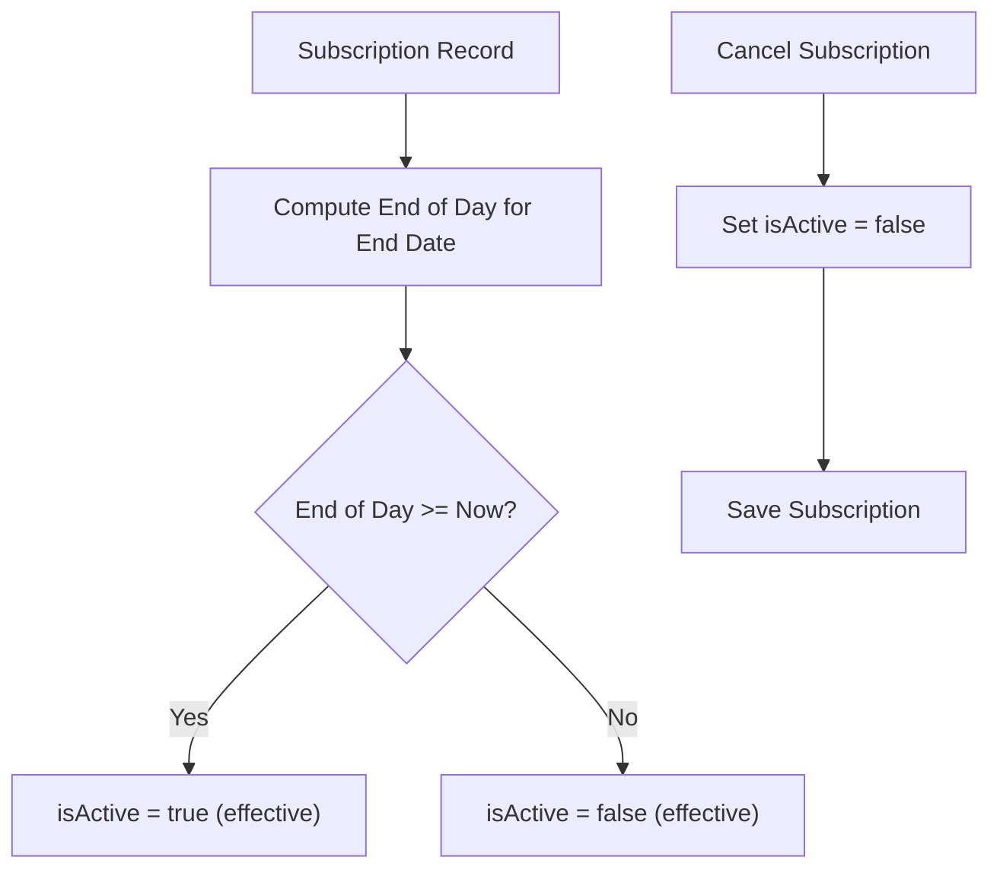
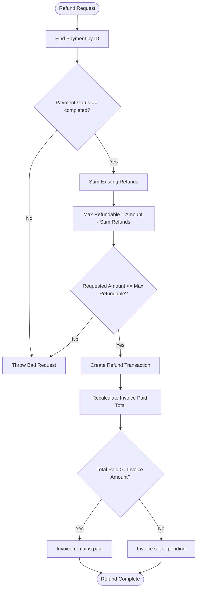
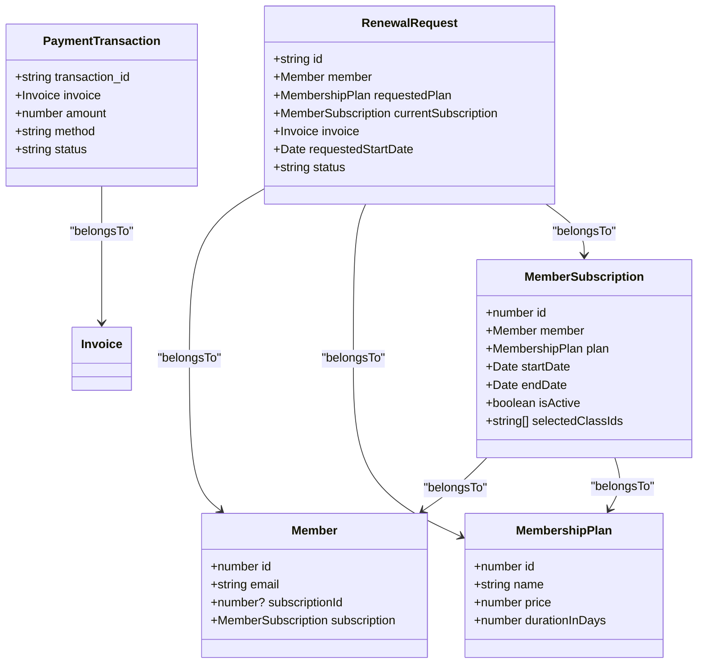

# Subscriptions & Enrollments

<cite>
**Referenced Files in This Document**
- [src/subscriptions/subscriptions.controller.ts](file://src/subscriptions/subscriptions.controller.ts)
- [src/subscriptions/subscriptions.service.ts](file://src/subscriptions/subscriptions.service.ts)
- [src/subscriptions/dto/create-subscription.dto.ts](file://src/subscriptions/dto/create-subscription.dto.ts)
- [src/subscriptions/dto/update-subscription.dto.ts](file://src/subscriptions/dto/update-subscription.dto.ts)
- [src/entities/member_subscriptions.entity.ts](file://src/entities/member_subscriptions.entity.ts)
- [src/entities/members.entity.ts](file://src/entities/members.entity.ts)
- [src/entities/membership_plans.entity.ts](file://src/entities/membership_plans.entity.ts)
- [src/common/utils/subscription.util.ts](file://src/common/utils/subscription.util.ts)
- [src/members/members.service.ts](file://src/members/members.service.ts)
- [src/members/members.controller.ts](file://src/members/members.controller.ts)
- [src/payments/payments.service.ts](file://src/payments/payments.service.ts)
- [src/entities/payment_transactions.entity.ts](file://src/entities/payment_transactions.entity.ts)
- [src/renewals/renewals.service.ts](file://src/renewals/renewals.service.ts)
- [src/entities/renewal_requests.entity.ts](file://src/entities/renewal_requests.entity.ts)
</cite>

## Table of Contents
1. [Introduction](#introduction)
2. [Project Structure](#project-structure)
3. [Core Components](#core-components)
4. [Architecture Overview](#architecture-overview)
5. [Detailed Component Analysis](#detailed-component-analysis)
6. [Dependency Analysis](#dependency-analysis)
7. [Performance Considerations](#performance-considerations)
8. [Troubleshooting Guide](#troubleshooting-guide)
9. [Conclusion](#conclusion)

## Introduction
This document explains the subscription management system for member enrollment, subscription lifecycle, and plan modifications. It covers subscription creation workflows, enrollment validation, automatic renewal processes, status tracking, cancellation procedures, and prorated refund calculations. It also documents integrations with payment processing, member dashboard updates, and notification systems, along with conflict resolution for overlapping enrollments and subscription history tracking.

## Project Structure
The subscription system spans several modules:
- Subscription domain: controller, service, DTOs, and entity
- Member domain: enrollment and dashboard integration
- Payment domain: payment transactions and invoice handling
- Renewal domain: renewal requests and activation logic
- Shared utilities: subscription status evaluation

**Diagram sources**
- [src/subscriptions/subscriptions.controller.ts:28-166](file://src/subscriptions/subscriptions.controller.ts#L28-L166)
- [src/subscriptions/subscriptions.service.ts:15-152](file://src/subscriptions/subscriptions.service.ts#L15-L152)
- [src/entities/member_subscriptions.entity.ts:14-71](file://src/entities/member_subscriptions.entity.ts#L14-L71)
- [src/entities/members.entity.ts:22-124](file://src/entities/members.entity.ts#L22-L124)
- [src/entities/membership_plans.entity.ts:11-34](file://src/entities/membership_plans.entity.ts#L11-L34)
- [src/common/utils/subscription.util.ts:3-15](file://src/common/utils/subscription.util.ts#L3-L15)
- [src/members/members.service.ts:24-561](file://src/members/members.service.ts#L24-L561)
- [src/payments/payments.service.ts:16-490](file://src/payments/payments.service.ts#L16-L490)
- [src/entities/payment_transactions.entity.ts:12-74](file://src/entities/payment_transactions.entity.ts#L12-L74)
- [src/renewals/renewals.service.ts:16-179](file://src/renewals/renewals.service.ts#L16-L179)
- [src/entities/renewal_requests.entity.ts:16-65](file://src/entities/renewal_requests.entity.ts#L16-L65)

**Section sources**
- [src/subscriptions/subscriptions.controller.ts:28-166](file://src/subscriptions/subscriptions.controller.ts#L28-L166)
- [src/subscriptions/subscriptions.service.ts:15-152](file://src/subscriptions/subscriptions.service.ts#L15-L152)
- [src/entities/member_subscriptions.entity.ts:14-71](file://src/entities/member_subscriptions.entity.ts#L14-L71)
- [src/entities/members.entity.ts:22-124](file://src/entities/members.entity.ts#L22-L124)
- [src/entities/membership_plans.entity.ts:11-34](file://src/entities/membership_plans.entity.ts#L11-L34)
- [src/common/utils/subscription.util.ts:3-15](file://src/common/utils/subscription.util.ts#L3-L15)
- [src/members/members.service.ts:24-561](file://src/members/members.service.ts#L24-L561)
- [src/payments/payments.service.ts:16-490](file://src/payments/payments.service.ts#L16-L490)
- [src/entities/payment_transactions.entity.ts:12-74](file://src/entities/payment_transactions.entity.ts#L12-L74)
- [src/renewals/renewals.service.ts:16-179](file://src/renewals/renewals.service.ts#L16-L179)
- [src/entities/renewal_requests.entity.ts:16-65](file://src/entities/renewal_requests.entity.ts#L16-L65)

## Core Components
- MemberSubscription: Stores the member’s plan, dates, and active status; integrates with Member and MembershipPlan.
- MembershipPlan: Defines plan metadata (name, price, duration) used to compute subscription end dates.
- MembersService: Orchestrates new member enrollment, including subscription creation and class selection persistence.
- SubscriptionsService: Manages subscription CRUD, validates uniqueness, computes end dates, and evaluates effective active state.
- PaymentsService: Handles payment recording, invoice status transitions, and refund processing; triggers renewal activation upon payment.
- RenewalsService: Manages renewal requests, invoice generation, and plan activation upon payment.
- isSubscriptionCurrentlyActive: Utility to derive effective active state based on plan end date and current time.

**Section sources**
- [src/entities/member_subscriptions.entity.ts:14-71](file://src/entities/member_subscriptions.entity.ts#L14-L71)
- [src/entities/membership_plans.entity.ts:11-34](file://src/entities/membership_plans.entity.ts#L11-L34)
- [src/members/members.service.ts:117-174](file://src/members/members.service.ts#L117-L174)
- [src/subscriptions/subscriptions.service.ts:26-67](file://src/subscriptions/subscriptions.service.ts#L26-L67)
- [src/payments/payments.service.ts:26-79](file://src/payments/payments.service.ts#L26-L79)
- [src/renewals/renewals.service.ts:32-94](file://src/renewals/renewals.service.ts#L32-L94)
- [src/common/utils/subscription.util.ts:3-15](file://src/common/utils/subscription.util.ts#L3-L15)

## Architecture Overview
The subscription lifecycle integrates enrollment, validation, payment, renewal, and status tracking.

**Diagram sources**
- [src/members/members.controller.ts:39-222](file://src/members/members.controller.ts#L39-L222)
- [src/members/members.service.ts:117-174](file://src/members/members.service.ts#L117-L174)
- [src/subscriptions/subscriptions.service.ts:26-67](file://src/subscriptions/subscriptions.service.ts#L26-L67)
- [src/payments/payments.service.ts:26-79](file://src/payments/payments.service.ts#L26-L79)
- [src/renewals/renewals.service.ts:124-177](file://src/renewals/renewals.service.ts#L124-L177)

## Detailed Component Analysis

### Subscription Creation Workflow
- Validation: Ensures member exists and has no active subscription; ensures plan exists.
- End date calculation: Adds plan duration (in days) to the provided start date.
- Persistence: Creates and saves the MemberSubscription record linked to Member and MembershipPlan.
- Effective active state: Service augments returned subscription with computed active state.

**Diagram sources**
- [src/subscriptions/subscriptions.service.ts:26-67](file://src/subscriptions/subscriptions.service.ts#L26-L67)
- [src/entities/members.entity.ts:22-124](file://src/entities/members.entity.ts#L22-L124)
- [src/entities/membership_plans.entity.ts:11-34](file://src/entities/membership_plans.entity.ts#L11-L34)

**Section sources**
- [src/subscriptions/subscriptions.service.ts:26-67](file://src/subscriptions/subscriptions.service.ts#L26-L67)
- [src/subscriptions/dto/create-subscription.dto.ts:10-33](file://src/subscriptions/dto/create-subscription.dto.ts#L10-L33)

### Enrollment Validation and Member Dashboard Updates
- Enrollment validation: MembersService enforces unique email and handles transactional creation of Member, User, and MemberSubscription.
- Class selections: Selected class UUID arrays are persisted via raw SQL to the MemberSubscription entity.
- Dashboard: MembersService.getMemberDashboard returns subscription status derived from effective active state.

**Diagram sources**
- [src/members/members.controller.ts:39-222](file://src/members/members.controller.ts#L39-L222)
- [src/members/members.service.ts:117-174](file://src/members/members.service.ts#L117-L174)
- [src/subscriptions/subscriptions.service.ts:147-150](file://src/subscriptions/subscriptions.service.ts#L147-L150)

**Section sources**
- [src/members/members.service.ts:117-174](file://src/members/members.service.ts#L117-L174)
- [src/members/members.controller.ts:526-552](file://src/members/members.controller.ts#L526-L552)
- [src/subscriptions/subscriptions.service.ts:147-150](file://src/subscriptions/subscriptions.service.ts#L147-L150)

### Automatic Renewal Processes
- Renewal request creation: Generates an invoice and a renewal request for a new plan; sets requested start date based on current subscription end date.
- Payment triggers activation: When invoice is marked paid, RenewalsService updates the subscription plan and end date, then marks the renewal activated.
- Notification: Sends renewal invoice created and activated reminders.

**Diagram sources**
- [src/renewals/renewals.service.ts:32-94](file://src/renewals/renewals.service.ts#L32-L94)
- [src/renewals/renewals.service.ts:124-177](file://src/renewals/renewals.service.ts#L124-L177)
- [src/payments/payments.service.ts:26-79](file://src/payments/payments.service.ts#L26-L79)
- [src/subscriptions/subscriptions.service.ts:136-140](file://src/subscriptions/subscriptions.service.ts#L136-L140)

**Section sources**
- [src/renewals/renewals.service.ts:32-94](file://src/renewals/renewals.service.ts#L32-L94)
- [src/renewals/renewals.service.ts:124-177](file://src/renewals/renewals.service.ts#L124-L177)
- [src/payments/payments.service.ts:26-79](file://src/payments/payments.service.ts#L26-L79)

### Subscription Status Tracking and Cancellation
- Status derivation: Effective active state is computed using isSubscriptionCurrentlyActive, which considers end-of-day boundary and current time.
- Cancellation: SubscriptionsService cancels a subscription by setting isActive to false and saving.
- Deletion: SubscriptionsController exposes DELETE to permanently remove a subscription (admin-only).

**Diagram sources**
- [src/common/utils/subscription.util.ts:3-15](file://src/common/utils/subscription.util.ts#L3-L15)
- [src/subscriptions/subscriptions.service.ts:136-140](file://src/subscriptions/subscriptions.service.ts#L136-L140)

**Section sources**
- [src/common/utils/subscription.util.ts:3-15](file://src/common/utils/subscription.util.ts#L3-L15)
- [src/subscriptions/subscriptions.service.ts:136-140](file://src/subscriptions/subscriptions.service.ts#L136-L140)
- [src/subscriptions/subscriptions.controller.ts:717-800](file://src/subscriptions/subscriptions.controller.ts#L717-L800)

### Prorated Refund Calculations
- Refund validation: PaymentsService verifies the payment is completed and calculates remaining refundable balance against the original transaction.
- Refund creation: Records a refund transaction and adjusts invoice status if total paid falls below threshold.
- Impact on subscription: RenewalsService updates plan and end date upon successful invoice payment; refunds revert invoice to pending if applicable.

**Diagram sources**
- [src/payments/payments.service.ts:206-301](file://src/payments/payments.service.ts#L206-L301)

**Section sources**
- [src/payments/payments.service.ts:206-301](file://src/payments/payments.service.ts#L206-L301)

### Practical Examples

- Enrolling a new member with a plan:
  - Use POST /members with membershipPlanId and optional selectedClassIds.
  - The system creates Member, User, and MemberSubscription in a single transaction and returns the enrolled member with subscription details.

- Upgrading/downgrading plans:
  - Create a renewal request via RenewalsService; upon payment, RenewalsService updates the subscription plan and recalculates end date.

- Handling subscription terminations:
  - Cancel a subscription via PATCH /subscriptions/:id (set isActive false).
  - Permanently delete a subscription via DELETE /subscriptions/:id (admin-only).

- Managing class selections:
  - Update selectedClassIds via MembersService admin update; the service persists UUID arrays to MemberSubscription.

**Section sources**
- [src/members/members.controller.ts:39-222](file://src/members/members.controller.ts#L39-L222)
- [src/renewals/renewals.service.ts:32-94](file://src/renewals/renewals.service.ts#L32-L94)
- [src/subscriptions/subscriptions.controller.ts:581-715](file://src/subscriptions/subscriptions.controller.ts#L581-L715)
- [src/members/members.service.ts:319-354](file://src/members/members.service.ts#L319-L354)

### Integration Points
- Payment processing: PaymentsService manages invoice status transitions and triggers RenewalsService upon payment completion.
- Member dashboard: MembersService.getMemberDashboard derives subscription status using isSubscriptionCurrentlyActive.
- Notifications: RenewalsService sends renewal invoice created and activated reminders.

**Section sources**
- [src/payments/payments.service.ts:26-79](file://src/payments/payments.service.ts#L26-L79)
- [src/members/members.service.ts:468-543](file://src/members/members.service.ts#L468-L543)
- [src/renewals/renewals.service.ts:92-93](file://src/renewals/renewals.service.ts#L92-L93)
- [src/renewals/renewals.service.ts:175-176](file://src/renewals/renewals.service.ts#L175-L176)

### Subscription Conflicts and Overlaps
- Enrollment conflict: SubscriptionsService prevents multiple active subscriptions per member.
- Renewal conflict: RenewalsService blocks multiple open renewal requests per member.
- Overlap handling: RenewalsService determines requested start date based on current subscription end date to avoid overlaps.

**Section sources**
- [src/subscriptions/subscriptions.service.ts:36-39](file://src/subscriptions/subscriptions.service.ts#L36-L39)
- [src/renewals/renewals.service.ts:48-62](file://src/renewals/renewals.service.ts#L48-L62)
- [src/renewals/renewals.service.ts:64-70](file://src/renewals/renewals.service.ts#L64-L70)

### Subscription History Tracking
- Renewal history: RenewalsService maintains a log of renewal requests with statuses (REQUESTED, INVOICED, PAID, ACTIVATED, CANCELLED, EXPIRED).
- Payment history: MembersService.getMemberDashboard aggregates recent payment history for the member.

**Section sources**
- [src/entities/renewal_requests.entity.ts:16-65](file://src/entities/renewal_requests.entity.ts#L16-L65)
- [src/renewals/renewals.service.ts:96-107](file://src/renewals/renewals.service.ts#L96-L107)
- [src/members/members.service.ts:491-502](file://src/members/members.service.ts#L491-L502)

## Dependency Analysis

**Diagram sources**
- [src/entities/member_subscriptions.entity.ts:14-71](file://src/entities/member_subscriptions.entity.ts#L14-L71)
- [src/entities/members.entity.ts:22-124](file://src/entities/members.entity.ts#L22-L124)
- [src/entities/membership_plans.entity.ts:11-34](file://src/entities/membership_plans.entity.ts#L11-L34)
- [src/entities/payment_transactions.entity.ts:12-74](file://src/entities/payment_transactions.entity.ts#L12-L74)
- [src/entities/renewal_requests.entity.ts:16-65](file://src/entities/renewal_requests.entity.ts#L16-L65)

**Section sources**
- [src/entities/member_subscriptions.entity.ts:14-71](file://src/entities/member_subscriptions.entity.ts#L14-L71)
- [src/entities/members.entity.ts:22-124](file://src/entities/members.entity.ts#L22-L124)
- [src/entities/membership_plans.entity.ts:11-34](file://src/entities/membership_plans.entity.ts#L11-L34)
- [src/entities/payment_transactions.entity.ts:12-74](file://src/entities/payment_transactions.entity.ts#L12-L74)
- [src/entities/renewal_requests.entity.ts:16-65](file://src/entities/renewal_requests.entity.ts#L16-L65)

## Performance Considerations
- Batch queries: Use relation loading judiciously; consider pagination for listing subscriptions and members.
- Indexing: Ensure unique constraints on member email and subscriptionId to prevent race conditions during enrollment.
- Transactions: Keep enrollment operations within a single transaction to maintain consistency.
- Status computation: isSubscriptionCurrentlyActive performs end-of-day boundary checks; cache or precompute where appropriate in high-throughput scenarios.

## Troubleshooting Guide
- “Member already has an active subscription”:
  - Cause: Attempting to enroll a member who already has an active subscription.
  - Resolution: Cancel or renew the existing subscription before enrolling again.

- “Invoice is already paid” or “Cannot add payment to cancelled invoice”:
  - Cause: Payment attempted on an invalid invoice state.
  - Resolution: Verify invoice status and retry only for pending or unpaid invoices.

- “Cannot refund payment with status ‘X’”:
  - Cause: Refund applied to a non-completed payment.
  - Resolution: Ensure the original payment is completed before issuing a refund.

- “Activated renewal requests cannot be cancelled”:
  - Cause: Renewal already moved to ACTIVATED status.
  - Resolution: No further cancellation; proceed with plan changes or termination.

**Section sources**
- [src/subscriptions/subscriptions.service.ts:36-39](file://src/subscriptions/subscriptions.service.ts#L36-L39)
- [src/payments/payments.service.ts:37-43](file://src/payments/payments.service.ts#L37-L43)
- [src/payments/payments.service.ts:221-225](file://src/payments/payments.service.ts#L221-L225)
- [src/renewals/renewals.service.ts:115-117](file://src/renewals/renewals.service.ts#L115-L117)

## Conclusion
The subscription management system provides robust member enrollment, lifecycle management, and renewal automation. It integrates tightly with payment processing and notifications, supports plan upgrades/downgrades, and maintains accurate status tracking. By leveraging transactional creation, strict validation, and clear renewal workflows, the system ensures consistency and reliability across enrollment, billing, and subscription transitions.