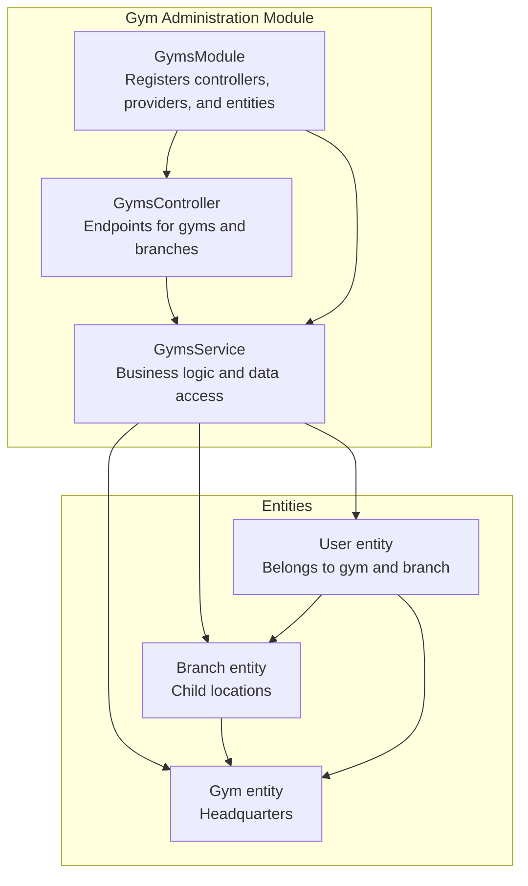
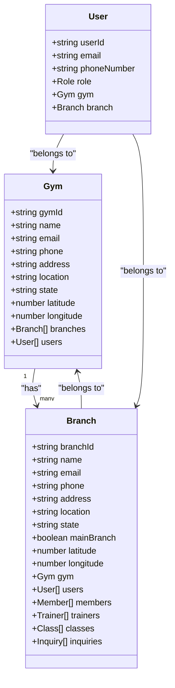
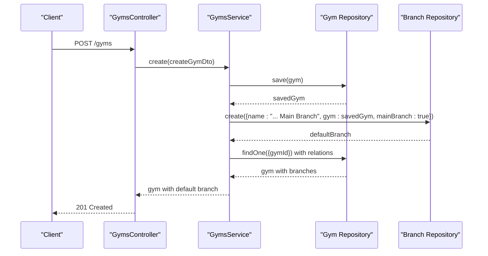
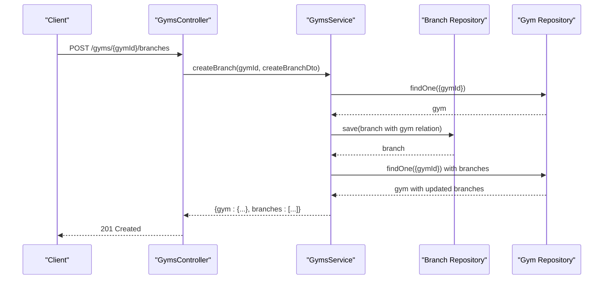
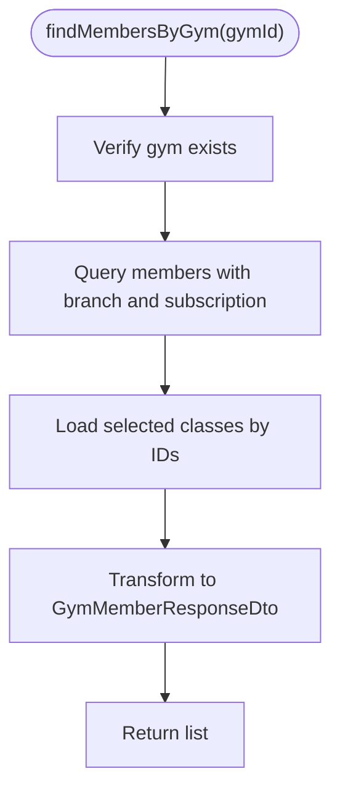
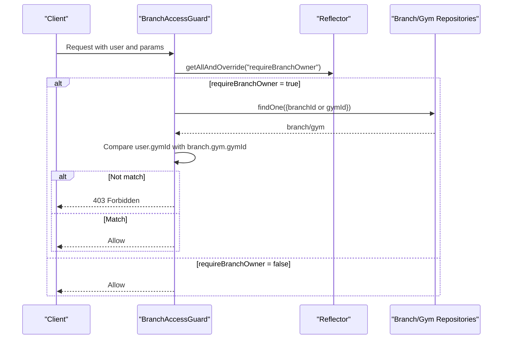
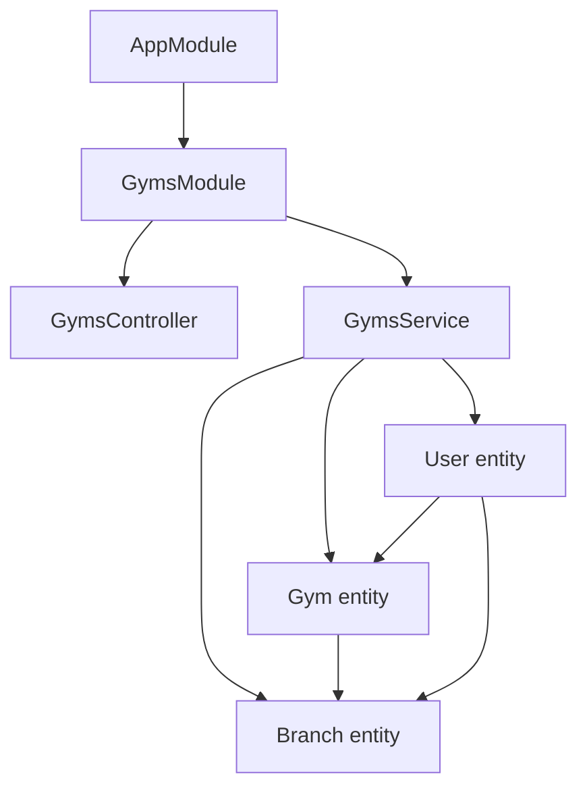

# Gym Administration

<cite>
**Referenced Files in This Document**
- [gyms.controller.ts](file://src/gyms/gyms.controller.ts)
- [gyms.service.ts](file://src/gyms/gyms.service.ts)
- [gyms.module.ts](file://src/gyms/gyms.module.ts)
- [gym.entity.ts](file://src/entities/gym.entity.ts)
- [branch.entity.ts](file://src/entities/branch.entity.ts)
- [users.entity.ts](file://src/entities/users.entity.ts)
- [create-gym.dto.ts](file://src/gyms/dto/create-gym.dto.ts)
- [update-gym.dto.ts](file://src/gyms/dto/update-gym.dto.ts)
- [create-branch.dto.ts](file://src/gyms/dto/create-branch.dto.ts)
- [update-branch.dto.ts](file://src/gyms/dto/update-branch.dto.ts)
- [gym-member-response.dto.ts](file://src/gyms/dto/gym-member-response.dto.ts)
- [branch-access.guard.ts](file://src/auth/guards/branch-access.guard.ts)
- [roles.guard.ts](file://src/auth/guards/roles.guard.ts)
- [role.enum.ts](file://src/common/enums/role.enum.ts)
- [permissions.enum.ts](file://src/common/enums/permissions.enum.ts)
- [app.module.ts](file://src/app.module.ts)
</cite>

## Table of Contents
1. [Introduction](#introduction)
2. [Project Structure](#project-structure)
3. [Core Components](#core-components)
4. [Architecture Overview](#architecture-overview)
5. [Detailed Component Analysis](#detailed-component-analysis)
6. [Dependency Analysis](#dependency-analysis)
7. [Performance Considerations](#performance-considerations)
8. [Troubleshooting Guide](#troubleshooting-guide)
9. [Conclusion](#conclusion)

## Introduction
This document explains the gym administration module that supports multi-location gym chains with a headquarters (gym) and multiple branch locations. It covers the hierarchical structure, creation and management of gyms and branches, location configuration, and access control mechanisms. It also documents how permissions are enforced across locations, practical setup workflows, and data isolation patterns.

## Project Structure
The gym administration module is organized around three primary concerns:
- Entities: Gym and Branch define the multi-location hierarchy and relationships to users, members, trainers, classes, and inquiries.
- Controllers: Expose REST endpoints for gym and branch CRUD operations, as well as cross-location queries (e.g., listing members across all branches).
- Services: Implement business logic for creation, updates, and retrieval with proper data isolation and joins.

**Diagram sources**
- [gyms.controller.ts:31-517](file://src/gyms/gyms.controller.ts#L31-L517)
- [gyms.service.ts:14-471](file://src/gyms/gyms.service.ts#L14-L471)
- [gyms.module.ts:11-17](file://src/gyms/gyms.module.ts#L11-L17)
- [gym.entity.ts:12-55](file://src/entities/gym.entity.ts#L12-L55)
- [branch.entity.ts:18-78](file://src/entities/branch.entity.ts#L18-L78)
- [users.entity.ts:14-51](file://src/entities/users.entity.ts#L14-L51)

**Section sources**
- [gyms.controller.ts:31-517](file://src/gyms/gyms.controller.ts#L31-L517)
- [gyms.service.ts:14-471](file://src/gyms/gyms.service.ts#L14-L471)
- [gyms.module.ts:11-17](file://src/gyms/gyms.module.ts#L11-L17)
- [gym.entity.ts:12-55](file://src/entities/gym.entity.ts#L12-L55)
- [branch.entity.ts:18-78](file://src/entities/branch.entity.ts#L18-L78)
- [users.entity.ts:14-51](file://src/entities/users.entity.ts#L14-L51)

## Core Components
- Gym entity: Represents the headquarters with metadata (name, contact, address, coordinates) and maintains a one-to-many relationship with branches.
- Branch entity: Represents child locations under a gym, with its own contact, location, facilities, and coordinates. Each branch belongs to exactly one gym via cascade deletion.
- User entity: Links users to both gym and branch, enabling role-based access control per location.
- DTOs: Define validation and serialization for gym and branch creation/update operations.
- Controllers: Expose endpoints for gym and branch management, including cross-location member listings.
- Service: Implements creation, updates, retrieval, and cross-location aggregation with proper joins and filtering.
- Guards: Enforce role-based and branch-level access control.

**Section sources**
- [gym.entity.ts:12-55](file://src/entities/gym.entity.ts#L12-L55)
- [branch.entity.ts:18-78](file://src/entities/branch.entity.ts#L18-L78)
- [users.entity.ts:14-51](file://src/entities/users.entity.ts#L14-L51)
- [create-gym.dto.ts:4-85](file://src/gyms/dto/create-gym.dto.ts#L4-L85)
- [create-branch.dto.ts:4-61](file://src/gyms/dto/create-branch.dto.ts#L4-L61)
- [update-gym.dto.ts:4-4](file://src/gyms/dto/update-gym.dto.ts#L4-L4)
- [update-branch.dto.ts:4-4](file://src/gyms/dto/update-branch.dto.ts#L4-L4)
- [gyms.controller.ts:31-517](file://src/gyms/gyms.controller.ts#L31-L517)
- [gyms.service.ts:14-471](file://src/gyms/gyms.service.ts#L14-L471)

## Architecture Overview
The module follows a layered architecture:
- Presentation: Controllers expose REST endpoints with Swagger metadata.
- Application: Services encapsulate business rules and data access.
- Persistence: TypeORM entities model the gym-branch-user hierarchy with foreign keys and cascading deletes.

**Diagram sources**
- [gym.entity.ts:12-55](file://src/entities/gym.entity.ts#L12-L55)
- [branch.entity.ts:18-78](file://src/entities/branch.entity.ts#L18-L78)
- [users.entity.ts:14-51](file://src/entities/users.entity.ts#L14-L51)

**Section sources**
- [gyms.controller.ts:31-517](file://src/gyms/gyms.controller.ts#L31-L517)
- [gyms.service.ts:14-471](file://src/gyms/gyms.service.ts#L14-L471)
- [app.module.ts:66-133](file://src/app.module.ts#L66-L133)

## Detailed Component Analysis

### Gym Management
- Creation: Validates input via DTO, persists the gym, and automatically creates a default main branch associated with the gym.
- Listing: Supports filtering by location and search term, returning gyms with their branches and users.
- Retrieval: Returns a gym with all related branches and users.
- Updates: Allows partial updates to gym metadata.
- Deletion: Removes the gym and its branches due to cascade delete.

**Diagram sources**
- [gyms.controller.ts:37-79](file://src/gyms/gyms.controller.ts#L37-L79)
- [gyms.service.ts:31-69](file://src/gyms/gyms.service.ts#L31-L69)

**Section sources**
- [gyms.controller.ts:37-79](file://src/gyms/gyms.controller.ts#L37-L79)
- [gyms.service.ts:31-69](file://src/gyms/gyms.service.ts#L31-L69)
- [create-gym.dto.ts:4-85](file://src/gyms/dto/create-gym.dto.ts#L4-L85)

### Branch Management
- Creation: Creates a branch under a specific gym, ensuring only one main branch per gym by defaulting non-main branches.
- Listing by gym: Returns all branches for a given gym with sanitized fields.
- Retrieval: Fetches a single branch with its parent gym.
- Updates: Supports partial updates to branch details.
- Deletion: Removes a branch; cascade delete ensures branch-related records are handled.

**Diagram sources**
- [gyms.controller.ts:254-326](file://src/gyms/gyms.controller.ts#L254-L326)
- [gyms.service.ts:122-174](file://src/gyms/gyms.service.ts#L122-L174)

**Section sources**
- [gyms.controller.ts:254-326](file://src/gyms/gyms.controller.ts#L254-L326)
- [gyms.service.ts:122-174](file://src/gyms/gyms.service.ts#L122-L174)
- [create-branch.dto.ts:4-61](file://src/gyms/dto/create-branch.dto.ts#L4-L61)

### Cross-Location Member and Trainer Queries
- Gym-level members: Aggregates members across all branches of a gym, enriching each member with subscription plan and enrolled classes.
- Gym-level trainers: Lists all trainers across all branches of a gym.
- Branch-level variants: Similar queries exist for branch-scoped lists.

**Diagram sources**
- [gyms.service.ts:257-357](file://src/gyms/gyms.service.ts#L257-L357)

**Section sources**
- [gyms.controller.ts:339-505](file://src/gyms/gyms.controller.ts#L339-L505)
- [gyms.service.ts:257-357](file://src/gyms/gyms.service.ts#L257-L357)
- [gym-member-response.dto.ts:98-167](file://src/gyms/dto/gym-member-response.dto.ts#L98-L167)

### Access Control and Permissions
- Roles: SUPERADMIN and ADMIN roles exist; ADMINs are further scoped to their gym/branch.
- BranchAccessGuard: Enforces that ADMIN users can only access resources within their own gym. It checks branch ownership when required.
- RolesGuard: Enforces required roles at controller/handler level.
- Permissions: A comprehensive permission set governs gym, branch, member, trainer, chart, diet, and goal operations, with ADMIN role mapped to a subset of permissions.

**Diagram sources**
- [branch-access.guard.ts:24-71](file://src/auth/guards/branch-access.guard.ts#L24-L71)

**Section sources**
- [branch-access.guard.ts:14-72](file://src/auth/guards/branch-access.guard.ts#L14-L72)
- [roles.guard.ts:12-41](file://src/auth/guards/roles.guard.ts#L12-L41)
- [role.enum.ts:1-7](file://src/common/enums/role.enum.ts#L1-L7)
- [permissions.enum.ts:1-83](file://src/common/enums/permissions.enum.ts#L1-L83)
- [users.entity.ts:14-51](file://src/entities/users.entity.ts#L14-L51)

## Dependency Analysis
The module integrates with the broader application via TypeORM entities registered in the main module and guarded by authentication and authorization layers.

**Diagram sources**
- [app.module.ts:66-133](file://src/app.module.ts#L66-L133)
- [gyms.module.ts:11-17](file://src/gyms/gyms.module.ts#L11-L17)
- [gyms.controller.ts:31-517](file://src/gyms/gyms.controller.ts#L31-L517)
- [gyms.service.ts:14-471](file://src/gyms/gyms.service.ts#L14-L471)
- [gym.entity.ts:12-55](file://src/entities/gym.entity.ts#L12-L55)
- [branch.entity.ts:18-78](file://src/entities/branch.entity.ts#L18-L78)
- [users.entity.ts:14-51](file://src/entities/users.entity.ts#L14-L51)

**Section sources**
- [app.module.ts:66-133](file://src/app.module.ts#L66-L133)
- [gyms.module.ts:11-17](file://src/gyms/gyms.module.ts#L11-L17)

## Performance Considerations
- Use of joins: Controllers and services rely on left joins to fetch related entities (branches, users, members, trainers, classes). This reduces N+1 query risks but can increase payload sizes.
- Filtering: Location and search filters are applied at the query builder level to limit result sets early.
- Pagination: Consider adding pagination for endpoints that return large collections (e.g., listing all members across all branches).
- Indexing: Ensure database indexes exist on frequently filtered columns (e.g., gymId, branchId, email).

## Troubleshooting Guide
- Validation errors during creation: DTO validation enforces non-empty and formatted fields. Review input payloads against DTO definitions.
- Duplicate gym email: Creation throws a conflict when a gym with the same email exists.
- Invalid UUIDs: Branch retrieval validates UUID format and returns not found for malformed IDs.
- Access denied: BranchAccessGuard returns forbidden when ADMIN users attempt to access resources outside their assigned gym.
- Missing authentication: RolesGuard requires authenticated users; unauthorized requests receive forbidden responses.

**Section sources**
- [gyms.service.ts:57-68](file://src/gyms/gyms.service.ts#L57-L68)
- [gyms.service.ts:210-241](file://src/gyms/gyms.service.ts#L210-L241)
- [branch-access.guard.ts:44-67](file://src/auth/guards/branch-access.guard.ts#L44-L67)
- [roles.guard.ts:25-39](file://src/auth/guards/roles.guard.ts#L25-L39)

## Conclusion
The gym administration module provides a robust foundation for multi-location gym chains. It enforces strict data isolation through the gym-branch-user hierarchy, offers comprehensive CRUD operations, and applies role-based and branch-aware access control. The design supports practical administrative workflows such as opening new branches, aggregating cross-location data, and managing location-specific settings while maintaining clear separation of concerns across layers.