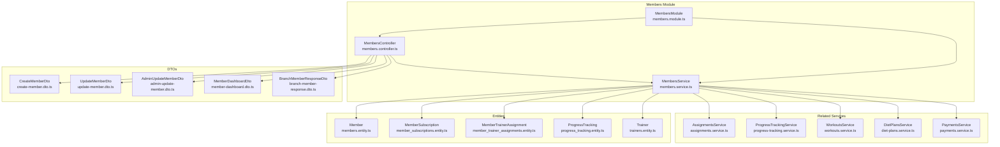
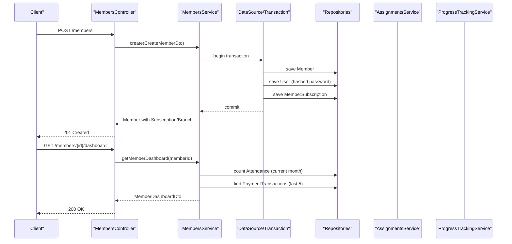
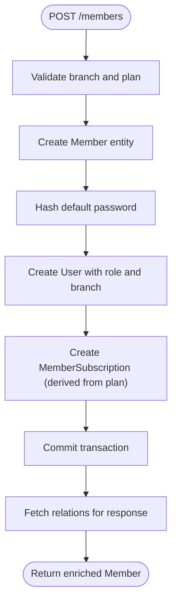
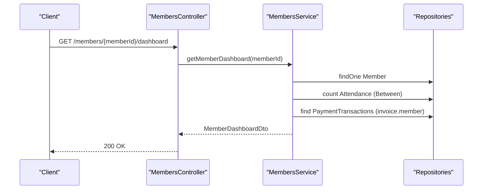
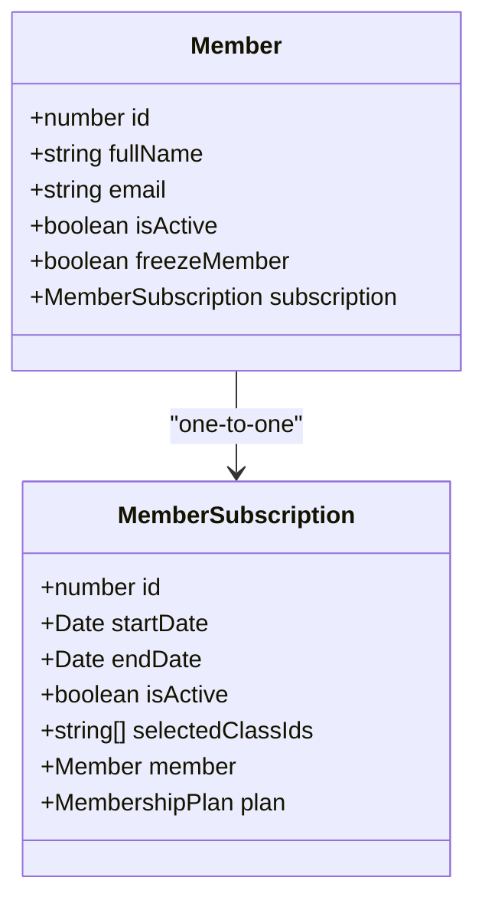
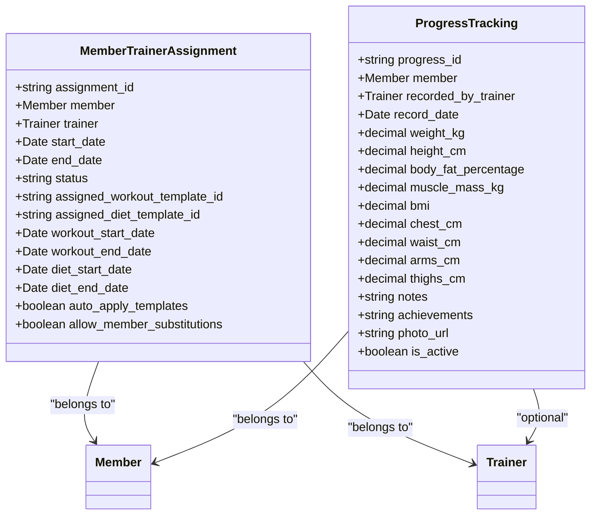
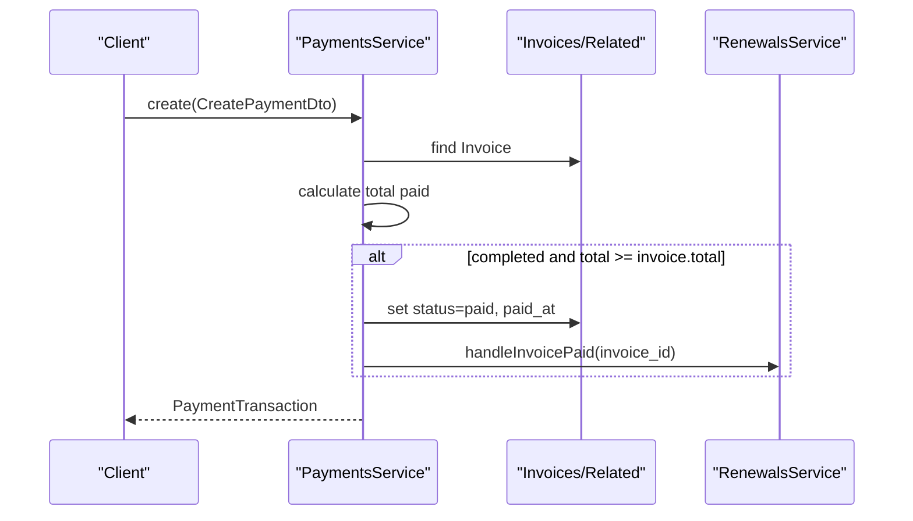
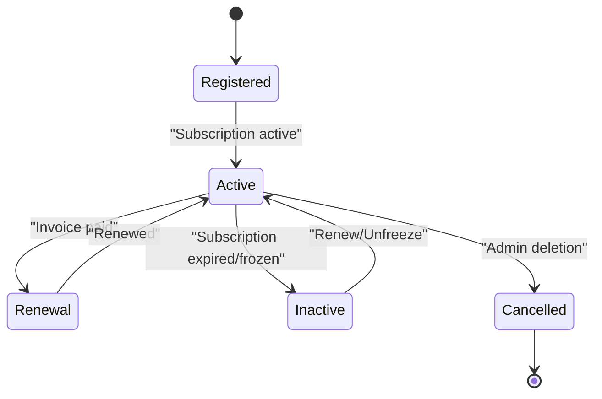
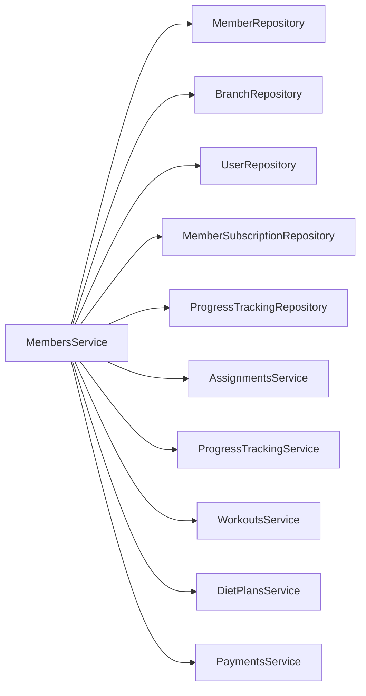

# Member Management

<cite>
**Referenced Files in This Document**
- [members.controller.ts](file://src/members/members.controller.ts)
- [members.service.ts](file://src/members/members.service.ts)
- [members.module.ts](file://src/members/members.module.ts)
- [create-member.dto.ts](file://src/members/dto/create-member.dto.ts)
- [update-member.dto.ts](file://src/members/dto/update-member.dto.ts)
- [admin-update-member.dto.ts](file://src/members/dto/admin-update-member.dto.ts)
- [member-dashboard.dto.ts](file://src/members/dto/member-dashboard.dto.ts)
- [branch-member-response.dto.ts](file://src/members/dto/branch-member-response.dto.ts)
- [members.entity.ts](file://src/entities/members.entity.ts)
- [member_subscriptions.entity.ts](file://src/entities/member_subscriptions.entity.ts)
- [member_trainer_assignments.entity.ts](file://src/entities/member_trainer_assignments.entity.ts)
- [progress_tracking.entity.ts](file://src/entities/progress_tracking.entity.ts)
- [trainers.entity.ts](file://src/entities/trainers.entity.ts)
- [assignments.service.ts](file://src/assignments/assignments.service.ts)
- [progress-tracking.service.ts](file://src/progress-tracking/progress-tracking.service.ts)
- [workouts.service.ts](file://src/workouts/workouts.service.ts)
- [diet-plans.service.ts](file://src/diet-plans/diet-plans.service.ts)
- [payments.service.ts](file://src/payments/payments.service.ts)
</cite>

## Table of Contents
1. [Introduction](#introduction)
2. [Project Structure](#project-structure)
3. [Core Components](#core-components)
4. [Architecture Overview](#architecture-overview)
5. [Detailed Component Analysis](#detailed-component-analysis)
6. [Dependency Analysis](#dependency-analysis)
7. [Performance Considerations](#performance-considerations)
8. [Troubleshooting Guide](#troubleshooting-guide)
9. [Conclusion](#conclusion)
10. [Appendices](#appendices)

## Introduction
This document explains the member management module for a gym management system built with NestJS. It covers member registration and profile creation, personal information management, emergency contacts, and medical information handling via related entities. It also documents the member dashboard, subscription management, trainer assignments, and activity tracking. The lifecycle from registration through active membership to renewal or cancellation is outlined, along with practical workflows for onboarding, profile updates, subscription enrollment, and progress monitoring. Integration points with training programs, nutrition plans, and payment systems are described, alongside member communication features and support ticket management.

## Project Structure
The member management module is organized around a controller-service pattern with supporting DTOs and TypeORM entities. Controllers expose REST endpoints, services encapsulate business logic, DTOs define request/response schemas, and entities model the persistence layer.

**Diagram sources**
- [members.controller.ts:36-553](file://src/members/members.controller.ts#L36-L553)
- [members.service.ts:24-561](file://src/members/members.service.ts#L24-L561)
- [members.module.ts:18-37](file://src/members/members.module.ts#L18-L37)
- [create-member.dto.ts:17-216](file://src/members/dto/create-member.dto.ts#L17-L216)
- [update-member.dto.ts:4-13](file://src/members/dto/update-member.dto.ts#L4-L13)
- [admin-update-member.dto.ts:4-7](file://src/members/dto/admin-update-member.dto.ts#L4-L7)
- [member-dashboard.dto.ts:3-94](file://src/members/dto/member-dashboard.dto.ts#L3-L94)
- [branch-member-response.dto.ts:98-168](file://src/members/dto/branch-member-response.dto.ts#L98-L168)
- [members.entity.ts:22-124](file://src/entities/members.entity.ts#L22-L124)
- [member_subscriptions.entity.ts:14-71](file://src/entities/member_subscriptions.entity.ts#L14-L71)
- [member_trainer_assignments.entity.ts:13-66](file://src/entities/member_trainer_assignments.entity.ts#L13-L66)
- [progress_tracking.entity.ts:12-73](file://src/entities/progress_tracking.entity.ts#L12-L73)
- [trainers.entity.ts:4-27](file://src/entities/trainers.entity.ts#L4-L27)
- [assignments.service.ts:27-258](file://src/assignments/assignments.service.ts#L27-L258)
- [progress-tracking.service.ts:15-299](file://src/progress-tracking/progress-tracking.service.ts#L15-L299)
- [workouts.service.ts:16-281](file://src/workouts/workouts.service.ts#L16-L281)
- [diet-plans.service.ts:14-180](file://src/diet-plans/diet-plans.service.ts#L14-L180)
- [payments.service.ts:16-490](file://src/payments/payments.service.ts#L16-L490)

**Section sources**
- [members.controller.ts:36-553](file://src/members/members.controller.ts#L36-L553)
- [members.service.ts:24-561](file://src/members/members.service.ts#L24-L561)
- [members.module.ts:18-37](file://src/members/members.module.ts#L18-L37)

## Core Components
- MembersController: Exposes endpoints for member CRUD, branch-scoped listing, and dashboard retrieval. Uses JWT guard and Swagger metadata for API documentation.
- MembersService: Implements core business logic including member creation with automatic user account and subscription creation, profile updates, branch queries, and dashboard aggregation.
- DTOs: Define validated input/output shapes for create, update, admin update, dashboard, and branch member responses.
- Entities: Model the domain including Member, MemberSubscription, MemberTrainerAssignment, ProgressTracking, and Trainer.

Key responsibilities:
- Registration: Validates branch and plan existence, creates Member, User, and MemberSubscription in a transaction, and returns enriched data.
- Profile Management: Updates personal info and enforces uniqueness constraints; admin endpoint supports sensitive fields.
- Dashboard: Aggregates subscription, attendance, and payment history for a member.
- Trainer Assignments: Manages assignments and template linking via AssignmentsService.
- Activity Tracking: Supports progress tracking, workout plans, and diet plans with role-based access controls.

**Section sources**
- [members.controller.ts:39-552](file://src/members/members.controller.ts#L39-L552)
- [members.service.ts:48-561](file://src/members/members.service.ts#L48-L561)
- [create-member.dto.ts:17-216](file://src/members/dto/create-member.dto.ts#L17-L216)
- [update-member.dto.ts:4-13](file://src/members/dto/update-member.dto.ts#L4-L13)
- [admin-update-member.dto.ts:4-7](file://src/members/dto/admin-update-member.dto.ts#L4-L7)
- [member-dashboard.dto.ts:3-94](file://src/members/dto/member-dashboard.dto.ts#L3-L94)
- [branch-member-response.dto.ts:98-168](file://src/members/dto/branch-member-response.dto.ts#L98-L168)
- [members.entity.ts:22-124](file://src/entities/members.entity.ts#L22-L124)
- [member_subscriptions.entity.ts:14-71](file://src/entities/member_subscriptions.entity.ts#L14-L71)
- [member_trainer_assignments.entity.ts:13-66](file://src/entities/member_trainer_assignments.entity.ts#L13-L66)
- [progress_tracking.entity.ts:12-73](file://src/entities/progress_tracking.entity.ts#L12-L73)
- [trainers.entity.ts:4-27](file://src/entities/trainers.entity.ts#L4-L27)

## Architecture Overview
The member management subsystem integrates with related modules for assignments, progress tracking, workouts, diet plans, and payments. The service orchestrates transactions and cross-entity queries to maintain consistency.

**Diagram sources**
- [members.controller.ts:39-552](file://src/members/members.controller.ts#L39-L552)
- [members.service.ts:48-561](file://src/members/members.service.ts#L48-L561)
- [assignments.service.ts:27-258](file://src/assignments/assignments.service.ts#L27-L258)
- [progress-tracking.service.ts:15-299](file://src/progress-tracking/progress-tracking.service.ts#L15-L299)

## Detailed Component Analysis

### Member Registration and Profile Creation
- Registration flow:
  - Validates branch and membership plan existence.
  - Creates Member entity with personal and emergency contact fields.
  - Creates User with default password hashing and links to branch/gym.
  - Creates MemberSubscription with start/end dates derived from plan duration.
  - Executes all saves inside a single transaction to ensure atomicity.
  - Returns enriched response with subscription plan, selected classes, and branch details.

- Profile creation and updates:
  - UpdateMemberDto excludes sensitive fields (branchId, membershipPlanId, isActive, freezeMember, selectedClassIds) for non-admin users.
  - AdminUpdateMemberDto allows admin-only modifications including sensitive fields and selectedClassIds.
  - Email uniqueness is enforced during updates.

- Personal information and emergency contacts:
  - Member entity includes fullName, email, phone, gender, dateOfBirth, address fields, avatarUrl, attachmentUrl, emergencyContactName, emergencyContactPhone.
  - DTOs enforce validation rules and maximum lengths.

- Medical information handling:
  - ProgressTracking entity captures weight, height, BMI, body composition metrics, and notes/photos.
  - Access controlled by role and member self-management permissions.

**Diagram sources**
- [members.service.ts:48-234](file://src/members/members.service.ts#L48-L234)
- [members.entity.ts:22-124](file://src/entities/members.entity.ts#L22-L124)
- [member_subscriptions.entity.ts:14-71](file://src/entities/member_subscriptions.entity.ts#L14-L71)

**Section sources**
- [members.controller.ts:39-222](file://src/members/members.controller.ts#L39-L222)
- [members.service.ts:48-234](file://src/members/members.service.ts#L48-L234)
- [create-member.dto.ts:17-216](file://src/members/dto/create-member.dto.ts#L17-L216)
- [update-member.dto.ts:4-13](file://src/members/dto/update-member.dto.ts#L4-L13)
- [admin-update-member.dto.ts:4-7](file://src/members/dto/admin-update-member.dto.ts#L4-L7)
- [members.entity.ts:22-124](file://src/entities/members.entity.ts#L22-L124)
- [progress_tracking.entity.ts:12-73](file://src/entities/progress_tracking.entity.ts#L12-L73)

### Member Dashboard Functionality
- Retrieves:
  - Member profile and branch info.
  - Active subscription details (plan name, start/end dates, status).
  - Current month attendance count.
  - Recent payment history (last 5 transactions) linked to invoices.

- Status determination:
  - Subscription status computed via utility to reflect active/inactive based on current date.

**Diagram sources**
- [members.controller.ts:526-552](file://src/members/members.controller.ts#L526-L552)
- [members.service.ts:468-543](file://src/members/members.service.ts#L468-L543)

**Section sources**
- [members.controller.ts:526-552](file://src/members/members.controller.ts#L526-L552)
- [members.service.ts:468-543](file://src/members/members.service.ts#L468-L543)
- [member-dashboard.dto.ts:3-94](file://src/members/dto/member-dashboard.dto.ts#L3-L94)

### Subscription Management
- Onboarding subscriptions:
  - Derived from membership plan duration; start/end dates calculated at registration.
  - selectedClassIds stored as UUID array on MemberSubscription.

- Admin updates to classes:
  - selectedClassIds handled separately from other Member fields.
  - Raw SQL used to update PostgreSQL array column safely.

- Status computation:
  - Active/inactive determined by comparing current date against subscription dates.

**Diagram sources**
- [members.entity.ts:22-124](file://src/entities/members.entity.ts#L22-L124)
- [member_subscriptions.entity.ts:14-71](file://src/entities/member_subscriptions.entity.ts#L14-L71)

**Section sources**
- [members.service.ts:117-163](file://src/members/members.service.ts#L117-L163)
- [members.service.ts:319-354](file://src/members/members.service.ts#L319-L354)
- [member_subscriptions.entity.ts:14-71](file://src/entities/member_subscriptions.entity.ts#L14-L71)

### Trainer Assignments and Activity Tracking
- Trainer assignments:
  - MemberTrainerAssignment links members and trainers with start/end dates, status, and template assignment fields.
  - AssignmentsService handles creation, lookup, and template assignment/removal.

- Activity tracking:
  - ProgressTrackingService validates roles and ownership for creating/updating/deleting records.
  - ProgressTracking entity stores biometric measurements and photos.

**Diagram sources**
- [member_trainer_assignments.entity.ts:13-66](file://src/entities/member_trainer_assignments.entity.ts#L13-L66)
- [progress_tracking.entity.ts:12-73](file://src/entities/progress_tracking.entity.ts#L12-L73)
- [trainers.entity.ts:4-27](file://src/entities/trainers.entity.ts#L4-L27)

**Section sources**
- [assignments.service.ts:27-258](file://src/assignments/assignments.service.ts#L27-L258)
- [progress-tracking.service.ts:15-299](file://src/progress-tracking/progress-tracking.service.ts#L15-L299)
- [member_trainer_assignments.entity.ts:13-66](file://src/entities/member_trainer_assignments.entity.ts#L13-L66)
- [progress_tracking.entity.ts:12-73](file://src/entities/progress_tracking.entity.ts#L12-L73)

### Training Programs, Nutrition Plans, and Payment Systems Integration
- Training programs:
  - WorkoutsService manages workout plans and exercises with role-based access and trainer assignment checks.

- Nutrition plans:
  - DietPlansService manages diet plans with role-based access and creator validation.

- Payments:
  - PaymentsService handles payment creation, verification, refunds, and invoice status transitions.
  - Integrates with renewals service upon invoice paid events.

**Diagram sources**
- [payments.service.ts:26-79](file://src/payments/payments.service.ts#L26-L79)

**Section sources**
- [workouts.service.ts:16-281](file://src/workouts/workouts.service.ts#L16-L281)
- [diet-plans.service.ts:14-180](file://src/diet-plans/diet-plans.service.ts#L14-L180)
- [payments.service.ts:26-79](file://src/payments/payments.service.ts#L26-L79)

### Member Lifecycle: Registration to Renewal/Cancellation
- Registration: Member created with default password, User account, and subscription derived from plan.
- Active Membership: Dashboard shows subscription status, attendance, and payment history.
- Renewal: PaymentsService triggers renewal handling upon invoice paid.
- Cancellation: Deletion endpoint removes member and dependent records (requires admin privileges).

**Diagram sources**
- [members.service.ts:468-543](file://src/members/members.service.ts#L468-L543)
- [payments.service.ts:75-76](file://src/payments/payments.service.ts#L75-L76)

**Section sources**
- [members.controller.ts:461-524](file://src/members/members.controller.ts#L461-L524)
- [members.service.ts:468-543](file://src/members/members.service.ts#L468-L543)
- [payments.service.ts:75-76](file://src/payments/payments.service.ts#L75-L76)

### Practical Workflows

#### Member Onboarding Workflow
- Steps:
  - Admin selects branch and membership plan.
  - Submit CreateMemberDto with personal info, emergency contacts, and optional selected class IDs.
  - System validates inputs, creates Member/User/Subscription transactionally, and returns enriched profile.

- Example payload path:
  - [create-member.dto.ts:17-216](file://src/members/dto/create-member.dto.ts#L17-L216)

**Section sources**
- [members.controller.ts:39-222](file://src/members/members.controller.ts#L39-L222)
- [members.service.ts:48-234](file://src/members/members.service.ts#L48-L234)
- [create-member.dto.ts:17-216](file://src/members/dto/create-member.dto.ts#L17-L216)

#### Profile Update Workflow
- Steps:
  - Regular member uses UpdateMemberDto to change non-sensitive fields.
  - Admin uses AdminUpdateMemberDto to modify sensitive fields and selectedClassIds.
  - Email uniqueness is enforced.

- Example payload paths:
  - [update-member.dto.ts:4-13](file://src/members/dto/update-member.dto.ts#L4-L13)
  - [admin-update-member.dto.ts:4-7](file://src/members/dto/admin-update-member.dto.ts#L4-L7)

**Section sources**
- [members.controller.ts:328-459](file://src/members/members.controller.ts#L328-L459)
- [members.service.ts:273-360](file://src/members/members.service.ts#L273-L360)
- [update-member.dto.ts:4-13](file://src/members/dto/update-member.dto.ts#L4-L13)
- [admin-update-member.dto.ts:4-7](file://src/members/dto/admin-update-member.dto.ts#L4-L7)

#### Subscription Enrollment Workflow
- Steps:
  - During registration, selectedClassIds are stored on MemberSubscription.
  - Admin can update selectedClassIds via adminUpdate endpoint using raw SQL to update array column.

**Section sources**
- [members.service.ts:117-163](file://src/members/members.service.ts#L117-L163)
- [members.service.ts:319-354](file://src/members/members.service.ts#L319-L354)
- [member_subscriptions.entity.ts:66-69](file://src/entities/member_subscriptions.entity.ts#L66-L69)

#### Progress Monitoring Workflow
- Steps:
  - Trainer or Admin creates ProgressTracking records with measurements and photos.
  - Access controlled by role and member self-management permissions.
  - View progress records per member or per user (owner/trainer).

**Section sources**
- [progress-tracking.service.ts:28-110](file://src/progress-tracking/progress-tracking.service.ts#L28-L110)
- [progress-tracking.service.ts:131-197](file://src/progress-tracking/progress-tracking.service.ts#L131-L197)
- [progress-tracking.service.ts:246-299](file://src/progress-tracking/progress-tracking.service.ts#L246-L299)
- [progress_tracking.entity.ts:12-73](file://src/entities/progress_tracking.entity.ts#L12-L73)

#### Trainer Assignment Workflow
- Steps:
  - Create assignment with member, trainer, and dates.
  - Optionally assign workout/diet templates with start/end dates and settings.
  - Retrieve assigned templates and update settings.

**Section sources**
- [assignments.service.ts:41-74](file://src/assignments/assignments.service.ts#L41-L74)
- [assignments.service.ts:128-190](file://src/assignments/assignments.service.ts#L128-L190)
- [assignments.service.ts:192-224](file://src/assignments/assignments.service.ts#L192-L224)
- [member_trainer_assignments.entity.ts:13-66](file://src/entities/member_trainer_assignments.entity.ts#L13-L66)

#### Payment Integration Workflow
- Steps:
  - Add payment to invoice; if total paid meets threshold, invoice marked paid and renewal handled.
  - Verify payment to update status and recompute totals.
  - Refund payment with validation and remaining balance recalculation.

**Section sources**
- [payments.service.ts:26-79](file://src/payments/payments.service.ts#L26-L79)
- [payments.service.ts:156-204](file://src/payments/payments.service.ts#L156-L204)
- [payments.service.ts:206-301](file://src/payments/payments.service.ts#L206-L301)

### Communication Features and Support Ticket Management
- Notifications and reminders are supported by dedicated modules (notifications, reminders) referenced in the project structure. While not detailed here, member management integrates with these systems for communication and alerts.

[No sources needed since this section provides general guidance]

## Dependency Analysis
- Coupling:
  - MembersService depends on multiple repositories and the DataSource for transactions.
  - Integrates with AssignmentsService, ProgressTrackingService, WorkoutsService, DietPlansService, and PaymentsService for comprehensive member lifecycle management.

- Cohesion:
  - MembersController and MembersService encapsulate member-centric operations with clear separation of concerns.

- External dependencies:
  - TypeORM for ORM and PostgreSQL-specific array handling.
  - Class-validator and Swagger for DTO validation and API documentation.

**Diagram sources**
- [members.service.ts:24-46](file://src/members/members.service.ts#L24-L46)
- [members.module.ts:18-31](file://src/members/members.module.ts#L18-L31)

**Section sources**
- [members.service.ts:24-46](file://src/members/members.service.ts#L24-L46)
- [members.module.ts:18-31](file://src/members/members.module.ts#L18-L31)

## Performance Considerations
- Transactional consistency: All registration steps execute within a single transaction to prevent partial writes.
- Array updates: selectedClassIds updated via raw SQL to avoid ORM overhead for PostgreSQL arrays.
- Aggregation queries: Dashboard uses joins and date-range filters to compute attendance and payment summaries efficiently.
- Pagination and sorting: Related services use ordering and take clauses to limit result sets.

[No sources needed since this section provides general guidance]

## Troubleshooting Guide
- Validation errors:
  - Ensure DTO fields meet validation criteria (e.g., email uniqueness, UUID formats, enum values).
- Not found errors:
  - Verify branchId, membershipPlanId, member IDs, and related entity IDs exist.
- Unauthorized/Forbidden:
  - Confirm JWT bearer token and required roles (ADMIN/SUPERADMIN) for admin endpoints.
- Duplicate entries:
  - Email uniqueness is enforced; conflicts raise conflict exceptions.
- Cascade deletion:
  - Removing members triggers cascading deletions for related records.

**Section sources**
- [members.controller.ts:124-177](file://src/members/members.controller.ts#L124-L177)
- [members.controller.ts:430-459](file://src/members/members.controller.ts#L430-L459)
- [members.service.ts:134-174](file://src/members/members.service.ts#L134-L174)
- [members.service.ts:362-365](file://src/members/members.service.ts#L362-L365)

## Conclusion
The member management module provides a robust foundation for onboarding, maintaining, and monitoring members. It ensures data integrity through transactions, supports flexible trainer and program integrations, and offers comprehensive dashboards and payment workflows. The design balances role-based access control with operational efficiency, enabling scalable gym operations.

## Appendices
- API Endpoints Overview:
  - POST /members: Create member with subscription and classes.
  - PATCH /members/{id}: Update member (non-admin).
  - PATCH /members/admin/{id}: Admin update (admin-only).
  - DELETE /members/{id}: Remove member (admin-only).
  - GET /members/{id}/dashboard: Member dashboard data.
  - GET /branches/{branchId}/members: Branch members with subscription/class details.

**Section sources**
- [members.controller.ts:39-552](file://src/members/members.controller.ts#L39-L552)
- [members.controller.ts:555-727](file://src/members/members.controller.ts#L555-L727)