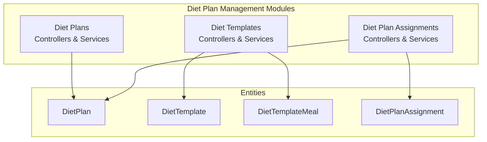
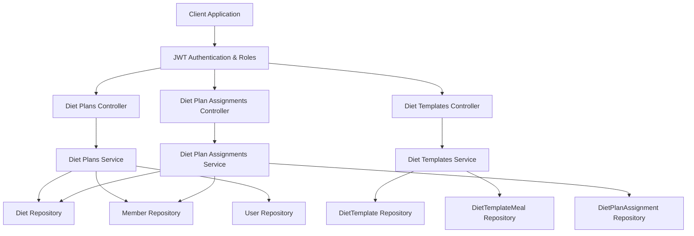
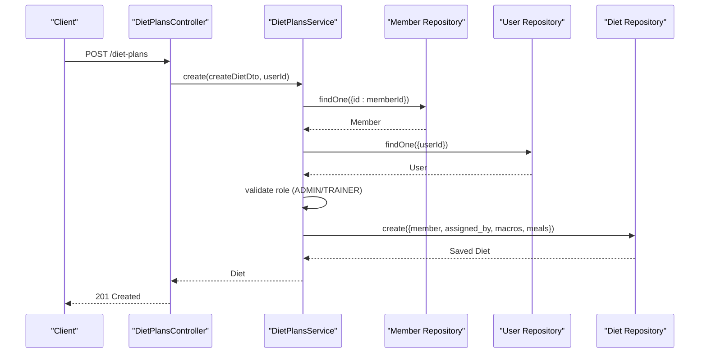
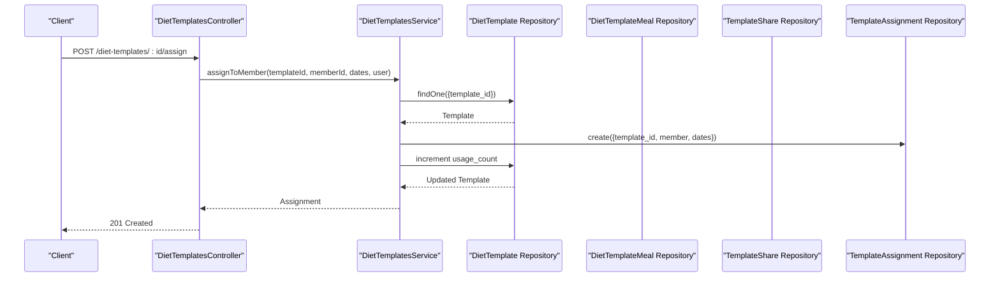
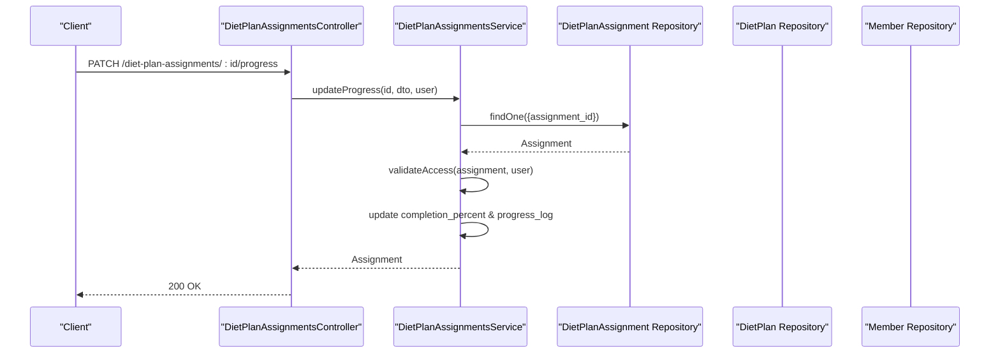
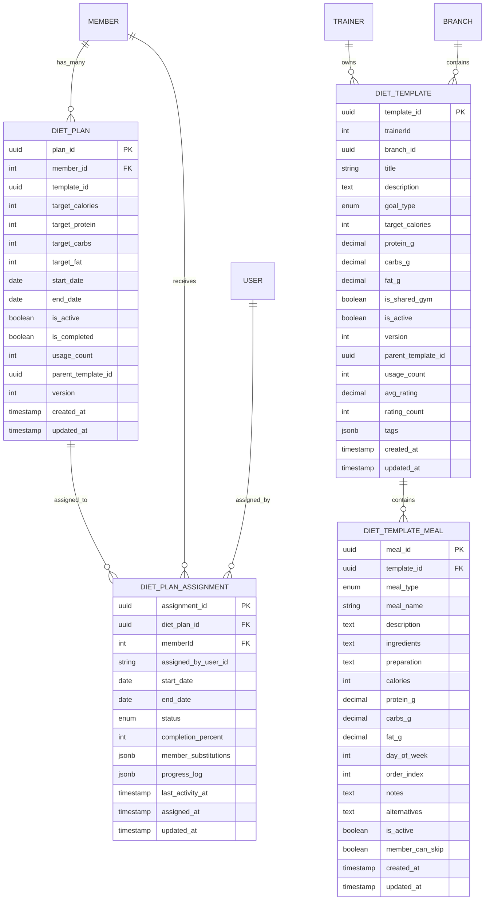
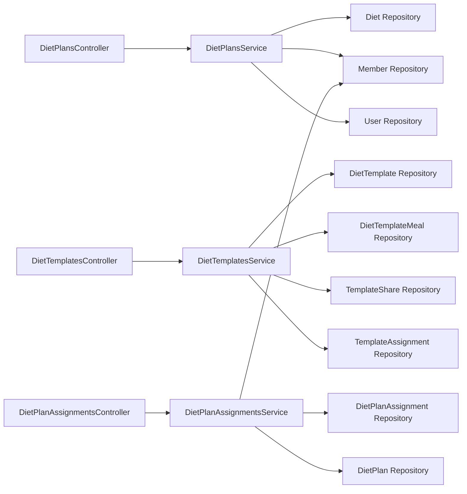

# Diet Plan Management

<cite>
**Referenced Files in This Document**
- [diet-plans.controller.ts](file://src/diet-plans/diet-plans.controller.ts)
- [diet-plans.service.ts](file://src/diet-plans/diet-plans.service.ts)
- [diet-assignments.controller.ts](file://src/diet-plans/diet-assignments.controller.ts)
- [diet-assignments.service.ts](file://src/diet-plans/diet-assignments.service.ts)
- [diet-templates.controller.ts](file://src/diet-plans/diet-templates.controller.ts)
- [diet-templates.service.ts](file://src/diet-plans/diet-templates.service.ts)
- [create-diet.dto.ts](file://src/diet-plans/dto/create-diet.dto.ts)
- [update-diet.dto.ts](file://src/diet-plans/dto/update-diet.dto.ts)
- [diet-assignment.dto.ts](file://src/diet-plans/dto/diet-assignment.dto.ts)
- [create-diet-template.dto.ts](file://src/diet-plans/dto/create-diet-template.dto.ts)
- [diet_plans.entity.ts](file://src/entities/diet_plans.entity.ts)
- [diet_plan_assignments.entity.ts](file://src/entities/diet_plan_assignments.entity.ts)
- [diet_templates.entity.ts](file://src/entities/diet_templates.entity.ts)
- [diet_template_meals.entity.ts](file://src/entities/diet_template_meals.entity.ts)
- [diet-plans.module.ts](file://src/diet-plans/diet-plans.module.ts)
- [diet-assignments.module.ts](file://src/diet-plans/diet-assignments.module.ts)
- [diet-templates.module.ts](file://src/diet-plans/diet-templates.module.ts)
</cite>

## Table of Contents
1. [Introduction](#introduction)
2. [Project Structure](#project-structure)
3. [Core Components](#core-components)
4. [Architecture Overview](#architecture-overview)
5. [Detailed Component Analysis](#detailed-component-analysis)
6. [Dependency Analysis](#dependency-analysis)
7. [Performance Considerations](#performance-considerations)
8. [Troubleshooting Guide](#troubleshooting-guide)
9. [Conclusion](#conclusion)

## Introduction
This document provides comprehensive documentation for the diet plan management functionality within the gym management system. It covers the complete workflow for creating, updating, and managing individualized diet plans for members, including nutritional requirements calculation, macronutrient distribution, caloric intake planning, and dietary restriction handling. The system supports both direct diet plan creation and template-based approaches, enabling nutritionists and trainers to distribute plans to members, track plan status, and manage plan modifications. Practical examples demonstrate customized diet plans with specific caloric targets, protein/carbohydrate/fat ratios, meal timing schedules, and special dietary needs. Integration points with member profiles, trainer assignment systems, and progress tracking mechanisms are documented, along with plan approval workflows, member acceptance processes, and plan archiving procedures.

## Project Structure
The diet plan management feature is organized into three primary modules:
- Diet Plans: Handles individualized diet plan creation, updates, and retrieval for members.
- Diet Templates: Manages reusable diet templates with meals, sharing, and assignment workflows.
- Diet Plan Assignments: Controls the distribution of diet plans to members, progress tracking, substitutions, and cancellation.

**Diagram sources**
- [diet-plans.controller.ts:30-235](file://src/diet-plans/diet-plans.controller.ts#L30-L235)
- [diet-templates.controller.ts:38-517](file://src/diet-plans/diet-templates.controller.ts#L38-L517)
- [diet-assignments.controller.ts:27-107](file://src/diet-plans/diet-assignments.controller.ts#L27-L107)
- [diet_plans.entity.ts:15-95](file://src/entities/diet_plans.entity.ts#L15-L95)
- [diet_templates.entity.ts:14-88](file://src/entities/diet_templates.entity.ts#L14-L88)
- [diet_template_meals.entity.ts:11-75](file://src/entities/diet_template_meals.entity.ts#L11-L75)
- [diet_plan_assignments.entity.ts:20-83](file://src/entities/diet_plan_assignments.entity.ts#L20-L83)

**Section sources**
- [diet-plans.module.ts:10-16](file://src/diet-plans/diet-plans.module.ts#L10-L16)
- [diet-templates.module.ts:10-23](file://src/diet-plans/diet-templates.module.ts#L10-L23)
- [diet-assignments.module.ts:9-21](file://src/diet-plans/diet-assignments.module.ts#L9-L21)

## Core Components
This section outlines the primary components responsible for diet plan management, including controllers, services, DTOs, and entities.

- Controllers
  - Diet Plans Controller: Exposes endpoints for creating, retrieving, updating, deleting, and filtering diet plans. It enforces JWT authentication and role-based access control.
  - Diet Templates Controller: Provides endpoints for template creation, retrieval, copying, sharing, rating, assigning to members, updating, and deletion. Includes role-based permissions for trainers and admins.
  - Diet Plan Assignments Controller: Manages assignment creation, progress updates, substitutions, linking to workout charts, cancellation, and removal. Enforces role-based access for trainers and admins.

- Services
  - Diet Plans Service: Implements business logic for diet plan CRUD operations, member and user validation, permission checks, and role-based filtering for retrieval.
  - Diet Templates Service: Handles template lifecycle operations including creation, updates, copying, sharing, rating, assignment to members, and access validation.
  - Diet Plan Assignments Service: Manages assignment workflows, progress logging, substitutions, linking to chart assignments, cancellation, and removal with access validation.

- DTOs
  - CreateDietDto: Defines the payload for creating individualized diet plans with caloric and macronutrient targets and optional meals array.
  - UpdateDietDto: Extends CreateDietDto for partial updates.
  - CreateDietAssignmentDto: Specifies the payload for assigning a diet plan to a member, including start/end dates.
  - DietSubstitutionDto: Captures meal substitution records with reasons.
  - UpdateDietProgressDto: Updates completion percentage and progress notes.
  - CreateDietTemplateDto: Defines template creation payload including nutritional targets, meals, and metadata.
  - UpdateDietTemplateDto: Supports template updates excluding meals.
  - CopyDietTemplateDto: Handles template duplication with new title/description.
  - RateDietTemplateDto: Records template ratings.
  - AssignDietTemplateDto: Assigns templates to members with optional assignment IDs and date ranges.

- Entities
  - DietPlan: Represents individualized diet plans with targets, dates, status, and associated meals.
  - DietTemplate: Represents reusable diet templates with nutritional targets, meals, sharing, and usage metrics.
  - DietTemplateMeal: Defines individual meals within templates with nutritional values and scheduling attributes.
  - DietPlanAssignment: Tracks the assignment of a diet plan to a member, status, progress logs, substitutions, and activity timestamps.

**Section sources**
- [diet-plans.controller.ts:30-235](file://src/diet-plans/diet-plans.controller.ts#L30-L235)
- [diet-templates.controller.ts:38-517](file://src/diet-plans/diet-templates.controller.ts#L38-L517)
- [diet-assignments.controller.ts:27-107](file://src/diet-plans/diet-assignments.controller.ts#L27-L107)
- [diet-plans.service.ts:14-180](file://src/diet-plans/diet-plans.service.ts#L14-L180)
- [diet-templates.service.ts:22-359](file://src/diet-plans/diet-templates.service.ts#L22-L359)
- [diet-assignments.service.ts:19-258](file://src/diet-plans/diet-assignments.service.ts#L19-L258)
- [create-diet.dto.ts:3-26](file://src/diet-plans/dto/create-diet.dto.ts#L3-L26)
- [update-diet.dto.ts:1-5](file://src/diet-plans/dto/update-diet.dto.ts#L1-L5)
- [diet-assignment.dto.ts:15-97](file://src/diet-plans/dto/diet-assignment.dto.ts#L15-L97)
- [create-diet-template.dto.ts:90-262](file://src/diet-plans/dto/create-diet-template.dto.ts#L90-L262)
- [diet_plans.entity.ts:15-95](file://src/entities/diet_plans.entity.ts#L15-L95)
- [diet_templates.entity.ts:14-88](file://src/entities/diet_templates.entity.ts#L14-L88)
- [diet_template_meals.entity.ts:11-75](file://src/entities/diet_template_meals.entity.ts#L11-L75)
- [diet_plan_assignments.entity.ts:20-83](file://src/entities/diet_plan_assignments.entity.ts#L20-L83)

## Architecture Overview
The diet plan management system follows a layered architecture with clear separation of concerns:
- Presentation Layer: Controllers handle HTTP requests, apply guards, and delegate to services.
- Business Logic Layer: Services encapsulate domain logic, enforce permissions, and coordinate with repositories.
- Data Access Layer: TypeORM repositories manage persistence and relationships between entities.
- Validation Layer: DTOs with class-validator decorators ensure input integrity and constraints.

**Diagram sources**
- [diet-plans.controller.ts:30-235](file://src/diet-plans/diet-plans.controller.ts#L30-L235)
- [diet-templates.controller.ts:38-517](file://src/diet-plans/diet-templates.controller.ts#L38-L517)
- [diet-assignments.controller.ts:27-107](file://src/diet-plans/diet-assignments.controller.ts#L27-L107)
- [diet-plans.service.ts:14-180](file://src/diet-plans/diet-plans.service.ts#L14-L180)
- [diet-templates.service.ts:22-359](file://src/diet-plans/diet-templates.service.ts#L22-L359)
- [diet-assignments.service.ts:19-258](file://src/diet-plans/diet-assignments.service.ts#L19-L258)

## Detailed Component Analysis

### Diet Plans Module
The Diet Plans module enables creation, retrieval, updates, and deletions of individualized diet plans for members. It validates member existence, user identity, and permissions, ensuring only authorized users (admins/trainers) can create or modify plans.

Key capabilities:
- Create diet plans with caloric and macronutrient targets and optional meals.
- Retrieve all plans with filtering by status, member, trainer, or goal type.
- Fetch a single plan by ID with related member and creator information.
- Update or delete plans with strict ownership and role checks.
- Query plans by member or by the current user's assignments.

**Diagram sources**
- [diet-plans.controller.ts:111-116](file://src/diet-plans/diet-plans.controller.ts#L111-L116)
- [diet-plans.service.ts:25-63](file://src/diet-plans/diet-plans.service.ts#L25-L63)

Practical example scenarios:
- Weight loss plan: Caloric target of 1800 with macronutrient distribution supporting fat loss.
- Muscle gain plan: Higher caloric intake with increased protein targets to support muscle synthesis.
- Special dietary needs: Plans accommodate restrictions via optional meals array and notes.

**Section sources**
- [diet-plans.controller.ts:35-116](file://src/diet-plans/diet-plans.controller.ts#L35-L116)
- [diet-plans.service.ts:25-180](file://src/diet-plans/diet-plans.service.ts#L25-L180)
- [create-diet.dto.ts:3-26](file://src/diet-plans/dto/create-diet.dto.ts#L3-L26)
- [update-diet.dto.ts:1-5](file://src/diet-plans/dto/update-diet.dto.ts#L1-L5)
- [diet_plans.entity.ts:15-95](file://src/entities/diet_plans.entity.ts#L15-L95)

### Diet Templates Module
The Diet Templates module provides reusable diet templates with meals, enabling trainers and admins to create standardized plans. It supports template sharing, copying, rating, and assignment to members.

Key capabilities:
- Create templates with nutritional targets and detailed meals.
- Copy templates with version increments and ownership transfer.
- Share templates with specific trainers and accept shares.
- Assign templates to members with optional assignment IDs and date ranges.
- Update templates with role-based access controls.
- Rate templates to build community feedback.

**Diagram sources**
- [diet-templates.controller.ts:420-432](file://src/diet-plans/diet-templates.controller.ts#L420-L432)
- [diet-templates.service.ts:289-314](file://src/diet-plans/diet-templates.service.ts#L289-L314)

Practical example scenarios:
- Public gym template: Shared across the gym for general fitness goals.
- Private trainer template: Owned by a specific trainer for personalized client plans.
- Template copying: Creating updated versions while preserving lineage and usage statistics.

**Section sources**
- [diet-templates.controller.ts:42-517](file://src/diet-plans/diet-templates.controller.ts#L42-L517)
- [diet-templates.service.ts:35-359](file://src/diet-plans/diet-templates.service.ts#L35-L359)
- [create-diet-template.dto.ts:90-262](file://src/diet-plans/dto/create-diet-template.dto.ts#L90-L262)
- [diet_templates.entity.ts:14-88](file://src/entities/diet_templates.entity.ts#L14-L88)
- [diet_template_meals.entity.ts:11-75](file://src/entities/diet_template_meals.entity.ts#L11-L75)

### Diet Plan Assignments Module
The Diet Plan Assignments module manages the distribution of diet plans to members, progress tracking, substitutions, and administrative actions.

Key capabilities:
- Assign diet plans to members with start/end dates and active status.
- Track progress via completion percentage and progress logs.
- Record meal substitutions with reasons and timestamps.
- Link assignments to workout chart assignments for integrated health tracking.
- Cancel or remove assignments with role-based permissions.
- Filter assignments by member, status, and pagination.

**Diagram sources**
- [diet-assignments.controller.ts:62-70](file://src/diet-plans/diet-assignments.controller.ts#L62-L70)
- [diet-assignments.service.ts:158-182](file://src/diet-plans/diet-assignments.service.ts#L158-L182)

Practical example scenarios:
- Active assignment tracking: Monitoring completion percentage and progress notes.
- Meal substitutions: Recording substitutions with reasons for audit and adjustments.
- Chart integration: Linking diet assignments to workout chart assignments for holistic health management.

**Section sources**
- [diet-assignments.controller.ts:34-105](file://src/diet-plans/diet-assignments.controller.ts#L34-L105)
- [diet-assignments.service.ts:30-258](file://src/diet-plans/diet-assignments.service.ts#L30-L258)
- [diet-assignment.dto.ts:15-97](file://src/diet-plans/dto/diet-assignment.dto.ts#L15-L97)
- [diet_plan_assignments.entity.ts:20-83](file://src/entities/diet_plan_assignments.entity.ts#L20-L83)

### Data Models and Relationships
The system employs a set of entities representing diet plans, templates, meals, and assignments with clear relationships and constraints.

**Diagram sources**
- [diet_plans.entity.ts:15-95](file://src/entities/diet_plans.entity.ts#L15-L95)
- [diet_templates.entity.ts:14-88](file://src/entities/diet_templates.entity.ts#L14-L88)
- [diet_template_meals.entity.ts:11-75](file://src/entities/diet_template_meals.entity.ts#L11-L75)
- [diet_plan_assignments.entity.ts:20-83](file://src/entities/diet_plan_assignments.entity.ts#L20-L83)

## Dependency Analysis
The modules exhibit clear separation of concerns with explicit dependencies:
- Controllers depend on services for business logic.
- Services depend on repositories for data access.
- Entities define relationships and constraints enforced by TypeORM.
- DTOs validate and structure incoming/outgoing data.

**Diagram sources**
- [diet-plans.controller.ts:30-235](file://src/diet-plans/diet-plans.controller.ts#L30-L235)
- [diet-templates.controller.ts:38-517](file://src/diet-plans/diet-templates.controller.ts#L38-L517)
- [diet-assignments.controller.ts:27-107](file://src/diet-plans/diet-assignments.controller.ts#L27-L107)
- [diet-plans.service.ts:14-180](file://src/diet-plans/diet-plans.service.ts#L14-L180)
- [diet-templates.service.ts:22-359](file://src/diet-plans/diet-templates.service.ts#L22-L359)
- [diet-assignments.service.ts:19-258](file://src/diet-plans/diet-assignments.service.ts#L19-L258)

**Section sources**
- [diet-plans.module.ts:10-16](file://src/diet-plans/diet-plans.module.ts#L10-L16)
- [diet-templates.module.ts:10-23](file://src/diet-plans/diet-templates.module.ts#L10-L23)
- [diet-assignments.module.ts:9-21](file://src/diet-plans/diet-assignments.module.ts#L9-L21)

## Performance Considerations
- Pagination and Filtering: Controllers implement pagination and filtering to manage large datasets efficiently. Services apply role-based filtering to reduce unnecessary data retrieval.
- Lazy Loading and Relations: Controllers and services use relation loading selectively to minimize query overhead. Consider optimizing queries with joins where appropriate.
- Validation Overhead: DTO validations add minimal overhead but are essential for data integrity. Keep validators concise and avoid redundant checks.
- Caching Opportunities: For frequently accessed templates and plans, consider implementing caching strategies to reduce database load.
- Batch Operations: When copying templates or assigning multiple plans, batch operations can improve throughput.

## Troubleshooting Guide
Common issues and resolutions:
- Unauthorized Access: Ensure JWT tokens are present and roles are verified. Controllers enforce role-based access for sensitive operations.
- Permission Denied: Verify user roles (ADMIN/TRAINER) and ownership checks for updates/deletes. Services validate user permissions before performing operations.
- Resource Not Found: Confirm member, user, template, or plan existence before operations. Services throw not-found exceptions when resources are missing.
- Validation Errors: Review DTO constraints and ensure payloads meet validation criteria. Fix field types and required attributes.
- Progress Tracking Issues: Verify assignment existence and access permissions before updating progress or substitutions.

**Section sources**
- [diet-plans.service.ts:25-180](file://src/diet-plans/diet-plans.service.ts#L25-L180)
- [diet-templates.service.ts:35-359](file://src/diet-plans/diet-templates.service.ts#L35-L359)
- [diet-assignments.service.ts:30-258](file://src/diet-plans/diet-assignments.service.ts#L30-L258)

## Conclusion
The diet plan management system provides a robust framework for creating, distributing, and tracking individualized and templated diet plans. It integrates seamlessly with member profiles, trainer assignments, and progress tracking, while enforcing strict role-based access controls and comprehensive validation. The modular architecture ensures maintainability and scalability, supporting practical workflows from plan creation to assignment management and progress monitoring.