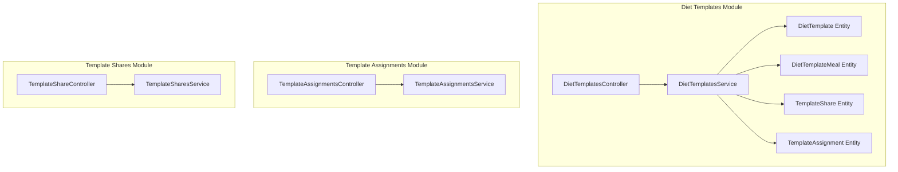
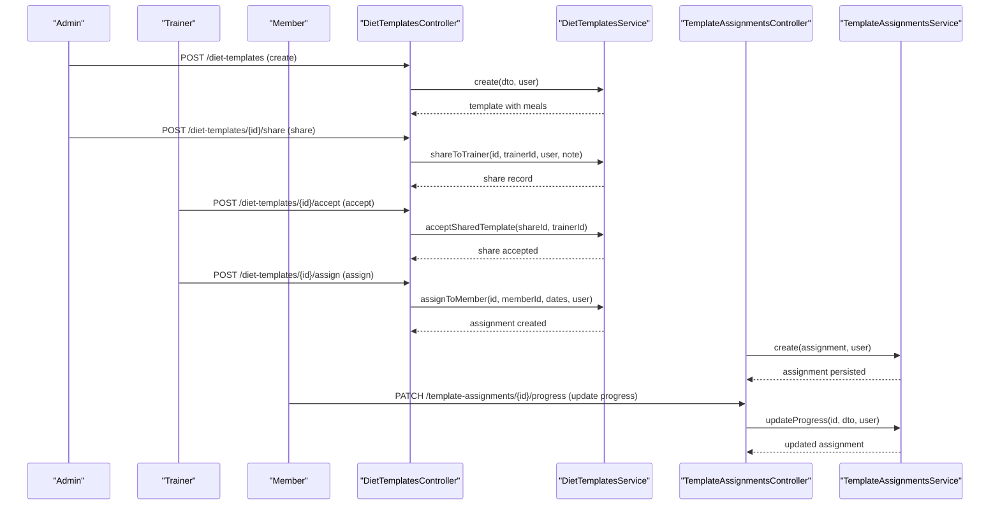
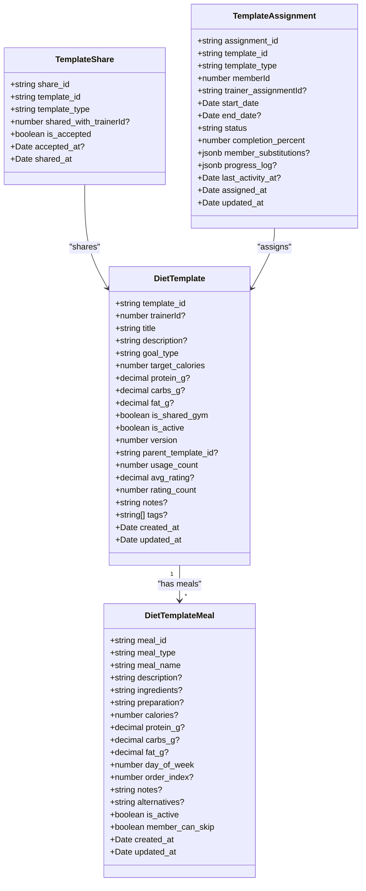
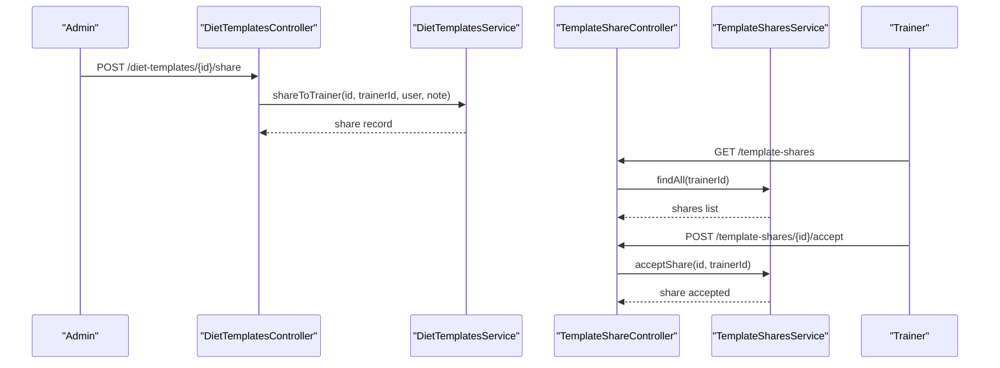
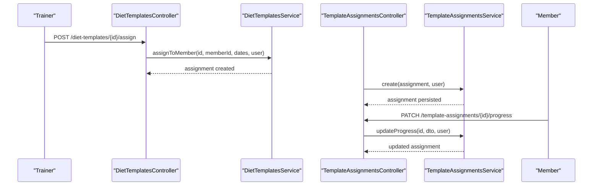
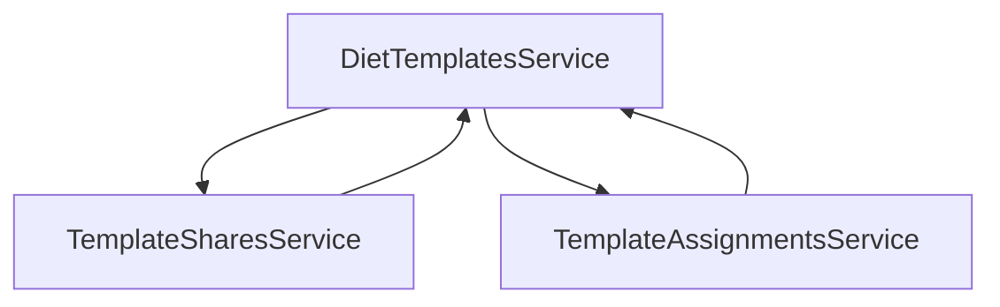

# Diet Template System

<cite>
**Referenced Files in This Document**
- [diet-templates.controller.ts](file://src/diet-plans/diet-templates.controller.ts)
- [diet-templates.service.ts](file://src/diet-plans/diet-templates.service.ts)
- [diet-templates.module.ts](file://src/diet-plans/diet-templates.module.ts)
- [create-diet-template.dto.ts](file://src/diet-plans/dto/create-diet-template.dto.ts)
- [diet_templates.entity.ts](file://src/entities/diet_templates.entity.ts)
- [diet_template_meals.entity.ts](file://src/entities/diet_template_meals.entity.ts)
- [template_shares.entity.ts](file://src/entities/template_shares.entity.ts)
- [template_assignments.entity.ts](file://src/entities/template_assignments.entity.ts)
- [diet_plans.entity.ts](file://src/entities/diet_plans.entity.ts)
- [diet_plan_meals.entity.ts](file://src/entities/diet_plan_meals.entity.ts)
- [template-assignments.controller.ts](file://src/templates/template-assignments.controller.ts)
- [template-assignments.service.ts](file://src/templates/template-assignments.service.ts)
- [template-shares.controller.ts](file://src/templates/template-shares.controller.ts)
- [template-shares.service.ts](file://src/templates/template-shares.service.ts)
- [create-template-assignment.dto.ts](file://src/templates/dto/create-template-assignment.dto.ts)
- [permissions.enum.ts](file://src/common/enums/permissions.enum.ts)
</cite>

## Table of Contents
1. [Introduction](#introduction)
2. [Project Structure](#project-structure)
3. [Core Components](#core-components)
4. [Architecture Overview](#architecture-overview)
5. [Detailed Component Analysis](#detailed-component-analysis)
6. [Dependency Analysis](#dependency-analysis)
7. [Performance Considerations](#performance-considerations)
8. [Troubleshooting Guide](#troubleshooting-guide)
9. [Conclusion](#conclusion)

## Introduction
This document describes the diet template system that enables standardized nutrition program creation and sharing within a gym management platform. It covers the template creation process for predefined diet protocols, standardized meal combinations, and reusable nutrition frameworks. It documents the template sharing mechanism allowing nutritionists to share templates across branches and team members, along with customization options, meal library integration, and automated nutritional calculations. Examples demonstrate creating templates for different fitness goals, dietary preferences, and lifestyle factors, alongside template assignment workflows, sharing permissions, collaborative editing features, versioning, approval processes, and best practice guidelines.

## Project Structure
The diet template system is organized around dedicated modules and entities:
- Diet template module: Controllers, Services, and DTOs for managing diet templates
- Template assignment module: Controllers, Services, and DTOs for assigning and tracking template usage
- Template sharing module: Controllers, Services for sharing templates between admins and trainers
- Core entities: Template, meals, assignments, and shares

**Diagram sources**
- [diet-templates.controller.ts:38-517](file://src/diet-plans/diet-templates.controller.ts#L38-L517)
- [diet-templates.service.ts:22-359](file://src/diet-plans/diet-templates.service.ts#L22-L359)
- [diet-templates.module.ts:10-24](file://src/diet-plans/diet-templates.module.ts#L10-L24)
- [template-assignments.controller.ts:23-91](file://src/templates/template-assignments.controller.ts#L23-L91)
- [template-assignments.service.ts:22-341](file://src/templates/template-assignments.service.ts#L22-L341)
- [template-shares.controller.ts:22-214](file://src/templates/template-shares.controller.ts#L22-L214)
- [template-shares.service.ts:9-124](file://src/templates/template-shares.service.ts#L9-L124)

**Section sources**
- [diet-templates.controller.ts:38-517](file://src/diet-plans/diet-templates.controller.ts#L38-L517)
- [diet-templates.service.ts:22-359](file://src/diet-plans/diet-templates.service.ts#L22-L359)
- [diet-templates.module.ts:10-24](file://src/diet-plans/diet-templates.module.ts#L10-L24)
- [template-assignments.controller.ts:23-91](file://src/templates/template-assignments.controller.ts#L23-L91)
- [template-assignments.service.ts:22-341](file://src/templates/template-assignments.service.ts#L22-L341)
- [template-shares.controller.ts:22-214](file://src/templates/template-shares.controller.ts#L22-L214)
- [template-shares.service.ts:9-124](file://src/templates/template-shares.service.ts#L9-L124)

## Core Components
- DietTemplatesController: Exposes REST endpoints for creating, updating, copying, rating, sharing, accepting, assigning, and deleting diet templates. Implements role-based access control (admin, trainer).
- DietTemplatesService: Handles business logic for template CRUD, visibility rules, sharing, acceptance, assignment, rating, and deletion. Manages template versioning and usage counts.
- TemplateAssignmentsController: Manages template assignments for members, including progress updates, substitutions, and analytics.
- TemplateAssignmentsService: Validates permissions, tracks usage, logs progress, and manages assignment lifecycle.
- TemplateShareController: Enables admin-initiated sharing and trainer acceptance of templates.
- TemplateSharesService: Creates, retrieves, accepts, and removes template shares with validation.
- DTOs: Strongly typed request/response models for template creation, updates, assignments, and substitutions.
- Entities: Define the data model for templates, meals, assignments, and shares with relationships and constraints.

Key capabilities:
- Template creation with standardized macro targets and meals
- Visibility controls (private vs gym-wide)
- Versioning via parent-child relationships
- Sharing with trainer acceptance
- Assignment to members with progress tracking
- Rating and usage analytics

**Section sources**
- [diet-templates.controller.ts:45-517](file://src/diet-plans/diet-templates.controller.ts#L45-L517)
- [diet-templates.service.ts:35-359](file://src/diet-plans/diet-templates.service.ts#L35-L359)
- [template-assignments.controller.ts:30-91](file://src/templates/template-assignments.controller.ts#L30-L91)
- [template-assignments.service.ts:37-341](file://src/templates/template-assignments.service.ts#L37-L341)
- [template-shares.controller.ts:29-214](file://src/templates/template-shares.controller.ts#L29-L214)
- [template-shares.service.ts:22-124](file://src/templates/template-shares.service.ts#L22-L124)
- [create-diet-template.dto.ts:90-262](file://src/diet-plans/dto/create-diet-template.dto.ts#L90-L262)
- [create-template-assignment.dto.ts:36-98](file://src/templates/dto/create-template-assignment.dto.ts#L36-L98)

## Architecture Overview
The system follows a layered architecture with clear separation of concerns:
- Controllers handle HTTP requests and apply guards for authentication and roles
- Services encapsulate business logic and coordinate with repositories
- Entities define the persistence model with relationships
- DTOs validate and structure request/response payloads

**Diagram sources**
- [diet-templates.controller.ts:45-432](file://src/diet-plans/diet-templates.controller.ts#L45-L432)
- [diet-templates.service.ts:237-314](file://src/diet-plans/diet-templates.service.ts#L237-L314)
- [template-assignments.controller.ts:30-89](file://src/templates/template-assignments.controller.ts#L30-L89)
- [template-assignments.service.ts:37-229](file://src/templates/template-assignments.service.ts#L37-L229)

## Detailed Component Analysis

### Template Creation and Management
Template creation supports predefined diet protocols with standardized macro targets and meals. The system enforces role-based access and tracks ownership and visibility.

**Diagram sources**
- [diet_templates.entity.ts:14-87](file://src/entities/diet_templates.entity.ts#L14-L87)
- [diet_template_meals.entity.ts:11-75](file://src/entities/diet_template_meals.entity.ts#L11-L75)
- [template_shares.entity.ts:11-43](file://src/entities/template_shares.entity.ts#L11-L43)
- [template_assignments.entity.ts:12-75](file://src/entities/template_assignments.entity.ts#L12-L75)

Key creation features:
- Role gating: Only trainers and admins can create templates
- Ownership: Trainer-created templates link to trainerId; admin-created templates may be gym-wide
- Meals inclusion: Bulk creation of meals with macros and scheduling
- Visibility: Private vs gym-wide sharing flag
- Versioning: New templates start at version 1; copies increment version and track parent

Best practices:
- Define clear goal types aligned with client needs
- Set realistic macro targets based on activity level and goals
- Include structured meal timing and alternatives
- Use tags for discoverability and filtering

**Section sources**
- [diet-templates.controller.ts:45-80](file://src/diet-plans/diet-templates.controller.ts#L45-L80)
- [diet-templates.service.ts:35-67](file://src/diet-plans/diet-templates.service.ts#L35-L67)
- [diet_templates.entity.ts:14-87](file://src/entities/diet_templates.entity.ts#L14-L87)
- [diet_template_meals.entity.ts:11-75](file://src/entities/diet_template_meals.entity.ts#L11-L75)
- [create-diet-template.dto.ts:90-145](file://src/diet-plans/dto/create-diet-template.dto.ts#L90-L145)

### Template Sharing Mechanism
The sharing system enables administrators to distribute templates to trainers, who can then accept and use them. Acceptance is explicit and tracked.

Permissions and access:
- Admins can share templates with trainers
- Trainers receive shares and must accept
- Accepted shares grant access to view and use templates
- Visibility rules still apply (private vs gym-wide)

**Section sources**
- [diet-templates.controller.ts:253-296](file://src/diet-plans/diet-templates.controller.ts#L253-L296)
- [diet-templates.service.ts:237-287](file://src/diet-plans/diet-templates.service.ts#L237-L287)
- [template-shares.controller.ts:29-176](file://src/templates/template-shares.controller.ts#L29-L176)
- [template-shares.service.ts:22-109](file://src/templates/template-shares.service.ts#L22-L109)

### Template Assignment Workflows
Assigning templates to members integrates with the assignment system, enabling progress tracking, substitutions, and analytics.

Assignment features:
- Start/end dates configurable
- Trainer assignment linkage for oversight
- Usage count increments on assignment
- Progress logging and substitutions supported
- Analytics for admin monitoring

**Section sources**
- [diet-templates.controller.ts:370-432](file://src/diet-plans/diet-templates.controller.ts#L370-L432)
- [diet-templates.service.ts:289-314](file://src/diet-plans/diet-templates.service.ts#L289-L314)
- [template-assignments.controller.ts:30-89](file://src/templates/template-assignments.controller.ts#L30-L89)
- [template-assignments.service.ts:37-229](file://src/templates/template-assignments.service.ts#L37-L229)

### Customization Options and Meal Library Integration
Customization is achieved through:
- Meal-level attributes: timing, alternatives, skip options, and detailed preparation notes
- Macro targets: per-template and per-meal nutritional values
- Tags and notes for discoverability and guidance
- Copying templates to create variants while preserving lineage

Meal library integration:
- Meals are stored separately and linked to templates
- Each meal can specify ingredients, preparation, and nutritional values
- Alternatives field supports substitutions
- Member can skip certain meals as configured

**Section sources**
- [diet_template_meals.entity.ts:11-75](file://src/entities/diet_template_meals.entity.ts#L11-L75)
- [create-diet-template.dto.ts:17-88](file://src/diet-plans/dto/create-diet-template.dto.ts#L17-L88)
- [diet-templates.service.ts:179-235](file://src/diet-plans/diet-templates.service.ts#L179-L235)

### Automated Nutritional Calculations
The system supports macro tracking at both template and meal levels:
- Per-template totals: calories, protein, carbs, fat
- Per-meal breakdowns: calories, protein, carbs, fat
- Aggregated calculations for daily intake planning
- Usage of decimal types ensures precision for macro values

Recommendations:
- Populate per-meal macros consistently
- Use the template-level fields to set daily targets
- Leverage alternatives and skip options for flexibility

**Section sources**
- [diet_templates.entity.ts:40-50](file://src/entities/diet_templates.entity.ts#L40-L50)
- [diet_template_meals.entity.ts:39-49](file://src/entities/diet_template_meals.entity.ts#L39-L49)

### Example Scenarios

#### Creating Templates for Fitness Goals
- Weight loss: Lower target calories, controlled carbs, higher protein
- Muscle gain: Higher calories, increased protein and healthy fats
- Maintenance: Balanced macros aligned with activity level
- Cutting/bulking: Specialized protocols with adjusted macronutrient distribution

Implementation tips:
- Choose appropriate goal_type enum values
- Set target_calories and macro targets accordingly
- Include structured meals for each goal type

**Section sources**
- [diet_templates.entity.ts:34-38](file://src/entities/diet_templates.entity.ts#L34-L38)
- [create-diet-template.dto.ts:101-103](file://src/diet-plans/dto/create-diet-template.dto.ts#L101-L103)

#### Dietary Preferences and Restrictions
- Keto: Low carbs, higher fats, moderate protein
- Paleo: Whole foods, lean proteins, vegetables, nuts
- Vegan: Plant-based proteins, legumes, fortified nutrients
- Allergen-aware: Clearly label ingredients and alternatives

Implementation tips:
- Use ingredients and alternatives fields to communicate restrictions
- Tag templates for easy filtering by preference
- Provide detailed preparation notes for allergen handling

**Section sources**
- [diet_template_meals.entity.ts:30-37](file://src/entities/diet_template_meals.entity.ts#L30-L37)
- [diet_template_meals.entity.ts:60-61](file://src/entities/diet_template_meals.entity.ts#L60-L61)

#### Lifestyle Factors
- Time constraints: High-protein, quick-prep meals, fewer ingredients
- Food allergies: Clear ingredient lists and safe alternatives
- Travel-friendly: Portable, no-refrigeration meals

Implementation tips:
- Use day_of_week and order_index to optimize meal timing
- Include member_can_skip for flexibility
- Add notes for preparation shortcuts or storage tips

**Section sources**
- [diet_template_meals.entity.ts:51-52](file://src/entities/diet_template_meals.entity.ts#L51-L52)
- [diet_template_meals.entity.ts:63-67](file://src/entities/diet_template_meals.entity.ts#L63-L67)

### Template Versioning and Approval Processes
Versioning:
- New templates start at version 1
- Copying increments version and sets parent_template_id
- Allows tracking lineage and changes

Approval processes:
- Admins can share templates with trainers
- Trainer acceptance is required for access
- Visibility flags control gym-wide availability

Best practices:
- Use versioning to manage updates and preserve historical templates
- Require trainer acceptance for cross-location sharing
- Establish internal review workflows for gym-wide templates

**Section sources**
- [diet-templates.service.ts:190-204](file://src/diet-plans/diet-templates.service.ts#L190-L204)
- [diet-templates.service.ts:237-268](file://src/diet-plans/diet-templates.service.ts#L237-L268)
- [diet_templates.entity.ts:58-62](file://src/entities/diet_templates.entity.ts#L58-L62)

### Collaborative Editing Features
Collaboration is supported through:
- Shared templates with trainer acceptance
- Assignment tracking with progress logs
- Substitution logging for member feedback
- Analytics for admin oversight

Permissions:
- Admins: Full access and management
- Trainers: Create/update own templates; assign to members; view shared templates
- Members: View assigned templates and update progress

**Section sources**
- [permissions.enum.ts:43-84](file://src/common/enums/permissions.enum.ts#L43-L84)
- [template-assignments.service.ts:183-229](file://src/templates/template-assignments.service.ts#L183-L229)

## Dependency Analysis
The system exhibits clear module boundaries with minimal coupling:
- Diet templates module depends on template shares and assignments for extended functionality
- Template assignments module depends on both workout and diet template entities
- Template shares module coordinates between admins, trainers, and templates

**Diagram sources**
- [diet-templates.service.ts:22-359](file://src/diet-plans/diet-templates.service.ts#L22-L359)
- [template-assignments.service.ts:22-341](file://src/templates/template-assignments.service.ts#L22-L341)
- [template-shares.service.ts:9-124](file://src/templates/template-shares.service.ts#L9-L124)

**Section sources**
- [diet-templates.service.ts:22-359](file://src/diet-plans/diet-templates.service.ts#L22-L359)
- [template-assignments.service.ts:22-341](file://src/templates/template-assignments.service.ts#L22-L341)
- [template-shares.service.ts:9-124](file://src/templates/template-shares.service.ts#L9-L124)

## Performance Considerations
- Pagination: Template listing supports page and limit parameters to control payload size
- Filtering: Goal type and calorie filters reduce result sets
- Lazy loading: Relations (meals, trainer) are loaded selectively to minimize queries
- Indexing recommendations: Consider indexing template fields frequently queried (goal_type, trainerId, is_shared_gym, usage_count)
- Caching: Consider caching popular public templates to reduce database load

## Troubleshooting Guide
Common issues and resolutions:
- Access denied errors: Verify user role and trainerId match template ownership or sharing acceptance
- Template not found: Confirm UUID format and existence in database
- Share not found: Ensure shareId is correct and belongs to the requesting trainer
- Permission errors: Check role-based guard enforcement and trainer assignment links
- Validation failures: Review DTO constraints for required fields and data types

**Section sources**
- [diet-templates.controller.ts:177-223](file://src/diet-plans/diet-templates.controller.ts#L177-L223)
- [diet-templates.service.ts:119-148](file://src/diet-plans/diet-templates.service.ts#L119-L148)
- [template-shares.controller.ts:168-176](file://src/templates/template-shares.controller.ts#L168-L176)
- [template-shares.service.ts:92-109](file://src/templates/template-shares.service.ts#L92-L109)

## Conclusion
The diet template system provides a robust foundation for creating, sharing, and managing standardized nutrition programs. Its modular design, strong role-based permissions, and integrated assignment and sharing mechanisms support efficient collaboration among admins, trainers, and members. By leveraging versioning, tagging, and structured meal libraries, teams can develop reusable, customizable templates tailored to diverse fitness goals, dietary preferences, and lifestyle constraints while maintaining oversight and traceability.