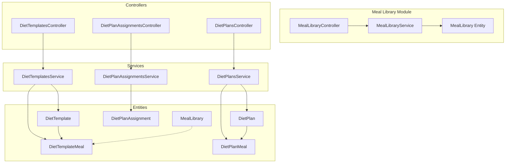
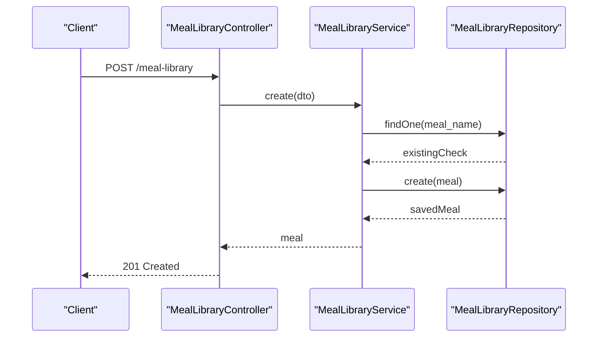
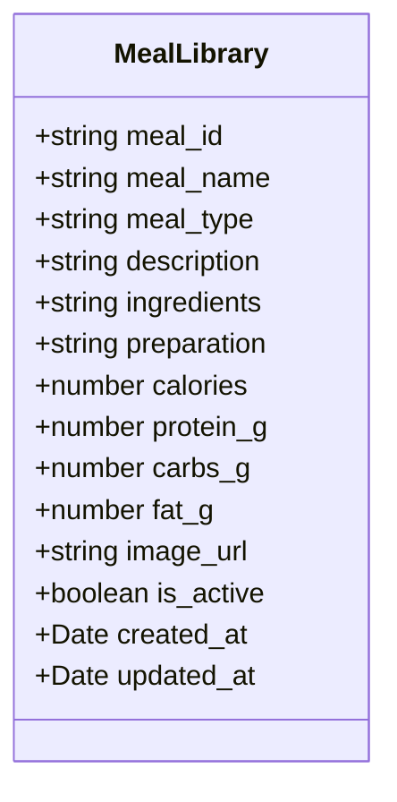
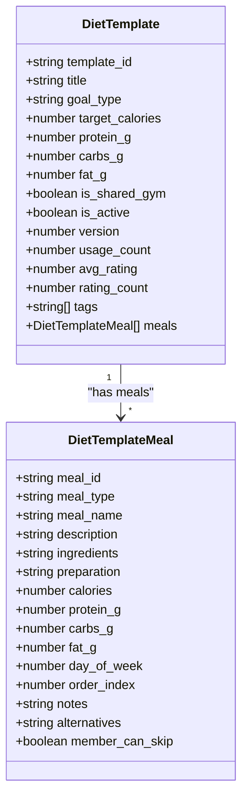
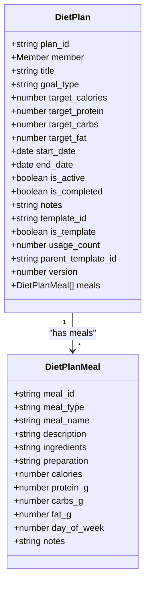
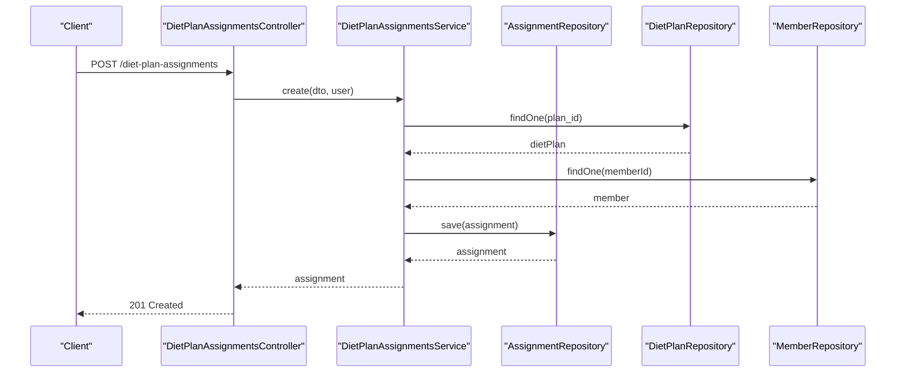
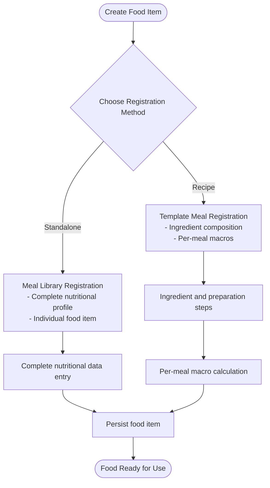
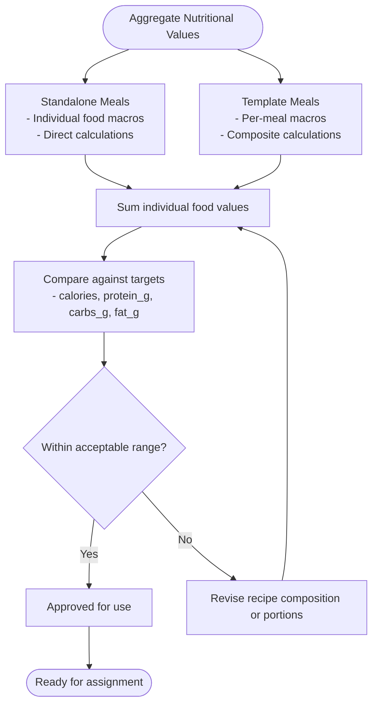
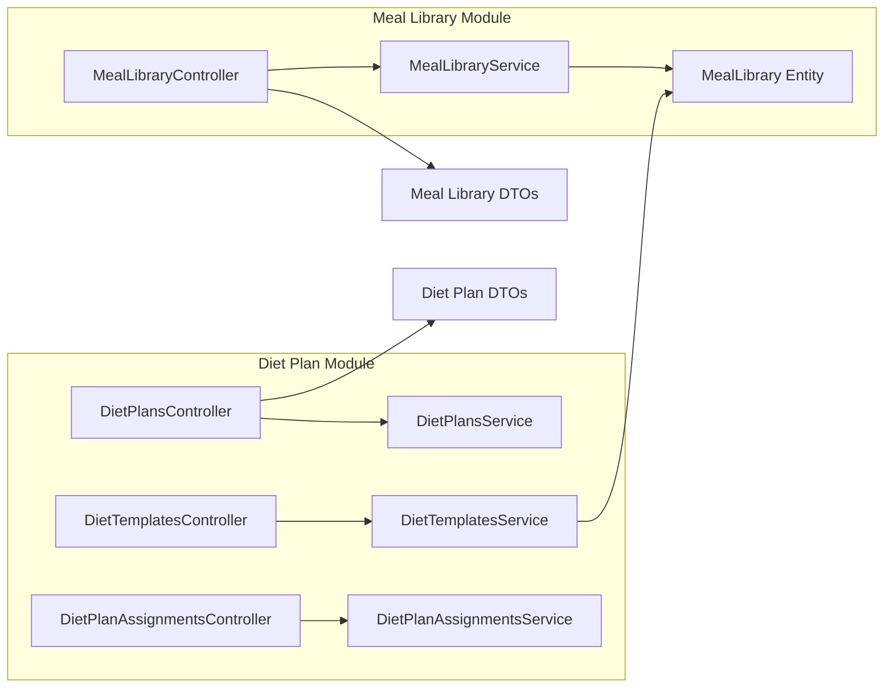

# Meal Library Management

<cite>
**Referenced Files in This Document**
- [meal-library.controller.ts](file://src/meal-library/meal-library.controller.ts)
- [meal-library.service.ts](file://src/meal-library/meal-library.service.ts)
- [meal-library.module.ts](file://src/meal-library/meal-library.module.ts)
- [create-meal-library.dto.ts](file://src/meal-library/dto/create-meal-library.dto.ts)
- [filter-meal-library.dto.ts](file://src/meal-library/dto/filter-meal-library.dto.ts)
- [update-meal-library.dto.ts](file://src/meal-library/dto/update-meal-library.dto.ts)
- [meal_library.entity.ts](file://src/entities/meal_library.entity.ts)
- [app.module.ts](file://src/app.module.ts)
- [diet-plans.service.ts](file://src/diet-plans/diet-plans.service.ts)
- [diet-plans.controller.ts](file://src/diet-plans/diet-plans.controller.ts)
- [diet-templates.service.ts](file://src/diet-plans/diet-templates.service.ts)
- [diet-templates.controller.ts](file://src/diet-plans/diet-templates.controller.ts)
- [diet-assignments.service.ts](file://src/diet-plans/diet-assignments.service.ts)
- [diet-assignments.controller.ts](file://src/diet-plans/diet-assignments.controller.ts)
- [create-diet.dto.ts](file://src/diet-plans/dto/create-diet.dto.ts)
- [create-diet-template.dto.ts](file://src/diet-plans/dto/create-diet-template.dto.ts)
- [diet-assignment.dto.ts](file://src/diet-plans/dto/diet-assignment.dto.ts)
- [diet_templates.entity.ts](file://src/entities/diet_templates.entity.ts)
- [diet_template_meals.entity.ts](file://src/entities/diet_template_meals.entity.ts)
- [diet_plans.entity.ts](file://src/entities/diet_plans.entity.ts)
- [diet_plan_meals.entity.ts](file://src/entities/diet_plan_meals.entity.ts)
- [diet_plan_assignments.entity.ts](file://src/entities/diet_plan_assignments.entity.ts)
</cite>

## Update Summary
**Changes Made**
- Added comprehensive documentation for the newly implemented Meal Library module
- Documented complete CRUD operations with JWT authentication and role-based access control
- Added detailed coverage of filtering capabilities by meal_type and search functionality
- Included entity definition with nutritional content fields and comprehensive DTO validation
- Integrated meal library functionality with existing diet plan management system
- Added practical examples for food registration, recipe composition, and nutritional calculations

## Table of Contents
1. [Introduction](#introduction)
2. [Project Structure](#project-structure)
3. [Core Components](#core-components)
4. [Architecture Overview](#architecture-overview)
5. [Detailed Component Analysis](#detailed-component-analysis)
6. [Dependency Analysis](#dependency-analysis)
7. [Performance Considerations](#performance-considerations)
8. [Troubleshooting Guide](#troubleshooting-guide)
9. [Conclusion](#conclusion)
10. [Appendices](#appendices)

## Introduction
This document describes the meal library management system that catalogs foods, recipes, and nutritional databases within a gym management platform. The system has been enhanced with a comprehensive meal library module that provides complete CRUD operations for food items, advanced filtering capabilities, and seamless integration with the existing diet plan management system. It explains how to register foods, enter nutritional information, standardize portion sizes, organize foods by categories, create recipes and track ingredient compositions, compute composite nutritional values, search and filter foods, integrate with diet plan creation and template building, assign meals to members, and maintain food safety and allergen labeling practices.

## Project Structure
The meal library functionality is organized around four primary subsystems:
- **Meal Library**: Complete CRUD operations for food items with nutritional content
- **Diet Templates**: Reusable meal blueprints with macros and structured meals
- **Diet Plans**: Personalized diet schedules assigned to members
- **Diet Plan Assignments**: Lifecycle tracking of plan ownership, progress, substitutions, and linking to workout charts

**Diagram sources**
- [meal-library.controller.ts:28-95](file://src/meal-library/meal-library.controller.ts#L28-L95)
- [meal-library.service.ts:13-98](file://src/meal-library/meal-library.service.ts#L13-L98)
- [meal_library.entity.ts:9-63](file://src/entities/meal_library.entity.ts#L9-L63)
- [diet-plans.controller.ts:30-234](file://src/diet-plans/diet-plans.controller.ts#L30-L234)
- [diet-templates.controller.ts:38-516](file://src/diet-plans/diet-templates.controller.ts#L38-L516)
- [diet-assignments.controller.ts:27-106](file://src/diet-plans/diet-assignments.controller.ts#L27-L106)
- [diet-plans.service.ts:14-179](file://src/diet-plans/diet-plans.service.ts#L14-L179)
- [diet-templates.service.ts:22-358](file://src/diet-plans/diet-templates.service.ts#L22-L358)
- [diet-assignments.service.ts:19-257](file://src/diet-plans/diet-assignments.service.ts#L19-L257)

**Section sources**
- [meal-library.controller.ts:28-95](file://src/meal-library/meal-library.controller.ts#L28-L95)
- [meal-library.service.ts:13-98](file://src/meal-library/meal-library.service.ts#L13-L98)
- [meal-library.module.ts:1-14](file://src/meal-library/meal-library.module.ts#L1-L14)
- [app.module.ts:135-136](file://src/app.module.ts#L135-L136)

## Core Components
- **Meal Library**: Complete CRUD operations for food items with nutritional content fields, filtering by meal_type and search functionality, JWT authentication, and role-based access control
- **Diet Templates**: Reusable meal blueprints with macro targets, structured meals, sharing, copying, rating, and assignment to members
- **Diet Plans**: Personalized diet schedules with macro targets, timeframes, and associated meals
- **Diet Plan Assignments**: Lifecycle management of plan ownership, progress tracking, substitutions, and linking to workout charts

Key responsibilities:
- Food cataloging and recipe composition via template/meals with integrated meal library
- Nutritional computation and standardization (calories/macros per meal)
- Advanced search/filtering by goal type, caloric targets, meal_type, and visibility
- Integration with member assignments and progress logging
- Seamless integration between standalone meal library and diet template meals

**Section sources**
- [meal-library.service.ts:20-98](file://src/meal-library/meal-library.service.ts#L20-L98)
- [meal_library.entity.ts:10-63](file://src/entities/meal_library.entity.ts#L10-L63)
- [diet-templates.service.ts:35-358](file://src/diet-plans/diet-templates.service.ts#L35-L358)
- [diet-plans.service.ts:25-179](file://src/diet-plans/diet-plans.service.ts#L25-L179)
- [diet-assignments.service.ts:30-257](file://src/diet-plans/diet-assignments.service.ts#L30-L257)

## Architecture Overview
The system follows a layered architecture with enhanced modularity:
- **Meal Library Module**: Standalone module with complete CRUD operations and JWT authentication
- **Controllers**: Expose REST endpoints with Swagger documentation and role-based guards
- **Services**: Encapsulate business logic, validation, and access control with filtering capabilities
- **Entities**: Define the persistent model for meals and templates
- **DTOs**: Validate and shape request/response payloads with comprehensive field validation

**Diagram sources**
- [meal-library.controller.ts:33-45](file://src/meal-library/meal-library.controller.ts#L33-L45)
- [meal-library.service.ts:20-34](file://src/meal-library/meal-library.service.ts#L20-L34)

**Section sources**
- [meal-library.controller.ts:28-95](file://src/meal-library/meal-library.controller.ts#L28-L95)
- [meal-library.service.ts:13-98](file://src/meal-library/meal-library.service.ts#L13-L98)

## Detailed Component Analysis

### Meal Library: Complete CRUD Operations with Advanced Filtering
The meal library module provides comprehensive food management capabilities with complete CRUD operations, JWT authentication, and role-based access control.

#### Entity Definition with Nutritional Content Fields
The MealLibrary entity defines a comprehensive food catalog structure with detailed nutritional information:

**Diagram sources**
- [meal_library.entity.ts:10-63](file://src/entities/meal_library.entity.ts#L10-L63)

**Section sources**
- [meal_library.entity.ts:10-63](file://src/entities/meal_library.entity.ts#L10-L63)

#### Controller Implementation with Authentication and Authorization
The MealLibraryController provides secure REST endpoints with comprehensive validation:

- **Create**: POST `/meal-library` with JWT authentication and SUPERADMIN/ADMIN/TRAINER roles
- **List**: GET `/meal-library` with JWT authentication and filtering capabilities
- **Retrieve**: GET `/meal-library/:id` with JWT authentication
- **Update**: PATCH `/meal-library/:id` with JWT authentication and role-based access
- **Delete**: DELETE `/meal-library/:id` with JWT authentication and role-based access

**Section sources**
- [meal-library.controller.ts:33-95](file://src/meal-library/meal-library.controller.ts#L33-L95)

#### Service Layer with Advanced Filtering and Validation
The MealLibraryService implements sophisticated filtering and validation logic:

- **Filtering**: Supports meal_type, search by name, and active status filtering
- **Validation**: Prevents duplicate meal names and handles conflict exceptions
- **Pagination**: Returns paginated results with total count for efficient data handling
- **Search**: Implements case-insensitive search functionality

**Section sources**
- [meal-library.service.ts:36-57](file://src/meal-library/meal-library.service.ts#L36-L57)
- [meal-library.service.ts:75-91](file://src/meal-library/meal-library.service.ts#L75-L91)

#### DTO Validation with Comprehensive Field Constraints
The meal library DTOs provide extensive validation for all nutritional and descriptive fields:

- **CreateMealLibraryDto**: Validates meal name, type, description, ingredients, preparation, and nutritional values
- **FilterMealLibraryDto**: Supports filtering by meal_type, search term, and active status
- **UpdateMealLibraryDto**: Extends create DTO with partial updates

**Section sources**
- [create-meal-library.dto.ts:11-79](file://src/meal-library/dto/create-meal-library.dto.ts#L11-L79)
- [filter-meal-library.dto.ts:5-39](file://src/meal-library/dto/filter-meal-library.dto.ts#L5-L39)
- [update-meal-library.dto.ts:1-5](file://src/meal-library/dto/update-meal-library.dto.ts#L1-L5)

### Diet Templates: Enhanced Integration with Meal Library
The diet template system now seamlessly integrates with the meal library for comprehensive food management.

#### Creation, Sharing, and Assignment with Meal Library Integration
- Creation validates trainer/admin permissions, builds template metadata, and persists meals with integrated meal library references
- Visibility controls include private vs gym-wide sharing
- Copying preserves structure and increments version
- Rating aggregates average and count
- Assignment links templates to members with optional date ranges

**Diagram sources**
- [diet_templates.entity.ts:14-87](file://src/entities/diet_templates.entity.ts#L14-L87)
- [diet_template_meals.entity.ts:11-74](file://src/entities/diet_template_meals.entity.ts#L11-L74)

**Section sources**
- [diet-templates.service.ts:35-358](file://src/diet-plans/diet-templates.service.ts#L35-L358)
- [diet-templates.controller.ts:45-516](file://src/diet-plans/diet-templates.controller.ts#L45-L516)
- [create-diet-template.dto.ts:90-262](file://src/diet-plans/dto/create-diet-template.dto.ts#L90-L262)

### Diet Plans: Personalized Meal Schedules with Meal Library Integration
Personalized plans now support direct integration with the meal library for comprehensive food management.

- Personalized plans support macro targets and structured meals with meal library integration
- Access control restricts creation and updates to admins/trainers
- Filtering supports member-specific retrieval and user-role queries
- Direct meal library integration enables seamless food item selection

**Diagram sources**
- [diet_plans.entity.ts:15-94](file://src/entities/diet_plans.entity.ts#L15-L94)
- [diet_plan_meals.entity.ts:11-70](file://src/entities/diet_plan_meals.entity.ts#L11-L70)

**Section sources**
- [diet-plans.service.ts:25-179](file://src/diet-plans/diet-plans.service.ts#L25-L179)
- [diet-plans.controller.ts:35-234](file://src/diet-plans/diet-plans.controller.ts#L35-L234)
- [create-diet.dto.ts:3-26](file://src/diet-plans/dto/create-diet.dto.ts#L3-L26)

### Diet Plan Assignments: Lifecycle and Progress Tracking
Assignments connect plans to members with status tracking and comprehensive meal library integration.

- Assignments connect plans to members with status tracking
- Progress updates log completion percent and activity timestamps
- Substitutions capture member-driven meal swaps
- Linking to workout charts integrates nutrition and fitness
- Direct integration with meal library enables dynamic meal selection

**Diagram sources**
- [diet-assignments.controller.ts:34-39](file://src/diet-plans/diet-assignments.controller.ts#L34-L39)
- [diet-assignments.service.ts:30-76](file://src/diet-plans/diet-assignments.service.ts#L30-L76)

**Section sources**
- [diet-assignments.service.ts:30-257](file://src/diet-plans/diet-assignments.service.ts#L30-L257)
- [diet-assignments.controller.ts:27-106](file://src/diet-plans/diet-assignments.controller.ts#L27-L106)
- [diet-assignment.dto.ts:15-96](file://src/diet-plans/dto/diet-assignment.dto.ts#L15-L96)

### Food Item Registration and Recipe Composition
Food registration now operates through two complementary systems:

#### Standalone Meal Library Registration
- Register individual foods with complete nutritional profiles
- Supports all meal types (breakfast, lunch, dinner, snack, pre_workout, post_workout)
- Comprehensive nutritional information entry (calories, protein, carbs, fat)
- Image support and active status management

#### Template-Based Recipe Composition
- Register foods as part of recipe composition within template meals
- Ingredients and preparation steps are stored with optional alternatives
- Macro values (calories/macros) are captured per meal for composite calculations

**Diagram sources**
- [meal_library.entity.ts:14-49](file://src/entities/meal_library.entity.ts#L14-L49)
- [diet_template_meals.entity.ts:11-74](file://src/entities/diet_template_meals.entity.ts#L11-L74)

**Section sources**
- [meal_library.entity.ts:14-49](file://src/entities/meal_library.entity.ts#L14-L49)
- [diet_template_meals.entity.ts:11-74](file://src/entities/diet_template_meals.entity.ts#L11-L74)

### Portion Size Standardization and Food Categories
Portion standardization and food categorization operate through dual mechanisms:

#### Standalone Meal Library Categorization
- Portion standardization through per-food nutritional entries
- Food categorization via meal_type field (breakfast, lunch, dinner, snack, pre_workout, post_workout)
- Active status management for inventory control

#### Template-Based Organization
- Portion standardization through per-meal macro entries
- Food categorization via template goal types and tags
- Day-of-week and order indexing standardize meal timing and sequence

**Section sources**
- [meal_library.entity.ts:27-28](file://src/entities/meal_library.entity.ts#L27-L28)
- [diet_template_meals.entity.ts:51-57](file://src/entities/diet_template_meals.entity.ts#L51-L57)
- [diet_templates.entity.ts:34-38](file://src/entities/diet_templates.entity.ts#L34-L38)

### Composite Nutritional Calculations
Composite calculations occur at multiple levels:

#### Standalone Meal Library Level
- Individual food items contribute standardized nutritional values
- Direct integration with diet plan calculations

#### Template Level Composite Calculations
- Composite calculations occur via target macros and per-meal macros
- Aggregate totals can be derived by summing per-meal values across days and meals

**Diagram sources**
- [meal_library.entity.ts:39-49](file://src/entities/meal_library.entity.ts#L39-L49)
- [diet_template_meals.entity.ts:39-49](file://src/entities/diet_template_meals.entity.ts#L39-L49)

**Section sources**
- [meal_library.entity.ts:39-49](file://src/entities/meal_library.entity.ts#L39-L49)
- [diet_template_meals.entity.ts:39-49](file://src/entities/diet_template_meals.entity.ts#L39-L49)

### Search and Filtering Capabilities
Enhanced search and filtering capabilities now operate across both standalone and template-based systems:

#### Standalone Meal Library Filtering
- **Filter by meal_type**: breakfast, lunch, dinner, snack, pre_workout, post_workout
- **Search by name**: case-insensitive search functionality
- **Active status filtering**: filter by availability
- **Paginated results**: efficient handling of large food catalogs

#### Template-Based Filtering
- Templates: filter by visibility, goal type, and caloric ceilings; paginated results
- Plans: filter by member and user-role contexts
- Assignments: filter by member, status, and pagination

**Section sources**
- [meal-library.service.ts:36-57](file://src/meal-library/meal-library.service.ts#L36-L57)
- [filter-meal-library.dto.ts:5-39](file://src/meal-library/dto/filter-meal-library.dto.ts#L5-L39)
- [diet-templates.controller.ts:82-179](file://src/diet-plans/diet-templates.controller.ts#L82-L179)
- [diet-plans.controller.ts:118-163](file://src/diet-plans/diet-plans.controller.ts#L118-L163)
- [diet-assignments.controller.ts:41-44](file://src/diet-plans/diet-assignments.controller.ts#L41-L44)

### Integration with Diet Plan Creation, Templates, and Meal Assignment
The meal library integrates seamlessly with the existing diet plan ecosystem:

#### Dual Integration Paths
- **Direct Integration**: Standalone meal library items can be directly used in diet plans
- **Template Integration**: Meal library items can be referenced within template meals
- **Hybrid Approach**: Combination of both approaches for maximum flexibility

#### Enhanced Template Functionality
- Templates serve as reusable blueprints for creating personalized plans
- Assignments link plans to members with progress tracking and substitutions
- Optional linking to workout charts integrates nutrition and fitness routines
- Direct meal library integration enables dynamic food item selection

**Section sources**
- [diet-templates.controller.ts:370-432](file://src/diet-plans/diet-templates.controller.ts#L370-L432)
- [diet-assignments.controller.ts:82-91](file://src/diet-plans/diet-assignments.controller.ts#L82-L91)
- [diet-assignments.service.ts:203-217](file://src/diet-plans/diet-assignments.service.ts#L203-L217)

### Food Safety, Allergen Labeling, and Database Maintenance
Enhanced food safety and labeling capabilities:

#### Allergen Labeling
- Store alternatives text and notes at the meal level for transparency
- Comprehensive ingredient listing for allergen identification
- Safety considerations: member_can_skip flag allows flexibility for dietary restrictions

#### Database Maintenance
- Versioning and usage counters help track template evolution and adoption
- Active status management ensures inventory control
- Audit trail through created_at and updated_at timestamps

**Section sources**
- [diet_template_meals.entity.ts:60-67](file://src/entities/diet_template_meals.entity.ts#L60-L67)
- [meal_library.entity.ts:54-55](file://src/entities/meal_library.entity.ts#L54-L55)
- [diet_templates.entity.ts:58-65](file://src/entities/diet_templates.entity.ts#L58-L65)

## Dependency Analysis
The system exhibits clear separation of concerns with enhanced modularity:

**Diagram sources**
- [meal-library.controller.ts:23-26](file://src/meal-library/meal-library.controller.ts#L23-L26)
- [meal-library.service.ts:15-18](file://src/meal-library/meal-library.service.ts#L15-L18)
- [diet-plans.controller.ts:21-26](file://src/diet-plans/diet-plans.controller.ts#L21-L26)
- [diet-templates.controller.ts:21-26](file://src/diet-plans/diet-templates.controller.ts#L21-L26)
- [diet-assignments.controller.ts:21-26](file://src/diet-plans/diet-assignments.controller.ts#L21-L26)

**Section sources**
- [meal-library.controller.ts:23-26](file://src/meal-library/meal-library.controller.ts#L23-L26)
- [meal-library.service.ts:15-18](file://src/meal-library/meal-library.service.ts#L15-L18)
- [diet-plans.controller.ts:21-26](file://src/diet-plans/diet-plans.controller.ts#L21-L26)
- [diet-templates.controller.ts:21-26](file://src/diet-plans/diet-templates.controller.ts#L21-L26)
- [diet-assignments.controller.ts:21-26](file://src/diet-plans/diet-assignments.controller.ts#L21-L26)

## Performance Considerations
Enhanced performance considerations for the integrated system:

- **Pagination**: Both meal library and templates listing support page and limit parameters to manage large datasets
- **Indexing**: Consider adding database indexes on frequently queried fields (meal_type, meal_name, goal_type, visibility, trainerId)
- **Aggregation**: Avoid N+1 queries by leveraging relation loading and batch operations
- **Validation**: Keep DTO validations minimal and efficient to reduce overhead
- **Caching**: Implement caching strategies for frequently accessed food items and templates
- **Search Optimization**: Optimize search queries with proper indexing on meal_name and description fields

## Troubleshooting Guide
Common issues and resolutions for the enhanced system:

#### Meal Library Specific Issues
- **Access Denied**: Ensure user roles (ADMIN/TRAINER/SUPERADMIN) and proper authentication tokens
- **Duplicate Meal Names**: Check existing meal library entries before creating new items
- **Invalid Meal Types**: Verify meal_type values match allowed enum values
- **Search Failures**: Ensure proper search parameters and case-insensitive matching

#### Integration Issues
- **Not Found**: Verify resource existence (member, user, template, plan, meal) before operations
- **Forbidden Operations**: Creation/update/delete are restricted to authorized users and template owners
- **Conflict Resolution**: Handle meal name conflicts during updates and creations
- **Data Synchronization**: Ensure meal library changes sync properly with template-based meals

**Section sources**
- [meal-library.service.ts:23-30](file://src/meal-library/meal-library.service.ts#L23-L30)
- [meal-library.service.ts:75-87](file://src/meal-library/meal-library.service.ts#L75-L87)
- [diet-plans.service.ts:25-63](file://src/diet-plans/diet-plans.service.ts#L25-L63)
- [diet-templates.service.ts:35-67](file://src/diet-plans/diet-templates.service.ts#L35-L67)
- [diet-assignments.service.ts:30-76](file://src/diet-plans/diet-assignments.service.ts#L30-L76)

## Conclusion
The meal library management system now provides a comprehensive and robust framework for cataloging foods, composing recipes, standardizing portions, organizing by categories, computing composite nutrition, and integrating with diet plan creation, template sharing, and member assignments. With the addition of the standalone meal library module, complete CRUD operations, JWT authentication, role-based access control, advanced filtering capabilities, and seamless integration with existing diet plan functionality, the system supports scalable diet program delivery while maintaining food safety and labeling practices. The dual approach of standalone food registration and template-based recipe composition provides maximum flexibility for different use cases and operational requirements.

## Appendices

### Example Workflows

#### Standalone Meal Library Workflows

- **Adding a new food to the library**
  - Create meal with complete nutritional profile (calories, protein, carbs, fat)
  - Select appropriate meal_type (breakfast, lunch, dinner, snack, pre_workout, post_workout)
  - Enter ingredients and preparation instructions
  - Set active status and upload image if available

- **Searching and filtering foods**
  - Filter by meal_type for specific categories
  - Search by meal_name for quick lookup
  - Filter by active status for inventory management
  - Use pagination for efficient browsing

#### Template-Based Recipe Workflows

- **Creating a custom recipe with multiple ingredients**
  - Build a template with multiple meals
  - Set daily schedule and order indices
  - Apply goal type and tags for categorization
  - Reference existing meal library items for consistency

- **Setting nutritional standards**
  - Define template macro targets (calories/protein/carbs/fat)
  - Validate per-meal contributions align with targets
  - Use versioning to track improvements
  - Integrate with standalone meal library for standardized nutrition

#### Integration Workflows

- **Organizing items by food groups**
  - Use meal_type and tags to classify standalone foods
  - Leverage template goal types and tags for categorized recipes
  - Combine both approaches for comprehensive organization

- **Integrating with diet plans and assignments**
  - Assign templates to members with start/end dates
  - Track progress and record substitutions
  - Optionally link to workout chart assignments
  - Utilize standalone meal library for direct food item selection

#### Advanced Features

- **Advanced filtering capabilities**
  - Filter by multiple criteria simultaneously
  - Search across meal names and descriptions
  - Control visibility and availability
  - Export filtered results for reporting

- **Nutritional database maintenance**
  - Regular updates to nutritional values
  - Allergen labeling and safety considerations
  - Version tracking and usage analytics
  - Integration with external nutritional databases