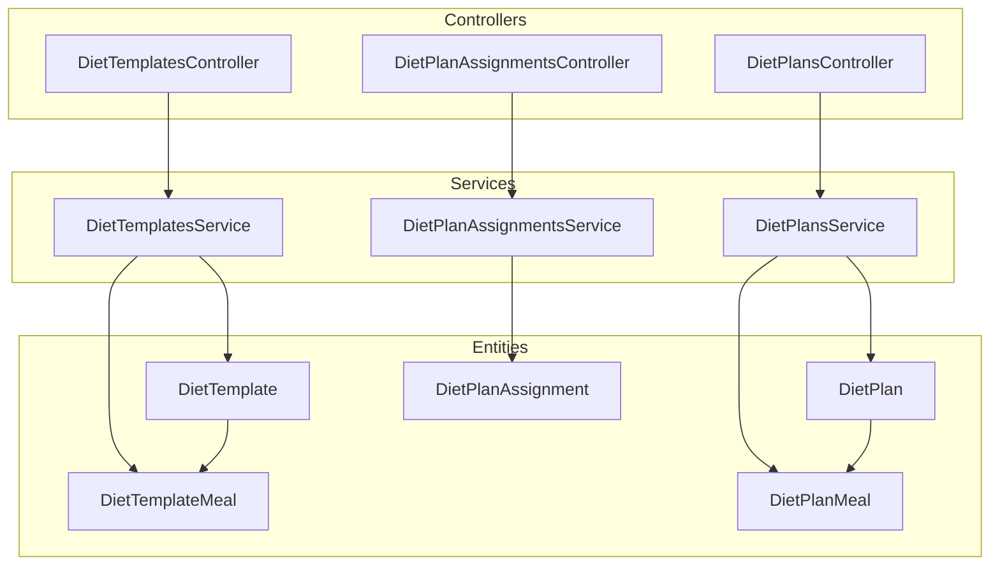
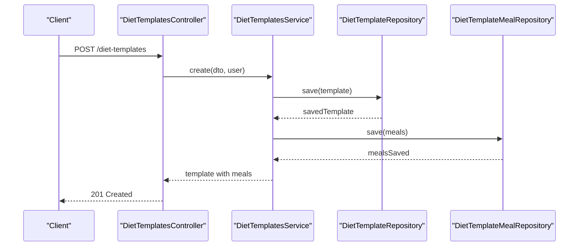
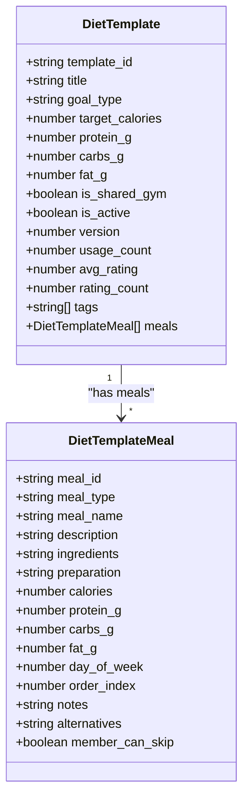
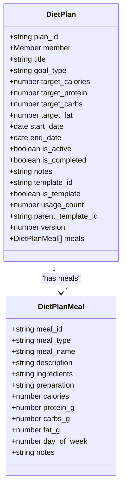
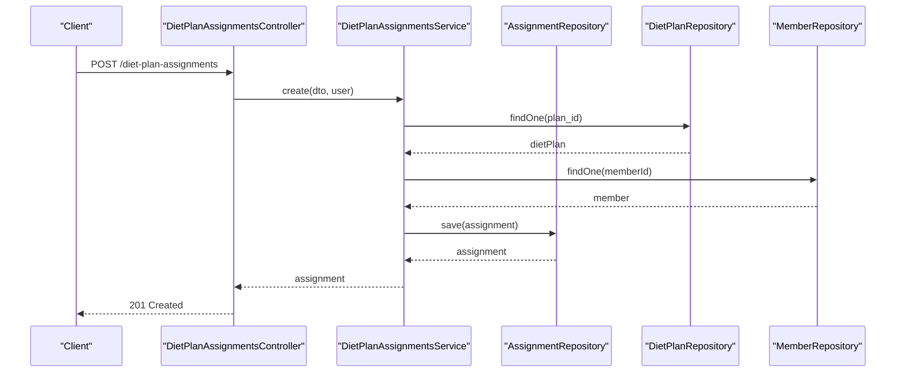
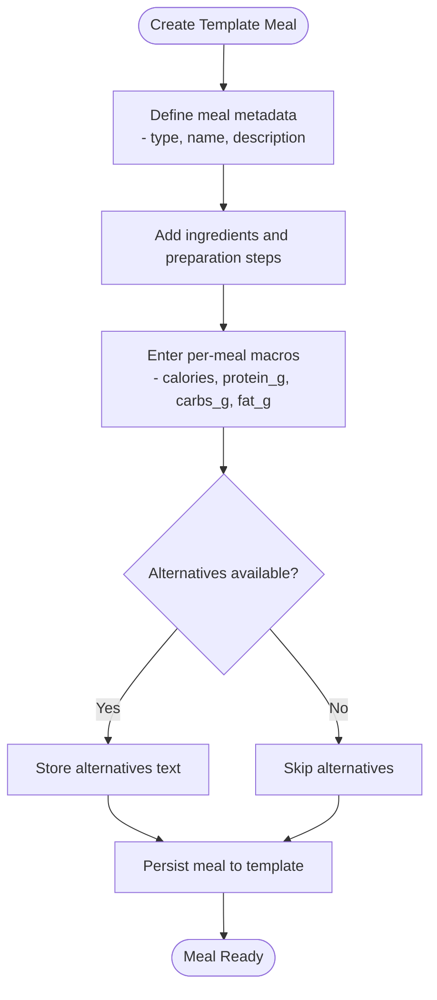
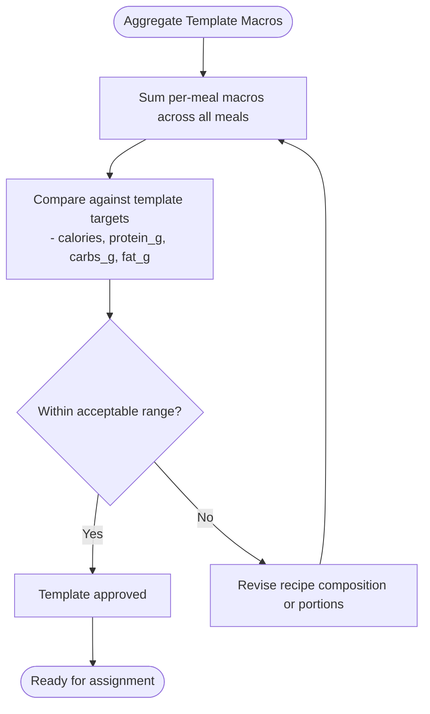
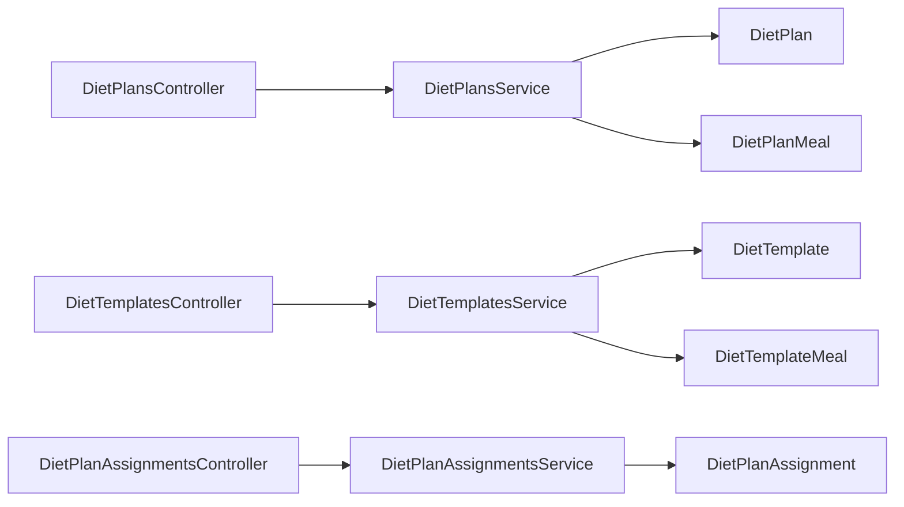

# Meal Library Management

<cite>
**Referenced Files in This Document**
- [diet-plans.service.ts](file://src/diet-plans/diet-plans.service.ts)
- [diet-plans.controller.ts](file://src/diet-plans/diet-plans.controller.ts)
- [diet-templates.service.ts](file://src/diet-plans/diet-templates.service.ts)
- [diet-templates.controller.ts](file://src/diet-plans/diet-templates.controller.ts)
- [diet-assignments.service.ts](file://src/diet-plans/diet-assignments.service.ts)
- [diet-assignments.controller.ts](file://src/diet-plans/diet-assignments.controller.ts)
- [create-diet.dto.ts](file://src/diet-plans/dto/create-diet.dto.ts)
- [create-diet-template.dto.ts](file://src/diet-plans/dto/create-diet-template.dto.ts)
- [diet-assignment.dto.ts](file://src/diet-plans/dto/diet-assignment.dto.ts)
- [diet_templates.entity.ts](file://src/entities/diet_templates.entity.ts)
- [diet_template_meals.entity.ts](file://src/entities/diet_template_meals.entity.ts)
- [diet_plans.entity.ts](file://src/entities/diet_plans.entity.ts)
- [diet_plan_meals.entity.ts](file://src/entities/diet_plan_meals.entity.ts)
- [diet_plan_assignments.entity.ts](file://src/entities/diet_plan_assignments.entity.ts)
</cite>

## Table of Contents
1. [Introduction](#introduction)
2. [Project Structure](#project-structure)
3. [Core Components](#core-components)
4. [Architecture Overview](#architecture-overview)
5. [Detailed Component Analysis](#detailed-component-analysis)
6. [Dependency Analysis](#dependency-analysis)
7. [Performance Considerations](#performance-considerations)
8. [Troubleshooting Guide](#troubleshooting-guide)
9. [Conclusion](#conclusion)
10. [Appendices](#appendices)

## Introduction
This document describes the meal library management system that catalogs foods, recipes, and nutritional databases within a gym management platform. It explains how to register foods, enter nutritional information, standardize portion sizes, organize foods by categories, create recipes and track ingredient compositions, compute composite nutritional values, search and filter foods, integrate with diet plan creation and template building, assign meals to members, and maintain food safety and allergen labeling practices.

## Project Structure
The meal library functionality is organized around three primary subsystems:
- Diet Templates: reusable meal blueprints with macros and structured meals
- Diet Plans: personalized diet schedules assigned to members
- Diet Plan Assignments: lifecycle tracking of plan ownership, progress, substitutions, and linking to workout charts

**Diagram sources**
- [diet-plans.controller.ts:30-234](file://src/diet-plans/diet-plans.controller.ts#L30-L234)
- [diet-templates.controller.ts:38-516](file://src/diet-plans/diet-templates.controller.ts#L38-L516)
- [diet-assignments.controller.ts:27-106](file://src/diet-plans/diet-assignments.controller.ts#L27-L106)
- [diet-plans.service.ts:14-179](file://src/diet-plans/diet-plans.service.ts#L14-L179)
- [diet-templates.service.ts:22-358](file://src/diet-plans/diet-templates.service.ts#L22-L358)
- [diet-assignments.service.ts:19-257](file://src/diet-plans/diet-assignments.service.ts#L19-L257)
- [diet_templates.entity.ts:14-87](file://src/entities/diet_templates.entity.ts#L14-L87)
- [diet_template_meals.entity.ts:11-74](file://src/entities/diet_template_meals.entity.ts#L11-L74)
- [diet_plans.entity.ts:15-94](file://src/entities/diet_plans.entity.ts#L15-L94)
- [diet_plan_meals.entity.ts:11-70](file://src/entities/diet_plan_meals.entity.ts#L11-L70)
- [diet_plan_assignments.entity.ts:20-82](file://src/entities/diet_plan_assignments.entity.ts#L20-L82)

**Section sources**
- [diet-plans.controller.ts:30-234](file://src/diet-plans/diet-plans.controller.ts#L30-L234)
- [diet-templates.controller.ts:38-516](file://src/diet-plans/diet-templates.controller.ts#L38-L516)
- [diet-assignments.controller.ts:27-106](file://src/diet-plans/diet-assignments.controller.ts#L27-L106)

## Core Components
- Diet Templates: reusable meal blueprints with macro targets, structured meals, sharing, copying, rating, and assignment to members.
- Diet Plans: personalized diet schedules with macro targets, timeframes, and associated meals.
- Diet Plan Assignments: lifecycle management of plan ownership, progress tracking, substitutions, and linking to workout charts.

Key responsibilities:
- Food cataloging and recipe composition via template/meals
- Nutritional computation and standardization (calories/macros per meal)
- Search/filtering by goal type, caloric targets, and visibility
- Integration with member assignments and progress logging

**Section sources**
- [diet-templates.service.ts:35-358](file://src/diet-plans/diet-templates.service.ts#L35-L358)
- [diet-plans.service.ts:25-179](file://src/diet-plans/diet-plans.service.ts#L25-L179)
- [diet-assignments.service.ts:30-257](file://src/diet-plans/diet-assignments.service.ts#L30-L257)

## Architecture Overview
The system follows a layered architecture:
- Controllers expose REST endpoints with Swagger documentation and role-based guards
- Services encapsulate business logic, validation, and access control
- Entities define the persistent model for templates, plans, and assignments
- DTOs validate and shape request/response payloads

**Diagram sources**
- [diet-templates.controller.ts:45-80](file://src/diet-plans/diet-templates.controller.ts#L45-L80)
- [diet-templates.service.ts:35-67](file://src/diet-plans/diet-templates.service.ts#L35-L67)

**Section sources**
- [diet-templates.controller.ts:38-516](file://src/diet-plans/diet-templates.controller.ts#L38-L516)
- [diet-templates.service.ts:22-358](file://src/diet-plans/diet-templates.service.ts#L22-L358)

## Detailed Component Analysis

### Diet Templates: Creation, Sharing, and Assignment
- Creation validates trainer/admin permissions, builds template metadata, and persists meals
- Visibility controls include private vs gym-wide sharing
- Copying preserves structure and increments version
- Rating aggregates average and count
- Assignment links templates to members with optional date ranges

**Diagram sources**
- [diet_templates.entity.ts:14-87](file://src/entities/diet_templates.entity.ts#L14-L87)
- [diet_template_meals.entity.ts:11-74](file://src/entities/diet_template_meals.entity.ts#L11-L74)

**Section sources**
- [diet-templates.service.ts:35-358](file://src/diet-plans/diet-templates.service.ts#L35-L358)
- [diet-templates.controller.ts:45-516](file://src/diet-plans/diet-templates.controller.ts#L45-L516)
- [create-diet-template.dto.ts:90-262](file://src/diet-plans/dto/create-diet-template.dto.ts#L90-L262)

### Diet Plans: Personalized Meal Schedules
- Personalized plans support macro targets and structured meals
- Access control restricts creation and updates to admins/trainers
- Filtering supports member-specific retrieval and user-role queries

**Diagram sources**
- [diet_plans.entity.ts:15-94](file://src/entities/diet_plans.entity.ts#L15-L94)
- [diet_plan_meals.entity.ts:11-70](file://src/entities/diet_plan_meals.entity.ts#L11-L70)

**Section sources**
- [diet-plans.service.ts:25-179](file://src/diet-plans/diet-plans.service.ts#L25-L179)
- [diet-plans.controller.ts:35-234](file://src/diet-plans/diet-plans.controller.ts#L35-L234)
- [create-diet.dto.ts:3-26](file://src/diet-plans/dto/create-diet.dto.ts#L3-L26)

### Diet Plan Assignments: Lifecycle and Progress Tracking
- Assignments connect plans to members with status tracking
- Progress updates log completion percent and activity timestamps
- Substitutions capture member-driven meal swaps
- Linking to workout charts integrates nutrition and fitness

**Diagram sources**
- [diet-assignments.controller.ts:34-39](file://src/diet-plans/diet-assignments.controller.ts#L34-L39)
- [diet-assignments.service.ts:30-76](file://src/diet-plans/diet-assignments.service.ts#L30-L76)

**Section sources**
- [diet-assignments.service.ts:30-257](file://src/diet-plans/diet-assignments.service.ts#L30-L257)
- [diet-assignments.controller.ts:27-106](file://src/diet-plans/diet-assignments.controller.ts#L27-L106)
- [diet-assignment.dto.ts:15-96](file://src/diet-plans/dto/diet-assignment.dto.ts#L15-L96)

### Food Item Registration and Recipe Composition
- Register foods as part of recipe composition within template meals
- Ingredients and preparation steps are stored with optional alternatives
- Macro values (calories/macros) are captured per meal for composite calculations

**Diagram sources**
- [diet_template_meals.entity.ts:11-74](file://src/entities/diet_template_meals.entity.ts#L11-L74)
- [create-diet-template.dto.ts:17-88](file://src/diet-plans/dto/create-diet-template.dto.ts#L17-L88)

**Section sources**
- [diet_template_meals.entity.ts:11-74](file://src/entities/diet_template_meals.entity.ts#L11-L74)
- [create-diet-template.dto.ts:17-88](file://src/diet-plans/dto/create-diet-template.dto.ts#L17-L88)

### Portion Size Standardization and Food Categories
- Portion standardization is implicit through per-meal macro entries and optional notes
- Food categorization occurs via template goal types and tags
- Day-of-week and order indexing standardize meal timing and sequence

**Section sources**
- [diet_template_meals.entity.ts:51-57](file://src/entities/diet_template_meals.entity.ts#L51-L57)
- [diet_templates.entity.ts:34-38](file://src/entities/diet_templates.entity.ts#L34-L38)
- [diet_templates.entity.ts:76-77](file://src/entities/diet_templates.entity.ts#L76-L77)

### Composite Nutritional Calculations
- Composite calculations occur at the template level via target macros and per-meal macros
- Aggregate totals can be derived by summing per-meal values across days and meals

**Diagram sources**
- [diet_template_meals.entity.ts:39-49](file://src/entities/diet_template_meals.entity.ts#L39-L49)
- [diet_templates.entity.ts:40-50](file://src/entities/diet_templates.entity.ts#L40-L50)

**Section sources**
- [diet_template_meals.entity.ts:39-49](file://src/entities/diet_template_meals.entity.ts#L39-L49)
- [diet_templates.entity.ts:40-50](file://src/entities/diet_templates.entity.ts#L40-L50)

### Search and Filtering Capabilities
- Templates: filter by visibility, goal type, and caloric ceilings; paginated results
- Plans: filter by member and user-role contexts
- Assignments: filter by member, status, and pagination

**Section sources**
- [diet-templates.controller.ts:82-179](file://src/diet-plans/diet-templates.controller.ts#L82-L179)
- [diet-plans.controller.ts:118-163](file://src/diet-plans/diet-plans.controller.ts#L118-L163)
- [diet-assignments.controller.ts:41-44](file://src/diet-plans/diet-assignments.controller.ts#L41-L44)
- [diet-assignments.service.ts:78-131](file://src/diet-plans/diet-assignments.service.ts#L78-L131)

### Integration with Diet Plan Creation, Templates, and Meal Assignment
- Templates serve as reusable blueprints for creating personalized plans
- Assignments link plans to members with progress tracking and substitutions
- Optional linking to workout charts integrates nutrition and fitness routines

**Section sources**
- [diet-templates.controller.ts:370-432](file://src/diet-plans/diet-templates.controller.ts#L370-L432)
- [diet-assignments.controller.ts:82-91](file://src/diet-plans/diet-assignments.controller.ts#L82-L91)
- [diet-assignments.service.ts:203-217](file://src/diet-plans/diet-assignments.service.ts#L203-L217)

### Food Safety, Allergen Labeling, and Database Maintenance
- Allergen labeling: store alternatives text and notes at the meal level for transparency
- Safety considerations: member_can_skip flag allows flexibility for dietary restrictions
- Database maintenance: versioning and usage counters help track template evolution and adoption

**Section sources**
- [diet_template_meals.entity.ts:60-67](file://src/entities/diet_template_meals.entity.ts#L60-L67)
- [diet_templates.entity.ts:58-65](file://src/entities/diet_templates.entity.ts#L58-L65)
- [diet_templates.entity.ts:61-62](file://src/entities/diet_templates.entity.ts#L61-L62)

## Dependency Analysis
The system exhibits clear separation of concerns:
- Controllers depend on Services for business logic
- Services depend on repositories for persistence
- Entities define relationships and constraints
- DTOs validate inputs and outputs

**Diagram sources**
- [diet-plans.controller.ts:32-33](file://src/diet-plans/diet-plans.controller.ts#L32-L33)
- [diet-templates.controller.ts:42-43](file://src/diet-plans/diet-templates.controller.ts#L42-L43)
- [diet-assignments.controller.ts:31-32](file://src/diet-plans/diet-assignments.controller.ts#L31-L32)
- [diet-plans.service.ts:16-23](file://src/diet-plans/diet-plans.service.ts#L16-L23)
- [diet-templates.service.ts:24-33](file://src/diet-plans/diet-templates.service.ts#L24-L33)
- [diet-assignments.service.ts:21-28](file://src/diet-plans/diet-assignments.service.ts#L21-L28)

**Section sources**
- [diet-plans.controller.ts:32-33](file://src/diet-plans/diet-plans.controller.ts#L32-L33)
- [diet-templates.controller.ts:42-43](file://src/diet-plans/diet-templates.controller.ts#L42-L43)
- [diet-assignments.controller.ts:31-32](file://src/diet-plans/diet-assignments.controller.ts#L31-L32)

## Performance Considerations
- Pagination: templates listing supports page and limit parameters to manage large datasets
- Indexing: consider adding database indexes on frequently queried fields (goal_type, visibility, trainerId)
- Aggregation: avoid N+1 queries by leveraging relation loading and batch operations
- Validation: keep DTO validations minimal and efficient to reduce overhead

[No sources needed since this section provides general guidance]

## Troubleshooting Guide
Common issues and resolutions:
- Access Denied: ensure user roles (ADMIN/TRAINER/SUPERADMIN) and trainer ownership checks are satisfied
- Not Found: verify resource existence (member, user, template, plan) before operations
- Forbidden Operations: creation/update/delete are restricted to authorized users and template owners

**Section sources**
- [diet-plans.service.ts:25-63](file://src/diet-plans/diet-plans.service.ts#L25-L63)
- [diet-templates.service.ts:35-67](file://src/diet-plans/diet-templates.service.ts#L35-L67)
- [diet-assignments.service.ts:30-76](file://src/diet-plans/diet-assignments.service.ts#L30-L76)

## Conclusion
The meal library management system provides a robust framework for cataloging foods, composing recipes, standardizing portions, organizing by categories, computing composite nutrition, and integrating with diet plan creation, template sharing, and member assignments. With clear role-based access control, structured entities, and comprehensive controllers/services, it supports scalable diet program delivery while maintaining food safety and labeling practices.

[No sources needed since this section summarizes without analyzing specific files]

## Appendices

### Example Workflows

- Adding a new food to the library
  - Create a template meal with ingredients and preparation steps
  - Enter per-meal macros for accurate composite calculations
  - Store alternatives and notes for allergen transparency

- Creating a custom recipe with multiple ingredients
  - Build a template with multiple meals
  - Set daily schedule and order indices
  - Apply goal type and tags for categorization

- Setting nutritional standards
  - Define template macro targets (calories/protein/carbs/fat)
  - Validate per-meal contributions align with targets
  - Use versioning to track improvements

- Organizing items by food groups
  - Use goal types and tags to classify templates
  - Leverage filters to retrieve templates by category

- Integrating with diet plans and assignments
  - Assign templates to members with start/end dates
  - Track progress and record substitutions
  - Optionally link to workout chart assignments

[No sources needed since this section provides general guidance]