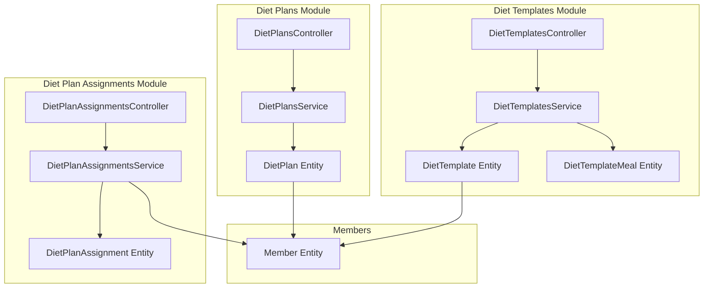
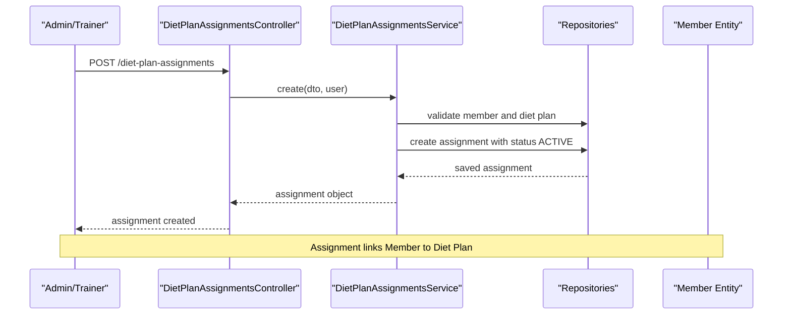
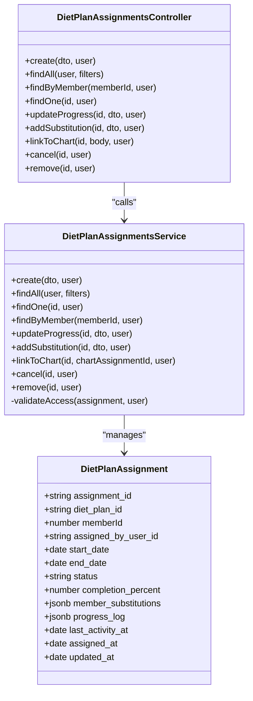
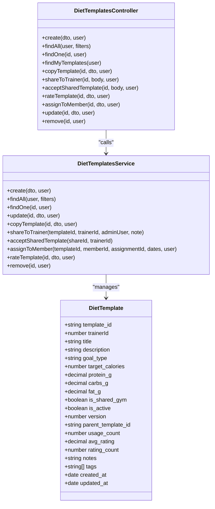
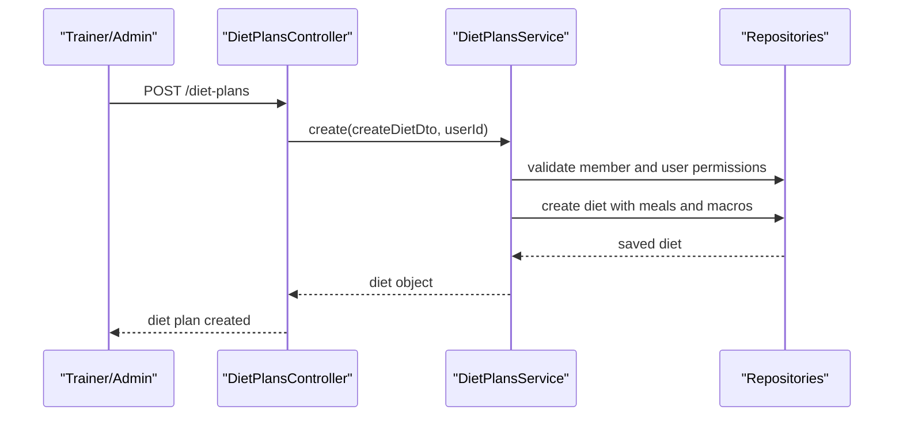
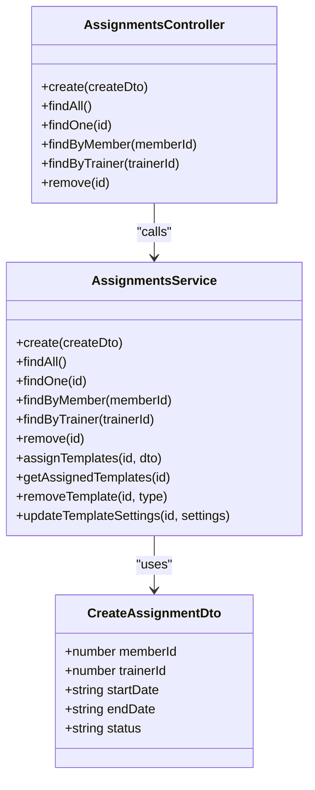
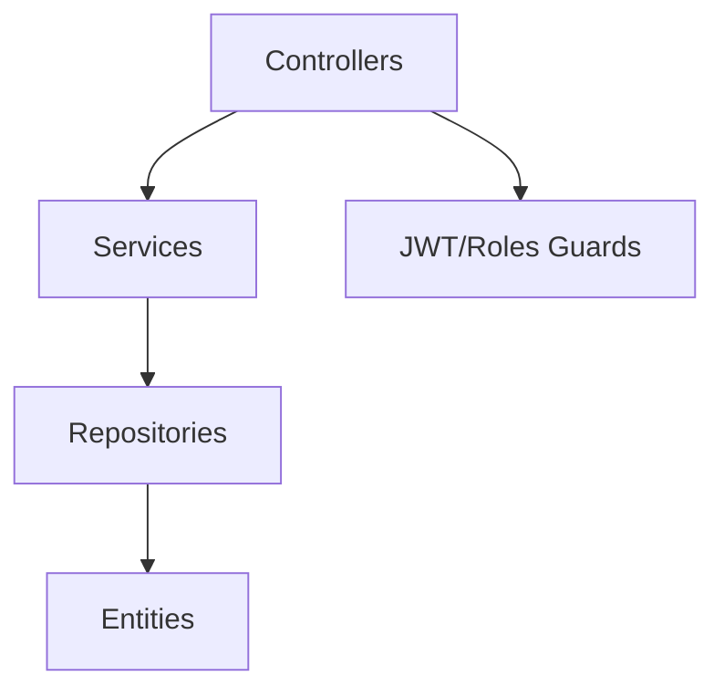

# Nutrition Assignment Workflow

<cite>
**Referenced Files in This Document**
- [diet-assignments.controller.ts](file://src/diet-plans/diet-assignments.controller.ts)
- [diet-assignments.service.ts](file://src/diet-plans/diet-assignments.service.ts)
- [diet-assignments.module.ts](file://src/diet-plans/diet-assignments.module.ts)
- [diet-assignments.entity.ts](file://src/entities/diet_plan_assignments.entity.ts)
- [diet-assignment.dto.ts](file://src/diet-plans/dto/diet-assignment.dto.ts)
- [diet-plans.controller.ts](file://src/diet-plans/diet-plans.controller.ts)
- [diet-plans.service.ts](file://src/diet-plans/diet-plans.service.ts)
- [diet-plans.entity.ts](file://src/entities/diet_plans.entity.ts)
- [diet-templates.controller.ts](file://src/diet-plans/diet-templates.controller.ts)
- [diet-templates.service.ts](file://src/diet-plans/diet-templates.service.ts)
- [diet-templates.entity.ts](file://src/entities/diet_templates.entity.ts)
- [members.entity.ts](file://src/entities/members.entity.ts)
- [assignments.controller.ts](file://src/assignments/assignments.controller.ts)
- [assignments.service.ts](file://src/assignments/assignments.service.ts)
- [create-assignment.dto.ts](file://src/assignments/dto/create-assignment.dto.ts)
</cite>

## Table of Contents
1. [Introduction](#introduction)
2. [Project Structure](#project-structure)
3. [Core Components](#core-components)
4. [Architecture Overview](#architecture-overview)
5. [Detailed Component Analysis](#detailed-component-analysis)
6. [Dependency Analysis](#dependency-analysis)
7. [Performance Considerations](#performance-considerations)
8. [Troubleshooting Guide](#troubleshooting-guide)
9. [Conclusion](#conclusion)

## Introduction
This document explains the nutrition assignment workflow that connects nutritionists with members and manages plan distribution. It covers the end-to-end process for assigning diet plans, managing template-based plans, tracking member engagement, and monitoring completion metrics. The system supports both nutritionist-initiated assignments and template-based distribution, with robust access controls, progress tracking, and administrative oversight.

## Project Structure
The nutrition workflow spans three main modules:
- Diet Plans: Creation and management of individual diet plans
- Diet Templates: Reusable plan blueprints with sharing and assignment
- Diet Plan Assignments: Linking plans/templates to members with status tracking

**Diagram sources**
- [diet-plans.controller.ts:30-235](file://src/diet-plans/diet-plans.controller.ts#L30-L235)
- [diet-plans.service.ts:14-180](file://src/diet-plans/diet-plans.service.ts#L14-L180)
- [diet-plans.entity.ts:15-95](file://src/entities/diet_plans.entity.ts#L15-L95)
- [diet-templates.controller.ts:38-517](file://src/diet-plans/diet-templates.controller.ts#L38-L517)
- [diet-templates.service.ts:22-359](file://src/diet-plans/diet-templates.service.ts#L22-L359)
- [diet-templates.entity.ts:14-88](file://src/entities/diet_templates.entity.ts#L14-L88)
- [diet-assignments.controller.ts:27-107](file://src/diet-plans/diet-assignments.controller.ts#L27-L107)
- [diet-assignments.service.ts:19-258](file://src/diet-plans/diet-assignments.service.ts#L19-L258)
- [diet-assignments.entity.ts:20-83](file://src/entities/diet_plan_assignments.entity.ts#L20-L83)
- [members.entity.ts:22-124](file://src/entities/members.entity.ts#L22-L124)

**Section sources**
- [diet-plans.controller.ts:30-235](file://src/diet-plans/diet-plans.controller.ts#L30-L235)
- [diet-templates.controller.ts:38-517](file://src/diet-plans/diet-templates.controller.ts#L38-L517)
- [diet-assignments.controller.ts:27-107](file://src/diet-plans/diet-assignments.controller.ts#L27-L107)

## Core Components
- Diet Plan Assignments: Manage member-diet plan relationships, progress tracking, substitutions, and status lifecycle
- Diet Templates: Create reusable templates, share with trainers, and assign to members
- Diet Plans: Create individualized diet plans for members
- Member Entities: Core member data and relationships to plans and assignments
- Assignments Module (Training): Separate member-trainer assignment system for workout programs

Key capabilities:
- Role-based access control (Admin, Trainer, Member)
- Status tracking (Active, Completed, Cancelled, Paused)
- Progress logging and meal substitutions
- Template usage counting and sharing
- Filtering and pagination for large datasets

**Section sources**
- [diet-assignments.service.ts:19-258](file://src/diet-plans/diet-assignments.service.ts#L19-L258)
- [diet-templates.service.ts:22-359](file://src/diet-plans/diet-templates.service.ts#L22-L359)
- [diet-plans.service.ts:14-180](file://src/diet-plans/diet-plans.service.ts#L14-L180)
- [diet-assignments.entity.ts:13-83](file://src/entities/diet_plan_assignments.entity.ts#L13-L83)
- [diet-templates.entity.ts:14-88](file://src/entities/diet_templates.entity.ts#L14-L88)
- [members.entity.ts:22-124](file://src/entities/members.entity.ts#L22-L124)

## Architecture Overview
The workflow integrates three primary flows:
1. Individual Diet Plan Assignment: Nutritionist creates a plan, assigns to a member
2. Template-Based Assignment: Trainer/Admin selects a template, assigns to a member
3. Monitoring and Engagement: Track progress, log substitutions, manage status

**Diagram sources**
- [diet-assignments.controller.ts:34-39](file://src/diet-plans/diet-assignments.controller.ts#L34-L39)
- [diet-assignments.service.ts:30-76](file://src/diet-plans/diet-assignments.service.ts#L30-L76)
- [diet-assignments.entity.ts:20-83](file://src/entities/diet_plan_assignments.entity.ts#L20-L83)
- [members.entity.ts:22-124](file://src/entities/members.entity.ts#L22-L124)

## Detailed Component Analysis

### Diet Plan Assignments
Manages the lifecycle of member-diet plan relationships, including creation, progress tracking, substitutions, linking to workout charts, cancellation, and deletion.

**Diagram sources**
- [diet-assignments.entity.ts:20-83](file://src/entities/diet_plan_assignments.entity.ts#L20-L83)
- [diet-assignments.service.ts:19-258](file://src/diet-plans/diet-assignments.service.ts#L19-L258)
- [diet-assignments.controller.ts:27-107](file://src/diet-plans/diet-assignments.controller.ts#L27-L107)

Key workflows:
- Create assignment: Validates member and diet plan, sets status to Active
- Progress tracking: Updates completion percent and logs actions
- Substitutions: Records meal substitutions with reasons
- Status management: Supports cancellation and completion transitions
- Access control: Enforces role-based visibility (Admin, Trainer, Member)

**Section sources**
- [diet-assignments.controller.ts:34-105](file://src/diet-plans/diet-assignments.controller.ts#L34-L105)
- [diet-assignments.service.ts:30-240](file://src/diet-plans/diet-assignments.service.ts#L30-L240)
- [diet-assignment.dto.ts:15-97](file://src/diet-plans/dto/diet-assignment.dto.ts#L15-L97)
- [diet-assignments.entity.ts:13-83](file://src/entities/diet_plan_assignments.entity.ts#L13-L83)

### Diet Templates
Provides template-based plan distribution with sharing, copying, rating, and assignment to members.

**Diagram sources**
- [diet-templates.entity.ts:14-88](file://src/entities/diet_templates.entity.ts#L14-L88)
- [diet-templates.service.ts:22-359](file://src/diet-plans/diet-templates.service.ts#L22-L359)
- [diet-templates.controller.ts:38-517](file://src/diet-plans/diet-templates.controller.ts#L38-L517)

Template assignment flow:
- Admin/Trainer validates template access
- Creates template assignment with optional trainer assignment linkage
- Increments template usage count

**Section sources**
- [diet-templates.controller.ts:370-432](file://src/diet-plans/diet-templates.controller.ts#L370-L432)
- [diet-templates.service.ts:289-314](file://src/diet-plans/diet-templates.service.ts#L289-L314)
- [diet-templates.entity.ts:14-88](file://src/entities/diet_templates.entity.ts#L14-L88)

### Individual Diet Plans
Supports creation of customized diet plans for members by authorized users.

**Diagram sources**
- [diet-plans.controller.ts:35-116](file://src/diet-plans/diet-plans.controller.ts#L35-L116)
- [diet-plans.service.ts:25-63](file://src/diet-plans/diet-plans.service.ts#L25-L63)
- [diet-plans.entity.ts:15-95](file://src/entities/diet_plans.entity.ts#L15-L95)

**Section sources**
- [diet-plans.controller.ts:35-116](file://src/diet-plans/diet-plans.controller.ts#L35-L116)
- [diet-plans.service.ts:25-63](file://src/diet-plans/diet-plans.service.ts#L25-L63)
- [diet-plans.entity.ts:15-95](file://src/entities/diet_plans.entity.ts#L15-L95)

### Member Integration and Training Assignments
While separate from nutrition, the training assignment system provides context for member relationships and could integrate with nutrition workflows.

**Diagram sources**
- [assignments.service.ts:26-258](file://src/assignments/assignments.service.ts#L26-L258)
- [assignments.controller.ts:24-310](file://src/assignments/assignments.controller.ts#L24-L310)
- [create-assignment.dto.ts:10-43](file://src/assignments/dto/create-assignment.dto.ts#L10-L43)

**Section sources**
- [assignments.controller.ts:24-310](file://src/assignments/assignments.controller.ts#L24-L310)
- [assignments.service.ts:26-258](file://src/assignments/assignments.service.ts#L26-L258)
- [create-assignment.dto.ts:10-43](file://src/assignments/dto/create-assignment.dto.ts#L10-L43)

## Dependency Analysis
The system exhibits clear separation of concerns:
- Controllers handle HTTP requests and apply guards
- Services encapsulate business logic and enforce access control
- Repositories manage persistence and relationships
- Entities define data models and constraints

**Diagram sources**
- [diet-assignments.controller.ts:27-107](file://src/diet-plans/diet-assignments.controller.ts#L27-L107)
- [diet-assignments.service.ts:19-258](file://src/diet-plans/diet-assignments.service.ts#L19-L258)
- [diet-assignments.module.ts:9-21](file://src/diet-plans/diet-assignments.module.ts#L9-L21)

Key dependencies:
- Role-based access control enforced via guards and service validation
- Entity relationships: Member → DietPlan, Member → DietPlanAssignment
- Template usage tracking via increment counters

**Section sources**
- [diet-assignments.service.ts:242-257](file://src/diet-plans/diet-assignments.service.ts#L242-L257)
- [diet-templates.service.ts:300-314](file://src/diet-plans/diet-templates.service.ts#L300-L314)
- [diet-plans.entity.ts:15-95](file://src/entities/diet_plans.entity.ts#L15-L95)
- [diet-assignments.entity.ts:20-83](file://src/entities/diet_plan_assignments.entity.ts#L20-L83)

## Performance Considerations
- Pagination: Filters support page and limit parameters to control result sizes
- Relationship loading: Controllers/services selectively load related entities to minimize overhead
- Indexing: UUID primary keys and foreign keys should be indexed for efficient lookups
- Batch operations: Template assignment increments usage count in single updates

## Troubleshooting Guide
Common issues and resolutions:
- Access Denied: Ensure user has appropriate role (Admin/Trainer/Member) and proper permissions
- Not Found: Verify entity IDs exist and are accessible to the requesting user
- Validation Errors: Confirm DTO fields meet constraints (UUIDs, dates, enums)
- Deletion Conflicts: Remove or cancel dependent records before deletion

**Section sources**
- [diet-assignments.service.ts:242-257](file://src/diet-plans/diet-assignments.service.ts#L242-L257)
- [diet-plans.service.ts:82-129](file://src/diet-plans/diet-plans.service.ts#L82-L129)
- [diet-templates.service.ts:151-167](file://src/diet-plans/diet-templates.service.ts#L151-L167)

## Conclusion
The nutrition assignment workflow provides a robust foundation for connecting nutritionists with members through individualized plans and reusable templates. With role-based access control, comprehensive progress tracking, and flexible assignment mechanisms, the system supports both manual and automated distribution pathways. Administrators can monitor program effectiveness, while trainers and members benefit from streamlined engagement and reporting capabilities.