# Nutrition Programs

<cite>
**Referenced Files in This Document**
- [diet-plans.controller.ts](file://src/diet-plans/diet-plans.controller.ts)
- [diet-plans.service.ts](file://src/diet-plans/diet-plans.service.ts)
- [diet-templates.controller.ts](file://src/diet-plans/diet-templates.controller.ts)
- [diet-templates.service.ts](file://src/diet-plans/diet-templates.service.ts)
- [diet-assignments.controller.ts](file://src/diet-plans/diet-assignments.controller.ts)
- [diet-assignments.service.ts](file://src/diet-plans/diet-assignments.service.ts)
- [create-diet.dto.ts](file://src/diet-plans/dto/create-diet.dto.ts)
- [update-diet.dto.ts](file://src/diet-plans/dto/update-diet.dto.ts)
- [create-diet-template.dto.ts](file://src/diet-plans/dto/create-diet-template.dto.ts)
- [diet-assignment.dto.ts](file://src/diet-plans/dto/diet-assignment.dto.ts)
- [diet-plans.entity.ts](file://src/entities/diet_plans.entity.ts)
- [diet-templates.entity.ts](file://src/entities/diet_templates.entity.ts)
- [diet-plan-meals.entity.ts](file://src/entities/diet_plan_meals.entity.ts)
- [diet-template-meals.entity.ts](file://src/entities/diet_template_meals.entity.ts)
- [diet-plan-assignments.entity.ts](file://src/entities/diet_plan_assignments.entity.ts)
- [diet-plans.module.ts](file://src/diet-plans/diet-plans.module.ts)
- [diet-templates.module.ts](file://src/diet-plans/diet-templates.module.ts)
- [diet-assignments.module.ts](file://src/diet-plans/diet-assignments.module.ts)
</cite>

## Table of Contents
1. [Introduction](#introduction)
2. [Project Structure](#project-structure)
3. [Core Components](#core-components)
4. [Architecture Overview](#architecture-overview)
5. [Detailed Component Analysis](#detailed-component-analysis)
6. [Dependency Analysis](#dependency-analysis)
7. [Performance Considerations](#performance-considerations)
8. [Troubleshooting Guide](#troubleshooting-guide)
9. [Conclusion](#conclusion)
10. [Appendices](#appendices)

## Introduction
This document explains the nutrition programs module that enables diet plan creation, meal management, and nutrition tracking. It covers:
- How diet plans are developed and assigned
- Nutritional requirements calculation and macro distribution
- Meal planning and dietary restriction handling
- Template system for standardized nutrition programs
- Meal library with nutritional information
- Assignment workflows for nutritionists to distribute plans to members
- Nutrition log tracking, progress monitoring, and plan modification
- Integration with member progress tracking, trainer assignment systems, and mobile application features

## Project Structure
The nutrition programs module is organized around three primary subsystems:
- Diet Plans: Personalized diet plans with macros and meals
- Diet Templates: Reusable templates with meals, sharing, and ratings
- Diet Plan Assignments: Distribution of plans to members with progress tracking

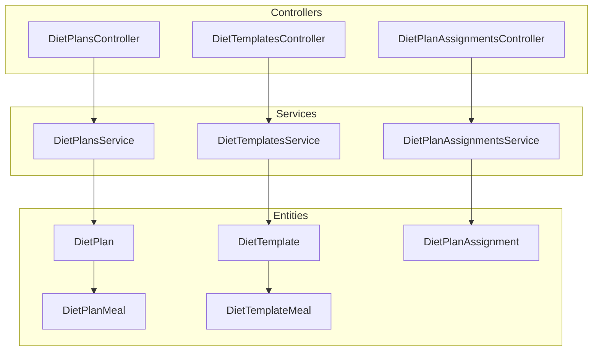

**Diagram sources**
- [diet-plans.controller.ts:30-235](file://src/diet-plans/diet-plans.controller.ts#L30-L235)
- [diet-templates.controller.ts:38-517](file://src/diet-plans/diet-templates.controller.ts#L38-L517)
- [diet-assignments.controller.ts:27-107](file://src/diet-plans/diet-assignments.controller.ts#L27-L107)
- [diet-plans.service.ts:14-180](file://src/diet-plans/diet-plans.service.ts#L14-L180)
- [diet-templates.service.ts:22-359](file://src/diet-plans/diet-templates.service.ts#L22-L359)
- [diet-assignments.service.ts:19-258](file://src/diet-plans/diet-assignments.service.ts#L19-L258)
- [diet-plans.entity.ts:15-95](file://src/entities/diet_plans.entity.ts#L15-L95)
- [diet-templates.entity.ts:14-88](file://src/entities/diet_templates.entity.ts#L14-L88)
- [diet-plan-meals.entity.ts:11-71](file://src/entities/diet_plan_meals.entity.ts#L11-L71)
- [diet-template-meals.entity.ts:11-75](file://src/entities/diet_template_meals.entity.ts#L11-L75)
- [diet-plan-assignments.entity.ts:20-83](file://src/entities/diet_plan_assignments.entity.ts#L20-L83)

**Section sources**
- [diet-plans.module.ts:10-16](file://src/diet-plans/diet-plans.module.ts#L10-L16)
- [diet-templates.module.ts:10-23](file://src/diet-plans/diet-templates.module.ts#L10-L23)
- [diet-assignments.module.ts:9-21](file://src/diet-plans/diet-assignments.module.ts#L9-L21)

## Core Components
- Diet Plans: Personalized plans with target macros, meals, and validity dates. Creation requires trainer or admin privileges and links to a member.
- Diet Templates: Standardized reusable plans with meals, sharing, ratings, and assignment history. Supports copying and versioning.
- Diet Plan Assignments: Distribution mechanism linking a plan to a member with progress tracking, substitutions, and status management.

Key capabilities:
- Nutritional requirement calculation via target macros and daily totals
- Dietary restriction handling through meal-level attributes (e.g., skip options)
- Progress monitoring with completion percent, substitutions, and activity logs
- Plan modification and cancellation workflows

**Section sources**
- [diet-plans.controller.ts:35-116](file://src/diet-plans/diet-plans.controller.ts#L35-L116)
- [diet-templates.controller.ts:45-80](file://src/diet-plans/diet-templates.controller.ts#L45-L80)
- [diet-assignments.controller.ts:34-39](file://src/diet-plans/diet-assignments.controller.ts#L34-L39)

## Architecture Overview
The module follows a layered architecture with controllers, services, and TypeORM entities. Controllers expose REST endpoints guarded by JWT and role-based guards. Services encapsulate business logic and enforce access control. Entities define the data model and relationships.

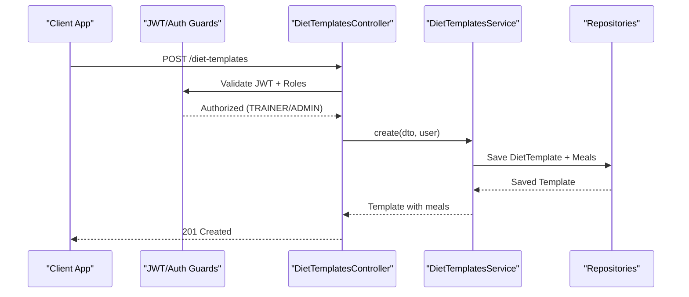

**Diagram sources**
- [diet-templates.controller.ts:45-80](file://src/diet-plans/diet-templates.controller.ts#L45-L80)
- [diet-templates.service.ts:35-67](file://src/diet-plans/diet-templates.service.ts#L35-L67)

**Section sources**
- [diet-templates.controller.ts:40-42](file://src/diet-plans/diet-templates.controller.ts#L40-L42)
- [diet-templates.service.ts:22-34](file://src/diet-plans/diet-templates.service.ts#L22-L34)

## Detailed Component Analysis

### Diet Plans: Creation, Management, and Access Control
- Creation validates member existence, user role (ADMIN/TRAINER), and persists plan with macros and meals.
- Retrieval supports filtering by member and user-specific views (owner vs. creator).
- Updates and deletions enforce ownership or admin privileges.

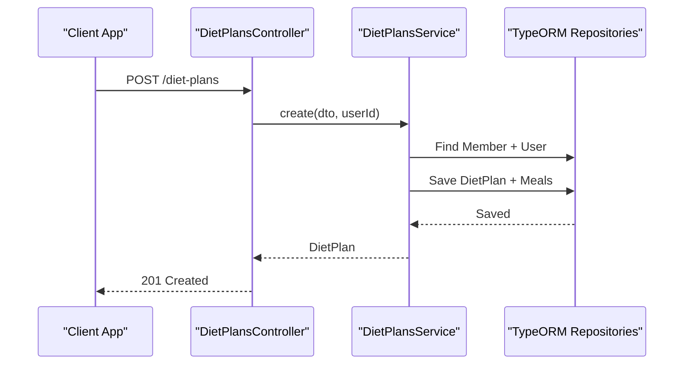

**Diagram sources**
- [diet-plans.controller.ts:111-116](file://src/diet-plans/diet-plans.controller.ts#L111-L116)
- [diet-plans.service.ts:25-63](file://src/diet-plans/diet-plans.service.ts#L25-L63)

**Section sources**
- [diet-plans.controller.ts:35-116](file://src/diet-plans/diet-plans.controller.ts#L35-L116)
- [diet-plans.service.ts:14-63](file://src/diet-plans/diet-plans.service.ts#L14-L63)
- [create-diet.dto.ts:3-26](file://src/diet-plans/dto/create-diet.dto.ts#L3-L26)

### Diet Templates: Standardization, Sharing, and Assignment
- Templates support creation with meals, copying with versioning, rating, and assignment to members.
- Visibility rules allow trainers to share templates within the gym or privately.
- Assignment records usage count and links to template assignments.

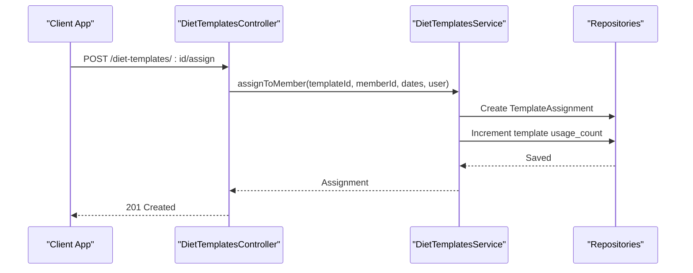

**Diagram sources**
- [diet-templates.controller.ts:420-432](file://src/diet-plans/diet-templates.controller.ts#L420-L432)
- [diet-templates.service.ts:289-314](file://src/diet-plans/diet-templates.service.ts#L289-L314)

**Section sources**
- [diet-templates.controller.ts:420-432](file://src/diet-plans/diet-templates.controller.ts#L420-L432)
- [diet-templates.service.ts:289-314](file://src/diet-plans/diet-templates.service.ts#L289-L314)
- [create-diet-template.dto.ts:90-145](file://src/diet-plans/dto/create-diet-template.dto.ts#L90-L145)

### Diet Plan Assignments: Distribution, Tracking, and Modification
- Assignments link a plan to a member with start/end dates and status.
- Progress updates track completion percent and maintain activity logs.
- Substitutions capture meal swaps with reasons.
- Cancellation and deletion are role-restricted.

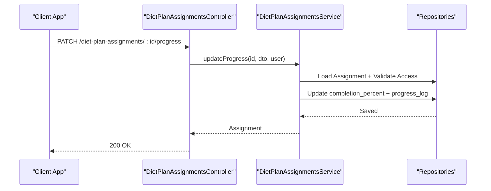

**Diagram sources**
- [diet-assignments.controller.ts:62-70](file://src/diet-plans/diet-assignments.controller.ts#L62-L70)
- [diet-assignments.service.ts:158-182](file://src/diet-plans/diet-assignments.service.ts#L158-L182)

**Section sources**
- [diet-assignments.controller.ts:62-70](file://src/diet-plans/diet-assignments.controller.ts#L62-L70)
- [diet-assignments.service.ts:158-182](file://src/diet-plans/diet-assignments.service.ts#L158-L182)
- [diet-assignment.dto.ts:43-55](file://src/diet-plans/dto/diet-assignment.dto.ts#L43-L55)

### Data Model and Relationships
The entities define the core data model for nutrition programs, including plan/meals, templates/meals, and assignments.

```mermaid
erDiagram
DIET_PLANS {
uuid plan_id PK
int member_id FK
uuid template_id
int trainer_id
int branch_id
enum goal_type
int target_calories
int target_protein
int target_carbs
int target_fat
date start_date
date end_date
boolean is_active
boolean is_completed
int usage_count
uuid parent_template_id
int version
timestamp created_at
timestamp updated_at
}
DIET_PLAN_MEALS {
uuid meal_id PK
uuid diet_plan_id FK
enum meal_type
string meal_name
int day_of_week
int calories
decimal protein_g
decimal carbs_g
decimal fat_g
boolean is_active
timestamp created_at
timestamp updated_at
}
DIET_TEMPLATES {
uuid template_id PK
int trainerId
int branchId
enum goal_type
int target_calories
decimal protein_g
decimal carbs_g
decimal fat_g
boolean is_shared_gym
boolean is_active
int version
uuid parent_template_id
int usage_count
decimal avg_rating
int rating_count
jsonb tags
timestamp created_at
timestamp updated_at
}
DIET_TEMPLATE_MEALS {
uuid meal_id PK
uuid template_id FK
enum meal_type
string meal_name
int day_of_week
int order_index
boolean member_can_skip
timestamp created_at
timestamp updated_at
}
DIET_PLAN_ASSIGNMENTS {
uuid assignment_id PK
uuid diet_plan_id FK
int memberId
int assigned_by_user_id
date start_date
date end_date
enum status
int completion_percent
jsonb member_substitutions
jsonb progress_log
timestamp last_activity_at
timestamp assigned_at
timestamp updated_at
}
DIET_PLANS ||--o{ DIET_PLAN_MEALS : "has"
DIET_TEMPLATES ||--o{ DIET_TEMPLATE_MEALS : "has"
DIET_PLANS ||--o{ DIET_PLAN_ASSIGNMENTS : "assigned"
```

**Diagram sources**
- [diet-plans.entity.ts:15-95](file://src/entities/diet_plans.entity.ts#L15-L95)
- [diet-plan-meals.entity.ts:11-71](file://src/entities/diet_plan_meals.entity.ts#L11-L71)
- [diet-templates.entity.ts:14-88](file://src/entities/diet_templates.entity.ts#L14-L88)
- [diet-template-meals.entity.ts:11-75](file://src/entities/diet_template_meals.entity.ts#L11-L75)
- [diet-plan-assignments.entity.ts:20-83](file://src/entities/diet_plan_assignments.entity.ts#L20-L83)

**Section sources**
- [diet-plans.entity.ts:15-95](file://src/entities/diet_plans.entity.ts#L15-L95)
- [diet-templates.entity.ts:14-88](file://src/entities/diet_templates.entity.ts#L14-L88)
- [diet-plan-meals.entity.ts:11-71](file://src/entities/diet_plan_meals.entity.ts#L11-L71)
- [diet-template-meals.entity.ts:11-75](file://src/entities/diet_template_meals.entity.ts#L11-L75)
- [diet-plan-assignments.entity.ts:20-83](file://src/entities/diet_plan_assignments.entity.ts#L20-L83)

### Practical Workflows

#### Creating a Customized Diet Plan
- Nutritionist/admin creates a plan with target macros and meals for a specific member.
- Validation ensures member exists and user has proper role.
- Plan is persisted with associated meals.

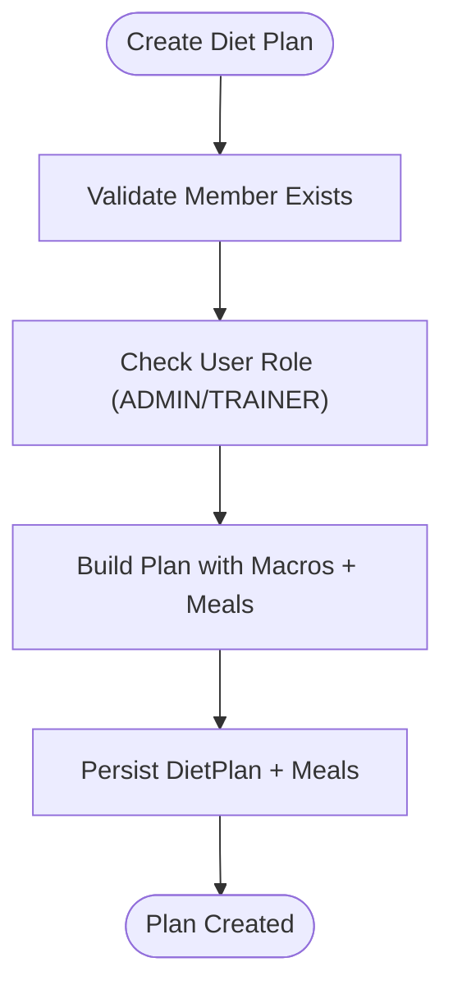

**Diagram sources**
- [diet-plans.controller.ts:111-116](file://src/diet-plans/diet-plans.controller.ts#L111-L116)
- [diet-plans.service.ts:25-63](file://src/diet-plans/diet-plans.service.ts#L25-L63)

**Section sources**
- [diet-plans.controller.ts:35-116](file://src/diet-plans/diet-plans.controller.ts#L35-L116)
- [diet-plans.service.ts:25-63](file://src/diet-plans/diet-plans.service.ts#L25-L63)
- [create-diet.dto.ts:3-26](file://src/diet-plans/dto/create-diet.dto.ts#L3-L26)

#### Using a Nutrition Template
- Trainer/admin creates a template with meals and assigns it to members.
- Templates can be shared within the gym or copied with versioning.

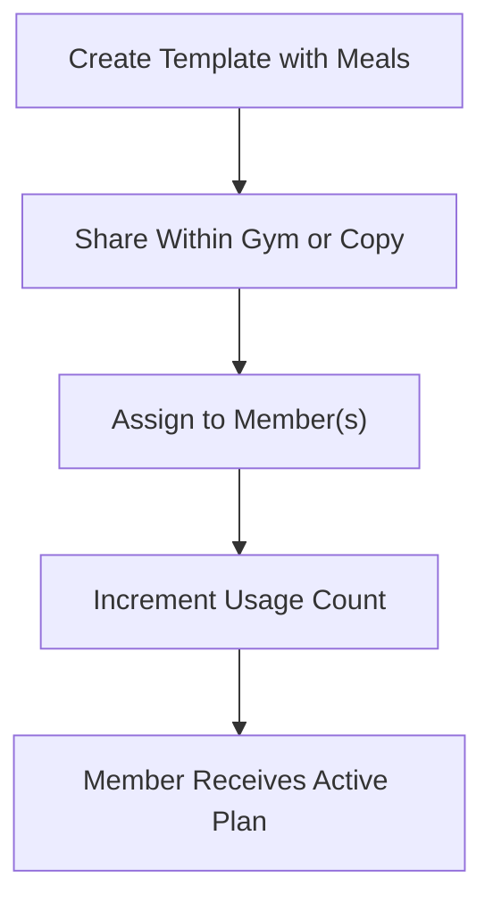

**Diagram sources**
- [diet-templates.controller.ts:45-80](file://src/diet-plans/diet-templates.controller.ts#L45-L80)
- [diet-templates.service.ts:289-314](file://src/diet-plans/diet-templates.service.ts#L289-L314)

**Section sources**
- [diet-templates.controller.ts:45-80](file://src/diet-plans/diet-templates.controller.ts#L45-L80)
- [diet-templates.service.ts:35-67](file://src/diet-plans/diet-templates.service.ts#L35-L67)

#### Assigning Meal Programs to Members
- Assign a plan to a member with start/end dates and status.
- Retrieve assignments by member or filter by status.

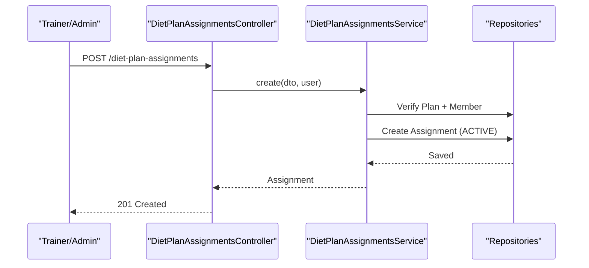

**Diagram sources**
- [diet-assignments.controller.ts:34-39](file://src/diet-plans/diet-assignments.controller.ts#L34-L39)
- [diet-assignments.service.ts:30-76](file://src/diet-plans/diet-assignments.service.ts#L30-L76)

**Section sources**
- [diet-assignments.controller.ts:34-39](file://src/diet-plans/diet-assignments.controller.ts#L34-L39)
- [diet-assignments.service.ts:30-76](file://src/diet-plans/diet-assignments.service.ts#L30-L76)
- [diet-assignment.dto.ts:15-34](file://src/diet-plans/dto/diet-assignment.dto.ts#L15-L34)

#### Tracking Nutritional Intake and Progress
- Update completion percentage and log progress events.
- Record meal substitutions with reasons for auditability.

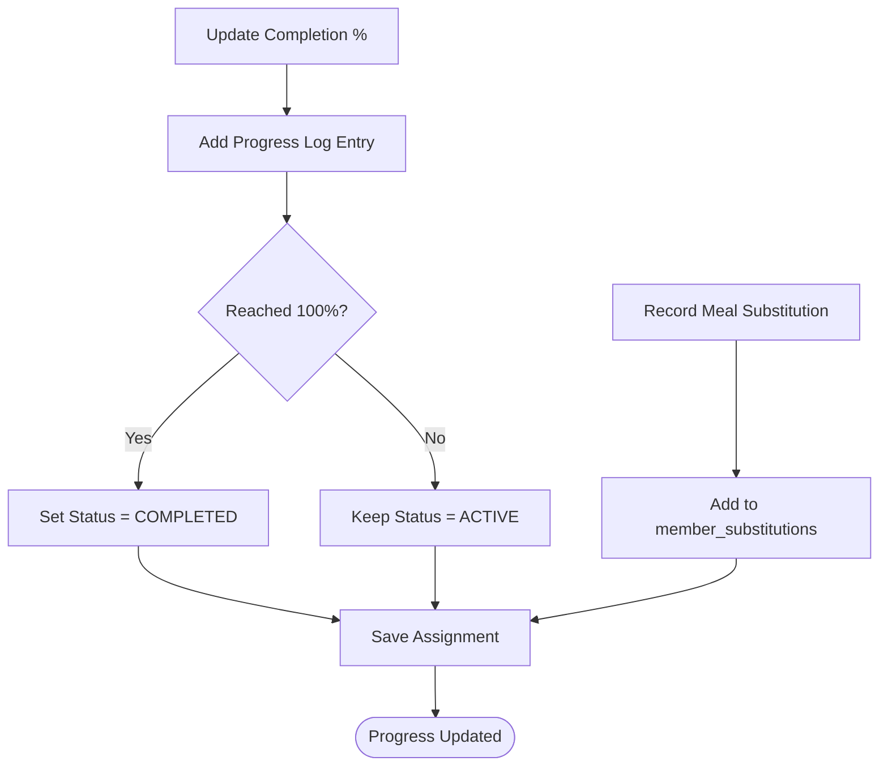

**Diagram sources**
- [diet-assignments.service.ts:158-201](file://src/diet-plans/diet-assignments.service.ts#L158-L201)

**Section sources**
- [diet-assignments.service.ts:158-201](file://src/diet-plans/diet-assignments.service.ts#L158-L201)
- [diet-plan-assignments.entity.ts:56-72](file://src/entities/diet_plan_assignments.entity.ts#L56-L72)

## Dependency Analysis
- Controllers depend on services for business logic and on guards for authentication/authorization.
- Services depend on repositories for persistence and enforce role-based access checks.
- Entities define relationships and cascading deletes for meals and assignments.

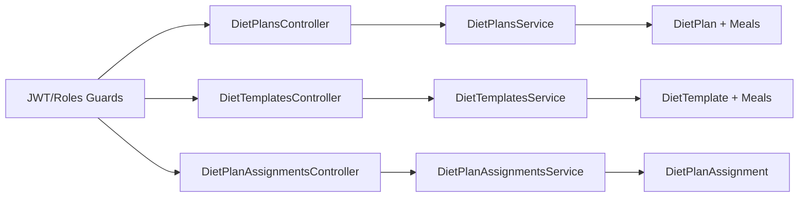

**Diagram sources**
- [diet-plans.controller.ts:30-235](file://src/diet-plans/diet-plans.controller.ts#L30-L235)
- [diet-templates.controller.ts:38-517](file://src/diet-plans/diet-templates.controller.ts#L38-L517)
- [diet-assignments.controller.ts:27-107](file://src/diet-plans/diet-assignments.controller.ts#L27-L107)
- [diet-plans.service.ts:14-180](file://src/diet-plans/diet-plans.service.ts#L14-L180)
- [diet-templates.service.ts:22-359](file://src/diet-plans/diet-templates.service.ts#L22-L359)
- [diet-assignments.service.ts:19-258](file://src/diet-plans/diet-assignments.service.ts#L19-L258)

**Section sources**
- [diet-plans.module.ts:10-16](file://src/diet-plans/diet-plans.module.ts#L10-L16)
- [diet-templates.module.ts:10-23](file://src/diet-plans/diet-templates.module.ts#L10-L23)
- [diet-assignments.module.ts:9-21](file://src/diet-plans/diet-assignments.module.ts#L9-L21)

## Performance Considerations
- Pagination: Template listing and assignment queries support page and limit parameters to control payload size.
- Filtering: Controllers expose filters for status, member, and goal type to reduce result sets.
- Eager loading: Controllers and services load related entities (member, assigned_by, meals) selectively to avoid N+1 queries.
- Indexing: Consider adding database indexes on frequently queried columns (memberId, status, created_at, trainerId).

## Troubleshooting Guide
Common issues and resolutions:
- Unauthorized access: Ensure JWT bearer token is present and user role is ADMIN/TRAINER for privileged operations.
- Member not found: Verify member ID exists before creating plans or assignments.
- Forbidden operations: Only admins or the plan creator can update/delete plans; only trainers/admins can manage templates.
- Assignment not found: Confirm assignment ID exists and user has access rights.

**Section sources**
- [diet-plans.controller.ts:118-163](file://src/diet-plans/diet-plans.controller.ts#L118-L163)
- [diet-plans.service.ts:71-80](file://src/diet-plans/diet-plans.service.ts#L71-L80)
- [diet-templates.controller.ts:181-200](file://src/diet-plans/diet-templates.controller.ts#L181-L200)
- [diet-templates.service.ts:119-148](file://src/diet-plans/diet-templates.service.ts#L119-L148)
- [diet-assignments.controller.ts:41-45](file://src/diet-plans/diet-assignments.controller.ts#L41-L45)
- [diet-assignments.service.ts:133-146](file://src/diet-plans/diet-assignments.service.ts#L133-L146)

## Conclusion
The nutrition programs module provides a robust foundation for diet plan creation, template reuse, and assignment tracking. It enforces role-based access, supports progress monitoring, and integrates with broader fitness workflows. Extending the system to include mobile app features and advanced analytics can further enhance user engagement and outcomes.

## Appendices

### API Endpoints Summary
- Diet Plans
  - POST /diet-plans (create)
  - GET /diet-plans (list)
  - GET /diet-plans/:id (get)
  - PATCH /diet-plans/:id (update)
  - DELETE /diet-plans/:id (delete)
  - GET /diet-plans/member/:memberId (by member)
  - GET /diet-plans/user/my-diet-plans (by user)

- Diet Templates
  - POST /diet-templates (create)
  - GET /diet-templates (list)
  - GET /diet-templates/trainer/my-templates (my templates)
  - GET /diet-templates/:id (get)
  - POST /diet-templates/:id/copy (copy)
  - POST /diet-templates/:id/share (share to trainer)
  - POST /diet-templates/:id/accept (accept shared)
  - POST /diet-templates/:id/rate (rate)
  - POST /diet-templates/:id/assign (assign to member)
  - PATCH /diet-templates/:id (update)
  - POST /diet-templates/:id/substitute (record substitution)
  - DELETE /diet-templates/:id (delete)

- Diet Plan Assignments
  - POST /diet-plan-assignments (create)
  - GET /diet-plan-assignments (list)
  - GET /diet-plan-assignments/member/:memberId (by member)
  - GET /diet-plan-assignments/:id (get)
  - PATCH /diet-plan-assignments/:id/progress (update progress)
  - POST /diet-plan-assignments/:id/substitute (add substitution)
  - POST /diet-plan-assignments/:id/link-chart (link to chart)
  - POST /diet-plan-assignments/:id/cancel (cancel)
  - DELETE /diet-plan-assignments/:id (delete)

**Section sources**
- [diet-plans.controller.ts:35-233](file://src/diet-plans/diet-plans.controller.ts#L35-L233)
- [diet-templates.controller.ts:45-515](file://src/diet-plans/diet-templates.controller.ts#L45-L515)
- [diet-assignments.controller.ts:34-105](file://src/diet-plans/diet-assignments.controller.ts#L34-L105)