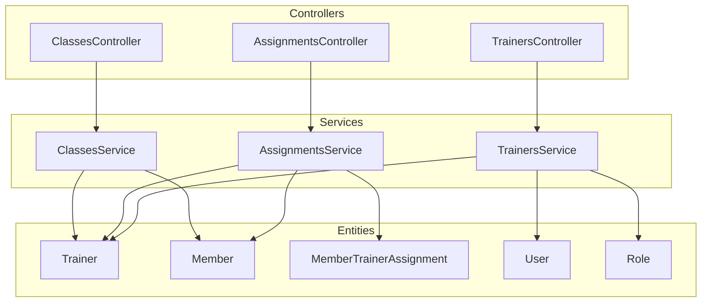
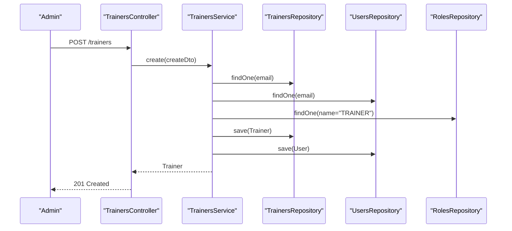
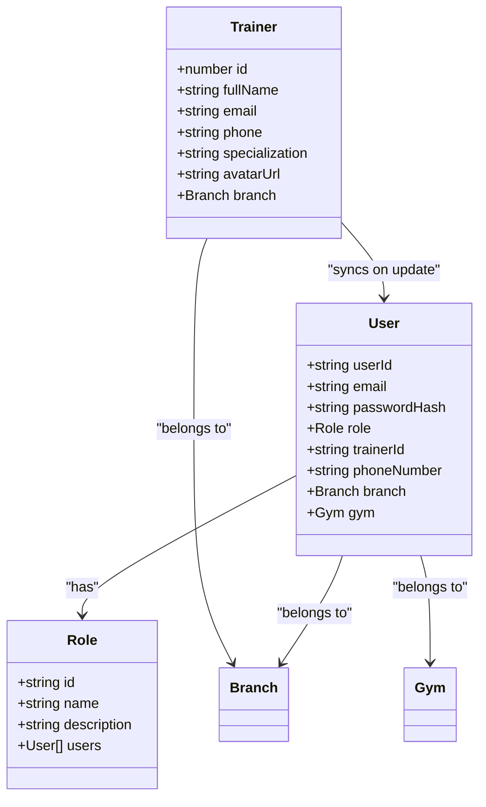
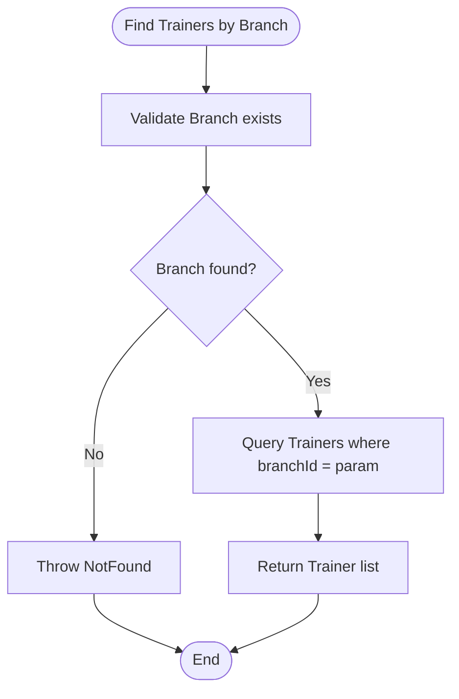
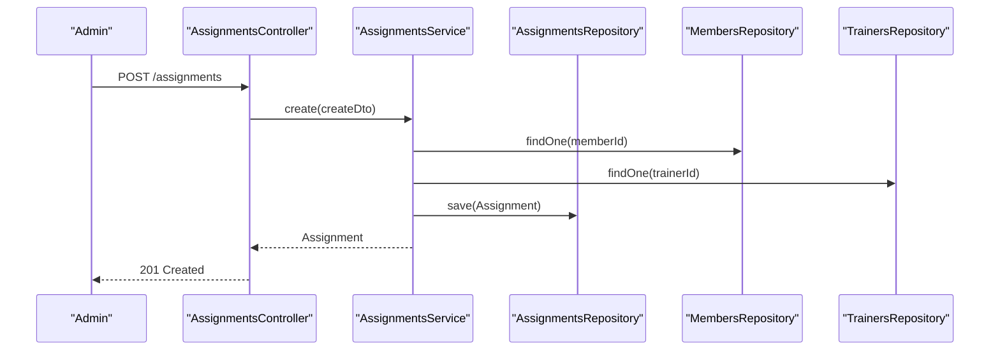
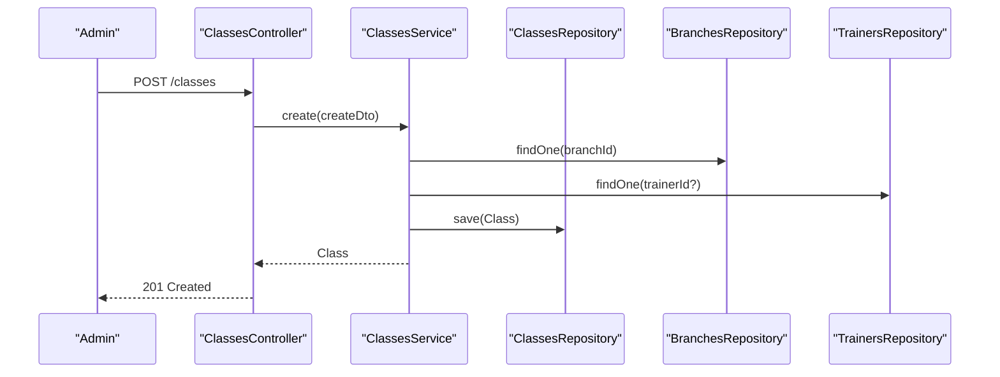
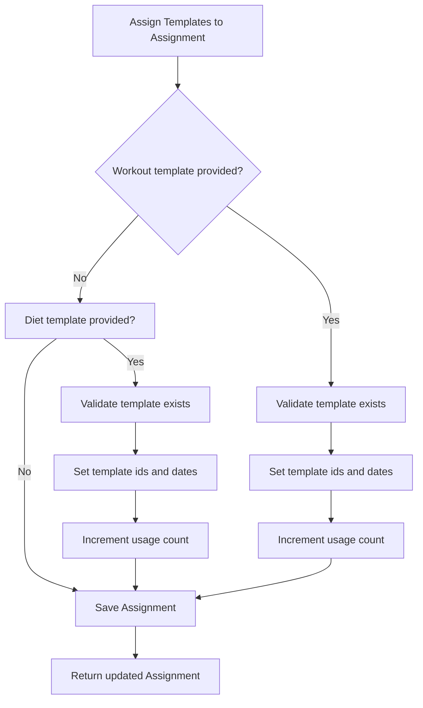
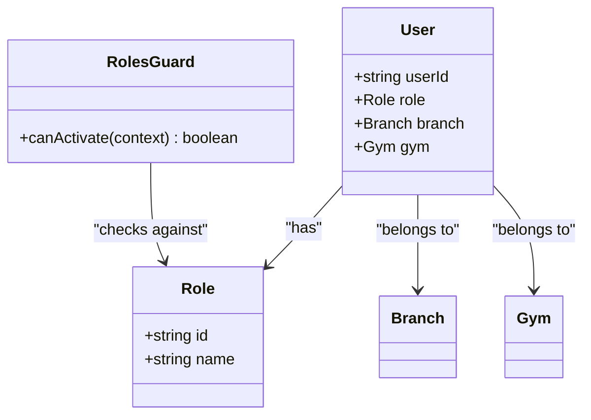
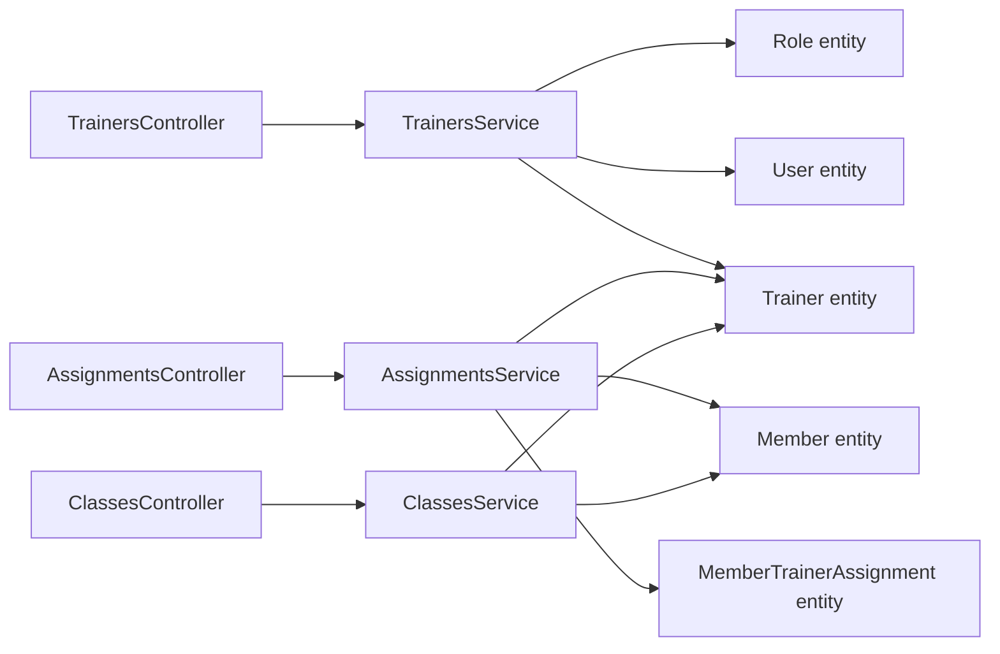

# Staff Management

<cite>
**Referenced Files in This Document**
- [trainers.controller.ts](file://src/trainers/trainers.controller.ts)
- [trainers.service.ts](file://src/trainers/trainers.service.ts)
- [create-trainer.dto.ts](file://src/trainers/dto/create-trainer.dto.ts)
- [update-trainer.dto.ts](file://src/trainers/dto/update-trainer.dto.ts)
- [assignments.controller.ts](file://src/assignments/assignments.controller.ts)
- [assignments.service.ts](file://src/assignments/assignments.service.ts)
- [create-assignment.dto.ts](file://src/assignments/dto/create-assignment.dto.ts)
- [member_trainer_assignments.entity.ts](file://src/entities/member_trainer_assignments.entity.ts)
- [trainers.entity.ts](file://src/entities/trainers.entity.ts)
- [members.entity.ts](file://src/entities/members.entity.ts)
- [classes.controller.ts](file://src/classes/classes.controller.ts)
- [classes.service.ts](file://src/classes/classes.service.ts)
- [roles.guard.ts](file://src/auth/guards/roles.guard.ts)
- [role.enum.ts](file://src/common/enums/role.enum.ts)
- [permissions.enum.ts](file://src/common/enums/permissions.enum.ts)
- [users.entity.ts](file://src/entities/users.entity.ts)
- [roles.entity.ts](file://src/entities/roles.entity.ts)
</cite>

## Table of Contents
1. [Introduction](#introduction)
2. [Project Structure](#project-structure)
3. [Core Components](#core-components)
4. [Architecture Overview](#architecture-overview)
5. [Detailed Component Analysis](#detailed-component-analysis)
6. [Dependency Analysis](#dependency-analysis)
7. [Performance Considerations](#performance-considerations)
8. [Troubleshooting Guide](#troubleshooting-guide)
9. [Conclusion](#conclusion)
10. [Appendices](#appendices)

## Introduction
This document explains the staff management module with a focus on trainer management and staff assignments. It covers trainer registration, qualification and specialization tracking, branch-specific assignments, trainer-member assignment workflows, class scheduling, and integration with training program templates. It also documents role permissions, access controls, and how the system supports performance monitoring via connected entities such as members and progress tracking.

## Project Structure
The staff management functionality spans several modules:
- Trainer management: controllers, services, DTOs, and entities
- Assignments: trainer-member relationships and template assignments
- Classes: group fitness classes linked to trainers and branches
- Authentication and authorization: role-based guards and permissions
- Entities: trainers, members, assignments, users, roles

**Diagram sources**
- [trainers.controller.ts:29-324](file://src/trainers/trainers.controller.ts#L29-L324)
- [trainers.service.ts:17-208](file://src/trainers/trainers.service.ts#L17-L208)
- [assignments.controller.ts:24-310](file://src/assignments/assignments.controller.ts#L24-L310)
- [assignments.service.ts:26-258](file://src/assignments/assignments.service.ts#L26-L258)
- [classes.controller.ts:30-363](file://src/classes/classes.controller.ts#L30-L363)
- [classes.service.ts:11-212](file://src/classes/classes.service.ts#L11-L212)
- [trainers.entity.ts:4-27](file://src/entities/trainers.entity.ts#L4-L27)
- [members.entity.ts:22-124](file://src/entities/members.entity.ts#L22-L124)
- [member_trainer_assignments.entity.ts:13-66](file://src/entities/member_trainer_assignments.entity.ts#L13-L66)
- [users.entity.ts:14-52](file://src/entities/users.entity.ts#L14-L52)
- [roles.entity.ts:4-18](file://src/entities/roles.entity.ts#L4-L18)

**Section sources**
- [trainers.controller.ts:29-324](file://src/trainers/trainers.controller.ts#L29-L324)
- [assignments.controller.ts:24-310](file://src/assignments/assignments.controller.ts#L24-L310)
- [classes.controller.ts:30-363](file://src/classes/classes.controller.ts#L30-L363)

## Core Components
- TrainersController: exposes endpoints for trainer CRUD, branch-specific retrieval, and JWT-protected access.
- TrainersService: orchestrates trainer creation, updates, branch linking, and synchronization with the Users table.
- AssignmentsController: manages trainer-member assignments, template assignments, and member/trainer-centric queries.
- AssignmentsService: handles assignment lifecycle, template assignment/removal, and template usage tracking.
- ClassesController and ClassesService: manage class scheduling and trainer/class associations.
- Authorization: RolesGuard enforces role-based access; permissions define granular capabilities.

**Section sources**
- [trainers.controller.ts:33-276](file://src/trainers/trainers.controller.ts#L33-L276)
- [trainers.service.ts:30-207](file://src/trainers/trainers.service.ts#L30-L207)
- [assignments.controller.ts:28-309](file://src/assignments/assignments.controller.ts#L28-L309)
- [assignments.service.ts:41-257](file://src/assignments/assignments.service.ts#L41-L257)
- [classes.controller.ts:34-362](file://src/classes/classes.controller.ts#L34-L362)
- [classes.service.ts:24-211](file://src/classes/classes.service.ts#L24-L211)
- [roles.guard.ts:12-41](file://src/auth/guards/roles.guard.ts#L12-L41)
- [permissions.enum.ts:50-84](file://src/common/enums/permissions.enum.ts#L50-L84)

## Architecture Overview
The staff management module follows a layered architecture:
- Controllers handle HTTP requests and Swagger metadata.
- Services encapsulate business logic and data access.
- Entities represent domain objects with TypeORM relations.
- Guards enforce authorization policies.

**Diagram sources**
- [trainers.controller.ts:33-65](file://src/trainers/trainers.controller.ts#L33-L65)
- [trainers.service.ts:30-101](file://src/trainers/trainers.service.ts#L30-L101)
- [roles.entity.ts:4-18](file://src/entities/roles.entity.ts#L4-L18)
- [users.entity.ts:14-52](file://src/entities/users.entity.ts#L14-L52)
- [trainers.entity.ts:4-27](file://src/entities/trainers.entity.ts#L4-L27)

## Detailed Component Analysis

### Trainer Management
Trainer registration creates both Trainer and User records, assigns a default role, and optionally links to a branch. Updates synchronize trainer data with the User record.

Key capabilities:
- Registration with branch assignment
- Retrieval by branch and specialization filters
- Update trainer profile and branch
- Deletion with constraints

**Diagram sources**
- [trainers.entity.ts:4-27](file://src/entities/trainers.entity.ts#L4-L27)
- [users.entity.ts:14-52](file://src/entities/users.entity.ts#L14-L52)
- [roles.entity.ts:4-18](file://src/entities/roles.entity.ts#L4-L18)

**Section sources**
- [trainers.controller.ts:33-144](file://src/trainers/trainers.controller.ts#L33-L144)
- [trainers.service.ts:30-101](file://src/trainers/trainers.service.ts#L30-L101)
- [create-trainer.dto.ts:4-44](file://src/trainers/dto/create-trainer.dto.ts#L4-L44)
- [update-trainer.dto.ts:1-5](file://src/trainers/dto/update-trainer.dto.ts#L1-L5)

### Trainer Qualifications and Specializations
- Specialization is stored as a string field on Trainer.
- No dedicated certification or availability schedule fields are present in the Trainer entity in this codebase.
- Availability scheduling and certifications are not implemented here; integrations would require extending the Trainer entity and services.

Recommendations:
- Extend Trainer entity with availability schedule and certifications arrays.
- Add validation and normalization utilities for phone numbers and specializations.

**Section sources**
- [trainers.entity.ts:18-22](file://src/entities/trainers.entity.ts#L18-L22)
- [trainers.service.ts:146-185](file://src/trainers/trainers.service.ts#L146-L185)

### Branch-Specific Assignments
- Trainers can be assigned to a Branch; queries support filtering by branchId.
- Users are linked to Branch and Gym for access scoping.

**Diagram sources**
- [trainers.controller.ts:283-322](file://src/trainers/trainers.controller.ts#L283-L322)
- [trainers.service.ts:132-144](file://src/trainers/trainers.service.ts#L132-L144)

**Section sources**
- [trainers.controller.ts:283-322](file://src/trainers/trainers.controller.ts#L283-L322)
- [trainers.service.ts:132-144](file://src/trainers/trainers.service.ts#L132-L144)
- [users.entity.ts:19-23](file://src/entities/users.entity.ts#L19-L23)

### Trainer-Member Assignment System
Assignments connect members to trainers with optional end dates and statuses. The system supports:
- Creating assignments
- Listing all assignments
- Finding by ID
- Deleting assignments with constraints
- Member-centric and trainer-centric views
- Template assignment linkage (workout and diet templates)

**Diagram sources**
- [assignments.controller.ts:28-102](file://src/assignments/assignments.controller.ts#L28-L102)
- [assignments.service.ts:41-74](file://src/assignments/assignments.service.ts#L41-L74)

**Section sources**
- [assignments.controller.ts:28-216](file://src/assignments/assignments.controller.ts#L28-L216)
- [assignments.service.ts:41-124](file://src/assignments/assignments.service.ts#L41-L124)
- [create-assignment.dto.ts:10-43](file://src/assignments/dto/create-assignment.dto.ts#L10-L43)
- [member_trainer_assignments.entity.ts:13-66](file://src/entities/member_trainer_assignments.entity.ts#L13-L66)

### Session Scheduling and Class Integration
Classes are scheduled per branch and can be assigned to trainers. The system supports:
- Creating classes with timings and recurrence rules
- Filtering classes by branch, timing, and day
- Retrieving classes by branch, gym, or trainer

**Diagram sources**
- [classes.controller.ts:34-65](file://src/classes/classes.controller.ts#L34-L65)
- [classes.service.ts:24-66](file://src/classes/classes.service.ts#L24-L66)

**Section sources**
- [classes.controller.ts:34-204](file://src/classes/classes.controller.ts#L34-L204)
- [classes.service.ts:24-170](file://src/classes/classes.service.ts#L24-L170)

### Performance Tracking and Program Templates
Assignments support linking workout and diet templates with start/end dates and flags for auto-application and substitutions. This enables performance tracking via connected plans and progress records.

**Diagram sources**
- [assignments.service.ts:128-190](file://src/assignments/assignments.service.ts#L128-L190)

**Section sources**
- [assignments.service.ts:128-256](file://src/assignments/assignments.service.ts#L128-L256)
- [member_trainer_assignments.entity.ts:35-58](file://src/entities/member_trainer_assignments.entity.ts#L35-L58)

### Access Controls and Role Permissions
- RolesGuard enforces required roles per endpoint.
- UserRole and Permissions enumerate roles and capabilities.
- Users are linked to Branch and Gym for scoping access.

**Diagram sources**
- [roles.guard.ts:12-41](file://src/auth/guards/roles.guard.ts#L12-L41)
- [role.enum.ts:1-7](file://src/common/enums/role.enum.ts#L1-L7)
- [permissions.enum.ts:50-84](file://src/common/enums/permissions.enum.ts#L50-L84)
- [users.entity.ts:14-52](file://src/entities/users.entity.ts#L14-L52)

**Section sources**
- [roles.guard.ts:12-41](file://src/auth/guards/roles.guard.ts#L12-L41)
- [permissions.enum.ts:50-84](file://src/common/enums/permissions.enum.ts#L50-L84)
- [users.entity.ts:19-32](file://src/entities/users.entity.ts#L19-L32)

## Dependency Analysis
- Controllers depend on Services for business logic.
- Services depend on repositories for data access and on entities for schema definitions.
- Authorization depends on RolesGuard and Permission enums.
- TrainerService depends on Users and Roles entities for account synchronization.

**Diagram sources**
- [trainers.controller.ts:29-324](file://src/trainers/trainers.controller.ts#L29-L324)
- [trainers.service.ts:17-208](file://src/trainers/trainers.service.ts#L17-L208)
- [assignments.controller.ts:24-310](file://src/assignments/assignments.controller.ts#L24-L310)
- [assignments.service.ts:26-258](file://src/assignments/assignments.service.ts#L26-L258)
- [classes.controller.ts:30-363](file://src/classes/classes.controller.ts#L30-L363)
- [classes.service.ts:11-212](file://src/classes/classes.service.ts#L11-L212)
- [trainers.entity.ts:4-27](file://src/entities/trainers.entity.ts#L4-L27)
- [users.entity.ts:14-52](file://src/entities/users.entity.ts#L14-L52)
- [roles.entity.ts:4-18](file://src/entities/roles.entity.ts#L4-L18)
- [members.entity.ts:22-124](file://src/entities/members.entity.ts#L22-L124)
- [member_trainer_assignments.entity.ts:13-66](file://src/entities/member_trainer_assignments.entity.ts#L13-L66)

**Section sources**
- [trainers.service.ts:17-28](file://src/trainers/trainers.service.ts#L17-L28)
- [assignments.service.ts:26-39](file://src/assignments/assignments.service.ts#L26-L39)
- [classes.service.ts:11-22](file://src/classes/classes.service.ts#L11-L22)

## Performance Considerations
- Use relation loading judiciously in controllers/services to avoid N+1 queries.
- Apply pagination for listing endpoints when data grows.
- Index branchId, trainerId, and assignment_id fields in the database for faster lookups.
- Cache frequently accessed role and permission mappings.

## Troubleshooting Guide
Common issues and resolutions:
- Trainer creation fails with conflict: ensure unique email and that the TRAINER role exists.
- Trainer update fails: verify branch exists if branchId is provided; ensure email uniqueness.
- Assignment creation fails: confirm member and trainer exist; check for duplicate assignments.
- Assignment deletion fails: ensure no active sessions or payment records; reassign or cancel first.
- Unauthorized or forbidden: verify JWT token and required roles/permissions.

**Section sources**
- [trainers.service.ts:30-101](file://src/trainers/trainers.service.ts#L30-L101)
- [assignments.service.ts:41-124](file://src/assignments/assignments.service.ts#L41-L124)
- [roles.guard.ts:16-40](file://src/auth/guards/roles.guard.ts#L16-L40)

## Conclusion
The staff management module provides robust trainer registration, branch assignment, and trainer-member assignment workflows. It integrates with classes and supports template-based program assignments. Access control is enforced via roles and permissions. To enhance the system, consider adding trainer availability scheduling, certification tracking, and professional development features by extending the Trainer entity and related services.

## Appendices

### Practical Examples

- Trainer onboarding
  - Steps: Register trainer via POST /trainers with branchId, email, phone, and specialization; system creates User with default password and TRAINER role.
  - Validation: Email must be unique; branch must exist if provided.
  - Outcome: Trainer and User records created; trainer can log in with default credentials.

- Trainer-member assignment workflow
  - Steps: Admin creates assignment via POST /assignments with memberId, trainerId, start/end dates, and optional status; optionally assign workout/diet templates.
  - Validation: Member and trainer must exist; prevent duplicates.
  - Outcome: Assignment recorded; templates linked with usage counts incremented.

- Staff performance monitoring
  - Steps: Link workout/diet templates to assignments; track usage and substitutions; leverage connected Member and ProgressTracking entities for insights.
  - Outcome: Structured program delivery with measurable outcomes.

[No sources needed since this section provides conceptual examples]