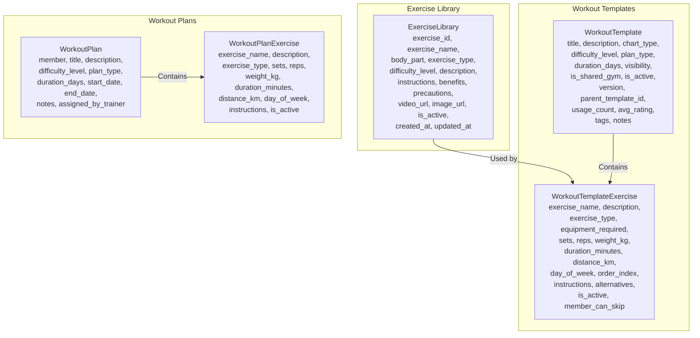
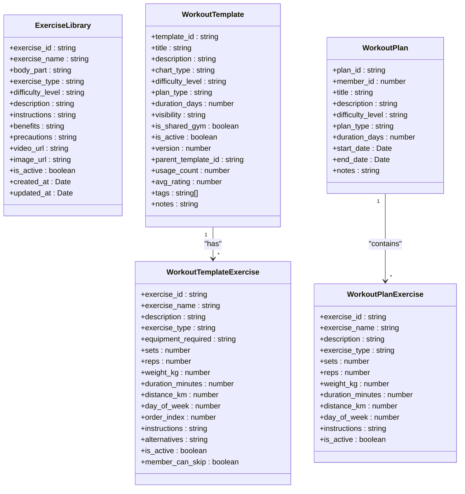
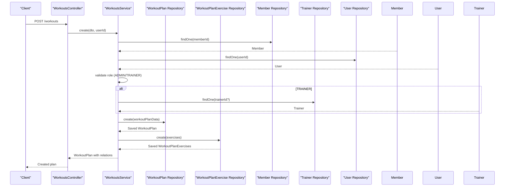
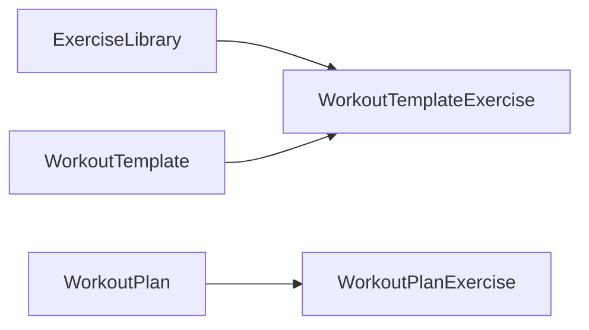

# Exercise Library

<cite>
**Referenced Files in This Document**
- [exercise_library.entity.ts](file://src/entities/exercise_library.entity.ts)
- [create-exercise.dto.ts](file://src/exercise-library/dto/create-exercise.dto.ts)
- [workout_templates.entity.ts](file://src/entities/workout_templates.entity.ts)
- [workout_template_exercises.entity.ts](file://src/entities/workout_template_exercises.entity.ts)
- [workout_plan_exercises.entity.ts](file://src/entities/workout_plan_exercises.entity.ts)
- [create-workout-plan.dto.ts](file://src/workouts/dto/create-workout-plan.dto.ts)
- [workouts.controller.ts](file://src/workouts/workouts.controller.ts)
- [workouts.service.ts](file://src/workouts/workouts.service.ts)
- [seed_gym_Fitness_First_Elite.ts](file://src/database/seed_gym_Fitness_First_Elite.ts)
</cite>

## Table of Contents
1. [Introduction](#introduction)
2. [Project Structure](#project-structure)
3. [Core Components](#core-components)
4. [Architecture Overview](#architecture-overview)
5. [Detailed Component Analysis](#detailed-component-analysis)
6. [Dependency Analysis](#dependency-analysis)
7. [Performance Considerations](#performance-considerations)
8. [Troubleshooting Guide](#troubleshooting-guide)
9. [Conclusion](#conclusion)

## Introduction
This document describes the exercise library management system within the gym management backend. It covers the comprehensive exercise database model, metadata fields, validation and standardization, and the integration with workout planning. It also documents workflows for creating exercises, categorizing them by body parts, exercise types, and difficulty, and how these exercises are consumed during workout plan creation. Practical examples illustrate adding new exercises, managing equipment requirements, and ensuring quality and consistency across the exercise library.

## Project Structure
The exercise library is centered around a dedicated entity and DTO for validation, and integrates with two workout-related entity families:
- Exercise library entity: stores canonical exercise definitions with metadata.
- Workout template and template exercise entities: define reusable workout templates with equipment requirements and exercise specifications.
- Workout plan and plan exercise entities: represent member-specific workout plans derived from templates or created ad-hoc.

**Diagram sources**
- [exercise_library.entity.ts:1-59](file://src/entities/exercise_library.entity.ts#L1-L59)
- [workout_templates.entity.ts:1-126](file://src/entities/workout_templates.entity.ts#L1-L126)
- [workout_template_exercises.entity.ts:1-91](file://src/entities/workout_template_exercises.entity.ts#L1-L91)
- [workout_plan_exercises.entity.ts:1-60](file://src/entities/workout_plan_exercises.entity.ts#L1-L60)

**Section sources**
- [exercise_library.entity.ts:1-59](file://src/entities/exercise_library.entity.ts#L1-L59)
- [workout_templates.entity.ts:1-126](file://src/entities/workout_templates.entity.ts#L1-L126)
- [workout_template_exercises.entity.ts:1-91](file://src/entities/workout_template_exercises.entity.ts#L1-L91)
- [workout_plan_exercises.entity.ts:1-60](file://src/entities/workout_plan_exercises.entity.ts#L1-L60)

## Core Components
- ExerciseLibrary entity: central repository for standardized exercises with fields for name, body part, exercise type, difficulty, and rich metadata (description, instructions, benefits, precautions, media URLs). Includes activation flag and timestamps.
- CreateExerciseDto: validates exercise creation requests with strict enum constraints for body_part, exercise_type, and difficulty_level, and optional text fields for descriptions and media.
- WorkoutTemplate and WorkoutTemplateExercise: define reusable workout templates with equipment requirements and exercise specifications suitable for recommendation and scheduling.
- WorkoutPlan and WorkoutPlanExercise: represent member-specific plans with exercise details and scheduling.

Key capabilities:
- Standardized exercise metadata for accurate search and filtering.
- Equipment requirement modeling via enum in template exercises.
- Validation via DTOs and service-level checks for permissions and existence.

**Section sources**
- [exercise_library.entity.ts:1-59](file://src/entities/exercise_library.entity.ts#L1-L59)
- [create-exercise.dto.ts:1-64](file://src/exercise-library/dto/create-exercise.dto.ts#L1-L64)
- [workout_templates.entity.ts:1-126](file://src/entities/workout_templates.entity.ts#L1-L126)
- [workout_template_exercises.entity.ts:1-91](file://src/entities/workout_template_exercises.entity.ts#L1-L91)
- [workout_plan_exercises.entity.ts:1-60](file://src/entities/workout_plan_exercises.entity.ts#L1-L60)

## Architecture Overview
The system separates canonical exercise definitions from plan-level exercise instances. Exercises in the library inform template and plan exercises, enabling consistent categorization, equipment tracking, and metadata reuse.

**Diagram sources**
- [exercise_library.entity.ts:1-59](file://src/entities/exercise_library.entity.ts#L1-L59)
- [workout_templates.entity.ts:1-126](file://src/entities/workout_templates.entity.ts#L1-L126)
- [workout_template_exercises.entity.ts:1-91](file://src/entities/workout_template_exercises.entity.ts#L1-L91)
- [workout_plan_exercises.entity.ts:1-60](file://src/entities/workout_plan_exercises.entity.ts#L1-L60)

## Detailed Component Analysis

### Exercise Library Entity and Metadata Model
The ExerciseLibrary entity defines the canonical exercise record with:
- Identification and naming
- Categorization: body_part (upper_body, lower_body, core, cardio, full_body), exercise_type (strength, cardio, flexibility, endurance, general), difficulty_level (beginner, intermediate, advanced)
- Rich metadata: description, instructions, benefits, precautions
- Media assets: video_url, image_url
- Lifecycle: is_active flag and timestamps

Practical implications:
- Enables consistent search and filtering across the platform.
- Supports content-rich exercise cards and recommendations.
- Facilitates quality assurance through standardized fields.

**Section sources**
- [exercise_library.entity.ts:1-59](file://src/entities/exercise_library.entity.ts#L1-L59)

### Exercise Creation DTO and Validation
The CreateExerciseDto enforces:
- Non-empty exercise_name
- Enum constraints for body_part, exercise_type, difficulty_level
- Optional text fields for description, instructions, benefits, precautions, video_url, image_url

Validation ensures data integrity and prevents malformed exercise entries.

**Section sources**
- [create-exercise.dto.ts:1-64](file://src/exercise-library/dto/create-exercise.dto.ts#L1-L64)

### Equipment Requirements in Templates
WorkoutTemplateExercise introduces equipment_required via an enum (BARBELL, DUMBBELL, CABLE, MACHINE, BODYWEIGHT, KETTLEBELL, MEDICINE_BALL, RESISTANCE_BAND, OTHER). This enables:
- Equipment-aware exercise selection
- Filtering by available equipment
- Recommendation algorithms that match exercises to gym inventory

**Section sources**
- [workout_template_exercises.entity.ts:11-21](file://src/entities/workout_template_exercises.entity.ts#L11-L21)
- [workout_template_exercises.entity.ts:45-50](file://src/entities/workout_template_exercises.entity.ts#L45-L50)

### Workout Plan Creation and Exercise Selection
Workout creation is handled by the WorkoutsController and WorkoutsService:
- Authorization: Only ADMIN or TRAINER users can create plans; TRAINERs must be assigned to the member or have explicit permissions.
- Member and trainer validation: Ensures member and trainer records exist.
- Plan creation: Builds WorkoutPlan with metadata and saves.
- Exercise ingestion: Converts CreateWorkoutPlanExerciseDto entries into WorkoutPlanExercise records and persists them.

**Diagram sources**
- [workouts.controller.ts:34-460](file://src/workouts/workouts.controller.ts#L34-L460)
- [workouts.service.ts:31-125](file://src/workouts/workouts.service.ts#L31-L125)

**Section sources**
- [workouts.controller.ts:34-460](file://src/workouts/workouts.controller.ts#L34-L460)
- [workouts.service.ts:31-125](file://src/workouts/workouts.service.ts#L31-L125)
- [create-workout-plan.dto.ts:14-144](file://src/workouts/dto/create-workout-plan.dto.ts#L14-L144)

### Exercise Search and Filtering
While a dedicated exercise library controller is not present in the analyzed files, the ExerciseLibrary entity supports robust filtering via:
- Enum filters: body_part, exercise_type, difficulty_level
- Text search: exercise_name, description, benefits, precautions
- Status filter: is_active

Recommendations:
- Implement a dedicated ExerciseLibraryController with endpoints supporting query parameters for filtering and pagination.
- Add index coverage for frequent filters (e.g., body_part, exercise_type, difficulty_level, is_active).

[No sources needed since this section provides general guidance]

### Exercise Validation and Quality Assurance
Quality measures observed:
- DTO validation for exercise creation
- Service-level checks for member/trainer existence and role-based permissions
- Enum constraints prevent invalid categorical data

Recommendations:
- Add duplicate detection by normalized exercise_name and category combinations.
- Enforce uniqueness constraints at the database level for canonical exercise identifiers.
- Implement pre-save hooks to normalize text fields and sanitize URLs.

**Section sources**
- [create-exercise.dto.ts:1-64](file://src/exercise-library/dto/create-exercise.dto.ts#L1-L64)
- [workouts.service.ts:31-72](file://src/workouts/workouts.service.ts#L31-L72)

### Exercise Standardization and Lifecycle Management
Standardization:
- Centralized ExerciseLibrary entity with strict enums for body_part, exercise_type, difficulty_level.
- Rich metadata fields support consistent presentation and recommendations.

Lifecycle:
- is_active flag controls visibility and inclusion in recommendations.
- created_at and updated_at enable audit trails and sorting.

Recommendations:
- Add soft-delete patterns and archived status for historical exercises.
- Implement versioning for exercise definitions to track updates.

**Section sources**
- [exercise_library.entity.ts:50-57](file://src/entities/exercise_library.entity.ts#L50-L57)

### Practical Examples

#### Example: Adding a New Exercise to the Library
Steps:
- Validate exercise metadata using CreateExerciseDto.
- Persist to ExerciseLibrary with standardized fields.
- Mark as active and publish.

Outcome:
- Exercise appears in search and can be referenced by templates and plans.

**Section sources**
- [create-exercise.dto.ts:1-64](file://src/exercise-library/dto/create-exercise.dto.ts#L1-L64)
- [exercise_library.entity.ts:1-59](file://src/entities/exercise_library.entity.ts#L1-L59)

#### Example: Categorizing Exercises by Difficulty and Equipment
Steps:
- Choose difficulty_level from predefined enum.
- Select equipment_required for template exercises to reflect gym inventory.
- Assign body_part and exercise_type for grouping.

Outcome:
- Users can filter by difficulty and equipment availability.

**Section sources**
- [workout_template_exercises.entity.ts:11-21](file://src/entities/workout_template_exercises.entity.ts#L11-L21)
- [workout_template_exercises.entity.ts:45-50](file://src/entities/workout_template_exercises.entity.ts#L45-L50)
- [exercise_library.entity.ts:17-30](file://src/entities/exercise_library.entity.ts#L17-L30)

#### Example: Creating Exercise Videos and Demonstrations
Steps:
- Populate video_url and image_url in ExerciseLibrary.
- Reference media in workout templates and plans for instructional guidance.

Outcome:
- Enhanced learning experience and safer exercise execution.

**Section sources**
- [exercise_library.entity.ts:44-48](file://src/entities/exercise_library.entity.ts#L44-L48)

#### Example: Maintaining Exercise Accuracy
Steps:
- Use benefits and precautions fields to communicate safety and outcomes.
- Keep descriptions and instructions up to date.
- Use is_active to temporarily hide outdated entries.

Outcome:
- Reliable, evidence-based exercise guidance.

**Section sources**
- [exercise_library.entity.ts:32-42](file://src/entities/exercise_library.entity.ts#L32-L42)

#### Example: Using the Library in Workout Planning
Steps:
- Seed or select exercises from ExerciseLibrary for templates.
- Map equipment_required to available gym assets.
- Build WorkoutPlanExercise entries with sets/reps or time/distance parameters.

Outcome:
- Structured, equipment-aware workout plans tailored to members.

**Section sources**
- [seed_gym_Fitness_First_Elite.ts:1772-1812](file://src/database/seed_gym_Fitness_First_Elite.ts#L1772-L1812)
- [workout_template_exercises.entity.ts:45-50](file://src/entities/workout_template_exercises.entity.ts#L45-L50)
- [workout_plan_exercises.entity.ts:27-46](file://src/entities/workout_plan_exercises.entity.ts#L27-L46)

## Dependency Analysis
The system exhibits clear separation of concerns:
- ExerciseLibrary is independent and can be referenced by templates and plans.
- WorkoutTemplateExercise extends exercise definitions with equipment and scheduling metadata.
- WorkoutPlanExercise captures member-specific exercise details.

**Diagram sources**
- [exercise_library.entity.ts:1-59](file://src/entities/exercise_library.entity.ts#L1-L59)
- [workout_templates.entity.ts:1-126](file://src/entities/workout_templates.entity.ts#L1-L126)
- [workout_template_exercises.entity.ts:1-91](file://src/entities/workout_template_exercises.entity.ts#L1-L91)
- [workout_plan_exercises.entity.ts:1-60](file://src/entities/workout_plan_exercises.entity.ts#L1-L60)

**Section sources**
- [workout_templates.entity.ts:1-126](file://src/entities/workout_templates.entity.ts#L1-L126)
- [workout_template_exercises.entity.ts:1-91](file://src/entities/workout_template_exercises.entity.ts#L1-L91)
- [workout_plan_exercises.entity.ts:1-60](file://src/entities/workout_plan_exercises.entity.ts#L1-L60)

## Performance Considerations
- Index frequently queried columns: body_part, exercise_type, difficulty_level, is_active on ExerciseLibrary.
- Paginate exercise listings and limit returned fields for recommendation endpoints.
- Denormalize minimal metadata in templates/plans to reduce joins during rendering.

[No sources needed since this section provides general guidance]

## Troubleshooting Guide
Common issues and resolutions:
- Unauthorized access when creating workout plans: Verify user role is ADMIN or TRAINER and that trainer assignments are correct.
- Missing member or trainer records: Ensure IDs exist before plan creation.
- Invalid exercise type or enum values: Validate DTOs and enum constraints.

**Section sources**
- [workouts.service.ts:31-72](file://src/workouts/workouts.service.ts#L31-L72)
- [workouts.service.ts:144-196](file://src/workouts/workouts.service.ts#L144-L196)

## Conclusion
The exercise library provides a robust foundation for standardized exercise definitions, enriched metadata, and integration with workout templates and plans. By leveraging enum constraints, rich metadata fields, and equipment-aware template exercises, the system supports accurate search, filtering, and recommendation. Strengthening duplicate detection, normalization, and lifecycle management will further improve data quality and maintainability.