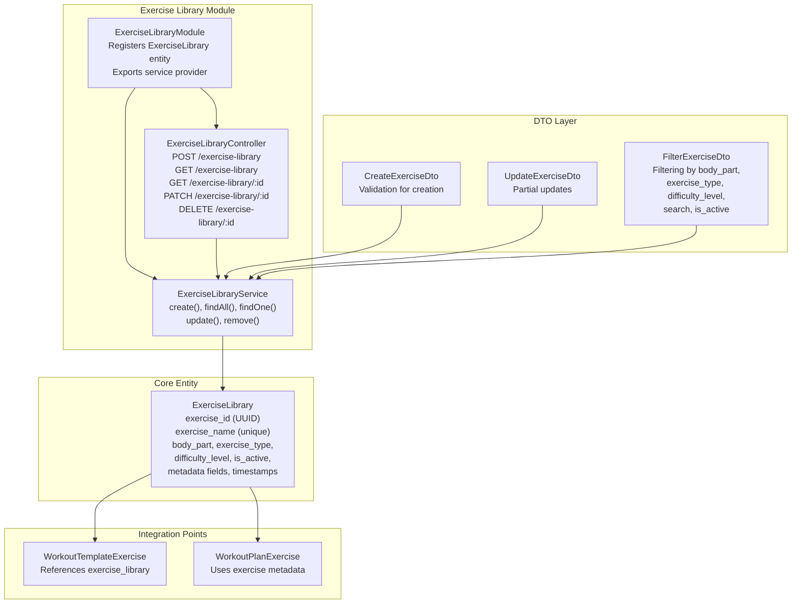
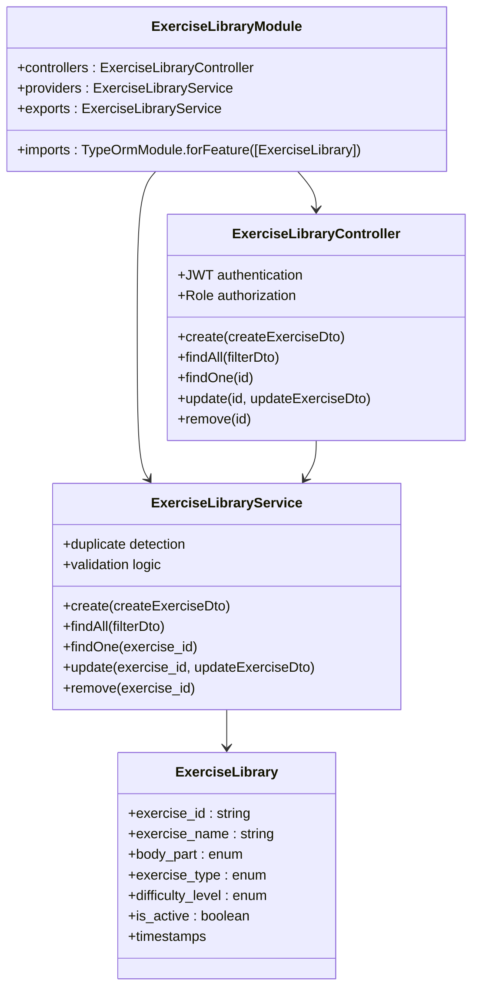

# Exercise Library

<cite>
**Referenced Files in This Document**
- [exercise_library.entity.ts](file://src/entities/exercise_library.entity.ts)
- [create-exercise.dto.ts](file://src/exercise-library/dto/create-exercise.dto.ts)
- [update-exercise.dto.ts](file://src/exercise-library/dto/update-exercise.dto.ts)
- [filter-exercise.dto.ts](file://src/exercise-library/dto/filter-exercise.dto.ts)
- [exercise-library.module.ts](file://src/exercise-library/exercise-library.module.ts)
- [exercise-library.controller.ts](file://src/exercise-library/exercise-library.controller.ts)
- [exercise-library.service.ts](file://src/exercise-library/exercise-library.service.ts)
- [workout_templates.entity.ts](file://src/entities/workout_templates.entity.ts)
- [workout_template_exercises.entity.ts](file://src/entities/workout_template_exercises.entity.ts)
- [workout_plan_exercises.entity.ts](file://src/entities/workout_plan_exercises.entity.ts)
- [create-workout-plan.dto.ts](file://src/workouts/dto/create-workout-plan.dto.ts)
- [workouts.controller.ts](file://src/workouts/workouts.controller.ts)
- [workouts.service.ts](file://src/workouts/workouts.service.ts)
- [seed_gym_Fitness_First_Elite.ts](file://src/database/seed_gym_Fitness_First_Elite.ts)
- [app.module.ts](file://src/app.module.ts)
</cite>

## Update Summary
**Changes Made**
- Added comprehensive CRUD operations documentation for the exercise library module
- Documented the complete controller implementation with admin-only write permissions
- Added filtering capabilities documentation covering body_part, exercise_type, difficulty_level, and search functionality
- Updated architecture overview to reflect the fully implemented module structure
- Enhanced practical examples with real API endpoints and usage scenarios
- Added security considerations for admin-only access control

## Table of Contents
1. [Introduction](#introduction)
2. [Project Structure](#project-structure)
3. [Core Components](#core-components)
4. [Architecture Overview](#architecture-overview)
5. [Detailed Component Analysis](#detailed-component-analysis)
6. [API Endpoints and Usage](#api-endpoints-and-usage)
7. [Security and Access Control](#security-and-access-control)
8. [Dependency Analysis](#dependency-analysis)
9. [Performance Considerations](#performance-considerations)
10. [Troubleshooting Guide](#troubleshooting-guide)
11. [Conclusion](#conclusion)

## Introduction
This document describes the fully implemented exercise library management system within the gym management backend. The exercise library module provides comprehensive CRUD operations for managing standardized exercise definitions, complete with filtering capabilities, admin-only write permissions, and seamless integration with workout planning systems. The module includes entity definition, service layer, controller implementation, DTO validation, and proper registration within the application architecture.

## Project Structure
The exercise library module follows NestJS best practices with a complete implementation including entity, DTOs, service, controller, and module registration:



**Diagram sources**
- [exercise-library.module.ts:1-14](file://src/exercise-library/exercise-library.module.ts#L1-L14)
- [exercise-library.controller.ts:28-97](file://src/exercise-library/exercise-library.controller.ts#L28-L97)
- [exercise-library.service.ts:13-102](file://src/exercise-library/exercise-library.service.ts#L13-L102)
- [exercise_library.entity.ts:9-59](file://src/entities/exercise_library.entity.ts#L9-L59)
- [create-exercise.dto.ts:4-64](file://src/exercise-library/dto/create-exercise.dto.ts#L4-L64)
- [update-exercise.dto.ts:1-5](file://src/exercise-library/dto/update-exercise.dto.ts#L1-L5)
- [filter-exercise.dto.ts:5-41](file://src/exercise-library/dto/filter-exercise.dto.ts#L5-L41)

**Section sources**
- [exercise-library.module.ts:1-14](file://src/exercise-library/exercise-library.module.ts#L1-L14)
- [exercise-library.controller.ts:28-97](file://src/exercise-library/exercise-library.controller.ts#L28-L97)
- [exercise-library.service.ts:13-102](file://src/exercise-library/exercise-library.service.ts#L13-L102)
- [exercise_library.entity.ts:9-59](file://src/entities/exercise_library.entity.ts#L9-L59)

## Core Components

### ExerciseLibrary Entity
The central repository for standardized exercises with comprehensive metadata:
- **Identification**: UUID primary key (`exercise_id`)
- **Unique Identifier**: String field (`exercise_name`) with uniqueness constraint
- **Categorization**: Enum fields for `body_part`, `exercise_type`, and `difficulty_level`
- **Rich Metadata**: Description, instructions, benefits, precautions (nullable text fields)
- **Media Assets**: Video and image URL fields for demonstrations
- **Lifecycle Management**: Active status flag and timestamp tracking

### DTO Validation Layer
Comprehensive validation ensures data integrity:
- **CreateExerciseDto**: Validates exercise creation with enum constraints
- **UpdateExerciseDto**: Extends create DTO for partial updates
- **FilterExerciseDto**: Provides flexible filtering options with transformation

### Service Implementation
Complete CRUD operations with business logic:
- **Create**: Duplicate detection by exercise name
- **Read**: Individual retrieval and paginated listing with filtering
- **Update**: Name conflict detection and partial updates
- **Delete**: Cascade removal with error handling

**Section sources**
- [exercise_library.entity.ts:9-59](file://src/entities/exercise_library.entity.ts#L9-L59)
- [create-exercise.dto.ts:4-64](file://src/exercise-library/dto/create-exercise.dto.ts#L4-L64)
- [update-exercise.dto.ts:1-5](file://src/exercise-library/dto/update-exercise.dto.ts#L1-L5)
- [filter-exercise.dto.ts:5-41](file://src/exercise-library/dto/filter-exercise.dto.ts#L5-L41)
- [exercise-library.service.ts:20-100](file://src/exercise-library/exercise-library.service.ts#L20-L100)

## Architecture Overview
The exercise library module follows a clean architecture pattern with clear separation of concerns:



**Diagram sources**
- [exercise-library.module.ts:7-12](file://src/exercise-library/exercise-library.module.ts#L7-L12)
- [exercise-library.controller.ts:30-33](file://src/exercise-library/exercise-library.controller.ts#L30-L33)
- [exercise-library.service.ts:14-18](file://src/exercise-library/exercise-library.service.ts#L14-L18)
- [exercise_library.entity.ts:10-58](file://src/entities/exercise_library.entity.ts#L10-L58)

## Detailed Component Analysis

### Complete CRUD Implementation
The exercise library module provides full CRUD functionality with proper error handling:

**Create Operation**
- Validates unique exercise name constraint
- Throws conflict exception for duplicates
- Returns created exercise with metadata

**Read Operations**
- Individual retrieval by UUID with not-found handling
- Bulk listing with comprehensive filtering
- Pagination support through TypeORM's findAndCount

**Update Operation**
- Partial updates with validation
- Name conflict detection during updates
- Atomic transaction handling

**Delete Operation**
- Cascade removal with proper cleanup
- Error handling for non-existent records

**Section sources**
- [exercise-library.service.ts:20-100](file://src/exercise-library/exercise-library.service.ts#L20-L100)
- [exercise-library.controller.ts:35-95](file://src/exercise-library/exercise-library.controller.ts#L35-L95)

### Comprehensive Filtering System
The module supports sophisticated filtering through FilterExerciseDto:

**Category Filters**
- `body_part`: upper_body, lower_body, core, cardio, full_body
- `exercise_type`: strength, cardio, flexibility, endurance, general  
- `difficulty_level`: beginner, intermediate, advanced

**Search and Status**
- `search`: Text-based exercise name filtering using ILike
- `is_active`: Boolean filtering for active/inactive exercises

**Implementation Details**
- Dynamic WHERE clause construction
- Case-insensitive search patterns
- Optional parameter handling
- Default ordering by exercise name

**Section sources**
- [filter-exercise.dto.ts:5-41](file://src/exercise-library/dto/filter-exercise.dto.ts#L5-L41)
- [exercise-library.service.ts:34-61](file://src/exercise-library/exercise-library.service.ts#L34-L61)

### Admin-Only Write Permissions
Security is enforced at multiple layers:

**Authentication**
- JWT authentication required for all write operations
- Public read access for authenticated users

**Authorization**
- SUPERADMIN role for all operations
- ADMIN role for read operations
- RolesGuard enforces permission checking

**Implementation**
- Decorators on controller methods
- Role validation middleware
- Proper HTTP status codes for unauthorized access

**Section sources**
- [exercise-library.controller.ts:36-88](file://src/exercise-library/exercise-library.controller.ts#L36-L88)
- [app.module.ts:65](file://src/app.module.ts#L65)

## API Endpoints and Usage

### REST API Endpoints
The exercise library exposes the following endpoints:

**Create Exercise**
- **Method**: POST
- **Endpoint**: `/exercise-library`
- **Authentication**: JWT required
- **Authorization**: SUPERADMIN or ADMIN
- **Response**: 201 Created with exercise data

**List Exercises**
- **Method**: GET  
- **Endpoint**: `/exercise-library`
- **Authentication**: JWT required
- **Authorization**: Any authenticated user
- **Query Parameters**: body_part, exercise_type, difficulty_level, search, is_active
- **Response**: 200 OK with pagination data

**Get Exercise**
- **Method**: GET
- **Endpoint**: `/exercise-library/:id`
- **Authentication**: JWT required
- **Authorization**: Any authenticated user
- **Response**: 200 OK with exercise data

**Update Exercise**
- **Method**: PATCH
- **Endpoint**: `/exercise-library/:id`
- **Authentication**: JWT required
- **Authorization**: SUPERADMIN or ADMIN
- **Response**: 200 OK with updated exercise data

**Delete Exercise**
- **Method**: DELETE
- **Endpoint**: `/exercise-library/:id`
- **Authentication**: JWT required
- **Authorization**: SUPERADMIN or ADMIN
- **Response**: 200 OK with deletion confirmation

### Request and Response Examples

**Create Exercise Request**
```json
{
  "exercise_name": "Bench Press",
  "body_part": "upper_body",
  "exercise_type": "strength",
  "difficulty_level": "intermediate",
  "description": "Barbell chest press exercise",
  "instructions": "Lie on flat bench, grip barbell...",
  "benefits": "Strengthens chest, shoulders, triceps",
  "precautions": "Keep feet flat on ground",
  "video_url": "https://example.com/video.mp4",
  "image_url": "https://example.com/image.jpg"
}
```

**Filter Exercise Response**
```json
{
  "data": [
    {
      "exercise_id": "uuid-here",
      "exercise_name": "Bench Press",
      "body_part": "upper_body",
      "exercise_type": "strength", 
      "difficulty_level": "intermediate",
      "is_active": true,
      "created_at": "2024-01-01T00:00:00Z",
      "updated_at": "2024-01-01T00:00:00Z"
    }
  ],
  "total": 1
}
```

**Section sources**
- [exercise-library.controller.ts:35-95](file://src/exercise-library/exercise-library.controller.ts#L35-L95)
- [exercise-library.service.ts:34-61](file://src/exercise-library/exercise-library.service.ts#L34-L61)

## Security and Access Control

### Authentication Requirements
All exercise library endpoints require JWT authentication:
- **Read Operations**: Any authenticated user
- **Write Operations**: Requires valid JWT token
- **Token Validation**: Automatic JWT guard enforcement

### Role-Based Authorization
Access control is enforced through role-based permissions:

**Super Admin Privileges**
- Full CRUD access to all exercises
- Can bypass most restrictions
- Global administrative capabilities

**Admin Privileges**  
- Read access to all exercises
- Write access to exercise management
- Limited to administrative functions

**Trainer/Member Access**
- Read-only access to exercises
- Cannot modify exercise library
- Used for workout plan creation

### Security Features
- **Duplicate Prevention**: Automatic detection of exercise names
- **Input Validation**: Strict DTO validation for all inputs
- **Error Handling**: Proper HTTP status codes for different failure modes
- **Audit Trail**: Timestamps for all modifications

**Section sources**
- [exercise-library.controller.ts:36-88](file://src/exercise-library/exercise-library.controller.ts#L36-L88)
- [exercise-library.service.ts:20-32](file://src/exercise-library/exercise-library.service.ts#L20-L32)

## Dependency Analysis
The exercise library module integrates seamlessly with the broader application architecture:

```mermaid
graph LR
subgraph "Application Layer"
AM["AppModule<br/>Registers ExerciseLibraryModule"]
EM["ExerciseLibraryModule<br/>Imports TypeOrmModule.forFeature"]
end
subgraph "Domain Layer"
ES["ExerciseLibraryService<br/>Business Logic"]
EC["ExerciseLibraryController<br/>HTTP Interface"]
end
subgraph "Infrastructure Layer"
ER["ExerciseLibrary Repository<br/>TypeORM"]
EE["ExerciseLibrary Entity<br/>Database Schema"]
end
subgraph "External Dependencies"
JWT["JWT Authentication"]
ROLE["Role Guard"]
TYPEORM["TypeORM"]
```

**Diagram sources**
- [app.module.ts:65](file://src/app.module.ts#L65)
- [exercise-library.module.ts:7-12](file://src/exercise-library/exercise-library.module.ts#L7-L12)
- [exercise-library.controller.ts:23-26](file://src/exercise-library/exercise-library.controller.ts#L23-L26)
- [exercise-library.service.ts:15-18](file://src/exercise-library/exercise-library.service.ts#L15-L18)

**Section sources**
- [app.module.ts:65](file://src/app.module.ts#L65)
- [exercise-library.module.ts:7-12](file://src/exercise-library/exercise-library.module.ts#L7-L12)
- [exercise-library.controller.ts:23-26](file://src/exercise-library/exercise-library.controller.ts#L23-L26)

## Performance Considerations
Optimization strategies for the exercise library module:

### Database Optimization
- **Index Strategy**: Create indexes on frequently filtered columns:
  - `exercise_name` (for search)
  - `body_part`, `exercise_type`, `difficulty_level` (for category filtering)
  - `is_active` (for status filtering)
- **Pagination**: Use TypeORM's findAndCount for efficient pagination
- **Selectivity**: Limit returned fields in filtered queries

### Caching Strategy
- **Read Caching**: Cache popular exercises for read-heavy workloads
- **Filter Caching**: Cache common filter combinations
- **Metadata Caching**: Cache enum values and validation schemas

### API Optimization
- **Response Size**: Implement field selection for bulk operations
- **Batch Processing**: Support batch operations for bulk updates
- **Compression**: Enable response compression for large datasets

## Troubleshooting Guide

### Common Issues and Solutions

**Exercise Creation Failures**
- **Duplicate Name Error**: Ensure unique exercise names across categories
- **Validation Errors**: Check DTO constraints for enum values
- **Database Constraints**: Verify unique index on exercise_name

**Filtering Problems**
- **Empty Results**: Verify filter parameters match existing data
- **Case Sensitivity**: Search uses case-insensitive matching
- **Permission Denied**: Ensure proper authentication and authorization

**API Access Issues**
- **401 Unauthorized**: Verify JWT token validity and expiration
- **403 Forbidden**: Check user role permissions
- **404 Not Found**: Verify exercise ID format and existence

**Performance Issues**
- **Slow Queries**: Add appropriate database indexes
- **Large Responses**: Implement pagination and field limiting
- **Memory Usage**: Optimize bulk operations with streaming

**Section sources**
- [exercise-library.service.ts:20-32](file://src/exercise-library/exercise-library.service.ts#L20-L32)
- [exercise-library.service.ts:63-71](file://src/exercise-library/exercise-library.service.ts#L63-L71)
- [exercise-library.controller.ts:41-44](file://src/exercise-library/exercise-library.controller.ts#L41-L44)

## Conclusion
The exercise library module represents a comprehensive solution for managing standardized exercise definitions within the gym management system. With complete CRUD operations, sophisticated filtering capabilities, admin-only write permissions, and seamless integration with workout planning systems, the module provides a robust foundation for exercise management.

Key achievements include:
- **Complete Implementation**: Full CRUD operations with proper error handling
- **Advanced Filtering**: Multi-dimensional filtering by category, difficulty, and search
- **Security**: Role-based access control with JWT authentication
- **Integration**: Seamless connection to workout templates and plans
- **Standards Compliance**: Following NestJS and TypeORM best practices

The module's architecture supports future enhancements such as exercise versioning, duplicate detection improvements, and advanced recommendation algorithms. Its modular design ensures maintainability and scalability as the application grows.