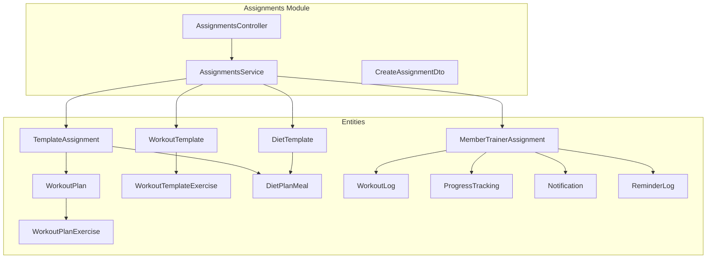
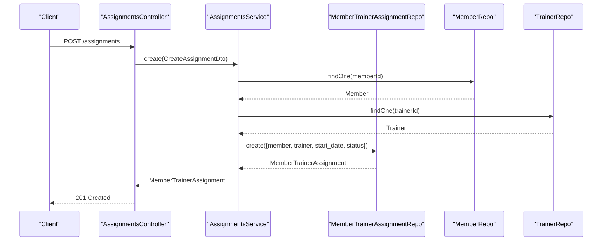
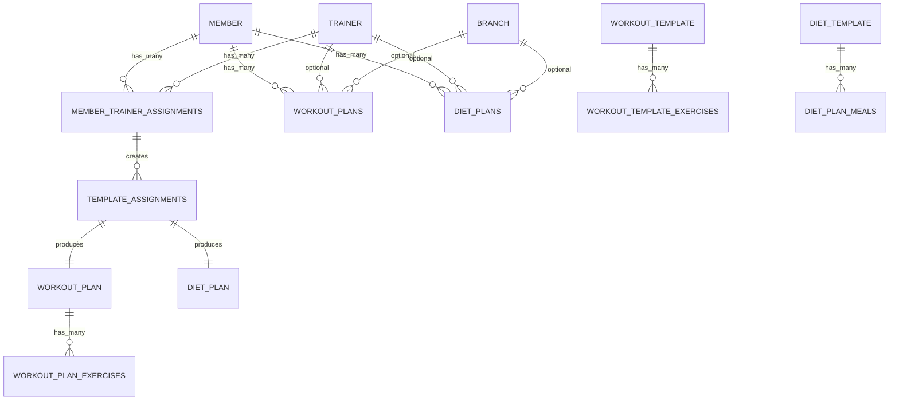
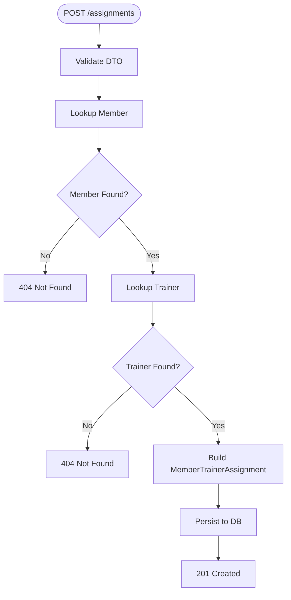
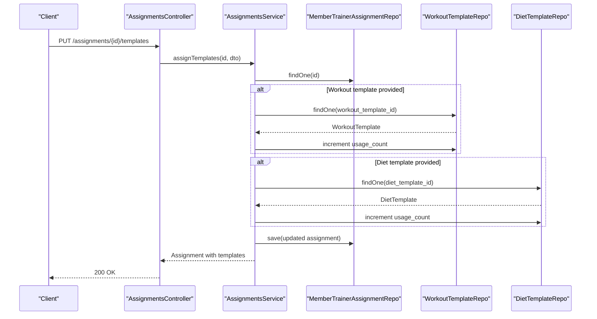
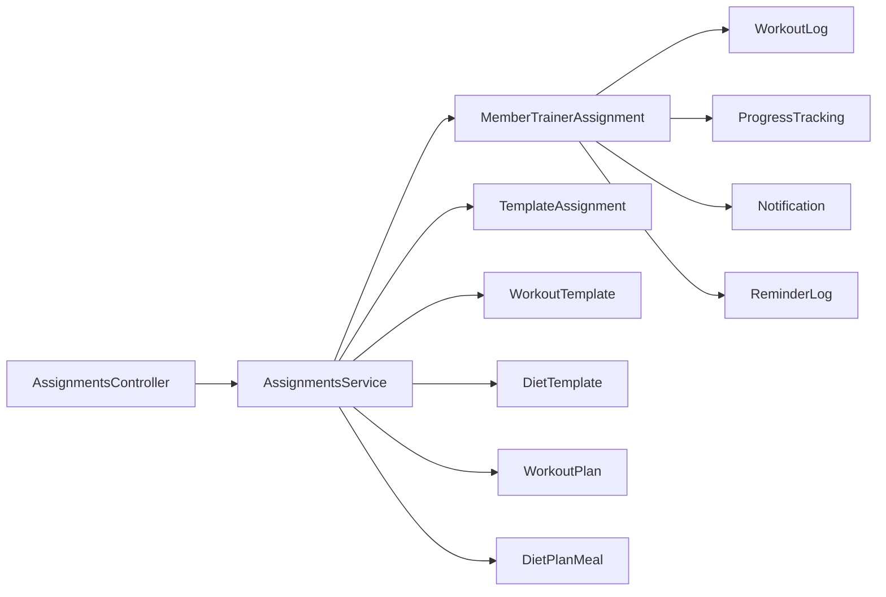

# Program Assignments

<cite>
**Referenced Files in This Document**
- [assignments.controller.ts](file://src/assignments/assignments.controller.ts)
- [assignments.service.ts](file://src/assignments/assignments.service.ts)
- [create-assignment.dto.ts](file://src/assignments/dto/create-assignment.dto.ts)
- [member_trainer_assignments.entity.ts](file://src/entities/member_trainer_assignments.entity.ts)
- [template_assignments.entity.ts](file://src/entities/template_assignments.entity.ts)
- [workout_templates.entity.ts](file://src/entities/workout_templates.entity.ts)
- [diet_templates.entity.ts](file://src/entities/diet_templates.entity.ts)
- [workout_template_exercises.entity.ts](file://src/entities/workout_template_exercises.entity.ts)
- [workout_plans.entity.ts](file://src/entities/workout_plans.entity.ts)
- [workout_plan_exercises.entity.ts](file://src/entities/workout_plan_exercises.entity.ts)
- [diet_plan_meals.entity.ts](file://src/entities/diet_plan_meals.entity.ts)
- [workout_logs.entity.ts](file://src/entities/workout_logs.entity.ts)
- [progress_tracking.entity.ts](file://src/entities/progress_tracking.entity.ts)
- [notifications.entity.ts](file://src/entities/notifications.entity.ts)
- [reminder_logs.entity.ts](file://src/entities/reminder_logs.entity.ts)
</cite>

## Table of Contents
1. [Introduction](#introduction)
2. [Project Structure](#project-structure)
3. [Core Components](#core-components)
4. [Architecture Overview](#architecture-overview)
5. [Detailed Component Analysis](#detailed-component-analysis)
6. [Dependency Analysis](#dependency-analysis)
7. [Performance Considerations](#performance-considerations)
8. [Troubleshooting Guide](#troubleshooting-guide)
9. [Conclusion](#conclusion)
10. [Appendices](#appendices)

## Introduction
This document describes the Program Assignments subsystem responsible for assigning workout and diet templates to members via trainer-member relationships. It covers the assignment entity model, assignment lifecycle (creation, modification, deletion), template assignment and management, integration with trainer assignment systems, member progress tracking, and notification/reminder mechanisms. Practical workflows include assigning individual plans to members, bulk assigning templates during onboarding, tracking completion rates, managing overrides, scheduling, reminders, and trainer oversight reporting.

## Project Structure
The Program Assignments feature spans a dedicated module with a controller, service, DTO, and supporting entities:
- Controller exposes endpoints for creating, listing, retrieving, and deleting assignments, as well as fetching assignments per member or trainer.
- Service encapsulates business logic for assignment creation, template assignment, and retrieval.
- DTO validates assignment creation requests.
- Entities define the assignment relationship, template assignments, and related program assets.

**Diagram sources**
- [assignments.controller.ts:24-310](file://src/assignments/assignments.controller.ts#L24-L310)
- [assignments.service.ts:26-258](file://src/assignments/assignments.service.ts#L26-L258)
- [member_trainer_assignments.entity.ts:13-66](file://src/entities/member_trainer_assignments.entity.ts#L13-L66)
- [template_assignments.entity.ts:12-75](file://src/entities/template_assignments.entity.ts#L12-L75)
- [workout_templates.entity.ts:41-126](file://src/entities/workout_templates.entity.ts#L41-L126)
- [workout_plans.entity.ts:15-73](file://src/entities/workout_plans.entity.ts#L15-L73)
- [workout_template_exercises.entity.ts:23-91](file://src/entities/workout_template_exercises.entity.ts#L23-L91)
- [workout_plan_exercises.entity.ts:11-60](file://src/entities/workout_plan_exercises.entity.ts#L11-L60)
- [diet_templates.entity.ts:14-88](file://src/entities/diet_templates.entity.ts#L14-L88)
- [diet_plan_meals.entity.ts:11-71](file://src/entities/diet_plan_meals.entity.ts#L11-L71)
- [workout_logs.entity.ts:12-50](file://src/entities/workout_logs.entity.ts#L12-L50)
- [progress_tracking.entity.ts:12-73](file://src/entities/progress_tracking.entity.ts#L12-L73)
- [notifications.entity.ts:33-71](file://src/entities/notifications.entity.ts#L33-L71)
- [reminder_logs.entity.ts:20-58](file://src/entities/reminder_logs.entity.ts#L20-L58)

**Section sources**
- [assignments.controller.ts:24-310](file://src/assignments/assignments.controller.ts#L24-L310)
- [assignments.service.ts:26-258](file://src/assignments/assignments.service.ts#L26-L258)
- [create-assignment.dto.ts:10-43](file://src/assignments/dto/create-assignment.dto.ts#L10-L43)

## Core Components
- AssignmentsController: Exposes endpoints for creating assignments, listing all assignments, retrieving a single assignment by ID, deleting an assignment, and fetching assignments by member or trainer.
- AssignmentsService: Implements assignment creation, retrieval, and template assignment/update logic; coordinates with repositories for Member, Trainer, WorkoutTemplate, and DietTemplate entities.
- CreateAssignmentDto: Validates assignment creation payload including member/trainer IDs, start/end dates, and optional status.
- MemberTrainerAssignment entity: Stores the trainer-member assignment relationship with status, dates, and template assignment fields.
- TemplateAssignment entity: Represents a template assignment to a member with status, completion percent, substitutions, progress logs, and timestamps.
- WorkoutTemplate and DietTemplate entities: Define reusable program templates with metadata, usage counts, and relationships to exercises/meals.
- Related program entities: WorkoutPlan/WorkoutPlanExercise and DietPlanMeal support plan-level execution and exercise/meals composition.

**Section sources**
- [assignments.controller.ts:24-310](file://src/assignments/assignments.controller.ts#L24-L310)
- [assignments.service.ts:26-258](file://src/assignments/assignments.service.ts#L26-L258)
- [create-assignment.dto.ts:10-43](file://src/assignments/dto/create-assignment.dto.ts#L10-L43)
- [member_trainer_assignments.entity.ts:13-66](file://src/entities/member_trainer_assignments.entity.ts#L13-L66)
- [template_assignments.entity.ts:12-75](file://src/entities/template_assignments.entity.ts#L12-L75)
- [workout_templates.entity.ts:41-126](file://src/entities/workout_templates.entity.ts#L41-L126)
- [diet_templates.entity.ts:14-88](file://src/entities/diet_templates.entity.ts#L14-L88)

## Architecture Overview
The assignment system integrates trainer-member relationships with template assignment and execution. The controller delegates to the service, which persists assignments and manages template associations. Progress tracking and notifications complement the assignment lifecycle.

**Diagram sources**
- [assignments.controller.ts:28-102](file://src/assignments/assignments.controller.ts#L28-L102)
- [assignments.service.ts:41-74](file://src/assignments/assignments.service.ts#L41-L74)
- [member_trainer_assignments.entity.ts:13-66](file://src/entities/member_trainer_assignments.entity.ts#L13-L66)

**Section sources**
- [assignments.controller.ts:24-310](file://src/assignments/assignments.controller.ts#L24-L310)
- [assignments.service.ts:26-258](file://src/assignments/assignments.service.ts#L26-L258)

## Detailed Component Analysis

### Assignment Entity Model
The assignment model centers on MemberTrainerAssignment and TemplateAssignment, with supporting program entities.

Key fields and behaviors:
- MemberTrainerAssignment: UUID primary key, member and trainer foreign keys, start/end dates, status, and template assignment fields (workout/diet template IDs, start/end dates, flags for auto-apply and substitutions).
- TemplateAssignment: UUID primary key, links to template (workout/diet), memberId, optional trainer_assignmentId, start/end dates, status, completion_percent, member_substitutions, progress_log, last_activity_at, timestamps.

**Diagram sources**
- [member_trainer_assignments.entity.ts:13-66](file://src/entities/member_trainer_assignments.entity.ts#L13-L66)
- [template_assignments.entity.ts:12-75](file://src/entities/template_assignments.entity.ts#L12-L75)
- [workout_templates.entity.ts:41-126](file://src/entities/workout_templates.entity.ts#L41-L126)
- [diet_templates.entity.ts:14-88](file://src/entities/diet_templates.entity.ts#L14-L88)
- [workout_plans.entity.ts:15-73](file://src/entities/workout_plans.entity.ts#L15-L73)
- [workout_plan_exercises.entity.ts:11-60](file://src/entities/workout_plan_exercises.entity.ts#L11-L60)
- [diet_plan_meals.entity.ts:11-71](file://src/entities/diet_plan_meals.entity.ts#L11-L71)

**Section sources**
- [member_trainer_assignments.entity.ts:13-66](file://src/entities/member_trainer_assignments.entity.ts#L13-L66)
- [template_assignments.entity.ts:12-75](file://src/entities/template_assignments.entity.ts#L12-L75)

### Assignment Creation Workflow
- Validation: CreateAssignmentDto ensures memberId, trainerId, and startDate are present; endDate and status are optional.
- Lookup: Service verifies member and trainer existence.
- Persistence: Creates MemberTrainerAssignment with provided dates and default status set to active if not provided.
- Response: Returns the persisted assignment.

**Diagram sources**
- [create-assignment.dto.ts:10-43](file://src/assignments/dto/create-assignment.dto.ts#L10-L43)
- [assignments.service.ts:41-74](file://src/assignments/assignments.service.ts#L41-L74)

**Section sources**
- [create-assignment.dto.ts:10-43](file://src/assignments/dto/create-assignment.dto.ts#L10-L43)
- [assignments.service.ts:41-74](file://src/assignments/assignments.service.ts#L41-L74)

### Template Assignment and Management
- Assign templates: Service updates MemberTrainerAssignment with assigned workout/diet template IDs and optional start/end dates; increments template usage counts.
- Retrieve assigned templates: Service fetches template details and assignment-specific dates/settings.
- Remove template: Clears template assignment fields for workout or diet.
- Update template settings: Toggles auto_apply_templates and allow_member_substitutions flags.

**Diagram sources**
- [assignments.controller.ts:28-102](file://src/assignments/assignments.controller.ts#L28-L102)
- [assignments.service.ts:128-190](file://src/assignments/assignments.service.ts#L128-L190)
- [workout_templates.entity.ts:41-126](file://src/entities/workout_templates.entity.ts#L41-L126)
- [diet_templates.entity.ts:14-88](file://src/entities/diet_templates.entity.ts#L14-L88)

**Section sources**
- [assignments.service.ts:126-256](file://src/assignments/assignments.service.ts#L126-L256)

### Bulk Assignment Operations
Bulk assignment is supported conceptually through repeated calls to assign templates to multiple assignments. The service method supports updating both workout and diet template assignments simultaneously, enabling onboarding scenarios where multiple members receive identical templates with shared start/end dates and settings.

Practical steps:
- Iterate over target member IDs within a trainer assignment context.
- Call assignTemplates with shared template IDs and dates.
- Optionally toggle auto_apply_templates and allow_member_substitutions for consistency.

**Section sources**
- [assignments.service.ts:128-190](file://src/assignments/assignments.service.ts#L128-L190)

### Assignment Modification Procedures
- Update template settings: Toggle auto_apply_templates and allow_member_substitutions.
- Remove template: Clear either workout or diet template fields.
- Update dates: Modify start/end dates for templates within the assignment.

**Section sources**
- [assignments.service.ts:242-256](file://src/assignments/assignments.service.ts#L242-L256)

### Trainer-Member Assignment Coordination
- Endpoint groups:
  - GET /assignments for system-wide listing.
  - GET /members/:memberId/assignments for member-viewable assignments.
  - GET /trainers/:trainerId/members for trainer-viewable assignments.
- Access control relies on JWT authentication and role-based guards enforced by the controller.

**Section sources**
- [assignments.controller.ts:104-310](file://src/assignments/assignments.controller.ts#L104-L310)

### Program Distribution Mechanisms
- Template-based distribution: Assignments link to workout and/or diet templates; template usage counts are incremented upon assignment.
- Auto-apply and substitutions: Flags control whether templates are automatically applied and whether members can substitute items.
- Execution tracking: TemplateAssignment tracks status, completion percent, substitutions, and progress logs.

**Section sources**
- [assignments.service.ts:128-190](file://src/assignments/assignments.service.ts#L128-L190)
- [template_assignments.entity.ts:12-75](file://src/entities/template_assignments.entity.ts#L12-L75)

### Assignment Status Tracking, Due Dates, and Completion Monitoring
- Assignment status: MemberTrainerAssignment supports active/ended; TemplateAssignment supports active/completed/cancelled/paused with completion_percent.
- Due date management: start_date and end_date are maintained at assignment and template levels.
- Completion monitoring: completion_percent and progress_log capture activity; member_substitutions track overrides.

**Section sources**
- [member_trainer_assignments.entity.ts:32-33](file://src/entities/member_trainer_assignments.entity.ts#L32-L33)
- [template_assignments.entity.ts:43-46](file://src/entities/template_assignments.entity.ts#L43-L46)
- [template_assignments.entity.ts:49-64](file://src/entities/template_assignments.entity.ts#L49-L64)

### Integration with Trainer Assignment Systems
- Controller routes expose endpoints for trainer and member assignment queries.
- Service methods findByMember and findByTrainer return assignment collections with relations populated.

**Section sources**
- [assignments.controller.ts:219-310](file://src/assignments/assignments.controller.ts#L219-L310)
- [assignments.service.ts:93-119](file://src/assignments/assignments.service.ts#L93-L119)

### Member Progress Tracking and Notifications
- Progress tracking: ProgressTracking captures measurements and notes linked to members and optionally trainers.
- Workouts: WorkoutLogs record exercise sessions with sets/reps/weight/duration/date.
- Notifications: Notification entity supports various types including chart/diet/template/system/reminder categories with metadata.

**Section sources**
- [progress_tracking.entity.ts:12-73](file://src/entities/progress_tracking.entity.ts#L12-L73)
- [workout_logs.entity.ts:12-50](file://src/entities/workout_logs.entity.ts#L12-L50)
- [notifications.entity.ts:33-71](file://src/entities/notifications.entity.ts#L33-L71)

### Reminder Systems
- ReminderLog entity stores reminder events with types (subscription expiry, due payment, renewal invoice, renewal activated) and channels (email, in-app), including reference dates and metadata.

**Section sources**
- [reminder_logs.entity.ts:20-58](file://src/entities/reminder_logs.entity.ts#L20-L58)

### Practical Examples

#### Assign Individual Plans to Members
- Steps:
  - Create a trainer-member assignment via POST /assignments with memberId, trainerId, startDate, optional endDate/status.
  - Assign workout/diet templates via PUT /assignments/{id}/templates with template IDs and optional start/end dates.
  - Toggle auto_apply_templates and allow_member_substitutions as needed.

**Section sources**
- [assignments.controller.ts:28-102](file://src/assignments/assignments.controller.ts#L28-L102)
- [assignments.service.ts:128-190](file://src/assignments/assignments.service.ts#L128-L190)

#### Bulk Assign Templates During Onboarding
- Steps:
  - Iterate over new members within a trainer’s assignments.
  - For each, call assignTemplates with shared template IDs and onboarding dates.
  - Set auto_apply_templates to true for standardized delivery.

**Section sources**
- [assignments.service.ts:128-190](file://src/assignments/assignments.service.ts#L128-L190)

#### Track Assignment Completion Rates
- Steps:
  - Monitor TemplateAssignment completion_percent and progress_log entries.
  - Aggregate completion_percent across members for team or branch reporting.

**Section sources**
- [template_assignments.entity.ts:49-64](file://src/entities/template_assignments.entity.ts#L49-L64)

#### Manage Assignment Overrides
- Steps:
  - Allow member substitutions by setting allow_member_substitutions to true.
  - Record substitutions in member_substitutions array with details and timestamps.

**Section sources**
- [assignments.service.ts:166-171](file://src/assignments/assignments.service.ts#L166-L171)
- [template_assignments.entity.ts:52-57](file://src/entities/template_assignments.entity.ts#L52-L57)

#### Assignment Scheduling and Reminders
- Steps:
  - Set start_date and end_date on assignments and templates.
  - Use ReminderLog to schedule reminders around due dates and expirations.
  - Notify via Notification entity for chart/diet/template/system/reminder events.

**Section sources**
- [member_trainer_assignments.entity.ts:42-52](file://src/entities/member_trainer_assignments.entity.ts#L42-L52)
- [template_assignments.entity.ts:35-39](file://src/entities/template_assignments.entity.ts#L35-L39)
- [reminder_logs.entity.ts:20-58](file://src/entities/reminder_logs.entity.ts#L20-L58)
- [notifications.entity.ts:33-71](file://src/entities/notifications.entity.ts#L33-L71)

#### Reporting Capabilities for Trainer Oversight
- Steps:
  - Use GET /trainers/:trainerId/members to retrieve all assignments under a trainer.
  - Combine with TemplateAssignment data to compute completion rates and highlight overdue items.
  - Surface notifications and reminders for timely follow-ups.

**Section sources**
- [assignments.controller.ts:265-309](file://src/assignments/assignments.controller.ts#L265-L309)
- [assignments.service.ts:107-119](file://src/assignments/assignments.service.ts#L107-L119)

## Dependency Analysis
The assignments module depends on:
- Member and Trainer entities for identity and relationships.
- Template entities for workout and diet programs.
- Program entities for plan-level execution and exercise/meals composition.
- Logging and tracking entities for progress and notifications.

**Diagram sources**
- [assignments.controller.ts:24-310](file://src/assignments/assignments.controller.ts#L24-L310)
- [assignments.service.ts:26-258](file://src/assignments/assignments.service.ts#L26-L258)
- [member_trainer_assignments.entity.ts:13-66](file://src/entities/member_trainer_assignments.entity.ts#L13-L66)
- [template_assignments.entity.ts:12-75](file://src/entities/template_assignments.entity.ts#L12-L75)
- [workout_templates.entity.ts:41-126](file://src/entities/workout_templates.entity.ts#L41-L126)
- [diet_templates.entity.ts:14-88](file://src/entities/diet_templates.entity.ts#L14-L88)
- [workout_plans.entity.ts:15-73](file://src/entities/workout_plans.entity.ts#L15-L73)
- [diet_plan_meals.entity.ts:11-71](file://src/entities/diet_plan_meals.entity.ts#L11-L71)
- [workout_logs.entity.ts:12-50](file://src/entities/workout_logs.entity.ts#L12-L50)
- [progress_tracking.entity.ts:12-73](file://src/entities/progress_tracking.entity.ts#L12-L73)
- [notifications.entity.ts:33-71](file://src/entities/notifications.entity.ts#L33-L71)
- [reminder_logs.entity.ts:20-58](file://src/entities/reminder_logs.entity.ts#L20-L58)

**Section sources**
- [assignments.controller.ts:24-310](file://src/assignments/assignments.controller.ts#L24-L310)
- [assignments.service.ts:26-258](file://src/assignments/assignments.service.ts#L26-L258)

## Performance Considerations
- Use relation loading judiciously in finder methods to minimize N+1 queries.
- Batch template assignment operations to reduce repository round trips.
- Index assignment_id, member_id, trainer_id, and template_id fields for efficient lookups.
- Monitor template usage_count increments for hotspots and consider periodic aggregation.

## Troubleshooting Guide
Common issues and resolutions:
- 404 Not Found: Member or trainer not found during assignment creation; verify IDs and activation status.
- 409 Conflict: Attempting to delete an assignment with active sessions or payment records; cancel or resolve dependencies first.
- Validation errors: Ensure DTO fields meet constraints (integers, dates, enums).
- Template not found: Verify template IDs exist and are active before assignment.

**Section sources**
- [assignments.controller.ts:40-67](file://src/assignments/assignments.controller.ts#L40-L67)
- [assignments.controller.ts:187-213](file://src/assignments/assignments.controller.ts#L187-L213)
- [create-assignment.dto.ts:10-43](file://src/assignments/dto/create-assignment.dto.ts#L10-L43)
- [assignments.service.ts:131-138](file://src/assignments/assignments.service.ts#L131-L138)

## Conclusion
The Program Assignments subsystem provides a robust foundation for trainer-member assignment coordination and template-based program distribution. It supports flexible assignment lifecycles, template management, progress tracking, and integration with notifications and reminders. The documented workflows enable efficient onboarding, completion monitoring, and trainer oversight.

## Appendices
- Example endpoints:
  - POST /assignments
  - GET /assignments
  - GET /assignments/:id
  - DELETE /assignments/:id
  - GET /members/:memberId/assignments
  - GET /trainers/:trainerId/members
  - PUT /assignments/:id/templates
  - GET /assignments/:id/templates
  - DELETE /assignments/:id/templates

**Section sources**
- [assignments.controller.ts:24-310](file://src/assignments/assignments.controller.ts#L24-L310)
- [assignments.service.ts:126-256](file://src/assignments/assignments.service.ts#L126-L256)