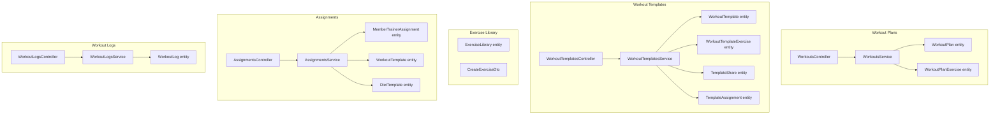
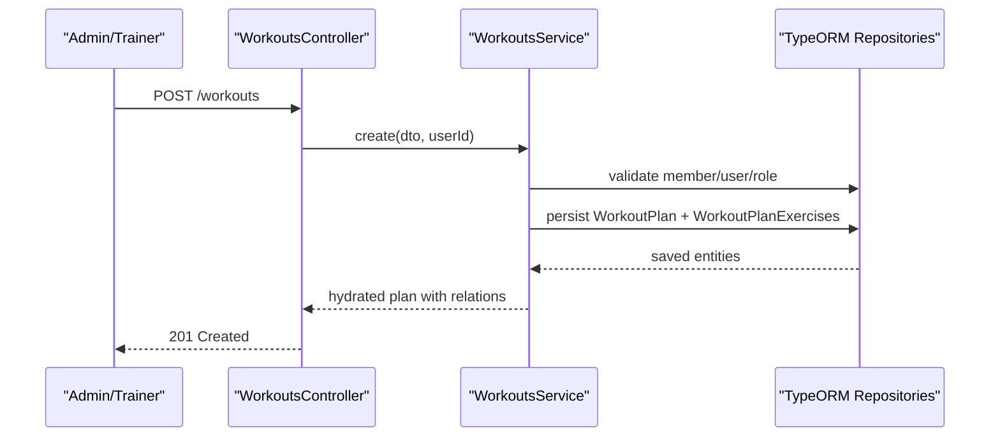
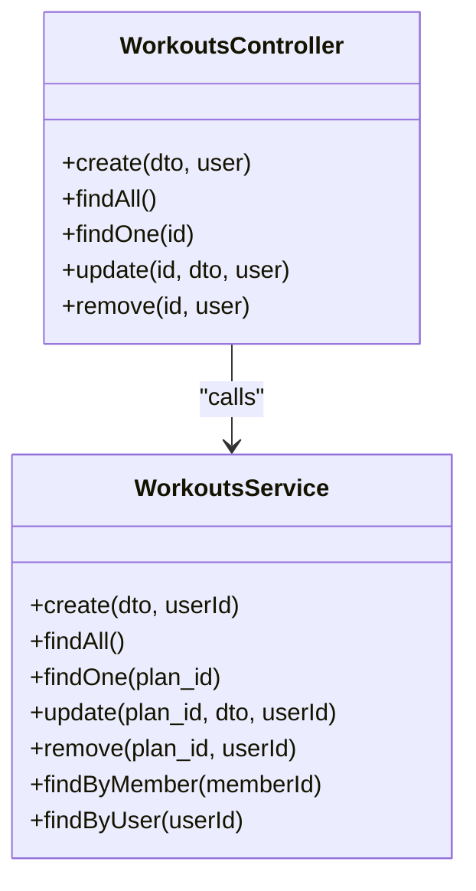
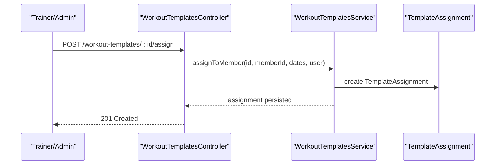
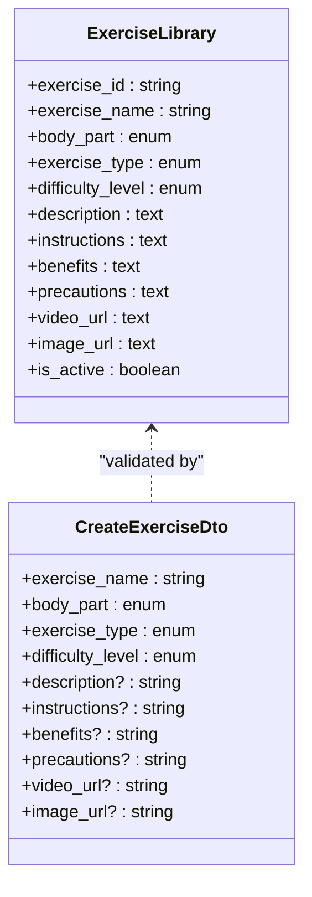
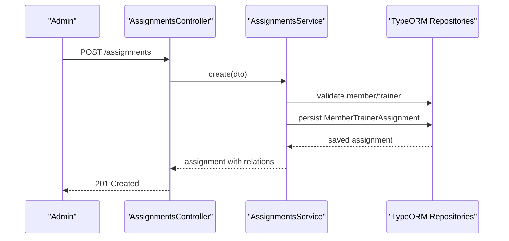
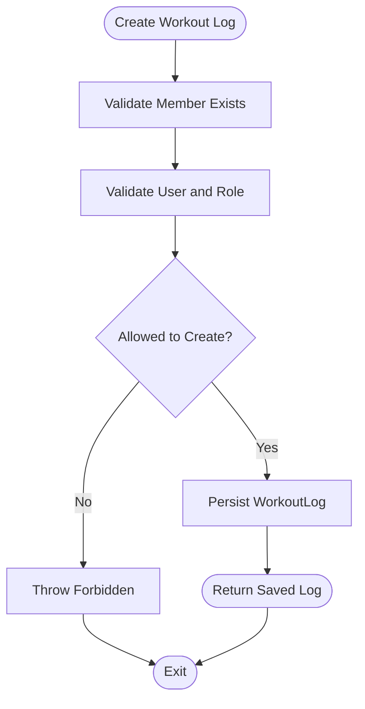
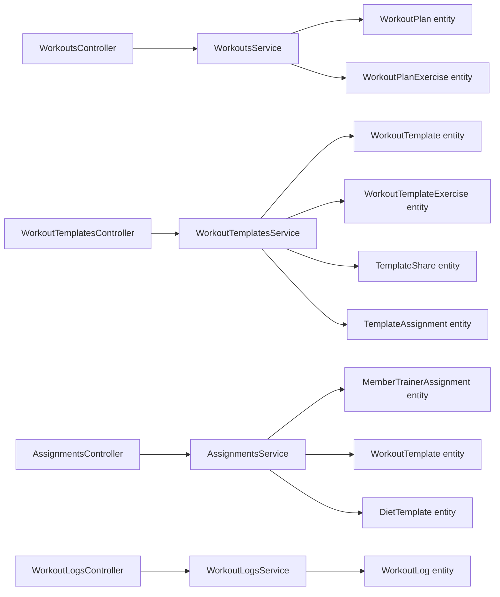

# Training Programs

<cite>
**Referenced Files in This Document**
- [workouts.controller.ts](file://src/workouts/workouts.controller.ts)
- [workouts.service.ts](file://src/workouts/workouts.service.ts)
- [workouts.module.ts](file://src/workouts/workouts.module.ts)
- [create-workout-plan.dto.ts](file://src/workouts/dto/create-workout-plan.dto.ts)
- [update-workout-plan.dto.ts](file://src/workouts/dto/update-workout-plan.dto.ts)
- [workout-templates.controller.ts](file://src/workouts/workout-templates.controller.ts)
- [workout-templates.service.ts](file://src/workouts/workout-templates.service.ts)
- [workout-templates.module.ts](file://src/workouts/workout-templates.module.ts)
- [create-exercise.dto.ts](file://src/exercise-library/dto/create-exercise.dto.ts)
- [exercise-library.entity.ts](file://src/entities/exercise-library.entity.ts)
- [assignments.controller.ts](file://src/assignments/assignments.controller.ts)
- [assignments.service.ts](file://src/assignments/assignments.service.ts)
- [workout-logs.controller.ts](file://src/workout-logs/workout-logs.controller.ts)
- [workout-logs.service.ts](file://src/workout-logs/workout-logs.service.ts)
- [workout_logs.entity.ts](file://src/entities/workout_logs.entity.ts)
</cite>

## Table of Contents
1. [Introduction](#introduction)
2. [Project Structure](#project-structure)
3. [Core Components](#core-components)
4. [Architecture Overview](#architecture-overview)
5. [Detailed Component Analysis](#detailed-component-analysis)
6. [Dependency Analysis](#dependency-analysis)
7. [Performance Considerations](#performance-considerations)
8. [Troubleshooting Guide](#troubleshooting-guide)
9. [Conclusion](#conclusion)
10. [Appendices](#appendices)

## Introduction
This document explains the Training Programs module that powers workout plan creation, exercise library management, and program assignment systems. It covers:
- How trainers and admins design and manage workout plans and templates
- How the exercise library supports reusable exercise definitions
- How assignments connect trainers to members and distribute programs
- How workout logs track completion and progress
- Practical workflows for creating custom plans, using templates, assigning programs, and monitoring completion rates

## Project Structure
The Training Programs module is organized around four primary subsystems:
- Workout Plans: CRUD APIs and services for creating and managing workout plans
- Workout Templates: Reusable program blueprints with sharing and assignment workflows
- Exercise Library: Centralized exercise definitions with metadata and media
- Assignments: Trainer-member relationships and template distribution
- Workout Logs: Session tracking and progress monitoring

**Diagram sources**
- [workouts.controller.ts:31-460](file://src/workouts/workouts.controller.ts#L31-L460)
- [workouts.service.ts:17-125](file://src/workouts/workouts.service.ts#L17-L125)
- [workout-templates.controller.ts:43-525](file://src/workouts/workout-templates.controller.ts#L43-L525)
- [workout-templates.service.ts:24-67](file://src/workouts/workout-templates.service.ts#L24-L67)
- [exercise-library.entity.ts:10-58](file://src/entities/exercise-library.entity.ts#L10-L58)
- [assignments.controller.ts:25-310](file://src/assignments/assignments.controller.ts#L25-L310)
- [assignments.service.ts:27-190](file://src/assignments/assignments.service.ts#L27-L190)
- [workout-logs.controller.ts:31-800](file://src/workout-logs/workout-logs.controller.ts#L31-L800)
- [workout-logs.service.ts:16-104](file://src/workout-logs/workout-logs.service.ts#L16-L104)

**Section sources**
- [workouts.controller.ts:31-460](file://src/workouts/workouts.controller.ts#L31-L460)
- [workouts.service.ts:17-125](file://src/workouts/workouts.service.ts#L17-L125)
- [workout-templates.controller.ts:43-525](file://src/workouts/workout-templates.controller.ts#L43-L525)
- [workout-templates.service.ts:24-67](file://src/workouts/workout-templates.service.ts#L24-L67)
- [exercise-library.entity.ts:10-58](file://src/entities/exercise-library.entity.ts#L10-L58)
- [assignments.controller.ts:25-310](file://src/assignments/assignments.controller.ts#L25-L310)
- [assignments.service.ts:27-190](file://src/assignments/assignments.service.ts#L27-L190)
- [workout-logs.controller.ts:31-800](file://src/workout-logs/workout-logs.controller.ts#L31-L800)
- [workout-logs.service.ts:16-104](file://src/workout-logs/workout-logs.service.ts#L16-L104)

## Core Components
- Workout Plans: Create, update, and retrieve detailed workout plans with exercises, schedule, and progress tracking metadata.
- Workout Templates: Create reusable templates, copy and share with trainers, and assign to members for scheduled distribution.
- Exercise Library: Define exercises with body parts, types, difficulty, descriptions, and media assets.
- Assignments: Establish trainer-member relationships and assign templates with start/end dates and settings.
- Workout Logs: Record session data, performance metrics, feedback, and notes for progress monitoring.

**Section sources**
- [workouts.controller.ts:34-460](file://src/workouts/workouts.controller.ts#L34-L460)
- [workout-templates.controller.ts:46-525](file://src/workouts/workout-templates.controller.ts#L46-L525)
- [create-exercise.dto.ts:4-63](file://src/exercise-library/dto/create-exercise.dto.ts#L4-L63)
- [assignments.controller.ts:28-310](file://src/assignments/assignments.controller.ts#L28-L310)
- [workout-logs.controller.ts:34-800](file://src/workout-logs/workout-logs.controller.ts#L34-L800)

## Architecture Overview
The module follows a layered NestJS architecture:
- Controllers handle HTTP requests and Swagger documentation
- Services encapsulate business logic and enforce permissions
- Entities define persistence models
- DTOs validate and shape request/response payloads

**Diagram sources**
- [workouts.controller.ts:34-460](file://src/workouts/workouts.controller.ts#L34-L460)
- [workouts.service.ts:31-125](file://src/workouts/workouts.service.ts#L31-L125)

## Detailed Component Analysis

### Workout Plans: Creation, Validation, and Permissions
- Endpoint: POST /workouts creates a plan with exercises and metadata
- Validation: Uses CreateWorkoutPlanDto to ensure required fields and enums
- Permissions: Only ADMIN or TRAINER can create; TRAINER must match assigned plan
- Persistence: Saves plan and exercises; relations loaded on retrieval

**Diagram sources**
- [workouts.controller.ts:31-460](file://src/workouts/workouts.controller.ts#L31-L460)
- [workouts.service.ts:17-281](file://src/workouts/workouts.service.ts#L17-L281)

**Section sources**
- [workouts.controller.ts:34-460](file://src/workouts/workouts.controller.ts#L34-L460)
- [workouts.service.ts:31-125](file://src/workouts/workouts.service.ts#L31-L125)
- [create-workout-plan.dto.ts:77-145](file://src/workouts/dto/create-workout-plan.dto.ts#L77-L145)

### Workout Templates: Sharing, Assignment, and Rating
- Endpoint: POST /workout-templates creates templates with exercises
- Sharing: Admin can share templates to specific trainers
- Assignment: Assign templates to members with start/end dates
- Rating: Users can rate templates to build community insights

**Diagram sources**
- [workout-templates.controller.ts:379-441](file://src/workouts/workout-templates.controller.ts#L379-L441)
- [workout-templates.service.ts:305-331](file://src/workouts/workout-templates.service.ts#L305-L331)

**Section sources**
- [workout-templates.controller.ts:46-525](file://src/workouts/workout-templates.controller.ts#L46-L525)
- [workout-templates.service.ts:36-331](file://src/workouts/workout-templates.service.ts#L36-L331)

### Exercise Library: Definitions and Metadata
- Entity: ExerciseLibrary stores exercise metadata and media URLs
- DTO: CreateExerciseDto validates exercise attributes and optional media
- Usage: Templates and plans reference exercises; library enables reuse and consistency

**Diagram sources**
- [exercise-library.entity.ts:10-58](file://src/entities/exercise-library.entity.ts#L10-L58)
- [create-exercise.dto.ts:4-63](file://src/exercise-library/dto/create-exercise.dto.ts#L4-L63)

**Section sources**
- [exercise-library.entity.ts:10-58](file://src/entities/exercise-library.entity.ts#L10-L58)
- [create-exercise.dto.ts:4-63](file://src/exercise-library/dto/create-exercise.dto.ts#L4-L63)

### Assignments: Trainer-Member Relationships and Template Distribution
- Endpoint: POST /assignments creates trainer-member assignments
- Template assignment: AssignmentsService supports assigning workout/diet templates with dates and settings
- Access control: Only admins/branch managers can create assignments; retrieval respects user roles

**Diagram sources**
- [assignments.controller.ts:28-102](file://src/assignments/assignments.controller.ts#L28-L102)
- [assignments.service.ts:41-74](file://src/assignments/assignments.service.ts#L41-L74)

**Section sources**
- [assignments.controller.ts:28-310](file://src/assignments/assignments.controller.ts#L28-L310)
- [assignments.service.ts:41-190](file://src/assignments/assignments.service.ts#L41-L190)

### Workout Logs: Tracking Completion and Progress
- Endpoint: POST /workout-logs records session data and performance metrics
- Permissions: ADMIN/TRAINER can create/update/delete; MEMBERS can manage their own logs if allowed
- Analytics: Logs support filtering and aggregation for insights

**Diagram sources**
- [workout-logs.controller.ts:34-291](file://src/workout-logs/workout-logs.controller.ts#L34-L291)
- [workout-logs.service.ts:28-104](file://src/workout-logs/workout-logs.service.ts#L28-L104)

**Section sources**
- [workout-logs.controller.ts:34-800](file://src/workout-logs/workout-logs.controller.ts#L34-L800)
- [workout-logs.service.ts:28-104](file://src/workout-logs/workout-logs.service.ts#L28-L104)
- [workout_logs.entity.ts:12-49](file://src/entities/workout_logs.entity.ts#L12-L49)

## Dependency Analysis
- Controllers depend on Services for business logic
- Services depend on repositories for persistence
- Entities define relationships and constraints
- DTOs validate inputs and outputs
- Modules register controllers, providers, and TypeORM feature modules

**Diagram sources**
- [workouts.controller.ts:31-460](file://src/workouts/workouts.controller.ts#L31-L460)
- [workouts.service.ts:17-125](file://src/workouts/workouts.service.ts#L17-L125)
- [workout-templates.controller.ts:43-525](file://src/workouts/workout-templates.controller.ts#L43-L525)
- [workout-templates.service.ts:24-67](file://src/workouts/workout-templates.service.ts#L24-L67)
- [assignments.controller.ts:25-310](file://src/assignments/assignments.controller.ts#L25-L310)
- [assignments.service.ts:27-190](file://src/assignments/assignments.service.ts#L27-L190)
- [workout-logs.controller.ts:31-800](file://src/workout-logs/workout-logs.controller.ts#L31-L800)
- [workout-logs.service.ts:16-104](file://src/workout-logs/workout-logs.service.ts#L16-L104)

**Section sources**
- [workouts.module.ts:11-24](file://src/workouts/workouts.module.ts#L11-L24)
- [workout-templates.module.ts:10-22](file://src/workouts/workout-templates.module.ts#L10-L22)

## Performance Considerations
- Pagination and filtering: Controllers expose pagination and filter parameters to reduce payload sizes
- Relation loading: Services load relations selectively to balance completeness and performance
- Bulk operations: Prefer batch inserts for exercises during plan/template creation
- Indexes: Ensure database indexes on frequently queried fields (memberId, trainerId, dates)

## Troubleshooting Guide
Common issues and resolutions:
- Permission errors: Ensure user role is ADMIN or TRAINER; trainers can only manage their assigned plans/logs
- Not found errors: Verify member/trainer/template IDs exist before operations
- Validation failures: Confirm DTO fields meet enum and numeric constraints
- Assignment conflicts: Check for existing assignments and capacity limits

**Section sources**
- [workouts.service.ts:50-56](file://src/workouts/workouts.service.ts#L50-L56)
- [workout-logs.service.ts:47-68](file://src/workout-logs/workout-logs.service.ts#L47-L68)
- [assignments.service.ts:41-74](file://src/assignments/assignments.service.ts#L41-L74)

## Conclusion
The Training Programs module provides a robust foundation for designing, distributing, and tracking workout programs. It integrates exercise libraries, reusable templates, trainer-member assignments, and detailed workout logging to support comprehensive fitness workflows.

## Appendices

### Practical Workflows

- Create a custom workout plan
  - Use POST /workouts with CreateWorkoutPlanDto
  - Include exercises with sets/reps/weights and schedule metadata
  - Validate permissions and member existence before creation

- Use exercise templates
  - Create a template via POST /workout-templates
  - Share with trainers using POST /workout-templates/:id/share
  - Assign to members via POST /workout-templates/:id/assign

- Assign programs to members
  - Create trainer-member assignment via POST /assignments
  - Assign templates with dates and settings via AssignmentsService methods

- Track completion and progress
  - Record sessions via POST /workout-logs
  - Retrieve logs with filters for analytics and insights

[No sources needed since this section provides general guidance]