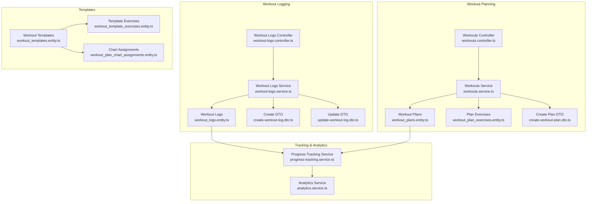
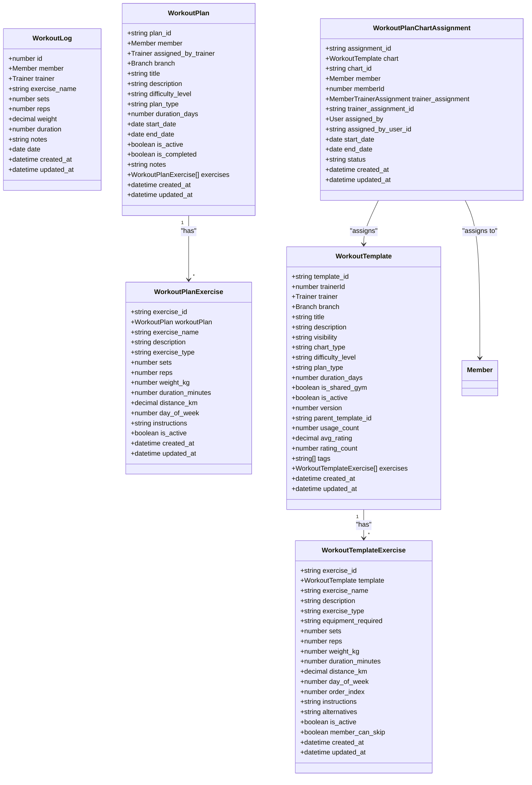
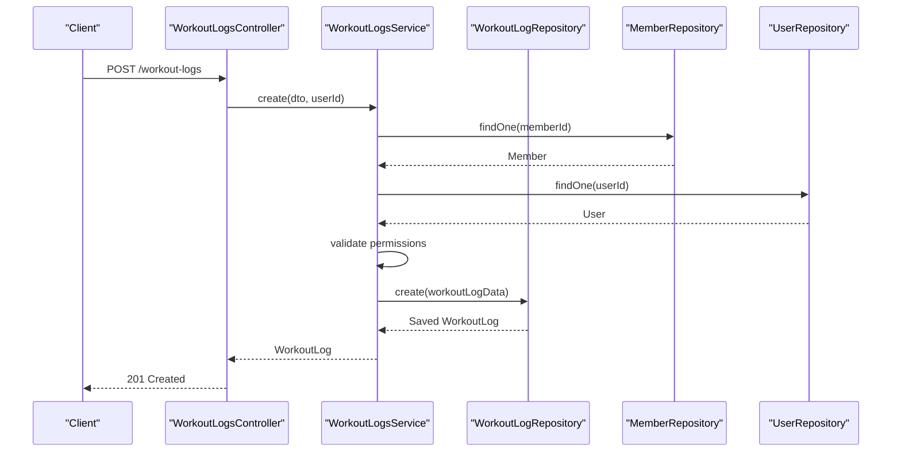
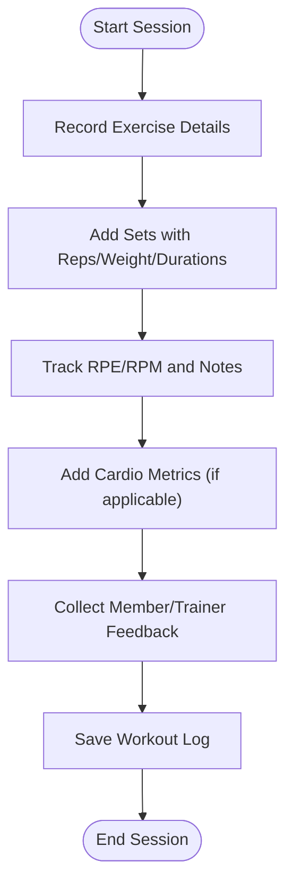
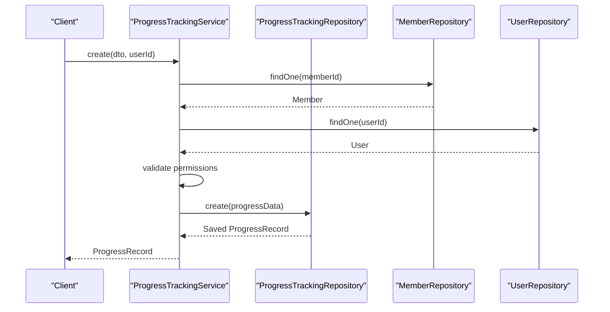
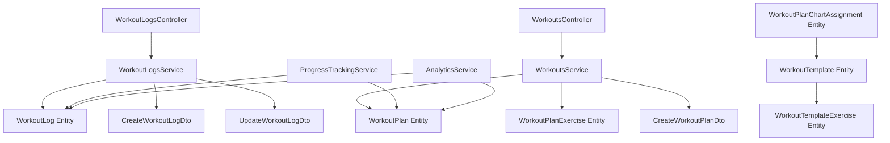

# Workout Logging & Tracking

<cite>
**Referenced Files in This Document**
- [workout_logs.entity.ts](file://src/entities/workout_logs.entity.ts)
- [workout-logs.controller.ts](file://src/workout-logs/workout-logs.controller.ts)
- [workout-logs.service.ts](file://src/workout-logs/workout-logs.service.ts)
- [create-workout-log.dto.ts](file://src/workout-logs/dto/create-workout-log.dto.ts)
- [update-workout-log.dto.ts](file://src/workout-logs/dto/update-workout-log.dto.ts)
- [workout_plans.entity.ts](file://src/entities/workout_plans.entity.ts)
- [workout_plan_exercises.entity.ts](file://src/entities/workout_plan_exercises.entity.ts)
- [workouts.controller.ts](file://src/workouts/workouts.controller.ts)
- [workouts.service.ts](file://src/workouts/workouts.service.ts)
- [create-workout-plan.dto.ts](file://src/workouts/dto/create-workout-plan.dto.ts)
- [workout_templates.entity.ts](file://src/entities/workout_templates.entity.ts)
- [workout_template_exercises.entity.ts](file://src/entities/workout_template_exercises.entity.ts)
- [workout_plan_chart_assignments.entity.ts](file://src/entities/workout_plan_chart_assignments.entity.ts)
- [progress-tracking.service.ts](file://src/progress-tracking/progress-tracking.service.ts)
- [analytics.service.ts](file://src/analytics/analytics.service.ts)
</cite>

## Table of Contents
1. [Introduction](#introduction)
2. [Project Structure](#project-structure)
3. [Core Components](#core-components)
4. [Architecture Overview](#architecture-overview)
5. [Detailed Component Analysis](#detailed-component-analysis)
6. [Dependency Analysis](#dependency-analysis)
7. [Performance Considerations](#performance-considerations)
8. [Troubleshooting Guide](#troubleshooting-guide)
9. [Conclusion](#conclusion)

## Introduction
This document describes the workout logging and tracking system, covering how workout completion is recorded, how exercise execution is tracked, and how progress is monitored. It explains the workout log entity structure, including exercise completion timestamps, set tracking, weight progression, and feedback collection. It also covers workout session recording, real-time logging capabilities, offline sync functionality, integration with wearable devices and mobile applications, and progress visualization dashboards. Practical examples demonstrate logging completed exercises, tracking set completion, recording exercise modifications, and generating workout summaries. Finally, it addresses workout consistency tracking, streak calculation, achievement systems, and integration with member progress reports.

## Project Structure
The workout logging and tracking system is organized around several core modules:
- Workout Logs: Records individual workout sessions with exercise details, sets, reps, weights, duration, and feedback.
- Workout Plans: Defines structured training programs with exercises, progression, scheduling, and tracking metrics.
- Templates: Reusable workout charts with visibility controls, difficulty levels, and equipment requirements.
- Progress Tracking: Monitors physical measurements and milestones over time.
- Analytics: Provides dashboard insights and trend analysis for gym and member performance.

**Diagram sources**
- [workout_logs.entity.ts:1-50](file://src/entities/workout_logs.entity.ts#L1-L50)
- [workout-logs.controller.ts:1-800](file://src/workout-logs/workout-logs.controller.ts#L1-L800)
- [workout-logs.service.ts:1-283](file://src/workout-logs/workout-logs.service.ts#L1-L283)
- [create-workout-log.dto.ts:1-80](file://src/workout-logs/dto/create-workout-log.dto.ts#L1-L80)
- [update-workout-log.dto.ts:1-5](file://src/workout-logs/dto/update-workout-log.dto.ts#L1-L5)
- [workout_plans.entity.ts:1-73](file://src/entities/workout_plans.entity.ts#L1-L73)
- [workout_plan_exercises.entity.ts:1-60](file://src/entities/workout_plan_exercises.entity.ts#L1-L60)
- [workouts.controller.ts:1-800](file://src/workouts/workouts.controller.ts#L1-L800)
- [workouts.service.ts:1-281](file://src/workouts/workouts.service.ts#L1-L281)
- [create-workout-plan.dto.ts:1-145](file://src/workouts/dto/create-workout-plan.dto.ts#L1-L145)
- [workout_templates.entity.ts:1-126](file://src/entities/workout_templates.entity.ts#L1-L126)
- [workout_template_exercises.entity.ts:1-91](file://src/entities/workout_template_exercises.entity.ts#L1-L91)
- [workout_plan_chart_assignments.entity.ts:1-61](file://src/entities/workout_plan_chart_assignments.entity.ts#L1-L61)
- [progress-tracking.service.ts:1-299](file://src/progress-tracking/progress-tracking.service.ts#L1-L299)
- [analytics.service.ts:1-800](file://src/analytics/analytics.service.ts#L1-L800)

**Section sources**
- [workout_logs.entity.ts:1-50](file://src/entities/workout_logs.entity.ts#L1-L50)
- [workout-logs.controller.ts:1-800](file://src/workout-logs/workout-logs.controller.ts#L1-L800)
- [workout-logs.service.ts:1-283](file://src/workout-logs/workout-logs.service.ts#L1-L283)
- [workout_plans.entity.ts:1-73](file://src/entities/workout_plans.entity.ts#L1-L73)
- [workout_plan_exercises.entity.ts:1-60](file://src/entities/workout_plan_exercises.entity.ts#L1-L60)
- [workout_templates.entity.ts:1-126](file://src/entities/workout_templates.entity.ts#L1-L126)
- [workout_template_exercises.entity.ts:1-91](file://src/entities/workout_template_exercises.entity.ts#L1-L91)
- [workout_plan_chart_assignments.entity.ts:1-61](file://src/entities/workout_plan_chart_assignments.entity.ts#L1-L61)
- [progress-tracking.service.ts:1-299](file://src/progress-tracking/progress-tracking.service.ts#L1-L299)
- [analytics.service.ts:1-800](file://src/analytics/analytics.service.ts#L1-L800)

## Core Components
This section outlines the primary components involved in workout logging and tracking.

- Workout Log Entity: Stores exercise-specific workout entries with member, trainer, exercise name, sets, reps, weight, duration, notes, and date.
- Workout Logs Controller: Exposes endpoints to create, retrieve, and update workout logs with comprehensive validation and authorization.
- Workout Logs Service: Implements business logic for workout log creation, updates, and access control, including member/trainer permissions and ownership checks.
- Workout Plan Entities: Define structured training programs with exercises, progression, scheduling, and tracking metrics.
- Workouts Controller and Service: Manage workout plan lifecycle, including creation, retrieval, updates, and access control for admins and trainers.
- Template and Assignment Entities: Support reusable workout charts, visibility controls, difficulty levels, and assignment tracking to members.
- Progress Tracking Service: Manages physical measurements and milestones over time, enabling long-term progress monitoring.
- Analytics Service: Provides dashboard analytics and trend analysis for performance insights.

**Section sources**
- [workout_logs.entity.ts:1-50](file://src/entities/workout_logs.entity.ts#L1-L50)
- [workout-logs.controller.ts:1-800](file://src/workout-logs/workout-logs.controller.ts#L1-L800)
- [workout-logs.service.ts:1-283](file://src/workout-logs/workout-logs.service.ts#L1-L283)
- [workout_plans.entity.ts:1-73](file://src/entities/workout_plans.entity.ts#L1-L73)
- [workout_plan_exercises.entity.ts:1-60](file://src/entities/workout_plan_exercises.entity.ts#L1-L60)
- [workouts.controller.ts:1-800](file://src/workouts/workouts.controller.ts#L1-L800)
- [workouts.service.ts:1-281](file://src/workouts/workouts.service.ts#L1-L281)
- [workout_templates.entity.ts:1-126](file://src/entities/workout_templates.entity.ts#L1-L126)
- [workout_template_exercises.entity.ts:1-91](file://src/entities/workout_template_exercises.entity.ts#L1-L91)
- [workout_plan_chart_assignments.entity.ts:1-61](file://src/entities/workout_plan_chart_assignments.entity.ts#L1-L61)
- [progress-tracking.service.ts:1-299](file://src/progress-tracking/progress-tracking.service.ts#L1-L299)
- [analytics.service.ts:1-800](file://src/analytics/analytics.service.ts#L1-L800)

## Architecture Overview
The system follows a layered architecture with clear separation of concerns:
- Controllers handle HTTP requests and responses, including Swagger documentation and validation.
- Services encapsulate business logic, enforce authorization, and coordinate with repositories.
- Entities define the data model and relationships for workout logs, plans, templates, and assignments.
- DTOs validate and shape request/response payloads.
- Analytics and progress tracking integrate with workout data to provide insights and long-term monitoring.

**Diagram sources**
- [workout_logs.entity.ts:1-50](file://src/entities/workout_logs.entity.ts#L1-L50)
- [workout_plans.entity.ts:1-73](file://src/entities/workout_plans.entity.ts#L1-L73)
- [workout_plan_exercises.entity.ts:1-60](file://src/entities/workout_plan_exercises.entity.ts#L1-L60)
- [workout_templates.entity.ts:1-126](file://src/entities/workout_templates.entity.ts#L1-L126)
- [workout_template_exercises.entity.ts:1-91](file://src/entities/workout_template_exercises.entity.ts#L1-L91)
- [workout_plan_chart_assignments.entity.ts:1-61](file://src/entities/workout_plan_chart_assignments.entity.ts#L1-L61)

## Detailed Component Analysis

### Workout Logging Module
The workout logging module enables recording and managing workout sessions with detailed exercise data, set tracking, and feedback.

- Entity Structure: The workout log entity captures member and trainer relationships, exercise metadata, numeric metrics (sets, reps, weight), duration, notes, and date. Timestamps track creation and updates.
- Controller Endpoints: The controller exposes endpoints to create, list, retrieve, and update workout logs with comprehensive filtering, sorting, and analytics. It documents detailed request/response schemas for strength training, cardio, and feedback data.
- Service Logic: The service enforces authorization rules, validates member existence, checks user roles (ADMIN, TRAINER, MEMBER), and manages trainer associations. It supports CRUD operations with proper ownership and permission checks.

**Diagram sources**
- [workout-logs.controller.ts:286-291](file://src/workout-logs/workout-logs.controller.ts#L286-L291)
- [workout-logs.service.ts:28-104](file://src/workout-logs/workout-logs.service.ts#L28-L104)

**Section sources**
- [workout_logs.entity.ts:1-50](file://src/entities/workout_logs.entity.ts#L1-L50)
- [workout-logs.controller.ts:1-800](file://src/workout-logs/workout-logs.controller.ts#L1-L800)
- [workout-logs.service.ts:1-283](file://src/workout-logs/workout-logs.service.ts#L1-L283)
- [create-workout-log.dto.ts:1-80](file://src/workout-logs/dto/create-workout-log.dto.ts#L1-L80)
- [update-workout-log.dto.ts:1-5](file://src/workout-logs/dto/update-workout-log.dto.ts#L1-L5)

### Exercise Execution Tracking
Exercise execution tracking involves capturing sets, reps, weights, durations, and performance metrics during a workout session.

- Set Tracking: The system supports recording multiple sets per exercise with numeric values for reps and weight, plus optional duration and rest time.
- Performance Metrics: Fields for RPE (Rate of Perceived Exertion), RPM (Reps per Minute), and notes enable detailed performance logging.
- Cardio Data: For cardio sessions, distance, pace, elevation gain, and speed metrics are supported.
- Feedback Collection: Member and trainer feedback, including energy level, enjoyment, difficulty ratings, and comments, are captured to assess subjective outcomes.

[No sources needed since this diagram shows conceptual workflow, not actual code structure]

**Section sources**
- [workout-logs.controller.ts:1-800](file://src/workout-logs/workout-logs.controller.ts#L1-L800)

### Progress Monitoring Mechanisms
Progress monitoring combines workout logs with physical measurements and milestones to provide long-term insights.

- Progress Tracking Service: Manages records including weight, height, BMI, body composition metrics, and achievements. It enforces permissions and supports CRUD operations with trainer assignments.
- Analytics Integration: The analytics service aggregates data across members, subscriptions, attendance, and payments to provide dashboard insights. While focused on broader gym metrics, it complements workout and progress data for comprehensive reporting.

**Diagram sources**
- [progress-tracking.service.ts:28-110](file://src/progress-tracking/progress-tracking.service.ts#L28-L110)

**Section sources**
- [progress-tracking.service.ts:1-299](file://src/progress-tracking/progress-tracking.service.ts#L1-L299)
- [analytics.service.ts:1-800](file://src/analytics/analytics.service.ts#L1-L800)

### Workout Session Recording and Real-Time Logging
Workout session recording encompasses capturing exercise details, sets, performance metrics, and feedback in real-time.

- Real-Time Logging: The controller endpoints support immediate creation and retrieval of workout logs, enabling real-time tracking during sessions.
- Filtering and Analytics: The controller provides extensive filtering and analytics for workout logs, including totals, averages, and performance trends.
- Exercise Modifications: The system accommodates exercise modifications through notes and alternative suggestions, supporting personalized adjustments.

**Section sources**
- [workout-logs.controller.ts:293-502](file://src/workout-logs/workout-logs.controller.ts#L293-L502)

### Offline Sync Functionality
Offline sync capability ensures workout data can be recorded when connectivity is unavailable and synchronized later.

- Data Persistence: Workout logs are persisted to the database upon submission, enabling offline scenarios where data is stored locally and synced when online.
- Synchronization Strategy: While the current implementation focuses on immediate persistence, offline sync can be integrated by storing local entries and batching submissions when network availability is restored.

**Section sources**
- [workout-logs.service.ts:101-104](file://src/workout-logs/workout-logs.service.ts#L101-L104)

### Integration with Wearable Devices, Mobile Apps, and Dashboards
Integration points enable seamless data exchange and visualization.

- Wearables and Mobile Apps: APIs support ingestion of structured workout data, including exercise names, sets, reps, weights, durations, and feedback, suitable for integration with third-party devices and apps.
- Progress Visualization: The analytics service provides dashboard insights, complementing workout logs and progress tracking for visualizing trends and performance metrics.

**Section sources**
- [workout-logs.controller.ts:1-800](file://src/workout-logs/workout-logs.controller.ts#L1-L800)
- [analytics.service.ts:1-800](file://src/analytics/analytics.service.ts#L1-L800)

### Practical Examples

#### Logging a Completed Exercise
- Steps: Submit a workout log with member ID, exercise name, sets, reps, weight, duration, notes, and date. The service validates permissions and persists the record.
- Validation: DTOs ensure required fields are present and properly typed.

**Section sources**
- [create-workout-log.dto.ts:1-80](file://src/workout-logs/dto/create-workout-log.dto.ts#L1-L80)
- [workout-logs.service.ts:28-104](file://src/workout-logs/workout-logs.service.ts#L28-L104)

#### Tracking Set Completion
- Steps: For each exercise, record multiple sets with reps and weight. Optional fields like duration and rest time enhance tracking.
- Metrics: Capture RPE and RPM to quantify effort and intensity.

**Section sources**
- [workout-logs.controller.ts:1-800](file://src/workout-logs/workout-logs.controller.ts#L1-L800)

#### Recording Exercise Modifications
- Steps: Use notes and alternative suggestions to document modifications made during the session. This supports personalized adjustments and progress tracking.

**Section sources**
- [workout_template_exercises.entity.ts:70-77](file://src/entities/workout_template_exercises.entity.ts#L70-L77)

#### Generating Workout Summaries
- Steps: Utilize controller endpoints to retrieve filtered and sorted workout logs with analytics. Summaries include totals, averages, and performance trends.

**Section sources**
- [workout-logs.controller.ts:293-502](file://src/workout-logs/workout-logs.controller.ts#L293-L502)

### Workout Consistency Tracking, Streak Calculation, and Achievements
Consistency tracking and achievements are supported through progress records and analytics.

- Streak Count: The progress tracking service includes fields for streak count and last update date, enabling streak calculations.
- Achievements: Progress records capture achievements, allowing integration with workout milestones and consistency badges.
- Estimated Completion Dates: The service provides estimated completion dates for goals, aiding long-term planning.

**Section sources**
- [progress-tracking.service.ts:386-395](file://src/progress-tracking/progress-tracking.service.ts#L386-L395)

### Integration with Member Progress Reports
Member progress reports integrate workout logs, progress tracking, and analytics for comprehensive reporting.

- Data Aggregation: Analytics service consolidates member data, subscriptions, attendance, and payments to inform progress reports.
- Reporting: Progress tracking records provide baseline metrics for report generation, while workout logs contribute performance trends.

**Section sources**
- [analytics.service.ts:101-647](file://src/analytics/analytics.service.ts#L101-L647)
- [progress-tracking.service.ts:1-299](file://src/progress-tracking/progress-tracking.service.ts#L1-L299)

## Dependency Analysis
The system exhibits clear module boundaries with well-defined dependencies:
- Controllers depend on Services for business logic.
- Services depend on Repositories for data access and on DTOs for validation.
- Entities define relationships between workout logs, plans, templates, and assignments.
- Analytics and progress tracking services integrate with workout data for insights.

**Diagram sources**
- [workout-logs.controller.ts:1-800](file://src/workout-logs/workout-logs.controller.ts#L1-L800)
- [workout-logs.service.ts:1-283](file://src/workout-logs/workout-logs.service.ts#L1-L283)
- [workout-logs.entity.ts:1-50](file://src/entities/workout_logs.entity.ts#L1-L50)
- [create-workout-log.dto.ts:1-80](file://src/workout-logs/dto/create-workout-log.dto.ts#L1-L80)
- [update-workout-log.dto.ts:1-5](file://src/workout-logs/dto/update-workout-log.dto.ts#L1-L5)
- [workouts.controller.ts:1-800](file://src/workouts/workouts.controller.ts#L1-L800)
- [workouts.service.ts:1-281](file://src/workouts/workouts.service.ts#L1-L281)
- [workout_plans.entity.ts:1-73](file://src/entities/workout_plans.entity.ts#L1-L73)
- [workout_plan_exercises.entity.ts:1-60](file://src/entities/workout_plan_exercises.entity.ts#L1-L60)
- [create-workout-plan.dto.ts:1-145](file://src/workouts/dto/create-workout-plan.dto.ts#L1-L145)
- [workout_templates.entity.ts:1-126](file://src/entities/workout_templates.entity.ts#L1-L126)
- [workout_template_exercises.entity.ts:1-91](file://src/entities/workout_template_exercises.entity.ts#L1-L91)
- [workout_plan_chart_assignments.entity.ts:1-61](file://src/entities/workout_plan_chart_assignments.entity.ts#L1-L61)
- [progress-tracking.service.ts:1-299](file://src/progress-tracking/progress-tracking.service.ts#L1-L299)
- [analytics.service.ts:1-800](file://src/analytics/analytics.service.ts#L1-L800)

**Section sources**
- [workout-logs.controller.ts:1-800](file://src/workout-logs/workout-logs.controller.ts#L1-L800)
- [workout-logs.service.ts:1-283](file://src/workout-logs/workout-logs.service.ts#L1-L283)
- [workouts.controller.ts:1-800](file://src/workouts/workouts.controller.ts#L1-L800)
- [workouts.service.ts:1-281](file://src/workouts/workouts.service.ts#L1-L281)
- [progress-tracking.service.ts:1-299](file://src/progress-tracking/progress-tracking.service.ts#L1-L299)
- [analytics.service.ts:1-800](file://src/analytics/analytics.service.ts#L1-L800)

## Performance Considerations
- Pagination and Filtering: The workout logs controller supports pagination and filtering to manage large datasets efficiently.
- Query Optimization: Services use relation loading and ordering to optimize data retrieval for member and trainer contexts.
- Analytics Efficiency: The analytics service employs optimized queries and parallel execution to minimize response times for dashboard metrics.

[No sources needed since this section provides general guidance]

## Troubleshooting Guide
Common issues and resolutions:
- Permission Denied: Ensure the user has appropriate roles (ADMIN, TRAINER) or is the assigned member for self-management.
- Member Not Found: Verify the member ID exists before creating workout logs or plans.
- Trainer Not Found: Confirm trainer IDs are valid when assigning or updating records.
- Ownership Validation: Members can only manage their own records if permitted; otherwise, access is restricted.

**Section sources**
- [workout-logs.service.ts:47-68](file://src/workout-logs/workout-logs.service.ts#L47-L68)
- [workouts.service.ts:50-56](file://src/workouts/workouts.service.ts#L50-L56)
- [progress-tracking.service.ts:47-68](file://src/progress-tracking/progress-tracking.service.ts#L47-L68)

## Conclusion
The workout logging and tracking system provides a robust foundation for recording, analyzing, and visualizing workout sessions. It supports detailed exercise execution tracking, progress monitoring, and integration with wearable devices and mobile applications. Through structured workout logs, workout plans, templates, and assignments, the system enables comprehensive progress reporting and insights via analytics. The modular architecture ensures maintainability and scalability, while strict authorization and validation safeguards data integrity.