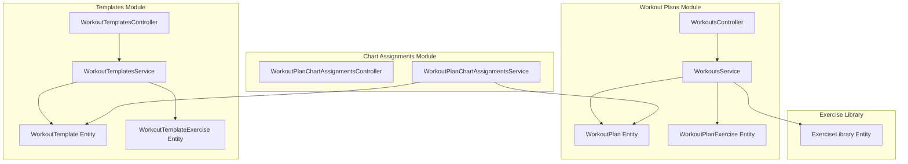
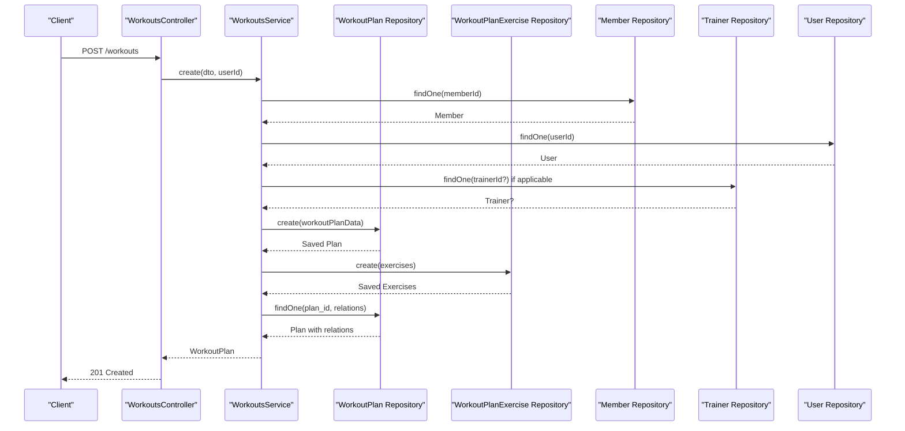
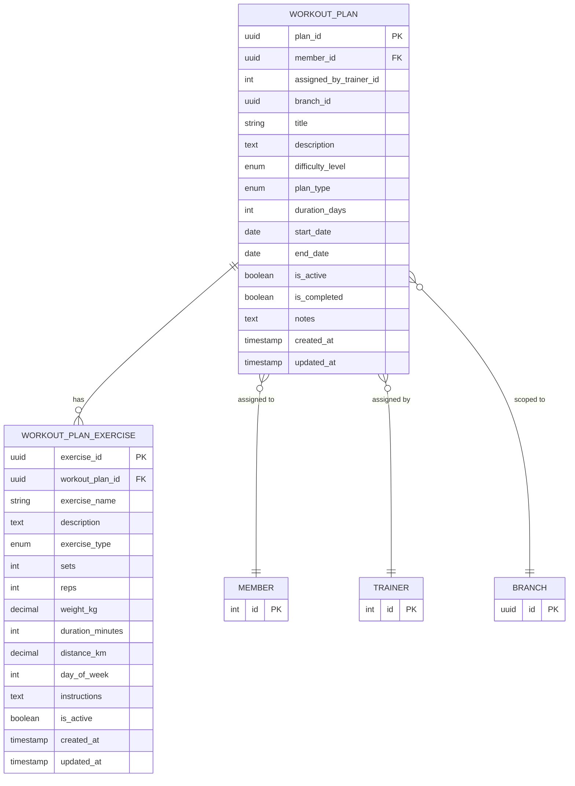
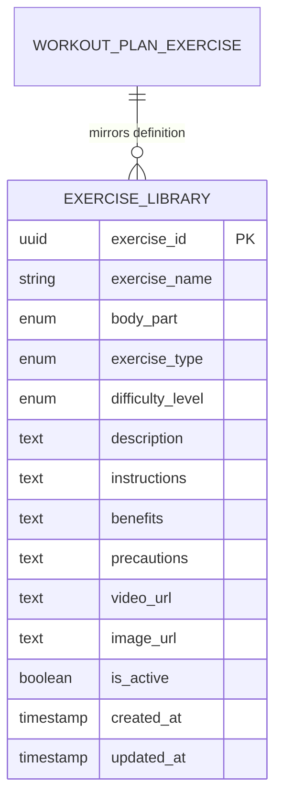
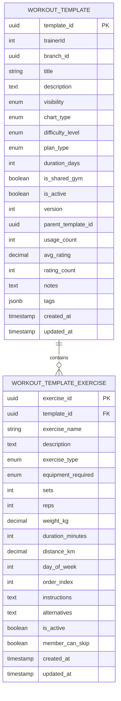
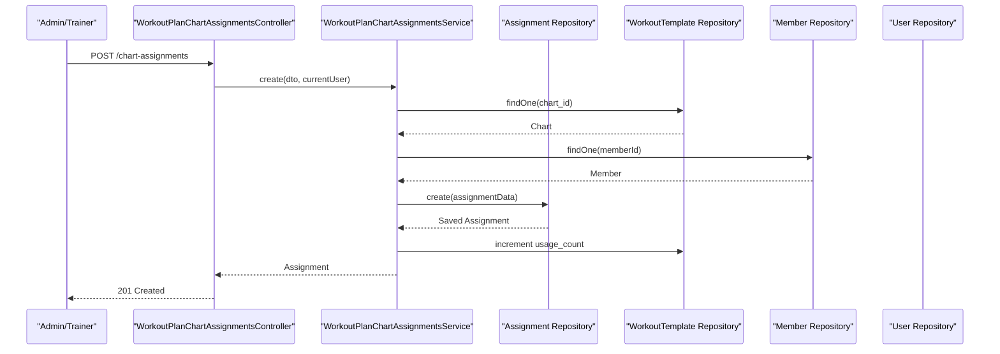
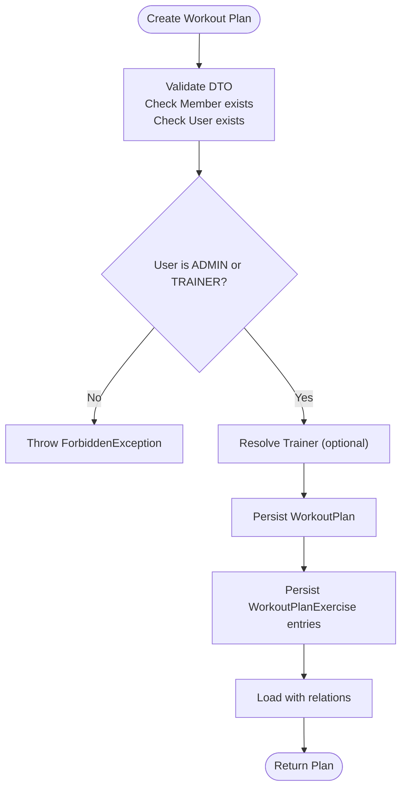
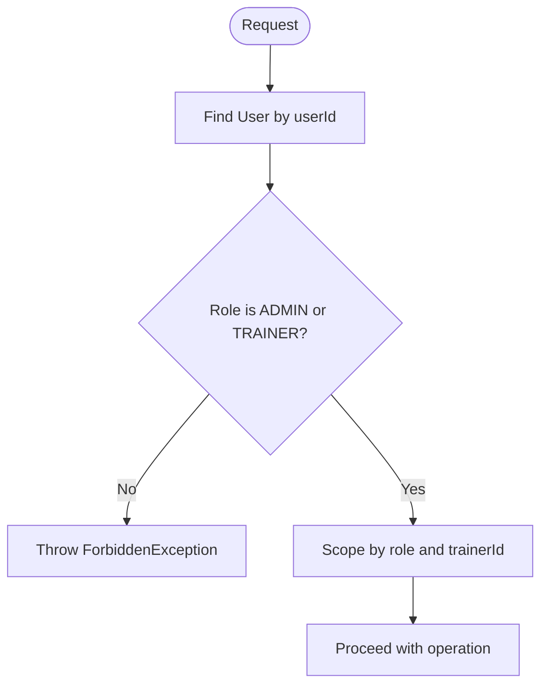
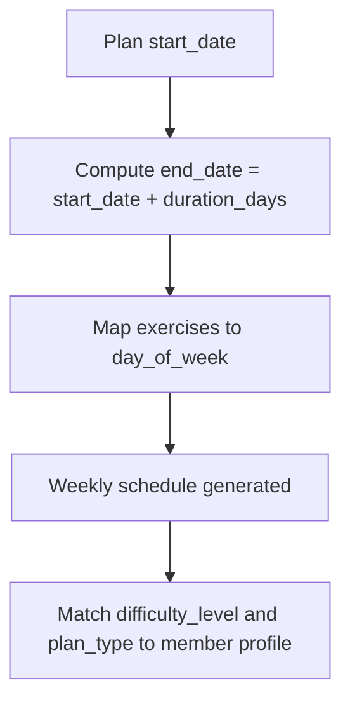
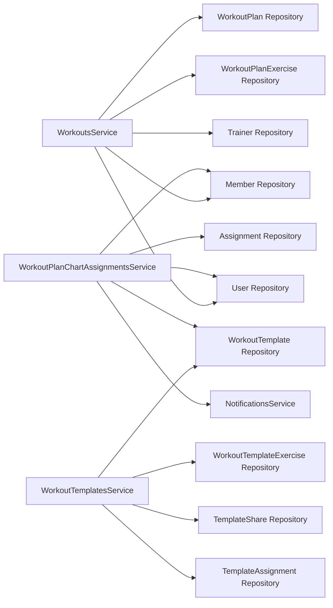

# Workout Plans

<cite>
**Referenced Files in This Document**
- [workout_plans.entity.ts](file://src/entities/workout_plans.entity.ts)
- [workout_plan_exercises.entity.ts](file://src/entities/workout_plan_exercises.entity.ts)
- [exercise_library.entity.ts](file://src/entities/exercise_library.entity.ts)
- [workout_templates.entity.ts](file://src/entities/workout_templates.entity.ts)
- [workout_template_exercises.entity.ts](file://src/entities/workout_template_exercises.entity.ts)
- [create-workout-plan.dto.ts](file://src/workouts/dto/create-workout-plan.dto.ts)
- [update-workout-plan.dto.ts](file://src/workouts/dto/update-workout-plan.dto.ts)
- [workouts.controller.ts](file://src/workouts/workouts.controller.ts)
- [workouts.service.ts](file://src/workouts/workouts.service.ts)
- [workout-templates.controller.ts](file://src/workouts/workout-templates.controller.ts)
- [workout-templates.service.ts](file://src/workouts/workout-templates.service.ts)
- [workout-plan-chart-assignments.controller.ts](file://src/workouts/workout-plan-chart-assignments.controller.ts)
- [workout-plan-chart-assignments.service.ts](file://src/workouts/workout-plan-chart-assignments.service.ts)
</cite>

## Table of Contents
1. [Introduction](#introduction)
2. [Project Structure](#project-structure)
3. [Core Components](#core-components)
4. [Architecture Overview](#architecture-overview)
5. [Detailed Component Analysis](#detailed-component-analysis)
6. [Dependency Analysis](#dependency-analysis)
7. [Performance Considerations](#performance-considerations)
8. [Troubleshooting Guide](#troubleshooting-guide)
9. [Conclusion](#conclusion)

## Introduction
This document explains the complete workout plans functionality, covering plan creation, management, and modification. It documents the entity model for workout plans and exercises, CRUD operations, validation via DTOs, integration with the exercise library, member and trainer assignments, permissions, scheduling, duration calculations, and compatibility with member fitness levels. Practical examples illustrate creating custom routines, assigning exercises with sets/reps/time/distance specifications, ordering exercises, and managing plan versions.

## Project Structure
The workout plans feature spans entities, DTOs, controllers, and services under the workouts module, plus template and chart assignment capabilities.

**Diagram sources**
- [workouts.controller.ts:1-1156](file://src/workouts/workouts.controller.ts#L1-L1156)
- [workouts.service.ts:1-281](file://src/workouts/workouts.service.ts#L1-L281)
- [workout_plans.entity.ts:1-73](file://src/entities/workout_plans.entity.ts#L1-L73)
- [workout_plan_exercises.entity.ts:1-60](file://src/entities/workout_plan_exercises.entity.ts#L1-L60)
- [workout_templates.entity.ts:1-126](file://src/entities/workout_templates.entity.ts#L1-L126)
- [workout_template_exercises.entity.ts:1-91](file://src/entities/workout_template_exercises.entity.ts#L1-L91)
- [workout-plan-chart-assignments.controller.ts:1-110](file://src/workouts/workout-plan-chart-assignments.controller.ts#L1-L110)
- [workout-plan-chart-assignments.service.ts:1-219](file://src/workouts/workout-plan-chart-assignments.service.ts#L1-L219)
- [exercise_library.entity.ts:1-59](file://src/entities/exercise_library.entity.ts#L1-L59)

**Section sources**
- [workouts.controller.ts:1-1156](file://src/workouts/workouts.controller.ts#L1-L1156)
- [workouts.service.ts:1-281](file://src/workouts/workouts.service.ts#L1-L281)
- [workout_plans.entity.ts:1-73](file://src/entities/workout_plans.entity.ts#L1-L73)
- [workout_plan_exercises.entity.ts:1-60](file://src/entities/workout_plan_exercises.entity.ts#L1-L60)
- [workout_templates.entity.ts:1-126](file://src/entities/workout_templates.entity.ts#L1-L126)
- [workout_template_exercises.entity.ts:1-91](file://src/entities/workout_template_exercises.entity.ts#L1-L91)
- [workout-plan-chart-assignments.controller.ts:1-110](file://src/workouts/workout-plan-chart-assignments.controller.ts#L1-L110)
- [workout-plan-chart-assignments.service.ts:1-219](file://src/workouts/workout-plan-chart-assignments.service.ts#L1-L219)
- [exercise_library.entity.ts:1-59](file://src/entities/exercise_library.entity.ts#L1-L59)

## Core Components
- WorkoutPlan entity: stores plan metadata, scheduling, difficulty, type, and associations to member, trainer, branch, and exercises.
- WorkoutPlanExercise entity: defines individual exercises within a plan with sets/reps/time/distance specifications, day-of-week, and instructions.
- DTOs: CreateWorkoutPlanDto and UpdateWorkoutPlanDto validate and shape plan creation and updates.
- WorkoutsService: orchestrates creation, retrieval, updates, deletions, and permission checks; integrates with members, trainers, and users.
- WorkoutsController: exposes REST endpoints for CRUD and filtering; includes extensive Swagger documentation and examples.
- Template and Chart Assignment modules: support plan versioning, sharing, assignment to members, substitutions, and progress tracking.

**Section sources**
- [workout_plans.entity.ts:1-73](file://src/entities/workout_plans.entity.ts#L1-L73)
- [workout_plan_exercises.entity.ts:1-60](file://src/entities/workout_plan_exercises.entity.ts#L1-L60)
- [create-workout-plan.dto.ts:1-145](file://src/workouts/dto/create-workout-plan.dto.ts#L1-L145)
- [update-workout-plan.dto.ts:1-5](file://src/workouts/dto/update-workout-plan.dto.ts#L1-L5)
- [workouts.service.ts:1-281](file://src/workouts/workouts.service.ts#L1-L281)
- [workouts.controller.ts:1-1156](file://src/workouts/workouts.controller.ts#L1-L1156)

## Architecture Overview
The system separates concerns across controllers, services, and entities. Controllers handle HTTP requests and responses, services encapsulate business logic and permissions, and entities define persistence and relationships. Templates and chart assignments complement plans by enabling sharing, versioning, and member-specific assignments.

**Diagram sources**
- [workouts.controller.ts:455-460](file://src/workouts/workouts.controller.ts#L455-L460)
- [workouts.service.ts:31-125](file://src/workouts/workouts.service.ts#L31-L125)
- [workout_plans.entity.ts:1-73](file://src/entities/workout_plans.entity.ts#L1-L73)
- [workout_plan_exercises.entity.ts:1-60](file://src/entities/workout_plan_exercises.entity.ts#L1-L60)

## Detailed Component Analysis

### Workout Plan Entity Model
The plan model captures plan-level attributes, scheduling, and associations. Exercises are embedded as a one-to-many relationship.

**Diagram sources**
- [workout_plans.entity.ts:1-73](file://src/entities/workout_plans.entity.ts#L1-L73)
- [workout_plan_exercises.entity.ts:1-60](file://src/entities/workout_plan_exercises.entity.ts#L1-L60)

**Section sources**
- [workout_plans.entity.ts:1-73](file://src/entities/workout_plans.entity.ts#L1-L73)
- [workout_plan_exercises.entity.ts:1-60](file://src/entities/workout_plan_exercises.entity.ts#L1-L60)

### Exercise Library Integration
The exercise library provides reusable exercise definitions with body part, type, difficulty, and media links. While workout plans reference exercises by name and specification, libraries can inform selection and ensure consistency.

**Diagram sources**
- [exercise_library.entity.ts:1-59](file://src/entities/exercise_library.entity.ts#L1-L59)
- [workout_plan_exercises.entity.ts:1-60](file://src/entities/workout_plan_exercises.entity.ts#L1-L60)

**Section sources**
- [exercise_library.entity.ts:1-59](file://src/entities/exercise_library.entity.ts#L1-L59)
- [workout_plan_exercises.entity.ts:1-60](file://src/entities/workout_plan_exercises.entity.ts#L1-L60)

### Template and Versioning Support
Templates enable plan reuse and versioning. They include metadata like chart type, difficulty, plan type, duration, visibility, and a version number. Templates can be shared and assigned to members, and plans can be derived from templates.

**Diagram sources**
- [workout_templates.entity.ts:1-126](file://src/entities/workout_templates.entity.ts#L1-L126)
- [workout_template_exercises.entity.ts:1-91](file://src/entities/workout_template_exercises.entity.ts#L1-L91)

**Section sources**
- [workout_templates.entity.ts:1-126](file://src/entities/workout_templates.entity.ts#L1-L126)
- [workout_template_exercises.entity.ts:1-91](file://src/entities/workout_template_exercises.entity.ts#L1-L91)

### Chart Assignments to Members
Chart assignments connect templates or plans to members with status, dates, completion tracking, and substitutions. This enables member-specific progress and adjustments.

**Diagram sources**
- [workout-plan-chart-assignments.controller.ts:32-37](file://src/workouts/workout-plan-chart-assignments.controller.ts#L32-L37)
- [workout-plan-chart-assignments.service.ts:26-92](file://src/workouts/workout-plan-chart-assignments.service.ts#L26-L92)

**Section sources**
- [workout-plan-chart-assignments.controller.ts:1-110](file://src/workouts/workout-plan-chart-assignments.controller.ts#L1-L110)
- [workout-plan-chart-assignments.service.ts:1-219](file://src/workouts/workout-plan-chart-assignments.service.ts#L1-L219)

### CRUD Operations for Workout Plans
- Create: Validates DTO, checks member existence, verifies user permissions (ADMIN/TRAINER), optionally associates a trainer, persists plan and exercises, and returns the hydrated plan.
- Retrieve: Find all plans with relations, find by ID, find by member, and find by user with role-based scoping.
- Update: Validates permissions (owner or assigned trainer), updates plan fields and dates, and saves.
- Delete: Validates permissions and removes the plan.

**Diagram sources**
- [workouts.service.ts:31-125](file://src/workouts/workouts.service.ts#L31-L125)
- [create-workout-plan.dto.ts:77-145](file://src/workouts/dto/create-workout-plan.dto.ts#L77-L145)

**Section sources**
- [workouts.controller.ts:455-460](file://src/workouts/workouts.controller.ts#L455-L460)
- [workouts.service.ts:31-125](file://src/workouts/workouts.service.ts#L31-L125)
- [create-workout-plan.dto.ts:1-145](file://src/workouts/dto/create-workout-plan.dto.ts#L1-L145)

### Permissions and Access Control
- Creation and updates require ADMIN or TRAINER roles.
- Updates restrict to plan owner (ADMIN) or the assigned trainer.
- Retrieval by user scopes results to either all plans (ADMIN) or only those assigned by the trainer.

**Diagram sources**
- [workouts.service.ts:50-56](file://src/workouts/workouts.service.ts#L50-L56)
- [workouts.service.ts:151-173](file://src/workouts/workouts.service.ts#L151-L173)
- [workouts.service.ts:261-278](file://src/workouts/workouts.service.ts#L261-L278)

**Section sources**
- [workouts.service.ts:50-56](file://src/workouts/workouts.service.ts#L50-L56)
- [workouts.service.ts:151-173](file://src/workouts/workouts.service.ts#L151-L173)
- [workouts.service.ts:261-278](file://src/workouts/workouts.service.ts#L261-L278)

### Scheduling, Duration, and Fitness Levels
- Scheduling: Each exercise specifies a day_of_week, enabling weekly sequencing.
- Duration: Plan duration_days and explicit start/end dates define the timeframe.
- Compatibility: Plan difficulty_level and plan_type align with member fitness levels and goals.

**Diagram sources**
- [workout_plans.entity.ts:46-53](file://src/entities/workout_plans.entity.ts#L46-L53)
- [workout_plan_exercises.entity.ts:46-46](file://src/entities/workout_plan_exercises.entity.ts#L46-L46)

**Section sources**
- [workout_plans.entity.ts:37-53](file://src/entities/workout_plans.entity.ts#L37-L53)
- [workout_plan_exercises.entity.ts:27-46](file://src/entities/workout_plan_exercises.entity.ts#L27-L46)

### Practical Examples
- Creating a custom routine:
  - Use CreateWorkoutPlanDto with memberId, title, description, difficulty_level, plan_type, duration_days, start_date, end_date, and an exercises array containing exercise_name, exercise_type, sets, reps, weight_kg, duration_minutes, distance_km, day_of_week, and instructions.
- Adding exercises with sets/reps/time/distance:
  - Choose exercise_type accordingly and provide numeric fields as applicable; leave others null.
- Organizing exercise order:
  - Use day_of_week to schedule exercises across the week; combine with plan duration_days to span the plan period.
- Managing plan versions:
  - Templates support version increments and parent_template_id for lineage; plans are derived from templates and can be updated independently.

**Section sources**
- [create-workout-plan.dto.ts:14-145](file://src/workouts/dto/create-workout-plan.dto.ts#L14-L145)
- [workout_plan_exercises.entity.ts:27-46](file://src/entities/workout_plan_exercises.entity.ts#L27-L46)
- [workout_templates.entity.ts:96-100](file://src/entities/workout_templates.entity.ts#L96-L100)

## Dependency Analysis
The modules depend on each other as follows:
- WorkoutsService depends on repositories for WorkoutPlan, WorkoutPlanExercise, Member, Trainer, and User.
- WorkoutTemplatesService depends on repositories for WorkoutTemplate, WorkoutTemplateExercise, TemplateShare, and TemplateAssignment.
- Chart Assignments Service depends on repositories for assignments, templates, members, and users, and integrates with NotificationsService.

**Diagram sources**
- [workouts.service.ts:16-29](file://src/workouts/workouts.service.ts#L16-L29)
- [workout-templates.service.ts:23-34](file://src/workouts/workout-templates.service.ts#L23-L34)
- [workout-plan-chart-assignments.service.ts:12-24](file://src/workouts/workout-plan-chart-assignments.service.ts#L12-L24)

**Section sources**
- [workouts.service.ts:16-29](file://src/workouts/workouts.service.ts#L16-L29)
- [workout-templates.service.ts:23-34](file://src/workouts/workout-templates.service.ts#L23-L34)
- [workout-plan-chart-assignments.service.ts:12-24](file://src/workouts/workout-plan-chart-assignments.service.ts#L12-L24)

## Performance Considerations
- Prefer batch operations for exercises during plan creation to minimize round trips.
- Use relations judiciously; load only required relations to reduce payload sizes.
- Pagination and filtering in controllers help manage large datasets.
- Indexes on frequently queried columns (memberId, trainerId, plan_id, assignment_id) improve query performance.

## Troubleshooting Guide
- Validation failures: DTO validation errors surface as Bad Request responses; ensure all required fields are present and formatted correctly.
- Permission errors: Requests from unauthorized users receive Forbidden responses; verify user role and trainer association.
- Not found errors: Missing members, trainers, or plans trigger NotFound responses; confirm identifiers exist.
- Duplicate assignments: Attempting to assign an active chart to a member twice raises a Bad Request; cancel or modify existing assignment first.

**Section sources**
- [workouts.controller.ts:294-307](file://src/workouts/workouts.controller.ts#L294-L307)
- [workouts.service.ts:36-56](file://src/workouts/workouts.service.ts#L36-L56)
- [workout-plan-chart-assignments.service.ts:43-53](file://src/workouts/workout-plan-chart-assignments.service.ts#L43-L53)

## Conclusion
The workout plans feature provides a robust foundation for creating, managing, and modifying personalized training programs. It supports detailed exercise specifications, scheduling, permissions, and integration with templates and chart assignments. By leveraging DTO validation, role-based access control, and structured entities, the system ensures consistency and scalability for diverse fitness goals and member profiles.