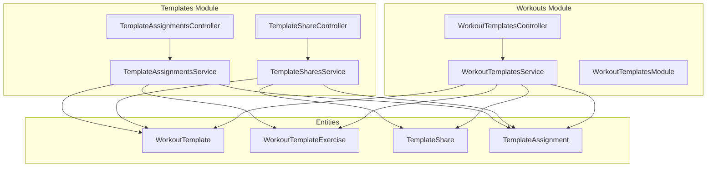
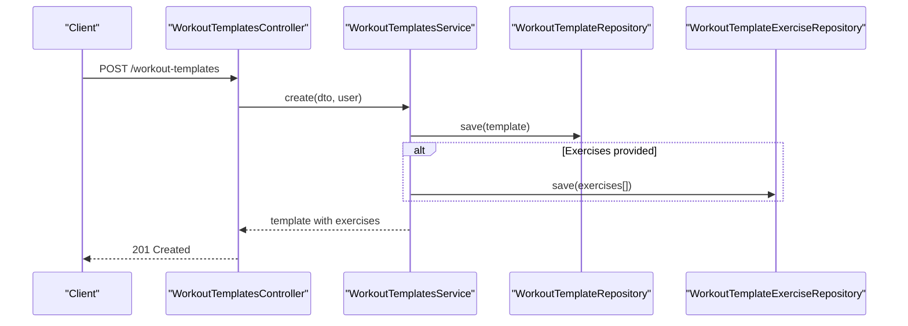
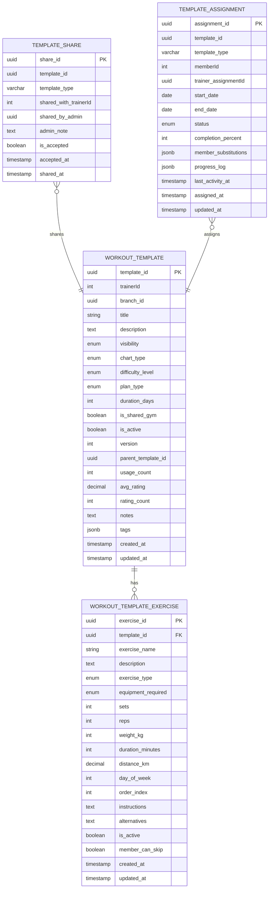
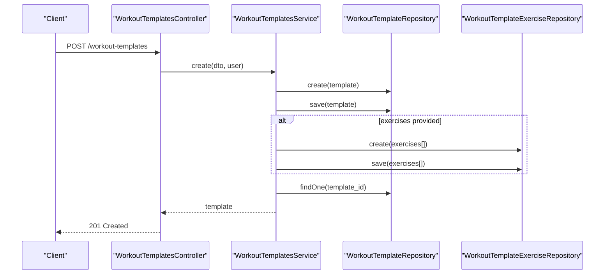
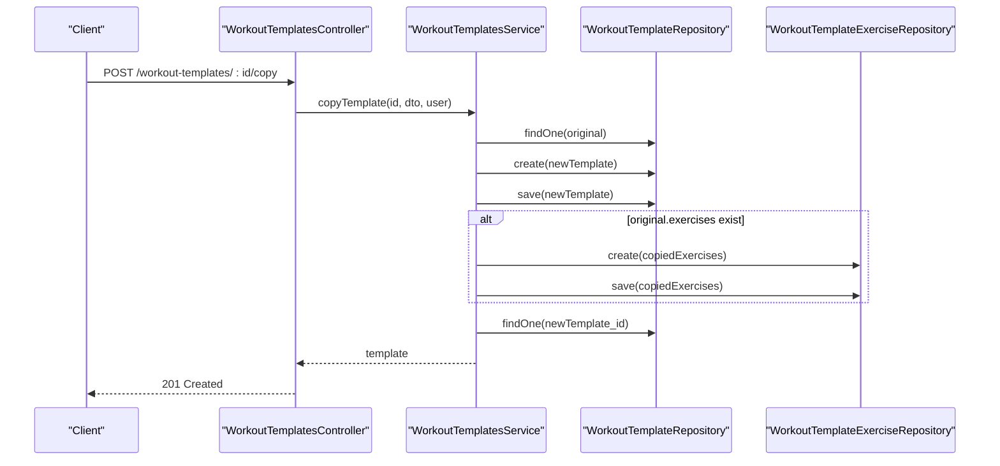
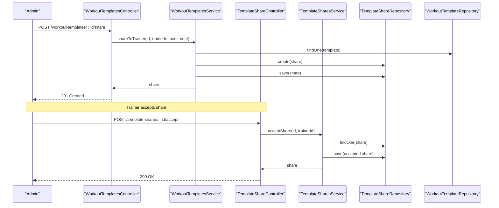
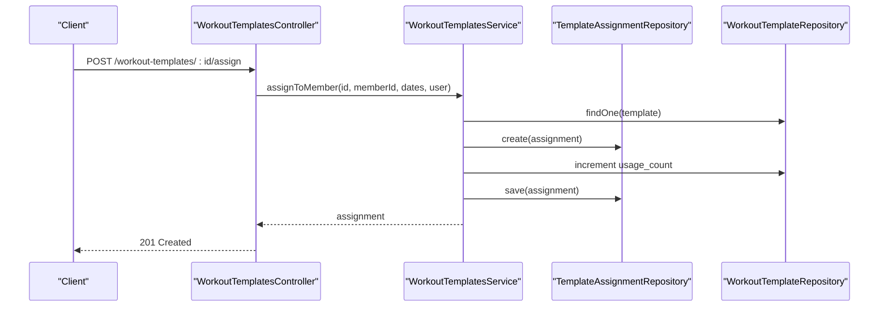
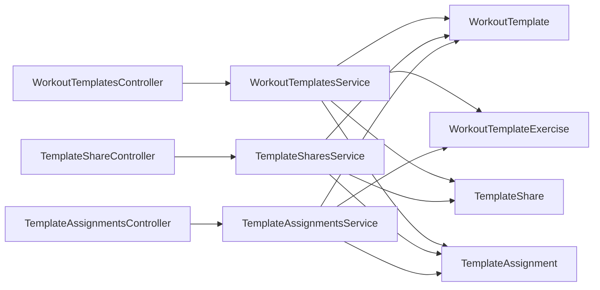

# Workout Templates

<cite>
**Referenced Files in This Document**
- [workout-templates.controller.ts](file://src/workouts/workout-templates.controller.ts)
- [workout-templates.service.ts](file://src/workouts/workout-templates.service.ts)
- [workout-templates.module.ts](file://src/workouts/workout-templates.module.ts)
- [workout_templates.entity.ts](file://src/entities/workout_templates.entity.ts)
- [workout_template_exercises.entity.ts](file://src/entities/workout_template_exercises.entity.ts)
- [template_shares.entity.ts](file://src/entities/template_shares.entity.ts)
- [template_assignments.entity.ts](file://src/entities/template_assignments.entity.ts)
- [template-shares.controller.ts](file://src/templates/template-shares.controller.ts)
- [template-shares.service.ts](file://src/templates/template-shares.service.ts)
- [template-assignments.controller.ts](file://src/templates/template-assignments.controller.ts)
- [template-assignments.service.ts](file://src/templates/template-assignments.service.ts)
- [create-workout-template.dto.ts](file://src/workouts/dto/create-workout-template.dto.ts)
- [share-template.dto.ts](file://src/common/dto/share-template.dto.ts)
</cite>

## Table of Contents
1. [Introduction](#introduction)
2. [Project Structure](#project-structure)
3. [Core Components](#core-components)
4. [Architecture Overview](#architecture-overview)
5. [Detailed Component Analysis](#detailed-component-analysis)
6. [Dependency Analysis](#dependency-analysis)
7. [Performance Considerations](#performance-considerations)
8. [Troubleshooting Guide](#troubleshooting-guide)
9. [Conclusion](#conclusion)

## Introduction
This document explains the workout templates system: how templates are created, managed, shared, and assigned. It covers the template entity model, exercise configurations, sharing permissions, and assignment workflows. It also documents template management operations (creation from scratch, duplication, updates) and outlines practical examples for categories, default configurations, versioning, and approval workflows. Finally, it addresses performance optimization, caching strategies, and integration with assignment systems.

## Project Structure
The workout templates system spans controllers, services, entities, and DTOs under the workouts and templates modules. Controllers expose REST endpoints; services encapsulate business logic; entities define the data model; DTOs validate and shape request/response payloads.

**Diagram sources**
- [workout-templates.controller.ts:40-526](file://src/workouts/workout-templates.controller.ts#L40-L526)
- [workout-templates.service.ts:24-376](file://src/workouts/workout-templates.service.ts#L24-L376)
- [workout-templates.module.ts:10-23](file://src/workouts/workout-templates.module.ts#L10-L23)
- [workout_templates.entity.ts:41-126](file://src/entities/workout_templates.entity.ts#L41-L126)
- [workout_template_exercises.entity.ts:23-91](file://src/entities/workout_template_exercises.entity.ts#L23-L91)
- [template_shares.entity.ts:11-43](file://src/entities/template_shares.entity.ts#L11-L43)
- [template_assignments.entity.ts:12-75](file://src/entities/template_assignments.entity.ts#L12-L75)
- [template-shares.controller.ts:26-214](file://src/templates/template-shares.controller.ts#L26-L214)
- [template-shares.service.ts:9-124](file://src/templates/template-shares.service.ts#L9-L124)
- [template-assignments.controller.ts:27-91](file://src/templates/template-assignments.controller.ts#L27-L91)
- [template-assignments.service.ts:22-341](file://src/templates/template-assignments.service.ts#L22-L341)

**Section sources**
- [workout-templates.controller.ts:40-526](file://src/workouts/workout-templates.controller.ts#L40-L526)
- [workout-templates.service.ts:24-376](file://src/workouts/workout-templates.service.ts#L24-L376)
- [workout-templates.module.ts:10-23](file://src/workouts/workout-templates.module.ts#L10-L23)
- [template-shares.controller.ts:26-214](file://src/templates/template-shares.controller.ts#L26-L214)
- [template-shares.service.ts:9-124](file://src/templates/template-shares.service.ts#L9-L124)
- [template-assignments.controller.ts:27-91](file://src/templates/template-assignments.controller.ts#L27-L91)
- [template-assignments.service.ts:22-341](file://src/templates/template-assignments.service.ts#L22-L341)

## Core Components
- WorkoutTemplatesController: Exposes endpoints for CRUD, copying, sharing, rating, and assigning templates. Enforces role-based access (TRAINER, ADMIN).
- WorkoutTemplatesService: Implements business logic for template creation, retrieval, updates, duplication, sharing, acceptance, assignment, rating, and deletion. Handles access control and visibility rules.
- Entities:
  - WorkoutTemplate: Core template metadata (title, description, visibility, chart type, difficulty, plan type, duration, versioning, ratings, tags, exercises).
  - WorkoutTemplateExercise: Exercise configuration per template (type, sets/reps/weight/time/distance, equipment, ordering, alternatives, skip rules).
  - TemplateShare: Tracks admin-initiated sharing to trainers with acceptance lifecycle.
  - TemplateAssignment: Links members to templates with dates, status, completion metrics, substitutions, and progress logs.
- Template Shares Controller/Service: Manages sharing workflows across template types (workout/diet/goal) and accepts/rejects shares.
- Template Assignments Controller/Service: Manages assignment lifecycles, progress updates, substitutions, and analytics.

**Section sources**
- [workout-templates.controller.ts:46-525](file://src/workouts/workout-templates.controller.ts#L46-L525)
- [workout-templates.service.ts:36-358](file://src/workouts/workout-templates.service.ts#L36-L358)
- [workout_templates.entity.ts:41-126](file://src/entities/workout_templates.entity.ts#L41-L126)
- [workout_template_exercises.entity.ts:23-91](file://src/entities/workout_template_exercises.entity.ts#L23-L91)
- [template_shares.entity.ts:11-43](file://src/entities/template_shares.entity.ts#L11-L43)
- [template_assignments.entity.ts:12-75](file://src/entities/template_assignments.entity.ts#L12-L75)
- [template-shares.controller.ts:29-212](file://src/templates/template-shares.controller.ts#L29-L212)
- [template-shares.service.ts:22-122](file://src/templates/template-shares.service.ts#L22-L122)
- [template-assignments.controller.ts:30-89](file://src/templates/template-assignments.controller.ts#L30-L89)
- [template-assignments.service.ts:37-339](file://src/templates/template-assignments.service.ts#L37-L339)

## Architecture Overview
The system follows a layered architecture:
- Controllers handle HTTP requests and delegate to services.
- Services encapsulate domain logic, enforce authorization, and coordinate with repositories.
- Entities define the persistent model with relationships and enums.
- DTOs validate inputs and standardize payloads.

**Diagram sources**
- [workout-templates.controller.ts:79-81](file://src/workouts/workout-templates.controller.ts#L79-L81)
- [workout-templates.service.ts:36-67](file://src/workouts/workout-templates.service.ts#L36-L67)

**Section sources**
- [workout-templates.controller.ts:46-81](file://src/workouts/workout-templates.controller.ts#L46-L81)
- [workout-templates.service.ts:36-67](file://src/workouts/workout-templates.service.ts#L36-L67)

## Detailed Component Analysis

### Template Entity Model
The template model supports structured workout designs with rich metadata and exercise configurations.

**Diagram sources**
- [workout_templates.entity.ts:41-126](file://src/entities/workout_templates.entity.ts#L41-L126)
- [workout_template_exercises.entity.ts:23-91](file://src/entities/workout_template_exercises.entity.ts#L23-L91)
- [template_shares.entity.ts:11-43](file://src/entities/template_shares.entity.ts#L11-L43)
- [template_assignments.entity.ts:12-75](file://src/entities/template_assignments.entity.ts#L12-L75)

**Section sources**
- [workout_templates.entity.ts:14-126](file://src/entities/workout_templates.entity.ts#L14-L126)
- [workout_template_exercises.entity.ts:11-91](file://src/entities/workout_template_exercises.entity.ts#L11-L91)
- [template_shares.entity.ts:11-43](file://src/entities/template_shares.entity.ts#L11-L43)
- [template_assignments.entity.ts:12-75](file://src/entities/template_assignments.entity.ts#L12-L75)

### Template Creation Workflow
- Endpoint: POST /workout-templates
- Role requirements: TRAINER, ADMIN
- Behavior:
  - Validates creator role.
  - Creates template with version set to 1.
  - Optionally persists exercises and links them to the template.
  - Returns the created template with exercises populated.

**Diagram sources**
- [workout-templates.controller.ts:79-81](file://src/workouts/workout-templates.controller.ts#L79-L81)
- [workout-templates.service.ts:36-67](file://src/workouts/workout-templates.service.ts#L36-L67)

**Section sources**
- [workout-templates.controller.ts:46-81](file://src/workouts/workout-templates.controller.ts#L46-L81)
- [workout-templates.service.ts:36-67](file://src/workouts/workout-templates.service.ts#L36-L67)

### Template Duplication Workflow
- Endpoint: POST /workout-templates/:id/copy
- Role requirements: TRAINER, ADMIN
- Behavior:
  - Copies template metadata (title, description, difficulty, plan type, duration, notes, tags).
  - Sets parent_template_id and increments version.
  - Recreates exercises with identical configuration.
  - Returns the new template.

**Diagram sources**
- [workout-templates.controller.ts:254-260](file://src/workouts/workout-templates.controller.ts#L254-L260)
- [workout-templates.service.ts:195-250](file://src/workouts/workout-templates.service.ts#L195-L250)

**Section sources**
- [workout-templates.controller.ts:234-260](file://src/workouts/workout-templates.controller.ts#L234-L260)
- [workout-templates.service.ts:195-250](file://src/workouts/workout-templates.service.ts#L195-L250)

### Template Sharing Mechanism
- Endpoint: POST /workout-templates/:id/share (admin)
- Endpoint: POST /template-shares/:id/accept (trainer)
- Behavior:
  - Admin creates a share record linking template_id, template_type, trainerId, and admin note.
  - Trainer accepts the share; acceptance is persisted with accepted_at timestamp.
  - Access checks allow trainers to view templates they own, templates marked public, or templates shared and accepted by them.

**Diagram sources**
- [workout-templates.controller.ts:299-305](file://src/workouts/workout-templates.controller.ts#L299-L305)
- [workout-templates.service.ts:252-284](file://src/workouts/workout-templates.service.ts#L252-L284)
- [template-shares.controller.ts:168-176](file://src/templates/template-shares.controller.ts#L168-L176)
- [template-shares.service.ts:92-109](file://src/templates/template-shares.service.ts#L92-L109)

**Section sources**
- [workout-templates.controller.ts:262-305](file://src/workouts/workout-templates.controller.ts#L262-L305)
- [workout-templates.service.ts:252-284](file://src/workouts/workout-templates.service.ts#L252-L284)
- [template-shares.controller.ts:129-176](file://src/templates/template-shares.controller.ts#L129-L176)
- [template-shares.service.ts:22-109](file://src/templates/template-shares.service.ts#L22-L109)

### Template Assignment Workflow
- Endpoint: POST /workout-templates/:id/assign (trainer/admin)
- Behavior:
  - Validates template existence and user role.
  - Creates a TemplateAssignment linking member, template, dates, and optional trainer assignment.
  - Increments template usage_count.
  - Returns the assignment.

**Diagram sources**
- [workout-templates.controller.ts:429-441](file://src/workouts/workout-templates.controller.ts#L429-L441)
- [workout-templates.service.ts:305-331](file://src/workouts/workout-templates.service.ts#L305-L331)

**Section sources**
- [workout-templates.controller.ts:379-441](file://src/workouts/workout-templates.controller.ts#L379-L441)
- [workout-templates.service.ts:305-331](file://src/workouts/workout-templates.service.ts#L305-L331)

### Template Management Operations
- Create from scratch: POST /workout-templates with exercises array.
- Duplicate: POST /workout-templates/:id/copy with optional new title/description.
- Update: PATCH /workout-templates/:id updates metadata; exercises are not part of the update DTO.
- Delete: DELETE /workout-templates/:id; enforcement ensures only owners or admins can delete.
- Rating: POST /workout-templates/:id/rate updates average rating and count.
- Filtering and pagination: GET /workout-templates supports visibility, chart_type, difficulty_level, pagination, and trainer-specific filters.

**Section sources**
- [workout-templates.controller.ts:46-525](file://src/workouts/workout-templates.controller.ts#L46-L525)
- [workout-templates.service.ts:177-358](file://src/workouts/workout-templates.service.ts#L177-L358)

### Practical Examples and Workflows

#### Creating Template Categories and Default Configurations
- Use plan_type and chart_type to categorize templates (e.g., strength/cardio/flexibility/endurance/general).
- Set default difficulty_level and duration_days for standardized offerings.
- Populate tags for discoverability and filtering.

**Section sources**
- [workout_templates.entity.ts:33-88](file://src/entities/workout_templates.entity.ts#L33-L88)
- [workout-templates.controller.ts:83-188](file://src/workouts/workout-templates.controller.ts#L83-L188)

#### Managing Template Versions
- Version increments on duplication; parent_template_id tracks lineage.
- Use version and parent_template_id to track changes and derive audits.

**Section sources**
- [workout-templates.service.ts:217-222](file://src/workouts/workout-templates.service.ts#L217-L222)
- [workout_templates.entity.ts:96-100](file://src/entities/workout_templates.entity.ts#L96-L100)

#### Implementing Approval Workflows
- Admin-initiated sharing via POST /workout-templates/:id/share.
- Trainer acceptance via POST /template-shares/:id/accept.
- Access checks in service ensure only accepted shares grant access.

**Section sources**
- [workout-templates.controller.ts:299-305](file://src/workouts/workout-templates.controller.ts#L299-L305)
- [template-shares.controller.ts:168-176](file://src/templates/template-shares.controller.ts#L168-L176)
- [workout-templates.service.ts:360-365](file://src/workouts/workout-templates.service.ts#L360-L365)

#### Exercise Configuration Defaults
- Default exercise_type to sets_reps, time, or distance.
- Provide defaults for sets, reps, weight_kg, duration_minutes, distance_km.
- Use order_index and day_of_week to schedule exercises.

**Section sources**
- [workout_template_exercises.entity.ts:42-83](file://src/entities/workout_template_exercises.entity.ts#L42-L83)

#### Integration with Assignment Systems
- Assignments link members to templates with start/end dates and status.
- Progress tracking via completion_percent, member_substitutions, and progress_log.
- Analytics endpoint for administrators to monitor system-wide usage.

**Section sources**
- [template_assignments.entity.ts:12-75](file://src/entities/template_assignments.entity.ts#L12-L75)
- [template-assignments.controller.ts:53-57](file://src/templates/template-assignments.controller.ts#L53-L57)
- [template-assignments.service.ts:261-299](file://src/templates/template-assignments.service.ts#L261-L299)

## Dependency Analysis
The system exhibits clear separation of concerns:
- Controllers depend on services for business logic.
- Services depend on repositories for persistence.
- Entities define relationships and constraints.
- DTOs validate inputs across modules.

**Diagram sources**
- [workout-templates.controller.ts:43-44](file://src/workouts/workout-templates.controller.ts#L43-L44)
- [template-shares.controller.ts:27-27](file://src/templates/template-shares.controller.ts#L27-L27)
- [template-assignments.controller.ts:28-28](file://src/templates/template-assignments.controller.ts#L28-L28)
- [workout-templates.service.ts:25-34](file://src/workouts/workout-templates.service.ts#L25-L34)
- [template-shares.service.ts:11-20](file://src/templates/template-shares.service.ts#L11-L20)
- [template-assignments.service.ts:24-35](file://src/templates/template-assignments.service.ts#L24-L35)

**Section sources**
- [workout-templates.controller.ts:43-44](file://src/workouts/workout-templates.controller.ts#L43-L44)
- [template-shares.controller.ts:27-27](file://src/templates/template-shares.controller.ts#L27-L27)
- [template-assignments.controller.ts:28-28](file://src/templates/template-assignments.controller.ts#L28-L28)
- [workout-templates.service.ts:25-34](file://src/workouts/workout-templates.service.ts#L25-L34)
- [template-shares.service.ts:11-20](file://src/templates/template-shares.service.ts#L11-L20)
- [template-assignments.service.ts:24-35](file://src/templates/template-assignments.service.ts#L24-L35)

## Performance Considerations
- Pagination and filtering: Use page and limit parameters to avoid large result sets.
- Eager loading: Relations like exercises and trainer are loaded selectively; avoid unnecessary joins in queries.
- Indexes: Consider adding indexes on frequently queried columns (trainerId, is_shared_gym, template_type, status, memberId).
- Caching:
  - Cache template lists with filters for common queries.
  - Cache template details for anonymous/public templates.
  - Use cache invalidation on template updates, assignments, and shares.
- Batch operations: When duplicating templates, batch exercise inserts to reduce round trips.
- Denormalization: Keep usage_count and rating aggregates to avoid expensive recalculations.

[No sources needed since this section provides general guidance]

## Troubleshooting Guide
Common issues and resolutions:
- Access Denied:
  - Ensure user role is TRAINER or ADMIN for template operations.
  - For viewing templates, verify ownership, public visibility, or accepted share.
- Template Not Found:
  - Confirm UUID format and that the template exists.
- Forbidden Updates:
  - Only owners (or admins) can update/delete templates.
- Share Already Exists:
  - Avoid duplicate shares; reuse existing share record.
- Assignment Validation:
  - Ensure member exists and template_type matches supported values.

**Section sources**
- [workout-templates.service.ts:144-161](file://src/workouts/workout-templates.service.ts#L144-L161)
- [workout-templates.service.ts:346-358](file://src/workouts/workout-templates.service.ts#L346-L358)
- [template-shares.service.ts:54-65](file://src/templates/template-shares.service.ts#L54-L65)
- [template-assignments.service.ts:37-96](file://src/templates/template-assignments.service.ts#L37-L96)

## Conclusion
The workout templates system provides a robust foundation for creating, managing, sharing, and assigning standardized workout routines. Its entity model supports rich metadata and exercise configurations, while controllers and services enforce role-based access and maintain data integrity. The sharing and assignment subsystems enable trainers to collaborate and deliver structured plans to members, with built-in analytics and extensibility for future enhancements like approval workflows and advanced caching strategies.