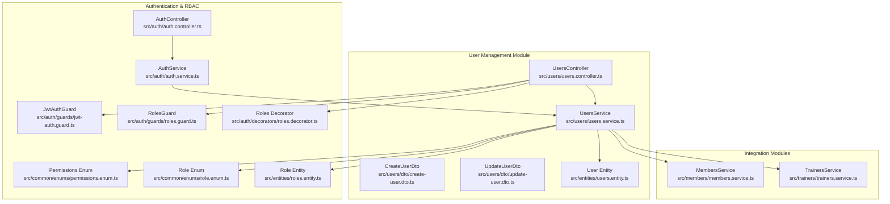
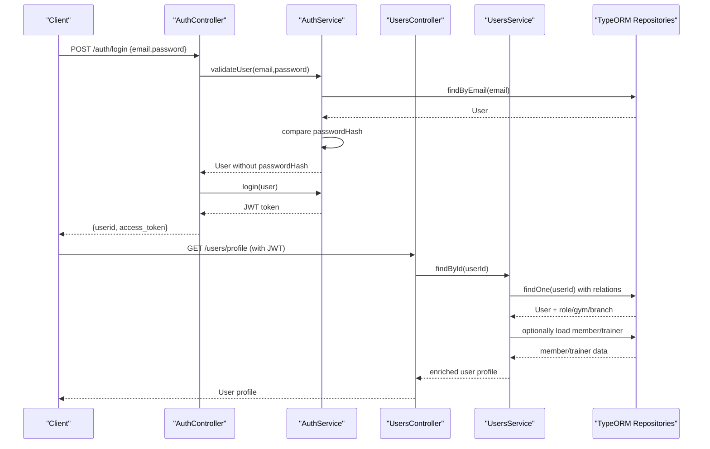
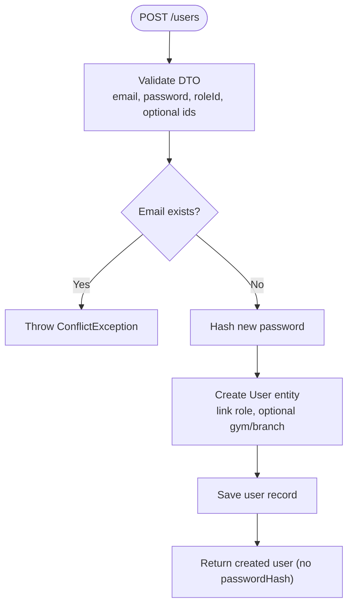
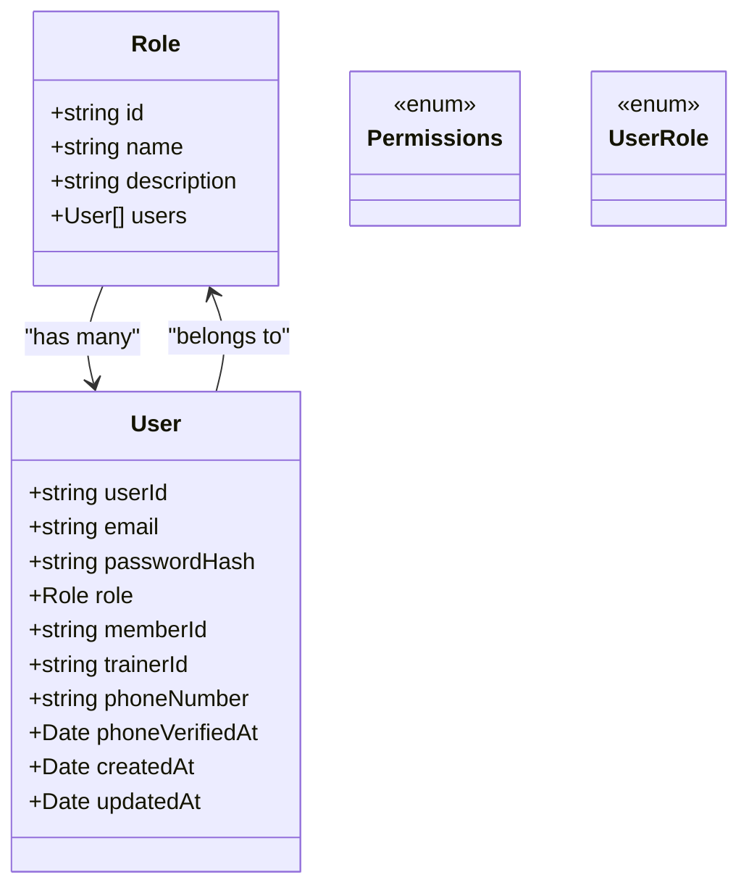
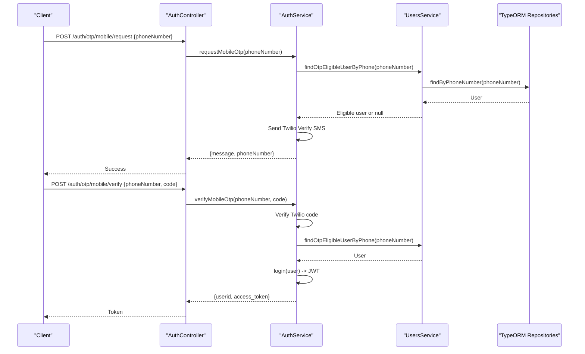
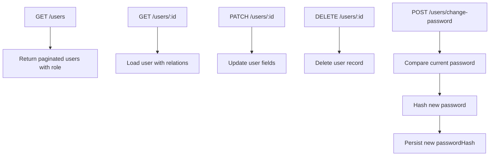
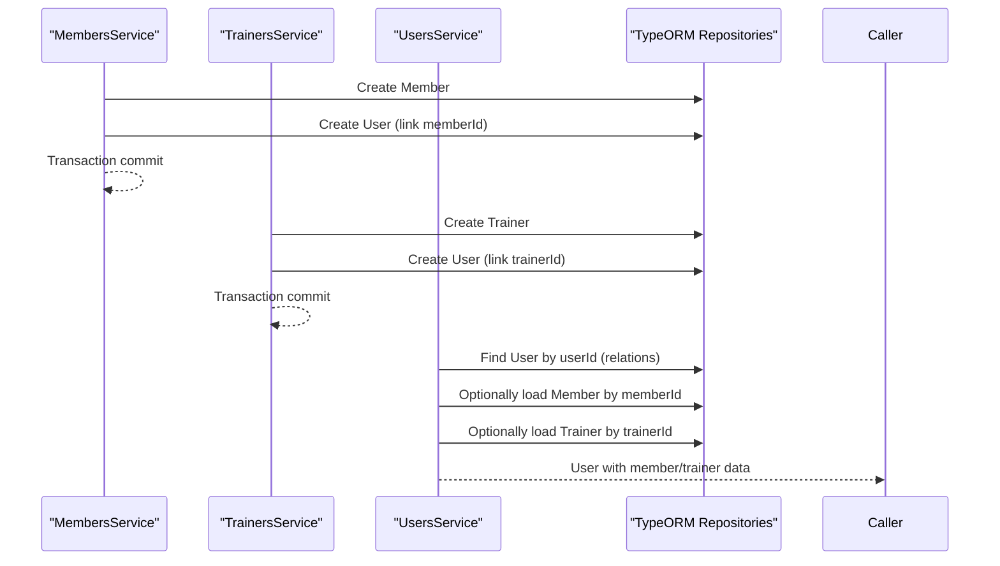
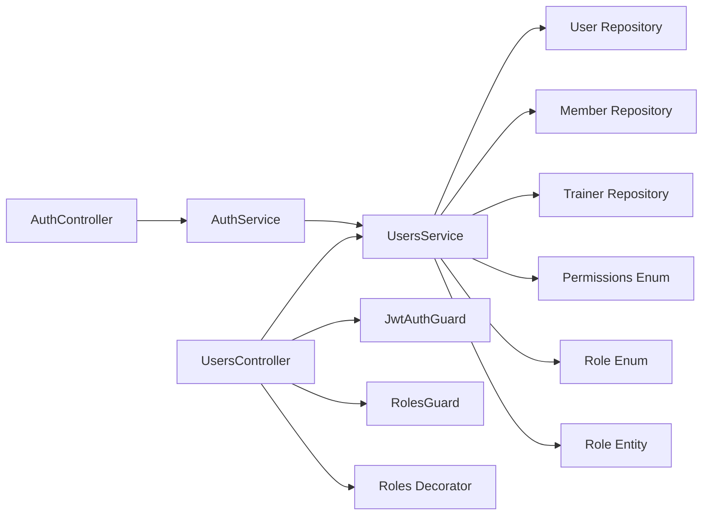

# User Management

<cite>
**Referenced Files in This Document**
- [users.controller.ts](file://src/users/users.controller.ts)
- [users.service.ts](file://src/users/users.service.ts)
- [create-user.dto.ts](file://src/users/dto/create-user.dto.ts)
- [update-user.dto.ts](file://src/users/dto/update-user.dto.ts)
- [users.entity.ts](file://src/entities/users.entity.ts)
- [auth.service.ts](file://src/auth/auth.service.ts)
- [auth.controller.ts](file://src/auth/auth.controller.ts)
- [jwt-auth.guard.ts](file://src/auth/guards/jwt-auth.guard.ts)
- [roles.guard.ts](file://src/auth/guards/roles.guard.ts)
- [roles.decorator.ts](file://src/auth/decorators/roles.decorator.ts)
- [permissions.enum.ts](file://src/common/enums/permissions.enum.ts)
- [role.enum.ts](file://src/common/enums/role.enum.ts)
- [roles.entity.ts](file://src/entities/roles.entity.ts)
- [members.service.ts](file://src/members/members.service.ts)
- [trainers.service.ts](file://src/trainers/trainers.service.ts)
</cite>

## Table of Contents
1. [Introduction](#introduction)
2. [Project Structure](#project-structure)
3. [Core Components](#core-components)
4. [Architecture Overview](#architecture-overview)
5. [Detailed Component Analysis](#detailed-component-analysis)
6. [Dependency Analysis](#dependency-analysis)
7. [Performance Considerations](#performance-considerations)
8. [Troubleshooting Guide](#troubleshooting-guide)
9. [Conclusion](#conclusion)

## Introduction
This document provides comprehensive documentation for the user management module in the Gym application. It explains user registration and profile management, including user creation, profile updates, and lifecycle operations. It also details the role-based access control (RBAC) implementation across four user types (superadmin, admin, trainer, member), the authentication flow, password management, and session handling. Practical examples illustrate CRUD operations, role assignment patterns, and permission checking mechanisms. Finally, it covers integrations with the authentication system and how user data is shared across members and trainers, along with validation rules, data integrity constraints, and security considerations.

## Project Structure
The user management module is organized around a dedicated controller and service, with supporting DTOs, entities, and integration points with authentication and RBAC guards. The module interacts with members and trainers services to maintain data consistency between user accounts and their respective profiles.

**Diagram sources**
- [users.controller.ts](file://src/users/users.controller.ts)
- [users.service.ts](file://src/users/users.service.ts)
- [create-user.dto.ts](file://src/users/dto/create-user.dto.ts)
- [update-user.dto.ts](file://src/users/dto/update-user.dto.ts)
- [users.entity.ts](file://src/entities/users.entity.ts)
- [auth.controller.ts](file://src/auth/auth.controller.ts)
- [auth.service.ts](file://src/auth/auth.service.ts)
- [jwt-auth.guard.ts](file://src/auth/guards/jwt-auth.guard.ts)
- [roles.guard.ts](file://src/auth/guards/roles.guard.ts)
- [roles.decorator.ts](file://src/auth/decorators/roles.decorator.ts)
- [permissions.enum.ts](file://src/common/enums/permissions.enum.ts)
- [role.enum.ts](file://src/common/enums/role.enum.ts)
- [roles.entity.ts](file://src/entities/roles.entity.ts)
- [members.service.ts](file://src/members/members.service.ts)
- [trainers.service.ts](file://src/trainers/trainers.service.ts)

**Section sources**
- [users.controller.ts](file://src/users/users.controller.ts)
- [users.service.ts](file://src/users/users.service.ts)
- [create-user.dto.ts](file://src/users/dto/create-user.dto.ts)
- [update-user.dto.ts](file://src/users/dto/update-user.dto.ts)
- [users.entity.ts](file://src/entities/users.entity.ts)
- [auth.controller.ts](file://src/auth/auth.controller.ts)
- [auth.service.ts](file://src/auth/auth.service.ts)
- [jwt-auth.guard.ts](file://src/auth/guards/jwt-auth.guard.ts)
- [roles.guard.ts](file://src/auth/guards/roles.guard.ts)
- [roles.decorator.ts](file://src/auth/decorators/roles.decorator.ts)
- [permissions.enum.ts](file://src/common/enums/permissions.enum.ts)
- [role.enum.ts](file://src/common/enums/role.enum.ts)
- [roles.entity.ts](file://src/entities/roles.entity.ts)
- [members.service.ts](file://src/members/members.service.ts)
- [trainers.service.ts](file://src/trainers/trainers.service.ts)

## Core Components
- UsersController: Exposes REST endpoints for user creation, retrieval, updates, deletion, password changes, and profile access. It enforces authentication via JWT guard and role-based access via roles guard for administrative actions.
- UsersService: Implements business logic for user creation, retrieval, updates, deletions, and password changes. It integrates with TypeORM repositories for persistence and coordinates with members and trainers services to enrich user responses with associated profiles.
- DTOs: Strongly typed request/response models for user creation and updates, including validation rules for email, password, role identifiers, optional gym/branch associations, and phone number formatting.
- Entities: Defines the User entity with relationships to Role, Gym, Branch, and optional memberId/trainerId links to members and trainers. Also defines the Role entity and permission enumerations.
- Authentication and RBAC: AuthService handles email/password and OTP-based authentication flows, while AuthController exposes login, OTP request/verify, and logout endpoints. Guards and decorators enforce JWT-based authentication and role-based authorization.

Key capabilities:
- User registration with role assignment and optional gym/branch linkage.
- Profile retrieval with enriched data from members and trainers.
- Password change for authenticated users.
- Role-based access control for administrative endpoints.
- OTP-based login for eligible members and trainers.

**Section sources**
- [users.controller.ts](file://src/users/users.controller.ts)
- [users.service.ts](file://src/users/users.service.ts)
- [create-user.dto.ts](file://src/users/dto/create-user.dto.ts)
- [update-user.dto.ts](file://src/users/dto/update-user.dto.ts)
- [users.entity.ts](file://src/entities/users.entity.ts)
- [auth.service.ts](file://src/auth/auth.service.ts)
- [auth.controller.ts](file://src/auth/auth.controller.ts)
- [jwt-auth.guard.ts](file://src/auth/guards/jwt-auth.guard.ts)
- [roles.guard.ts](file://src/auth/guards/roles.guard.ts)
- [roles.decorator.ts](file://src/auth/decorators/roles.decorator.ts)
- [permissions.enum.ts](file://src/common/enums/permissions.enum.ts)
- [role.enum.ts](file://src/common/enums/role.enum.ts)
- [roles.entity.ts](file://src/entities/roles.entity.ts)

## Architecture Overview
The user management module follows a layered architecture:
- Presentation Layer: Controllers handle HTTP requests and responses, apply guards, and delegate to services.
- Application Layer: Services encapsulate business logic, orchestrate data access, and coordinate cross-module operations.
- Data Access Layer: TypeORM repositories manage persistence for users, roles, members, and trainers.
- Security Layer: Guards enforce authentication and authorization; DTOs provide input validation.

**Diagram sources**
- [auth.controller.ts](file://src/auth/auth.controller.ts)
- [auth.service.ts](file://src/auth/auth.service.ts)
- [users.controller.ts](file://src/users/users.controller.ts)
- [users.service.ts](file://src/users/users.service.ts)
- [users.entity.ts](file://src/entities/users.entity.ts)

## Detailed Component Analysis

### User Registration and Profile Management
- Registration flow:
  - Endpoint: POST /users (requires ADMIN or SUPERADMIN).
  - Validation: Email uniqueness, password presence, roleId format, optional gymId/branchId, optional phone number with E.164 format.
  - Persistence: Hashed password stored; role linked by roleId; optional gym/branch set; memberId/trainerId remain unset initially.
  - Response: Returns created user without sensitive fields.
- Profile retrieval:
  - Endpoint: GET /users/profile (authenticated).
  - Enrichment: Loads role, gym, branch; optionally loads member/trainer records and merges them into the response (excluding duplicated branch field).
  - Response: User profile with member/trainer details.
- Password management:
  - Endpoint: POST /users/change-password (authenticated).
  - Validation: Current password comparison against stored hash; new password hashed before update.
  - Response: Success message upon completion.

**Diagram sources**
- [users.controller.ts](file://src/users/users.controller.ts)
- [users.service.ts](file://src/users/users.service.ts)
- [create-user.dto.ts](file://src/users/dto/create-user.dto.ts)

**Section sources**
- [users.controller.ts](file://src/users/users.controller.ts)
- [users.service.ts](file://src/users/users.service.ts)
- [create-user.dto.ts](file://src/users/dto/create-user.dto.ts)
- [users.entity.ts](file://src/entities/users.entity.ts)

### Role-Based Access Control (RBAC)
- Roles:
  - UserRole: SUPERADMIN, ADMIN, TRAINER, MEMBER.
  - Permissions: Fine-grained permissions for gyms, branches, members, trainers, charts/workouts, diets, goals, and admin/superadmin scopes.
  - Mapping: ROLE_PERMISSIONS maps each role to its allowed permissions.
- Guards and Decorators:
  - JwtAuthGuard: Ensures a valid JWT is present.
  - RolesGuard: Checks if the authenticated user’s role meets the required roles for the endpoint.
  - Roles decorator: Declares required roles per endpoint.
- Usage:
  - Administrative endpoints (create, update, delete, list users) require ADMIN or SUPERADMIN.
  - Self-service endpoints (profile, change-password) require JwtAuthGuard only.

**Diagram sources**
- [users.entity.ts](file://src/entities/users.entity.ts)
- [roles.entity.ts](file://src/entities/roles.entity.ts)
- [permissions.enum.ts](file://src/common/enums/permissions.enum.ts)
- [role.enum.ts](file://src/common/enums/role.enum.ts)

**Section sources**
- [permissions.enum.ts](file://src/common/enums/permissions.enum.ts)
- [role.enum.ts](file://src/common/enums/role.enum.ts)
- [roles.guard.ts](file://src/auth/guards/roles.guard.ts)
- [roles.decorator.ts](file://src/auth/decorators/roles.decorator.ts)
- [jwt-auth.guard.ts](file://src/auth/guards/jwt-auth.guard.ts)
- [users.entity.ts](file://src/entities/users.entity.ts)
- [roles.entity.ts](file://src/entities/roles.entity.ts)

### Authentication Flow and Session Handling
- Email/Password login:
  - Endpoint: POST /auth/login.
  - Process: Validates credentials, compares password hash, generates JWT token containing userId, email, and role.
- OTP-based login (Twilio Verify):
  - Request OTP: POST /auth/otp/mobile/request with normalized phone number; validates eligibility (MEMBER/TRAINER with associated profile).
  - Verify OTP: POST /auth/otp/mobile/verify; approves verification, sets phoneVerifiedAt if not set, and issues JWT.
- Logout:
  - Endpoint: POST /auth/logout; advises clients to discard the token (JWT revocation typically client-side).

**Diagram sources**
- [auth.controller.ts](file://src/auth/auth.controller.ts)
- [auth.service.ts](file://src/auth/auth.service.ts)
- [users.service.ts](file://src/users/users.service.ts)
- [users.entity.ts](file://src/entities/users.entity.ts)

**Section sources**
- [auth.controller.ts](file://src/auth/auth.controller.ts)
- [auth.service.ts](file://src/auth/auth.service.ts)
- [users.service.ts](file://src/users/users.service.ts)

### User Lifecycle Management
- Retrieve all users: GET /users (ADMIN/SUPERADMIN).
- Retrieve single user: GET /users/:id (authenticated).
- Update user: PATCH /users/:id (ADMIN/SUPERADMIN or self-update depending on policy).
- Delete user: DELETE /users/:id (ADMIN/SUPERADMIN).
- Change password: POST /users/change-password (authenticated).
- Profile access: GET /users/profile (authenticated).

**Diagram sources**
- [users.controller.ts](file://src/users/users.controller.ts)
- [users.service.ts](file://src/users/users.service.ts)

**Section sources**
- [users.controller.ts](file://src/users/users.controller.ts)
- [users.service.ts](file://src/users/users.service.ts)

### Integration with Members and Trainers
- Cross-module synchronization:
  - MembersService and TrainersService create user accounts when creating member/trainer records, linking user.userId to member.id or trainer.id.
  - UsersService enriches user profiles by loading associated member/trainer data and excluding duplicated branch fields.
- Data sharing:
  - UsersService loads member/trainer entities when present and merges them into the user response for unified access.
  - On member/trainer updates, services synchronize email and phone number back to the associated user account.

**Diagram sources**
- [members.service.ts](file://src/members/members.service.ts)
- [trainers.service.ts](file://src/trainers/trainers.service.ts)
- [users.service.ts](file://src/users/users.service.ts)
- [users.entity.ts](file://src/entities/users.entity.ts)

**Section sources**
- [members.service.ts](file://src/members/members.service.ts)
- [trainers.service.ts](file://src/trainers/trainers.service.ts)
- [users.service.ts](file://src/users/users.service.ts)

### Practical Examples and Patterns
- User CRUD operations:
  - Create user: POST /users with roleId and optional gymId/branchId; receive created user without sensitive fields.
  - Update user: PATCH /users/:id with email/password; ensure uniqueness constraints are respected.
  - Delete user: DELETE /users/:id (irreversible).
- Role assignment patterns:
  - Assign roleId during creation; ensure the role exists and is appropriate for the intended access level.
  - Use Roles decorator to restrict administrative endpoints to ADMIN or SUPERADMIN.
- Permission checking mechanisms:
  - Combine JwtAuthGuard and RolesGuard on endpoints requiring elevated privileges.
  - Use the Permissions enum to define granular capabilities and map them to roles via ROLE_PERMISSIONS.

[No sources needed since this section synthesizes patterns without analyzing specific files]

## Dependency Analysis
The user management module exhibits clear separation of concerns:
- Controllers depend on services for business logic.
- Services depend on repositories for persistence and on members/trainers services for cross-entity enrichment.
- Authentication and RBAC are orthogonal concerns enforced by guards and decorators.
- DTOs provide input validation and Swagger documentation.

**Diagram sources**
- [users.controller.ts](file://src/users/users.controller.ts)
- [users.service.ts](file://src/users/users.service.ts)
- [auth.controller.ts](file://src/auth/auth.controller.ts)
- [auth.service.ts](file://src/auth/auth.service.ts)
- [jwt-auth.guard.ts](file://src/auth/guards/jwt-auth.guard.ts)
- [roles.guard.ts](file://src/auth/guards/roles.guard.ts)
- [roles.decorator.ts](file://src/auth/decorators/roles.decorator.ts)
- [permissions.enum.ts](file://src/common/enums/permissions.enum.ts)
- [role.enum.ts](file://src/common/enums/role.enum.ts)
- [roles.entity.ts](file://src/entities/roles.entity.ts)
- [users.entity.ts](file://src/entities/users.entity.ts)

**Section sources**
- [users.controller.ts](file://src/users/users.controller.ts)
- [users.service.ts](file://src/users/users.service.ts)
- [auth.controller.ts](file://src/auth/auth.controller.ts)
- [auth.service.ts](file://src/auth/auth.service.ts)
- [jwt-auth.guard.ts](file://src/auth/guards/jwt-auth.guard.ts)
- [roles.guard.ts](file://src/auth/guards/roles.guard.ts)
- [roles.decorator.ts](file://src/auth/decorators/roles.decorator.ts)
- [permissions.enum.ts](file://src/common/enums/permissions.enum.ts)
- [role.enum.ts](file://src/common/enums/role.enum.ts)
- [roles.entity.ts](file://src/entities/roles.entity.ts)
- [users.entity.ts](file://src/entities/users.entity.ts)

## Performance Considerations
- Use relations judiciously: Loading role, gym, branch, and optionally member/trainer increases query cost. Prefer selective loading and pagination for list endpoints.
- Hashing: Password hashing uses a moderate cost factor; adjust bcrypt cost if performance requires balancing security and throughput.
- Transactions: Member and trainer creation use transactions to ensure atomicity; keep transaction boundaries narrow to minimize contention.
- Caching: Consider caching role and permission lookups for frequently accessed endpoints.

[No sources needed since this section provides general guidance]

## Troubleshooting Guide
Common issues and resolutions:
- Duplicate email on user creation: ConflictException thrown when email already exists; ensure uniqueness before attempting creation.
- Invalid credentials on login: UnauthorizedException when email not found or password mismatch; verify credentials and password hashing.
- OTP provider errors: ServiceUnavailableException or BadRequestException when Twilio is misconfigured or request fails; check environment variables and service SID.
- Access denied: ForbiddenException when roles guard rejects unprivileged users; confirm user role and required roles for the endpoint.
- User not found: NotFoundException when retrieving/updating/removing non-existent users; validate IDs and soft-delete semantics if applicable.

**Section sources**
- [users.service.ts](file://src/users/users.service.ts)
- [auth.service.ts](file://src/auth/auth.service.ts)
- [roles.guard.ts](file://src/auth/guards/roles.guard.ts)

## Conclusion
The user management module provides a robust foundation for user lifecycle operations, integrated authentication, and role-based access control. It ensures secure password handling, supports flexible role assignments, and maintains consistency across user accounts and associated member/trainer profiles. By leveraging guards, decorators, DTO validation, and transactional operations, the system balances security, performance, and maintainability.