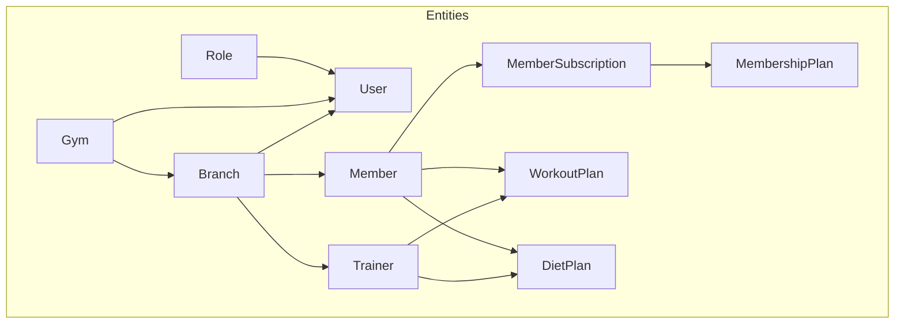
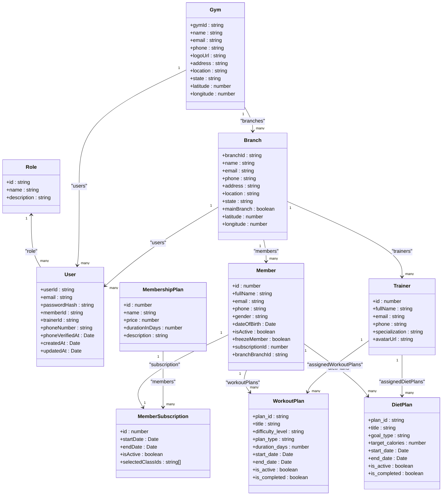
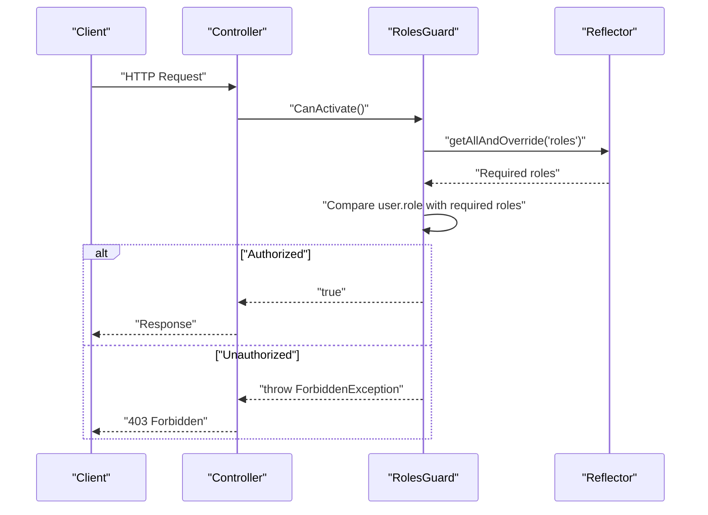
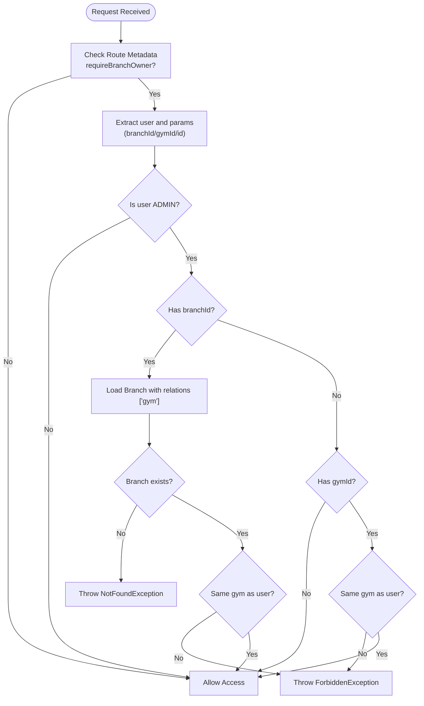
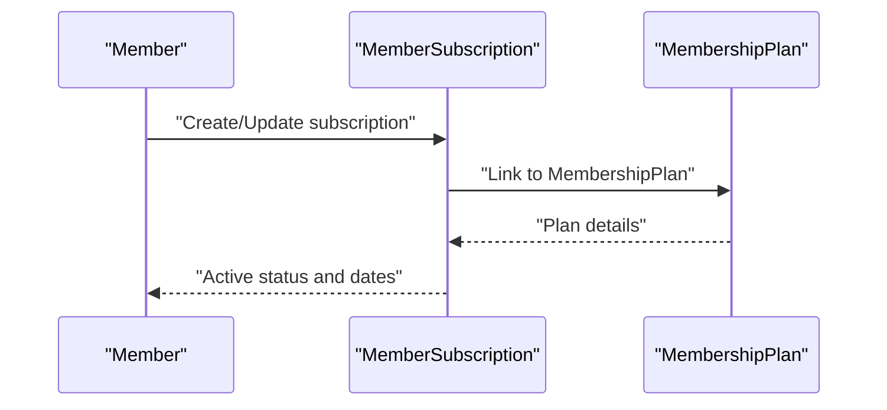
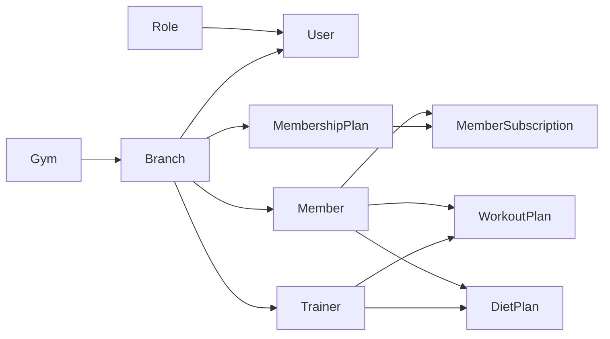

# Core Entities & Relationships

<cite>
**Referenced Files in This Document**
- [users.entity.ts](file://src/entities/users.entity.ts)
- [roles.entity.ts](file://src/entities/roles.entity.ts)
- [gym.entity.ts](file://src/entities/gym.entity.ts)
- [branch.entity.ts](file://src/entities/branch.entity.ts)
- [members.entity.ts](file://src/entities/members.entity.ts)
- [trainers.entity.ts](file://src/entities/trainers.entity.ts)
- [member_subscriptions.entity.ts](file://src/entities/member_subscriptions.entity.ts)
- [membership_plans.entity.ts](file://src/entities/membership_plans.entity.ts)
- [workout_plans.entity.ts](file://src/entities/workout_plans.entity.ts)
- [diet_plans.entity.ts](file://src/entities/diet_plans.entity.ts)
- [role.enum.ts](file://src/common/enums/role.enum.ts)
- [permissions.enum.ts](file://src/common/enums/permissions.enum.ts)
- [roles.guard.ts](file://src/auth/guards/roles.guard.ts)
- [branch-access.guard.ts](file://src/auth/guards/branch-access.guard.ts)
- [roles.decorator.ts](file://src/auth/decorators/roles.decorator.ts)
- [auth-jwtPayload.d.ts](file://src/auth/types/auth-jwtPayload.d.ts)
</cite>

## Table of Contents
1. [Introduction](#introduction)
2. [Project Structure](#project-structure)
3. [Core Components](#core-components)
4. [Architecture Overview](#architecture-overview)
5. [Detailed Component Analysis](#detailed-component-analysis)
6. [Dependency Analysis](#dependency-analysis)
7. [Performance Considerations](#performance-considerations)
8. [Troubleshooting Guide](#troubleshooting-guide)
9. [Conclusion](#conclusion)
10. [Appendices](#appendices)

## Introduction
This document describes the core data model for the gym management system, focusing on Users, Roles, Gym, Branch, Members, and Trainers. It explains primary and foreign keys, multi-tenancy via Gym/Branch relationships, hierarchical location associations, role-based access control (RBAC), and referential integrity. It also outlines common queries and data access patterns for each entity.

## Project Structure
The data model is implemented using TypeORM entities under src/entities, with RBAC implemented via decorators and guards in src/auth. Enums define roles and permissions centrally.

**Diagram sources**
- [users.entity.ts:14-51](file://src/entities/users.entity.ts#L14-L51)
- [roles.entity.ts:4-17](file://src/entities/roles.entity.ts#L4-L17)
- [gym.entity.ts:12-55](file://src/entities/gym.entity.ts#L12-L55)
- [branch.entity.ts:18-78](file://src/entities/branch.entity.ts#L18-L78)
- [members.entity.ts:22-123](file://src/entities/members.entity.ts#L22-L123)
- [trainers.entity.ts:4-26](file://src/entities/trainers.entity.ts#L4-L26)
- [member_subscriptions.entity.ts:14-70](file://src/entities/member_subscriptions.entity.ts#L14-L70)
- [membership_plans.entity.ts:11-33](file://src/entities/membership_plans.entity.ts#L11-L33)
- [workout_plans.entity.ts:15-72](file://src/entities/workout_plans.entity.ts#L15-L72)
- [diet_plans.entity.ts:15-94](file://src/entities/diet_plans.entity.ts#L15-L94)

**Section sources**
- [users.entity.ts:14-51](file://src/entities/users.entity.ts#L14-L51)
- [roles.entity.ts:4-17](file://src/entities/roles.entity.ts#L4-L17)
- [gym.entity.ts:12-55](file://src/entities/gym.entity.ts#L12-L55)
- [branch.entity.ts:18-78](file://src/entities/branch.entity.ts#L18-L78)
- [members.entity.ts:22-123](file://src/entities/members.entity.ts#L22-L123)
- [trainers.entity.ts:4-26](file://src/entities/trainers.entity.ts#L4-L26)
- [member_subscriptions.entity.ts:14-70](file://src/entities/member_subscriptions.entity.ts#L14-L70)
- [membership_plans.entity.ts:11-33](file://src/entities/membership_plans.entity.ts#L11-L33)
- [workout_plans.entity.ts:15-72](file://src/entities/workout_plans.entity.ts#L15-L72)
- [diet_plans.entity.ts:15-94](file://src/entities/diet_plans.entity.ts#L15-L94)

## Core Components
This section documents the core entities, their fields, data types, constraints, and relationships.

- Users
  - Purpose: System users with role assignment and optional association to Gym and Branch.
  - Primary key: userId (UUID).
  - Foreign keys: role.id (Role), optionally gym.gymId (Gym), optionally branch.branchId (Branch).
  - Notable fields: email (unique), passwordHash, memberId, trainerId, phoneNumber (unique), phoneVerifiedAt, timestamps.
  - Validation rules: email uniqueness; optional phone number with uniqueness constraint; role is required.
  - Access pattern: Users are filtered by gymId/branchId for multi-tenancy; RBAC enforced via Role and permissions.

- Roles
  - Purpose: Defines user roles (SUPERADMIN, ADMIN, TRAINER, MEMBER).
  - Primary key: id (UUID).
  - Fields: name (unique), description.
  - Relationships: One-to-many with User.

- Gym
  - Purpose: Multi-tenant tenant container.
  - Primary key: gymId (UUID).
  - Fields: name, email (unique), phone, logoUrl, address, location, state, latitude, longitude; timestamps.
  - Relationships: One-to-many with Branch and User.

- Branch
  - Purpose: Location-level tenant unit within a Gym.
  - Primary key: branchId (UUID).
  - Fields: name, email, phone, address, location, state, mainBranch (boolean), latitude, longitude; timestamps.
  - Relationships: Many-to-one with Gym; one-to-many with User, Member, Trainer, Class, Inquiry.

- Members
  - Purpose: Gym members with profile, subscription linkage, and activity records.
  - Primary key: id (auto-increment integer).
  - Unique constraints: email, subscriptionId.
  - Fields: fullName, email (unique), phone, gender (enum), dateOfBirth, address parts, avatarUrl, attachmentUrl, emergency contacts, isActive (default true), freezeMember (default false), timestamps, subscriptionId (nullable), branchBranchId (nullable), is_managed_by_member (default true).
  - Relationships: One-to-one with MemberSubscription via subscriptionId; Many-to-one with Branch via branchBranchId; one-to-many with Attendance, AttendanceGoal, WorkoutPlan, DietPlan, ProgressTracking.

- Trainers
  - Purpose: Staff members assigned to a Branch.
  - Primary key: id (auto-increment integer).
  - Fields: fullName, email (unique), phone, specialization, avatarUrl.
  - Relationships: Many-to-one with Branch.

- Membership Plans
  - Purpose: Plan definitions linked to Branch.
  - Primary key: id (auto-increment integer).
  - Fields: name, price (int), durationInDays (int), description, optional branchId.
  - Relationships: Many-to-one with Branch; one-to-many with MemberSubscription.

- Member Subscriptions
  - Purpose: Active subscription record linking Member to MembershipPlan.
  - Primary key: id (auto-increment integer).
  - Fields: startDate, endDate (timestamps), isActive (default true), selectedClassIds (UUID array, nullable).
  - Relationships: One-to-one with Member; many-to-one with MembershipPlan.

- Workout Plans
  - Purpose: Exercise plans assigned to Members, optionally by Trainers at Branch level.
  - Primary key: plan_id (UUID).
  - Fields: title, description, difficulty_level (enum), plan_type (enum), duration_days, start_date, end_date, is_active, is_completed, notes, timestamps, optional branchId, optional assigned_by_trainer.
  - Relationships: Many-to-one with Member, optional Trainer, optional Branch; one-to-many with WorkoutPlanExercise.

- Diet Plans
  - Purpose: Nutrition plans assigned to Members, optionally by Trainers at Branch level.
  - Primary key: plan_id (UUID).
  - Fields: title, description, goal_type (enum), target_calories, target_protein/target_carbs/target_fat, start_date, end_date, is_active, is_completed, notes, timestamps, template fields (template_id, is_template, usage_count, parent_template_id, version), optional branchId, optional assigned_by_trainer.
  - Relationships: Many-to-one with Member, optional Trainer, optional Branch; one-to-many with DietPlanMeal.

**Section sources**
- [users.entity.ts:14-51](file://src/entities/users.entity.ts#L14-L51)
- [roles.entity.ts:4-17](file://src/entities/roles.entity.ts#L4-L17)
- [gym.entity.ts:12-55](file://src/entities/gym.entity.ts#L12-L55)
- [branch.entity.ts:18-78](file://src/entities/branch.entity.ts#L18-L78)
- [members.entity.ts:22-123](file://src/entities/members.entity.ts#L22-L123)
- [trainers.entity.ts:4-26](file://src/entities/trainers.entity.ts#L4-L26)
- [membership_plans.entity.ts:11-33](file://src/entities/membership_plans.entity.ts#L11-L33)
- [member_subscriptions.entity.ts:14-70](file://src/entities/member_subscriptions.entity.ts#L14-L70)
- [workout_plans.entity.ts:15-72](file://src/entities/workout_plans.entity.ts#L15-L72)
- [diet_plans.entity.ts:15-94](file://src/entities/diet_plans.entity.ts#L15-L94)

## Architecture Overview
The system enforces multi-tenancy through a two-tier hierarchy: Gym (tenant) and Branch (location). Users are associated with a single Gym and Branch (optional). Roles and permissions govern access to resources and actions. Guards enforce both role-based and branch-level access constraints.

**Diagram sources**
- [users.entity.ts:14-51](file://src/entities/users.entity.ts#L14-L51)
- [roles.entity.ts:4-17](file://src/entities/roles.entity.ts#L4-L17)
- [gym.entity.ts:12-55](file://src/entities/gym.entity.ts#L12-L55)
- [branch.entity.ts:18-78](file://src/entities/branch.entity.ts#L18-L78)
- [members.entity.ts:22-123](file://src/entities/members.entity.ts#L22-L123)
- [trainers.entity.ts:4-26](file://src/entities/trainers.entity.ts#L4-L26)
- [membership_plans.entity.ts:11-33](file://src/entities/membership_plans.entity.ts#L11-L33)
- [member_subscriptions.entity.ts:14-70](file://src/entities/member_subscriptions.entity.ts#L14-L70)
- [workout_plans.entity.ts:15-72](file://src/entities/workout_plans.entity.ts#L15-L72)
- [diet_plans.entity.ts:15-94](file://src/entities/diet_plans.entity.ts#L15-L94)

## Detailed Component Analysis

### Users and Roles
- Role model: Role defines role names and reverse relation to User.
- User model: Links to Role (required), optionally to Gym and Branch; supports memberId/trainerId for cross-entity references; enforces email uniqueness and optional phone uniqueness.
- RBAC enforcement: RolesGuard reads required roles from route metadata and compares against the authenticated user’s role. The decorator sets metadata for routes.

**Diagram sources**
- [roles.guard.ts:12-41](file://src/auth/guards/roles.guard.ts#L12-L41)
- [roles.decorator.ts:5-7](file://src/auth/decorators/roles.decorator.ts#L5-L7)
- [auth-jwtPayload.d.ts:1-5](file://src/auth/types/auth-jwtPayload.d.ts#L1-L5)

**Section sources**
- [roles.entity.ts:4-17](file://src/entities/roles.entity.ts#L4-L17)
- [users.entity.ts:14-51](file://src/entities/users.entity.ts#L14-L51)
- [roles.guard.ts:12-41](file://src/auth/guards/roles.guard.ts#L12-L41)
- [roles.decorator.ts:5-7](file://src/auth/decorators/roles.decorator.ts#L5-L7)
- [auth-jwtPayload.d.ts:1-5](file://src/auth/types/auth-jwtPayload.d.ts#L1-L5)

### Multi-Tenant Architecture: Gym and Branch
- Hierarchical relationship: Branch belongs to Gym; User, Member, Trainer belong to Branch; MemberSubscription links Member to MembershipPlan; MembershipPlan optionally belongs to Branch.
- Access control: BranchAccessGuard ensures admins can only operate within their own Gym/branch; superadmins bypass checks.

**Diagram sources**
- [branch-access.guard.ts:14-72](file://src/auth/guards/branch-access.guard.ts#L14-L72)

**Section sources**
- [branch.entity.ts:18-78](file://src/entities/branch.entity.ts#L18-L78)
- [gym.entity.ts:12-55](file://src/entities/gym.entity.ts#L12-L55)
- [branch-access.guard.ts:14-72](file://src/auth/guards/branch-access.guard.ts#L14-L72)

### Members and Subscriptions
- Member holds profile and constraints; subscriptionId is unique and links to MemberSubscription.
- MemberSubscription links Member to MembershipPlan with dates and activity flag; supports selectedClassIds array.

**Diagram sources**
- [members.entity.ts:22-123](file://src/entities/members.entity.ts#L22-L123)
- [member_subscriptions.entity.ts:14-70](file://src/entities/member_subscriptions.entity.ts#L14-L70)
- [membership_plans.entity.ts:11-33](file://src/entities/membership_plans.entity.ts#L11-L33)

**Section sources**
- [members.entity.ts:22-123](file://src/entities/members.entity.ts#L22-L123)
- [member_subscriptions.entity.ts:14-70](file://src/entities/member_subscriptions.entity.ts#L14-L70)
- [membership_plans.entity.ts:11-33](file://src/entities/membership_plans.entity.ts#L11-L33)

### Trainers
- Trainer belongs to Branch; can be linked to Member via WorkoutPlan/DietPlan assignments.

**Section sources**
- [trainers.entity.ts:4-26](file://src/entities/trainers.entity.ts#L4-L26)

### Workout Plans and Diet Plans
- Both belong to Member and optionally to Trainer and Branch; support lifecycle flags and metadata.

**Section sources**
- [workout_plans.entity.ts:15-72](file://src/entities/workout_plans.entity.ts#L15-L72)
- [diet_plans.entity.ts:15-94](file://src/entities/diet_plans.entity.ts#L15-L94)

## Dependency Analysis
- Coupling: Users depend on Role; Users/Member/Trainer depend on Branch; Branch depends on Gym; MembershipPlan optionally depends on Branch; MemberSubscription depends on Member and MembershipPlan; WorkoutPlan/DietPlan depend on Member, Trainer, and Branch.
- Cohesion: Entities encapsulate domain concerns; relationships are explicit and navigable.
- Integrity: Unique constraints on email and subscriptionId; optional cascades on dependent records; branch deletion cascades to related entities per entity definitions.

**Diagram sources**
- [users.entity.ts:14-51](file://src/entities/users.entity.ts#L14-L51)
- [roles.entity.ts:4-17](file://src/entities/roles.entity.ts#L4-L17)
- [gym.entity.ts:12-55](file://src/entities/gym.entity.ts#L12-L55)
- [branch.entity.ts:18-78](file://src/entities/branch.entity.ts#L18-L78)
- [members.entity.ts:22-123](file://src/entities/members.entity.ts#L22-L123)
- [trainers.entity.ts:4-26](file://src/entities/trainers.entity.ts#L4-L26)
- [membership_plans.entity.ts:11-33](file://src/entities/membership_plans.entity.ts#L11-L33)
- [member_subscriptions.entity.ts:14-70](file://src/entities/member_subscriptions.entity.ts#L14-L70)
- [workout_plans.entity.ts:15-72](file://src/entities/workout_plans.entity.ts#L15-L72)
- [diet_plans.entity.ts:15-94](file://src/entities/diet_plans.entity.ts#L15-L94)

**Section sources**
- [users.entity.ts:14-51](file://src/entities/users.entity.ts#L14-L51)
- [roles.entity.ts:4-17](file://src/entities/roles.entity.ts#L4-L17)
- [gym.entity.ts:12-55](file://src/entities/gym.entity.ts#L12-L55)
- [branch.entity.ts:18-78](file://src/entities/branch.entity.ts#L18-L78)
- [members.entity.ts:22-123](file://src/entities/members.entity.ts#L22-L123)
- [trainers.entity.ts:4-26](file://src/entities/trainers.entity.ts#L4-L26)
- [membership_plans.entity.ts:11-33](file://src/entities/membership_plans.entity.ts#L11-L33)
- [member_subscriptions.entity.ts:14-70](file://src/entities/member_subscriptions.entity.ts#L14-L70)
- [workout_plans.entity.ts:15-72](file://src/entities/workout_plans.entity.ts#L15-L72)
- [diet_plans.entity.ts:15-94](file://src/entities/diet_plans.entity.ts#L15-L94)

## Performance Considerations
- Indexing: Ensure unique indexes on email, phoneNumber, subscriptionId, and branchId fields to optimize lookups.
- Eager loading: Role is loaded eagerly for Users; consider lazy loading where appropriate to reduce payload size.
- Cascading deletes: Review cascade behavior for dependent entities to avoid unintended deletions during branch or member removal.
- Pagination: For lists of Users, Members, and Trainers, implement server-side pagination to limit response sizes.

## Troubleshooting Guide
- Authentication/Authorization failures:
  - Verify user role presence and correct role name mapping.
  - Confirm route metadata includes required roles via the Roles decorator.
- Branch access violations:
  - Ensure admins operate within their assigned gym; branch ownership checks occur in the BranchAccessGuard.
- Data integrity errors:
  - Unique constraint violations on email, phone, subscriptionId will cause errors; validate inputs before persistence.
- Subscription linkage:
  - Ensure Member.subscriptionId matches MemberSubscription.id; mismatch leads to orphaned records.

**Section sources**
- [roles.guard.ts:12-41](file://src/auth/guards/roles.guard.ts#L12-L41)
- [branch-access.guard.ts:14-72](file://src/auth/guards/branch-access.guard.ts#L14-L72)
- [members.entity.ts:22-123](file://src/entities/members.entity.ts#L22-L123)
- [member_subscriptions.entity.ts:14-70](file://src/entities/member_subscriptions.entity.ts#L14-L70)

## Conclusion
The core data model establishes a clear multi-tenancy hierarchy with Gym and Branch, robust RBAC via Roles and permissions, and strong referential integrity across Users, Members, Trainers, and their related plans. Guards enforce access policies consistently, while unique constraints and cascading relationships maintain data quality.

## Appendices

### Role-Based Access Control Summary
- Roles: SUPERADMIN, ADMIN, TRAINER, MEMBER.
- Permissions: Fine-grained permissions for gyms, branches, members, trainers, charts, diets, and goals.
- Mapping: SUPERADMIN has all permissions; ADMIN has broad operational permissions; TRAINER has assignment and view permissions; MEMBER has limited self-access.

**Section sources**
- [role.enum.ts:1-6](file://src/common/enums/role.enum.ts#L1-L6)
- [permissions.enum.ts:50-83](file://src/common/enums/permissions.enum.ts#L50-L83)

### Common Queries and Access Patterns
- Retrieve all users in a branch:
  - Filter User by branchId; optionally join with Role for permission checks.
- List members by branch:
  - Filter Member by branchBranchId; include subscription details via MemberSubscription.
- Assign a trainer to a workout plan:
  - Link Trainer to WorkoutPlan; optionally filter by Branch.
- Manage memberships:
  - Create/update MemberSubscription; link to MembershipPlan; set dates and activity flags.
- Enforce branch-level access:
  - Use BranchAccessGuard to validate admin access to requested branchId/gymId.

[No sources needed since this section provides general guidance]