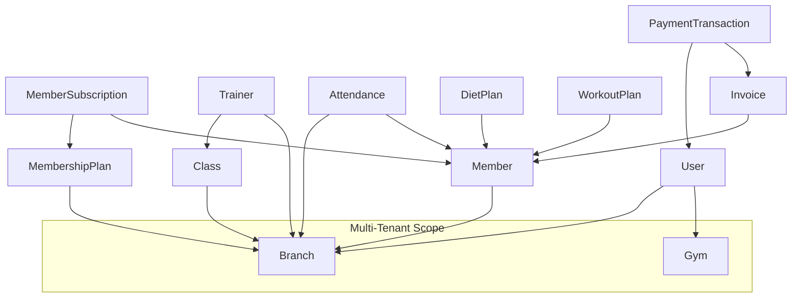
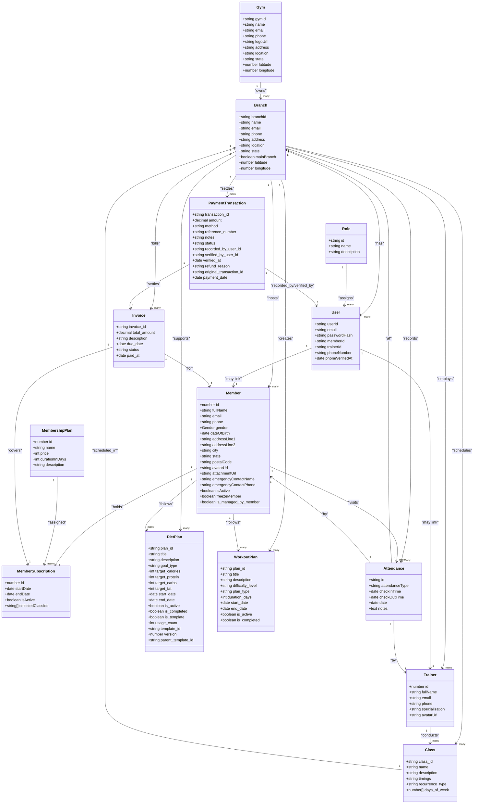
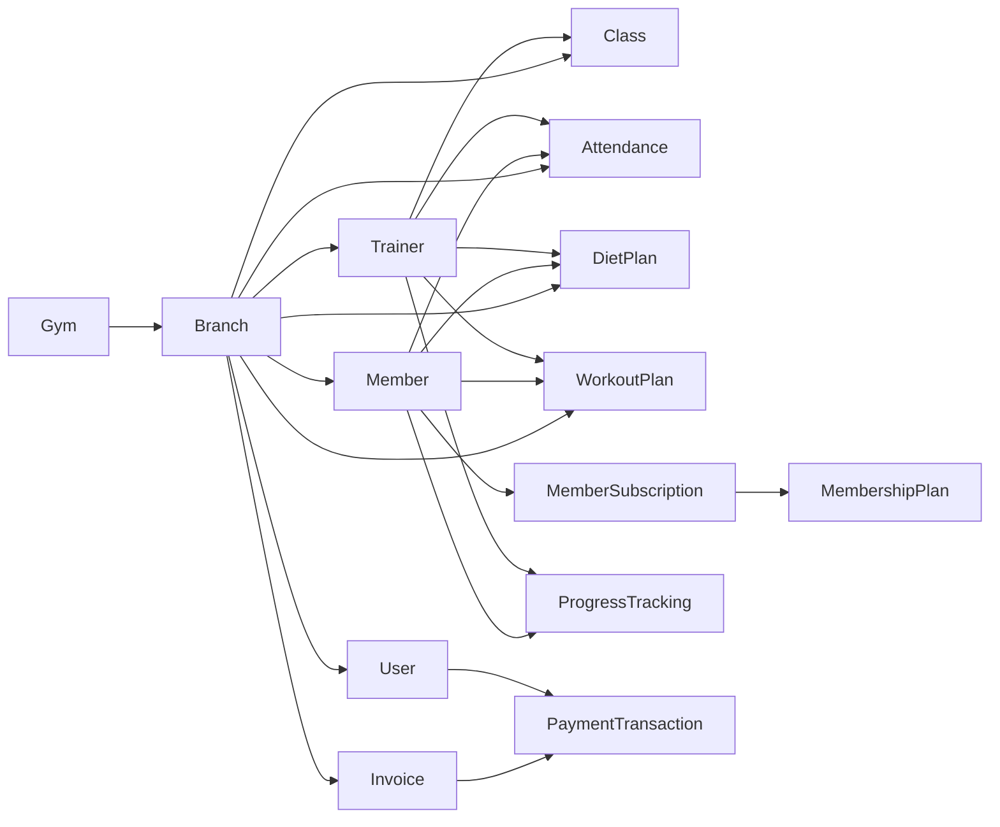

# Database Schema & Data Model

<cite>
**Referenced Files in This Document**
- [users.entity.ts](file://src/entities/users.entity.ts)
- [members.entity.ts](file://src/entities/members.entity.ts)
- [gym.entity.ts](file://src/entities/gym.entity.ts)
- [branch.entity.ts](file://src/entities/branch.entity.ts)
- [roles.entity.ts](file://src/entities/roles.entity.ts)
- [membership_plans.entity.ts](file://src/entities/membership_plans.entity.ts)
- [member_subscriptions.entity.ts](file://src/entities/member_subscriptions.entity.ts)
- [trainers.entity.ts](file://src/entities/trainers.entity.ts)
- [classes.entity.ts](file://src/entities/classes.entity.ts)
- [attendance.entity.ts](file://src/entities/attendance.entity.ts)
- [diet_plans.entity.ts](file://src/entities/diet_plans.entity.ts)
- [workout_plans.entity.ts](file://src/entities/workout_plans.entity.ts)
- [invoices.entity.ts](file://src/entities/invoices.entity.ts)
- [payment_transactions.entity.ts](file://src/entities/payment_transactions.entity.ts)
- [attendance_goals.entity.ts](file://src/entities/attendance_goals.entity.ts)
- [progress_tracking.entity.ts](file://src/entities/progress_tracking.entity.ts)
</cite>

## Table of Contents
1. [Introduction](#introduction)
2. [Project Structure](#project-structure)
3. [Core Components](#core-components)
4. [Architecture Overview](#architecture-overview)
5. [Detailed Component Analysis](#detailed-component-analysis)
6. [Dependency Analysis](#dependency-analysis)
7. [Performance Considerations](#performance-considerations)
8. [Troubleshooting Guide](#troubleshooting-guide)
9. [Conclusion](#conclusion)
10. [Appendices](#appendices)

## Introduction
This document provides comprehensive data model documentation for the gym management system. It details entity relationships, field definitions, data types, primary and foreign keys, indexes, and constraints across core entities. It also explains the multi-tenant architecture implemented via gyms and branches, data validation and business rules, referential integrity, access patterns, performance considerations, lifecycle management, and security controls. Finally, it includes diagrams, query examples, and reporting scenarios.

## Project Structure
The database schema is defined using TypeORM entities located under src/entities. Each entity corresponds to a table and encapsulates columns, relationships, and metadata. The schema supports a multi-tenant model centered around gyms and branches, with users, members, trainers, classes, plans, attendance, invoices, and payments.

**Diagram sources**
- [gym.entity.ts:12-56](file://src/entities/gym.entity.ts#L12-L56)
- [branch.entity.ts:18-79](file://src/entities/branch.entity.ts#L18-L79)
- [users.entity.ts:14-52](file://src/entities/users.entity.ts#L14-L52)
- [members.entity.ts:22-124](file://src/entities/members.entity.ts#L22-L124)
- [membership_plans.entity.ts:11-34](file://src/entities/membership_plans.entity.ts#L11-L34)
- [member_subscriptions.entity.ts:14-71](file://src/entities/member_subscriptions.entity.ts#L14-L71)
- [trainers.entity.ts:4-27](file://src/entities/trainers.entity.ts#L4-L27)
- [classes.entity.ts:5-40](file://src/entities/classes.entity.ts#L5-L40)
- [attendance.entity.ts:12-44](file://src/entities/attendance.entity.ts#L12-L44)
- [diet_plans.entity.ts:15-95](file://src/entities/diet_plans.entity.ts#L15-L95)
- [workout_plans.entity.ts:15-73](file://src/entities/workout_plans.entity.ts#L15-L73)
- [invoices.entity.ts:13-49](file://src/entities/invoices.entity.ts#L13-L49)
- [payment_transactions.entity.ts:12-74](file://src/entities/payment_transactions.entity.ts#L12-L74)

**Section sources**
- [gym.entity.ts:12-56](file://src/entities/gym.entity.ts#L12-L56)
- [branch.entity.ts:18-79](file://src/entities/branch.entity.ts#L18-L79)
- [users.entity.ts:14-52](file://src/entities/users.entity.ts#L14-L52)
- [members.entity.ts:22-124](file://src/entities/members.entity.ts#L22-L124)
- [membership_plans.entity.ts:11-34](file://src/entities/membership_plans.entity.ts#L11-L34)
- [member_subscriptions.entity.ts:14-71](file://src/entities/member_subscriptions.entity.ts#L14-L71)
- [trainers.entity.ts:4-27](file://src/entities/trainers.entity.ts#L4-L27)
- [classes.entity.ts:5-40](file://src/entities/classes.entity.ts#L5-L40)
- [attendance.entity.ts:12-44](file://src/entities/attendance.entity.ts#L12-L44)
- [diet_plans.entity.ts:15-95](file://src/entities/diet_plans.entity.ts#L15-L95)
- [workout_plans.entity.ts:15-73](file://src/entities/workout_plans.entity.ts#L15-L73)
- [invoices.entity.ts:13-49](file://src/entities/invoices.entity.ts#L13-L49)
- [payment_transactions.entity.ts:12-74](file://src/entities/payment_transactions.entity.ts#L12-L74)

## Core Components
This section summarizes each core entity’s purpose, primary keys, and key relationships.

- Users
  - Purpose: Authentication and authorization for gyms, branches, members, and trainers.
  - PK: userId (UUID)
  - Relationships: belongs to Gym, Branch, Role; optional memberId/trainerId; linked to Member/Trainer.
  - Constraints: unique email; optional unique phone; timestamps.

- Members
  - Purpose: Customer profiles, demographics, and lifecycle (active/frozen).
  - PK: id (auto-increment)
  - Relationships: branch via branchBranchId; subscription via subscriptionId; attendance/goals/plans/progress records.
  - Constraints: unique email; unique subscriptionId; defaults for booleans; branch and subscription joins.

- Gyms
  - Purpose: Multi-tenant tenant container.
  - PK: gymId (UUID)
  - Relationships: branches, users.
  - Constraints: name required; optional contact info; geo fields.

- Branches
  - Purpose: Tenant subdivision; holds users, members, trainers, classes, inquiries.
  - PK: branchId (UUID)
  - Relationships: gym (parent); users, members, trainers, classes, inquiries.
  - Constraints: name required; optional contact info; mainBranch flag; geo fields.

- Roles
  - Purpose: Authorization model (e.g., SUPERADMIN, ADMIN, TRAINER, MEMBER).
  - PK: id (UUID)
  - Relationships: users.

- Membership Plans
  - Purpose: Plan definitions per branch (name, price, duration).
  - PK: id (auto-increment)
  - Relationships: branch; member_subscriptions.

- Member Subscriptions
  - Purpose: Active membership records linking Member to MembershipPlan.
  - PK: id (auto-increment)
  - Relationships: Member (one-to-one), MembershipPlan (many-to-one).
  - Constraints: dates, isActive flag; selectedClassIds array.

- Trainers
  - Purpose: Staff profiles and specializations.
  - PK: id (auto-increment)
  - Relationships: branch.
  - Constraints: unique email; optional phone/specialization/avatar.

- Classes
  - Purpose: Group fitness sessions scheduled by branch and trainer.
  - PK: class_id (UUID)
  - Relationships: branch, trainer.
  - Constraints: timings and recurrence metadata.

- Attendance
  - Purpose: Track check-in/check-out for members/trainers.
  - PK: id (UUID)
  - Relationships: member, trainer, branch.
  - Constraints: attendanceType enum; timestamps; date.

- Diet Plans
  - Purpose: Nutrition plans per member with goals and macros.
  - PK: plan_id (UUID)
  - Relationships: member, trainer, branch; meals.
  - Constraints: goal_type enum; macro targets; template/version fields.

- Workout Plans
  - Purpose: Exercise plans per member with difficulty/type.
  - PK: plan_id (UUID)
  - Relationships: member, trainer, branch; exercises.
  - Constraints: difficulty and type enums; dates; flags.

- Invoices
  - Purpose: Billing records tied to members and subscriptions.
  - PK: invoice_id (UUID)
  - Relationships: member, subscription; payments.
  - Constraints: amount precision/scale; status enum; due/paid dates.

- Payment Transactions
  - Purpose: Payment records with methods, statuses, and audit trail.
  - PK: transaction_id (UUID)
  - Relationships: invoice; recorded_by/verified_by users.
  - Constraints: amount precision/scale; method/status enums; refund/original linkage.

**Section sources**
- [users.entity.ts:14-52](file://src/entities/users.entity.ts#L14-L52)
- [members.entity.ts:22-124](file://src/entities/members.entity.ts#L22-L124)
- [gym.entity.ts:12-56](file://src/entities/gym.entity.ts#L12-L56)
- [branch.entity.ts:18-79](file://src/entities/branch.entity.ts#L18-L79)
- [roles.entity.ts:4-18](file://src/entities/roles.entity.ts#L4-L18)
- [membership_plans.entity.ts:11-34](file://src/entities/membership_plans.entity.ts#L11-L34)
- [member_subscriptions.entity.ts:14-71](file://src/entities/member_subscriptions.entity.ts#L14-L71)
- [trainers.entity.ts:4-27](file://src/entities/trainers.entity.ts#L4-L27)
- [classes.entity.ts:5-40](file://src/entities/classes.entity.ts#L5-L40)
- [attendance.entity.ts:12-44](file://src/entities/attendance.entity.ts#L12-L44)
- [diet_plans.entity.ts:15-95](file://src/entities/diet_plans.entity.ts#L15-L95)
- [workout_plans.entity.ts:15-73](file://src/entities/workout_plans.entity.ts#L15-L73)
- [invoices.entity.ts:13-49](file://src/entities/invoices.entity.ts#L13-L49)
- [payment_transactions.entity.ts:12-74](file://src/entities/payment_transactions.entity.ts#L12-L74)

## Architecture Overview
The system follows a multi-tenant architecture:
- Gym is the top-level tenant.
- Branch belongs to a Gym and aggregates Users, Members, Trainers, Classes, and Inquiries.
- Users belong to a Gym and Branch and are linked to Roles.
- Members are linked to a Branch and a Subscription.
- Subscriptions link Members to MembershipPlans scoped to a Branch.
- Trainers are linked to a Branch.
- Classes are linked to a Branch and optionally a Trainer.
- Attendance tracks visits by Member/Trainer at a Branch.
- Plans (Workout/Diet) are owned by Members with optional Trainer/Branch linkage.
- Invoices and Payments form the financial workflow.

**Diagram sources**
- [gym.entity.ts:12-56](file://src/entities/gym.entity.ts#L12-L56)
- [branch.entity.ts:18-79](file://src/entities/branch.entity.ts#L18-L79)
- [users.entity.ts:14-52](file://src/entities/users.entity.ts#L14-L52)
- [members.entity.ts:22-124](file://src/entities/members.entity.ts#L22-L124)
- [membership_plans.entity.ts:11-34](file://src/entities/membership_plans.entity.ts#L11-L34)
- [member_subscriptions.entity.ts:14-71](file://src/entities/member_subscriptions.entity.ts#L14-L71)
- [trainers.entity.ts:4-27](file://src/entities/trainers.entity.ts#L4-L27)
- [classes.entity.ts:5-40](file://src/entities/classes.entity.ts#L5-L40)
- [attendance.entity.ts:12-44](file://src/entities/attendance.entity.ts#L12-L44)
- [diet_plans.entity.ts:15-95](file://src/entities/diet_plans.entity.ts#L15-L95)
- [workout_plans.entity.ts:15-73](file://src/entities/workout_plans.entity.ts#L15-L73)
- [invoices.entity.ts:13-49](file://src/entities/invoices.entity.ts#L13-L49)
- [payment_transactions.entity.ts:12-74](file://src/entities/payment_transactions.entity.ts#L12-L74)

## Detailed Component Analysis

### Users
- Purpose: Central identity and access control.
- PK: userId (UUID)
- FKs: gymId (nullable), branchId (nullable), roleId (non-nullable, eager).
- Indexes/Constraints: unique email; optional unique phone; memberId/trainerId optional; timestamps.
- Access control: Role-based permissions; branch-level visibility enforced by guards.

**Section sources**
- [users.entity.ts:14-52](file://src/entities/users.entity.ts#L14-L52)

### Members
- Purpose: Customer profile and lifecycle.
- PK: id (auto-increment)
- FKs: branchBranchId -> Branch.branchId; subscriptionId -> MemberSubscription.id (unique).
- Indexes/Constraints: unique email; unique subscriptionId; defaults for booleans; branch managed flag.
- Cascade: subscription, attendance, goals, plans, progress.

**Section sources**
- [members.entity.ts:22-124](file://src/entities/members.entity.ts#L22-L124)

### Gyms
- Purpose: Multi-tenant container.
- PK: gymId (UUID)
- Relationships: branches, users.

**Section sources**
- [gym.entity.ts:12-56](file://src/entities/gym.entity.ts#L12-L56)

### Branches
- Purpose: Tenant subdivision; hosts users, members, trainers, classes, inquiries.
- PK: branchId (UUID)
- FK: gymId -> Gym.gymId (onDelete CASCADE).
- Relationships: users, members, trainers, classes, inquiries.

**Section sources**
- [branch.entity.ts:18-79](file://src/entities/branch.entity.ts#L18-L79)

### Roles
- Purpose: Authorization model.
- PK: id (UUID)
- Constraints: unique name.

**Section sources**
- [roles.entity.ts:4-18](file://src/entities/roles.entity.ts#L4-L18)

### Membership Plans
- Purpose: Plan definitions per branch.
- PK: id (auto-increment)
- FK: branchId -> Branch.branchId (nullable).
- Relationships: member_subscriptions.

**Section sources**
- [membership_plans.entity.ts:11-34](file://src/entities/membership_plans.entity.ts#L11-L34)

### Member Subscriptions
- Purpose: Active membership records.
- PK: id (auto-increment)
- FKs: member.id -> Member.subscriptionId (one-to-one, cascade delete); plan.id -> MembershipPlan.id.
- Constraints: dates, isActive flag; selectedClassIds array of UUIDs.

**Section sources**
- [member_subscriptions.entity.ts:14-71](file://src/entities/member_subscriptions.entity.ts#L14-L71)

### Trainers
- Purpose: Staff profiles.
- PK: id (auto-increment)
- FK: branchId -> Branch.branchId.
- Constraints: unique email; optional fields.

**Section sources**
- [trainers.entity.ts:4-27](file://src/entities/trainers.entity.ts#L4-L27)

### Classes
- Purpose: Group sessions.
- PK: class_id (UUID)
- FKs: branchId -> Branch.branchId; trainerId -> Trainer.id (optional).
- Constraints: timings and recurrence metadata.

**Section sources**
- [classes.entity.ts:5-40](file://src/entities/classes.entity.ts#L5-L40)

### Attendance
- Purpose: Visit tracking.
- PK: id (UUID)
- FKs: memberId -> Member.id (optional, cascade delete); trainerId -> Trainer.id (optional); branchId -> Branch.branchId.
- Constraints: attendanceType enum; timestamps; date.

**Section sources**
- [attendance.entity.ts:12-44](file://src/entities/attendance.entity.ts#L12-L44)

### Diet Plans
- Purpose: Nutrition plans.
- PK: plan_id (UUID)
- FKs: memberId -> Member.id (cascade delete); trainerId -> Trainer.id (optional); branchId -> Branch.branchId (optional).
- Constraints: goal_type enum; macro targets; template/version fields.

**Section sources**
- [diet_plans.entity.ts:15-95](file://src/entities/diet_plans.entity.ts#L15-L95)

### Workout Plans
- Purpose: Exercise plans.
- PK: plan_id (UUID)
- FKs: memberId -> Member.id (cascade delete); trainerId -> Trainer.id (optional); branchId -> Branch.branchId (optional).
- Constraints: difficulty and type enums; dates; flags.

**Section sources**
- [workout_plans.entity.ts:15-73](file://src/entities/workout_plans.entity.ts#L15-L73)

### Invoices
- Purpose: Billing records.
- PK: invoice_id (UUID)
- FKs: memberId -> Member.id (cascade delete); subscriptionId -> MemberSubscription.id (optional).
- Constraints: amount precision/scale; status enum; due/paid dates.

**Section sources**
- [invoices.entity.ts:13-49](file://src/entities/invoices.entity.ts#L13-L49)

### Payment Transactions
- Purpose: Payment settlement and audit.
- PK: transaction_id (UUID)
- FKs: invoiceId -> Invoice.invoice_id (cascade delete); recorded_by_user_id/verified_by_user_id -> User.userId (optional).
- Constraints: amount precision/scale; method/status enums; refund/original linkage; payment_date.

**Section sources**
- [payment_transactions.entity.ts:12-74](file://src/entities/payment_transactions.entity.ts#L12-L74)

### Attendance Goals
- Purpose: Goal tracking for attendance metrics.
- PK: goal_id (UUID)
- FKs: memberId -> Member.id (cascade delete); branchId -> Branch.branchId (optional).
- Constraints: goal_type enum; counts and streaks; dates; flags.

**Section sources**
- [attendance_goals.entity.ts:12-55](file://src/entities/attendance_goals.entity.ts#L12-L55)

### Progress Tracking
- Purpose: Health metrics and progress photos.
- PK: progress_id (UUID)
- FKs: memberId -> Member.id (cascade delete); trainerId -> Trainer.id (optional).
- Constraints: measurements with precision/scale; flags; dates.

**Section sources**
- [progress_tracking.entity.ts:12-73](file://src/entities/progress_tracking.entity.ts#L12-L73)

## Dependency Analysis
- Multi-tenancy: Branch depends on Gym; Users/Members/Trainers/Classes/Invoices depend on Branch.
- Ownership: MemberSubscription belongs to Member; DietPlan/WorkoutPlan belong to Member; Attendance belongs to Member/Trainer/Branch.
- Financials: Invoice belongs to Member; PaymentTransaction belongs to Invoice and optionally Users.
- Enums: Attendance type, plan types/difficulty, goal types, invoice status, payment status/method.

**Diagram sources**
- [gym.entity.ts:12-56](file://src/entities/gym.entity.ts#L12-L56)
- [branch.entity.ts:18-79](file://src/entities/branch.entity.ts#L18-L79)
- [users.entity.ts:14-52](file://src/entities/users.entity.ts#L14-L52)
- [members.entity.ts:22-124](file://src/entities/members.entity.ts#L22-L124)
- [membership_plans.entity.ts:11-34](file://src/entities/membership_plans.entity.ts#L11-L34)
- [member_subscriptions.entity.ts:14-71](file://src/entities/member_subscriptions.entity.ts#L14-L71)
- [trainers.entity.ts:4-27](file://src/entities/trainers.entity.ts#L4-L27)
- [classes.entity.ts:5-40](file://src/entities/classes.entity.ts#L5-L40)
- [attendance.entity.ts:12-44](file://src/entities/attendance.entity.ts#L12-L44)
- [diet_plans.entity.ts:15-95](file://src/entities/diet_plans.entity.ts#L15-L95)
- [workout_plans.entity.ts:15-73](file://src/entities/workout_plans.entity.ts#L15-L73)
- [invoices.entity.ts:13-49](file://src/entities/invoices.entity.ts#L13-L49)
- [payment_transactions.entity.ts:12-74](file://src/entities/payment_transactions.entity.ts#L12-L74)

**Section sources**
- [gym.entity.ts:12-56](file://src/entities/gym.entity.ts#L12-L56)
- [branch.entity.ts:18-79](file://src/entities/branch.entity.ts#L18-L79)
- [users.entity.ts:14-52](file://src/entities/users.entity.ts#L14-L52)
- [members.entity.ts:22-124](file://src/entities/members.entity.ts#L22-L124)
- [membership_plans.entity.ts:11-34](file://src/entities/membership_plans.entity.ts#L11-L34)
- [member_subscriptions.entity.ts:14-71](file://src/entities/member_subscriptions.entity.ts#L14-L71)
- [trainers.entity.ts:4-27](file://src/entities/trainers.entity.ts#L4-L27)
- [classes.entity.ts:5-40](file://src/entities/classes.entity.ts#L5-L40)
- [attendance.entity.ts:12-44](file://src/entities/attendance.entity.ts#L12-L44)
- [diet_plans.entity.ts:15-95](file://src/entities/diet_plans.entity.ts#L15-L95)
- [workout_plans.entity.ts:15-73](file://src/entities/workout_plans.entity.ts#L15-L73)
- [invoices.entity.ts:13-49](file://src/entities/invoices.entity.ts#L13-L49)
- [payment_transactions.entity.ts:12-74](file://src/entities/payment_transactions.entity.ts#L12-L74)

## Performance Considerations
- Indexes and Uniques
  - Prefer unique indexes on frequently filtered columns: Users.email, Members.email, Members.subscriptionId, Trainers.email, Classes.class_id, Attendance.id, DietPlan.plan_id, WorkoutPlan.plan_id, Invoices.invoice_id, PaymentTransactions.transaction_id.
  - Enum columns (e.g., attendanceType, status, method) benefit from value-set constraints and selective indexing where queries filter heavily by these fields.
- Joins and Denormalization
  - Keep denormalized fields minimal; rely on joins for branch-level filtering.
  - Use eager relations sparingly; prefer lazy loading for large cascades (e.g., Member.subscription, Member.workoutPlans).
- Pagination and Scrolling
  - Apply OFFSET/LIMIT or cursor-based pagination for lists (Members, Attendance, Payments).
- Query Patterns
  - Aggregate queries for reports (attendance goals, progress tracking) should leverage window functions and materialized summaries where appropriate.
- Caching
  - Cache branch-level dashboards and static plan data; invalidate on write.
- Partitioning
  - Consider table partitioning by date (e.g., Attendance, PaymentTransactions) for large datasets.

## Troubleshooting Guide
- Common Integrity Issues
  - Deleting a Member cascades dependent records (subscription, plans, goals, progress). Ensure dependent records are handled before deletion.
  - Deleting a Branch cascades Users, Members, Trainers, Classes, and Inquiries. Confirm branch cleanup procedures.
- Validation Failures
  - Ensure enum values match allowed sets (e.g., attendanceType, goal_type, status, method).
  - Verify decimal scales/precisions for monetary fields.
- Audit Trail
  - PaymentTransaction maintains recorded_by and verified_by links; ensure these are populated consistently for compliance.

**Section sources**
- [member_subscriptions.entity.ts:27-31](file://src/entities/member_subscriptions.entity.ts#L27-L31)
- [branch.entity.ts:23-24](file://src/entities/branch.entity.ts#L23-L24)
- [attendance.entity.ts:17-18](file://src/entities/attendance.entity.ts#L17-L18)
- [payment_transactions.entity.ts:44-53](file://src/entities/payment_transactions.entity.ts#L44-L53)

## Conclusion
The gym management system employs a robust multi-tenant schema centered on Gyms and Branches, with clear ownership and cascading relationships. Strong referential integrity, enums, and constraints ensure data consistency. The schema supports rich reporting through Attendance Goals, Progress Tracking, and Financial workflows. Proper indexing, pagination, and caching strategies will optimize performance at scale.

## Appendices

### Data Validation Rules and Business Rules
- Users
  - Email uniqueness; optional phone uniqueness; role required; optional memberId/trainerId linkage.
- Members
  - Unique email; unique subscriptionId; defaults for booleans; branch linkage.
- Membership Plans
  - Positive price and duration; optional branch scoping.
- Member Subscriptions
  - Valid date range; isActive flag; selectedClassIds array of UUIDs.
- Attendance
  - attendanceType restricted; checkIn/Out timestamps; date grouping.
- Invoices/Payments
  - Amount precision/scale; status transitions; refund linkage; verification fields.

**Section sources**
- [users.entity.ts:25-41](file://src/entities/users.entity.ts#L25-L41)
- [members.entity.ts:35-87](file://src/entities/members.entity.ts#L35-L87)
- [membership_plans.entity.ts:19-23](file://src/entities/membership_plans.entity.ts#L19-L23)
- [member_subscriptions.entity.ts:44-69](file://src/entities/member_subscriptions.entity.ts#L44-L69)
- [attendance.entity.ts:26-36](file://src/entities/attendance.entity.ts#L26-L36)
- [invoices.entity.ts:24-38](file://src/entities/invoices.entity.ts#L24-L38)
- [payment_transactions.entity.ts:22-39](file://src/entities/payment_transactions.entity.ts#L22-L39)

### Data Lifecycle Management, Retention, and Archival
- Retention
  - Attendance and PaymentTransaction logs: retain for statutory periods (e.g., 7 years).
  - Member profiles: keep indefinitely with anonymization after closure.
- Archival
  - Archive closed subscriptions and inactive members periodically; maintain read-only archives.
- Purging
  - Implement soft-delete flags where applicable; hard purge only after retention expiry.

### Security, Privacy, and Access Control
- Multi-tenancy
  - Enforce branch-level access via guards; prevent cross-tenant reads/writes.
- PII Handling
  - Mask or encrypt sensitive fields; restrict access to authorized roles.
- Audit Logging
  - Track user actions on sensitive entities (Payments, Subscriptions).

### Example Queries and Reporting Scenarios
- Monthly Attendance Summary by Branch
  - Filter Attendance by date range and branch; group by member/trainer and compute counts.
- Revenue by Plan and Branch
  - Join Invoices with MembershipPlans and Branches; aggregate totals by plan and branch.
- Trainer Utilization
  - Count Class enrollments per Trainer within a period.
- Member Progress Trends
  - Retrieve ProgressTracking records for a Member ordered by record_date.
- Outstanding Invoices
  - Filter Invoices by status = pending and due_date < now.