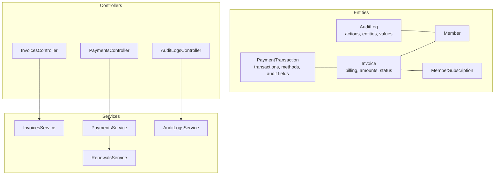
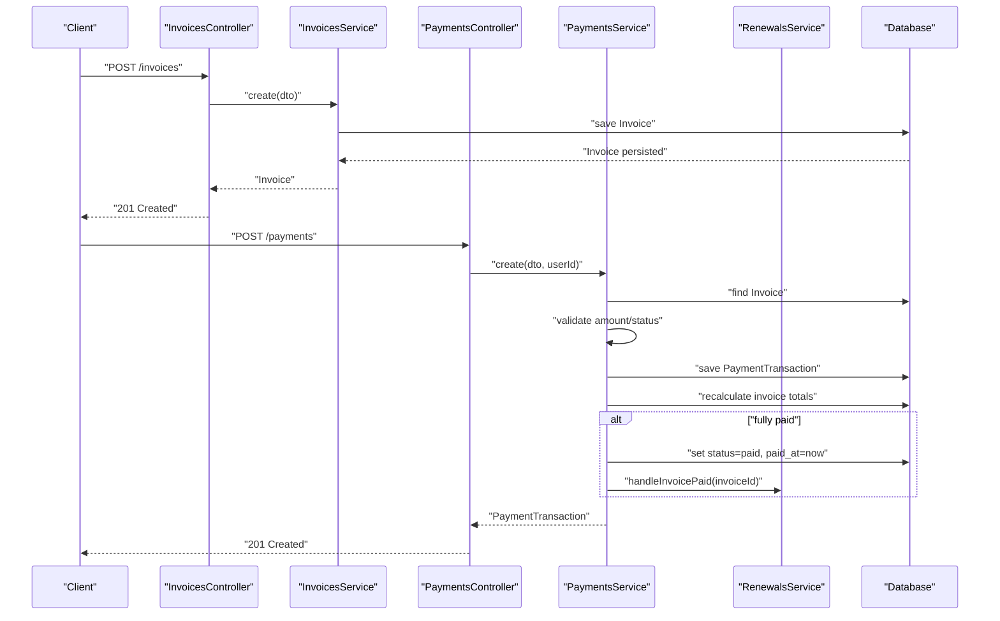
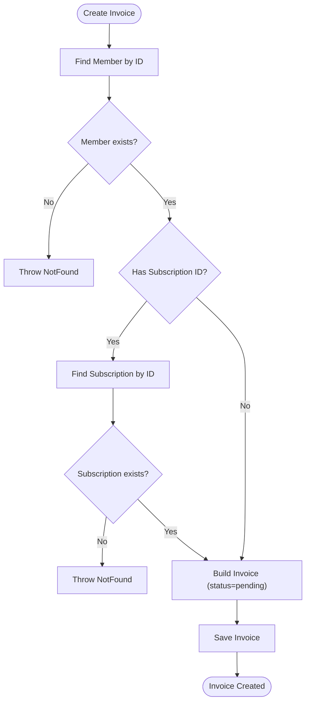
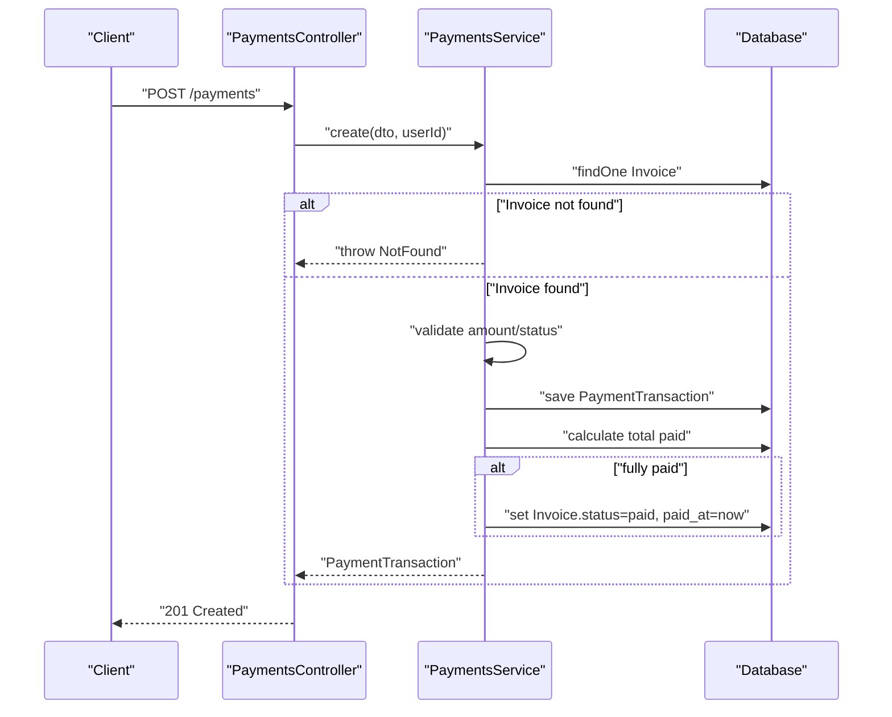
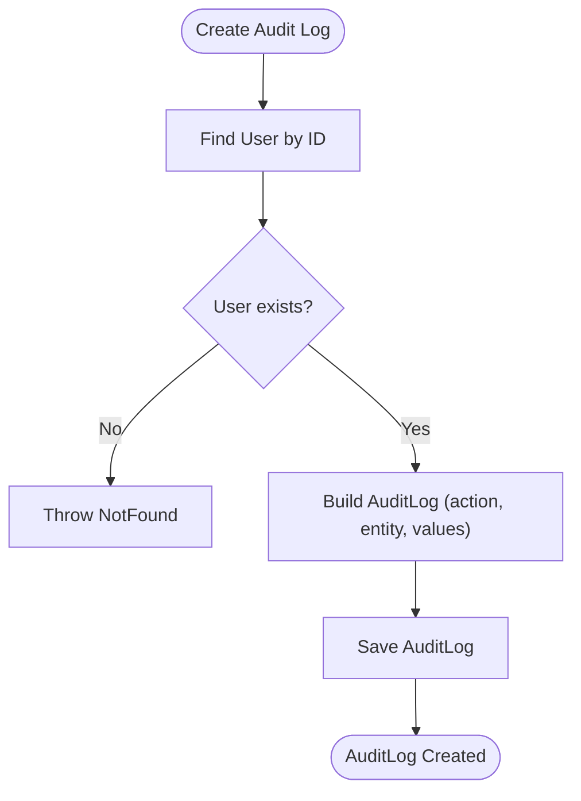
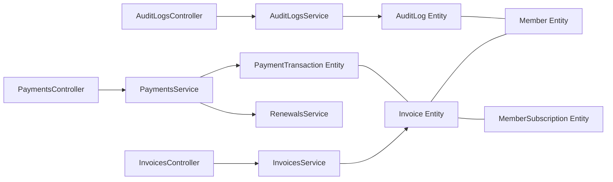

# Financial & Transaction Entities

<cite>
**Referenced Files in This Document**
- [invoices.entity.ts](file://src/entities/invoices.entity.ts)
- [payment_transactions.entity.ts](file://src/entities/payment_transactions.entity.ts)
- [audit_logs.entity.ts](file://src/entities/audit_logs.entity.ts)
- [members.entity.ts](file://src/entities/members.entity.ts)
- [member_subscriptions.entity.ts](file://src/entities/member_subscriptions.entity.ts)
- [invoices.controller.ts](file://src/invoices/invoices.controller.ts)
- [payments.controller.ts](file://src/payments/payments.controller.ts)
- [audit-logs.controller.ts](file://src/audit-logs/audit-logs.controller.ts)
- [invoices.service.ts](file://src/invoices/invoices.service.ts)
- [payments.service.ts](file://src/payments/payments.service.ts)
- [audit-logs.service.ts](file://src/audit-logs/audit-logs.service.ts)
- [create-invoice.dto.ts](file://src/invoices/dto/create-invoice.dto.ts)
- [update-invoice.dto.ts](file://src/invoices/dto/update-invoice.dto.ts)
- [create-payment.dto.ts](file://src/payments/dto/create-payment.dto.ts)
- [refund-payment.dto.ts](file://src/payments/dto/refund-payment.dto.ts)
- [create-audit-log.dto.ts](file://src/audit-logs/dto/create-audit-log.dto.ts)
- [renewals.service.ts](file://src/renewals/renewals.service.ts)
</cite>

## Table of Contents
1. [Introduction](#introduction)
2. [Project Structure](#project-structure)
3. [Core Components](#core-components)
4. [Architecture Overview](#architecture-overview)
5. [Detailed Component Analysis](#detailed-component-analysis)
6. [Dependency Analysis](#dependency-analysis)
7. [Performance Considerations](#performance-considerations)
8. [Troubleshooting Guide](#troubleshooting-guide)
9. [Conclusion](#conclusion)
10. [Appendices](#appendices)

## Introduction
This document provides comprehensive data model documentation for financial and transaction entities within the gym management system. It focuses on three core domains:
- Invoices: Billing cycles, amounts due, and payment status
- PaymentTransactions: Tracking payment processing, transaction IDs, and payment methods
- AuditLogs: Compliance tracking and activity monitoring

It also documents the relationships among invoices, payments, and audit trails, along with field definitions, validation rules, business constraints, invoicing workflow, payment processing integration points, audit trail requirements, and data access patterns for financial reporting and compliance analysis.

## Project Structure
The financial domain spans entities, controllers, services, and DTOs organized by feature:
- Entities define relational models and constraints
- Controllers expose REST endpoints with Swagger metadata
- Services encapsulate business logic and data access
- DTOs enforce validation rules and API contracts

**Diagram sources**
- [invoices.entity.ts:13-48](file://src/entities/invoices.entity.ts#L13-L48)
- [payment_transactions.entity.ts:12-73](file://src/entities/payment_transactions.entity.ts#L12-L73)
- [audit_logs.entity.ts:10-35](file://src/entities/audit_logs.entity.ts#L10-L35)
- [members.entity.ts:22-123](file://src/entities/members.entity.ts#L22-L123)
- [member_subscriptions.entity.ts:14-70](file://src/entities/member_subscriptions.entity.ts#L14-L70)
- [invoices.controller.ts:25-355](file://src/invoices/invoices.controller.ts#L25-L355)
- [payments.controller.ts:30-452](file://src/payments/payments.controller.ts#L30-L452)
- [audit-logs.controller.ts:14-326](file://src/audit-logs/audit-logs.controller.ts#L14-L326)
- [invoices.service.ts:10-118](file://src/invoices/invoices.service.ts#L10-L118)
- [payments.service.ts:16-489](file://src/payments/payments.service.ts#L16-L489)
- [audit-logs.service.ts:8-88](file://src/audit-logs/audit-logs.service.ts#L8-L88)
- [renewals.service.ts:16-178](file://src/renewals/renewals.service.ts#L16-L178)

**Section sources**
- [invoices.controller.ts:25-355](file://src/invoices/invoices.controller.ts#L25-L355)
- [payments.controller.ts:30-452](file://src/payments/payments.controller.ts#L30-L452)
- [audit-logs.controller.ts:14-326](file://src/audit-logs/audit-logs.controller.ts#L14-L326)

## Core Components
This section defines the three primary financial entities and their relationships.

- Invoice
  - Purpose: Represents a bill for a member, optionally linked to a subscription, with billing amount, due date, and status.
  - Key fields:
    - invoice_id (UUID, PK)
    - member (ManyToOne to Member)
    - subscription (ManyToOne to MemberSubscription, optional)
    - total_amount (Decimal, precision 10, scale 2)
    - description (Text, optional)
    - due_date (Date, optional)
    - status (Enum: pending, paid, cancelled)
    - paid_at (Timestamp, optional)
    - payments (OneToMany to PaymentTransaction)
    - created_at (Timestamp)
  - Constraints:
    - Status defaults to pending
    - On member delete, invoices cascade
    - Payments relationship is bidirectional

- PaymentTransaction
  - Purpose: Tracks individual payment events against an invoice, including method, status, and audit fields.
  - Key fields:
    - transaction_id (UUID, PK)
    - invoice (ManyToOne to Invoice)
    - amount (Decimal, precision 10, scale 2)
    - method (Enum: cash, card, online, bank_transfer)
    - reference_number (String, optional)
    - notes (Text, optional)
    - status (Enum: pending, completed, failed, refund)
    - recorded_by_user_id (UUID, optional)
    - recorded_by (ManyToOne to User, optional)
    - verified_by_user_id (UUID, optional)
    - verified_by (ManyToOne to User, optional)
    - verified_at (Timestamp, optional)
    - refund_reason (Text, optional)
    - original_transaction_id (UUID, optional)
    - original_transaction (ManyToOne to PaymentTransaction, self-reference)
    - payment_date (Date, optional)
    - created_at (Timestamp)
  - Constraints:
    - Status defaults to completed
    - On invoice delete, payments cascade
    - Self-reference supports refund chaining

- AuditLog
  - Purpose: Captures system actions and changes for compliance and monitoring.
  - Key fields:
    - log_id (UUID, PK)
    - user (ManyToOne to User)
    - action (String)
    - entity_type (String)
    - entity_id (String)
    - previous_values (JSONB, optional)
    - new_values (JSONB, optional)
    - timestamp (Timestamp)
  - Constraints:
    - Stores before/after snapshots for auditable changes

Relationships
- Invoice to Member: ManyToOne (member)
- Invoice to MemberSubscription: ManyToOne (optional)
- Invoice to PaymentTransaction: OneToMany (payments)
- PaymentTransaction to Invoice: ManyToOne (invoice)
- PaymentTransaction to User (recorded_by): ManyToOne (optional)
- PaymentTransaction to User (verified_by): ManyToOne (optional)
- PaymentTransaction to itself (original_transaction): ManyToOne (optional)
- AuditLog to User: ManyToOne (user)

Validation rules (DTOs)
- CreateInvoiceDto
  - memberId: integer, required
  - subscriptionId: integer, optional
  - totalAmount: number, required
  - description: string, optional
  - dueDate: date string, optional
- UpdateInvoiceDto
  - Extends CreateInvoiceDto with partial updates
- CreatePaymentDto
  - invoiceId: UUID, required
  - amount: number, required
  - method: enum [cash, card, online, bank_transfer], required
  - referenceNumber: string, optional
  - notes: string, optional
  - payment_date: date-time string, optional
  - status: enum [pending, completed], optional
- RefundPaymentDto
  - amount: number, required
  - refundMethod: enum [cash, card, bank_transfer], required
  - reason: string, required
  - notes: string, optional
- CreateAuditLogDto
  - userId: string, required
  - action: string, required
  - entityType: string, required
  - entityId: string, required
  - previousValues: object, optional
  - newValues: object, optional

Business constraints
- Invoices
  - Status transitions: pending → paid or cancelled
  - Due date and description are optional; paid_at set when fully paid
- Payments
  - Amount must not exceed invoice total; status defaults to completed
  - Pending verification requires admin approval
  - Refunds must be ≤ remaining refundable amount per original transaction
  - Invoice status recalculated after payment or refund
- Audit
  - Logged actions include user, entity, and value diffs

**Section sources**
- [invoices.entity.ts:13-48](file://src/entities/invoices.entity.ts#L13-L48)
- [payment_transactions.entity.ts:12-73](file://src/entities/payment_transactions.entity.ts#L12-L73)
- [audit_logs.entity.ts:10-35](file://src/entities/audit_logs.entity.ts#L10-L35)
- [create-invoice.dto.ts:11-39](file://src/invoices/dto/create-invoice.dto.ts#L11-L39)
- [update-invoice.dto.ts:4-4](file://src/invoices/dto/update-invoice.dto.ts#L4-L4)
- [create-payment.dto.ts:12-68](file://src/payments/dto/create-payment.dto.ts#L12-L68)
- [refund-payment.dto.ts:4-28](file://src/payments/dto/refund-payment.dto.ts#L4-L28)
- [create-audit-log.dto.ts:4-43](file://src/audit-logs/dto/create-audit-log.dto.ts#L4-L43)

## Architecture Overview
The financial workflow integrates invoices, payments, and audit logs with supporting entities and services.

**Diagram sources**
- [invoices.controller.ts:30-99](file://src/invoices/invoices.controller.ts#L30-L99)
- [payments.controller.ts:128-133](file://src/payments/payments.controller.ts#L128-L133)
- [invoices.service.ts:21-54](file://src/invoices/invoices.service.ts#L21-L54)
- [payments.service.ts:26-79](file://src/payments/payments.service.ts#L26-L79)
- [renewals.service.ts:124-177](file://src/renewals/renewals.service.ts#L124-L177)

## Detailed Component Analysis

### Invoices Entity and Workflow
- Responsibilities
  - Create invoices for members and optional subscriptions
  - Track billing amount, due date, and status
  - Link to payments for reconciliation
- Validation and constraints
  - Member existence enforced before creation
  - Optional subscription association
  - Status initialized to pending
- Endpoints and behaviors
  - Create: validates member and optional subscription, sets status pending
  - Retrieve: supports fetching by ID and listing with relations
  - Update: allows amount, description, due date changes
  - Cancel: marks invoice as cancelled (prevents further payments)

**Diagram sources**
- [invoices.service.ts:21-54](file://src/invoices/invoices.service.ts#L21-L54)
- [create-invoice.dto.ts:11-39](file://src/invoices/dto/create-invoice.dto.ts#L11-L39)

**Section sources**
- [invoices.entity.ts:13-48](file://src/entities/invoices.entity.ts#L13-L48)
- [invoices.controller.ts:30-99](file://src/invoices/invoices.controller.ts#L30-L99)
- [invoices.service.ts:21-54](file://src/invoices/invoices.service.ts#L21-L54)
- [create-invoice.dto.ts:11-39](file://src/invoices/dto/create-invoice.dto.ts#L11-L39)

### PaymentTransactions Entity and Processing
- Responsibilities
  - Record payment events against invoices
  - Support multiple payment methods and statuses
  - Track who recorded and verified payments
  - Enable refunds with chained transactions
- Validation and constraints
  - Payment amount must not exceed invoice total
  - Only completed payments contribute to invoice totals
  - Refunds must be ≤ remaining refundable amount
  - Verified payments trigger invoice status recalculation
- Endpoints and behaviors
  - Record payment: validates invoice existence and status, persists payment, updates invoice if fully paid
  - Verify payment: transitions pending payments to completed/failed, updates verification fields
  - Issue refund: creates a refund transaction, adjusts invoice status if underpaid
  - Reports: payment summaries by method/status and invoice payment summaries

**Diagram sources**
- [payments.controller.ts:128-133](file://src/payments/payments.controller.ts#L128-L133)
- [payments.service.ts:26-79](file://src/payments/payments.service.ts#L26-L79)

**Section sources**
- [payment_transactions.entity.ts:12-73](file://src/entities/payment_transactions.entity.ts#L12-L73)
- [payments.controller.ts:128-133](file://src/payments/payments.controller.ts#L128-L133)
- [payments.service.ts:26-79](file://src/payments/payments.service.ts#L26-L79)
- [create-payment.dto.ts:12-68](file://src/payments/dto/create-payment.dto.ts#L12-L68)
- [refund-payment.dto.ts:4-28](file://src/payments/dto/refund-payment.dto.ts#L4-L28)

### AuditLogs Entity and Compliance
- Responsibilities
  - Log user actions and system events
  - Store entity changes with before/after values
  - Support filtering by user, entity, and action
- Validation and constraints
  - User existence enforced before logging
  - JSONB fields capture structured change data
- Endpoints and behaviors
  - Create audit log: validates user, persists log
  - Retrieve: all logs, by ID, by user, by entity, by action

**Diagram sources**
- [audit-logs.service.ts:17-35](file://src/audit-logs/audit-logs.service.ts#L17-L35)
- [create-audit-log.dto.ts:4-43](file://src/audit-logs/dto/create-audit-log.dto.ts#L4-L43)

**Section sources**
- [audit_logs.entity.ts:10-35](file://src/entities/audit_logs.entity.ts#L10-L35)
- [audit-logs.controller.ts:19-102](file://src/audit-logs/audit-logs.controller.ts#L19-L102)
- [audit-logs.service.ts:17-35](file://src/audit-logs/audit-logs.service.ts#L17-L35)
- [create-audit-log.dto.ts:4-43](file://src/audit-logs/dto/create-audit-log.dto.ts#L4-L43)

### Supporting Entities
- Member
  - Links invoices and payments to individuals
  - Includes profile and subscription linkage
- MemberSubscription
  - Associates members with membership plans and billing cycles
  - Supports renewal workflows

**Section sources**
- [members.entity.ts:22-123](file://src/entities/members.entity.ts#L22-L123)
- [member_subscriptions.entity.ts:14-70](file://src/entities/member_subscriptions.entity.ts#L14-L70)

## Dependency Analysis
The financial domain exhibits clear separation of concerns:
- Controllers depend on Services
- Services depend on Repositories and Entities
- Services coordinate cross-entity operations (e.g., PaymentsService updates Invoice status)
- RenewalsService integrates invoice payments with subscription activation

**Diagram sources**
- [invoices.controller.ts:27-28](file://src/invoices/invoices.controller.ts#L27-L28)
- [payments.controller.ts:33-34](file://src/payments/payments.controller.ts#L33-L34)
- [audit-logs.controller.ts:17-18](file://src/audit-logs/audit-logs.controller.ts#L17-L18)
- [invoices.service.ts:12-19](file://src/invoices/invoices.service.ts#L12-L19)
- [payments.service.ts:16-24](file://src/payments/payments.service.ts#L16-L24)
- [audit-logs.service.ts:8-15](file://src/audit-logs/audit-logs.service.ts#L8-L15)
- [renewals.service.ts:16-30](file://src/renewals/renewals.service.ts#L16-L30)

**Section sources**
- [invoices.service.ts:12-19](file://src/invoices/invoices.service.ts#L12-L19)
- [payments.service.ts:16-24](file://src/payments/payments.service.ts#L16-L24)
- [audit-logs.service.ts:8-15](file://src/audit-logs/audit-logs.service.ts#L8-L15)
- [renewals.service.ts:16-30](file://src/renewals/renewals.service.ts#L16-L30)

## Performance Considerations
- Indexing recommendations
  - Invoice: invoice_id, member_id, status, due_date, created_at
  - PaymentTransaction: transaction_id, invoice_id, method, status, created_at
  - AuditLog: log_id, user_id, entity_type, entity_id, timestamp
- Query optimization
  - Use joins and relations judiciously; fetch only required fields for reports
  - Aggregate queries for payment summaries should filter by status and date ranges
- Caching
  - Frequently accessed invoice/payment summaries can benefit from caching
- Concurrency
  - Payment creation and refund operations should be protected by database transactions to prevent race conditions

## Troubleshooting Guide
Common issues and resolutions:
- Invoice not found
  - Ensure invoice_id is valid and belongs to the expected member
  - Check controller/service error handling for NotFound exceptions
- Payment amount exceeds invoice total
  - Validate payment amount against invoice total before recording
  - For partial payments, ensure cumulative completed payments meet or exceed total amount
- Cannot verify non-pending payment
  - Only pending payments can be verified; adjust status accordingly
- Refund exceeds allowable amount
  - Compute remaining refundable balance from original transaction and existing refunds
- Audit log user not found
  - Confirm user_id exists before creating audit log entries

**Section sources**
- [payments.service.ts:161-204](file://src/payments/payments.service.ts#L161-L204)
- [payments.service.ts:206-301](file://src/payments/payments.service.ts#L206-L301)
- [audit-logs.service.ts:17-35](file://src/audit-logs/audit-logs.service.ts#L17-L35)

## Conclusion
The financial and transaction model provides a robust foundation for billing, payment processing, and compliance tracking. Invoices capture billing intent, PaymentTransactions track payment lifecycle and reconciliations, and AuditLogs preserve a complete compliance trail. The services orchestrate business rules, enforce validations, and integrate with renewal workflows to ensure accurate financial reporting and audit readiness.

## Appendices

### Field Definitions and Validation Rules
- Invoices
  - Fields: invoice_id, member, subscription, total_amount, description, due_date, status, paid_at, payments, created_at
  - Validation: Member required; optional subscription; status defaults to pending
- PaymentTransactions
  - Fields: transaction_id, invoice, amount, method, reference_number, notes, status, recorded_by_user_id, recorded_by, verified_by_user_id, verified_by, verified_at, refund_reason, original_transaction_id, original_transaction, payment_date, created_at
  - Validation: Amount ≤ invoice total; status defaults to completed; refund constraints apply
- AuditLogs
  - Fields: log_id, user, action, entity_type, entity_id, previous_values, new_values, timestamp
  - Validation: User required; entity and action required; optional value diffs

**Section sources**
- [invoices.entity.ts:13-48](file://src/entities/invoices.entity.ts#L13-L48)
- [payment_transactions.entity.ts:12-73](file://src/entities/payment_transactions.entity.ts#L12-L73)
- [audit_logs.entity.ts:10-35](file://src/entities/audit_logs.entity.ts#L10-L35)
- [create-invoice.dto.ts:11-39](file://src/invoices/dto/create-invoice.dto.ts#L11-L39)
- [create-payment.dto.ts:12-68](file://src/payments/dto/create-payment.dto.ts#L12-L68)
- [refund-payment.dto.ts:4-28](file://src/payments/dto/refund-payment.dto.ts#L4-L28)
- [create-audit-log.dto.ts:4-43](file://src/audit-logs/dto/create-audit-log.dto.ts#L4-L43)

### Business Constraints Summary
- Invoices
  - Status transitions: pending → paid or cancelled
  - Paid timestamp set upon full payment
- Payments
  - Completed payments only count toward totals
  - Refunds reduce invoice status to pending if underpaid
- Audit
  - Logged changes include previous and new values

**Section sources**
- [payments.service.ts:62-79](file://src/payments/payments.service.ts#L62-L79)
- [payments.service.ts:273-301](file://src/payments/payments.service.ts#L273-L301)
- [audit-logs.service.ts:17-35](file://src/audit-logs/audit-logs.service.ts#L17-L35)

### Data Access Patterns for Reporting and Compliance
- Revenue tracking
  - Sum completed payments by date range and method
  - Filter out refunds and pending transactions
- Payment reconciliation
  - Compare invoice totals with sum of completed payments (excluding refunds)
  - Use invoice payment summaries to detect under/over payments
- Financial audit
  - Retrieve audit logs by user, entity, or action for compliance reviews
  - Use payment receipts to support dispute resolution

**Section sources**
- [payments.service.ts:345-424](file://src/payments/payments.service.ts#L345-L424)
- [payments.service.ts:303-343](file://src/payments/payments.service.ts#L303-L343)
- [audit-logs.controller.ts:173-326](file://src/audit-logs/audit-logs.controller.ts#L173-L326)

### Example Queries (Conceptual)
- Total revenue by payment method for a period
  - Filter payments by status=completed and created_at within date range
  - Group by method and sum amount
- Outstanding receivables by member
  - Join invoices with payments, compute total_paid per invoice, subtract from total_amount
  - Filter invoices with status=pending and due_date < today
- Refund analysis
  - Count refund transactions per method and reason
  - Sum refund amounts and compare to original payment totals

[No sources needed since this section provides conceptual examples]