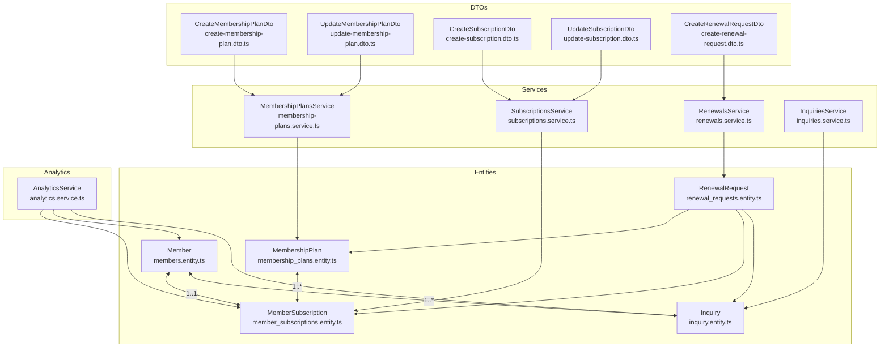
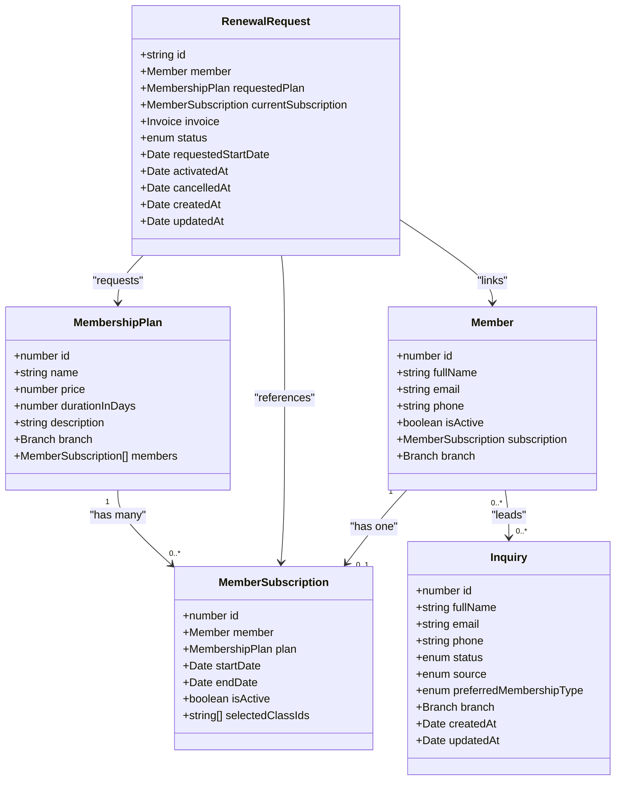
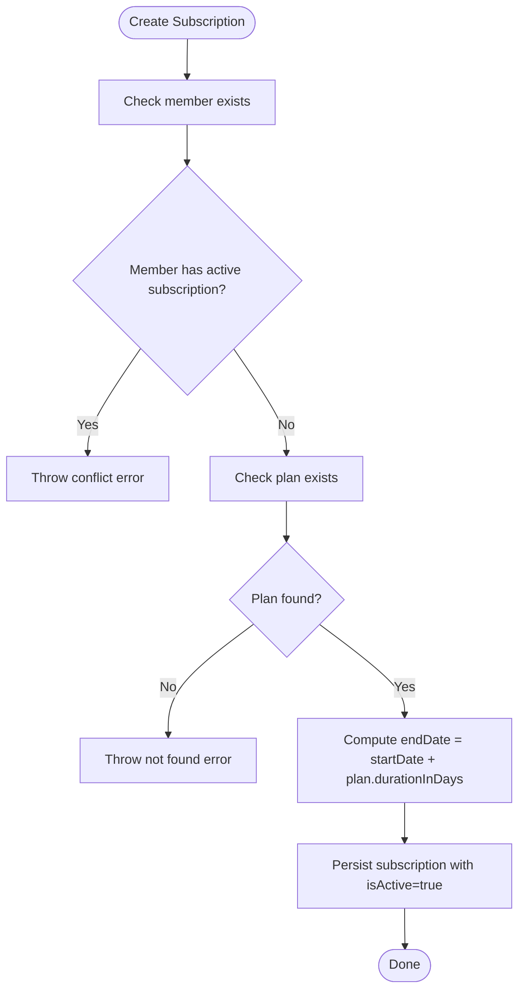
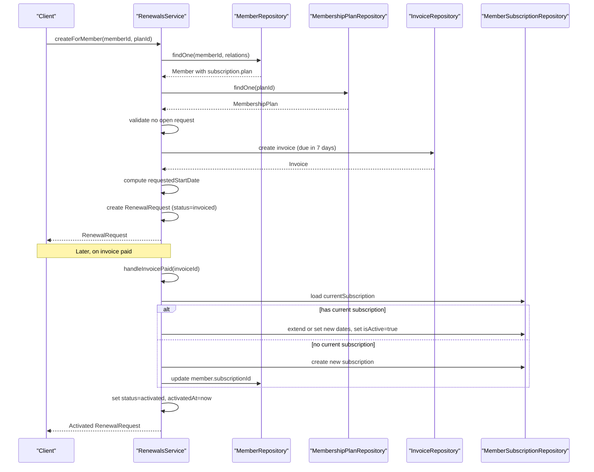
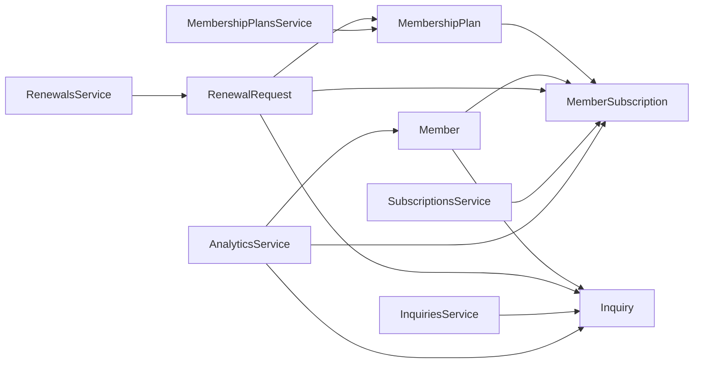

# Membership & Subscription Entities

<cite>
**Referenced Files in This Document**
- [membership_plans.entity.ts](file://src/entities/membership_plans.entity.ts)
- [member_subscriptions.entity.ts](file://src/entities/member_subscriptions.entity.ts)
- [renewal_requests.entity.ts](file://src/entities/renewal_requests.entity.ts)
- [inquiry.entity.ts](file://src/entities/inquiry.entity.ts)
- [members.entity.ts](file://src/entities/members.entity.ts)
- [create-membership-plan.dto.ts](file://src/membership-plans/dto/create-membership-plan.dto.ts)
- [update-membership-plan.dto.ts](file://src/membership-plans/dto/update-membership-plan.dto.ts)
- [create-subscription.dto.ts](file://src/subscriptions/dto/create-subscription.dto.ts)
- [update-subscription.dto.ts](file://src/subscriptions/dto/update-subscription.dto.ts)
- [create-renewal-request.dto.ts](file://src/renewals/dto/create-renewal-request.dto.ts)
- [membership-plans.service.ts](file://src/membership-plans/membership-plans.service.ts)
- [subscriptions.service.ts](file://src/subscriptions/subscriptions.service.ts)
- [renewals.service.ts](file://src/renewals/renewals.service.ts)
- [inquiries.service.ts](file://src/inquiries/inquiries.service.ts)
- [analytics.service.ts](file://src/analytics/analytics.service.ts)
</cite>

## Table of Contents
1. [Introduction](#introduction)
2. [Project Structure](#project-structure)
3. [Core Components](#core-components)
4. [Architecture Overview](#architecture-overview)
5. [Detailed Component Analysis](#detailed-component-analysis)
6. [Dependency Analysis](#dependency-analysis)
7. [Performance Considerations](#performance-considerations)
8. [Troubleshooting Guide](#troubleshooting-guide)
9. [Conclusion](#conclusion)
10. [Appendices](#appendices)

## Introduction
This document provides comprehensive data model documentation for membership and subscription entities within the gym management system. It covers MembershipPlans, MemberSubscriptions, RenewalRequests, and Inquiries, detailing fields, validation rules, business constraints, and relationships. It also explains subscription lifecycle management, renewal workflows, cancellation processes, and data access patterns for reporting and analytics.

## Project Structure
The membership and subscription domain spans entities, DTOs, services, and analytics utilities. Entities define the relational schema; DTOs enforce validation; services encapsulate business logic; and analytics utilities expose reporting capabilities.

**Diagram sources**
- [membership_plans.entity.ts:11-33](file://src/entities/membership_plans.entity.ts#L11-L33)
- [member_subscriptions.entity.ts:14-70](file://src/entities/member_subscriptions.entity.ts#L14-L70)
- [members.entity.ts:22-123](file://src/entities/members.entity.ts#L22-L123)
- [renewal_requests.entity.ts:25-64](file://src/entities/renewal_requests.entity.ts#L25-L64)
- [inquiry.entity.ts:43-131](file://src/entities/inquiry.entity.ts#L43-L131)
- [create-membership-plan.dto.ts:11-44](file://src/membership-plans/dto/create-membership-plan.dto.ts#L11-L44)
- [update-membership-plan.dto.ts:4-6](file://src/membership-plans/dto/update-membership-plan.dto.ts#L4-L6)
- [create-subscription.dto.ts:10-32](file://src/subscriptions/dto/create-subscription.dto.ts#L10-L32)
- [update-subscription.dto.ts:6-24](file://src/subscriptions/dto/update-subscription.dto.ts#L6-L24)
- [create-renewal-request.dto.ts:4-12](file://src/renewals/dto/create-renewal-request.dto.ts#L4-L12)
- [membership-plans.service.ts:10-137](file://src/membership-plans/membership-plans.service.ts#L10-L137)
- [subscriptions.service.ts:15-151](file://src/subscriptions/subscriptions.service.ts#L15-L151)
- [renewals.service.ts:16-178](file://src/renewals/renewals.service.ts#L16-L178)
- [inquiries.service.ts:33-334](file://src/inquiries/inquiries.service.ts#L33-L334)
- [analytics.service.ts:21-646](file://src/analytics/analytics.service.ts#L21-L646)

**Section sources**
- [membership_plans.entity.ts:11-33](file://src/entities/membership_plans.entity.ts#L11-L33)
- [member_subscriptions.entity.ts:14-70](file://src/entities/member_subscriptions.entity.ts#L14-L70)
- [members.entity.ts:22-123](file://src/entities/members.entity.ts#L22-L123)
- [renewal_requests.entity.ts:25-64](file://src/entities/renewal_requests.entity.ts#L25-L64)
- [inquiry.entity.ts:43-131](file://src/entities/inquiry.entity.ts#L43-L131)

## Core Components

### MembershipPlans
- Purpose: Defines membership offerings with pricing, duration, and optional branch association.
- Key fields:
  - id: auto-generated primary key
  - name: string, required
  - price: integer (cents), required, minimum 0
  - durationInDays: integer (days), required, minimum 1
  - description: string, optional
  - branch: optional many-to-one relationship to Branch
  - members: one-to-many MemberSubscription entries
- Validation rules:
  - Name required and string
  - Price required, integer, minimum 0
  - Duration required, integer, minimum 1
  - Optional branchId via DTO
- Business constraints:
  - Plans are optionally scoped to a Branch
  - Each plan can have zero or more subscriptions
- Access patterns:
  - Filter by branchId, min/max price
  - Find by branch or gym (via nested relations)

**Section sources**
- [membership_plans.entity.ts:11-33](file://src/entities/membership_plans.entity.ts#L11-L33)
- [create-membership-plan.dto.ts:11-44](file://src/membership-plans/dto/create-membership-plan.dto.ts#L11-L44)
- [update-membership-plan.dto.ts:4-6](file://src/membership-plans/dto/update-membership-plan.dto.ts#L4-L6)
- [membership-plans.service.ts:45-63](file://src/membership-plans/membership-plans.service.ts#L45-L63)
- [membership-plans.service.ts:110-136](file://src/membership-plans/membership-plans.service.ts#L110-L136)

### MemberSubscriptions
- Purpose: Tracks individual member membership assignments, including start/end dates, active status, and selected classes.
- Key fields:
  - id: auto-generated primary key
  - member: one-to-one relationship to Member (cascading delete)
  - plan: many-to-one relationship to MembershipPlan
  - startDate: timestamp, required
  - endDate: timestamp, required
  - isActive: boolean, default true
  - selectedClassIds: array of UUIDs, optional
- Validation rules:
  - planId required and integer
  - startDate required date string
  - selectedClassId optional UUID string
  - Update supports toggling isActive and updating selectedClassIds
- Business constraints:
  - A member can have at most one active subscription at a time
  - Effective active state recalculated against current date
  - End date derived from plan duration plus start date
- Lifecycle:
  - Creation validates member absence of active subscription and plan existence
  - Updates recalculate end date when start date changes
  - Cancellation sets isActive false

**Section sources**
- [member_subscriptions.entity.ts:14-70](file://src/entities/member_subscriptions.entity.ts#L14-L70)
- [create-subscription.dto.ts:10-32](file://src/subscriptions/dto/create-subscription.dto.ts#L10-L32)
- [update-subscription.dto.ts:6-24](file://src/subscriptions/dto/update-subscription.dto.ts#L6-L24)
- [subscriptions.service.ts:26-67](file://src/subscriptions/subscriptions.service.ts#L26-L67)
- [subscriptions.service.ts:112-140](file://src/subscriptions/subscriptions.service.ts#L112-L140)

### RenewalRequests
- Purpose: Manages subscription renewal requests, linking to member, plan, current subscription, and invoice.
- Key fields:
  - id: UUID primary key
  - member: many-to-one relationship to Member (cascade delete)
  - requestedPlan: many-to-one relationship to MembershipPlan
  - currentSubscription: optional many-to-one to MemberSubscription
  - invoice: one-to-one relationship to Invoice
  - status: enum with transitions: requested → invoiced → paid → activated; can be cancelled or expired
  - requestedStartDate: timestamp
  - activatedAt: optional timestamp
  - cancelledAt: optional timestamp
  - createdAt/updatedAt: timestamps
- Validation rules:
  - planId required and integer ≥ 1
- Business constraints:
  - Only one open renewal request per member (requested/invoiced/paid)
  - requestedStartDate is either next day after current active subscription end or now
  - On invoice paid, either extend current subscription or create new one and update member.subscriptionId
- Workflow:
  - Create renewal request → invoice created → paid → activated
  - Cancel allowed only if not yet activated

**Section sources**
- [renewal_requests.entity.ts:16-64](file://src/entities/renewal_requests.entity.ts#L16-L64)
- [create-renewal-request.dto.ts:4-12](file://src/renewals/dto/create-renewal-request.dto.ts#L4-L12)
- [renewals.service.ts:32-94](file://src/renewals/renewals.service.ts#L32-L94)
- [renewals.service.ts:109-122](file://src/renewals/renewals.service.ts#L109-L122)
- [renewals.service.ts:124-177](file://src/renewals/renewals.service.ts#L124-L177)

### Inquiries
- Purpose: Captures lead management data including status, source, preferences, and contact details.
- Key fields:
  - id: auto-generated primary key
  - fullName, email (unique), phone, alternatePhone
  - status: enum with transitions and timestamps
  - source: enum of marketing channels
  - preferredMembershipType: optional enum
  - preferredContactMethod, notes, address fields, dateOfBirth, occupation, fitnessGoals
  - hasPreviousGymExperience, wantsPersonalTraining, referralCode
  - branch: optional many-to-one relationship to Branch
  - branchId: optional string
  - createdAt/updatedAt plus timestamps for status transitions
- Validation rules:
  - Email uniqueness enforced at persistence level
  - Status transitions update corresponding timestamps
- Business constraints:
  - Filters support status, source, branchId, email/phone/fullName partial matches, date range, and convertedOnly flag
- Access patterns:
  - Paginated listing with filters and sorting
  - Stats aggregation by status/source and conversion rate

**Section sources**
- [inquiry.entity.ts:43-131](file://src/entities/inquiry.entity.ts#L43-L131)
- [inquiries.service.ts:40-67](file://src/inquiries/inquiries.service.ts#L40-L67)
- [inquiries.service.ts:69-154](file://src/inquiries/inquiries.service.ts#L69-L154)
- [inquiries.service.ts:268-308](file://src/inquiries/inquiries.service.ts#L268-L308)

## Architecture Overview
The membership and subscription domain centers around four core entities with clear relationships:
- MembershipPlan defines offerings linked to Branch
- MemberSubscriptions associate Members with MembershipPlans and track lifecycle dates and activity
- RenewalRequests orchestrate renewal workflows and tie to Invoices
- Inquiries capture leads and can be converted to members

**Diagram sources**
- [membership_plans.entity.ts:11-33](file://src/entities/membership_plans.entity.ts#L11-L33)
- [member_subscriptions.entity.ts:14-70](file://src/entities/member_subscriptions.entity.ts#L14-L70)
- [members.entity.ts:22-123](file://src/entities/members.entity.ts#L22-L123)
- [renewal_requests.entity.ts:25-64](file://src/entities/renewal_requests.entity.ts#L25-L64)
- [inquiry.entity.ts:43-131](file://src/entities/inquiry.entity.ts#L43-L131)

## Detailed Component Analysis

### MembershipPlans Entity
- Fields and types:
  - id: number (primary key)
  - name: string
  - price: integer (cents)
  - durationInDays: integer (days)
  - description: string (nullable)
  - branch: MembershipPlan → Branch (many-to-one, nullable)
  - members: MembershipPlan → MemberSubscription (one-to-many)
- Validation:
  - DTO enforces non-empty name, non-negative price, positive duration, optional branchId
- Business rules:
  - Optional branch scoping
  - Pricing stored in cents for precision
- Access patterns:
  - Find all with optional branchId/minPrice/maxPrice filters
  - Find by branch or gym via nested relations

**Section sources**
- [membership_plans.entity.ts:11-33](file://src/entities/membership_plans.entity.ts#L11-L33)
- [create-membership-plan.dto.ts:11-44](file://src/membership-plans/dto/create-membership-plan.dto.ts#L11-L44)
- [membership-plans.service.ts:45-63](file://src/membership-plans/membership-plans.service.ts#L45-L63)
- [membership-plans.service.ts:110-136](file://src/membership-plans/membership-plans.service.ts#L110-L136)

### MemberSubscriptions Entity
- Fields and types:
  - id: number (primary key)
  - member: MemberSubscription → Member (one-to-one, cascading delete)
  - plan: MemberSubscription → MembershipPlan (many-to-one)
  - startDate: Date
  - endDate: Date
  - isActive: boolean (default true)
  - selectedClassIds: string[] (UUID array, nullable)
- Validation:
  - Create: planId, startDate required; optional selectedClassId
  - Update: optional isActive, selectedClassIds; startDate triggers end date recalculation
- Business rules:
  - Member cannot have multiple active subscriptions
  - Effective active state computed against current date
  - End date equals start date plus plan duration
- Lifecycle:
  - Create validates member and plan, calculates end date
  - Update adjusts start/end dates and flags
  - Cancel sets isActive false

**Diagram sources**
- [subscriptions.service.ts:26-67](file://src/subscriptions/subscriptions.service.ts#L26-L67)

**Section sources**
- [member_subscriptions.entity.ts:14-70](file://src/entities/member_subscriptions.entity.ts#L14-L70)
- [create-subscription.dto.ts:10-32](file://src/subscriptions/dto/create-subscription.dto.ts#L10-L32)
- [update-subscription.dto.ts:6-24](file://src/subscriptions/dto/update-subscription.dto.ts#L6-L24)
- [subscriptions.service.ts:26-67](file://src/subscriptions/subscriptions.service.ts#L26-L67)
- [subscriptions.service.ts:112-140](file://src/subscriptions/subscriptions.service.ts#L112-L140)

### RenewalRequests Entity
- Fields and types:
  - id: string (UUID)
  - member: Member (many-to-one, cascade delete)
  - requestedPlan: MembershipPlan (many-to-one)
  - currentSubscription: MemberSubscription (nullable)
  - invoice: Invoice (one-to-one)
  - status: enum (requested → invoiced → paid → activated; cancelled/expired)
  - requestedStartDate: Date
  - activatedAt/cancelledAt: Date (nullable)
  - createdAt/updatedAt: Date
- Validation:
  - planId required integer ≥ 1
- Business rules:
  - Only one open renewal request per member
  - requestedStartDate is next day after current active subscription end or now
  - On invoice paid, either extend current subscription or create new one and update member.subscriptionId
- Workflow:

**Diagram sources**
- [renewals.service.ts:32-94](file://src/renewals/renewals.service.ts#L32-L94)
- [renewals.service.ts:124-177](file://src/renewals/renewals.service.ts#L124-L177)

**Section sources**
- [renewal_requests.entity.ts:16-64](file://src/entities/renewal_requests.entity.ts#L16-L64)
- [create-renewal-request.dto.ts:4-12](file://src/renewals/dto/create-renewal-request.dto.ts#L4-L12)
- [renewals.service.ts:32-94](file://src/renewals/renewals.service.ts#L32-L94)
- [renewals.service.ts:124-177](file://src/renewals/renewals.service.ts#L124-L177)

### Inquiries Entity
- Fields and types:
  - id: number (primary key)
  - fullName, email (unique), phone, alternatePhone
  - status: enum with timestamps for transitions
  - source: enum of channels
  - preferredMembershipType: enum (nullable)
  - branch: Branch (nullable)
  - branchId: string (nullable)
  - createdAt/updatedAt plus contactedAt/convertedAt/closedAt
- Validation:
  - Email uniqueness enforced
  - Status transitions update timestamps automatically
- Access patterns:
  - Paginated listing with filters and sorting
  - Stats by status/source and conversion rate
  - Convert to member updates status and notes

**Section sources**
- [inquiry.entity.ts:43-131](file://src/entities/inquiry.entity.ts#L43-L131)
- [inquiries.service.ts:40-67](file://src/inquiries/inquiries.service.ts#L40-L67)
- [inquiries.service.ts:69-154](file://src/inquiries/inquiries.service.ts#L69-L154)
- [inquiries.service.ts:268-308](file://src/inquiries/inquiries.service.ts#L268-L308)

## Dependency Analysis
- Entities:
  - MembershipPlan ←→ MemberSubscription (many-to-one)
  - Member ←→ MemberSubscription (one-to-one)
  - Member ←→ Inquiry (one-to-many)
  - RenewalRequest links Member, MembershipPlan, MemberSubscription, and Invoice
- Services:
  - MembershipPlansService depends on MembershipPlan, Branch, and Gym repositories
  - SubscriptionsService depends on Member, MembershipPlan, and MemberSubscription repositories
  - RenewalsService depends on Member, MembershipPlan, MemberSubscription, Invoice, and RemindersService
  - InquiriesService depends on Inquiry repository
- Analytics:
  - AnalyticsService aggregates Member, MemberSubscription, Attendance, Invoice, PaymentTransaction for reporting

**Diagram sources**
- [membership_plans.entity.ts:11-33](file://src/entities/membership_plans.entity.ts#L11-L33)
- [member_subscriptions.entity.ts:14-70](file://src/entities/member_subscriptions.entity.ts#L14-L70)
- [members.entity.ts:22-123](file://src/entities/members.entity.ts#L22-L123)
- [renewal_requests.entity.ts:25-64](file://src/entities/renewal_requests.entity.ts#L25-L64)
- [inquiry.entity.ts:43-131](file://src/entities/inquiry.entity.ts#L43-L131)
- [membership-plans.service.ts:10-19](file://src/membership-plans/membership-plans.service.ts#L10-L19)
- [subscriptions.service.ts:15-24](file://src/subscriptions/subscriptions.service.ts#L15-L24)
- [renewals.service.ts:16-30](file://src/renewals/renewals.service.ts#L16-L30)
- [inquiries.service.ts:33-38](file://src/inquiries/inquiries.service.ts#L33-L38)
- [analytics.service.ts:21-44](file://src/analytics/analytics.service.ts#L21-L44)

**Section sources**
- [membership-plans.service.ts:10-19](file://src/membership-plans/membership-plans.service.ts#L10-L19)
- [subscriptions.service.ts:15-24](file://src/subscriptions/subscriptions.service.ts#L15-L24)
- [renewals.service.ts:16-30](file://src/renewals/renewals.service.ts#L16-L30)
- [inquiries.service.ts:33-38](file://src/inquiries/inquiries.service.ts#L33-L38)
- [analytics.service.ts:21-44](file://src/analytics/analytics.service.ts#L21-L44)

## Performance Considerations
- Indexing and filtering:
  - Use branchId, status, and date ranges for efficient querying in analytics and listings
  - Prefer joins with relations (e.g., subscription → member, inquiry → branch) to avoid N+1
- Aggregation:
  - AnalyticsService computes counts and sums using raw SQL queries to minimize payload sizes
  - Effective active membership filtering uses date comparisons and boolean flags
- Pagination:
  - InquiriesService supports paginated results with skip/take and total counts
- Recommendations:
  - Add database indexes on frequently filtered columns (e.g., member.subscriptionId, subscription.isActive, subscription.endDate)
  - Cache frequently accessed plan lists by branch/gym

[No sources needed since this section provides general guidance]

## Troubleshooting Guide
- Common errors and causes:
  - Member already has an active subscription when creating a new subscription
  - Non-existent membership plan ID during subscription creation
  - Existing open renewal request per member
  - Attempting to cancel an already activated renewal request
  - Inquiry with duplicate email
- Resolution steps:
  - Verify member’s current subscription status before creating a new subscription
  - Confirm plan existence and branch/gym scoping when listing plans
  - Ensure renewal request status is not ACTIVATED before cancellation
  - Enforce email uniqueness for inquiries and handle conflicts gracefully

**Section sources**
- [subscriptions.service.ts:36-39](file://src/subscriptions/subscriptions.service.ts#L36-L39)
- [subscriptions.service.ts:42-49](file://src/subscriptions/subscriptions.service.ts#L42-L49)
- [renewals.service.ts:48-62](file://src/renewals/renewals.service.ts#L48-L62)
- [renewals.service.ts:115-117](file://src/renewals/renewals.service.ts#L115-L117)
- [inquiries.service.ts:43-50](file://src/inquiries/inquiries.service.ts#L43-L50)

## Conclusion
The membership and subscription domain is modeled with clear relationships and robust validation rules. MembershipPlans define offerings, MemberSubscriptions track active memberships, RenewalRequests manage renewal workflows, and Inquiries support lead conversion. Services encapsulate business logic, while analytics utilities enable reporting and insights. Adhering to the documented constraints and access patterns ensures data integrity and efficient operations.

[No sources needed since this section summarizes without analyzing specific files]

## Appendices

### Subscription Lifecycle Management
- Creation: Validates member and plan, computes end date, sets isActive true
- Updates: Supports changing start date (recalculates end date), toggling isActive, updating selected classes
- Cancellation: Sets isActive false
- Renewal: Creates invoice, transitions statuses, extends or creates new subscription upon payment

**Section sources**
- [subscriptions.service.ts:26-67](file://src/subscriptions/subscriptions.service.ts#L26-L67)
- [subscriptions.service.ts:112-140](file://src/subscriptions/subscriptions.service.ts#L112-L140)
- [renewals.service.ts:32-94](file://src/renewals/renewals.service.ts#L32-L94)
- [renewals.service.ts:124-177](file://src/renewals/renewals.service.ts#L124-L177)

### Data Access Patterns for Reporting and Analytics
- Effective active members:
  - Count distinct members where subscription.isActive = true and subscription.endDate ≥ today
  - Filter by branchId(s) and member.isActive = true
- Expiring members:
  - Count subscriptions expiring today or within next few days
- Pending dues:
  - Count invoices with status = pending and sum totals per branch
- Revenue and growth:
  - Aggregate completed payments minus refunds, compare month-over-month
- Member analytics:
  - Total, active, inactive, expiring today/period, birthdays, pending dues

**Section sources**
- [analytics.service.ts:66-92](file://src/analytics/analytics.service.ts#L66-L92)
- [analytics.service.ts:150-226](file://src/analytics/analytics.service.ts#L150-L226)
- [analytics.service.ts:676-784](file://src/analytics/analytics.service.ts#L676-L784)

### Examples of Complex Queries for Subscription Reporting and Member Analytics
- Effective active membership count by branch:
  - Join MemberSubscription with Member on branchId filter, apply isActive and endDate conditions, count distinct members
- Expiring subscriptions in the next 10 days:
  - Filter subscriptions by date range and isActive, join with Member, group by branch
- Pending invoices and total amounts:
  - Join Invoice with Member, filter by status = pending, group by branch and aggregate totals
- Revenue month-over-month:
  - Sum completed payments minus refunds, partition by month, compare current vs previous month

**Section sources**
- [analytics.service.ts:150-226](file://src/analytics/analytics.service.ts#L150-L226)
- [analytics.service.ts:406-587](file://src/analytics/analytics.service.ts#L406-L587)
- [analytics.service.ts:676-784](file://src/analytics/analytics.service.ts#L676-L784)